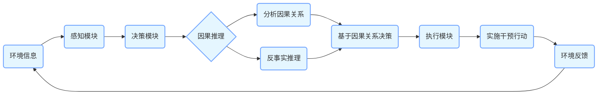

# 构建具有因果推理与干预能力的AI Agent

> 关键词：AI Agent、因果推理、干预能力、因果模型、机器学习

> 摘要：本文聚焦于构建具有因果推理与干预能力的AI Agent。首先介绍了相关背景知识，包括目的范围、预期读者等。接着深入讲解了因果推理与AI Agent的核心概念及其联系，通过文本示意图和Mermaid流程图进行清晰展示。详细阐述了核心算法原理，并用Python代码进行了说明。给出了数学模型和公式，并举例解释。通过项目实战展示了代码的实际应用和详细解读。探讨了其实际应用场景，推荐了学习资源、开发工具框架以及相关论文著作。最后总结了未来发展趋势与挑战，并给出常见问题解答和扩展阅读参考资料，旨在为研究者和开发者提供全面的技术指导。

## 1. 背景介绍 
### 1.1 目的和范围
随着人工智能技术的不断发展，传统的AI系统主要基于相关性进行决策和预测，然而在许多复杂的现实场景中，仅仅依赖相关性是不够的，我们需要了解事件之间的因果关系，以便做出更合理、更具前瞻性的决策。构建具有因果推理与干预能力的AI Agent的目的在于使AI能够像人类一样理解事件背后的因果机制，从而在面对复杂问题时进行有效的干预。

本文章的范围涵盖了因果推理与干预能力的基本概念、核心算法原理、数学模型、项目实战、实际应用场景以及相关的工具和资源推荐等方面，旨在为读者提供一个全面且深入的技术指南，帮助读者掌握构建具有因果推理与干预能力的AI Agent的关键技术。

### 1.2 预期读者
本文预期读者包括人工智能领域的研究者、开发者、数据科学家、机器学习工程师以及对因果推理和AI Agent感兴趣的技术爱好者。无论是想要深入研究因果推理理论的学术人员，还是希望将因果推理应用到实际项目中的工程人员，都能从本文中获取有价值的信息。

### 1.3 文档结构概述
本文将按照以下结构进行组织：首先介绍因果推理与AI Agent的核心概念及其联系，通过直观的示意图和流程图帮助读者理解；接着详细讲解核心算法原理，并给出Python代码示例；然后阐述相关的数学模型和公式，并通过具体例子进行说明；之后通过项目实战展示如何在实际中应用这些技术；探讨实际应用场景；推荐相关的学习资源、开发工具框架和论文著作；最后总结未来发展趋势与挑战，给出常见问题解答和扩展阅读参考资料。

### 1.4 术语表
#### 1.4.1 核心术语定义
- **AI Agent**：能够感知环境、进行决策并采取行动的人工智能实体。它可以根据环境的反馈不断调整自己的行为，以实现特定的目标。
- **因果推理**：研究事件之间因果关系的过程，旨在从数据中识别出哪些变量是原因，哪些变量是结果，以及原因如何导致结果的发生。
- **干预**：在因果推理中，干预是指主动改变某个变量的值，以观察其对其他变量的影响，从而验证因果关系并进行决策。
- **因果模型**：用于表示变量之间因果关系的数学模型，常见的有因果图模型和结构因果模型等。

#### 1.4.2 相关概念解释
- **相关性与因果性**：相关性是指两个变量之间的统计关联，而因果性则表示一个变量的变化直接导致另一个变量的变化。例如，冰淇淋销量和溺水人数之间存在相关性，但并非因果关系，它们都受到气温这个共同因素的影响。
- **反事实推理**：在因果推理中，反事实推理是指想象如果某个原因没有发生，结果会如何变化。例如，我们可以想象如果一个人没有吸烟，他患肺癌的概率会是多少。

#### 1.4.3 缩略词列表
- **DAG**：Directed Acyclic Graph，有向无环图，常用于表示因果关系的结构。
- **SCM**：Structural Causal Model，结构因果模型，是一种基于图模型的因果表示方法。

## 2. 核心概念与联系 

### 核心概念原理
#### AI Agent
AI Agent是一个自主的系统，它可以感知环境中的信息，根据这些信息进行决策，并采取相应的行动。一个典型的AI Agent包括感知模块、决策模块和执行模块。感知模块负责收集环境信息，决策模块根据感知到的信息和预设的目标进行决策，执行模块则将决策转化为实际的行动。

#### 因果推理
因果推理的核心目标是从数据中发现因果关系。传统的统计方法主要关注变量之间的相关性，而因果推理则试图区分相关性和因果性。因果推理的方法包括基于因果图的方法、基于干预的方法和基于反事实推理的方法等。

#### 干预能力
干预能力是指AI Agent能够主动改变环境中的某些变量，以验证因果关系并实现特定的目标。例如，在医疗领域，AI Agent可以通过改变治疗方案（干预变量）来观察患者的病情变化（结果变量），从而确定最佳的治疗方案。

### 架构的文本示意图
```plaintext
AI Agent
├── 感知模块
│   └── 收集环境信息
├── 决策模块
│   ├── 因果推理
│   │   ├── 分析因果关系
│   │   └── 进行反事实推理
│   └── 基于因果关系进行决策
└── 执行模块
    └── 实施干预行动
```

### Mermaid流程图


这个流程图展示了AI Agent的工作流程。首先，感知模块从环境中收集信息，然后将其传递给决策模块。决策模块进行因果推理，包括分析因果关系和进行反事实推理，根据推理结果做出决策。执行模块将决策转化为实际的干预行动，干预行动会对环境产生影响，环境反馈的信息又会被感知模块收集，形成一个闭环。

## 3. 核心算法原理 & 具体操作步骤 

### 核心算法原理
在构建具有因果推理与干预能力的AI Agent中，一个常用的方法是基于因果图模型。因果图是一种有向无环图（DAG），其中节点表示变量，有向边表示因果关系。下面我们将详细介绍基于因果图的因果推理算法。

#### 因果图的构建
因果图的构建是因果推理的第一步。可以通过领域知识、专家经验或数据驱动的方法来构建因果图。数据驱动的方法包括基于约束的方法（如PC算法）和基于评分的方法（如GES算法）。

#### 因果效应的估计
一旦因果图构建完成，就可以使用它来估计因果效应。常见的因果效应估计方法包括后门调整、前门调整和工具变量法等。

### 具体操作步骤
#### 步骤1：数据收集
收集与问题相关的数据集，包括所有可能的变量。

#### 步骤2：因果图构建
使用合适的方法构建因果图。下面是一个使用Python的`pcalg`库实现PC算法构建因果图的示例代码：
```python
import numpy as np
import pandas as pd
from causallearn.search.ConstraintBased.PC import pc
from causallearn.utils.cit import fisherz

# 生成示例数据
np.random.seed(0)
data = np.random.randn(100, 3)
df = pd.DataFrame(data, columns=['X', 'Y', 'Z'])

# 构建因果图
cg = pc(df.values, alpha=0.05, indep_test=fisherz)

# 打印因果图
print(cg.G)
```
在这个代码中，我们首先生成了一个包含三个变量的示例数据集，然后使用PC算法构建因果图。`alpha`参数是显著性水平，`indep_test`参数指定了独立性检验的方法。

#### 步骤3：因果效应估计
使用构建好的因果图进行因果效应估计。下面是一个使用后门调整方法估计因果效应的示例代码：
```python
import numpy as np
import pandas as pd
import dowhy.api

# 生成示例数据
np.random.seed(0)
data = pd.DataFrame({
    'X': np.random.randn(100),
    'Z': np.random.randn(100),
    'Y': 2 * np.random.randn(100) + 3 * np.random.randn(100) * np.random.randn(100) + np.random.randn(100)
})

# 添加因果关系
data = data.causal.do('X',
                      method='backdoor',
                      variable_types={'X': 'c', 'Y': 'c', 'Z': 'c'},
                      outcome='Y',
                      common_causes=['Z'])

# 计算因果效应
treatment_effect = data['Y'].mean() - data.causal.do('X', method='backdoor', variable_types={'X': 'c', 'Y': 'c', 'Z': 'c'}, outcome='Y', common_causes=['Z'])['Y'].mean()
print("因果效应:", treatment_effect)
```
在这个代码中，我们首先生成了一个包含三个变量的示例数据集，然后使用`dowhy`库的`do`方法进行后门调整，最后计算因果效应。

#### 步骤4：干预决策
根据因果效应的估计结果，AI Agent可以做出干预决策。例如，如果因果效应为正，说明增加原因变量的值可以提高结果变量的值，那么AI Agent可以选择增加原因变量的值。

## 4. 数学模型和公式 & 详细讲解 & 举例说明 

### 因果图模型
因果图是一种有向无环图（DAG） $G=(V, E)$，其中 $V$ 是节点的集合，表示变量，$E$ 是有向边的集合，表示因果关系。对于因果图中的每个节点 $X_i$，它的父节点集合记为 $Pa(X_i)$。

### 结构因果模型（SCM）
结构因果模型是一种基于因果图的数学模型，它由一组结构方程和一个外生变量的概率分布组成。对于每个变量 $X_i$，它的结构方程可以表示为：
$$X_i = f_i(Pa(X_i), U_i)$$
其中 $f_i$ 是一个确定性的函数，$U_i$ 是外生变量，表示未被建模的随机因素。

### 因果效应的估计
#### 后门调整
后门调整是一种常用的因果效应估计方法。假设我们想要估计原因变量 $X$ 对结果变量 $Y$ 的因果效应，我们需要找到一组变量 $Z$，满足后门准则。后门准则要求 $Z$ 能够阻断所有从 $X$ 到 $Y$ 的后门路径（即不经过 $X$ 到 $Y$ 的有向路径）。

根据后门调整公式，$X$ 对 $Y$ 的因果效应可以表示为：
$$P(Y=y|do(X=x)) = \sum_{z} P(Y=y|X=x, Z=z)P(Z=z)$$

#### 举例说明
假设我们有一个数据集，包含三个变量：$X$（治疗方案）、$Z$（年龄）和 $Y$（康复情况）。我们想要估计治疗方案 $X$ 对康复情况 $Y$ 的因果效应。

首先，我们构建因果图，发现年龄 $Z$ 是一个混杂因素，满足后门准则。然后，我们可以使用后门调整公式来估计因果效应。

假设我们有以下数据：
| $X$ | $Z$ | $Y$ | 数量 |
| --- | --- | --- | --- |
| 0 | 0 | 0 | 10 |
| 0 | 0 | 1 | 20 |
| 0 | 1 | 0 | 15 |
| 0 | 1 | 1 | 25 |
| 1 | 0 | 0 | 5 |
| 1 | 0 | 1 | 25 |
| 1 | 1 | 0 | 10 |
| 1 | 1 | 1 | 30 |

我们可以计算 $P(Z=0) = \frac{10 + 20 + 5 + 25}{10 + 20 + 15 + 25 + 5 + 25 + 10 + 30} = 0.4$，$P(Z=1) = 0.6$。

当 $X = 0$ 时：
$P(Y = 1|X = 0, Z = 0) = \frac{20}{10 + 20} = \frac{2}{3}$，$P(Y = 1|X = 0, Z = 1) = \frac{25}{15 + 25} = \frac{5}{8}$。

当 $X = 1$ 时：
$P(Y = 1|X = 1, Z = 0) = \frac{25}{5 + 25} = \frac{5}{6}$，$P(Y = 1|X = 1, Z = 1) = \frac{30}{10 + 30} = \frac{3}{4}$。

根据后门调整公式：
$P(Y = 1|do(X = 0)) = P(Y = 1|X = 0, Z = 0)P(Z = 0) + P(Y = 1|X = 0, Z = 1)P(Z = 1) = \frac{2}{3} \times 0.4 + \frac{5}{8} \times 0.6 \approx 0.61$
$P(Y = 1|do(X = 1)) = P(Y = 1|X = 1, Z = 0)P(Z = 0) + P(Y = 1|X = 1, Z = 1)P(Z = 1) = \frac{5}{6} \times 0.4 + \frac{3}{4} \times 0.6 \approx 0.72$

所以，治疗方案 $X$ 对康复情况 $Y$ 的因果效应为 $0.72 - 0.61 = 0.11$。

## 5. 项目实战：代码实际案例和详细解释说明 

### 5.1  开发环境搭建
#### 安装Python
首先，确保你已经安装了Python 3.x版本。可以从Python官方网站（https://www.python.org/downloads/）下载并安装。

#### 安装必要的库
我们需要安装一些必要的Python库，包括`pandas`、`numpy`、`causallearn`、`dowhy`等。可以使用以下命令进行安装：
```sh
pip install pandas numpy causallearn dowhy
```

### 5.2  源代码详细实现和代码解读
#### 数据生成
```python
import numpy as np
import pandas as pd

# 生成示例数据
np.random.seed(0)
data = pd.DataFrame({
    'X': np.random.randn(100),
    'Z': np.random.randn(100),
    'Y': 2 * np.random.randn(100) + 3 * np.random.randn(100) * np.random.randn(100) + np.random.randn(100)
})
```
这段代码生成了一个包含三个变量 $X$、$Z$ 和 $Y$ 的示例数据集。其中，$X$ 和 $Z$ 是随机生成的正态分布数据，$Y$ 是一个复杂的函数生成的数据。

#### 因果图构建
```python
from causallearn.search.ConstraintBased.PC import pc
from causallearn.utils.cit import fisherz

# 构建因果图
cg = pc(data.values, alpha=0.05, indep_test=fisherz)

# 打印因果图
print(cg.G)
```
这段代码使用`causallearn`库的`pc`函数构建因果图。`alpha`参数是显著性水平，`indep_test`参数指定了独立性检验的方法。最后打印出构建好的因果图。

#### 因果效应估计
```python
import dowhy.api

# 添加因果关系
data = data.causal.do('X',
                      method='backdoor',
                      variable_types={'X': 'c', 'Y': 'c', 'Z': 'c'},
                      outcome='Y',
                      common_causes=['Z'])

# 计算因果效应
treatment_effect = data['Y'].mean() - data.causal.do('X', method='backdoor', variable_types={'X': 'c', 'Y': 'c', 'Z': 'c'}, outcome='Y', common_causes=['Z'])['Y'].mean()
print("因果效应:", treatment_effect)
```
这段代码使用`dowhy`库的`do`方法进行后门调整，估计 $X$ 对 $Y$ 的因果效应。首先，对数据进行干预操作，然后计算干预前后 $Y$ 的均值差，得到因果效应。

### 5.3  代码解读与分析
#### 数据生成部分
数据生成部分使用`numpy`和`pandas`库生成示例数据。通过设置随机种子，保证每次运行代码生成的数据是一致的。

#### 因果图构建部分
因果图构建部分使用`causallearn`库的PC算法。PC算法是一种基于约束的因果图构建方法，它通过检验变量之间的独立性来确定因果关系。

#### 因果效应估计部分
因果效应估计部分使用`dowhy`库的后门调整方法。后门调整方法通过控制混杂因素来估计因果效应。在代码中，我们指定了变量类型、结果变量和共同原因变量，然后进行干预操作，最后计算因果效应。

## 6. 实际应用场景 
### 医疗领域
在医疗领域，具有因果推理与干预能力的AI Agent可以帮助医生做出更准确的诊断和治疗决策。例如，AI Agent可以分析患者的基因数据、临床症状和治疗历史等信息，构建因果图模型，估计不同治疗方案对患者病情的因果效应，从而为医生提供个性化的治疗建议。

### 金融领域
在金融领域，AI Agent可以用于风险评估和投资决策。通过分析市场数据、宏观经济指标和企业财务数据等，构建因果图模型，AI Agent可以识别出影响金融风险和投资回报的关键因素，进行因果推理和干预模拟，帮助投资者制定更合理的投资策略。

### 交通领域
在交通领域，AI Agent可以用于交通流量控制和优化。通过分析交通传感器数据、天气数据和交通事件数据等，构建因果图模型，AI Agent可以识别出影响交通流量的关键因素，如道路施工、交通事故等，进行因果推理和干预模拟，帮助交通管理部门制定更有效的交通控制策略，减少交通拥堵。

### 教育领域
在教育领域，AI Agent可以用于个性化学习和教学评估。通过分析学生的学习行为数据、考试成绩和教学资源使用情况等，构建因果图模型，AI Agent可以识别出影响学生学习效果的关键因素，如教学方法、学习时间等，进行因果推理和干预模拟，帮助教师制定更个性化的教学计划，提高教学质量。

## 7. 工具和资源推荐
### 7.1 学习资源推荐
#### 7.1.1 书籍推荐
- 《因果论：模型、推理和推断》（*Causality: Models, Reasoning, and Inference*）：作者是Judea Pearl，这本书是因果推理领域的经典著作，系统地介绍了因果推理的理论和方法。
- 《为什么：关于因果关系的新科学》（*The Book of Why: The New Science of Cause and Effect*）：作者是Judea Pearl和Dana Mackenzie，这本书以通俗易懂的语言介绍了因果推理的基本概念和应用，适合初学者阅读。

#### 7.1.2 在线课程
- Coursera上的“因果推理”（*Causal Inference*）课程：该课程由顶尖大学的教授授课，系统地介绍了因果推理的理论和方法，包括因果图模型、因果效应估计等内容。
- edX上的“数据科学中的因果推理”（*Causal Inference in Data Science*）课程：该课程结合实际案例，介绍了如何在数据科学中应用因果推理技术。

#### 7.1.3 技术博客和网站
- Causal AI Research：这是一个专注于因果人工智能研究的网站，提供了最新的研究成果、技术文章和开源代码等资源。
- Towards Data Science：这是一个数据科学领域的技术博客平台，上面有很多关于因果推理和AI Agent的文章。

### 7.2 开发工具框架推荐
#### 7.2.1 IDE和编辑器
- PyCharm：是一款专业的Python集成开发环境，提供了丰富的代码编辑、调试和分析功能，适合开发具有因果推理与干预能力的AI Agent。
- Jupyter Notebook：是一个交互式的开发环境，支持Python代码的编写、运行和可视化，适合进行数据探索和模型实验。

#### 7.2.2 调试和性能分析工具
- PDB：是Python自带的调试工具，可以帮助开发者定位代码中的问题。
- cProfile：是Python的性能分析工具，可以分析代码的运行时间和内存使用情况，帮助开发者优化代码性能。

#### 7.2.3 相关框架和库
- Causal-learn：是一个开源的因果推理库，提供了多种因果图构建和因果效应估计的算法，如PC算法、GES算法等。
- DoWhy：是一个用于因果推理的Python库，提供了简单易用的API，支持多种因果效应估计方法，如后门调整、前门调整等。

### 7.3 相关论文著作推荐
#### 7.3.1 经典论文
- “Causal Diagrams for Empirical Research”：作者是Judea Pearl，这篇论文介绍了因果图模型的基本概念和应用，是因果推理领域的经典之作。
- “Estimating Causal Effects from Observational Data”：作者是Paul R. Rosenbaum和Donald B. Rubin，这篇论文介绍了倾向得分匹配方法，是因果效应估计的重要方法之一。

#### 7.3.2 最新研究成果
- “Causal Representation Learning”：这是一篇关于因果表示学习的综述论文，介绍了因果表示学习的最新研究进展和应用。
- “Causal Inference for Machine Learning”：这篇论文探讨了如何将因果推理技术应用到机器学习中，提高机器学习模型的可解释性和泛化能力。

#### 7.3.3 应用案例分析
- “Causal Inference in Healthcare: A Review”：这篇论文介绍了因果推理在医疗领域的应用案例，包括疾病诊断、治疗效果评估等方面。
- “Causal Analysis in Finance: Applications and Challenges”：这篇论文介绍了因果推理在金融领域的应用案例，包括风险评估、投资决策等方面。

## 8. 总结：未来发展趋势与挑战
### 未来发展趋势
#### 与深度学习的融合
未来，具有因果推理与干预能力的AI Agent将与深度学习技术深度融合。深度学习在处理复杂的感知任务方面具有强大的能力，而因果推理可以为深度学习模型提供可解释性和因果关系的理解。通过将两者结合，可以构建更加强大、智能的AI系统。

#### 多领域应用拓展
随着技术的不断发展，具有因果推理与干预能力的AI Agent将在更多领域得到应用。除了医疗、金融、交通和教育等领域，还将在环境保护、农业、工业制造等领域发挥重要作用。

#### 因果表示学习的发展
因果表示学习是因果推理领域的一个新兴研究方向，旨在从数据中学习到因果相关的表示。未来，因果表示学习将取得更大的进展，为因果推理和AI Agent的发展提供更强大的技术支持。

### 挑战
#### 数据质量和数量
因果推理需要大量高质量的数据来构建准确的因果模型。然而，在实际应用中，数据往往存在噪声、缺失值和偏差等问题，这给因果推理带来了很大的挑战。此外，获取足够多的数据也需要耗费大量的时间和成本。

#### 因果关系的复杂性
现实世界中的因果关系往往非常复杂，存在多个原因变量和结果变量，以及复杂的因果链条和反馈机制。如何准确地识别和建模这些复杂的因果关系是一个巨大的挑战。

#### 计算复杂度
因果推理的算法通常具有较高的计算复杂度，尤其是在处理大规模数据和复杂因果图时。如何提高算法的计算效率，降低计算成本，是因果推理技术面临的一个重要挑战。

## 9. 附录：常见问题与解答
### 问题1：因果推理和相关性分析有什么区别？
相关性分析主要关注变量之间的统计关联，而因果推理则试图区分相关性和因果性，找出变量之间的因果关系。例如，冰淇淋销量和溺水人数之间存在相关性，但并非因果关系，它们都受到气温这个共同因素的影响。

### 问题2：如何判断一个变量是否是混杂因素？
一个变量如果同时影响原因变量和结果变量，并且不是原因变量和结果变量之间因果路径上的中间变量，那么它就是一个混杂因素。在因果推理中，需要控制混杂因素来准确估计因果效应。

### 问题3：因果图的构建方法有哪些？
因果图的构建方法主要包括基于约束的方法（如PC算法）和基于评分的方法（如GES算法）。基于约束的方法通过检验变量之间的独立性来确定因果关系，而基于评分的方法则通过评估不同因果图的得分来选择最优的因果图。

### 问题4：如何评估因果效应估计的准确性？
可以使用多种方法来评估因果效应估计的准确性，如交叉验证、敏感性分析等。交叉验证可以通过将数据集划分为训练集和测试集，在训练集上进行因果效应估计，在测试集上进行验证。敏感性分析可以通过改变模型的假设和参数，观察因果效应估计结果的变化，评估估计结果的稳定性。

## 10. 扩展阅读 & 参考资料
### 扩展阅读
- 《机器学习中的因果推理》（*Causal Inference in Machine Learning*）：这本书介绍了如何将因果推理技术应用到机器学习中，提高机器学习模型的可解释性和泛化能力。
- 《社会科学中的因果推理》（*Causal Inference in the Social Sciences*）：这本书介绍了因果推理在社会科学领域的应用，包括经济学、社会学、政治学等方面。

### 参考资料
- Pearl, J. (2009). *Causality: Models, Reasoning, and Inference*. Cambridge University Press.
- Pearl, J., & Mackenzie, D. (2018). *The Book of Why: The New Science of Cause and Effect*. Basic Books.
- Peters, J., Janzing, D., & Schölkopf, B. (2017). *Elements of Causal Inference: Foundations and Learning Algorithms*. MIT Press.

作者：AI天才研究院/AI Genius Institute & 禅与计算机程序设计艺术 /Zen And The Art of Computer Programming