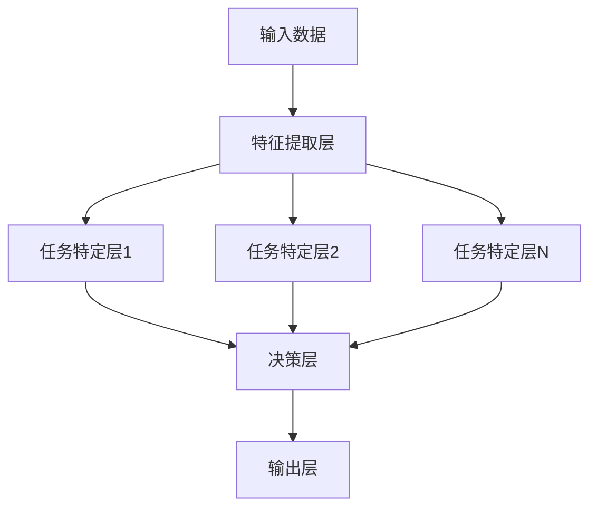

# 构建具有多任务学习能力的AI Agent

> 关键词：多任务学习、AI Agent、深度学习、强化学习、任务调度

> 摘要：本文聚焦于构建具有多任务学习能力的AI Agent这一核心主题。首先介绍了相关背景知识，包括目的、预期读者、文档结构等内容。接着深入阐述了多任务学习和AI Agent的核心概念及联系，详细讲解了核心算法原理并给出Python代码示例，同时分析了相关数学模型和公式。通过项目实战，展示了如何搭建开发环境、实现源代码并进行解读。还探讨了实际应用场景，推荐了学习资源、开发工具框架以及相关论文著作。最后对未来发展趋势与挑战进行总结，并提供了常见问题解答和扩展阅读参考资料，旨在为开发者和研究者提供全面的技术指导。

## 1. 背景介绍 
### 1.1 目的和范围
在当今复杂多变的现实世界中，单一任务的AI系统往往难以满足多样化的需求。构建具有多任务学习能力的AI Agent的主要目的在于让AI Agent能够同时处理多个不同类型的任务，提高其通用性和适应性。通过多任务学习，AI Agent可以在不同任务之间共享知识和特征，从而更高效地学习和执行任务。

本文的范围涵盖了多任务学习和AI Agent的基本概念、核心算法原理、数学模型、项目实战、实际应用场景等多个方面。旨在为读者提供一个全面而深入的了解，帮助他们掌握构建具有多任务学习能力的AI Agent的技术和方法。

### 1.2 预期读者
本文预期读者主要包括以下几类人群：
- 人工智能领域的研究者：希望深入了解多任务学习和AI Agent相关理论和技术，为进一步的研究提供参考。
- 软件开发工程师：想要学习如何构建具有多任务学习能力的AI Agent，将其应用到实际项目中。
- 机器学习爱好者：对多任务学习和AI Agent感兴趣，希望通过本文系统地学习相关知识。

### 1.3 文档结构概述
本文将按照以下结构进行组织：
- 核心概念与联系：介绍多任务学习和AI Agent的核心概念，以及它们之间的联系，并通过文本示意图和Mermaid流程图进行直观展示。
- 核心算法原理 & 具体操作步骤：详细讲解核心算法原理，并使用Python源代码进行具体实现。
- 数学模型和公式 & 详细讲解 & 举例说明：分析多任务学习和AI Agent相关的数学模型和公式，并通过具体例子进行说明。
- 项目实战：通过一个实际项目，展示如何搭建开发环境、实现源代码并进行解读。
- 实际应用场景：探讨具有多任务学习能力的AI Agent在不同领域的实际应用场景。
- 工具和资源推荐：推荐学习资源、开发工具框架以及相关论文著作。
- 总结：对未来发展趋势与挑战进行总结。
- 附录：提供常见问题解答和扩展阅读参考资料。

### 1.4 术语表
#### 1.4.1 核心术语定义
- **多任务学习（Multi - task Learning）**：指一个模型同时学习多个相关任务，通过在不同任务之间共享特征和参数，提高模型的泛化能力和学习效率。
- **AI Agent（人工智能智能体）**：是一个能够感知环境、做出决策并采取行动以实现特定目标的实体。
- **强化学习（Reinforcement Learning）**：一种机器学习范式，智能体通过与环境进行交互，根据环境反馈的奖励信号来学习最优的行为策略。

#### 1.4.2 相关概念解释
- **特征共享**：在多任务学习中，不同任务可以共享一部分特征表示，这样可以减少模型的参数数量，提高学习效率。
- **任务调度**：对于具有多任务学习能力的AI Agent，需要合理地安排任务的执行顺序和资源分配，以确保各个任务都能得到有效的处理。

#### 1.4.3 缩略词列表
- **ML**：机器学习（Machine Learning）
- **DL**：深度学习（Deep Learning）
- **RL**：强化学习（Reinforcement Learning）

## 2. 核心概念与联系 

### 核心概念原理
#### 多任务学习原理
多任务学习的核心思想是利用不同任务之间的相关性，让模型在学习过程中共享信息。例如，在图像识别任务中，不同的分类任务可能会共享一些底层的图像特征，如边缘、纹理等。通过共享这些特征，模型可以在不同任务之间进行知识迁移，提高学习效率和泛化能力。

从数学角度来看，多任务学习可以看作是一个联合优化问题。假设我们有 $N$ 个任务，每个任务的损失函数分别为 $L_1, L_2, \cdots, L_N$，则多任务学习的目标是最小化这些损失函数的加权和：

$$\min_{\theta} \sum_{i = 1}^{N} \alpha_i L_i(\theta)$$

其中，$\theta$ 是模型的参数，$\alpha_i$ 是每个任务的权重，用于控制每个任务在优化过程中的重要性。

#### AI Agent原理
AI Agent是一个具有自主性、反应性和目标导向性的实体。它通过传感器感知环境信息，然后根据内部的决策机制做出决策，并通过执行器采取行动。AI Agent的决策机制可以基于多种算法，如强化学习、深度学习等。

在强化学习中，AI Agent与环境进行交互，根据环境反馈的奖励信号来学习最优的行为策略。具体来说，AI Agent在每个时间步 $t$ 观察环境状态 $s_t$，选择一个动作 $a_t$ 执行，然后环境会反馈一个奖励 $r_t$ 和下一个状态 $s_{t+1}$。AI Agent的目标是最大化长期累积奖励：

$$\max_{\pi} E\left[\sum_{t = 0}^{\infty} \gamma^t r_t\right]$$

其中，$\pi$ 是AI Agent的行为策略，$\gamma$ 是折扣因子，用于控制未来奖励的重要性。

### 架构的文本示意图
```plaintext
多任务学习AI Agent架构

输入层：接收来自不同任务的输入数据
|
特征提取层：提取输入数据的共享特征
|
任务特定层：为每个任务生成特定的特征表示
|
决策层：根据任务特定特征和共享特征做出决策
|
输出层：输出每个任务的结果
```

### Mermaid流程图


## 3. 核心算法原理 & 具体操作步骤 

### 核心算法原理
#### 多任务学习算法
一种常见的多任务学习算法是硬参数共享（Hard Parameter Sharing）。在这种算法中，不同任务共享一部分底层的神经网络层，而每个任务有自己的顶层输出层。具体来说，模型的结构可以分为共享层和任务特定层。

共享层用于提取输入数据的通用特征，这些特征对于所有任务都是有用的。任务特定层则根据共享层的输出，为每个任务生成特定的特征表示，并进行最终的预测。

#### 强化学习算法
在构建具有多任务学习能力的AI Agent时，可以使用强化学习算法来学习任务的执行策略。一种常用的强化学习算法是深度Q网络（Deep Q - Network，DQN）。

DQN的核心思想是使用一个神经网络来近似Q值函数，Q值函数表示在某个状态下采取某个动作的预期累积奖励。具体来说，DQN通过不断地与环境进行交互，收集经验数据 $(s_t, a_t, r_t, s_{t+1})$，并使用这些数据来更新神经网络的参数，以使得Q值函数的估计更加准确。

### 具体操作步骤
#### 步骤1：数据准备
首先，需要收集和整理不同任务的数据集。对于每个任务，需要将数据划分为训练集、验证集和测试集。

#### 步骤2：模型构建
构建一个具有硬参数共享结构的神经网络模型。模型的共享层可以使用卷积神经网络（CNN）或循环神经网络（RNN）等，任务特定层可以使用全连接层。

#### 步骤3：训练模型
使用多任务学习的目标函数来训练模型。在训练过程中，可以使用随机梯度下降（SGD）或其变种（如Adam、Adagrad等）来更新模型的参数。

#### 步骤4：强化学习训练
如果需要使用强化学习来学习任务的执行策略，可以使用DQN算法进行训练。在训练过程中，需要不断地与环境进行交互，收集经验数据并更新Q值网络的参数。

### Python源代码实现
```python
import torch
import torch.nn as nn
import torch.optim as optim

# 定义共享层
class SharedLayer(nn.Module):
    def __init__(self):
        super(SharedLayer, self).__init__()
        self.fc1 = nn.Linear(10, 20)
        self.relu = nn.ReLU()

    def forward(self, x):
        x = self.fc1(x)
        x = self.relu(x)
        return x

# 定义任务特定层
class TaskSpecificLayer(nn.Module):
    def __init__(self):
        super(TaskSpecificLayer, self).__init__()
        self.fc2 = nn.Linear(20, 1)

    def forward(self, x):
        x = self.fc2(x)
        return x

# 定义多任务学习模型
class MultiTaskModel(nn.Module):
    def __init__(self, num_tasks):
        super(MultiTaskModel, self).__init__()
        self.shared_layer = SharedLayer()
        self.task_specific_layers = nn.ModuleList([TaskSpecificLayer() for _ in range(num_tasks)])

    def forward(self, x):
        shared_features = self.shared_layer(x)
        outputs = []
        for task_layer in self.task_specific_layers:
            output = task_layer(shared_features)
            outputs.append(output)
        return outputs

# 初始化模型
num_tasks = 3
model = MultiTaskModel(num_tasks)

# 定义损失函数和优化器
criterion = nn.MSELoss()
optimizer = optim.Adam(model.parameters(), lr=0.001)

# 模拟训练数据
num_samples = 100
input_data = torch.randn(num_samples, 10)
targets = [torch.randn(num_samples, 1) for _ in range(num_tasks)]

# 训练模型
num_epochs = 100
for epoch in range(num_epochs):
    optimizer.zero_grad()
    outputs = model(input_data)
    losses = []
    for i in range(num_tasks):
        loss = criterion(outputs[i], targets[i])
        losses.append(loss)
    total_loss = sum(losses)
    total_loss.backward()
    optimizer.step()
    if (epoch + 1) % 10 == 0:
        print(f'Epoch [{epoch+1}/{num_epochs}], Loss: {total_loss.item():.4f}')
```

## 4. 数学模型和公式 & 详细讲解 & 举例说明 

### 多任务学习数学模型
#### 目标函数
如前面所述，多任务学习的目标是最小化多个任务损失函数的加权和：

$$\min_{\theta} \sum_{i = 1}^{N} \alpha_i L_i(\theta)$$

其中，$\theta$ 是模型的参数，$L_i(\theta)$ 是第 $i$ 个任务的损失函数，$\alpha_i$ 是第 $i$ 个任务的权重。

#### 权重调整
权重 $\alpha_i$ 的选择非常重要，它决定了每个任务在优化过程中的重要性。一种简单的方法是将所有任务的权重设置为相等，即 $\alpha_i = 1/N$。另一种方法是根据任务的难度或重要性来动态调整权重。

### 强化学习数学模型
#### Q值函数
在强化学习中，Q值函数 $Q(s, a)$ 表示在状态 $s$ 下采取动作 $a$ 的预期累积奖励。DQN使用一个神经网络 $Q(s, a; \theta)$ 来近似Q值函数，其中 $\theta$ 是神经网络的参数。

#### 损失函数
DQN的损失函数通常使用均方误差（MSE）：

$$L(\theta) = E\left[(r + \gamma \max_{a'} Q(s', a'; \theta^-) - Q(s, a; \theta))^2\right]$$

其中，$r$ 是即时奖励，$\gamma$ 是折扣因子，$s'$ 是下一个状态，$\theta^-$ 是目标网络的参数。

### 举例说明
假设我们有两个任务：图像分类和目标检测。在多任务学习中，我们可以让模型共享底层的卷积层，这些卷积层用于提取图像的通用特征。对于图像分类任务，我们可以在共享层的基础上添加一个全连接层进行分类预测；对于目标检测任务，我们可以添加一个不同的全连接层和边界框回归层进行目标检测。

在强化学习中，假设AI Agent的任务是在一个迷宫中寻找出口。AI Agent在每个时间步观察迷宫的状态（如自己的位置、周围的障碍物等），选择一个动作（如向上、向下、向左、向右移动），然后根据是否到达出口获得奖励（到达出口获得正奖励，否则获得负奖励）。通过不断地与环境进行交互，AI Agent可以学习到最优的行动策略。

## 5. 项目实战：代码实际案例和详细解释说明 

### 5.1  开发环境搭建
#### 安装Python
首先，需要安装Python 3.x版本。可以从Python官方网站（https://www.python.org/downloads/）下载并安装。

#### 安装深度学习框架
本文使用PyTorch作为深度学习框架。可以使用以下命令安装PyTorch：
```sh
pip install torch torchvision
```

#### 安装其他依赖库
还需要安装一些其他的依赖库，如NumPy、Matplotlib等。可以使用以下命令安装：
```sh
pip install numpy matplotlib
```

### 5.2  源代码详细实现和代码解读
```python
import torch
import torch.nn as nn
import torch.optim as optim
import numpy as np
import matplotlib.pyplot as plt

# 定义共享层
class SharedLayer(nn.Module):
    def __init__(self):
        super(SharedLayer, self).__init__()
        # 定义一个全连接层，输入维度为10，输出维度为20
        self.fc1 = nn.Linear(10, 20)
        # 定义ReLU激活函数
        self.relu = nn.ReLU()

    def forward(self, x):
        # 前向传播，通过全连接层和ReLU激活函数
        x = self.fc1(x)
        x = self.relu(x)
        return x

# 定义任务特定层
class TaskSpecificLayer(nn.Module):
    def __init__(self):
        super(TaskSpecificLayer, self).__init__()
        # 定义一个全连接层，输入维度为20，输出维度为1
        self.fc2 = nn.Linear(20, 1)

    def forward(self, x):
        # 前向传播，通过全连接层
        x = self.fc2(x)
        return x

# 定义多任务学习模型
class MultiTaskModel(nn.Module):
    def __init__(self, num_tasks):
        super(MultiTaskModel, self).__init__()
        # 初始化共享层
        self.shared_layer = SharedLayer()
        # 初始化任务特定层列表
        self.task_specific_layers = nn.ModuleList([TaskSpecificLayer() for _ in range(num_tasks)])

    def forward(self, x):
        # 通过共享层提取通用特征
        shared_features = self.shared_layer(x)
        outputs = []
        # 遍历每个任务特定层，生成每个任务的输出
        for task_layer in self.task_specific_layers:
            output = task_layer(shared_features)
            outputs.append(output)
        return outputs

# 初始化模型
num_tasks = 3
model = MultiTaskModel(num_tasks)

# 定义损失函数和优化器
criterion = nn.MSELoss()
optimizer = optim.Adam(model.parameters(), lr=0.001)

# 模拟训练数据
num_samples = 100
input_data = torch.randn(num_samples, 10)
targets = [torch.randn(num_samples, 1) for _ in range(num_tasks)]

# 训练模型
num_epochs = 100
losses = []
for epoch in range(num_epochs):
    optimizer.zero_grad()
    outputs = model(input_data)
    task_losses = []
    for i in range(num_tasks):
        # 计算每个任务的损失
        loss = criterion(outputs[i], targets[i])
        task_losses.append(loss)
    total_loss = sum(task_losses)
    losses.append(total_loss.item())
    # 反向传播和参数更新
    total_loss.backward()
    optimizer.step()
    if (epoch + 1) % 10 == 0:
        print(f'Epoch [{epoch+1}/{num_epochs}], Loss: {total_loss.item():.4f}')

# 绘制损失曲线
plt.plot(np.arange(num_epochs), losses)
plt.xlabel('Epoch')
plt.ylabel('Loss')
plt.title('Multi - Task Learning Loss Curve')
plt.show()
```

### 5.3  代码解读与分析
#### 模型定义
- `SharedLayer`：定义了一个共享层，包含一个全连接层和一个ReLU激活函数，用于提取输入数据的通用特征。
- `TaskSpecificLayer`：定义了一个任务特定层，包含一个全连接层，用于为每个任务生成特定的输出。
- `MultiTaskModel`：定义了一个多任务学习模型，包含一个共享层和多个任务特定层。在`forward`方法中，首先通过共享层提取通用特征，然后将通用特征输入到每个任务特定层中，生成每个任务的输出。

#### 训练过程
- 数据准备：使用`torch.randn`生成随机的输入数据和目标数据。
- 损失计算：对于每个任务，使用均方误差损失函数计算损失，然后将所有任务的损失相加得到总损失。
- 反向传播和参数更新：使用`backward`方法进行反向传播，使用`step`方法更新模型的参数。

#### 结果可视化
使用`matplotlib`库绘制损失曲线，直观地展示模型在训练过程中的损失变化情况。

## 6. 实际应用场景 
### 智能客服
在智能客服系统中，AI Agent需要同时处理多个任务，如问题分类、答案检索、情感分析等。通过多任务学习，AI Agent可以在不同任务之间共享知识和特征，提高处理效率和准确性。例如，在问题分类任务中学习到的文本特征可以用于答案检索和情感分析任务。

### 自动驾驶
自动驾驶汽车的AI Agent需要同时处理多个任务，如目标检测、路径规划、行为决策等。多任务学习可以帮助AI Agent更好地理解环境信息，提高决策的准确性和安全性。例如，目标检测任务中检测到的障碍物信息可以用于路径规划和行为决策任务。

### 医疗诊断
在医疗诊断领域，AI Agent可以同时处理多个任务，如疾病分类、影像诊断、风险评估等。通过多任务学习，AI Agent可以综合利用不同类型的医疗数据，提高诊断的准确性和效率。例如，影像诊断任务中提取的图像特征可以用于疾病分类和风险评估任务。

## 7. 工具和资源推荐
### 7.1 学习资源推荐
#### 7.1.1 书籍推荐
- 《深度学习》（Deep Learning）：由Ian Goodfellow、Yoshua Bengio和Aaron Courville所著，是深度学习领域的经典教材，涵盖了深度学习的基本概念、算法和应用。
- 《强化学习：原理与Python实现》：详细介绍了强化学习的基本原理和算法，并提供了Python代码实现。
- 《多任务学习》（Multi - Task Learning）：专门介绍了多任务学习的理论和方法，适合深入研究多任务学习的读者。

#### 7.1.2 在线课程
- Coursera上的“深度学习专项课程”（Deep Learning Specialization）：由Andrew Ng教授授课，包括深度学习基础、卷积神经网络、循环神经网络等多个课程，是学习深度学习的优质资源。
- edX上的“强化学习”（Reinforcement Learning）：由UC Berkeley的Pieter Abbeel教授授课，系统地介绍了强化学习的理论和算法。

#### 7.1.3 技术博客和网站
- Medium上的AI相关博客：有很多AI领域的专家和研究者在Medium上分享他们的研究成果和经验，如Towards Data Science。
- arXiv.org：是一个预印本平台，提供了大量的AI相关研究论文，可以及时了解最新的研究动态。

### 7.2 开发工具框架推荐
#### 7.2.1 IDE和编辑器
- PyCharm：是一款专门为Python开发设计的集成开发环境，具有强大的代码编辑、调试和项目管理功能。
- Jupyter Notebook：是一个交互式的开发环境，适合进行数据探索、模型训练和可视化等工作。

#### 7.2.2 调试和性能分析工具
- TensorBoard：是TensorFlow提供的一个可视化工具，可以用于可视化模型的训练过程、损失曲线、网络结构等。
- PyTorch Profiler：是PyTorch提供的一个性能分析工具，可以帮助开发者分析模型的性能瓶颈，优化代码。

#### 7.2.3 相关框架和库
- PyTorch：是一个开源的深度学习框架，具有动态图、易于使用等特点，广泛应用于AI研究和开发。
- TensorFlow：是另一个著名的深度学习框架，具有强大的分布式训练和部署能力。
- Stable Baselines3：是一个基于PyTorch的强化学习库，提供了多种强化学习算法的实现，方便开发者进行强化学习实验。

### 7.3 相关论文著作推荐
#### 7.3.1 经典论文
- "Learning Multiple Tasks with Multilinear Neural Networks"：提出了多线性神经网络用于多任务学习的方法。
- "Playing Atari with Deep Reinforcement Learning"：介绍了深度Q网络（DQN）算法，开创了深度强化学习的先河。

#### 7.3.2 最新研究成果
- 关注顶级AI会议（如NeurIPS、ICML、CVPR等）上的最新论文，了解多任务学习和AI Agent领域的最新研究进展。

#### 7.3.3 应用案例分析
- 一些知名企业（如Google、Microsoft等）会在其技术博客上分享AI Agent在实际应用中的案例，可以从中学习到实际应用中的经验和技巧。

## 8. 总结：未来发展趋势与挑战
### 未来发展趋势
#### 更强大的多任务学习能力
未来的AI Agent将具备更强大的多任务学习能力，能够处理更加复杂和多样化的任务。例如，在一个智能机器人系统中，AI Agent可以同时完成视觉识别、语音交互、运动控制等多个任务。

#### 与其他技术的融合
多任务学习的AI Agent将与其他技术（如物联网、区块链等）进行深度融合，创造出更多的应用场景。例如，在智能家居系统中，AI Agent可以结合物联网设备收集的数据，实现更加智能化的家居控制。

#### 可解释性和可信赖性
随着AI Agent在关键领域（如医疗、金融等）的应用越来越广泛，对其可解释性和可信赖性的要求也越来越高。未来的研究将注重提高AI Agent的可解释性和可信赖性，使其决策过程更加透明和可靠。

### 挑战
#### 任务冲突和资源分配
在多任务学习中，不同任务之间可能存在冲突，如何合理地分配资源和协调任务之间的关系是一个挑战。例如，在一个多任务的机器人系统中，不同任务可能对机器人的运动和计算资源有不同的需求，需要进行有效的调度和管理。

#### 数据不平衡和隐私问题
不同任务的数据可能存在不平衡的问题，这会影响模型的学习效果。此外，在多任务学习中，可能会涉及到多个数据源，如何保护数据的隐私和安全也是一个重要的挑战。

#### 模型复杂度和计算资源需求
随着任务数量的增加和任务复杂度的提高，模型的复杂度和计算资源需求也会相应增加。如何在有限的计算资源下实现高效的多任务学习是一个亟待解决的问题。

## 9. 附录：常见问题与解答
### 问题1：多任务学习和单任务学习有什么区别？
多任务学习是指一个模型同时学习多个相关任务，通过共享特征和参数来提高学习效率和泛化能力。而单任务学习是指一个模型只学习一个任务。多任务学习可以利用不同任务之间的相关性，在不同任务之间进行知识迁移，从而获得更好的性能。

### 问题2：如何选择多任务学习中的任务权重？
任务权重的选择可以根据任务的重要性、难度等因素来确定。一种简单的方法是将所有任务的权重设置为相等。另一种方法是根据任务的损失值动态调整权重，例如，对于损失值较大的任务，可以适当增加其权重。

### 问题3：强化学习和多任务学习可以结合使用吗？
可以。强化学习可以用于学习任务的执行策略，而多任务学习可以用于提高模型的通用性和学习效率。例如，在一个具有多任务学习能力的AI Agent中，可以使用强化学习来学习如何在不同任务之间进行切换和调度。

### 问题4：如何评估多任务学习模型的性能？
可以使用每个任务的单独评估指标（如准确率、召回率、均方误差等）来评估多任务学习模型的性能。此外，还可以使用一些综合评估指标，如平均准确率、平均损失等。

## 10. 扩展阅读 & 参考资料
- [1] Goodfellow, I., Bengio, Y., & Courville, A. (2016). Deep Learning. MIT Press.
- [2] Sutton, R. S., & Barto, A. G. (2018). Reinforcement Learning: An Introduction. MIT Press.
- [3] Caruana, R. (1997). Multitask learning. Machine learning, 28(1), 41 - 75.
- [4] Mnih, V., Kavukcuoglu, K., Silver, D., Graves, A., Antonoglou, I., Wierstra, D., & Riedmiller, M. (2013). Playing Atari with Deep Reinforcement Learning. arXiv preprint arXiv:1312.5602.

作者：AI天才研究院/AI Genius Institute & 禅与计算机程序设计艺术 /Zen And The Art of Computer Programming