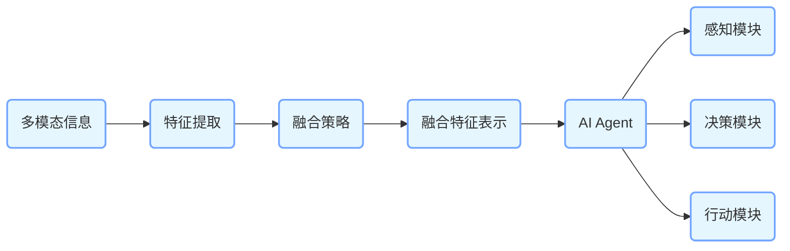

# 构建具有多模态融合能力的AI Agent

> 关键词：多模态融合、AI Agent、深度学习、计算机视觉、自然语言处理

> 摘要：本文围绕构建具有多模态融合能力的AI Agent展开深入探讨。首先介绍了相关背景知识，包括目的、预期读者等内容。接着详细阐述了核心概念与联系，呈现了多模态融合和AI Agent的原理及架构。在核心算法原理部分，使用Python代码进行了详细讲解。同时给出了数学模型和公式，并举例说明。通过项目实战，展示了代码的实际案例及详细解释。分析了多模态融合AI Agent的实际应用场景，推荐了学习、开发所需的工具和资源。最后总结了未来发展趋势与挑战，还提供了常见问题解答和扩展阅读参考资料，旨在为读者全面深入地了解和构建具有多模态融合能力的AI Agent提供有价值的指导。

## 1. 背景介绍 
### 1.1 目的和范围
随着人工智能技术的不断发展，单一模态的信息处理已经难以满足复杂场景下的需求。构建具有多模态融合能力的AI Agent的目的在于使智能体能够同时处理和整合多种不同类型的信息，如文本、图像、音频等，从而更全面、准确地理解和应对现实世界中的各种任务。

本文章的范围涵盖了多模态融合和AI Agent的基本概念、核心算法原理、数学模型、项目实战、实际应用场景等方面，旨在为读者提供一个全面的知识体系，帮助读者掌握构建具有多模态融合能力的AI Agent的方法和技术。

### 1.2 预期读者
本文预期读者包括人工智能领域的研究人员、开发者、学生以及对多模态融合和AI Agent感兴趣的技术爱好者。无论是初学者希望了解基本概念，还是有一定经验的开发者想要深入研究相关技术，都能从本文中获得有价值的信息。

### 1.3 文档结构概述
本文将按照以下结构进行组织：首先介绍多模态融合和AI Agent的核心概念与联系，包括原理和架构；接着详细讲解核心算法原理和具体操作步骤，并使用Python代码进行阐述；然后给出数学模型和公式，并举例说明；通过项目实战展示代码的实际案例和详细解释；分析多模态融合AI Agent的实际应用场景；推荐学习和开发所需的工具和资源；最后总结未来发展趋势与挑战，提供常见问题解答和扩展阅读参考资料。

### 1.4 术语表
#### 1.4.1 核心术语定义
- **多模态融合**：将来自不同模态（如文本、图像、音频等）的信息进行整合和处理，以获得更全面、准确的信息表示和理解。
- **AI Agent**：一种能够感知环境、进行决策并采取行动的智能体，它可以根据接收到的信息自主地完成特定的任务。
- **深度学习**：一种基于人工神经网络的机器学习方法，通过构建多层神经网络来学习数据的特征和模式。
- **特征提取**：从原始数据中提取出具有代表性的特征，以便后续的处理和分析。
- **注意力机制**：一种在神经网络中用于动态地分配注意力权重的机制，能够让模型更加关注重要的信息。

#### 1.4.2 相关概念解释
- **模态**：指信息的不同表现形式，如文本、图像、音频、视频等。不同的模态具有不同的特点和信息表示方式。
- **融合策略**：在多模态融合中，用于将不同模态的信息进行整合的方法和策略，常见的融合策略包括早期融合、晚期融合和混合融合等。
- **智能体架构**：指AI Agent的整体结构和组成部分，包括感知模块、决策模块和行动模块等。

#### 1.4.3 缩略词列表
- **CNN**：Convolutional Neural Network，卷积神经网络
- **RNN**：Recurrent Neural Network，循环神经网络
- **LSTM**：Long Short-Term Memory，长短期记忆网络
- **Transformer**：一种基于注意力机制的神经网络架构
- **NLP**：Natural Language Processing，自然语言处理
- **CV**：Computer Vision，计算机视觉

## 2. 核心概念与联系 

### 2.1 多模态融合原理
多模态融合的核心思想是将来自不同模态的信息进行整合，以充分利用各种模态的优势，提高信息处理的准确性和全面性。不同模态的信息具有不同的特点和表示方式，例如文本信息具有语义丰富的特点，图像信息具有直观、具体的特点，音频信息具有时序性和情感表达的特点。通过多模态融合，可以将这些不同模态的信息进行互补，从而获得更丰富、更准确的信息表示。

常见的多模态融合策略包括早期融合、晚期融合和混合融合。早期融合是指在特征提取之前将不同模态的原始数据进行融合，然后再进行统一的特征提取和处理。晚期融合是指先分别对不同模态的信息进行特征提取和处理，然后在决策阶段将不同模态的特征进行融合。混合融合则是结合了早期融合和晚期融合的优点，在不同的阶段进行不同程度的融合。

### 2.2 AI Agent原理
AI Agent是一种能够感知环境、进行决策并采取行动的智能体。它通常由感知模块、决策模块和行动模块组成。感知模块用于获取环境中的信息，包括不同模态的信息，如文本、图像、音频等。决策模块根据感知模块获取的信息进行分析和推理，制定出相应的决策。行动模块根据决策模块的决策结果采取相应的行动，以实现特定的目标。

AI Agent的架构可以分为基于规则的架构、基于学习的架构和混合架构。基于规则的架构通过预先定义的规则来进行决策和行动，适用于规则明确、环境相对稳定的场景。基于学习的架构通过机器学习算法从大量的数据中学习模式和规律，从而实现智能决策和行动，适用于环境复杂、规则难以明确的场景。混合架构则结合了基于规则的架构和基于学习的架构的优点，既能够利用预先定义的规则进行快速决策，又能够通过机器学习算法不断学习和适应新的环境。

### 2.3 多模态融合与AI Agent的联系
多模态融合为AI Agent提供了更丰富、更准确的信息来源，使AI Agent能够更全面地感知环境。通过融合不同模态的信息，AI Agent可以更好地理解用户的意图和需求，提高决策的准确性和可靠性。例如，在智能客服场景中，AI Agent可以同时处理用户的文本提问和语音情感信息，从而更准确地理解用户的需求并提供更合适的回答。

另一方面，AI Agent为多模态融合提供了应用场景和目标导向。AI Agent的任务需求决定了需要融合哪些模态的信息以及如何进行融合。例如，在自动驾驶场景中，AI Agent需要融合摄像头图像、雷达数据等多种模态的信息，以实现对道路环境的准确感知和决策。

### 2.4 核心概念架构的文本示意图
```plaintext
              多模态融合
           /             \
  文本信息处理       图像信息处理  音频信息处理 ...
       |                   |              |
  特征提取模块       特征提取模块    特征提取模块 ...
       |                   |              |
       └----> 融合策略模块 <----┘
                   |
              融合特征表示
                   |
                AI Agent
           /       |       \
  感知模块    决策模块    行动模块
```

### 2.5 Mermaid流程图


## 3. 核心算法原理 & 具体操作步骤 

### 3.1 特征提取算法
#### 3.1.1 文本特征提取
在文本特征提取中，常用的方法是使用预训练的语言模型，如BERT（Bidirectional Encoder Representations from Transformers）。BERT是一种基于Transformer架构的预训练语言模型，它能够学习到文本的上下文信息，从而提取出高质量的文本特征。

以下是使用Python和Hugging Face的transformers库进行文本特征提取的示例代码：
```python
from transformers import AutoTokenizer, AutoModel
import torch

# 加载预训练的BERT模型和分词器
tokenizer = AutoTokenizer.from_pretrained('bert-base-uncased')
model = AutoModel.from_pretrained('bert-base-uncased')

# 输入文本
text = "This is an example sentence."

# 对文本进行分词
inputs = tokenizer(text, return_tensors='pt')

# 通过BERT模型获取文本特征
with torch.no_grad():
    outputs = model(**inputs)

# 获取[CLS]标记的特征表示
text_features = outputs.last_hidden_state[:, 0, :]

print(text_features.shape)
```

#### 3.1.2 图像特征提取
在图像特征提取中，常用的方法是使用预训练的卷积神经网络（CNN），如ResNet。ResNet是一种深度卷积神经网络，它通过引入残差块解决了深度神经网络训练过程中的梯度消失问题，能够学习到图像的高级语义特征。

以下是使用Python和PyTorch进行图像特征提取的示例代码：
```python
import torch
import torchvision.models as models
from torchvision import transforms
from PIL import Image

# 加载预训练的ResNet模型
resnet = models.resnet50(pretrained=True)
resnet.eval()

# 定义图像预处理转换
preprocess = transforms.Compose([
    transforms.Resize(256),
    transforms.CenterCrop(224),
    transforms.ToTensor(),
    transforms.Normalize(mean=[0.485, 0.456, 0.406], std=[0.229, 0.224, 0.225])
])

# 加载图像
image = Image.open('example.jpg')

# 对图像进行预处理
input_tensor = preprocess(image)
input_batch = input_tensor.unsqueeze(0)

# 通过ResNet模型获取图像特征
with torch.no_grad():
    outputs = resnet(input_batch)

# 获取图像特征
image_features = outputs.squeeze()

print(image_features.shape)
```

### 3.2 多模态融合算法
#### 3.2.1 早期融合
早期融合是在特征提取之前将不同模态的原始数据进行融合。以下是一个简单的早期融合示例，将文本和图像的原始数据进行拼接：
```python
import torch

# 假设已经获取了文本和图像的原始数据
text_data = torch.randn(1, 10)  # 文本数据
image_data = torch.randn(1, 20)  # 图像数据

# 早期融合：拼接原始数据
early_fusion_data = torch.cat((text_data, image_data), dim=1)

print(early_fusion_data.shape)
```

#### 3.2.2 晚期融合
晚期融合是在特征提取之后将不同模态的特征进行融合。以下是一个简单的晚期融合示例，将文本和图像的特征进行拼接：
```python
import torch

# 假设已经获取了文本和图像的特征
text_features = torch.randn(1, 10)  # 文本特征
image_features = torch.randn(1, 20)  # 图像特征

# 晚期融合：拼接特征
late_fusion_features = torch.cat((text_features, image_features), dim=1)

print(late_fusion_features.shape)
```

### 3.3 注意力机制在多模态融合中的应用
注意力机制可以帮助模型在多模态融合过程中更加关注重要的信息。以下是一个简单的基于注意力机制的多模态融合示例：
```python
import torch
import torch.nn as nn

class AttentionFusion(nn.Module):
    def __init__(self, text_dim, image_dim, hidden_dim):
        super(AttentionFusion, self).__init__()
        self.fc_text = nn.Linear(text_dim, hidden_dim)
        self.fc_image = nn.Linear(image_dim, hidden_dim)
        self.fc_att = nn.Linear(hidden_dim, 1)
        self.softmax = nn.Softmax(dim=1)

    def forward(self, text_features, image_features):
        # 对文本和图像特征进行线性变换
        text_transformed = self.fc_text(text_features)
        image_transformed = self.fc_image(image_features)

        # 计算注意力分数
        att_scores = self.fc_att(torch.tanh(text_transformed + image_transformed))
        att_weights = self.softmax(att_scores)

        # 根据注意力权重进行特征融合
        fused_features = att_weights * text_features + (1 - att_weights) * image_features

        return fused_features

# 示例使用
text_features = torch.randn(1, 10)  # 文本特征
image_features = torch.randn(1, 20)  # 图像特征

attention_fusion = AttentionFusion(10, 20, 15)
fused_features = attention_fusion(text_features, image_features)

print(fused_features.shape)
```

## 4. 数学模型和公式 & 详细讲解 & 举例说明 

### 4.1 特征提取的数学模型
#### 4.1.1 文本特征提取（BERT）
BERT模型基于Transformer架构，其核心是多头自注意力机制。多头自注意力机制的数学公式如下：

$$\text{MultiHead}(Q, K, V) = \text{Concat}(\text{head}_1, \cdots, \text{head}_h)W^O$$

其中，$\text{head}_i = \text{Attention}(QW_i^Q, KW_i^K, VW_i^V)$，$\text{Attention}(Q, K, V) = \text{softmax}(\frac{QK^T}{\sqrt{d_k}})V$。

$Q$、$K$、$V$分别是查询（Query）、键（Key）和值（Value）矩阵，$W_i^Q$、$W_i^K$、$W_i^V$和$W^O$是可学习的权重矩阵，$d_k$是键向量的维度，$h$是注意力头的数量。

在文本特征提取中，输入文本经过分词后得到词向量序列，然后通过BERT模型的多个Transformer层进行处理，最终得到每个词的上下文表示。

#### 4.1.2 图像特征提取（ResNet）
ResNet的核心是残差块，其数学公式如下：

$$y = F(x, \{W_i\}) + x$$

其中，$x$是输入特征图，$F(x, \{W_i\})$是残差函数，由多个卷积层和激活函数组成，$y$是输出特征图。

在图像特征提取中，输入图像经过ResNet的多个卷积层和残差块进行处理，最终得到图像的高级语义特征。

### 4.2 多模态融合的数学模型
#### 4.2.1 早期融合
早期融合可以表示为将不同模态的原始数据进行拼接：

$$\mathbf{x}_{fused} = [\mathbf{x}_{text}; \mathbf{x}_{image}]$$

其中，$\mathbf{x}_{text}$是文本的原始数据，$\mathbf{x}_{image}$是图像的原始数据，$[\cdot; \cdot]$表示向量拼接操作。

#### 4.2.2 晚期融合
晚期融合可以表示为将不同模态的特征进行拼接：

$$\mathbf{f}_{fused} = [\mathbf{f}_{text}; \mathbf{f}_{image}]$$

其中，$\mathbf{f}_{text}$是文本的特征向量，$\mathbf{f}_{image}$是图像的特征向量。

#### 4.2.3 基于注意力机制的融合
基于注意力机制的融合可以表示为：

$$\mathbf{f}_{fused} = \alpha \mathbf{f}_{text} + (1 - \alpha) \mathbf{f}_{image}$$

其中，$\alpha = \text{softmax}(\mathbf{w}^T \tanh(\mathbf{W}_{text}\mathbf{f}_{text} + \mathbf{W}_{image}\mathbf{f}_{image}))$，$\mathbf{w}$、$\mathbf{W}_{text}$和$\mathbf{W}_{image}$是可学习的权重向量和矩阵。

### 4.3 举例说明
假设我们有一个文本句子 “A beautiful flower” 和一张花朵的图像。

- **文本特征提取**：使用BERT模型对文本进行处理，得到每个词的上下文表示。例如，“flower” 这个词的特征向量可能是一个768维的向量。
- **图像特征提取**：使用ResNet模型对图像进行处理，得到图像的高级语义特征。例如，图像特征向量可能是一个2048维的向量。
- **多模态融合**：
    - **早期融合**：将文本的原始词向量和图像的原始像素数据进行拼接，得到一个更长的向量。
    - **晚期融合**：将文本的特征向量和图像的特征向量进行拼接，得到一个2816维的融合特征向量。
    - **基于注意力机制的融合**：通过计算注意力权重，将文本特征向量和图像特征向量进行加权融合，得到一个新的融合特征向量。

## 5. 项目实战：代码实际案例和详细解释说明 

### 5.1  开发环境搭建
#### 5.1.1 安装Python
首先需要安装Python，建议使用Python 3.7及以上版本。可以从Python官方网站（https://www.python.org/downloads/）下载并安装。

#### 5.1.2 安装深度学习框架
我们将使用PyTorch作为深度学习框架，可以根据自己的CUDA版本和操作系统选择合适的安装方式。在命令行中执行以下命令安装PyTorch：
```bash
pip install torch torchvision
```

#### 5.1.3 安装其他依赖库
还需要安装一些其他的依赖库，如transformers、torchvision等。在命令行中执行以下命令安装：
```bash
pip install transformers torchvision
```

### 5.2  源代码详细实现和代码解读
#### 5.2.1 项目概述
我们将实现一个简单的多模态图像文本分类任务，使用早期融合的方法将文本和图像信息进行融合，然后通过一个全连接层进行分类。

#### 5.2.2 代码实现
```python
import torch
import torch.nn as nn
from transformers import AutoTokenizer, AutoModel
import torchvision.models as models
from torch.utils.data import Dataset, DataLoader
import pandas as pd
from PIL import Image

# 定义数据集类
class MultiModalDataset(Dataset):
    def __init__(self, csv_file, root_dir, transform=None):
        self.data_frame = pd.read_csv(csv_file)
        self.root_dir = root_dir
        self.transform = transform
        self.tokenizer = AutoTokenizer.from_pretrained('bert-base-uncased')

    def __len__(self):
        return len(self.data_frame)

    def __getitem__(self, idx):
        if torch.is_tensor(idx):
            idx = idx.tolist()

        # 获取图像路径和文本
        img_name = self.root_dir + self.data_frame.iloc[idx, 0]
        text = self.data_frame.iloc[idx, 1]
        label = self.data_frame.iloc[idx, 2]

        # 加载图像
        image = Image.open(img_name).convert('RGB')
        if self.transform:
            image = self.transform(image)

        # 对文本进行分词
        inputs = self.tokenizer(text, return_tensors='pt', padding='max_length', max_length=128, truncation=True)
        input_ids = inputs['input_ids'].squeeze()
        attention_mask = inputs['attention_mask'].squeeze()

        return image, input_ids, attention_mask, torch.tensor(label, dtype=torch.long)

# 定义多模态模型
class MultiModalModel(nn.Module):
    def __init__(self):
        super(MultiModalModel, self).__init__()
        self.bert = AutoModel.from_pretrained('bert-base-uncased')
        self.resnet = models.resnet50(pretrained=True)
        self.resnet.fc = nn.Identity()  # 去掉ResNet的最后一层全连接层
        self.fc = nn.Linear(768 + 2048, 2)  # 768是BERT的输出维度，2048是ResNet的输出维度

    def forward(self, image, input_ids, attention_mask):
        # 获取文本特征
        text_outputs = self.bert(input_ids=input_ids, attention_mask=attention_mask)
        text_features = text_outputs.last_hidden_state[:, 0, :]

        # 获取图像特征
        image_features = self.resnet(image)

        # 早期融合：拼接特征
        fused_features = torch.cat((text_features, image_features), dim=1)

        # 通过全连接层进行分类
        logits = self.fc(fused_features)

        return logits

# 数据预处理
transform = transforms.Compose([
    transforms.Resize(256),
    transforms.CenterCrop(224),
    transforms.ToTensor(),
    transforms.Normalize(mean=[0.485, 0.456, 0.406], std=[0.229, 0.224, 0.225])
])

# 创建数据集和数据加载器
train_dataset = MultiModalDataset(csv_file='train.csv', root_dir='images/', transform=transform)
train_loader = DataLoader(train_dataset, batch_size=16, shuffle=True)

# 初始化模型、损失函数和优化器
model = MultiModalModel()
criterion = nn.CrossEntropyLoss()
optimizer = torch.optim.Adam(model.parameters(), lr=1e-4)

# 训练模型
num_epochs = 10
device = torch.device("cuda" if torch.cuda.is_available() else "cpu")
model.to(device)

for epoch in range(num_epochs):
    running_loss = 0.0
    for images, input_ids, attention_mask, labels in train_loader:
        images = images.to(device)
        input_ids = input_ids.to(device)
        attention_mask = attention_mask.to(device)
        labels = labels.to(device)

        # 前向传播
        logits = model(images, input_ids, attention_mask)
        loss = criterion(logits, labels)

        # 反向传播和优化
        optimizer.zero_grad()
        loss.backward()
        optimizer.step()

        running_loss += loss.item()

    print(f'Epoch {epoch + 1}/{num_epochs}, Loss: {running_loss / len(train_loader)}')
```

### 5.3  代码解读与分析
#### 5.3.1 数据集类 `MultiModalDataset`
该类继承自`torch.utils.data.Dataset`，用于加载多模态数据。在`__getitem__`方法中，我们分别加载图像和文本数据，并对文本进行分词处理，最后返回图像、文本的输入ID、注意力掩码和标签。

#### 5.3.2 多模态模型 `MultiModalModel`
该类继承自`torch.nn.Module`，包含一个BERT模型和一个ResNet模型。在`forward`方法中，我们分别获取文本和图像的特征，然后使用早期融合的方法将它们拼接起来，最后通过一个全连接层进行分类。

#### 5.3.3 训练过程
在训练过程中，我们使用交叉熵损失函数和Adam优化器。每个epoch中，我们遍历训练数据加载器，将数据移动到GPU上进行计算，然后进行前向传播、反向传播和参数更新。

## 6. 实际应用场景 
### 6.1 智能客服
在智能客服场景中，具有多模态融合能力的AI Agent可以同时处理用户的文本提问、语音信息和表情图像等多模态信息。通过融合这些信息，AI Agent可以更准确地理解用户的意图和情感状态，从而提供更个性化、更准确的回答和服务。例如，当用户在提问时带有愤怒的语音语调或表情，AI Agent可以及时调整回答策略，以安抚用户的情绪。

### 6.2 自动驾驶
在自动驾驶场景中，AI Agent需要融合摄像头图像、雷达数据、激光雷达数据等多种模态的信息，以实现对道路环境的准确感知和决策。通过多模态融合，AI Agent可以更全面地了解周围的交通状况、障碍物信息等，从而做出更安全、更合理的驾驶决策。例如，结合摄像头图像和雷达数据，AI Agent可以更准确地判断前方车辆的距离和速度。

### 6.3 智能家居
在智能家居场景中，AI Agent可以融合语音指令、图像识别和传感器数据等多模态信息，实现对家居设备的智能控制。例如，用户可以通过语音指令控制灯光的开关和亮度，同时AI Agent可以通过图像识别判断房间内是否有人，结合传感器数据调节室内的温度和湿度，以提供更舒适的居住环境。

### 6.4 医疗诊断
在医疗诊断场景中，AI Agent可以融合医学影像（如X光、CT、MRI等）、病历文本和基因数据等多模态信息，辅助医生进行疾病的诊断和治疗方案的制定。通过多模态融合，AI Agent可以更全面地了解患者的病情，发现潜在的疾病风险，提高诊断的准确性和效率。例如，结合医学影像和病历文本，AI Agent可以更准确地判断肿瘤的类型和分期。

## 7. 工具和资源推荐
### 7.1 学习资源推荐
#### 7.1.1 书籍推荐
- 《深度学习》（Deep Learning）：由Ian Goodfellow、Yoshua Bengio和Aaron Courville所著，是深度学习领域的经典教材，涵盖了深度学习的基本概念、算法和应用。
- 《Python深度学习》（Deep Learning with Python）：由Francois Chollet所著，通过Python和Keras框架介绍了深度学习的实践方法，适合初学者入门。
- 《自然语言处理入门》（Natural Language Processing in Action）：由Hobson Lane、Cole Howard和 Hannes Hapke所著，介绍了自然语言处理的基本概念和常用技术。

#### 7.1.2 在线课程
- Coursera上的“深度学习专项课程”（Deep Learning Specialization）：由Andrew Ng教授授课，涵盖了深度学习的各个方面，包括神经网络、卷积神经网络、循环神经网络等。
- edX上的“自然语言处理基础”（Foundations of Natural Language Processing）：介绍了自然语言处理的基本概念和算法，包括词法分析、句法分析、语义分析等。
- Udemy上的“计算机视觉实战课程”（Computer Vision A-Z: Hands-On Artificial Intelligence）：通过实际项目介绍了计算机视觉的应用和实现方法。

#### 7.1.3 技术博客和网站
- Medium：有许多关于人工智能和深度学习的技术博客，如Towards Data Science、The AI Blog等。
- arXiv：是一个预印本平台，提供了大量最新的人工智能研究论文。
- Hugging Face：是一个专注于自然语言处理的开源社区，提供了丰富的预训练模型和工具。

### 7.2 开发工具框架推荐
#### 7.2.1 IDE和编辑器
- PyCharm：是一款专业的Python集成开发环境，提供了丰富的代码编辑、调试和版本控制功能。
- Jupyter Notebook：是一个交互式的开发环境，适合进行数据探索和模型实验。
- Visual Studio Code：是一款轻量级的代码编辑器，支持多种编程语言和插件扩展。

#### 7.2.2 调试和性能分析工具
- PyTorch Profiler：是PyTorch自带的性能分析工具，可以帮助开发者分析模型的运行时间和内存使用情况。
- TensorBoard：是TensorFlow提供的可视化工具，也可以用于PyTorch模型的可视化和调试。
- cProfile：是Python标准库中的性能分析工具，可以帮助开发者找出代码中的性能瓶颈。

#### 7.2.3 相关框架和库
- PyTorch：是一个开源的深度学习框架，提供了丰富的神经网络层和优化算法，支持GPU加速。
- Hugging Face Transformers：是一个用于自然语言处理的开源库，提供了大量预训练的语言模型和工具。
- TorchVision：是PyTorch的计算机视觉库，提供了常用的图像数据集、模型和图像处理工具。

### 7.3 相关论文著作推荐
#### 7.3.1 经典论文
- “Attention Is All You Need”：提出了Transformer架构，是自然语言处理领域的重要突破。
- “Deep Residual Learning for Image Recognition”：提出了ResNet模型，解决了深度神经网络训练过程中的梯度消失问题。
- “BERT: Pre-training of Deep Bidirectional Transformers for Language Understanding”：提出了BERT模型，在自然语言处理任务中取得了优异的成绩。

#### 7.3.2 最新研究成果
- 可以关注arXiv上的最新论文，了解多模态融合和AI Agent领域的最新研究进展。
- 参加相关的学术会议，如NeurIPS、ICML、CVPR等，获取最新的研究成果和技术趋势。

#### 7.3.3 应用案例分析
- 可以参考一些实际应用案例的论文和报告，了解多模态融合和AI Agent在不同领域的应用方法和效果。
- 关注一些科技公司的博客和技术分享，如Google AI Blog、Facebook AI Research等，获取实际应用案例和经验分享。

## 8. 总结：未来发展趋势与挑战
### 8.1 未来发展趋势
#### 8.1.1 更复杂的多模态融合方法
未来的研究将探索更复杂、更有效的多模态融合方法，以更好地处理不同模态之间的语义关联和信息交互。例如，结合知识图谱和多模态数据，实现更全面、更准确的信息理解和推理。

#### 8.1.2 端到端的多模态学习
端到端的多模态学习将成为未来的发展方向，通过直接从原始的多模态数据中学习，避免了传统方法中特征提取和融合的复杂过程，提高了模型的性能和效率。

#### 8.1.3 多模态AI Agent的自主学习和进化
未来的多模态AI Agent将具备更强的自主学习和进化能力，能够在不断与环境交互的过程中自动调整和优化自己的行为和决策策略，以适应不同的任务和场景。

#### 8.1.4 跨领域的应用拓展
多模态融合和AI Agent技术将在更多的领域得到应用，如教育、娱乐、金融等。通过跨领域的应用拓展，将为这些领域带来新的发展机遇和变革。

### 8.2 挑战
#### 8.2.1 数据获取和标注
多模态数据的获取和标注是一个具有挑战性的问题。不同模态的数据来源不同，格式和质量也存在差异，需要花费大量的时间和精力进行数据收集、清洗和标注。

#### 8.2.2 计算资源和效率
多模态融合和AI Agent模型通常比较复杂，需要大量的计算资源和时间进行训练和推理。如何提高模型的计算效率，降低计算成本，是一个亟待解决的问题。

#### 8.2.3 语义对齐和理解
不同模态的数据具有不同的语义表示方式，如何实现不同模态之间的语义对齐和理解，是多模态融合的关键问题。目前的方法还存在一定的局限性，需要进一步的研究和探索。

#### 8.2.4 伦理和安全问题
随着多模态AI Agent的广泛应用，伦理和安全问题也日益凸显。例如，如何保证AI Agent的决策和行为符合人类的价值观和道德准则，如何防止AI Agent被恶意利用等。

## 9. 附录：常见问题与解答
### 9.1 多模态融合和单模态处理有什么区别？
单模态处理只关注单一类型的信息，如文本、图像或音频。而多模态融合则是将来自不同模态的信息进行整合和处理，以获得更全面、准确的信息表示和理解。多模态融合可以充分利用不同模态的优势，提高信息处理的性能和效果。

### 9.2 如何选择合适的多模态融合策略？
选择合适的多模态融合策略需要考虑多个因素，如数据的特点、任务的需求和模型的复杂度等。早期融合适用于不同模态之间相关性较强的情况，晚期融合适用于不同模态之间独立性较强的情况，混合融合则结合了早期融合和晚期融合的优点。在实际应用中，可以通过实验和比较不同的融合策略，选择最适合的方法。

### 9.3 多模态融合模型的训练需要注意什么？
多模态融合模型的训练需要注意以下几点：
- **数据平衡**：确保不同模态的数据在训练集中的比例平衡，避免出现数据偏差。
- **学习率调整**：根据模型的复杂度和数据的规模，合理调整学习率，避免过拟合或欠拟合。
- **模型评估**：使用合适的评估指标对模型进行评估，如准确率、召回率、F1值等。
- **正则化**：可以使用正则化方法，如L1和L2正则化，防止模型过拟合。

### 9.4 多模态融合技术在实际应用中存在哪些困难？
多模态融合技术在实际应用中存在以下困难：
- **数据质量问题**：不同模态的数据质量可能存在差异，需要进行数据清洗和预处理。
- **计算资源问题**：多模态融合模型通常比较复杂，需要大量的计算资源和时间进行训练和推理。
- **语义对齐问题**：不同模态的数据具有不同的语义表示方式，如何实现不同模态之间的语义对齐是一个挑战。
- **模型可解释性问题**：多模态融合模型通常比较复杂，难以解释模型的决策过程和结果。

## 10. 扩展阅读 & 参考资料
### 10.1 扩展阅读
- 《人工智能：现代方法》（Artificial Intelligence: A Modern Approach）：全面介绍了人工智能的基本概念、算法和应用。
- 《计算机视觉：算法与应用》（Computer Vision: Algorithms and Applications）：详细介绍了计算机视觉的各种算法和应用。
- 《自然语言处理综论》（Speech and Language Processing）：是自然语言处理领域的经典教材，涵盖了自然语言处理的各个方面。

### 10.2 参考资料
- Goodfellow, I., Bengio, Y., & Courville, A. (2016). Deep Learning. MIT Press.
- Chollet, F. (2017). Deep Learning with Python. Manning Publications.
- Vaswani, A., Shazeer, N., Parmar, N., Uszkoreit, J., Jones, L., Gomez, A. N.,... & Polosukhin, I. (2017). Attention is all you need. Advances in neural information processing systems, 5998-6008.
- He, K., Zhang, X., Ren, S., & Sun, J. (2016). Deep residual learning for image recognition. In Proceedings of the IEEE conference on computer vision and pattern recognition (pp. 770-778).
- Devlin, J., Chang, M. W., Lee, K., & Toutanova, K. (2018). Bert: Pre-training of deep bidirectional transformers for language understanding. arXiv preprint arXiv:1810.04805.

作者：AI天才研究院/AI Genius Institute & 禅与计算机程序设计艺术 /Zen And The Art of Computer Programming