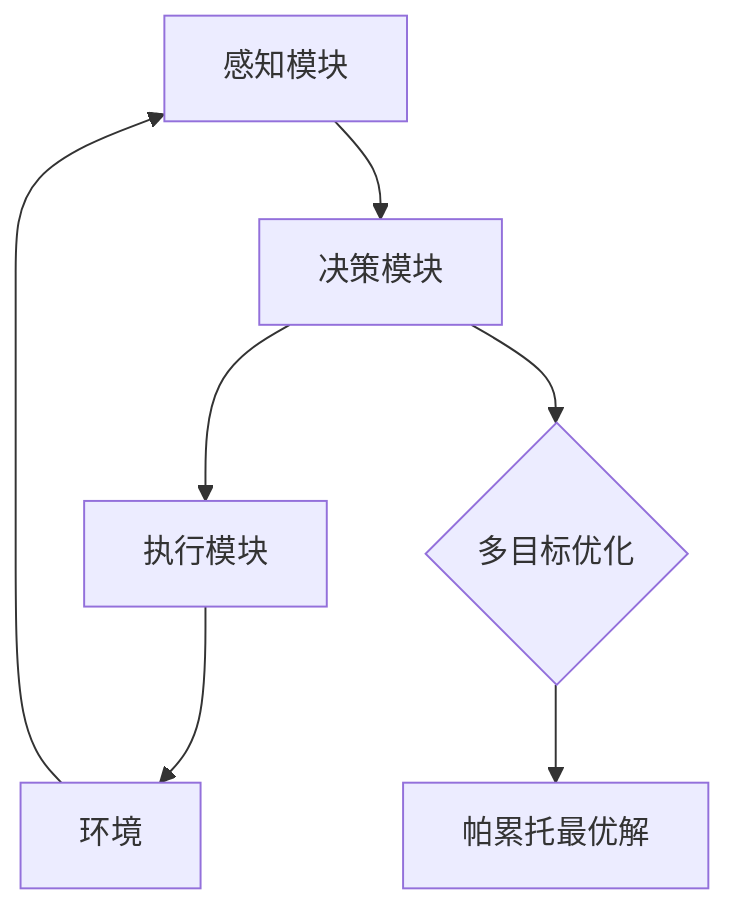

# 构建具有多目标优化能力的AI Agent

> 关键词：AI Agent、多目标优化、决策模型、强化学习、算法原理

> 摘要：本文旨在深入探讨如何构建具有多目标优化能力的AI Agent。首先介绍了相关背景知识，包括目的范围、预期读者等。接着阐述了核心概念与联系，详细讲解了核心算法原理和具体操作步骤，并通过Python代码进行示例。还分析了数学模型和公式，给出了项目实战案例，包括开发环境搭建、源代码实现和解读。同时探讨了实际应用场景，推荐了相关工具和资源。最后总结了未来发展趋势与挑战，并提供了常见问题解答和扩展阅读参考资料，为开发者和研究者提供全面的技术指导。

## 1. 背景介绍 
### 1.1 目的和范围
在当今复杂的现实世界中，许多任务需要同时考虑多个相互冲突的目标。例如，在自动驾驶领域，车辆需要在保证行驶安全的前提下，尽可能地提高行驶速度和降低能耗；在资源分配问题中，需要在满足多个用户需求的同时，使资源的利用率最大化。传统的AI Agent往往只能处理单一目标的优化问题，无法满足这些复杂任务的需求。因此，构建具有多目标优化能力的AI Agent具有重要的现实意义。

本文的范围涵盖了从多目标优化的基本概念到AI Agent的设计、实现和应用的全过程。我们将介绍多目标优化的核心算法原理，以及如何将这些算法应用到AI Agent的决策模型中。同时，我们还将通过实际案例展示如何构建和训练具有多目标优化能力的AI Agent，并分析其在不同应用场景中的性能和效果。

### 1.2 预期读者
本文的预期读者包括人工智能领域的研究者、开发者、数据科学家，以及对多目标优化和AI Agent感兴趣的技术爱好者。读者需要具备一定的编程基础（如Python）和机器学习知识，对强化学习、优化算法等有基本的了解。

### 1.3 文档结构概述
本文将按照以下结构进行组织：
- 核心概念与联系：介绍多目标优化和AI Agent的核心概念，以及它们之间的联系，并通过文本示意图和Mermaid流程图进行直观展示。
- 核心算法原理 & 具体操作步骤：详细讲解多目标优化的核心算法原理，包括遗传算法、粒子群算法等，并给出具体的操作步骤和Python代码示例。
- 数学模型和公式 & 详细讲解 & 举例说明：介绍多目标优化的数学模型和公式，如帕累托最优解、目标函数等，并通过具体例子进行详细讲解。
- 项目实战：代码实际案例和详细解释说明：通过一个实际项目案例，展示如何构建和训练具有多目标优化能力的AI Agent，包括开发环境搭建、源代码实现和代码解读。
- 实际应用场景：探讨具有多目标优化能力的AI Agent在不同领域的实际应用场景，如自动驾驶、资源分配、智能物流等。
- 工具和资源推荐：推荐相关的学习资源、开发工具框架和论文著作，帮助读者进一步深入学习和研究。
- 总结：未来发展趋势与挑战：总结具有多目标优化能力的AI Agent的发展趋势和面临的挑战。
- 附录：常见问题与解答：提供常见问题的解答，帮助读者解决在学习和实践过程中遇到的问题。
- 扩展阅读 & 参考资料：提供扩展阅读的建议和相关参考资料，方便读者进一步探索相关领域的知识。

### 1.4 术语表
#### 1.4.1 核心术语定义
- **AI Agent**：人工智能代理，是一种能够感知环境、做出决策并采取行动以实现特定目标的软件实体。
- **多目标优化**：在多个相互冲突的目标之间寻找最优解的过程。与单目标优化不同，多目标优化通常没有一个唯一的最优解，而是存在一组称为帕累托最优解的解集。
- **帕累托最优解**：在多目标优化问题中，一个解被称为帕累托最优解，如果不存在其他解能够在不损害至少一个目标的情况下改善其他目标。
- **目标函数**：用于衡量AI Agent在某个目标上的性能的函数。在多目标优化中，通常有多个目标函数。
- **决策模型**：AI Agent用于根据感知到的环境信息做出决策的模型。

#### 1.4.2 相关概念解释
- **强化学习**：一种机器学习方法，通过智能体与环境进行交互，根据环境反馈的奖励信号来学习最优的行为策略。在多目标优化中，强化学习可以用于训练AI Agent以实现多个目标的平衡。
- **遗传算法**：一种基于自然选择和遗传机制的优化算法，通过模拟生物进化过程来寻找最优解。在多目标优化中，遗传算法可以用于搜索帕累托最优解集。
- **粒子群算法**：一种基于群体智能的优化算法，通过模拟鸟群或鱼群的群体行为来寻找最优解。在多目标优化中，粒子群算法也可以用于搜索帕累托最优解集。

#### 1.4.3 缩略词列表
- **AI**：Artificial Intelligence，人工智能
- **RL**：Reinforcement Learning，强化学习
- **GA**：Genetic Algorithm，遗传算法
- **PSO**：Particle Swarm Optimization，粒子群算法

## 2. 核心概念与联系 
### 核心概念原理
#### AI Agent
AI Agent是一个自主的实体，它能够感知环境的状态，并根据这些状态做出决策和采取行动。一个典型的AI Agent由感知模块、决策模块和执行模块组成。感知模块负责收集环境信息，决策模块根据感知到的信息选择合适的行动，执行模块则将决策转化为实际的行动。

#### 多目标优化
多目标优化是指在多个相互冲突的目标之间寻找最优解的问题。例如，在一个生产计划问题中，可能需要同时考虑生产成本、生产效率和产品质量等多个目标。由于这些目标之间通常存在冲突，无法找到一个能够同时使所有目标达到最优的解，因此需要寻找一组称为帕累托最优解的解集。帕累托最优解是指在不损害其他目标的情况下，无法进一步改善某个目标的解。

### 架构的文本示意图
```plaintext
+----------------+
|  感知模块      |
|                |
|  收集环境信息  |
+----------------+
        |
        v
+----------------+
|  决策模块      |
|                |
|  多目标优化    |
|  选择行动      |
+----------------+
        |
        v
+----------------+
|  执行模块      |
|                |
|  执行行动      |
+----------------+
```

### Mermaid流程图


## 3. 核心算法原理 & 具体操作步骤 
### 遗传算法原理
遗传算法是一种基于自然选择和遗传机制的优化算法。它通过模拟生物进化过程，不断迭代生成新的解，直到找到最优解或满足停止条件。

#### 具体操作步骤
1. **初始化种群**：随机生成一组初始解，称为种群。每个解称为一个个体，个体由一组基因组成。
2. **评估适应度**：对于每个个体，计算其在各个目标函数上的适应度值。
3. **选择操作**：根据个体的适应度值，选择一部分个体作为父代，用于繁殖下一代。
4. **交叉操作**：对选中的父代个体进行交叉操作，生成新的子代个体。
5. **变异操作**：对子代个体进行变异操作，引入新的基因。
6. **更新种群**：用子代个体替换部分父代个体，更新种群。
7. **重复步骤2-6**：直到满足停止条件，如达到最大迭代次数或找到满意的解。

#### Python代码示例
```python
import random

# 定义目标函数
def objective_functions(x):
    f1 = x[0]**2
    f2 = (x[0] - 2)**2
    return [f1, f2]

# 初始化种群
def initialize_population(pop_size, num_genes):
    population = []
    for _ in range(pop_size):
        individual = [random.uniform(-5, 5) for _ in range(num_genes)]
        population.append(individual)
    return population

# 评估适应度
def evaluate_fitness(population):
    fitness = []
    for individual in population:
        fitness.append(objective_functions(individual))
    return fitness

# 选择操作
def selection(population, fitness):
    selected = []
    num_selected = len(population) // 2
    for _ in range(num_selected):
        index1, index2 = random.sample(range(len(population)), 2)
        if fitness[index1][0] < fitness[index2][0]:
            selected.append(population[index1])
        else:
            selected.append(population[index2])
    return selected

# 交叉操作
def crossover(parent1, parent2):
    crossover_point = random.randint(1, len(parent1) - 1)
    child1 = parent1[:crossover_point] + parent2[crossover_point:]
    child2 = parent2[:crossover_point] + parent1[crossover_point:]
    return child1, child2

# 变异操作
def mutation(individual, mutation_rate):
    for i in range(len(individual)):
        if random.random() < mutation_rate:
            individual[i] += random.uniform(-0.1, 0.1)
    return individual

# 主函数
def genetic_algorithm(pop_size, num_genes, max_generations, mutation_rate):
    population = initialize_population(pop_size, num_genes)
    for _ in range(max_generations):
        fitness = evaluate_fitness(population)
        selected = selection(population, fitness)
        new_population = []
        while len(new_population) < pop_size:
            parent1, parent2 = random.sample(selected, 2)
            child1, child2 = crossover(parent1, parent2)
            child1 = mutation(child1, mutation_rate)
            child2 = mutation(child2, mutation_rate)
            new_population.extend([child1, child2])
        population = new_population
    final_fitness = evaluate_fitness(population)
    return population, final_fitness

# 运行遗传算法
pop_size = 50
num_genes = 1
max_generations = 100
mutation_rate = 0.1
population, fitness = genetic_algorithm(pop_size, num_genes, max_generations, mutation_rate)
print("Final population:", population)
print("Final fitness:", fitness)
```

### 粒子群算法原理
粒子群算法是一种基于群体智能的优化算法。它通过模拟鸟群或鱼群的群体行为，每个粒子代表一个解，粒子在搜索空间中不断移动，根据自身的历史最优位置和群体的历史最优位置来更新自己的速度和位置。

#### 具体操作步骤
1. **初始化粒子群**：随机初始化一组粒子的位置和速度。
2. **评估适应度**：对于每个粒子，计算其在各个目标函数上的适应度值。
3. **更新个体最优位置**：对于每个粒子，如果当前位置的适应度值优于其历史最优位置的适应度值，则更新其历史最优位置。
4. **更新全局最优位置**：在所有粒子的历史最优位置中，选择适应度值最优的位置作为全局最优位置。
5. **更新粒子速度和位置**：根据粒子的当前速度、个体最优位置和全局最优位置，更新粒子的速度和位置。
6. **重复步骤2-5**：直到满足停止条件，如达到最大迭代次数或找到满意的解。

#### Python代码示例
```python
import random

# 定义目标函数
def objective_functions(x):
    f1 = x[0]**2
    f2 = (x[0] - 2)**2
    return [f1, f2]

# 初始化粒子群
def initialize_particles(num_particles, num_genes):
    particles = []
    velocities = []
    for _ in range(num_particles):
        particle = [random.uniform(-5, 5) for _ in range(num_genes)]
        velocity = [random.uniform(-1, 1) for _ in range(num_genes)]
        particles.append(particle)
        velocities.append(velocity)
    return particles, velocities

# 评估适应度
def evaluate_fitness(particles):
    fitness = []
    for particle in particles:
        fitness.append(objective_functions(particle))
    return fitness

# 更新个体最优位置
def update_pbest(particles, fitness, pbest_positions, pbest_fitness):
    for i in range(len(particles)):
        if fitness[i][0] < pbest_fitness[i][0]:
            pbest_positions[i] = particles[i]
            pbest_fitness[i] = fitness[i]
    return pbest_positions, pbest_fitness

# 更新全局最优位置
def update_gbest(pbest_positions, pbest_fitness):
    min_fitness = float('inf')
    gbest_index = 0
    for i in range(len(pbest_fitness)):
        if pbest_fitness[i][0] < min_fitness:
            min_fitness = pbest_fitness[i][0]
            gbest_index = i
    return pbest_positions[gbest_index]

# 更新粒子速度和位置
def update_velocities_and_positions(particles, velocities, pbest_positions, gbest_position, w, c1, c2):
    for i in range(len(particles)):
        for j in range(len(particles[i])):
            r1, r2 = random.random(), random.random()
            velocities[i][j] = (w * velocities[i][j] +
                                c1 * r1 * (pbest_positions[i][j] - particles[i][j]) +
                                c2 * r2 * (gbest_position[j] - particles[i][j]))
            particles[i][j] += velocities[i][j]
    return particles, velocities

# 主函数
def particle_swarm_optimization(num_particles, num_genes, max_iterations, w, c1, c2):
    particles, velocities = initialize_particles(num_particles, num_genes)
    pbest_positions = particles.copy()
    pbest_fitness = evaluate_fitness(particles)
    for _ in range(max_iterations):
        fitness = evaluate_fitness(particles)
        pbest_positions, pbest_fitness = update_pbest(particles, fitness, pbest_positions, pbest_fitness)
        gbest_position = update_gbest(pbest_positions, pbest_fitness)
        particles, velocities = update_velocities_and_positions(particles, velocities, pbest_positions, gbest_position, w, c1, c2)
    final_fitness = evaluate_fitness(particles)
    return particles, final_fitness

# 运行粒子群算法
num_particles = 50
num_genes = 1
max_iterations = 100
w = 0.7
c1 = 1.4
c2 = 1.4
particles, fitness = particle_swarm_optimization(num_particles, num_genes, max_iterations, w, c1, c2)
print("Final particles:", particles)
print("Final fitness:", fitness)
```

## 4. 数学模型和公式 & 详细讲解 & 举例说明 
### 多目标优化问题的数学模型
多目标优化问题可以用以下数学模型表示：
$$
\begin{align*}
\min_{x \in \Omega} &\quad F(x) = [f_1(x), f_2(x), \cdots, f_m(x)]^T \\
\text{s.t.} &\quad g_i(x) \leq 0, \quad i = 1, 2, \cdots, p \\
&\quad h_j(x) = 0, \quad j = 1, 2, \cdots, q
\end{align*}
$$
其中，$x$ 是决策变量，$\Omega$ 是决策变量的可行域，$F(x)$ 是目标函数向量，包含 $m$ 个目标函数 $f_1(x), f_2(x), \cdots, f_m(x)$，$g_i(x)$ 是不等式约束条件，$h_j(x)$ 是等式约束条件。

### 帕累托最优解的定义
设 $x_1, x_2 \in \Omega$ 是两个可行解，如果对于所有的 $i = 1, 2, \cdots, m$，都有 $f_i(x_1) \leq f_i(x_2)$，且至少存在一个 $j$ 使得 $f_j(x_1) < f_j(x_2)$，则称 $x_1$ 支配 $x_2$，记为 $x_1 \prec x_2$。

一个可行解 $x^* \in \Omega$ 称为帕累托最优解，如果不存在其他可行解 $x \in \Omega$ 使得 $x \prec x^*$。所有帕累托最优解的集合称为帕累托最优解集，其在目标空间中的投影称为帕累托前沿。

### 举例说明
考虑一个简单的双目标优化问题：
$$
\begin{align*}
\min_{x \in [-5, 5]} &\quad F(x) = [f_1(x), f_2(x)]^T \\
\text{where} &\quad f_1(x) = x^2 \\
&\quad f_2(x) = (x - 2)^2
\end{align*}
$$
在这个问题中，决策变量 $x$ 的可行域是 $[-5, 5]$，目标函数向量 $F(x)$ 包含两个目标函数 $f_1(x)$ 和 $f_2(x)$。我们可以通过遗传算法或粒子群算法来搜索这个问题的帕累托最优解集。

通过前面给出的Python代码示例，我们可以得到一组近似的帕累托最优解。在代码中，我们不断迭代更新种群或粒子群，直到达到最大迭代次数。最终得到的种群或粒子群中的个体对应的解就是近似的帕累托最优解。

例如，在运行遗传算法后，我们可以得到一组解和对应的适应度值。这些适应度值可以看作是目标函数在这些解上的取值。通过分析这些适应度值，我们可以观察到它们在目标空间中的分布情况，从而大致了解帕累托前沿的形状。

## 5. 项目实战：代码实际案例和详细解释说明 
### 5.1  开发环境搭建
#### 操作系统
可以选择Windows、Linux或macOS操作系统。这里以Ubuntu 20.04为例进行说明。

#### 编程语言和依赖库
- **Python**：建议使用Python 3.7及以上版本。可以通过以下命令安装Python：
```bash
sudo apt update
sudo apt install python3 python3-pip
```
- **依赖库**：需要安装`numpy`、`matplotlib`等库。可以使用以下命令安装：
```bash
pip3 install numpy matplotlib
```

### 5.2  源代码详细实现和代码解读
#### 问题描述
我们考虑一个简单的资源分配问题，假设有两个任务 $T_1$ 和 $T_2$，需要分配一定数量的资源 $x_1$ 和 $x_2$，使得两个目标同时优化：
- 目标1：最大化任务 $T_1$ 的收益，收益函数为 $f_1(x_1) = -x_1^2 + 10x_1$。
- 目标2：最大化任务 $T_2$ 的收益，收益函数为 $f_2(x_2) = -x_2^2 + 8x_2$。
同时，资源总量有限，满足约束条件 $x_1 + x_2 \leq 5$，且 $x_1 \geq 0$，$x_2 \geq 0$。

#### 源代码实现
```python
import numpy as np
import matplotlib.pyplot as plt
from deap import base, creator, tools, algorithms

# 定义目标函数
def objective_functions(x):
    x1, x2 = x
    f1 = -x1**2 + 10*x1
    f2 = -x2**2 + 8*x2
    return f1, f2

# 定义约束条件
def feasible(x):
    x1, x2 = x
    return x1 + x2 <= 5 and x1 >= 0 and x2 >= 0

# 创建适应度和个体类
creator.create("FitnessMulti", base.Fitness, weights=(1.0, 1.0))
creator.create("Individual", list, fitness=creator.FitnessMulti)

# 初始化工具盒
toolbox = base.Toolbox()
toolbox.register("attr_float", np.random.uniform, 0, 5)
toolbox.register("individual", tools.initRepeat, creator.Individual, toolbox.attr_float, n=2)
toolbox.register("population", tools.initRepeat, list, toolbox.individual)

# 注册评估函数和约束条件
toolbox.register("evaluate", objective_functions)
toolbox.decorate("evaluate", tools.DeltaPenalty(feasible, (0, 0)))

# 注册遗传操作
toolbox.register("mate", tools.cxTwoPoint)
toolbox.register("mutate", tools.mutGaussian, mu=0, sigma=1, indpb=0.1)
toolbox.register("select", tools.selNSGA2)

# 主函数
def main():
    pop_size = 100
    num_generations = 200
    population = toolbox.population(n=pop_size)
    hof = tools.ParetoFront()
    stats = tools.Statistics(lambda ind: ind.fitness.values)
    stats.register("avg", np.mean, axis=0)
    stats.register("std", np.std, axis=0)
    stats.register("min", np.min, axis=0)
    stats.register("max", np.max, axis=0)

    population, logbook = algorithms.eaMuPlusLambda(population, toolbox, mu=pop_size, lambda_=pop_size,
                                                    cxpb=0.7, mutpb=0.2, ngen=num_generations,
                                                    stats=stats, halloffame=hof, verbose=True)

    # 绘制帕累托前沿
    front = np.array([ind.fitness.values for ind in hof])
    plt.scatter(front[:, 0], front[:, 1])
    plt.xlabel('Objective 1')
    plt.ylabel('Objective 2')
    plt.title('Pareto Front')
    plt.show()

    return population, logbook, hof

if __name__ == "__main__":
    main()
```

#### 代码解读
1. **目标函数定义**：`objective_functions` 函数定义了两个目标函数 $f_1(x_1)$ 和 $f_2(x_2)$，分别计算任务 $T_1$ 和 $T_2$ 的收益。
2. **约束条件定义**：`feasible` 函数定义了资源分配的约束条件，即 $x_1 + x_2 \leq 5$ 且 $x_1 \geq 0$，$x_2 \geq 0$。
3. **适应度和个体类创建**：使用 `deap` 库创建适应度和个体类，`FitnessMulti` 表示多目标适应度，`Individual` 表示个体。
4. **工具盒初始化**：使用 `base.Toolbox` 初始化工具盒，注册个体生成、种群生成、评估函数、遗传操作等。
5. **评估函数和约束条件注册**：将目标函数注册为评估函数，并使用 `DeltaPenalty` 装饰器处理约束条件。
6. **遗传操作注册**：注册交叉、变异和选择操作，这里使用 `cxTwoPoint` 交叉、`mutGaussian` 变异和 `selNSGA2` 选择。
7. **主函数**：初始化种群、统计信息和帕累托前沿记录器，使用 `eaMuPlusLambda` 算法进行进化，最后绘制帕累托前沿。

### 5.3  代码解读与分析
#### 帕累托前沿分析
通过运行上述代码，我们可以得到一个近似的帕累托前沿。帕累托前沿上的点代表了在满足约束条件下，两个目标之间的最优权衡。例如，在资源分配问题中，帕累托前沿上的点表示了在不同的资源分配方案下，任务 $T_1$ 和 $T_2$ 的最大收益组合。

#### 算法性能分析
可以通过观察进化过程中的统计信息（如平均适应度、标准差等）来分析算法的性能。如果平均适应度随着迭代次数的增加而不断提高，说明算法在不断优化解的质量。同时，标准差的变化也可以反映解的多样性。

## 6. 实际应用场景 
### 自动驾驶
在自动驾驶领域，AI Agent需要同时考虑多个目标，如行驶安全、行驶速度、能耗等。例如，在遇到交通拥堵时，AI Agent需要在保证安全的前提下，选择一条既能尽快到达目的地又能降低能耗的路线。通过多目标优化，AI Agent可以在这些相互冲突的目标之间找到一个最优的平衡。

### 资源分配
在企业资源分配中，需要同时考虑多个部门的需求和资源的利用率。例如，在分配人力资源时，需要考虑每个项目的紧急程度、重要性和人员的技能匹配度等因素。具有多目标优化能力的AI Agent可以根据这些因素，合理地分配资源，提高企业的整体效益。

### 智能物流
在智能物流中，AI Agent需要同时优化多个目标，如运输成本、运输时间和货物安全性。例如，在规划配送路线时，需要考虑道路拥堵情况、车辆载重限制和货物的送达时间要求等因素。通过多目标优化，AI Agent可以找到一条最优的配送路线，降低物流成本，提高配送效率。

### 金融投资
在金融投资领域，投资者通常需要同时考虑多个目标，如投资收益、风险和流动性等。具有多目标优化能力的AI Agent可以根据投资者的风险偏好和投资目标，为投资者提供最优的投资组合建议。

## 7. 工具和资源推荐
### 7.1 学习资源推荐
#### 7.1.1 书籍推荐
- 《多目标优化：理论、计算与应用》：全面介绍了多目标优化的理论、算法和应用，是多目标优化领域的经典教材。
- 《强化学习：原理与Python实现》：详细介绍了强化学习的基本原理和算法，并通过Python代码进行实现，适合初学者学习。
- 《人工智能：一种现代的方法》：涵盖了人工智能的各个领域，包括AI Agent、多目标优化等，是人工智能领域的权威著作。

#### 7.1.2 在线课程
- Coursera上的“多目标优化”课程：由知名教授授课，系统介绍了多目标优化的理论和算法。
- edX上的“强化学习基础”课程：提供了强化学习的基础知识和实践项目，帮助学习者快速掌握强化学习的核心内容。
- 网易云课堂上的“人工智能实战”课程：结合实际案例，介绍了人工智能的应用和开发技巧，包括AI Agent的构建和多目标优化的应用。

#### 7.1.3 技术博客和网站
- Towards Data Science：一个专注于数据科学和人工智能的技术博客，提供了许多关于多目标优化和AI Agent的文章和教程。
- arXiv：一个预印本平台，提供了大量关于多目标优化和人工智能的最新研究成果。
- GitHub：一个开源代码托管平台，上面有许多关于多目标优化和AI Agent的开源项目，可以参考和学习。

### 7.2 开发工具框架推荐
#### 7.2.1 IDE和编辑器
- PyCharm：一个专业的Python集成开发环境，提供了丰富的代码编辑、调试和分析功能，适合Python开发。
- Jupyter Notebook：一个交互式的开发环境，支持Python、R等多种编程语言，方便进行数据分析和模型开发。
- Visual Studio Code：一个轻量级的代码编辑器，支持多种编程语言和插件扩展，适合快速开发和调试。

#### 7.2.2 调试和性能分析工具
- Py-Spy：一个用于Python代码性能分析的工具，可以帮助开发者找出代码中的性能瓶颈。
- cProfile：Python内置的性能分析模块，可以对Python代码进行详细的性能分析。
- pdb：Python内置的调试器，可以帮助开发者调试Python代码。

#### 7.2.3 相关框架和库
- DEAP：一个用于遗传算法和进化计算的Python库，提供了丰富的遗传操作和算法实现，适合多目标优化问题的求解。
- OpenAI Gym：一个用于开发和比较强化学习算法的工具包，提供了许多经典的强化学习环境和算法实现。
- NumPy：一个用于科学计算的Python库，提供了高效的数组操作和数学函数，是机器学习和数据分析的基础库。

### 7.3 相关论文著作推荐
#### 7.3.1 经典论文
- "A Fast Elitist Non-dominated Sorting Genetic Algorithm for Multi-objective Optimization: NSGA-II"：提出了NSGA-II算法，是多目标优化领域的经典算法之一。
- "Particle Swarm Optimization"：介绍了粒子群算法的基本原理和应用，是粒子群算法领域的经典论文。
- "Reinforcement Learning: An Introduction"：是强化学习领域的经典教材，系统介绍了强化学习的基本原理和算法。

#### 7.3.2 最新研究成果
- 可以通过arXiv、IEEE Xplore等平台搜索多目标优化和AI Agent领域的最新研究成果。例如，搜索关键词“Multi-objective optimization in AI Agent”可以找到许多相关的研究论文。

#### 7.3.3 应用案例分析
- 许多学术期刊和会议上会发表关于多目标优化和AI Agent在不同领域的应用案例分析。例如，ACM Transactions on Intelligent Systems and Technology、IEEE Transactions on Cybernetics等期刊经常发表相关的应用案例。

## 8. 总结：未来发展趋势与挑战
### 未来发展趋势
- **融合多种技术**：未来的具有多目标优化能力的AI Agent将融合多种技术，如深度学习、强化学习、进化计算等，以提高其决策能力和适应性。
- **应用领域拓展**：随着技术的不断发展，具有多目标优化能力的AI Agent将在更多领域得到应用，如医疗保健、环境保护、智能城市等。
- **实时决策**：在一些实时性要求较高的应用场景中，如自动驾驶、工业控制等，需要AI Agent能够快速做出决策。未来的研究将重点关注如何提高AI Agent的实时决策能力。

### 挑战
- **计算复杂度**：多目标优化问题通常具有较高的计算复杂度，尤其是在处理大规模问题时。如何降低计算复杂度，提高算法的效率是一个亟待解决的问题。
- **目标冲突处理**：在实际应用中，多个目标之间往往存在复杂的冲突关系。如何有效地处理这些目标冲突，找到一个合理的权衡方案是一个挑战。
- **可解释性**：AI Agent的决策过程往往是黑盒的，缺乏可解释性。在一些关键应用领域，如医疗、金融等，需要AI Agent的决策过程具有可解释性，以便用户能够理解和信任其决策结果。

## 9. 附录：常见问题与解答
### 问题1：多目标优化和单目标优化有什么区别？
答：单目标优化是指在一个目标函数上寻找最优解的问题，而多目标优化是指在多个相互冲突的目标函数上寻找最优解的问题。单目标优化通常有一个唯一的最优解，而多目标优化通常没有一个唯一的最优解，而是存在一组称为帕累托最优解的解集。

### 问题2：如何选择适合的多目标优化算法？
答：选择适合的多目标优化算法需要考虑多个因素，如问题的规模、目标函数的性质、约束条件等。一般来说，遗传算法和粒子群算法适用于大多数多目标优化问题，尤其是在处理复杂的非线性问题时表现较好。如果问题具有较强的约束条件，可以考虑使用基于约束处理技术的多目标优化算法。

### 问题3：如何评估多目标优化算法的性能？
答：评估多目标优化算法的性能可以从多个方面进行，如解的质量、解的多样性、算法的收敛速度等。常用的评估指标包括帕累托前沿的逼近程度、解的分布均匀性等。可以使用一些开源的评估工具和库来进行性能评估。

### 问题4：如何处理多目标优化中的约束条件？
答：处理多目标优化中的约束条件可以采用多种方法，如惩罚函数法、约束支配法、可行性规则法等。惩罚函数法是通过对违反约束条件的解进行惩罚，使其适应度值降低；约束支配法是在选择操作中优先选择满足约束条件的解；可行性规则法是在进化过程中直接对解进行可行性检查和修复。

## 10. 扩展阅读 & 参考资料
### 扩展阅读
- 《深度学习》：进一步了解深度学习的原理和应用，有助于将深度学习技术与多目标优化相结合。
- 《机器学习实战》：通过实际案例学习机器学习的算法和应用，提高解决实际问题的能力。
- 《人工智能哲学》：从哲学的角度探讨人工智能的本质和发展，拓宽思维视野。

### 参考资料
- Deb, K., Pratap, A., Agarwal, S., & Meyarivan, T. (2002). A fast and elitist multiobjective genetic algorithm: NSGA-II. IEEE transactions on evolutionary computation, 6(2), 182-197.
- Kennedy, J., & Eberhart, R. C. (1995, November). Particle swarm optimization. In Proceedings of ICNN'95-international conference on neural networks (Vol. 4, pp. 1942-1948). IEEE.
- Sutton, R. S., & Barto, A. G. (2018). Reinforcement learning: An introduction. MIT press.

作者：AI天才研究院/AI Genius Institute & 禅与计算机程序设计艺术 /Zen And The Art of Computer Programming