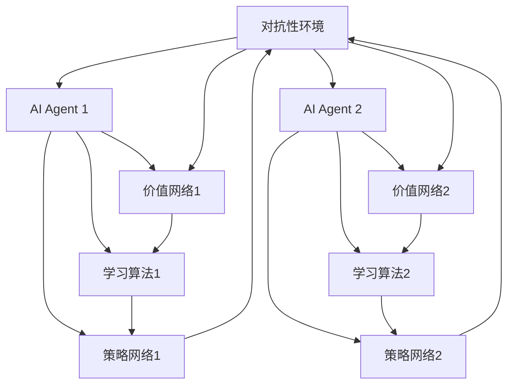

# 构建具有对抗学习能力的AI Agent

> 关键词：对抗学习、AI Agent、深度强化学习、博弈论、策略优化、神经网络、智能对抗

> 摘要：本文围绕构建具有对抗学习能力的AI Agent展开深入探讨。首先介绍了对抗学习和AI Agent的背景知识，包括目的、预期读者和文档结构。接着详细阐述了核心概念，通过文本示意图和Mermaid流程图展示其原理和架构。深入讲解了核心算法原理，使用Python代码进行说明，并给出了相关数学模型和公式。通过项目实战，从开发环境搭建到源代码实现与解读，展示了如何实际构建这样的AI Agent。分析了其实际应用场景，推荐了学习资源、开发工具框架和相关论文著作。最后总结了未来发展趋势与挑战，解答常见问题并提供扩展阅读和参考资料，旨在为相关领域的研究者和开发者提供全面的技术指导。

## 1. 背景介绍 
### 1.1 目的和范围
在当今人工智能领域，具有对抗学习能力的AI Agent有着广泛的应用前景。目的在于使AI Agent能够在竞争或对抗性环境中学习和进化，不断提升自身的决策能力和策略水平。范围涵盖了多个领域，如游戏、机器人控制、网络安全等。通过对抗学习，AI Agent可以模拟人类在对抗场景中的思维和行为方式，以达到最优的表现。

### 1.2 预期读者
本文预期读者包括人工智能领域的研究者、开发者、学生以及对对抗学习和AI Agent感兴趣的技术爱好者。无论是想要深入研究对抗学习理论的学术人员，还是希望在实际项目中应用对抗学习技术的开发者，都能从本文中获取有价值的信息。

### 1.3 文档结构概述
本文首先介绍背景知识，为读者建立基础概念。接着详细阐述核心概念和联系，通过示意图和流程图直观展示其原理。核心算法原理部分使用Python代码进行详细说明，同时给出数学模型和公式进行理论支持。项目实战部分从环境搭建到代码实现和解读，展示实际操作过程。分析实际应用场景，推荐相关的学习资源、开发工具框架和论文著作。最后总结未来发展趋势与挑战，解答常见问题并提供扩展阅读和参考资料。

### 1.4 术语表
#### 1.4.1 核心术语定义
- **对抗学习（Adversarial Learning）**：指在对抗性环境中，两个或多个智能体通过相互竞争和博弈来学习和优化自身策略的过程。
- **AI Agent（人工智能智能体）**：能够感知环境、做出决策并执行动作的智能实体，在对抗学习中可以是玩家、机器人等。
- **深度强化学习（Deep Reinforcement Learning）**：结合深度学习和强化学习的方法，通过神经网络来学习最优策略。
- **策略网络（Policy Network）**：用于生成AI Agent的动作策略的神经网络。
- **价值网络（Value Network）**：评估当前状态价值的神经网络，帮助AI Agent判断决策的优劣。

#### 1.4.2 相关概念解释
- **博弈论（Game Theory）**：研究决策主体在相互对抗或合作中的策略选择和均衡问题的理论，为对抗学习提供了数学基础。
- **马尔可夫决策过程（Markov Decision Process, MDP）**：描述了在随机环境中，智能体通过选择动作来最大化累积奖励的过程，是强化学习的重要模型。
- **探索与利用（Exploration and Exploitation）**：在对抗学习中，AI Agent需要在探索新的策略和利用已有的经验之间进行平衡，以找到最优策略。

#### 1.4.3 缩略词列表
- **MDP**：Markov Decision Process（马尔可夫决策过程）
- **DQN**：Deep Q-Network（深度Q网络）
- **A2C**：Advantage Actor-Critic（优势演员-评论家算法）
- **PPO**：Proximal Policy Optimization（近端策略优化算法）

## 2. 核心概念与联系 
### 核心概念原理
对抗学习的核心思想是通过智能体之间的对抗来推动学习和进化。在一个对抗性环境中，每个AI Agent都有自己的目标和策略，它们通过与对手的交互来获取奖励和反馈。通过不断地调整自己的策略，AI Agent可以逐渐提高在对抗中的表现。

深度强化学习是实现对抗学习的重要方法之一。在深度强化学习中，AI Agent使用神经网络来表示策略和价值函数。策略网络根据当前环境状态输出动作，而价值网络评估当前状态的价值。通过与环境的交互，AI Agent可以学习到最优的策略，以最大化累积奖励。

博弈论为对抗学习提供了理论支持。在博弈论中，不同的智能体通过选择不同的策略来达到自己的目标。对抗学习可以看作是一个动态的博弈过程，AI Agent需要根据对手的策略不断调整自己的策略，以达到纳什均衡。

### 架构的文本示意图
```plaintext
               +-------------------+
               | 对抗性环境         |
               +-------------------+
                      |
            +---------+---------+
            |                   |
+-------------------+    +-------------------+
| AI Agent 1        |    | AI Agent 2        |
| - 策略网络        |    | - 策略网络        |
| - 价值网络        |    | - 价值网络        |
| - 学习算法        |    | - 学习算法        |
+-------------------+    +-------------------+
```

### Mermaid流程图


这个流程图展示了对抗学习中AI Agent与环境之间的交互过程。AI Agent根据当前环境状态通过策略网络选择动作，执行动作后环境会给出反馈，价值网络评估当前状态的价值，学习算法根据反馈和价值评估来更新策略网络和价值网络，从而不断优化AI Agent的策略。

## 3. 核心算法原理 & 具体操作步骤 
### 核心算法原理
在构建具有对抗学习能力的AI Agent中，深度强化学习算法是核心。这里以近端策略优化算法（PPO）为例进行详细讲解。

PPO算法是一种基于策略梯度的深度强化学习算法，它通过限制策略更新的步长来避免策略更新过快导致的性能不稳定问题。PPO算法的核心思想是在更新策略时，通过比较新旧策略的比率来控制更新的幅度。

### 具体操作步骤
1. **初始化策略网络和价值网络**：使用随机参数初始化策略网络和价值网络。
2. **与环境交互**：AI Agent根据当前策略网络选择动作，与环境进行交互，获取奖励和下一个状态。
3. **收集数据**：将每次交互的状态、动作、奖励等数据保存下来，形成一个数据集。
4. **计算优势函数**：使用价值网络评估当前状态的价值，计算优势函数，用于衡量当前动作相对于平均动作的优劣。
5. **更新策略网络**：根据收集的数据和优势函数，使用PPO算法更新策略网络。
6. **更新价值网络**：使用收集的数据更新价值网络，以提高价值评估的准确性。
7. **重复步骤2-6**：不断重复上述步骤，直到策略收敛或达到预定的训练步数。

### Python源代码实现
```python
import torch
import torch.nn as nn
import torch.optim as optim
import numpy as np

# 定义策略网络
class PolicyNetwork(nn.Module):
    def __init__(self, input_dim, output_dim):
        super(PolicyNetwork, self).__init__()
        self.fc1 = nn.Linear(input_dim, 128)
        self.fc2 = nn.Linear(128, output_dim)
        self.softmax = nn.Softmax(dim=-1)

    def forward(self, x):
        x = torch.relu(self.fc1(x))
        x = self.softmax(self.fc2(x))
        return x

# 定义价值网络
class ValueNetwork(nn.Module):
    def __init__(self, input_dim):
        super(ValueNetwork, self).__init__()
        self.fc1 = nn.Linear(input_dim, 128)
        self.fc2 = nn.Linear(128, 1)

    def forward(self, x):
        x = torch.relu(self.fc1(x))
        x = self.fc2(x)
        return x

# PPO算法实现
class PPO:
    def __init__(self, input_dim, output_dim, lr_actor=3e-4, lr_critic=1e-3, gamma=0.99, clip_eps=0.2):
        self.policy = PolicyNetwork(input_dim, output_dim)
        self.value = ValueNetwork(input_dim)
        self.optimizer_actor = optim.Adam(self.policy.parameters(), lr=lr_actor)
        self.optimizer_critic = optim.Adam(self.value.parameters(), lr=lr_critic)
        self.gamma = gamma
        self.clip_eps = clip_eps

    def select_action(self, state):
        state = torch.FloatTensor(state).unsqueeze(0)
        probs = self.policy(state)
        action = torch.multinomial(probs, 1).item()
        log_prob = torch.log(probs.squeeze(0)[action])
        return action, log_prob

    def update(self, states, actions, log_probs_old, rewards):
        states = torch.FloatTensor(states)
        actions = torch.LongTensor(actions)
        log_probs_old = torch.FloatTensor(log_probs_old)
        rewards = torch.FloatTensor(rewards)

        # 计算优势函数
        values = self.value(states).squeeze()
        returns = []
        discounted_return = 0
        for reward in reversed(rewards):
            discounted_return = reward + self.gamma * discounted_return
            returns.insert(0, discounted_return)
        returns = torch.FloatTensor(returns)
        advantages = returns - values

        # 更新策略网络
        probs = self.policy(states)
        log_probs = torch.log(probs.gather(1, actions.unsqueeze(1)).squeeze())
        ratio = torch.exp(log_probs - log_probs_old)
        surr1 = ratio * advantages
        surr2 = torch.clamp(ratio, 1 - self.clip_eps, 1 + self.clip_eps) * advantages
        actor_loss = (-torch.min(surr1, surr2)).mean()

        self.optimizer_actor.zero_grad()
        actor_loss.backward()
        self.optimizer_actor.step()

        # 更新价值网络
        critic_loss = nn.MSELoss()(values, returns)
        self.optimizer_critic.zero_grad()
        critic_loss.backward()
        self.optimizer_critic.step()
```

### 代码解释
- `PolicyNetwork`：定义了策略网络，使用两个全连接层和一个Softmax激活函数输出动作的概率分布。
- `ValueNetwork`：定义了价值网络，使用两个全连接层输出当前状态的价值。
- `PPO`：实现了PPO算法的核心逻辑，包括选择动作、更新策略网络和价值网络等功能。
- `select_action`：根据当前状态选择动作，并返回动作和对应的对数概率。
- `update`：根据收集的数据更新策略网络和价值网络，包括计算优势函数、更新策略网络的损失和更新价值网络的损失。

## 4. 数学模型和公式 & 详细讲解 & 举例说明 
### 马尔可夫决策过程（MDP）
马尔可夫决策过程是一个五元组 $(S, A, P, R, \gamma)$，其中：
- $S$ 是状态空间，表示环境的所有可能状态。
- $A$ 是动作空间，表示AI Agent可以执行的所有动作。
- $P(s'|s, a)$ 是状态转移概率，表示在状态 $s$ 执行动作 $a$ 后转移到状态 $s'$ 的概率。
- $R(s, a)$ 是奖励函数，表示在状态 $s$ 执行动作 $a$ 后获得的奖励。
- $\gamma$ 是折扣因子，用于权衡当前奖励和未来奖励的重要性。

AI Agent的目标是找到一个最优策略 $\pi(a|s)$，使得累积折扣奖励最大化：
$$
J(\pi) = \mathbb{E}\left[\sum_{t=0}^{\infty} \gamma^t R(S_t, A_t) \right]
$$

### 策略梯度定理
策略梯度定理表明，策略 $\pi$ 的性能关于策略参数 $\theta$ 的梯度可以表示为：
$$
\nabla_{\theta} J(\pi_{\theta}) = \mathbb{E}_{\tau \sim \pi_{\theta}} \left[ \sum_{t=0}^{T} \nabla_{\theta} \log \pi_{\theta}(A_t|S_t) Q^{\pi_{\theta}}(S_t, A_t) \right]
$$
其中，$\tau$ 是一个轨迹，$Q^{\pi_{\theta}}(S_t, A_t)$ 是动作价值函数，表示在状态 $S_t$ 执行动作 $A_t$ 后按照策略 $\pi_{\theta}$ 继续执行所能获得的累积折扣奖励。

### PPO算法的数学公式
PPO算法通过限制策略更新的步长来避免策略更新过快导致的性能不稳定问题。PPO算法的目标函数可以表示为：
$$
L^{CLIP}(\theta) = \hat{\mathbb{E}}_t \left[ \min \left( r_t(\theta) \hat{A}_t, \text{clip}(r_t(\theta), 1 - \epsilon, 1 + \epsilon) \hat{A}_t \right) \right]
$$
其中，$r_t(\theta) = \frac{\pi_{\theta}(A_t|S_t)}{\pi_{\theta_{old}}(A_t|S_t)}$ 是新旧策略的比率，$\hat{A}_t$ 是优势函数，$\epsilon$ 是一个超参数，用于控制更新的幅度。

### 举例说明
假设我们有一个简单的游戏，AI Agent在一个二维网格中移动，目标是到达终点。状态 $s$ 可以表示为AI Agent在网格中的位置，动作 $a$ 可以是上下左右四个方向。奖励函数 $R(s, a)$ 可以设置为：如果到达终点，获得正奖励；如果撞到障碍物，获得负奖励；否则获得零奖励。

AI Agent使用PPO算法进行训练，通过不断与环境交互，更新策略网络和价值网络。在每次更新时，根据收集的数据计算优势函数和新旧策略的比率，然后使用目标函数 $L^{CLIP}(\theta)$ 来更新策略网络的参数。经过多次训练，AI Agent可以学习到最优的策略，以最快的速度到达终点。

## 5. 项目实战：代码实际案例和详细解释说明 
### 5.1  开发环境搭建
#### 安装Python
首先需要安装Python，建议使用Python 3.7及以上版本。可以从Python官方网站（https://www.python.org/downloads/）下载并安装。

#### 安装依赖库
使用以下命令安装必要的依赖库：
```bash
pip install torch numpy gym
```
- `torch`：PyTorch深度学习框架，用于构建和训练神经网络。
- `numpy`：用于数值计算。
- `gym`：OpenAI Gym是一个用于开发和比较强化学习算法的工具包，提供了各种模拟环境。

### 5.2  源代码详细实现和代码解读
```python
import gym
import torch
import numpy as np
from ppo import PPO

# 创建环境
env = gym.make('CartPole-v1')
input_dim = env.observation_space.shape[0]
output_dim = env.action_space.n

# 初始化PPO算法
ppo = PPO(input_dim, output_dim)

# 训练参数
num_episodes = 1000
max_steps_per_episode = 500

# 训练循环
for episode in range(num_episodes):
    states = []
    actions = []
    log_probs = []
    rewards = []

    state = env.reset()
    for step in range(max_steps_per_episode):
        action, log_prob = ppo.select_action(state)
        next_state, reward, done, _ = env.step(action)

        states.append(state)
        actions.append(action)
        log_probs.append(log_prob)
        rewards.append(reward)

        state = next_state

        if done:
            break

    # 更新策略网络和价值网络
    ppo.update(states, actions, log_probs, rewards)

    if episode % 10 == 0:
        print(f'Episode {episode}: Total reward = {sum(rewards)}')

# 测试训练好的模型
state = env.reset()
total_reward = 0
for step in range(max_steps_per_episode):
    action, _ = ppo.select_action(state)
    next_state, reward, done, _ = env.step(action)
    total_reward += reward
    state = next_state
    if done:
        break

print(f'Test reward: {total_reward}')
```

### 代码解读与分析
- **创建环境**：使用 `gym.make('CartPole-v1')` 创建一个OpenAI Gym的推车倒立摆环境。获取环境的状态维度和动作维度。
- **初始化PPO算法**：实例化 `PPO` 类，传入状态维度和动作维度。
- **训练循环**：在每个训练回合中，AI Agent与环境进行交互，收集状态、动作、对数概率和奖励数据。当回合结束时，使用收集的数据更新策略网络和价值网络。
- **测试训练好的模型**：使用训练好的模型在环境中进行测试，记录总奖励。

通过这个项目实战，我们可以看到如何使用PPO算法训练一个具有对抗学习能力的AI Agent，使其在推车倒立摆环境中取得较好的表现。

## 6. 实际应用场景 
### 游戏领域
在电子游戏中，具有对抗学习能力的AI Agent可以作为游戏对手，与玩家进行对抗。例如，在围棋、象棋等棋类游戏中，AI Agent可以通过与其他AI Agent或人类玩家的对抗学习，不断提高自己的棋艺水平。在实时策略游戏中，AI Agent可以根据对手的策略调整自己的战术，实现更加智能的对抗。

### 机器人控制
在机器人控制领域，对抗学习可以用于训练机器人在竞争环境中完成任务。例如，在机器人足球比赛中，每个机器人可以看作一个AI Agent，通过与对手的对抗学习，学习到最优的运动策略和协作策略，以提高比赛的胜率。

### 网络安全
在网络安全领域，对抗学习可以用于检测和防御网络攻击。例如，训练一个AI Agent作为防御者，另一个AI Agent作为攻击者，通过两者的对抗学习，防御者可以学习到更加有效的攻击检测和防御策略，提高网络的安全性。

### 金融交易
在金融交易领域，对抗学习可以用于模拟市场参与者之间的竞争和博弈。例如，训练多个AI Agent作为交易者，通过相互对抗学习，学习到最优的交易策略，以提高交易的收益。

## 7. 工具和资源推荐
### 7.1 学习资源推荐
#### 7.1.1 书籍推荐
- 《Reinforcement Learning: An Introduction》（《强化学习：原理与Python实现》）：这是一本强化学习领域的经典教材，详细介绍了强化学习的基本概念、算法和应用。
- 《Deep Learning》（《深度学习》）：由Ian Goodfellow、Yoshua Bengio和Aaron Courville撰写，全面介绍了深度学习的理论和实践。
- 《Game Theory: An Introduction》（《博弈论导论》）：介绍了博弈论的基本概念、模型和应用，为对抗学习提供了理论基础。

#### 7.1.2 在线课程
- Coursera上的“Reinforcement Learning Specialization”：由DeepMind的研究人员授课，涵盖了强化学习的各个方面。
- edX上的“Introduction to Artificial Intelligence”：介绍了人工智能的基本概念和算法，包括对抗学习。
- Udemy上的“Deep Reinforcement Learning Hands-On”：通过实际项目介绍深度强化学习的应用。

#### 7.1.3 技术博客和网站
- OpenAI Blog（https://openai.com/blog/）：OpenAI发布的最新研究成果和技术文章。
- DeepMind Blog（https://deepmind.com/blog/）：DeepMind的官方博客，分享了许多关于强化学习和对抗学习的研究。
- Towards Data Science（https://towardsdatascience.com/）：一个数据科学和人工智能领域的技术博客，有很多关于对抗学习的文章。

### 7.2 开发工具框架推荐
#### 7.2.1 IDE和编辑器
- PyCharm：一个功能强大的Python集成开发环境，提供了代码编辑、调试、版本控制等功能。
- Jupyter Notebook：一个交互式的开发环境，适合进行数据探索和模型实验。
- Visual Studio Code：一个轻量级的代码编辑器，支持多种编程语言和插件扩展。

#### 7.2.2 调试和性能分析工具
- TensorBoard：一个用于可视化深度学习模型训练过程的工具，可以监控损失函数、准确率等指标。
- Py-Spy：一个用于分析Python程序性能的工具，可以找出程序中的性能瓶颈。
- cProfile：Python内置的性能分析工具，可以统计函数调用的时间和次数。

#### 7.2.3 相关框架和库
- PyTorch：一个开源的深度学习框架，提供了丰富的神经网络模块和优化算法。
- TensorFlow：另一个广泛使用的深度学习框架，具有强大的分布式训练和部署能力。
- Stable Baselines3：一个基于PyTorch的强化学习库，提供了多种强化学习算法的实现。

### 7.3 相关论文著作推荐
#### 7.3.1 经典论文
- “Playing Atari with Deep Reinforcement Learning”：介绍了深度Q网络（DQN）算法，开启了深度强化学习的时代。
- “Asynchronous Methods for Deep Reinforcement Learning”：提出了异步优势演员-评论家（A3C）算法，提高了深度强化学习的训练效率。
- “Proximal Policy Optimization Algorithms”：介绍了近端策略优化（PPO）算法，是当前最流行的强化学习算法之一。

#### 7.3.2 最新研究成果
- 关注顶级人工智能会议如NeurIPS、ICML、CVPR等的最新研究成果，了解对抗学习领域的前沿动态。
- 在arXiv预印本平台上搜索相关的研究论文，获取最新的研究进展。

#### 7.3.3 应用案例分析
- 分析OpenAI、DeepMind等机构发布的实际应用案例，了解对抗学习在不同领域的应用方法和效果。
- 阅读相关的技术报告和白皮书，深入了解对抗学习在工业界的应用实践。

## 8. 总结：未来发展趋势与挑战
### 未来发展趋势
- **多智能体协同对抗**：未来的对抗学习将不仅仅局限于两个智能体之间的对抗，而是多个智能体之间的协同对抗。例如，在复杂的游戏场景中，多个AI Agent需要相互协作，共同对抗对手。
- **结合人类知识**：将人类的先验知识和经验融入到对抗学习中，可以加速AI Agent的学习过程，提高其决策能力。例如，在棋类游戏中，引入人类棋手的棋谱和策略。
- **对抗学习在更多领域的应用**：除了游戏、机器人控制、网络安全和金融交易等领域，对抗学习还将在医疗、交通、能源等领域得到更广泛的应用。

### 挑战
- **训练效率问题**：对抗学习通常需要大量的计算资源和时间来进行训练，如何提高训练效率是一个亟待解决的问题。
- **策略稳定性问题**：在对抗学习中，策略的更新可能会导致性能的不稳定，如何保证策略的稳定性是一个挑战。
- **可解释性问题**：深度学习模型通常是黑盒模型，难以解释其决策过程。在对抗学习中，如何提高模型的可解释性，让人们更好地理解AI Agent的行为，是一个重要的研究方向。

## 9. 附录：常见问题与解答
### 问题1：对抗学习和强化学习有什么区别？
对抗学习是强化学习的一种特殊形式，强化学习主要关注智能体在单个环境中的学习和优化，而对抗学习强调多个智能体之间的竞争和博弈。在对抗学习中，智能体的奖励不仅取决于自身的行为，还受到对手行为的影响。

### 问题2：PPO算法和其他强化学习算法相比有什么优势？
PPO算法通过限制策略更新的步长，避免了策略更新过快导致的性能不稳定问题。与其他算法相比，PPO算法具有更高的样本效率和更好的收敛性，在实际应用中表现更优。

### 问题3：如何选择合适的学习率和超参数？
选择合适的学习率和超参数通常需要进行实验和调优。可以使用网格搜索、随机搜索等方法来尝试不同的参数组合，选择在验证集上表现最好的参数。此外，也可以参考相关的研究论文和经验，选择一些常用的参数设置。

### 问题4：对抗学习在实际应用中可能会遇到哪些问题？
在实际应用中，对抗学习可能会遇到训练效率低、策略不稳定、可解释性差等问题。此外，还可能会受到数据质量、环境噪声等因素的影响。需要针对具体问题采取相应的解决措施，如优化算法、增加数据量、引入正则化等。

## 10. 扩展阅读 & 参考资料
### 扩展阅读
- 《Artificial Intelligence: A Modern Approach》（《人工智能：一种现代的方法》）：全面介绍了人工智能的各个领域，包括对抗学习。
- 《Machine Learning Yearning》（《机器学习训练秘籍》）：由Andrew Ng撰写，提供了很多机器学习实践中的实用技巧和建议。
- 《Adversarial Machine Learning》（《对抗机器学习》）：专门介绍对抗机器学习的理论和应用。

### 参考资料
- OpenAI Gym官方文档（https://gym.openai.com/docs/）：提供了OpenAI Gym的详细使用说明和示例代码。
- PyTorch官方文档（https://pytorch.org/docs/stable/index.html）：PyTorch的官方文档，包含了丰富的教程和API文档。
- Stable Baselines3官方文档（https://stable-baselines3.readthedocs.io/en/master/）：Stable Baselines3的官方文档，介绍了各种强化学习算法的使用方法。

作者：AI天才研究院/AI Genius Institute & 禅与计算机程序设计艺术 /Zen And The Art of Computer Programming