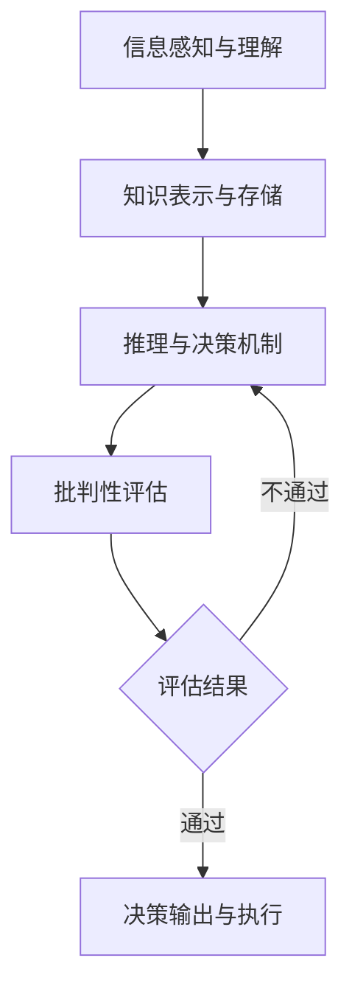

# 构建具有批判性思维的AI Agent系统

> 关键词：批判性思维、AI Agent系统、智能决策、推理机制、认知模型

> 摘要：本文聚焦于构建具有批判性思维的AI Agent系统这一前沿话题。首先介绍了相关背景信息，包括目的范围、预期读者等。接着深入阐述核心概念及联系，展示了系统的原理和架构。通过Python代码详细讲解核心算法原理和具体操作步骤，并给出相应的数学模型和公式。在项目实战部分，提供开发环境搭建、源代码实现与解读。同时探讨了该系统的实际应用场景，推荐了相关的学习资源、开发工具框架以及论文著作。最后总结未来发展趋势与挑战，解答常见问题，并提供扩展阅读和参考资料，旨在为研究和开发具有批判性思维的AI Agent系统提供全面且深入的指导。

## 1. 背景介绍 
### 1.1 目的和范围
本研究的目的在于设计并实现一个具有批判性思维的AI Agent系统。随着人工智能技术的不断发展，传统的AI系统往往只能按照预设的规则和模式进行操作，缺乏对信息的深入分析、质疑和评估能力。而具有批判性思维的AI Agent系统能够对输入的信息进行批判性思考，提出合理的质疑，评估各种可能性，并做出更加智能和合理的决策。

本研究的范围涵盖了从理论层面的批判性思维概念引入到实际系统的开发实现。包括核心概念的定义和分析、相关算法的设计与优化、数学模型的建立、实际项目的开发与测试，以及系统在不同应用场景中的应用探索。

### 1.2 预期读者
本文的预期读者包括人工智能领域的研究人员、开发者、相关专业的学生以及对具有批判性思维的AI系统感兴趣的技术爱好者。研究人员可以从本文中获取新的研究思路和方法，开发者可以借鉴系统的设计和实现方案，学生可以加深对人工智能和批判性思维的理解，技术爱好者可以了解该领域的前沿动态。

### 1.3 文档结构概述
本文共分为十个部分。第一部分是背景介绍，阐述了研究的目的和范围、预期读者以及文档的结构概述，并对相关术语进行解释。第二部分介绍核心概念与联系，通过文本示意图和Mermaid流程图展示系统的原理和架构。第三部分讲解核心算法原理和具体操作步骤，使用Python代码进行详细阐述。第四部分给出数学模型和公式，并进行详细讲解和举例说明。第五部分是项目实战，包括开发环境搭建、源代码详细实现和代码解读。第六部分探讨实际应用场景。第七部分推荐相关的工具和资源，包括学习资源、开发工具框架和论文著作。第八部分总结未来发展趋势与挑战。第九部分是附录，解答常见问题。第十部分提供扩展阅读和参考资料。

### 1.4 术语表
#### 1.4.1 核心术语定义
- **AI Agent系统**：一种能够感知环境、进行决策并执行相应动作的人工智能实体。它可以根据输入的信息自主地选择合适的行为，以实现特定的目标。
- **批判性思维**：是一种理性的、反思性的思维方式，包括对信息的分析、评估、质疑、推理和判断等能力。具有批判性思维的个体能够不盲目接受信息，而是对其进行深入思考，识别其中的逻辑错误、偏见和不合理之处。
- **推理机制**：AI Agent系统中用于从已知信息推导出新信息的规则和方法。它是实现批判性思维的重要组成部分，能够帮助系统根据已有的知识和证据进行合理的推断。
- **认知模型**：对人类认知过程进行抽象和建模的一种方式。在AI Agent系统中，认知模型用于模拟人类的思维和决策过程，使系统能够像人类一样进行批判性思考。

#### 1.4.2 相关概念解释
- **信息评估**：对输入的信息进行质量和可靠性的评估。在批判性思维中，信息评估是非常重要的一步，因为只有可靠的信息才能作为决策的依据。
- **假设检验**：通过收集证据来验证或反驳某个假设的过程。在AI Agent系统中，假设检验可以帮助系统对不同的观点和方案进行评估，从而做出更合理的决策。
- **逻辑推理**：根据逻辑规则从前提推导出结论的过程。逻辑推理是批判性思维的基础，能够帮助系统识别信息中的逻辑关系，判断推理的正确性。

#### 1.4.3 缩略词列表
- **AI**：Artificial Intelligence，人工智能
- **ML**：Machine Learning，机器学习
- **DL**：Deep Learning，深度学习

## 2. 核心概念与联系 

### 核心概念原理
具有批判性思维的AI Agent系统的核心原理是模拟人类的批判性思维过程。人类在面对信息时，会首先对其进行感知和理解，然后运用自己的知识和经验对信息进行分析和评估，提出质疑和假设，并通过推理和验证来判断信息的可靠性和合理性，最后根据评估结果做出决策。

AI Agent系统要实现批判性思维，需要具备以下几个关键要素：
1. **信息感知与理解**：能够通过各种传感器或接口获取外部信息，并对其进行语义分析和理解，将信息转化为系统能够处理的形式。
2. **知识表示与存储**：拥有一个知识库，用于存储各种领域知识和规则。知识的表示方式应该便于系统进行查询、推理和更新。
3. **推理与决策机制**：基于知识库和输入的信息，运用推理算法进行逻辑推理和决策。推理机制应该能够处理不确定性和模糊性，同时具备自我修正和学习的能力。
4. **批判性评估模块**：对推理结果和决策进行批判性评估，识别其中可能存在的错误、偏见和不合理之处，并提出改进建议。

### 架构的文本示意图
```plaintext
+---------------------+
| 信息感知与理解模块 |
+---------------------+
         |
         v
+---------------------+
| 知识表示与存储模块 |
+---------------------+
         |
         v
+---------------------+
| 推理与决策机制模块 |
+---------------------+
         |
         v
+---------------------+
| 批判性评估模块     |
+---------------------+
         |
         v
+---------------------+
| 决策输出与执行模块 |
+---------------------+
```

### Mermaid流程图


在这个流程图中，信息首先经过感知与理解模块处理后进入知识表示与存储模块。推理与决策机制模块根据知识库和输入信息进行推理和决策。批判性评估模块对推理结果进行评估，如果评估通过，则将决策输出并执行；如果评估不通过，则返回推理与决策机制模块进行重新推理和决策。

## 3. 核心算法原理 & 具体操作步骤 

### 核心算法原理
为了实现具有批判性思维的AI Agent系统，我们可以采用基于规则的推理算法和机器学习算法相结合的方法。

#### 基于规则的推理算法
基于规则的推理算法是一种传统的知识推理方法，它通过定义一系列的规则和事实，利用逻辑推理来得出结论。在具有批判性思维的AI Agent系统中，规则可以表示为“如果……那么……”的形式，例如：“如果一个信息来源不可靠，那么该信息的可信度较低”。

以下是一个简单的基于规则的推理算法的Python代码示例：
```python
# 定义规则和事实
rules = [
    {"if": "信息来源不可靠", "then": "信息可信度较低"},
    {"if": "信息存在逻辑矛盾", "then": "信息可信度较低"}
]
facts = ["信息来源不可靠"]

# 推理函数
def rule_based_reasoning(rules, facts):
    conclusions = []
    for rule in rules:
        if rule["if"] in facts:
            conclusions.append(rule["then"])
    return conclusions

# 执行推理
result = rule_based_reasoning(rules, facts)
print("推理结果:", result)
```
在这个示例中，我们定义了两条规则和一个事实列表。推理函数`rule_based_reasoning`遍历规则列表，检查规则的前提条件是否在事实列表中，如果是，则将规则的结论添加到结论列表中。

#### 机器学习算法
机器学习算法可以用于处理复杂的模式识别和预测问题。在具有批判性思维的AI Agent系统中，我们可以使用机器学习算法来对信息进行分类、评估和预测。例如，使用深度学习算法对文本信息进行情感分析和主题分类，以评估信息的可靠性和相关性。

以下是一个简单的使用Python和Scikit-learn库进行文本分类的示例：
```python
from sklearn.feature_extraction.text import TfidfVectorizer
from sklearn.naive_bayes import MultinomialNB
from sklearn.pipeline import Pipeline

# 训练数据
train_data = [
    ("这条信息很可靠", "可靠"),
    ("这个消息来源不明", "不可靠"),
    ("该信息存在明显错误", "不可靠")
]
train_texts = [text for text, label in train_data]
train_labels = [label for text, label in train_data]

# 构建分类器
classifier = Pipeline([
    ('vectorizer', TfidfVectorizer()),
    ('classifier', MultinomialNB())
])

# 训练分类器
classifier.fit(train_texts, train_labels)

# 测试数据
test_text = "这条消息的来源不清楚"
predicted_label = classifier.predict([test_text])
print("预测标签:", predicted_label[0])
```
在这个示例中，我们使用了`TfidfVectorizer`将文本转换为特征向量，使用`MultinomialNB`作为分类器。通过训练数据对分类器进行训练，然后使用训练好的分类器对测试数据进行分类预测。

### 具体操作步骤
1. **数据收集与预处理**：收集与系统应用领域相关的信息数据，并对数据进行清洗、标注和特征提取等预处理操作。
2. **知识获取与表示**：从数据中提取领域知识，并将其表示为规则、本体等形式，存储到知识库中。
3. **模型训练**：使用机器学习算法对预处理后的数据进行训练，得到分类器、预测模型等。
4. **推理与决策**：当系统接收到新的信息时，首先进行信息感知与理解，然后结合知识库和训练好的模型进行推理和决策。
5. **批判性评估**：对推理结果和决策进行批判性评估，检查是否存在逻辑错误、偏见等问题。
6. **反馈与优化**：根据批判性评估的结果，对推理过程和模型进行反馈和优化，提高系统的性能和可靠性。

## 4. 数学模型和公式 & 详细讲解 & 举例说明 

### 信息可信度评估模型
在具有批判性思维的AI Agent系统中，信息可信度评估是一个重要的环节。我们可以使用以下数学模型来评估信息的可信度。

设信息 $I$ 有 $n$ 个特征 $f_1, f_2, \cdots, f_n$，每个特征对应一个权重 $w_1, w_2, \cdots, w_n$，且 $\sum_{i=1}^{n} w_i = 1$。特征 $f_i$ 的可信度评分为 $s_i$，则信息 $I$ 的可信度 $C(I)$ 可以表示为：

$$C(I) = \sum_{i=1}^{n} w_i s_i$$

### 详细讲解
这个模型的核心思想是将信息的可信度看作是各个特征可信度的加权平均值。每个特征的权重反映了该特征在评估信息可信度时的重要程度，特征的可信度评分则根据具体的评估标准进行确定。

### 举例说明
假设我们要评估一条新闻信息的可信度，考虑以下三个特征：
1. **信息来源的可靠性**：权重 $w_1 = 0.5$，评分 $s_1 = 0.8$（表示该信息来源比较可靠）。
2. **信息内容的逻辑性**：权重 $w_2 = 0.3$，评分 $s_2 = 0.6$（表示信息内容存在一些逻辑瑕疵）。
3. **信息与其他证据的一致性**：权重 $w_3 = 0.2$，评分 $s_3 = 0.7$（表示信息与其他证据基本一致）。

根据上述公式，该新闻信息的可信度为：

$$C(I) = 0.5 \times 0.8 + 0.3 \times 0.6 + 0.2 \times 0.7 = 0.72$$

这表明该新闻信息的可信度为 0.72，处于中等偏上的水平。

### 推理过程中的概率模型
在推理过程中，我们可以使用概率模型来处理不确定性。例如，使用贝叶斯定理来更新假设的概率。

设 $H$ 为假设，$E$ 为证据，则贝叶斯定理可以表示为：

$$P(H|E) = \frac{P(E|H)P(H)}{P(E)}$$

其中，$P(H|E)$ 是在证据 $E$ 出现的情况下假设 $H$ 成立的概率，$P(E|H)$ 是在假设 $H$ 成立的情况下证据 $E$ 出现的概率，$P(H)$ 是假设 $H$ 的先验概率，$P(E)$ 是证据 $E$ 出现的概率。

### 详细讲解
贝叶斯定理的核心思想是根据新的证据来更新假设的概率。先验概率 $P(H)$ 表示在没有任何证据的情况下假设 $H$ 成立的概率，$P(E|H)$ 表示假设 $H$ 成立时证据 $E$ 出现的可能性，$P(E)$ 表示证据 $E$ 出现的总概率。通过贝叶斯定理，我们可以计算出在证据 $E$ 出现的情况下假设 $H$ 成立的后验概率 $P(H|E)$。

### 举例说明
假设我们要判断一个人是否患有某种疾病（假设 $H$），已知该疾病的发病率（先验概率）$P(H) = 0.01$。有一种检测方法，在患者身上检测出阳性的概率 $P(E|H) = 0.9$，在非患者身上检测出阳性的概率 $P(E|\neg H) = 0.05$。现在一个人检测结果为阳性（证据 $E$），我们可以使用贝叶斯定理计算他患有该疾病的概率。

首先，计算 $P(E)$：

$$P(E) = P(E|H)P(H) + P(E|\neg H)P(\neg H) = 0.9 \times 0.01 + 0.05 \times (1 - 0.01) = 0.0585$$

然后，计算 $P(H|E)$：

$$P(H|E) = \frac{P(E|H)P(H)}{P(E)} = \frac{0.9 \times 0.01}{0.0585} \approx 0.154$$

这表明在检测结果为阳性的情况下，这个人患有该疾病的概率约为 0.154。

## 5. 项目实战：代码实际案例和详细解释说明 

### 5.1  开发环境搭建
#### 操作系统
可以选择常见的操作系统，如Windows、Linux（如Ubuntu）或macOS。

#### 编程语言
使用Python作为主要的编程语言，因为Python具有丰富的机器学习和人工智能库，方便进行开发。

#### 开发工具
推荐使用Anaconda作为Python的发行版，它包含了许多常用的科学计算和机器学习库。同时，可以使用PyCharm或Jupyter Notebook作为开发环境。

#### 安装必要的库
在命令行中使用以下命令安装必要的库：
```sh
pip install numpy pandas scikit-learn tensorflow keras
```

### 5.2  源代码详细实现和代码解读
以下是一个简单的具有批判性思维的AI Agent系统的源代码示例，用于对新闻信息进行可信度评估和决策。

```python
import numpy as np
from sklearn.feature_extraction.text import TfidfVectorizer
from sklearn.linear_model import LogisticRegression

# 数据准备
news_data = [
    ("这条新闻来自权威媒体，内容逻辑清晰", "可靠"),
    ("该新闻来源不明，存在明显错误", "不可靠"),
    ("新闻内容与事实不符，缺乏证据支持", "不可靠"),
    ("新闻报道客观公正，有多个信源佐证", "可靠")
]
train_texts = [text for text, label in news_data]
train_labels = [label for text, label in news_data]

# 特征提取
vectorizer = TfidfVectorizer()
X_train = vectorizer.fit_transform(train_texts)

# 模型训练
model = LogisticRegression()
model.fit(X_train, train_labels)

# 批判性评估函数
def critical_evaluation(text):
    # 特征转换
    X_test = vectorizer.transform([text])
    # 预测可信度
    predicted_label = model.predict(X_test)[0]
    # 检查逻辑错误（简单示例：检查是否包含矛盾词汇）
    contradictory_words = ["前后矛盾", "逻辑混乱"]
    has_contradiction = any(word in text for word in contradictory_words)
    if has_contradiction:
        predicted_label = "不可靠"
    return predicted_label

# 测试新闻信息
test_news = "这条新闻虽然来自知名媒体，但内容前后矛盾"
result = critical_evaluation(test_news)
print("评估结果:", result)
```

### 代码解读与分析
1. **数据准备**：定义了一个包含新闻文本和可信度标签的数据集，将文本和标签分别存储在`train_texts`和`train_labels`中。
2. **特征提取**：使用`TfidfVectorizer`将文本转换为TF-IDF特征向量，方便机器学习模型进行处理。
3. **模型训练**：使用逻辑回归模型`LogisticRegression`对训练数据进行训练，得到一个可以预测新闻可信度的模型。
4. **批判性评估函数**：`critical_evaluation`函数接收一个新闻文本作为输入，首先将文本转换为特征向量，然后使用训练好的模型进行预测。接着，检查文本中是否包含矛盾词汇，如果包含，则将预测结果修改为“不可靠”。
5. **测试**：定义了一个测试新闻文本，调用`critical_evaluation`函数进行评估，并输出评估结果。

这个示例展示了如何结合机器学习模型和简单的规则进行批判性评估，提高了系统的决策可靠性。

## 6. 实际应用场景 
### 新闻信息筛选
在新闻媒体领域，具有批判性思维的AI Agent系统可以对海量的新闻信息进行筛选和评估。系统可以根据新闻的来源、内容的逻辑性、与其他证据的一致性等因素，判断新闻的可信度。对于不可靠的新闻，可以进行过滤或标记，帮助用户获取更准确、可靠的信息。

### 金融风险评估
在金融领域，AI Agent系统可以对各种金融信息进行批判性分析，评估投资项目的风险。系统可以分析市场趋势、公司财务报表、行业动态等信息，识别其中可能存在的风险因素，并提出相应的风险预警和建议。

### 医疗诊断辅助
在医疗领域，AI Agent系统可以作为医生的辅助工具，对患者的病历、检查报告等信息进行批判性评估。系统可以分析诊断结果的合理性，检查是否存在漏诊、误诊等问题，并提供相关的参考建议，帮助医生做出更准确的诊断和治疗决策。

### 智能客服
在智能客服系统中，AI Agent系统可以对用户的问题和反馈进行批判性思考。系统可以分析用户问题的意图和背景，评估解决方案的可行性和有效性，并提供更智能、个性化的服务。例如，当用户提出一个不合理的需求时，系统可以通过批判性评估，向用户解释原因并提供合理的替代方案。

## 7. 工具和资源推荐
### 7.1 学习资源推荐
#### 7.1.1 书籍推荐
- 《人工智能：一种现代的方法》：这是一本经典的人工智能教材，涵盖了人工智能的各个领域，包括知识表示、推理、机器学习等内容，对于理解具有批判性思维的AI Agent系统的原理和技术有很大的帮助。
- 《批判性思维工具》：介绍了批判性思维的基本概念、方法和技巧，帮助读者培养批判性思维能力，对于设计具有批判性思维的AI Agent系统有重要的启示作用。
- 《Python机器学习》：详细介绍了使用Python进行机器学习的方法和技术，包括数据预处理、模型训练、评估等内容，是学习和开发AI Agent系统的重要参考书籍。

#### 7.1.2 在线课程
- Coursera上的“人工智能基础”课程：由知名高校的教授授课，系统地介绍了人工智能的基本概念、算法和应用，适合初学者学习。
- edX上的“机器学习”课程：由斯坦福大学的教授授课，深入讲解了机器学习的原理和算法，对于理解AI Agent系统中的机器学习部分有很大的帮助。
- 中国大学MOOC上的“批判性思维”课程：介绍了批判性思维的理论和实践，帮助学习者提高批判性思维能力。

#### 7.1.3 技术博客和网站
- Medium：一个汇聚了众多技术专家和爱好者的博客平台，上面有很多关于人工智能、机器学习和批判性思维的文章，可以及时了解最新的技术动态和研究成果。
- Towards Data Science：专注于数据科学和机器学习领域的博客网站，提供了丰富的技术教程和案例分析。
- 知乎：一个知识分享社区，有很多关于人工智能和批判性思维的讨论和问答，可以与其他爱好者和专家进行交流和学习。

### 7.2 开发工具框架推荐
#### 7.2.1 IDE和编辑器
- PyCharm：一款专业的Python集成开发环境，具有代码编辑、调试、自动补全、版本控制等功能，适合大规模的Python项目开发。
- Jupyter Notebook：一种交互式的开发环境，支持代码、文本、图表等多种形式的展示，方便进行数据探索和模型实验。
- Visual Studio Code：一款轻量级的代码编辑器，支持多种编程语言，具有丰富的插件扩展功能，可以根据需要进行定制。

#### 7.2.2 调试和性能分析工具
- PDB：Python自带的调试工具，可以帮助开发者定位和解决代码中的问题。
- cProfile：Python的性能分析工具，可以分析代码的运行时间和资源消耗情况，帮助开发者优化代码性能。
- TensorBoard：TensorFlow提供的可视化工具，可以帮助开发者监控模型的训练过程、查看模型的结构和性能指标等。

#### 7.2.3 相关框架和库
- Scikit-learn：一个简单易用的机器学习库，提供了各种机器学习算法和工具，如分类、回归、聚类等，方便进行模型开发和实验。
- TensorFlow：一个开源的深度学习框架，支持多种深度学习模型的构建和训练，如神经网络、卷积神经网络等。
- Keras：一个高级的深度学习库，基于TensorFlow或Theano等后端，提供了简单易用的API，适合快速搭建和训练深度学习模型。

### 7.3 相关论文著作推荐
#### 7.3.1 经典论文
- “Artificial Intelligence: A New Synthesis” by Nils J. Nilsson：介绍了人工智能的基本概念和方法，是人工智能领域的经典论文之一。
- “A Mathematical Theory of Communication” by Claude E. Shannon：奠定了信息论的基础，对于理解信息的表示和处理有重要的意义。
- “The Logic of Scientific Discovery” by Karl Popper：探讨了科学研究中的批判性思维和证伪原则，对于设计具有批判性思维的AI Agent系统有重要的启示。

#### 7.3.2 最新研究成果
- “Deep Learning for Critical Thinking in AI Agents”：研究了如何使用深度学习技术实现AI Agent的批判性思维能力，提出了一些新的方法和模型。
- “Towards Autonomous Agents with Critical Reasoning Skills”：探讨了如何设计具有批判性推理能力的自主智能体，分析了相关的技术挑战和解决方案。

#### 7.3.3 应用案例分析
- “Applying Critical Thinking AI Agents in Financial Risk Assessment”：介绍了如何将具有批判性思维的AI Agent系统应用于金融风险评估领域，通过实际案例分析了系统的有效性和优势。
- “Critical Thinking AI in Medical Diagnosis: A Case Study”：研究了具有批判性思维的AI Agent系统在医疗诊断中的应用，通过案例展示了系统如何辅助医生进行诊断和决策。

## 8. 总结：未来发展趋势与挑战
### 未来发展趋势
1. **与人类协作更加紧密**：具有批判性思维的AI Agent系统将与人类更加紧密地协作，成为人类的智能助手。系统可以帮助人类处理复杂的信息，提供决策支持，同时人类可以对系统的决策进行监督和修正，实现人机优势互补。
2. **跨领域应用拓展**：该系统将在更多的领域得到应用，如教育、法律、艺术等。在教育领域，系统可以帮助学生培养批判性思维能力；在法律领域，系统可以辅助律师进行案件分析和决策；在艺术领域，系统可以对艺术作品进行评估和创作启发。
3. **融入社会智能网络**：多个具有批判性思维的AI Agent系统可以相互协作，形成社会智能网络。在这个网络中，系统可以共享知识和信息，进行协同推理和决策，提高整个社会的智能水平。

### 挑战
1. **知识获取和更新**：要实现具有批判性思维的AI Agent系统，需要大量的领域知识。如何高效地获取、表示和更新这些知识是一个挑战。同时，知识的准确性和一致性也需要保证。
2. **处理不确定性和模糊性**：现实世界中的信息往往具有不确定性和模糊性，如何让AI Agent系统在这种情况下进行合理的推理和决策是一个难题。需要研究更有效的概率模型和推理算法来处理不确定性。
3. **伦理和法律问题**：具有批判性思维的AI Agent系统在决策过程中可能会对人类产生影响，因此需要考虑伦理和法律问题。例如，系统的决策是否符合道德标准，系统出现错误决策时责任如何划分等。

## 9. 附录：常见问题与解答
### 问题1：具有批判性思维的AI Agent系统与传统AI系统有什么区别？
解答：传统AI系统通常是按照预设的规则和模式进行操作，缺乏对信息的深入分析、质疑和评估能力。而具有批判性思维的AI Agent系统能够对输入的信息进行批判性思考，提出合理的质疑，评估各种可能性，并做出更加智能和合理的决策。

### 问题2：如何衡量AI Agent系统的批判性思维能力？
解答：可以从以下几个方面衡量AI Agent系统的批判性思维能力：信息评估的准确性、推理的合理性、对假设的质疑能力、决策的可靠性等。可以通过设计一些测试案例和评估指标来对系统的批判性思维能力进行评估。

### 问题3：开发具有批判性思维的AI Agent系统需要哪些技术基础？
解答：需要掌握人工智能、机器学习、自然语言处理等方面的知识和技术。同时，还需要了解批判性思维的基本概念和方法，以及相关的领域知识。

### 问题4：具有批判性思维的AI Agent系统会取代人类的决策吗？
解答：不会。虽然该系统可以提供决策支持，但人类的决策过程还涉及到情感、价值观等因素，这些是目前AI系统无法完全模拟的。系统将作为人类的智能助手，与人类共同协作，提高决策的质量和效率。

## 10. 扩展阅读 & 参考资料
### 扩展阅读
- 《思考，快与慢》：探讨了人类思维的两种模式，对于理解批判性思维的形成和作用有很大的帮助。
- 《人类简史：从动物到上帝》：从宏观的角度介绍了人类的发展历程，思考了人类的思维和决策方式，为设计具有批判性思维的AI Agent系统提供了更广阔的视角。

### 参考资料
- Nilsson, N. J. (1998). Artificial Intelligence: A New Synthesis. Morgan Kaufmann.
- Popper, K. R. (2002). The Logic of Scientific Discovery. Routledge.
- Géron, A. (2019). Hands-On Machine Learning with Scikit-Learn, Keras, and TensorFlow: Concepts, Tools, and Techniques to Build Intelligent Systems. O'Reilly Media.

作者：AI天才研究院/AI Genius Institute & 禅与计算机程序设计艺术 /Zen And The Art of Computer Programming