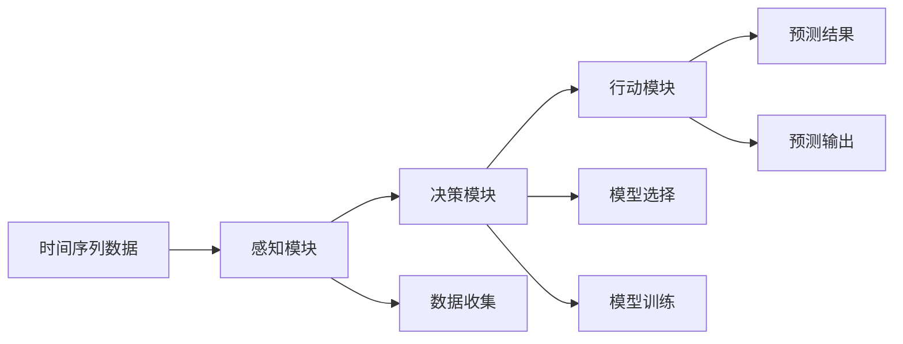

# 构建具有时间序列预测能力的AI Agent

> 关键词：时间序列预测、AI Agent、机器学习、深度学习、预测模型

> 摘要：本文旨在深入探讨如何构建具有时间序列预测能力的AI Agent。详细介绍了相关的核心概念、算法原理、数学模型，通过项目实战展示具体的代码实现和解读，分析了实际应用场景，并推荐了相关的工具和资源。最后对未来发展趋势与挑战进行了总结，同时提供了常见问题的解答和扩展阅读参考资料，帮助读者全面掌握构建具有时间序列预测能力的AI Agent的技术。

## 1. 背景介绍 
### 1.1 目的和范围
时间序列预测在众多领域有着广泛的应用，如金融市场预测、气象预报、工业生产调度等。构建具有时间序列预测能力的AI Agent可以自动化地对时间序列数据进行分析和预测，提高预测的准确性和效率。本文的范围涵盖了从核心概念的介绍、算法原理的讲解、数学模型的推导，到项目实战的代码实现，以及实际应用场景的分析等方面，旨在为读者提供一个全面的构建具有时间序列预测能力的AI Agent的技术指南。

### 1.2 预期读者
本文预期读者包括对时间序列预测和AI Agent技术感兴趣的程序员、数据科学家、机器学习爱好者、软件架构师等。无论您是初学者还是有一定经验的专业人士，都可以从本文中获取有价值的信息和知识。

### 1.3 文档结构概述
本文将按照以下结构进行组织：首先介绍核心概念与联系，包括时间序列、AI Agent等概念的原理和架构；接着讲解核心算法原理和具体操作步骤，使用Python源代码进行详细阐述；然后介绍数学模型和公式，并进行详细讲解和举例说明；之后通过项目实战展示代码的实际案例和详细解释说明；再分析实际应用场景；推荐相关的工具和资源；最后总结未来发展趋势与挑战，提供常见问题的解答和扩展阅读参考资料。

### 1.4 术语表
#### 1.4.1 核心术语定义
- **时间序列**：是指将同一统计指标的数值按其发生的时间先后顺序排列而成的数列。时间序列数据通常具有时间上的相关性和趋势性。
- **AI Agent**：是指能够感知环境、进行决策并采取行动以实现特定目标的智能实体。在本文中，AI Agent的目标是对时间序列数据进行预测。
- **预测模型**：是指用于对时间序列数据进行预测的数学模型，常见的预测模型包括ARIMA、LSTM等。

#### 1.4.2 相关概念解释
- **平稳时间序列**：是指时间序列的统计特性不随时间的推移而发生变化，即均值、方差和自协方差等统计量在不同时间点上保持不变。平稳时间序列是许多时间序列分析方法的基础。
- **非平稳时间序列**：是指时间序列的统计特性随时间的推移而发生变化，非平稳时间序列通常需要进行差分等处理以转化为平稳时间序列。
- **自回归模型（AR）**：是指用过去的观测值来预测未来值的模型，它假设当前值与过去的若干个值之间存在线性关系。
- **移动平均模型（MA）**：是指用过去的误差项来预测未来值的模型，它假设当前值与过去的若干个误差项之间存在线性关系。
- **自回归移动平均模型（ARMA）**：是指结合了自回归模型和移动平均模型的优点，同时考虑了过去的观测值和误差项对当前值的影响。
- **自回归积分滑动平均模型（ARIMA）**：是指在ARMA模型的基础上，对非平稳时间序列进行差分处理，使其转化为平稳时间序列后再进行建模。
- **长短期记忆网络（LSTM）**：是一种特殊的循环神经网络，能够有效地处理时间序列数据中的长期依赖关系。

#### 1.4.3 缩略词列表
- **AR**：Autoregressive Model
- **MA**：Moving Average Model
- **ARMA**：Autoregressive Moving Average Model
- **ARIMA**：Autoregressive Integrated Moving Average Model
- **LSTM**：Long Short-Term Memory Network

## 2. 核心概念与联系 
### 2.1 时间序列的基本概念
时间序列是按时间顺序排列的一组数据点。它可以是连续的，如股票价格的每分钟记录；也可以是离散的，如每月的销售额。时间序列数据通常具有以下特点：
- **趋势性**：数据随时间呈现出上升或下降的趋势。
- **季节性**：数据在固定的时间间隔内呈现出周期性的变化。
- **周期性**：数据呈现出非固定周期的波动。
- **随机性**：数据中存在随机的波动和噪声。

### 2.2 AI Agent的基本概念
AI Agent是一个能够感知环境、进行决策并采取行动的智能实体。在时间序列预测的场景中，AI Agent的主要任务是感知时间序列数据，通过学习和分析这些数据来建立预测模型，并使用该模型对未来的时间序列值进行预测。AI Agent通常由以下几个部分组成：
- **感知模块**：负责收集和处理时间序列数据。
- **决策模块**：根据感知到的数据，选择合适的预测模型和算法，并进行参数调整。
- **行动模块**：使用训练好的预测模型对未来的时间序列值进行预测，并输出预测结果。

### 2.3 时间序列预测与AI Agent的联系
时间序列预测是AI Agent在时间序列数据领域的一个重要应用。AI Agent可以通过学习时间序列数据的特征和规律，建立准确的预测模型，从而实现对未来时间序列值的预测。同时，AI Agent可以根据预测结果采取相应的行动，如调整生产计划、进行投资决策等。

### 2.4 核心概念原理和架构的文本示意图
```plaintext
时间序列数据 -> 感知模块 -> 决策模块 -> 行动模块 -> 预测结果
|            |            |            |
|            |            |            |
|            |            |            |
V            V            V            V
数据收集    模型选择    模型训练    预测输出
```

### 2.5 Mermaid流程图


## 3. 核心算法原理 & 具体操作步骤 
### 3.1 ARIMA算法原理
ARIMA（Autoregressive Integrated Moving Average）模型是一种广泛应用于时间序列预测的统计模型。它结合了自回归（AR）、差分（I）和移动平均（MA）三个部分。

#### 3.1.1 自回归（AR）部分
自回归模型假设当前值与过去的若干个值之间存在线性关系。其数学表达式为：
$$y_t = c + \sum_{i=1}^{p} \phi_i y_{t-i} + \epsilon_t$$
其中，$y_t$ 是当前时刻的时间序列值，$c$ 是常数项，$\phi_i$ 是自回归系数，$p$ 是自回归的阶数，$y_{t-i}$ 是过去第 $i$ 个时刻的时间序列值，$\epsilon_t$ 是误差项。

#### 3.1.2 差分（I）部分
差分是为了将非平稳时间序列转化为平稳时间序列。对于非平稳时间序列 $y_t$，可以通过差分操作得到平稳时间序列 $z_t$：
$$z_t = \Delta^d y_t = (1 - B)^d y_t$$
其中，$\Delta$ 是差分算子，$B$ 是后移算子，$d$ 是差分的阶数。

#### 3.1.3 移动平均（MA）部分
移动平均模型假设当前值与过去的若干个误差项之间存在线性关系。其数学表达式为：
$$y_t = c + \epsilon_t + \sum_{i=1}^{q} \theta_i \epsilon_{t-i}$$
其中，$\theta_i$ 是移动平均系数，$q$ 是移动平均的阶数。

#### 3.1.4 ARIMA模型
将自回归、差分和移动平均三个部分结合起来，得到ARIMA模型的数学表达式为：
$$\phi(B)(1 - B)^d y_t = c + \theta(B) \epsilon_t$$
其中，$\phi(B)$ 和 $\theta(B)$ 分别是自回归和移动平均的多项式。

### 3.2 ARIMA算法的具体操作步骤
#### 3.2.1 数据预处理
首先，需要对时间序列数据进行预处理，包括缺失值处理、异常值处理和差分处理等，以确保数据的平稳性。

```python
import pandas as pd
import numpy as np

# 读取时间序列数据
data = pd.read_csv('time_series_data.csv', index_col='date', parse_dates=True)

# 处理缺失值
data = data.fillna(method='ffill')

# 差分处理
diff_data = data.diff().dropna()
```

#### 3.2.2 模型阶数确定
可以使用自相关函数（ACF）和偏自相关函数（PACF）来确定ARIMA模型的阶数 $p$、$d$ 和 $q$。

```python
import statsmodels.api as sm
import matplotlib.pyplot as plt

# 绘制自相关函数和偏自相关函数图
fig, axes = plt.subplots(2, 1, figsize=(12, 8))
sm.graphics.tsa.plot_acf(diff_data, lags=40, ax=axes[0])
sm.graphics.tsa.plot_pacf(diff_data, lags=40, ax=axes[1])
plt.show()
```

#### 3.2.3 模型训练
根据确定的阶数 $p$、$d$ 和 $q$，使用 `statsmodels` 库中的 `ARIMA` 模型进行训练。

```python
# 确定阶数
p = 1
d = 1
q = 1

# 训练ARIMA模型
model = sm.tsa.ARIMA(data, order=(p, d, q))
model_fit = model.fit()
```

#### 3.2.4 模型预测
使用训练好的模型对未来的时间序列值进行预测。

```python
# 预测未来10个时间步的值
forecast = model_fit.forecast(steps=10)
print(forecast)
```

### 3.3 LSTM算法原理
LSTM（Long Short-Term Memory）是一种特殊的循环神经网络，能够有效地处理时间序列数据中的长期依赖关系。LSTM单元由输入门、遗忘门、输出门和细胞状态组成。

#### 3.3.1 遗忘门
遗忘门决定了上一时刻的细胞状态 $C_{t-1}$ 中有多少信息需要被遗忘。其计算公式为：
$$f_t = \sigma(W_f [h_{t-1}, x_t] + b_f)$$
其中，$f_t$ 是遗忘门的输出，$\sigma$ 是sigmoid函数，$W_f$ 是遗忘门的权重矩阵，$h_{t-1}$ 是上一时刻的隐藏状态，$x_t$ 是当前时刻的输入，$b_f$ 是遗忘门的偏置。

#### 3.3.2 输入门
输入门决定了当前时刻的输入 $x_t$ 中有多少信息需要被添加到细胞状态中。其计算公式为：
$$i_t = \sigma(W_i [h_{t-1}, x_t] + b_i)$$
$$\tilde{C}_t = \tanh(W_C [h_{t-1}, x_t] + b_C)$$
其中，$i_t$ 是输入门的输出，$\tilde{C}_t$ 是候选细胞状态，$\tanh$ 是双曲正切函数，$W_i$ 和 $W_C$ 是输入门和候选细胞状态的权重矩阵，$b_i$ 和 $b_C$ 是输入门和候选细胞状态的偏置。

#### 3.3.3 细胞状态更新
根据遗忘门和输入门的输出，更新细胞状态 $C_t$。其计算公式为：
$$C_t = f_t \odot C_{t-1} + i_t \odot \tilde{C}_t$$
其中，$\odot$ 是逐元素相乘运算符。

#### 3.3.4 输出门
输出门决定了当前时刻的细胞状态 $C_t$ 中有多少信息需要被输出到隐藏状态 $h_t$ 中。其计算公式为：
$$o_t = \sigma(W_o [h_{t-1}, x_t] + b_o)$$
$$h_t = o_t \odot \tanh(C_t)$$
其中，$o_t$ 是输出门的输出，$W_o$ 是输出门的权重矩阵，$b_o$ 是输出门的偏置。

### 3.4 LSTM算法的具体操作步骤
#### 3.4.1 数据预处理
首先，需要对时间序列数据进行预处理，包括归一化处理和数据划分等。

```python
from sklearn.preprocessing import MinMaxScaler
import numpy as np

# 读取时间序列数据
data = pd.read_csv('time_series_data.csv', index_col='date', parse_dates=True)

# 归一化处理
scaler = MinMaxScaler()
scaled_data = scaler.fit_transform(data)

# 划分训练集和测试集
train_size = int(len(scaled_data) * 0.8)
train_data = scaled_data[:train_size]
test_data = scaled_data[train_size:]
```

#### 3.4.2 数据准备
将时间序列数据转换为适合LSTM模型输入的格式，即输入序列和对应的目标值。

```python
def create_sequences(data, seq_length):
    xs = []
    ys = []
    for i in range(len(data) - seq_length):
        x = data[i:i+seq_length]
        y = data[i+seq_length]
        xs.append(x)
        ys.append(y)
    return np.array(xs), np.array(ys)

seq_length = 10
X_train, y_train = create_sequences(train_data, seq_length)
X_test, y_test = create_sequences(test_data, seq_length)
```

#### 3.4.3 模型构建
使用 `Keras` 库构建LSTM模型。

```python
from keras.models import Sequential
from keras.layers import LSTM, Dense

model = Sequential()
model.add(LSTM(50, return_sequences=True, input_shape=(seq_length, 1)))
model.add(LSTM(50, return_sequences=False))
model.add(Dense(25))
model.add(Dense(1))

model.compile(optimizer='adam', loss='mean_squared_error')
```

#### 3.4.4 模型训练
使用训练集对LSTM模型进行训练。

```python
model.fit(X_train, y_train, batch_size=32, epochs=50)
```

#### 3.4.5 模型预测
使用训练好的模型对测试集进行预测，并将预测结果反归一化。

```python
predictions = model.predict(X_test)
predictions = scaler.inverse_transform(predictions)
y_test = scaler.inverse_transform(y_test)
```

## 4. 数学模型和公式 & 详细讲解 & 举例说明 
### 4.1 ARIMA模型的数学模型和公式
ARIMA模型的数学表达式为：
$$\phi(B)(1 - B)^d y_t = c + \theta(B) \epsilon_t$$
其中，$\phi(B)$ 和 $\theta(B)$ 分别是自回归和移动平均的多项式：
$$\phi(B) = 1 - \phi_1 B - \phi_2 B^2 - \cdots - \phi_p B^p$$
$$\theta(B) = 1 + \theta_1 B + \theta_2 B^2 + \cdots + \theta_q B^q$$
$B$ 是后移算子，满足 $B y_t = y_{t-1}$。

#### 4.1.1 详细讲解
ARIMA模型的核心思想是通过差分操作将非平稳时间序列转化为平稳时间序列，然后使用自回归和移动平均模型对平稳时间序列进行建模。自回归部分考虑了过去的观测值对当前值的影响，移动平均部分考虑了过去的误差项对当前值的影响。

#### 4.1.2 举例说明
假设我们有一个时间序列 $y_t$，经过差分处理后得到平稳时间序列 $z_t$。如果我们确定ARIMA模型的阶数为 $(p=1, d=1, q=1)$，则ARIMA模型的表达式为：
$$(1 - \phi_1 B)(1 - B) y_t = c + (1 + \theta_1 B) \epsilon_t$$
展开后得到：
$$y_t - (1 + \phi_1) y_{t-1} + \phi_1 y_{t-2} = c + \epsilon_t + \theta_1 \epsilon_{t-1}$$
这表明当前值 $y_t$ 与过去两个时刻的值 $y_{t-1}$ 和 $y_{t-2}$ 以及过去一个时刻的误差项 $\epsilon_{t-1}$ 有关。

### 4.2 LSTM模型的数学模型和公式
LSTM模型的核心是LSTM单元，其计算公式如下：
- 遗忘门：
$$f_t = \sigma(W_f [h_{t-1}, x_t] + b_f)$$
- 输入门：
$$i_t = \sigma(W_i [h_{t-1}, x_t] + b_i)$$
$$\tilde{C}_t = \tanh(W_C [h_{t-1}, x_t] + b_C)$$
- 细胞状态更新：
$$C_t = f_t \odot C_{t-1} + i_t \odot \tilde{C}_t$$
- 输出门：
$$o_t = \sigma(W_o [h_{t-1}, x_t] + b_o)$$
$$h_t = o_t \odot \tanh(C_t)$$

#### 4.2.1 详细讲解
LSTM单元通过遗忘门、输入门和输出门来控制信息的流动，从而解决了传统循环神经网络中的梯度消失和梯度爆炸问题。遗忘门决定了上一时刻的细胞状态中有多少信息需要被遗忘，输入门决定了当前时刻的输入中有多少信息需要被添加到细胞状态中，输出门决定了当前时刻的细胞状态中有多少信息需要被输出到隐藏状态中。

#### 4.2.2 举例说明
假设我们有一个LSTM单元，输入 $x_t$ 的维度为 $n$，隐藏状态 $h_{t-1}$ 的维度为 $m$，细胞状态 $C_{t-1}$ 的维度为 $m$。则遗忘门的权重矩阵 $W_f$ 的维度为 $(m + n) \times m$，偏置 $b_f$ 的维度为 $m$。输入门和输出门的权重矩阵和偏置的维度与遗忘门类似。候选细胞状态的权重矩阵 $W_C$ 的维度为 $(m + n) \times m$，偏置 $b_C$ 的维度为 $m$。

在每个时间步，LSTM单元根据输入 $x_t$ 和上一时刻的隐藏状态 $h_{t-1}$ 计算遗忘门、输入门、候选细胞状态和输出门的输出，然后更新细胞状态和隐藏状态。

## 5. 项目实战：代码实际案例和详细解释说明 
### 5.1  开发环境搭建
#### 5.1.1 安装Python
首先，需要安装Python 3.x版本。可以从Python官方网站（https://www.python.org/downloads/） 下载并安装适合自己操作系统的Python版本。

#### 5.1.2 安装必要的库
使用 `pip` 命令安装必要的库，包括 `pandas`、`numpy`、`statsmodels`、`keras`、`matplotlib` 等。

```bash
pip install pandas numpy statsmodels keras matplotlib
```

### 5.2  源代码详细实现和代码解读
#### 5.2.1 ARIMA模型的实现
```python
import pandas as pd
import numpy as np
import statsmodels.api as sm
import matplotlib.pyplot as plt

# 读取时间序列数据
data = pd.read_csv('time_series_data.csv', index_col='date', parse_dates=True)

# 处理缺失值
data = data.fillna(method='ffill')

# 差分处理
diff_data = data.diff().dropna()

# 绘制自相关函数和偏自相关函数图
fig, axes = plt.subplots(2, 1, figsize=(12, 8))
sm.graphics.tsa.plot_acf(diff_data, lags=40, ax=axes[0])
sm.graphics.tsa.plot_pacf(diff_data, lags=40, ax=axes[1])
plt.show()

# 确定阶数
p = 1
d = 1
q = 1

# 训练ARIMA模型
model = sm.tsa.ARIMA(data, order=(p, d, q))
model_fit = model.fit()

# 预测未来10个时间步的值
forecast = model_fit.forecast(steps=10)
print(forecast)
```

#### 代码解读
- 读取时间序列数据并处理缺失值。
- 对数据进行差分处理，使其变为平稳时间序列。
- 绘制自相关函数和偏自相关函数图，用于确定ARIMA模型的阶数。
- 根据确定的阶数训练ARIMA模型。
- 使用训练好的模型对未来10个时间步的值进行预测。

#### 5.2.2 LSTM模型的实现
```python
import pandas as pd
import numpy as np
from sklearn.preprocessing import MinMaxScaler
from keras.models import Sequential
from keras.layers import LSTM, Dense
import matplotlib.pyplot as plt

# 读取时间序列数据
data = pd.read_csv('time_series_data.csv', index_col='date', parse_dates=True)

# 归一化处理
scaler = MinMaxScaler()
scaled_data = scaler.fit_transform(data)

# 划分训练集和测试集
train_size = int(len(scaled_data) * 0.8)
train_data = scaled_data[:train_size]
test_data = scaled_data[train_size:]

# 数据准备
def create_sequences(data, seq_length):
    xs = []
    ys = []
    for i in range(len(data) - seq_length):
        x = data[i:i+seq_length]
        y = data[i+seq_length]
        xs.append(x)
        ys.append(y)
    return np.array(xs), np.array(ys)

seq_length = 10
X_train, y_train = create_sequences(train_data, seq_length)
X_test, y_test = create_sequences(test_data, seq_length)

# 模型构建
model = Sequential()
model.add(LSTM(50, return_sequences=True, input_shape=(seq_length, 1)))
model.add(LSTM(50, return_sequences=False))
model.add(Dense(25))
model.add(Dense(1))

model.compile(optimizer='adam', loss='mean_squared_error')

# 模型训练
model.fit(X_train, y_train, batch_size=32, epochs=50)

# 模型预测
predictions = model.predict(X_test)
predictions = scaler.inverse_transform(predictions)
y_test = scaler.inverse_transform(y_test)

# 绘制预测结果图
plt.plot(y_test, label='Actual')
plt.plot(predictions, label='Predicted')
plt.legend()
plt.show()
```

#### 代码解读
- 读取时间序列数据并进行归一化处理。
- 划分训练集和测试集。
- 将时间序列数据转换为适合LSTM模型输入的格式。
- 构建LSTM模型并编译。
- 使用训练集对LSTM模型进行训练。
- 使用训练好的模型对测试集进行预测，并将预测结果反归一化。
- 绘制预测结果图，比较实际值和预测值。

### 5.3  代码解读与分析
#### 5.3.1 ARIMA模型代码分析
- ARIMA模型的核心是通过差分操作将非平稳时间序列转化为平稳时间序列，然后使用自回归和移动平均模型对平稳时间序列进行建模。
- 自相关函数和偏自相关函数图可以帮助我们确定ARIMA模型的阶数。
- 训练好的ARIMA模型可以用于对未来的时间序列值进行预测。

#### 5.3.2 LSTM模型代码分析
- LSTM模型通过遗忘门、输入门和输出门来控制信息的流动，从而解决了传统循环神经网络中的梯度消失和梯度爆炸问题。
- 归一化处理可以提高模型的训练效果。
- 将时间序列数据转换为适合LSTM模型输入的格式是关键步骤。
- 训练好的LSTM模型可以用于对未来的时间序列值进行预测，并通过绘制预测结果图来直观地比较实际值和预测值。

## 6. 实际应用场景 
### 6.1 金融市场预测
在金融市场中，时间序列预测可以用于预测股票价格、汇率、利率等。具有时间序列预测能力的AI Agent可以根据历史数据和市场动态，对未来的金融市场走势进行预测，帮助投资者做出更明智的投资决策。

### 6.2 气象预报
气象预报是时间序列预测的一个重要应用领域。AI Agent可以收集和分析历史气象数据，建立气象预测模型，对未来的天气情况进行预测，如温度、湿度、降雨量等。这有助于人们提前做好防范措施，减少自然灾害带来的损失。

### 6.3 工业生产调度
在工业生产中，时间序列预测可以用于预测原材料需求、产品产量、设备故障等。AI Agent可以根据生产历史数据和市场需求，对未来的生产情况进行预测，帮助企业合理安排生产计划，提高生产效率和降低成本。

### 6.4 交通流量预测
交通流量预测对于城市交通管理和规划具有重要意义。AI Agent可以收集和分析历史交通流量数据，建立交通流量预测模型，对未来的交通流量进行预测，帮助交通部门合理安排交通资源，缓解交通拥堵。

## 7. 工具和资源推荐
### 7.1 学习资源推荐
#### 7.1.1 书籍推荐
- 《时间序列分析：预测与控制》（*Time Series Analysis: Forecasting and Control*）：这是一本经典的时间序列分析教材，详细介绍了时间序列分析的基本理论和方法。
- 《Python数据分析实战》（*Python Data Analysis Cookbook*）：本书介绍了如何使用Python进行数据分析和时间序列预测，包含了大量的实际案例和代码。
- 《深度学习》（*Deep Learning*）：这本书是深度学习领域的经典教材，详细介绍了深度学习的基本理论和方法，包括LSTM等循环神经网络的原理和应用。

#### 7.1.2 在线课程
- Coursera上的“时间序列预测”（*Time Series Forecasting*）课程：该课程由知名大学的教授授课，详细介绍了时间序列预测的基本理论和方法，包括ARIMA、LSTM等模型的原理和应用。
- edX上的“深度学习专项课程”（*Deep Learning Specialization*）：该课程由深度学习领域的知名学者授课，详细介绍了深度学习的基本理论和方法，包括LSTM等循环神经网络的原理和应用。

#### 7.1.3 技术博客和网站
- Towards Data Science：这是一个专注于数据科学和机器学习的技术博客，上面有很多关于时间序列预测和AI Agent的文章和教程。
- Kaggle：这是一个数据科学竞赛平台，上面有很多关于时间序列预测的竞赛和数据集，可以帮助你提高时间序列预测的技能。

### 7.2 开发工具框架推荐
#### 7.2.1 IDE和编辑器
- PyCharm：这是一个专业的Python集成开发环境，提供了丰富的代码编辑、调试和测试功能，适合开发时间序列预测和AI Agent相关的项目。
- Jupyter Notebook：这是一个交互式的笔记本环境，适合进行数据探索、模型训练和可视化等工作。

#### 7.2.2 调试和性能分析工具
- TensorBoard：这是一个用于可视化深度学习模型训练过程和性能的工具，可以帮助你监控模型的训练进度、损失函数的变化等。
- Py-Spy：这是一个用于分析Python代码性能的工具，可以帮助你找出代码中的性能瓶颈。

#### 7.2.3 相关框架和库
- Statsmodels：这是一个用于统计建模和时间序列分析的Python库，提供了ARIMA等时间序列模型的实现。
- Keras：这是一个用于深度学习的高级神经网络API，提供了LSTM等循环神经网络的实现，易于使用和快速搭建模型。
- Scikit-learn：这是一个用于机器学习的Python库，提供了数据预处理、模型选择和评估等功能。

### 7.3 相关论文著作推荐
#### 7.3.1 经典论文
- Box, G. E. P., & Jenkins, G. M. (1970). *Time series analysis: forecasting and control*. Holden-Day. 这篇论文是时间序列分析领域的经典之作，提出了ARIMA模型的理论和方法。
- Hochreiter, S., & Schmidhuber, J. (1997). *Long short-term memory*. Neural computation, 9(8), 1735-1780. 这篇论文提出了LSTM模型，解决了传统循环神经网络中的梯度消失和梯度爆炸问题。

#### 7.3.2 最新研究成果
- Vaswani, A., Shazeer, N., Parmar, N., Uszkoreit, J., Jones, L., Gomez, A. N.,... & Polosukhin, I. (2017). *Attention is all you need*. Advances in neural information processing systems, 5998-6008. 这篇论文提出了Transformer模型，在自然语言处理和时间序列预测等领域取得了很好的效果。
- Brown, T. B., Mann, B., Ryder, N., Subbiah, M., Kaplan, J. D., Dhariwal, P.,... & Amodei, D. (2020). *Language models are few-shot learners*. Advances in neural information processing systems, 33, 1877-1901. 这篇论文提出了GPT-3模型，展示了大规模预训练语言模型在各种任务上的强大能力。

#### 7.3.3 应用案例分析
- Makridakis, S., Spiliotis, E., & Assimakopoulos, V. (2018). *The M4 competition: 100,000 time series and 61 forecasting methods*. International Journal of Forecasting, 34(4), 802-813. 这篇论文介绍了M4竞赛，展示了各种时间序列预测方法在实际数据集上的性能。
- Hyndman, R. J., & Athanasopoulos, G. (2018). *Forecasting: principles and practice*. OTexts. 这本书提供了很多时间序列预测的实际案例和代码，帮助读者更好地理解和应用时间序列预测方法。

## 8. 总结：未来发展趋势与挑战
### 8.1 未来发展趋势
#### 8.1.1 融合多种模型
未来，具有时间序列预测能力的AI Agent将融合多种模型的优点，如将ARIMA等传统统计模型与LSTM等深度学习模型相结合，以提高预测的准确性和稳定性。

#### 8.1.2 强化学习与时间序列预测的结合
强化学习可以使AI Agent在动态环境中进行决策和学习。将强化学习与时间序列预测相结合，可以使AI Agent根据预测结果和环境反馈不断调整预测策略，提高预测的适应性和灵活性。

#### 8.1.3 多模态数据融合
未来的时间序列预测将不仅仅依赖于单一的时间序列数据，还将融合多种模态的数据，如图像、文本、音频等，以获取更丰富的信息，提高预测的准确性。

#### 8.1.4 自动化机器学习
自动化机器学习可以自动完成模型选择、参数调优等任务，减少人工干预。未来，具有时间序列预测能力的AI Agent将越来越多地采用自动化机器学习技术，提高开发效率和预测性能。

### 8.2 挑战
#### 8.2.1 数据质量和数量
时间序列预测的准确性很大程度上依赖于数据的质量和数量。在实际应用中，数据可能存在缺失值、异常值等问题，同时数据的数量可能有限，这都会影响预测的准确性。

#### 8.2.2 模型解释性
深度学习模型如LSTM等通常是黑盒模型，难以解释模型的决策过程和预测结果。在一些对解释性要求较高的应用场景中，如金融、医疗等，模型的解释性是一个重要的挑战。

#### 8.2.3 计算资源和时间成本
深度学习模型的训练通常需要大量的计算资源和时间，尤其是在处理大规模时间序列数据时。如何在有限的计算资源和时间内提高模型的训练效率是一个亟待解决的问题。

#### 8.2.4 不确定性量化
时间序列预测结果通常存在一定的不确定性，如何准确地量化这种不确定性是一个挑战。在一些对风险控制要求较高的应用场景中，如金融投资，不确定性量化尤为重要。

## 9. 附录：常见问题与解答
### 9.1 如何选择合适的时间序列预测模型？
选择合适的时间序列预测模型需要考虑多个因素，如数据的特性（平稳性、季节性等）、预测的时间范围、模型的复杂度和解释性等。一般来说，可以先对数据进行预处理和分析，观察数据的特性，然后尝试不同的模型，比较它们的预测性能，选择性能最好的模型。

### 9.2 如何处理时间序列数据中的缺失值和异常值？
处理时间序列数据中的缺失值和异常值可以采用以下方法：
- **缺失值处理**：可以使用插值法（如线性插值、样条插值等）、均值填充、中位数填充等方法来填充缺失值。
- **异常值处理**：可以使用统计方法（如Z-score、IQR等）来检测异常值，然后将异常值替换为合理的值或删除异常值。

### 9.3 如何评估时间序列预测模型的性能？
评估时间序列预测模型的性能可以使用以下指标：
- **均方误差（MSE）**：反映了预测值与实际值之间的平均平方误差。
- **均方根误差（RMSE）**：是MSE的平方根，反映了预测值与实际值之间的平均误差。
- **平均绝对误差（MAE）**：反映了预测值与实际值之间的平均绝对误差。
- **平均绝对百分比误差（MAPE）**：反映了预测值与实际值之间的平均百分比误差。

### 9.4 如何进行时间序列数据的可视化？
进行时间序列数据的可视化可以使用以下方法：
- **折线图**：用于展示时间序列数据的趋势和变化。
- **柱状图**：用于比较不同时间点的时间序列数据。
- **箱线图**：用于展示时间序列数据的分布情况。
- **自相关函数图和偏自相关函数图**：用于分析时间序列数据的自相关性和偏自相关性。

## 10. 扩展阅读 & 参考资料
### 10.1 扩展阅读
- 《Python机器学习实战》（*Python Machine Learning in Action*）：这本书介绍了如何使用Python进行机器学习和时间序列预测，包含了大量的实际案例和代码。
- 《数据挖掘：概念与技术》（*Data Mining: Concepts and Techniques*）：这本书介绍了数据挖掘的基本概念和技术，包括时间序列分析和预测。

### 10.2 参考资料
- Box, G. E. P., & Jenkins, G. M. (1970). *Time series analysis: forecasting and control*. Holden-Day.
- Hochreiter, S., & Schmidhuber, J. (1997). *Long short-term memory*. Neural computation, 9(8), 1735-1780.
- Vaswani, A., Shazeer, N., Parmar, N., Uszkoreit, J., Jones, L., Gomez, A. N.,... & Polosukhin, I. (2017). *Attention is all you need*. Advances in neural information processing systems, 5998-6008.
- Brown, T. B., Mann, B., Ryder, N., Subbiah, M., Kaplan, J. D., Dhariwal, P.,... & Amodei, D. (2020). *Language models are few-shot learners*. Advances in neural information processing systems, 33, 1877-1901.
- Makridakis, S., Spiliotis, E., & Assimakopoulos, V. (2018). *The M4 competition: 100,000 time series and 61 forecasting methods*. International Journal of Forecasting, 34(4), 802-813.
- Hyndman, R. J., & Athanasopoulos, G. (2018). *Forecasting: principles and practice*. OTexts.

作者：AI天才研究院/AI Genius Institute & 禅与计算机程序设计艺术 /Zen And The Art of Computer Programming