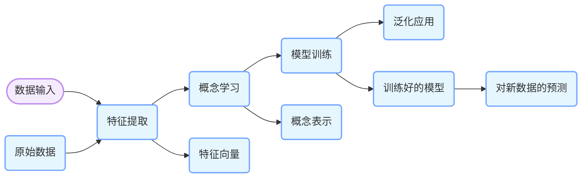

# 构建具有概念学习与泛化能力的AI Agent

> 关键词：AI Agent、概念学习、泛化能力、机器学习、深度学习

> 摘要：本文围绕构建具有概念学习与泛化能力的AI Agent展开深入探讨。首先介绍了相关背景知识，包括目的、预期读者、文档结构和术语表。接着详细阐述了核心概念与联系，通过文本示意图和Mermaid流程图进行清晰展示。对核心算法原理进行了讲解，并给出Python源代码示例。深入分析了数学模型和公式，结合具体例子加深理解。通过项目实战，展示了代码实现过程及详细解读。探讨了实际应用场景，推荐了学习资源、开发工具框架和相关论文著作。最后总结了未来发展趋势与挑战，并提供常见问题解答和扩展阅读参考资料，旨在为开发者和研究者提供全面的技术指导和理论支持。

## 1. 背景介绍 
### 1.1 目的和范围
随着人工智能技术的飞速发展，构建具有强大学习和适应能力的AI Agent成为研究热点。本文章的目的在于深入探讨如何构建具有概念学习与泛化能力的AI Agent。概念学习使AI Agent能够从数据中抽象出一般性的概念，而泛化能力则确保Agent在面对未见过的数据时仍能做出准确的决策。文章将涵盖从核心概念的理解、算法原理的剖析、数学模型的推导，到实际项目的开发与应用等多个方面，为读者提供全面的技术指导。

### 1.2 预期读者
本文预期读者包括人工智能领域的研究者、开发者、学生以及对AI Agent技术感兴趣的爱好者。对于有一定机器学习和编程基础的读者，文章将帮助他们深入理解概念学习与泛化能力的技术细节；对于初学者，文章将提供系统的知识框架和学习路径，引导他们进入这个充满挑战和机遇的领域。

### 1.3 文档结构概述
本文将按照以下结构展开：首先介绍核心概念与联系，通过文本示意图和流程图直观展示相关原理；接着详细讲解核心算法原理，并给出Python代码示例；然后分析数学模型和公式，结合具体例子进行说明；通过项目实战展示代码的实际应用和详细解读；探讨实际应用场景；推荐学习资源、开发工具框架和相关论文著作；最后总结未来发展趋势与挑战，提供常见问题解答和扩展阅读参考资料。

### 1.4 术语表
#### 1.4.1 核心术语定义
- **AI Agent**：人工智能代理，是一种能够感知环境、做出决策并采取行动以实现特定目标的软件或硬件实体。
- **概念学习**：从数据中发现和抽象出一般性概念的过程，这些概念可以用于描述和分类数据。
- **泛化能力**：AI Agent在面对未见过的数据时，能够基于已学习的知识做出准确预测和决策的能力。
- **机器学习**：一门多领域交叉学科，涉及概率论、统计学、逼近论、凸分析、算法复杂度理论等多门学科。它专门研究计算机怎样模拟或实现人类的学习行为，以获取新的知识或技能，重新组织已有的知识结构使之不断改善自身的性能。
- **深度学习**：机器学习的一个分支领域，它是一种基于对数据进行表征学习的方法。深度学习通过构建具有很多层的神经网络模型，自动从数据中学习复杂的模式和特征。

#### 1.4.2 相关概念解释
- **监督学习**：一种机器学习方法，在这种方法中，模型通过学习输入数据和对应的标签之间的映射关系来进行训练。例如，在图像分类任务中，输入是图像，标签是图像所属的类别。
- **无监督学习**：模型在没有标签的情况下对输入数据进行学习，旨在发现数据中的结构和模式。聚类算法就是无监督学习的一个典型例子，它将数据划分为不同的组，使得同一组内的数据具有较高的相似性。
- **强化学习**：智能体通过与环境进行交互，根据环境反馈的奖励信号来学习最优的行为策略。例如，在游戏中，智能体通过不断尝试不同的动作，根据游戏得分来调整自己的策略。

#### 1.4.3 缩略词列表
- **AI**：Artificial Intelligence，人工智能
- **ML**：Machine Learning，机器学习
- **DL**：Deep Learning，深度学习
- **RL**：Reinforcement Learning，强化学习

## 2. 核心概念与联系 

### 核心概念原理
概念学习是AI Agent从具体的数据实例中抽象出一般性概念的过程。例如，在图像识别任务中，AI Agent需要从大量的猫和狗的图像中学习到“猫”和“狗”的概念。这涉及到对数据特征的提取和分析，以及对不同概念之间的区分和分类。

泛化能力则是AI Agent在学习到概念后，能够将这些概念应用到未见过的数据上的能力。一个具有良好泛化能力的AI Agent，即使面对新的猫或狗的图像，也能准确地识别出它们的类别。

为了实现概念学习和泛化能力，通常会使用机器学习和深度学习的方法。机器学习算法可以帮助AI Agent从数据中学习到模式和规律，而深度学习则通过构建多层神经网络，自动提取数据中的复杂特征。

### 文本示意图
```plaintext
数据输入 -> 特征提取 -> 概念学习 -> 模型训练 -> 泛化应用
  |                        |              |
  v                        v              v
原始数据  ->  特征向量  ->  概念表示  ->  训练好的模型  ->  对新数据的预测
```

### Mermaid流程图


## 3. 核心算法原理 & 具体操作步骤 

### 核心算法原理
为了实现具有概念学习与泛化能力的AI Agent，我们可以使用神经网络进行训练。以简单的多层感知机（Multilayer Perceptron，MLP）为例，它是一种前馈人工神经网络模型，由输入层、隐藏层和输出层组成。

MLP的核心思想是通过多个神经元的非线性变换来学习输入数据和输出标签之间的映射关系。每个神经元接收来自上一层神经元的输入，经过加权求和和激活函数处理后，将结果传递给下一层神经元。

### 具体操作步骤
1. **数据准备**：收集和整理训练数据，将其分为输入特征和对应的标签。
2. **模型构建**：构建多层感知机模型，确定输入层、隐藏层和输出层的神经元数量。
3. **模型训练**：使用训练数据对模型进行训练，通过反向传播算法更新模型的参数，使得模型的预测结果与真实标签之间的误差最小化。
4. **模型评估**：使用测试数据对训练好的模型进行评估，计算模型的准确率、召回率等指标。
5. **泛化应用**：将训练好的模型应用到未见过的数据上，进行预测和决策。

### Python源代码示例
```python
import numpy as np
import tensorflow as tf
from tensorflow.keras.models import Sequential
from tensorflow.keras.layers import Dense

# 数据准备
# 生成一些简单的示例数据
x_train = np.random.rand(100, 10)  # 100个样本，每个样本有10个特征
y_train = np.random.randint(0, 2, 100)  # 100个样本的标签，0或1

# 模型构建
model = Sequential([
    Dense(64, activation='relu', input_shape=(10,)),
    Dense(32, activation='relu'),
    Dense(1, activation='sigmoid')
])

# 模型编译
model.compile(optimizer='adam',
              loss='binary_crossentropy',
              metrics=['accuracy'])

# 模型训练
model.fit(x_train, y_train, epochs=10, batch_size=32)

# 模型评估
x_test = np.random.rand(20, 10)  # 20个测试样本
y_test = np.random.randint(0, 2, 20)  # 20个测试样本的标签
test_loss, test_acc = model.evaluate(x_test, y_test)
print(f"Test accuracy: {test_acc}")

# 泛化应用
new_data = np.random.rand(5, 10)  # 5个新的数据样本
predictions = model.predict(new_data)
print(predictions)
```

## 4. 数学模型和公式 & 详细讲解 & 举例说明 

### 数学模型
多层感知机的数学模型可以表示为：

$$
\mathbf{y} = f(\mathbf{W}_L f(\mathbf{W}_{L - 1} \cdots f(\mathbf{W}_1 \mathbf{x} + \mathbf{b}_1) + \mathbf{b}_{L - 1}) + \mathbf{b}_L)
$$

其中，$\mathbf{x}$ 是输入向量，$\mathbf{y}$ 是输出向量，$\mathbf{W}_i$ 是第 $i$ 层的权重矩阵，$\mathbf{b}_i$ 是第 $i$ 层的偏置向量，$f$ 是激活函数。

### 详细讲解
- **权重矩阵 $\mathbf{W}_i$**：权重矩阵决定了神经元之间的连接强度，通过训练不断调整权重矩阵的值，使得模型能够学习到输入数据和输出标签之间的映射关系。
- **偏置向量 $\mathbf{b}_i$**：偏置向量用于调整神经元的激活阈值，增加模型的灵活性。
- **激活函数 $f$**：激活函数引入了非线性因素，使得模型能够学习到复杂的非线性关系。常见的激活函数有Sigmoid函数、ReLU函数等。

### 举例说明
假设我们有一个简单的两层感知机，输入层有2个神经元，隐藏层有3个神经元，输出层有1个神经元。输入向量 $\mathbf{x} = [x_1, x_2]^T$，隐藏层的权重矩阵 $\mathbf{W}_1$ 是一个 $3 \times 2$ 的矩阵，偏置向量 $\mathbf{b}_1$ 是一个 $3$ 维向量，输出层的权重矩阵 $\mathbf{W}_2$ 是一个 $1 \times 3$ 的矩阵，偏置向量 $\mathbf{b}_2$ 是一个标量。

隐藏层的输出 $\mathbf{h}$ 可以表示为：

$$
\mathbf{h} = f(\mathbf{W}_1 \mathbf{x} + \mathbf{b}_1)
$$

其中，$f$ 是激活函数，例如ReLU函数：

$$
f(z) = \max(0, z)
$$

输出层的输出 $y$ 可以表示为：

$$
y = f(\mathbf{W}_2 \mathbf{h} + \mathbf{b}_2)
$$

假设 $\mathbf{W}_1 = \begin{bmatrix} 0.1 & 0.2 \\ 0.3 & 0.4 \\ 0.5 & 0.6 \end{bmatrix}$，$\mathbf{b}_1 = [0.1, 0.2, 0.3]^T$，$\mathbf{W}_2 = [0.7, 0.8, 0.9]$，$\mathbf{b}_2 = 0.1$，$\mathbf{x} = [1, 2]^T$。

首先计算隐藏层的输入：

$$
\mathbf{W}_1 \mathbf{x} + \mathbf{b}_1 = \begin{bmatrix} 0.1 & 0.2 \\ 0.3 & 0.4 \\ 0.5 & 0.6 \end{bmatrix} \begin{bmatrix} 1 \\ 2 \end{bmatrix} + \begin{bmatrix} 0.1 \\ 0.2 \\ 0.3 \end{bmatrix} = \begin{bmatrix} 0.1 \times 1 + 0.2 \times 2 + 0.1 \\ 0.3 \times 1 + 0.4 \times 2 + 0.2 \\ 0.5 \times 1 + 0.6 \times 2 + 0.3 \end{bmatrix} = \begin{bmatrix} 0.6 \\ 1.3 \\ 2.0 \end{bmatrix}
$$

然后应用ReLU激活函数：

$$
\mathbf{h} = f(\mathbf{W}_1 \mathbf{x} + \mathbf{b}_1) = \begin{bmatrix} \max(0, 0.6) \\ \max(0, 1.3) \\ \max(0, 2.0) \end{bmatrix} = \begin{bmatrix} 0.6 \\ 1.3 \\ 2.0 \end{bmatrix}
$$

最后计算输出层的输出：

$$
y = f(\mathbf{W}_2 \mathbf{h} + \mathbf{b}_2) = f([0.7, 0.8, 0.9] \begin{bmatrix} 0.6 \\ 1.3 \\ 2.0 \end{bmatrix} + 0.1) = f(0.7 \times 0.6 + 0.8 \times 1.3 + 0.9 \times 2.0 + 0.1) = f(3.52)
$$

如果使用Sigmoid激活函数：

$$
f(z) = \frac{1}{1 + e^{-z}}
$$

则：

$$
y = \frac{1}{1 + e^{-3.52}} \approx 0.97
$$

## 5. 项目实战：代码实际案例和详细解释说明 

### 5.1  开发环境搭建
为了实现具有概念学习与泛化能力的AI Agent，我们可以使用Python和一些常用的深度学习库，如TensorFlow和Keras。以下是开发环境搭建的步骤：

1. **安装Python**：从Python官方网站（https://www.python.org/downloads/）下载并安装Python 3.x版本。
2. **安装TensorFlow和Keras**：打开命令行工具，运行以下命令安装TensorFlow和Keras：
```sh
pip install tensorflow
```
3. **安装其他必要的库**：根据项目需求，可能还需要安装一些其他的库，如NumPy、Pandas等：
```sh
pip install numpy pandas
```

### 5.2  源代码详细实现和代码解读
以下是一个更完整的项目实战代码示例，使用MNIST手写数字数据集进行训练和测试：

```python
import tensorflow as tf
from tensorflow.keras.datasets import mnist
from tensorflow.keras.models import Sequential
from tensorflow.keras.layers import Dense, Flatten
from tensorflow.keras.utils import to_categorical

# 数据加载和预处理
(x_train, y_train), (x_test, y_test) = mnist.load_data()

# 数据归一化
x_train = x_train / 255.0
x_test = x_test / 255.0

# 标签编码
y_train = to_categorical(y_train)
y_test = to_categorical(y_test)

# 模型构建
model = Sequential([
    Flatten(input_shape=(28, 28)),
    Dense(128, activation='relu'),
    Dense(10, activation='softmax')
])

# 模型编译
model.compile(optimizer='adam',
              loss='categorical_crossentropy',
              metrics=['accuracy'])

# 模型训练
model.fit(x_train, y_train, epochs=5, batch_size=32)

# 模型评估
test_loss, test_acc = model.evaluate(x_test, y_test)
print(f"Test accuracy: {test_acc}")

# 泛化应用
import numpy as np
import matplotlib.pyplot as plt

# 随机选择一个测试样本
random_index = np.random.randint(0, len(x_test))
test_image = x_test[random_index]
test_label = np.argmax(y_test[random_index])

# 预测
prediction = model.predict(np.expand_dims(test_image, axis=0))
predicted_label = np.argmax(prediction)

# 可视化结果
plt.imshow(test_image, cmap='gray')
plt.title(f"True label: {test_label}, Predicted label: {predicted_label}")
plt.show()
```

### 代码解读与分析
1. **数据加载和预处理**：
    - 使用`mnist.load_data()`函数加载MNIST手写数字数据集。
    - 将图像数据归一化到0到1之间，有助于模型的训练。
    - 使用`to_categorical()`函数将标签进行one-hot编码，将整数标签转换为二进制向量。

2. **模型构建**：
    - 使用`Sequential()`函数构建一个顺序模型。
    - `Flatten()`层将28x28的图像数据展平为一维向量。
    - 第一个`Dense()`层有128个神经元，使用ReLU激活函数。
    - 第二个`Dense()`层有10个神经元，使用Softmax激活函数，用于输出每个类别的概率。

3. **模型编译**：
    - 使用`adam`优化器，它是一种自适应学习率的优化算法。
    - 使用`categorical_crossentropy`损失函数，适用于多分类问题。
    - 选择`accuracy`作为评估指标。

4. **模型训练**：
    - 使用`fit()`函数对模型进行训练，指定训练数据、训练轮数和批量大小。

5. **模型评估**：
    - 使用`evaluate()`函数对模型进行评估，计算测试集上的损失和准确率。

6. **泛化应用**：
    - 随机选择一个测试样本，使用`predict()`函数进行预测。
    - 使用`argmax()`函数获取预测结果的类别标签。
    - 使用`matplotlib`库可视化测试图像和预测结果。

## 6. 实际应用场景 
具有概念学习与泛化能力的AI Agent在许多领域都有广泛的应用，以下是一些常见的应用场景：

### 图像识别
在图像识别领域，AI Agent可以学习到不同物体的概念，如猫、狗、汽车等。通过对大量图像数据的学习，AI Agent能够准确地识别出图像中的物体类别，并且在面对新的图像时也能保持较高的准确率。例如，安防监控系统可以使用AI Agent来识别监控画面中的人员和物体，及时发现异常情况。

### 自然语言处理
在自然语言处理领域，AI Agent可以学习到语言的概念和语义。例如，聊天机器人可以通过学习大量的对话数据，理解用户的问题并给出准确的回答。机器翻译系统可以学习到不同语言之间的映射关系，实现高质量的翻译。

### 医疗诊断
在医疗诊断领域，AI Agent可以学习到疾病的概念和特征。通过对大量的医疗影像数据（如X光、CT等）和病历数据的学习，AI Agent能够辅助医生进行疾病的诊断和预测。例如，AI Agent可以帮助医生识别肺部疾病、肿瘤等病变。

### 自动驾驶
在自动驾驶领域，AI Agent需要学习到道路、交通标志、其他车辆和行人等概念。通过对大量的传感器数据（如摄像头、雷达等）的学习，AI Agent能够做出准确的决策，如加速、减速、转弯等，确保自动驾驶车辆的安全行驶。

### 金融风险评估
在金融领域，AI Agent可以学习到金融市场的概念和规律。通过对大量的金融数据（如股票价格、利率等）的学习，AI Agent能够评估金融风险，预测市场趋势，为投资者提供决策支持。

## 7. 工具和资源推荐
### 7.1 学习资源推荐
#### 7.1.1 书籍推荐
- 《深度学习》（Deep Learning）：由Ian Goodfellow、Yoshua Bengio和Aaron Courville撰写，是深度学习领域的经典教材，全面介绍了深度学习的理论和实践。
- 《机器学习》（Machine Learning）：由Tom M. Mitchell撰写，是机器学习领域的经典著作，系统地介绍了机器学习的基本概念、算法和应用。
- 《Python深度学习》（Deep Learning with Python）：由François Chollet撰写，结合Keras框架，详细介绍了如何使用Python进行深度学习开发。

#### 7.1.2 在线课程
- Coursera上的“深度学习专项课程”（Deep Learning Specialization）：由Andrew Ng教授授课，包括五门课程，涵盖了深度学习的各个方面。
- edX上的“人工智能基础”（Introduction to Artificial Intelligence）：由麻省理工学院（MIT）提供，介绍了人工智能的基本概念和方法。
- Udemy上的“Python for Data Science and Machine Learning Bootcamp”：提供了丰富的Python数据科学和机器学习教程，适合初学者。

#### 7.1.3 技术博客和网站
- Medium：有许多人工智能和机器学习领域的优秀博客文章，如Towards Data Science。
- arXiv：一个预印本平台，提供了大量的最新研究论文。
- Kaggle：一个数据科学竞赛平台，有许多开源的代码和数据集，适合学习和实践。

### 7.2 开发工具框架推荐
#### 7.2.1 IDE和编辑器
- PyCharm：一个功能强大的Python集成开发环境，提供了代码编辑、调试、版本控制等功能。
- Jupyter Notebook：一个交互式的笔记本环境，适合进行数据分析和模型开发，支持Python、R等多种编程语言。
- Visual Studio Code：一个轻量级的代码编辑器，支持多种编程语言和插件，具有丰富的扩展功能。

#### 7.2.2 调试和性能分析工具
- TensorBoard：TensorFlow提供的可视化工具，可以帮助用户监控模型的训练过程、可视化模型结构和性能指标。
- PyTorch Profiler：PyTorch提供的性能分析工具，可以帮助用户分析模型的运行时间和内存使用情况。
- cProfile：Python内置的性能分析模块，可以帮助用户分析Python代码的运行时间和函数调用情况。

#### 7.2.3 相关框架和库
- TensorFlow：一个开源的深度学习框架，由Google开发，提供了丰富的工具和接口，支持多种深度学习模型的开发和训练。
- PyTorch：一个开源的深度学习框架，由Facebook开发，具有动态图的特点，适合快速开发和研究。
- Scikit-learn：一个开源的机器学习库，提供了丰富的机器学习算法和工具，适合进行数据预处理、模型选择和评估。

### 7.3 相关论文著作推荐
#### 7.3.1 经典论文
- “Gradient-based learning applied to document recognition”：由Yann LeCun等人撰写，介绍了卷积神经网络（CNN）在手写数字识别中的应用，是深度学习领域的经典论文之一。
- “ImageNet Classification with Deep Convolutional Neural Networks”：由Alex Krizhevsky等人撰写，介绍了AlexNet模型，在2012年的ImageNet图像识别竞赛中取得了巨大成功，推动了深度学习在图像识别领域的发展。
- “Playing Atari with Deep Reinforcement Learning”：由Volodymyr Mnih等人撰写，介绍了深度强化学习在Atari游戏中的应用，开创了深度强化学习的先河。

#### 7.3.2 最新研究成果
- 在arXiv上搜索“concept learning in AI agents”、“generalization ability of AI agents”等关键词，可以找到许多关于概念学习和泛化能力的最新研究论文。
- 关注顶级学术会议，如NeurIPS（神经信息处理系统大会）、ICML（国际机器学习会议）、CVPR（计算机视觉与模式识别会议）等，这些会议上会发表许多最新的研究成果。

#### 7.3.3 应用案例分析
- Kaggle上有许多关于人工智能应用的竞赛和案例分析，如图像识别、自然语言处理、金融预测等。
- 各大科技公司的技术博客，如Google AI Blog、Facebook AI Research等，会分享一些实际应用案例和技术经验。

## 8. 总结：未来发展趋势与挑战
### 未来发展趋势
- **多模态学习**：未来的AI Agent将不仅仅局限于单一模态的数据，如图像、文本或语音，而是能够同时处理多种模态的数据，实现更加全面和深入的概念学习。例如，一个智能助手可以同时理解用户的语音指令、面部表情和手势，提供更加个性化的服务。
- **终身学习**：AI Agent将具备终身学习的能力，能够在不断变化的环境中持续学习新的概念和知识，并且不会忘记之前学习的内容。这将使得AI Agent能够适应各种复杂的任务和场景，不断提升自身的性能。
- **强化学习与概念学习的结合**：强化学习可以帮助AI Agent在动态环境中学习最优的行为策略，而概念学习可以为强化学习提供更加抽象和高级的知识表示。将两者结合起来，可以使AI Agent更加智能和灵活，能够在复杂的环境中做出更加准确的决策。
- **可解释性和透明性**：随着AI Agent在越来越多的关键领域得到应用，其决策过程的可解释性和透明性变得越来越重要。未来的研究将致力于开发更加可解释的AI模型，使得人们能够理解AI Agent的决策依据，增强对AI技术的信任。

### 挑战
- **数据质量和数量**：概念学习和泛化能力需要大量高质量的数据进行训练。然而，在实际应用中，获取足够的数据往往是一个挑战，尤其是对于一些特定领域和场景。此外，数据的质量也会影响模型的性能，如数据中的噪声、偏差等问题需要得到有效的解决。
- **计算资源和效率**：深度学习模型通常需要大量的计算资源进行训练和推理，这对于硬件设备和计算能力提出了很高的要求。如何提高模型的计算效率，降低计算成本，是一个亟待解决的问题。
- **概念表示和语义理解**：如何准确地表示和理解概念是概念学习的核心问题。目前的方法在处理复杂的概念和语义时仍然存在一定的局限性，需要进一步研究和探索更加有效的概念表示方法和语义理解技术。
- **泛化能力的评估和提升**：如何准确地评估AI Agent的泛化能力，以及如何在训练过程中提升泛化能力，是一个具有挑战性的问题。目前的评估指标和方法还不够完善，需要开发更加科学和有效的评估体系。

## 9. 附录：常见问题与解答
### 1. 什么是过拟合，如何避免过拟合？
过拟合是指模型在训练数据上表现良好，但在测试数据上表现不佳的现象。这是因为模型过于复杂，学习到了训练数据中的噪声和细节，而没有学习到数据的本质特征。

避免过拟合的方法有很多，常见的包括：
- **增加训练数据**：提供更多的数据可以帮助模型学习到更广泛的特征，减少对训练数据的依赖。
- **正则化**：在模型的损失函数中添加正则化项，如L1和L2正则化，限制模型的复杂度。
- **早停法**：在训练过程中，当模型在验证集上的性能不再提升时，停止训练，避免模型过度拟合训练数据。
- **Dropout**：在神经网络中随机丢弃一些神经元，减少神经元之间的依赖，增强模型的泛化能力。

### 2. 如何选择合适的激活函数？
选择合适的激活函数需要考虑以下几个因素：
- **问题类型**：不同的问题类型可能适合不同的激活函数。例如，在二分类问题中，Sigmoid函数通常用于输出层，将输出值映射到0到1之间；在多分类问题中，Softmax函数通常用于输出层，将输出值转换为概率分布。
- **模型结构**：不同的模型结构可能需要不同的激活函数。例如，在深度神经网络中，ReLU函数是一种常用的激活函数，因为它可以缓解梯度消失问题，加快模型的训练速度。
- **计算效率**：一些激活函数的计算复杂度较高，会影响模型的训练和推理速度。因此，在选择激活函数时，需要考虑计算效率。

### 3. 如何评估AI Agent的泛化能力？
评估AI Agent的泛化能力可以使用以下方法：
- **交叉验证**：将数据集划分为多个子集，轮流使用不同的子集作为训练集和测试集，计算模型在不同测试集上的性能指标，如准确率、召回率等，取平均值作为模型的泛化能力评估结果。
- **留出法**：将数据集划分为训练集和测试集，使用训练集训练模型，使用测试集评估模型的性能。为了保证评估结果的可靠性，需要多次随机划分数据集，取平均值作为最终结果。
- **迁移学习评估**：将训练好的模型应用到不同的数据集或任务上，评估模型的性能。如果模型在新的数据集或任务上仍然能够取得较好的性能，说明模型具有较好的泛化能力。

## 10. 扩展阅读 & 参考资料
### 扩展阅读
- 《人工智能：一种现代的方法》（Artificial Intelligence: A Modern Approach）：全面介绍了人工智能的各个方面，包括搜索算法、知识表示、机器学习、自然语言处理等。
- 《动手学深度学习》（Dive into Deep Learning）：提供了丰富的深度学习代码示例和实践项目，适合初学者快速上手。
- 《强化学习：原理与Python实现》（Reinforcement Learning: An Introduction）：系统地介绍了强化学习的基本概念、算法和应用，是强化学习领域的经典著作。

### 参考资料
- TensorFlow官方文档：https://www.tensorflow.org/api_docs
- PyTorch官方文档：https://pytorch.org/docs/stable/index.html
- Scikit-learn官方文档：https://scikit-learn.org/stable/documentation.html

作者：AI天才研究院/AI Genius Institute & 禅与计算机程序设计艺术 /Zen And The Art of Computer Programming