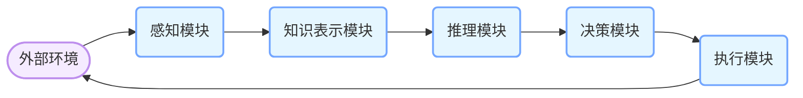

# 构建具有知识推理能力的AI Agent

> 关键词：AI Agent、知识推理、知识表示、推理算法、项目实战

> 摘要：本文旨在深入探讨如何构建具有知识推理能力的AI Agent。首先介绍了相关背景知识，包括目的、预期读者等内容。接着阐述了核心概念与联系，展示了其原理和架构。详细讲解了核心算法原理及具体操作步骤，并给出了Python源代码示例。还介绍了数学模型和公式，通过举例进行说明。在项目实战部分，提供了开发环境搭建、源代码实现及解读。分析了实际应用场景，推荐了学习、开发相关的工具和资源，包括书籍、在线课程等。最后总结了未来发展趋势与挑战，提供常见问题解答和扩展阅读参考资料，为构建具有知识推理能力的AI Agent提供全面且深入的技术指导。

## 1. 背景介绍 
### 1.1 目的和范围
在当今人工智能迅速发展的时代，AI Agent的应用越来越广泛。具有知识推理能力的AI Agent能够在复杂的环境中，根据已有的知识进行推理和决策，从而更好地完成各种任务。本文章的目的在于详细阐述构建具有知识推理能力的AI Agent的相关技术和方法，范围涵盖从基本概念的介绍到具体项目实战，以及未来发展趋势的探讨，旨在为研究人员、开发者提供全面的技术指导。

### 1.2 预期读者
本文预期读者包括对人工智能、知识推理领域感兴趣的研究人员、计算机科学相关专业的学生、AI Agent开发人员以及想要深入了解具有知识推理能力的AI Agent技术的技术爱好者。

### 1.3 文档结构概述
本文首先介绍背景知识，包括目的、读者和文档结构等内容。接着阐述核心概念与联系，展示AI Agent知识推理的原理和架构。然后详细讲解核心算法原理和具体操作步骤，并给出Python代码示例。之后介绍数学模型和公式，通过举例说明其应用。在项目实战部分，从开发环境搭建到源代码实现和解读进行详细说明。分析实际应用场景，推荐相关的学习和开发工具资源。最后总结未来发展趋势与挑战，提供常见问题解答和扩展阅读参考资料。

### 1.4 术语表
#### 1.4.1 核心术语定义
- **AI Agent**：人工智能代理，是一个能够感知环境、进行决策并采取行动的实体。
- **知识推理**：根据已有的知识和规则，推导出新的知识或结论的过程。
- **知识表示**：将知识以计算机能够理解和处理的方式进行表示的方法。

#### 1.4.2 相关概念解释
- **本体**：一种对概念及其之间关系的明确规范，用于表示领域知识。
- **规则引擎**：一种基于规则进行推理的软件系统，能够根据规则对事实进行匹配和推理。

#### 1.4.3 缩略词列表
- **RDF**：Resource Description Framework，资源描述框架。
- **OWL**：Web Ontology Language，网络本体语言。

## 2. 核心概念与联系 

### 核心概念原理
具有知识推理能力的AI Agent主要由知识表示、知识推理和行动决策三个部分组成。知识表示是将领域知识以合适的方式存储在AI Agent中，常见的知识表示方法有逻辑表示法、语义网络、框架表示法等。知识推理则是基于已有的知识和规则，推导出新的知识或结论。行动决策是根据推理结果，AI Agent决定采取何种行动。

### 架构的文本示意图
AI Agent的架构可以描述为：外部环境通过感知模块将信息传递给知识表示模块，知识表示模块将信息转换为计算机可处理的知识形式存储起来。推理模块根据这些知识和预设的规则进行推理，得到推理结果。决策模块根据推理结果制定行动策略，通过执行模块将行动反馈到外部环境中。

### Mermaid流程图


## 3. 核心算法原理 & 具体操作步骤 

### 核心算法原理
在具有知识推理能力的AI Agent中，常见的推理算法有基于规则的推理算法和基于本体的推理算法。基于规则的推理算法是根据预先定义的规则对事实进行匹配和推理。基于本体的推理算法则是利用本体中概念和关系的语义信息进行推理。

### 具体操作步骤
1. **知识获取**：从各种数据源中获取领域知识，如数据库、文本文件等。
2. **知识表示**：选择合适的知识表示方法，将获取的知识转换为计算机可处理的形式。
3. **规则定义**：根据领域知识和业务需求，定义推理规则。
4. **推理引擎选择**：选择合适的推理引擎，如Drools（基于规则）、Pellet（基于本体）等。
5. **推理过程**：将知识和规则输入到推理引擎中，进行推理得到结果。

### Python源代码示例
以下是一个简单的基于规则的推理示例，使用Python实现：

```python
# 定义事实
facts = ["A", "B"]

# 定义规则
rules = [
    {"if": ["A", "B"], "then": "C"},
    {"if": ["C"], "then": "D"}
]

# 推理函数
def inference(facts, rules):
    new_facts = set(facts)
    while True:
        added = False
        for rule in rules:
            conditions = rule["if"]
            conclusion = rule["then"]
            if all(condition in new_facts for condition in conditions) and conclusion not in new_facts:
                new_facts.add(conclusion)
                added = True
        if not added:
            break
    return list(new_facts)

# 进行推理
result = inference(facts, rules)
print("推理结果:", result)
```

在这个示例中，我们首先定义了一些事实和规则。然后通过推理函数，不断检查规则的条件是否满足，如果满足则添加新的结论到事实集合中，直到没有新的结论可以添加为止。

## 4. 数学模型和公式 & 详细讲解 & 举例说明 

### 数学模型和公式
在知识推理中，逻辑推理可以用一阶逻辑来表示。一阶逻辑包括常量、变量、谓词和量词等基本元素。例如，对于一个简单的规则“如果x是苹果，那么x是水果”，可以用一阶逻辑表示为：$\forall x (Apple(x) \rightarrow Fruit(x))$。

### 详细讲解
- **常量**：表示具体的个体，如“苹果”“香蕉”等。
- **变量**：表示不确定的个体，如$x$、$y$等。
- **谓词**：表示个体的属性或个体之间的关系，如$Apple(x)$表示$x$是苹果，$IsFruit(x, y)$表示$x$是$y$类型的水果。
- **量词**：包括全称量词$\forall$（表示“对于所有”）和存在量词$\exists$（表示“存在”）。

### 举例说明
假设有以下事实和规则：
- 事实：$Apple(apple1)$，$Banana(banana1)$
- 规则：$\forall x (Apple(x) \rightarrow Fruit(x))$，$\forall x (Banana(x) \rightarrow Fruit(x))$

通过推理可以得到新的结论：$Fruit(apple1)$，$Fruit(banana1)$。

具体推理过程如下：
对于规则$\forall x (Apple(x) \rightarrow Fruit(x))$，当$x = apple1$时，因为$Apple(apple1)$为真，根据蕴含关系，所以$Fruit(apple1)$为真。同理，对于规则$\forall x (Banana(x) \rightarrow Fruit(x))$，当$x = banana1$时，可得$Fruit(banana1)$为真。

## 5. 项目实战：代码实际案例和详细解释说明 

### 5.1  开发环境搭建
1. **Python环境**：安装Python 3.x版本，可以从Python官方网站下载安装包进行安装。
2. **相关库安装**：如果使用基于规则的推理，可以安装`pyswip`库（用于与Prolog引擎交互）；如果使用基于本体的推理，可以安装`owlready2`库。
    - 安装`pyswip`：`pip install pyswip`
    - 安装`owlready2`：`pip install owlready2`

### 5.2  源代码详细实现和代码解读
#### 基于规则的推理示例（使用`pyswip`）
```python
from pyswip import Prolog

# 创建Prolog对象
prolog = Prolog()

# 添加事实和规则
prolog.assertz("apple(apple1)")
prolog.assertz("banana(banana1)")
prolog.assertz("fruit(X) :- apple(X)")
prolog.assertz("fruit(X) :- banana(X)")

# 进行查询
for soln in prolog.query("fruit(X)"):
    print(soln["X"])
```
**代码解读**：
- `from pyswip import Prolog`：导入`pyswip`库中的`Prolog`类。
- `prolog = Prolog()`：创建一个Prolog对象。
- `prolog.assertz("apple(apple1)")`：向Prolog知识库中添加事实`apple(apple1)`。
- `prolog.assertz("fruit(X) :- apple(X)")`：向Prolog知识库中添加规则，表示如果$X$是苹果，那么$X$是水果。
- `for soln in prolog.query("fruit(X)"):`：进行查询，找出所有是水果的个体。

#### 基于本体的推理示例（使用`owlready2`）
```python
from owlready2 import *

# 加载本体文件
onto = get_ontology("file://example.owl").load()

# 定义推理机
with onto:
    sync_reasoner()

# 查询本体中的信息
for cls in onto.classes():
    print(cls.name)
```
**代码解读**：
- `from owlready2 import *`：导入`owlready2`库的所有模块。
- `onto = get_ontology("file://example.owl").load()`：加载本体文件`example.owl`。
- `with onto: sync_reasoner()`：使用推理机对本体进行推理。
- `for cls in onto.classes(): print(cls.name)`：查询本体中的所有类并打印其名称。

### 5.3  代码解读与分析
#### 基于规则的推理分析
基于规则的推理通过将事实和规则添加到Prolog知识库中，利用Prolog的推理机制进行查询。这种方法适用于规则明确、逻辑简单的场景。优点是推理速度快，易于理解和实现；缺点是对于复杂的知识表示和推理能力有限。

#### 基于本体的推理分析
基于本体的推理利用本体的语义信息进行推理，能够处理更复杂的知识结构和关系。优点是具有较强的知识表示和推理能力，能够支持语义查询；缺点是本体的构建和维护成本较高，推理效率相对较低。

## 6. 实际应用场景 
### 智能客服
具有知识推理能力的AI Agent可以应用于智能客服系统中。通过对用户问题的分析和知识推理，能够快速准确地给出答案。例如，当用户询问某产品的使用方法时，AI Agent可以根据产品的知识库和推理规则，推导出具体的使用步骤并反馈给用户。

### 医疗诊断
在医疗领域，AI Agent可以根据患者的症状、病史等信息，结合医学知识和推理规则，进行疾病的初步诊断和治疗建议。例如，根据患者的发热、咳嗽等症状，结合医学知识推理出可能的疾病，如感冒、肺炎等，并给出相应的检查和治疗建议。

### 金融风险评估
在金融领域，AI Agent可以根据客户的信用记录、财务状况等信息，结合金融风险评估模型和推理规则，对客户的信用风险进行评估。例如，根据客户的收入、负债情况等信息，推理出客户的信用等级，为金融机构的贷款决策提供参考。

## 7. 工具和资源推荐
### 7.1 学习资源推荐
#### 7.1.1 书籍推荐
- 《人工智能：一种现代的方法》：全面介绍了人工智能的基本概念、算法和应用，是人工智能领域的经典教材。
- 《知识图谱：方法、实践与应用》：详细介绍了知识图谱的构建、推理和应用，对于理解知识推理有很大帮助。

#### 7.1.2 在线课程
- Coursera上的“Artificial Intelligence”课程：由斯坦福大学教授授课，系统介绍了人工智能的基本理论和算法。
- edX上的“Knowledge Representation and Reasoning”课程：专门讲解知识表示和推理的相关知识。

#### 7.1.3 技术博客和网站
- AI Stack Exchange：一个人工智能领域的问答社区，提供了大量关于AI Agent和知识推理的问题和解答。
- Towards Data Science：一个数据科学和人工智能领域的博客平台，有很多关于知识推理的技术文章。

### 7.2 开发工具框架推荐
#### 7.2.1 IDE和编辑器
- PyCharm：一款功能强大的Python集成开发环境，提供了代码编辑、调试、版本控制等功能。
- Visual Studio Code：一款轻量级的代码编辑器，支持多种编程语言和插件扩展，适合快速开发和调试。

#### 7.2.2 调试和性能分析工具
- Py-Spy：一个Python性能分析工具，能够帮助开发者找出代码中的性能瓶颈。
- PDB：Python自带的调试工具，能够帮助开发者进行代码调试和问题排查。

#### 7.2.3 相关框架和库
- Drools：一个基于规则的开源业务规则管理系统，提供了强大的规则引擎和开发工具。
- Pellet：一个基于本体的开源推理引擎，支持OWL本体的推理和查询。

### 7.3 相关论文著作推荐
#### 7.3.1 经典论文
- “A Logical Framework for Default Reasoning”：介绍了默认推理的逻辑框架，是知识推理领域的经典论文。
- “OWL Web Ontology Language Reference”：详细介绍了OWL本体语言的语法和语义，是本体推理的重要参考。

#### 7.3.2 最新研究成果
- 可以关注顶级人工智能会议（如AAAI、IJCAI）和期刊（如Artificial Intelligence）上的最新研究成果，了解知识推理领域的最新进展。

#### 7.3.3 应用案例分析
- 一些企业和研究机构会发布关于AI Agent和知识推理的应用案例分析，可以通过他们的官方网站或技术博客进行查找。

## 8. 总结：未来发展趋势与挑战
### 未来发展趋势
- **与深度学习的融合**：将知识推理与深度学习相结合，能够充分发挥两者的优势，提高AI Agent的智能水平。例如，利用深度学习进行知识表示和特征提取，利用知识推理进行逻辑推理和决策。
- **多模态知识推理**：除了文本知识，还将考虑图像、语音等多模态信息的推理，使AI Agent能够处理更复杂的场景。
- **自主学习和进化**：AI Agent将具备自主学习和进化的能力，能够不断更新和完善自己的知识和推理规则。

### 挑战
- **知识获取和表示的难题**：如何从海量的数据中获取准确、有用的知识，并以合适的方式进行表示，是一个挑战。
- **推理效率和可扩展性**：随着知识量的增加，推理效率和可扩展性成为了关键问题，需要研究更高效的推理算法和架构。
- **语义理解和常识推理**：实现对自然语言的语义理解和常识推理仍然是一个难题，需要进一步的研究和探索。

## 9. 附录：常见问题与解答
### 问题1：如何选择合适的知识表示方法？
解答：选择合适的知识表示方法需要考虑知识的特点、应用场景和推理需求等因素。如果知识结构简单、规则明确，可以选择基于规则的知识表示方法；如果知识结构复杂、需要处理语义信息，可以选择基于本体的知识表示方法。

### 问题2：推理引擎的性能如何评估？
解答：推理引擎的性能可以从推理速度、推理准确性、内存占用等方面进行评估。可以通过对基准数据集的测试和实际应用场景的验证来评估推理引擎的性能。

### 问题3：如何处理知识的不确定性？
解答：可以使用概率推理、模糊推理等方法来处理知识的不确定性。例如，在贝叶斯网络中，可以通过概率分布来表示知识的不确定性，并进行推理。

## 10. 扩展阅读 & 参考资料
- 《人工智能及其应用》
- 《语义网基础教程》
- 相关的学术论文和技术报告
- 各大开源社区的相关项目文档

作者：AI天才研究院/AI Genius Institute & 禅与计算机程序设计艺术 /Zen And The Art of Computer Programming