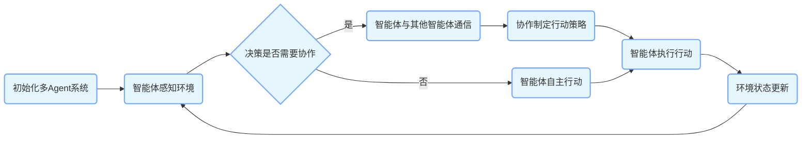

# 构建具有群体智能的多Agent协作系统

> 关键词：多Agent系统、群体智能、协作系统、智能算法、分布式计算

> 摘要：本文聚焦于构建具有群体智能的多Agent协作系统。首先介绍了相关背景知识，包括目的范围、预期读者等。接着详细阐述了核心概念与联系，给出了原理和架构的示意图与流程图。通过Python代码深入讲解核心算法原理和具体操作步骤，同时辅以数学模型和公式进行说明。在项目实战部分，提供了开发环境搭建、源代码实现及解读。探讨了该系统的实际应用场景，推荐了学习资源、开发工具框架以及相关论文著作。最后总结了未来发展趋势与挑战，并提供了常见问题解答和扩展阅读参考资料，旨在为相关领域的研究者和开发者提供全面而深入的技术指导。

## 1. 背景介绍 
### 1.1 目的和范围
在当今复杂多变的环境中，许多任务需要多个智能体协同工作来完成，例如智能交通系统中的车辆调度、分布式传感器网络的数据采集与处理等。构建具有群体智能的多Agent协作系统的目的在于让多个智能体通过协作，展现出超越个体能力的整体智能，以更高效、灵活地完成复杂任务。本文章的范围涵盖了多Agent协作系统的基本概念、核心算法、数学模型、项目实战、应用场景等多个方面，旨在为读者提供一个全面深入的技术指南。

### 1.2 预期读者
本文预期读者包括计算机科学、人工智能、自动化等相关专业的学生、研究人员，以及从事智能系统开发的工程师。对于希望了解多Agent系统和群体智能技术的初学者，本文将提供基础的概念和原理讲解；对于有一定经验的开发者，本文将深入探讨核心算法和项目实践，为其在实际项目中应用提供参考。

### 1.3 文档结构概述
本文首先介绍构建具有群体智能的多Agent协作系统的背景知识，包括目的、预期读者和文档结构。接着详细阐述核心概念与联系，通过示意图和流程图展示系统原理和架构。然后讲解核心算法原理和具体操作步骤，结合Python代码进行说明。之后介绍数学模型和公式，并举例说明。在项目实战部分，给出开发环境搭建步骤、源代码实现和代码解读。探讨实际应用场景，推荐相关学习资源、开发工具框架和论文著作。最后总结未来发展趋势与挑战，提供常见问题解答和扩展阅读参考资料。

### 1.4 术语表
#### 1.4.1 核心术语定义
- **多Agent系统（Multi-Agent System，MAS）**：由多个智能体组成的系统，每个智能体具有一定的自主性和智能，能够在一定环境中感知、决策和行动，并与其他智能体进行交互。
- **群体智能（Swarm Intelligence）**：由大量简单个体通过相互协作和交互而涌现出的智能行为，例如蚁群算法、粒子群算法等。
- **智能体（Agent）**：具有感知、决策和行动能力的实体，能够根据环境信息自主地做出决策并执行相应的动作。
- **协作（Collaboration）**：多个智能体为了实现共同的目标，通过信息共享、协调行动等方式相互配合的过程。

#### 1.4.2 相关概念解释
- **分布式计算**：将一个大型任务分解为多个子任务，分配给多个计算节点并行处理，以提高计算效率。多Agent系统通常采用分布式计算的方式，每个智能体可以看作一个独立的计算节点。
- **涌现行为（Emergent Behavior）**：在多Agent系统中，当多个智能体相互作用时，会产生一些无法从单个智能体行为预测的整体行为，这种行为称为涌现行为。群体智能就是一种典型的涌现行为。

#### 1.4.3 缩略词列表
- **MAS**：Multi-Agent System，多Agent系统
- **AI**：Artificial Intelligence，人工智能

## 2. 核心概念与联系 

### 核心概念原理
多Agent协作系统的核心在于多个智能体之间的协作和交互。每个智能体具有自己的目标、知识和能力，通过与其他智能体进行信息交换和协调，共同完成一个或多个复杂任务。群体智能则是多Agent协作系统中一种重要的机制，它通过模拟自然界中群体生物的行为，让多个智能体在局部交互的基础上涌现出全局的智能行为。

例如，蚁群算法模拟了蚂蚁在寻找食物过程中的行为。蚂蚁在运动过程中会释放信息素，其他蚂蚁可以感知到信息素的浓度，并根据信息素的浓度来选择前进的方向。随着时间的推移，蚂蚁会逐渐形成一条从蚁巢到食物源的最优路径。在多Agent协作系统中，可以借鉴蚁群算法的思想，让智能体通过相互传递信息（类似于信息素）来协调行动，从而找到最优的解决方案。

### 架构的文本示意图
```plaintext
多Agent协作系统
├── 智能体集合
│   ├── 智能体1
│   │   ├── 感知模块
│   │   ├── 决策模块
│   │   ├── 行动模块
│   ├── 智能体2
│   │   ├── 感知模块
│   │   ├── 决策模块
│   │   ├── 行动模块
│   └──...
├── 通信网络
│   ├── 信息传递通道
├── 环境
│   ├── 任务空间
│   ├── 资源分布
```

### Mermaid流程图


## 3. 核心算法原理 & 具体操作步骤 

### 核心算法原理：粒子群算法
粒子群算法（Particle Swarm Optimization，PSO）是一种基于群体智能的优化算法，它模拟了鸟群或鱼群的觅食行为。在粒子群算法中，每个粒子代表一个潜在的解决方案，粒子在搜索空间中飞行，通过不断更新自己的位置来寻找最优解。

每个粒子有两个重要的属性：位置和速度。粒子的位置表示一个可能的解，速度表示粒子在搜索空间中的移动方向和速度。粒子根据自己的历史最优位置和群体的历史最优位置来更新自己的速度和位置。

### Python源代码详细阐述
```python
import random

# 定义粒子类
class Particle:
    def __init__(self, dim, minx, maxx):
        self.position = [random.uniform(minx, maxx) for _ in range(dim)]
        self.velocity = [random.uniform(-1, 1) for _ in range(dim)]
        self.best_position = self.position.copy()
        self.best_fitness = float('inf')

    def update_velocity(self, global_best_position, w=0.7, c1=1.4, c2=1.4):
        for i in range(len(self.velocity)):
            r1 = random.random()
            r2 = random.random()
            cognitive_component = c1 * r1 * (self.best_position[i] - self.position[i])
            social_component = c2 * r2 * (global_best_position[i] - self.position[i])
            self.velocity[i] = w * self.velocity[i] + cognitive_component + social_component

    def update_position(self, minx, maxx):
        for i in range(len(self.position)):
            self.position[i] += self.velocity[i]
            if self.position[i] < minx:
                self.position[i] = minx
            if self.position[i] > maxx:
                self.position[i] = maxx

# 定义目标函数
def objective_function(x):
    return sum([i**2 for i in x])

# 粒子群算法主函数
def pso(num_particles, dim, minx, maxx, max_iter):
    particles = [Particle(dim, minx, maxx) for _ in range(num_particles)]
    global_best_position = None
    global_best_fitness = float('inf')

    for _ in range(max_iter):
        for particle in particles:
            fitness = objective_function(particle.position)
            if fitness < particle.best_fitness:
                particle.best_fitness = fitness
                particle.best_position = particle.position.copy()
            if fitness < global_best_fitness:
                global_best_fitness = fitness
                global_best_position = particle.position.copy()

        for particle in particles:
            particle.update_velocity(global_best_position)
            particle.update_position(minx, maxx)

    return global_best_position, global_best_fitness

# 示例调用
num_particles = 30
dim = 2
minx = -10
maxx = 10
max_iter = 100

best_position, best_fitness = pso(num_particles, dim, minx, maxx, max_iter)
print(f"最优位置: {best_position}")
print(f"最优适应度: {best_fitness}")
```

### 具体操作步骤
1. **初始化粒子群**：随机初始化每个粒子的位置和速度，并将每个粒子的历史最优位置初始化为当前位置，将全局最优位置初始化为一个较大的值。
2. **计算适应度值**：对于每个粒子，计算其当前位置的适应度值。
3. **更新个体最优位置和全局最优位置**：如果某个粒子的当前适应度值优于其历史最优适应度值，则更新其历史最优位置和适应度值。如果某个粒子的当前适应度值优于全局最优适应度值，则更新全局最优位置和适应度值。
4. **更新粒子速度和位置**：根据当前粒子的速度、个体最优位置和全局最优位置，更新粒子的速度和位置。
5. **重复步骤2 - 4**：直到达到最大迭代次数。

## 4. 数学模型和公式 & 详细讲解 & 举例说明 

### 粒子群算法的数学模型和公式
粒子群算法的核心公式主要包括速度更新公式和位置更新公式。

#### 速度更新公式
$$
v_{i}(t+1) = w \cdot v_{i}(t) + c_{1} \cdot r_{1} \cdot (p_{best,i}(t) - x_{i}(t)) + c_{2} \cdot r_{2} \cdot (g_{best}(t) - x_{i}(t))
$$
其中：
- $v_{i}(t)$ 表示粒子 $i$ 在第 $t$ 次迭代时的速度。
- $w$ 是惯性权重，用于控制粒子先前速度对当前速度的影响程度。
- $c_{1}$ 和 $c_{2}$ 是加速常数，分别表示个体认知和社会认知的权重。
- $r_{1}$ 和 $r_{2}$ 是在 $[0, 1]$ 范围内的随机数。
- $p_{best,i}(t)$ 是粒子 $i$ 在第 $t$ 次迭代时的历史最优位置。
- $g_{best}(t)$ 是整个粒子群在第 $t$ 次迭代时的全局最优位置。
- $x_{i}(t)$ 是粒子 $i$ 在第 $t$ 次迭代时的位置。

#### 位置更新公式
$$
x_{i}(t+1) = x_{i}(t) + v_{i}(t+1)
$$
其中 $x_{i}(t+1)$ 是粒子 $i$ 在第 $t + 1$ 次迭代时的位置。

### 详细讲解
- **惯性权重 $w$**：惯性权重 $w$ 控制了粒子先前速度对当前速度的影响。较大的 $w$ 值有利于全局搜索，因为粒子可以在搜索空间中快速移动；较小的 $w$ 值有利于局部搜索，因为粒子可以更精细地探索当前区域。通常，$w$ 的取值范围在 $[0.4, 0.9]$ 之间。
- **加速常数 $c_{1}$ 和 $c_{2}$**：加速常数 $c_{1}$ 和 $c_{2}$ 分别表示个体认知和社会认知的权重。$c_{1}$ 越大，粒子越倾向于向自己的历史最优位置移动；$c_{2}$ 越大，粒子越倾向于向全局最优位置移动。通常，$c_{1}$ 和 $c_{2}$ 的取值都在 $[1.4, 2.0]$ 之间。
- **随机数 $r_{1}$ 和 $r_{2}$**：随机数 $r_{1}$ 和 $r_{2}$ 增加了算法的随机性，避免粒子陷入局部最优解。

### 举例说明
假设我们要使用粒子群算法求解函数 $f(x) = x_{1}^{2} + x_{2}^{2}$ 的最小值，其中 $x = [x_{1}, x_{2}]$，搜索空间为 $[-10, 10] \times [-10, 10]$。

初始时，我们随机初始化 30 个粒子的位置和速度。在每次迭代中，我们计算每个粒子的适应度值（即函数值），并更新个体最优位置和全局最优位置。然后，根据速度更新公式和位置更新公式更新每个粒子的速度和位置。经过多次迭代后，粒子群会逐渐收敛到函数的最小值点 $(0, 0)$。

## 5. 项目实战：代码实际案例和详细解释说明 

### 5.1  开发环境搭建
#### 安装Python
首先，确保你已经安装了Python。可以从Python官方网站（https://www.python.org/downloads/）下载适合你操作系统的Python版本，并按照安装向导进行安装。

#### 安装必要的库
在本项目中，我们只使用了Python的内置库，因此不需要额外安装其他库。如果需要进行可视化等操作，可以安装 `matplotlib` 库，使用以下命令进行安装：
```sh
pip install matplotlib
```

### 5.2  源代码详细实现和代码解读
```python
import random
import matplotlib.pyplot as plt

# 定义粒子类
class Particle:
    def __init__(self, dim, minx, maxx):
        # 随机初始化粒子的位置
        self.position = [random.uniform(minx, maxx) for _ in range(dim)]
        # 随机初始化粒子的速度
        self.velocity = [random.uniform(-1, 1) for _ in range(dim)]
        # 初始化粒子的历史最优位置为当前位置
        self.best_position = self.position.copy()
        # 初始化粒子的历史最优适应度为无穷大
        self.best_fitness = float('inf')

    def update_velocity(self, global_best_position, w=0.7, c1=1.4, c2=1.4):
        for i in range(len(self.velocity)):
            r1 = random.random()
            r2 = random.random()
            # 计算个体认知部分
            cognitive_component = c1 * r1 * (self.best_position[i] - self.position[i])
            # 计算社会认知部分
            social_component = c2 * r2 * (global_best_position[i] - self.position[i])
            # 更新粒子的速度
            self.velocity[i] = w * self.velocity[i] + cognitive_component + social_component

    def update_position(self, minx, maxx):
        for i in range(len(self.position)):
            # 更新粒子的位置
            self.position[i] += self.velocity[i]
            # 确保粒子的位置在搜索空间内
            if self.position[i] < minx:
                self.position[i] = minx
            if self.position[i] > maxx:
                self.position[i] = maxx

# 定义目标函数
def objective_function(x):
    return sum([i**2 for i in x])

# 粒子群算法主函数
def pso(num_particles, dim, minx, maxx, max_iter):
    particles = [Particle(dim, minx, maxx) for _ in range(num_particles)]
    global_best_position = None
    global_best_fitness = float('inf')
    best_fitness_history = []

    for iter in range(max_iter):
        for particle in particles:
            fitness = objective_function(particle.position)
            if fitness < particle.best_fitness:
                particle.best_fitness = fitness
                particle.best_position = particle.position.copy()
            if fitness < global_best_fitness:
                global_best_fitness = fitness
                global_best_position = particle.position.copy()

        best_fitness_history.append(global_best_fitness)

        for particle in particles:
            particle.update_velocity(global_best_position)
            particle.update_position(minx, maxx)

    # 绘制适应度值随迭代次数的变化曲线
    plt.plot(range(max_iter), best_fitness_history)
    plt.xlabel('Iteration')
    plt.ylabel('Best Fitness')
    plt.title('PSO Convergence Curve')
    plt.show()

    return global_best_position, global_best_fitness

# 示例调用
num_particles = 30
dim = 2
minx = -10
maxx = 10
max_iter = 100

best_position, best_fitness = pso(num_particles, dim, minx, maxx, max_iter)
print(f"最优位置: {best_position}")
print(f"最优适应度: {best_fitness}")
```

### 5.3  代码解读与分析
#### 粒子类 `Particle`
- `__init__` 方法：初始化粒子的位置、速度、历史最优位置和历史最优适应度。
- `update_velocity` 方法：根据速度更新公式更新粒子的速度。
- `update_position` 方法：根据位置更新公式更新粒子的位置，并确保粒子的位置在搜索空间内。

#### 目标函数 `objective_function`
该函数用于计算粒子的适应度值，这里使用的是 $f(x) = x_{1}^{2} + x_{2}^{2}$。

#### 粒子群算法主函数 `pso`
- 初始化粒子群和全局最优位置、适应度。
- 在每次迭代中，计算每个粒子的适应度值，更新个体最优位置和全局最优位置。
- 记录每次迭代的全局最优适应度值。
- 更新每个粒子的速度和位置。
- 绘制适应度值随迭代次数的变化曲线，直观展示算法的收敛过程。

## 6. 实际应用场景 
### 智能交通系统
在智能交通系统中，多个车辆可以看作是多个智能体。通过构建具有群体智能的多Agent协作系统，车辆之间可以进行信息共享和协作，实现交通流量的优化控制。例如，车辆可以根据实时交通信息调整自己的行驶路线，避免拥堵路段；同时，车辆之间可以进行协同驾驶，提高道路的通行效率。

### 分布式传感器网络
分布式传感器网络由大量分布在不同位置的传感器节点组成，每个传感器节点可以看作一个智能体。通过多Agent协作系统，传感器节点可以协同工作，完成数据采集、处理和传输等任务。例如，在环境监测中，传感器节点可以根据其他节点的信息，调整自己的采样频率和传输策略，以提高监测的准确性和效率。

### 机器人协作
在机器人协作场景中，多个机器人可以通过协作完成复杂的任务，如搬运大型物体、搜索救援等。每个机器人具有自己的感知、决策和行动能力，通过多Agent协作系统，机器人之间可以进行信息交流和任务分配，实现高效的协作。例如，在搬运任务中，机器人可以根据物体的重量和形状，合理分配任务，共同完成搬运工作。

### 云计算资源调度
在云计算环境中，多个虚拟机和服务器可以看作是多个智能体。通过构建具有群体智能的多Agent协作系统，可以实现云计算资源的动态调度和优化分配。例如，智能体可以根据用户的需求和服务器的负载情况，自动调整虚拟机的部署和迁移，提高云计算资源的利用率和性能。

## 7. 工具和资源推荐
### 7.1 学习资源推荐
#### 7.1.1 书籍推荐
- 《多Agent系统导论》：本书全面介绍了多Agent系统的基本概念、理论和方法，包括智能体的建模、通信、协作等方面的内容，是学习多Agent系统的经典教材。
- 《群体智能：从自然到人工系统》：详细阐述了群体智能的基本原理和算法，如蚁群算法、粒子群算法等，并介绍了群体智能在各个领域的应用。
- 《人工智能：一种现代的方法》：这是一本全面介绍人工智能的经典著作，其中包含了多Agent系统和群体智能的相关内容，对理解人工智能的整体框架和技术有很大帮助。

#### 7.1.2 在线课程
- Coursera上的“Artificial Intelligence”课程：由斯坦福大学教授授课，涵盖了人工智能的各个方面，包括多Agent系统和群体智能。
- edX上的“Multi-Agent Systems”课程：专门介绍多Agent系统的理论和实践，提供了丰富的案例和实验。

#### 7.1.3 技术博客和网站
- AI Time：提供了人工智能领域的最新研究成果和技术动态，包括多Agent系统和群体智能的相关文章。
- Towards Data Science：是一个专注于数据科学和人工智能的技术博客平台，有很多关于多Agent系统和群体智能的实践经验分享。

### 7.2 开发工具框架推荐
#### 7.2.1 IDE和编辑器
- PyCharm：是一款专门为Python开发设计的集成开发环境，具有强大的代码编辑、调试和项目管理功能，适合开发多Agent系统和群体智能相关的Python代码。
- Visual Studio Code：是一款轻量级的代码编辑器，支持多种编程语言，通过安装相关插件可以实现Python代码的高效开发。

#### 7.2.2 调试和性能分析工具
- pdb：是Python的内置调试器，可以帮助开发者定位代码中的错误和问题。
- cProfile：是Python的性能分析工具，可以分析代码的运行时间和函数调用情况，帮助开发者优化代码性能。

#### 7.2.3 相关框架和库
- Mesa：是一个用于构建基于Agent的模型的Python框架，提供了丰富的工具和接口，方便开发者快速搭建多Agent系统。
- PySwarm：是一个用于实现群体智能算法的Python库，包含了粒子群算法、蚁群算法等多种算法的实现。

### 7.3 相关论文著作推荐
#### 7.3.1 经典论文
- “Particle Swarm Optimization”：由Kennedy和Eberhart在1995年发表的论文，首次提出了粒子群算法，是群体智能领域的经典之作。
- “Ant System: Optimization by a Colony of Cooperating Agents”：由Dorigo等人在1996年发表的论文，介绍了蚁群算法的基本原理和应用，为群体智能算法的发展奠定了基础。

#### 7.3.2 最新研究成果
- 可以通过IEEE Xplore、ACM Digital Library等学术数据库搜索关于多Agent系统和群体智能的最新研究论文，了解该领域的前沿动态。

#### 7.3.3 应用案例分析
- 一些学术会议和期刊会发表多Agent系统和群体智能在各个领域的应用案例分析，如ACM SIGKDD会议、IEEE Transactions on Intelligent Transportation Systems期刊等，可以从中学习到实际应用中的经验和方法。

## 8. 总结：未来发展趋势与挑战
### 未来发展趋势
- **与深度学习的融合**：将多Agent协作系统与深度学习技术相结合，可以提高智能体的感知和决策能力。例如，使用深度学习模型对环境进行感知和预测，为智能体的决策提供更准确的信息。
- **应用领域的拓展**：多Agent协作系统将在更多领域得到应用，如医疗保健、金融服务、工业制造等。在医疗保健领域，多个医疗设备和智能助手可以通过协作提供更个性化的医疗服务；在金融服务领域，多个智能投资顾问可以通过协作进行资产配置和风险管理。
- **分布式智能的发展**：随着物联网和5G技术的发展，分布式智能将成为未来的发展趋势。多Agent协作系统可以在分布式环境中实现智能体之间的高效协作和信息共享，提高系统的整体性能和可靠性。

### 挑战
- **通信和协调问题**：在多Agent协作系统中，智能体之间的通信和协调是一个关键问题。由于智能体数量众多、分布广泛，通信延迟和信息不一致等问题可能会影响系统的性能。如何设计高效的通信协议和协调机制是未来需要解决的挑战之一。
- **智能体的自主性和协作性平衡**：智能体需要具有一定的自主性，能够根据环境信息自主地做出决策；同时，智能体之间又需要进行协作，以实现共同的目标。如何平衡智能体的自主性和协作性，是多Agent协作系统设计中的一个难点。
- **安全和隐私问题**：随着多Agent协作系统在各个领域的广泛应用，安全和隐私问题变得越来越重要。智能体之间的通信和信息共享可能会导致数据泄露和隐私侵犯等问题。如何保障系统的安全性和隐私性，是未来需要研究的重要课题。

## 9. 附录：常见问题与解答
### 问题1：多Agent系统和传统的分布式系统有什么区别？
解答：传统的分布式系统主要关注的是任务的分解和并行处理，各个节点之间的协作通常是基于预定义的协议和规则。而多Agent系统中的智能体具有一定的自主性和智能，能够根据环境信息自主地做出决策，并与其他智能体进行灵活的交互和协作。多Agent系统更强调智能体的个体行为和群体行为的涌现。

### 问题2：如何选择合适的群体智能算法？
解答：选择合适的群体智能算法需要考虑多个因素，如问题的类型、搜索空间的大小、算法的复杂度等。如果问题的搜索空间较大，且需要快速找到一个近似最优解，可以选择粒子群算法；如果问题具有较强的约束条件和离散性，可以选择蚁群算法。此外，还可以根据问题的特点对算法进行改进和优化。

### 问题3：在多Agent协作系统中，如何处理智能体之间的冲突？
解答：处理智能体之间的冲突可以采用多种方法，如协商机制、仲裁机制和规则约束等。协商机制是指智能体之间通过通信和协商来解决冲突；仲裁机制是指引入一个第三方仲裁者来解决冲突；规则约束是指预先定义一些规则，智能体在行动时必须遵守这些规则，以避免冲突的发生。

## 10. 扩展阅读 & 参考资料
### 扩展阅读
- 《人工智能中的不确定性推理》：了解人工智能中不确定性处理的方法，对于理解多Agent系统中的决策和协作有很大帮助。
- 《复杂网络理论及其应用》：复杂网络理论可以用于分析多Agent系统中智能体之间的交互关系，为系统的设计和优化提供理论支持。

### 参考资料
- Kennedy, J., & Eberhart, R. C. (1995, November). Particle swarm optimization. In Proceedings of ICNN'95 - International Conference on Neural Networks (Vol. 4, pp. 1942-1948). IEEE.
- Dorigo, M., Maniezzo, V., & Colorni, A. (1996). Ant system: optimization by a colony of cooperating agents. IEEE Transactions on Systems, Man, and Cybernetics, Part B (Cybernetics), 26(1), 29-41.

作者：AI天才研究院/AI Genius Institute & 禅与计算机程序设计艺术 /Zen And The Art of Computer Programming