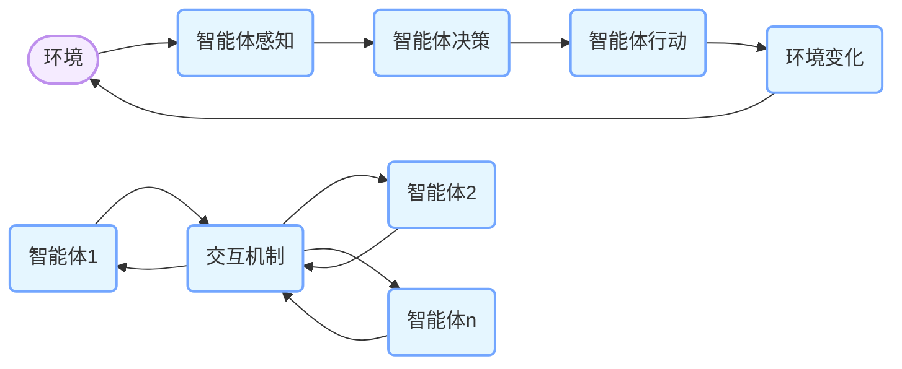

# 构建具有群体智能的多Agent系统

> 关键词：多Agent系统、群体智能、智能算法、数学模型、项目实战

> 摘要：本文深入探讨了构建具有群体智能的多Agent系统这一前沿技术领域。首先介绍了相关背景知识，包括目的范围、预期读者等。接着详细阐述了核心概念与联系，给出了原理和架构的示意图与流程图。对核心算法原理及操作步骤进行了分析，并结合Python代码说明。同时讲解了数学模型和公式，通过举例加深理解。在项目实战部分，展示了开发环境搭建、源代码实现及解读。还探讨了实际应用场景，推荐了学习资源、开发工具和相关论文著作。最后总结了未来发展趋势与挑战，并提供常见问题解答和扩展阅读参考资料，旨在为相关领域的研究者和开发者提供全面且深入的技术指导。

## 1. 背景介绍 
### 1.1 目的和范围
多Agent系统（Multi - Agent System，MAS）是由多个自主的智能体（Agent）组成的系统，这些智能体能够相互协作、交互以完成复杂的任务。构建具有群体智能的多Agent系统的目的在于模拟生物群体的智能行为，如蚁群、鸟群等，使系统能够在复杂、动态的环境中自适应地做出决策，提高系统的整体性能和鲁棒性。

本文章的范围涵盖了从多Agent系统和群体智能的基本概念入手，深入探讨核心算法原理、数学模型，通过实际的项目案例展示如何构建这样的系统，同时介绍相关的应用场景、学习资源、开发工具和研究成果等方面。

### 1.2 预期读者
本文预期读者包括计算机科学、人工智能、控制科学与工程等相关专业的学生，他们可以通过阅读本文了解多Agent系统和群体智能的前沿知识，为进一步的学习和研究打下基础；也适用于从事相关领域研究的科研人员，为他们的研究工作提供新的思路和方法；此外，对于软件开发者，特别是对智能系统开发感兴趣的人员，本文可以帮助他们掌握构建具有群体智能的多Agent系统的技术和方法。

### 1.3 文档结构概述
本文将按照以下结构进行阐述：首先介绍多Agent系统和群体智能的背景知识，包括目的、预期读者和文档结构等；接着详细讲解核心概念与联系，给出相关的原理和架构示意图及流程图；然后深入分析核心算法原理和具体操作步骤，并用Python代码进行说明；之后介绍数学模型和公式，并举例说明；在项目实战部分，展示开发环境搭建、源代码实现和代码解读；再探讨实际应用场景；随后推荐相关的学习资源、开发工具和论文著作；最后总结未来发展趋势与挑战，提供常见问题解答和扩展阅读参考资料。

### 1.4 术语表
#### 1.4.1 核心术语定义
- **Agent（智能体）**：是一个具有自主性、反应性、社会性和主动性的实体，能够在一定的环境中感知信息，并根据自身的目标和知识进行决策和行动。
- **多Agent系统（MAS）**：由多个智能体组成的系统，这些智能体之间通过交互和协作来完成共同的任务。
- **群体智能（Swarm Intelligence）**：是指由大量简单个体组成的群体通过相互之间的局部交互而涌现出的全局智能行为，如蚁群算法、粒子群算法等。

#### 1.4.2 相关概念解释
- **自主性**：智能体能够独立地感知环境、做出决策和执行行动，不受外界的直接控制。
- **反应性**：智能体能够对环境中的变化做出及时的反应，调整自己的行为。
- **社会性**：智能体能够与其他智能体进行交互和协作，通过信息共享和协调来完成任务。
- **主动性**：智能体能够主动地发起行动，追求自己的目标。

#### 1.4.3 缩略词列表
- **MAS**：Multi - Agent System（多Agent系统）
- **ACO**：Ant Colony Optimization（蚁群优化算法）
- **PSO**：Particle Swarm Optimization（粒子群优化算法）

## 2. 核心概念与联系 
### 核心概念原理
多Agent系统中的每个智能体都有自己的目标和行为规则，它们通过感知环境信息和与其他智能体的交互来调整自己的行为。群体智能则强调大量智能体之间的简单交互能够产生复杂的全局行为。例如，在蚁群算法中，蚂蚁个体通过释放信息素和感知信息素的浓度来决定自己的行动方向，大量蚂蚁的这种局部行为最终导致蚁群能够找到从蚁巢到食物源的最短路径。

### 架构的文本示意图
```plaintext
+----------------------+
|  环境（Environment） |
+----------------------+
        |      ^
        v      |
+----------------------+
|  智能体集合（Agents） |
| - Agent 1            |
| - Agent 2            |
| -...                |
| - Agent n            |
+----------------------+
        |      ^
        v      |
+----------------------+
|  交互机制（Interaction） |
| - 信息交换           |
| - 协作策略           |
+----------------------+
```

### Mermaid流程图


这个流程图展示了智能体与环境之间的循环交互过程，以及智能体之间通过交互机制进行信息交换和协作的关系。智能体首先感知环境信息，然后根据这些信息进行决策，接着执行相应的行动，行动又会导致环境发生变化，环境的变化再次被智能体感知，形成一个闭环。同时，不同的智能体之间通过交互机制进行信息共享和协作，以实现共同的目标。

## 3. 核心算法原理 & 具体操作步骤 
### 蚁群优化算法（ACO）原理
蚁群优化算法是一种基于蚂蚁觅食行为的启发式搜索算法。蚂蚁在寻找食物的过程中，会在走过的路径上释放信息素，其他蚂蚁会根据信息素的浓度来选择路径。信息素浓度越高的路径，被选择的概率越大。随着时间的推移，较短的路径上的信息素会不断积累，吸引更多的蚂蚁选择这些路径，最终蚁群能够找到从蚁巢到食物源的最短路径。

### Python代码实现蚁群优化算法
```python
import random
import math

# 定义城市坐标
cities = [
    (2, 3),
    (5, 1),
    (8, 4),
    (3, 6),
    (7, 2)
]

# 计算两个城市之间的距离
def distance(city1, city2):
    x1, y1 = city1
    x2, y2 = city2
    return math.sqrt((x1 - x2) ** 2 + (y1 - y2) ** 2)

# 初始化信息素矩阵
num_cities = len(cities)
pheromone_matrix = [[1.0] * num_cities for _ in range(num_cities)]

# 蚁群优化算法参数
num_ants = 10
num_iterations = 100
alpha = 1  # 信息素重要程度因子
beta = 2   # 启发式信息重要程度因子
rho = 0.5  # 信息素挥发因子
Q = 100    # 信息素增加强度系数

# 蚂蚁类
class Ant:
    def __init__(self):
        self.tour = []
        self.total_distance = 0

    def construct_tour(self):
        unvisited_cities = list(range(num_cities))
        start_city = random.choice(unvisited_cities)
        self.tour.append(start_city)
        unvisited_cities.remove(start_city)

        while unvisited_cities:
            current_city = self.tour[-1]
            probabilities = []
            total_probability = 0

            for city in unvisited_cities:
                pheromone = pheromone_matrix[current_city][city]
                dist = distance(cities[current_city], cities[city])
                probability = (pheromone ** alpha) * ((1.0 / dist) ** beta)
                probabilities.append(probability)
                total_probability += probability

            if total_probability == 0:
                next_city = random.choice(unvisited_cities)
            else:
                r = random.uniform(0, total_probability)
                cumulative_probability = 0
                for i, city in enumerate(unvisited_cities):
                    cumulative_probability += probabilities[i]
                    if cumulative_probability >= r:
                        next_city = city
                        break

            self.tour.append(next_city)
            unvisited_cities.remove(next_city)

        # 回到起点
        self.tour.append(self.tour[0])

        # 计算总距离
        for i in range(num_cities):
            self.total_distance += distance(cities[self.tour[i]], cities[self.tour[i + 1]])

    def update_pheromone(self):
        for i in range(num_cities):
            city1 = self.tour[i]
            city2 = self.tour[i + 1]
            pheromone_matrix[city1][city2] += Q / self.total_distance
            pheromone_matrix[city2][city1] += Q / self.total_distance

# 蚁群优化算法主循环
best_tour = None
best_distance = float('inf')

for _ in range(num_iterations):
    ants = [Ant() for _ in range(num_ants)]

    # 每只蚂蚁构建路径
    for ant in ants:
        ant.construct_tour()
        if ant.total_distance < best_distance:
            best_distance = ant.total_distance
            best_tour = ant.tour

    # 信息素挥发
    for i in range(num_cities):
        for j in range(num_cities):
            pheromone_matrix[i][j] *= (1 - rho)

    # 蚂蚁更新信息素
    for ant in ants:
        ant.update_pheromone()

print("最优路径:", best_tour)
print("最短距离:", best_distance)
```

### 代码解释
1. **城市坐标定义**：首先定义了一组城市的坐标，用于表示问题的搜索空间。
2. **距离计算函数**：`distance` 函数用于计算两个城市之间的欧几里得距离。
3. **信息素矩阵初始化**：`pheromone_matrix` 用于存储每条路径上的信息素浓度，初始时所有路径的信息素浓度都设为 1.0。
4. **蚁群优化算法参数设置**：包括蚂蚁数量、迭代次数、信息素重要程度因子、启发式信息重要程度因子、信息素挥发因子和信息素增加强度系数等。
5. **蚂蚁类定义**：`Ant` 类表示一只蚂蚁，包含构建路径和更新信息素的方法。
    - `construct_tour` 方法用于构建蚂蚁的路径，通过计算每条路径的选择概率来选择下一个要访问的城市。
    - `update_pheromone` 方法用于更新路径上的信息素浓度。
6. **蚁群优化算法主循环**：在每次迭代中，每只蚂蚁构建自己的路径，然后根据路径长度更新信息素矩阵。同时，记录下最短的路径和对应的距离。

### 粒子群优化算法（PSO）原理
粒子群优化算法是模拟鸟群或鱼群的群体行为而提出的一种优化算法。每个粒子代表一个潜在的解，在搜索空间中飞行。每个粒子有自己的位置和速度，根据自身的历史最优位置和群体的历史最优位置来更新自己的速度和位置，从而不断向最优解靠近。

### Python代码实现粒子群优化算法
```python
import random
import math

# 定义目标函数（这里以Rastrigin函数为例）
def rastrigin(x):
    A = 10
    n = len(x)
    return A * n + sum([(xi ** 2 - A * math.cos(2 * math.pi * xi)) for xi in x])

# 粒子群优化算法参数
num_particles = 20
dimensions = 2
max_iterations = 100
c1 = 1.4  # 个体学习因子
c2 = 1.4  # 社会学习因子
w = 0.7   # 惯性权重

# 初始化粒子群
particles = []
for _ in range(num_particles):
    position = [random.uniform(-5.12, 5.12) for _ in range(dimensions)]
    velocity = [random.uniform(-1, 1) for _ in range(dimensions)]
    fitness = rastrigin(position)
    pbest_position = position.copy()
    pbest_fitness = fitness
    particles.append({
        'position': position,
        'velocity': velocity,
        'fitness': fitness,
        'pbest_position': pbest_position,
        'pbest_fitness': pbest_fitness
    })

# 初始化全局最优位置和适应度
gbest_position = None
gbest_fitness = float('inf')
for particle in particles:
    if particle['pbest_fitness'] < gbest_fitness:
        gbest_fitness = particle['pbest_fitness']
        gbest_position = particle['pbest_position'].copy()

# 粒子群优化算法主循环
for _ in range(max_iterations):
    for particle in particles:
        # 更新速度
        for i in range(dimensions):
            r1 = random.random()
            r2 = random.random()
            particle['velocity'][i] = (w * particle['velocity'][i] +
                                       c1 * r1 * (particle['pbest_position'][i] - particle['position'][i]) +
                                       c2 * r2 * (gbest_position[i] - particle['position'][i]))

        # 更新位置
        for i in range(dimensions):
            particle['position'][i] += particle['velocity'][i]

        # 计算新的适应度
        particle['fitness'] = rastrigin(particle['position'])

        # 更新个体最优位置和适应度
        if particle['fitness'] < particle['pbest_fitness']:
            particle['pbest_fitness'] = particle['fitness']
            particle['pbest_position'] = particle['position'].copy()

        # 更新全局最优位置和适应度
        if particle['pbest_fitness'] < gbest_fitness:
            gbest_fitness = particle['pbest_fitness']
            gbest_position = particle['pbest_position'].copy()

print("全局最优位置:", gbest_position)
print("全局最优适应度:", gbest_fitness)
```

### 代码解释
1. **目标函数定义**：这里使用 Rastrigin 函数作为目标函数，用于评估粒子的适应度。
2. **粒子群优化算法参数设置**：包括粒子数量、维度、最大迭代次数、个体学习因子、社会学习因子和惯性权重等。
3. **粒子群初始化**：每个粒子有自己的位置、速度、适应度、个体最优位置和个体最优适应度。
4. **全局最优位置和适应度初始化**：遍历所有粒子，找到初始的全局最优位置和适应度。
5. **粒子群优化算法主循环**：在每次迭代中，每个粒子根据自身的历史最优位置和群体的历史最优位置更新自己的速度和位置，然后计算新的适应度。如果新的适应度优于个体最优适应度，则更新个体最优位置和适应度。如果个体最优适应度优于全局最优适应度，则更新全局最优位置和适应度。

## 4. 数学模型和公式 & 详细讲解 & 举例说明 
### 蚁群优化算法数学模型
#### 路径选择概率公式
在蚁群优化算法中，蚂蚁 $k$ 在当前城市 $i$ 选择下一个城市 $j$ 的概率 $p_{ij}^k$ 计算公式如下：
$$
p_{ij}^k = \begin{cases}
\frac{[\tau_{ij}(t)]^\alpha [\eta_{ij}]^\beta}{\sum_{l \in allowed_k} [\tau_{il}(t)]^\alpha [\eta_{il}]^\beta} & \text{if } j \in allowed_k \\
0 & \text{otherwise}
\end{cases}
$$
其中，$\tau_{ij}(t)$ 表示在时刻 $t$ 城市 $i$ 到城市 $j$ 路径上的信息素浓度，$\eta_{ij} = \frac{1}{d_{ij}}$ 是启发式信息，$d_{ij}$ 是城市 $i$ 到城市 $j$ 的距离，$\alpha$ 是信息素重要程度因子，$\beta$ 是启发式信息重要程度因子，$allowed_k$ 是蚂蚁 $k$ 还未访问的城市集合。

#### 信息素更新公式
信息素的更新分为挥发和增加两个部分。信息素挥发公式为：
$$
\tau_{ij}(t + 1) = (1 - \rho) \tau_{ij}(t)
$$
其中，$\rho$ 是信息素挥发因子，$0 < \rho < 1$。

信息素增加公式为：
$$
\tau_{ij}(t + 1) = \tau_{ij}(t + 1) + \sum_{k = 1}^{m} \Delta \tau_{ij}^k
$$
其中，$m$ 是蚂蚁的数量，$\Delta \tau_{ij}^k$ 是第 $k$ 只蚂蚁在城市 $i$ 到城市 $j$ 路径上释放的信息素量，通常定义为：
$$
\Delta \tau_{ij}^k = \begin{cases}
\frac{Q}{L_k} & \text{if 蚂蚁 } k \text{ 经过路径 } (i, j) \\
0 & \text{otherwise}
\end{cases}
$$
其中，$Q$ 是信息素增加强度系数，$L_k$ 是第 $k$ 只蚂蚁的路径长度。

#### 举例说明
假设有 3 个城市 $A$、$B$、$C$，初始信息素浓度 $\tau_{AB}(0) = \tau_{AC}(0) = \tau_{BC}(0) = 1.0$，距离 $d_{AB} = 2$，$d_{AC} = 3$，$d_{BC} = 4$，$\alpha = 1$，$\beta = 2$，$\rho = 0.5$，$Q = 100$。

现在有一只蚂蚁从城市 $A$ 出发，它选择城市 $B$ 的概率为：
$$
\eta_{AB} = \frac{1}{d_{AB}} = \frac{1}{2}
$$
$$
\eta_{AC} = \frac{1}{d_{AC}} = \frac{1}{3}
$$
$$
p_{AB}^1 = \frac{[\tau_{AB}(0)]^1 [\eta_{AB}]^2}{[\tau_{AB}(0)]^1 [\eta_{AB}]^2 + [\tau_{AC}(0)]^1 [\eta_{AC}]^2} = \frac{1^1 \times (\frac{1}{2})^2}{1^1 \times (\frac{1}{2})^2 + 1^1 \times (\frac{1}{3})^2} = \frac{\frac{1}{4}}{\frac{1}{4} + \frac{1}{9}} = \frac{9}{13}
$$
$$
p_{AC}^1 = 1 - p_{AB}^1 = \frac{4}{13}
$$

假设蚂蚁选择了城市 $B$，然后又回到城市 $A$，路径长度 $L_1 = d_{AB} + d_{BA} = 4$。信息素挥发后：
$$
\tau_{AB}(1) = (1 - \rho) \tau_{AB}(0) = 0.5 \times 1.0 = 0.5
$$
蚂蚁释放的信息素量：
$$
\Delta \tau_{AB}^1 = \frac{Q}{L_1} = \frac{100}{4} = 25
$$
更新后的信息素浓度：
$$
\tau_{AB}(1) = \tau_{AB}(1) + \Delta \tau_{AB}^1 = 0.5 + 25 = 25.5
$$

### 粒子群优化算法数学模型
#### 速度更新公式
粒子 $i$ 在第 $t + 1$ 次迭代时的速度更新公式为：
$$
v_{i}^{t + 1} = w v_{i}^{t} + c_1 r_1 (pbest_{i} - x_{i}^{t}) + c_2 r_2 (gbest - x_{i}^{t})
$$
其中，$v_{i}^{t}$ 是粒子 $i$ 在第 $t$ 次迭代时的速度，$w$ 是惯性权重，$c_1$ 是个体学习因子，$c_2$ 是社会学习因子，$r_1$ 和 $r_2$ 是 $[0, 1]$ 之间的随机数，$pbest_{i}$ 是粒子 $i$ 的历史最优位置，$gbest$ 是群体的历史最优位置，$x_{i}^{t}$ 是粒子 $i$ 在第 $t$ 次迭代时的位置。

#### 位置更新公式
粒子 $i$ 在第 $t + 1$ 次迭代时的位置更新公式为：
$$
x_{i}^{t + 1} = x_{i}^{t} + v_{i}^{t + 1}
$$

#### 举例说明
假设有一个二维搜索空间，粒子 $i$ 在第 $t$ 次迭代时的位置 $x_{i}^{t} = (2, 3)$，速度 $v_{i}^{t} = (0.5, 0.3)$，个体最优位置 $pbest_{i} = (1, 2)$，群体最优位置 $gbest = (0.5, 1.5)$，$w = 0.7$，$c_1 = 1.4$，$c_2 = 1.4$，$r_1 = 0.6$，$r_2 = 0.8$。

首先计算速度更新：
$$
v_{i,x}^{t + 1} = w v_{i,x}^{t} + c_1 r_1 (pbest_{i,x} - x_{i,x}^{t}) + c_2 r_2 (gbest_x - x_{i,x}^{t})
$$
$$
= 0.7 \times 0.5 + 1.4 \times 0.6 \times (1 - 2) + 1.4 \times 0.8 \times (0.5 - 2)
$$
$$
= 0.35 - 0.84 - 1.68 = -2.17
$$
$$
v_{i,y}^{t + 1} = w v_{i,y}^{t} + c_1 r_1 (pbest_{i,y} - x_{i,y}^{t}) + c_2 r_2 (gbest_y - x_{i,y}^{t})
$$
$$
= 0.7 \times 0.3 + 1.4 \times 0.6 \times (2 - 3) + 1.4 \times 0.8 \times (1.5 - 3)
$$
$$
= 0.21 - 0.84 - 1.68 = -2.31
$$

然后计算位置更新：
$$
x_{i,x}^{t + 1} = x_{i,x}^{t} + v_{i,x}^{t + 1} = 2 - 2.17 = -0.17
$$
$$
x_{i,y}^{t + 1} = x_{i,y}^{t} + v_{i,y}^{t + 1} = 3 - 2.31 = 0.69
$$

所以，粒子 $i$ 在第 $t + 1$ 次迭代时的位置为 $(-0.17, 0.69)$。

## 5. 项目实战：代码实际案例和详细解释说明 
### 5.1  开发环境搭建
#### 安装Python
首先需要安装 Python 编程语言，建议使用 Python 3.7 及以上版本。可以从 Python 官方网站（https://www.python.org/downloads/） 下载对应操作系统的安装包，按照安装向导进行安装。

#### 安装必要的库
在构建具有群体智能的多Agent系统时，可能需要使用一些 Python 库，如 `numpy`、`matplotlib` 等。可以使用 `pip` 包管理器来安装这些库，在命令行中执行以下命令：
```sh
pip install numpy matplotlib
```

### 5.2  源代码详细实现和代码解读
#### 多Agent系统模拟项目
以下是一个简单的多Agent系统模拟项目，模拟多个智能体在二维平面上移动和协作的过程。

```python
import random
import numpy as np
import matplotlib.pyplot as plt

# 智能体类
class Agent:
    def __init__(self, id, position):
        self.id = id
        self.position = np.array(position, dtype=float)
        self.velocity = np.random.randn(2) * 0.1

    def move(self, other_agents):
        # 简单的协作规则：向其他智能体的平均位置移动
        total_position = np.zeros(2)
        num_agents = len(other_agents)
        for agent in other_agents:
            total_position += agent.position
        average_position = total_position / num_agents

        # 计算方向
        direction = average_position - self.position
        direction = direction / np.linalg.norm(direction) if np.linalg.norm(direction) > 0 else np.zeros(2)

        # 更新速度
        self.velocity += direction * 0.1
        self.velocity = np.clip(self.velocity, -1, 1)

        # 更新位置
        self.position += self.velocity

# 多Agent系统类
class MultiAgentSystem:
    def __init__(self, num_agents, area_size):
        self.agents = []
        for i in range(num_agents):
            position = [random.uniform(0, area_size[0]), random.uniform(0, area_size[1])]
            agent = Agent(i, position)
            self.agents.append(agent)
        self.area_size = area_size

    def step(self):
        for agent in self.agents:
            other_agents = [a for a in self.agents if a.id!= agent.id]
            agent.move(other_agents)
            # 边界处理
            agent.position[0] = np.clip(agent.position[0], 0, self.area_size[0])
            agent.position[1] = np.clip(agent.position[1], 0, self.area_size[1])

    def get_agent_positions(self):
        positions = []
        for agent in self.agents:
            positions.append(agent.position)
        return np.array(positions)

# 主函数
if __name__ == "__main__":
    num_agents = 20
    area_size = [100, 100]
    mas = MultiAgentSystem(num_agents, area_size)

    num_steps = 100
    positions_history = []

    for _ in range(num_steps):
        mas.step()
        positions = mas.get_agent_positions()
        positions_history.append(positions)

    # 可视化
    plt.figure(figsize=(10, 10))
    for i in range(num_steps):
        plt.clf()
        positions = positions_history[i]
        plt.scatter(positions[:, 0], positions[:, 1], color='b')
        plt.xlim(0, area_size[0])
        plt.ylim(0, area_size[1])
        plt.title(f"Step {i}")
        plt.pause(0.1)

    plt.show()
```

#### 代码解读
1. **智能体类（Agent）**：
    - `__init__` 方法：初始化智能体的 ID、位置和速度。
    - `move` 方法：根据其他智能体的平均位置计算移动方向，更新速度和位置。同时，对速度进行限制，避免速度过大。

2. **多Agent系统类（MultiAgentSystem）**：
    - `__init__` 方法：初始化多个智能体，并将它们存储在 `agents` 列表中。
    - `step` 方法：每个时间步，每个智能体根据其他智能体的信息进行移动，并处理边界情况。
    - `get_agent_positions` 方法：返回所有智能体的当前位置。

3. **主函数**：
    - 创建一个多Agent系统对象，设置智能体数量和区域大小。
    - 模拟多个时间步，记录每个时间步智能体的位置。
    - 使用 `matplotlib` 库进行可视化，展示智能体的移动过程。

### 5.3  代码解读与分析
#### 协作机制分析
在这个项目中，智能体之间的协作机制是简单的向其他智能体的平均位置移动。这种机制可以使智能体逐渐聚集在一起，形成群体行为。然而，这种协作机制比较简单，在实际应用中，可能需要根据具体的任务和环境设计更复杂的协作策略。

#### 边界处理分析
为了避免智能体移出指定的区域，代码中对智能体的位置进行了边界处理，使用 `np.clip` 函数将智能体的位置限制在指定的范围内。这样可以保证智能体始终在模拟区域内移动。

#### 性能分析
该代码的时间复杂度主要取决于智能体的数量和模拟的时间步数。在每个时间步，每个智能体需要遍历其他所有智能体来计算平均位置，因此时间复杂度为 $O(n^2)$，其中 $n$ 是智能体的数量。如果智能体数量较多，可能会导致性能问题。可以考虑使用一些优化算法，如空间划分算法，来减少智能体之间的交互次数，提高性能。

## 6. 实际应用场景 
### 机器人协作
在机器人领域，具有群体智能的多Agent系统可以用于实现多个机器人之间的协作。例如，在仓库物流中，多个搬运机器人可以通过协作完成货物的搬运任务。每个机器人作为一个智能体，根据其他机器人的位置和任务状态，合理规划自己的路径，避免碰撞，提高搬运效率。

### 交通控制
在交通领域，多Agent系统可以用于交通信号控制和车辆路径规划。每个车辆和交通信号灯都可以看作一个智能体，通过相互通信和协作，优化交通流量，减少拥堵。例如，车辆可以根据实时的交通信息调整自己的行驶速度和路径，交通信号灯可以根据车辆的流量动态调整信号灯的时长。

### 传感器网络
在传感器网络中，多个传感器节点可以组成一个多Agent系统。每个传感器节点作为一个智能体，感知周围环境的信息，并将信息传输给其他节点。通过群体智能，传感器网络可以实现数据的高效采集、处理和传输，提高整个网络的性能和可靠性。

### 金融市场
在金融市场中，多Agent系统可以用于模拟投资者的行为和市场的动态变化。每个投资者作为一个智能体，根据市场信息和其他投资者的行为做出投资决策。通过模拟多个投资者的交互，可以研究市场的稳定性、价格波动等问题，为投资者提供决策支持。

## 7. 工具和资源推荐
### 7.1 学习资源推荐
#### 7.1.1 书籍推荐
- 《多Agent系统引论》：这本书全面介绍了多Agent系统的基本概念、理论和方法，包括智能体的建模、交互、协作等方面，是学习多Agent系统的经典教材。
- 《群体智能：从自然到人工系统》：详细阐述了群体智能的原理、算法和应用，通过大量的实例和案例分析，帮助读者深入理解群体智能的本质。
- 《人工智能：一种现代的方法》：涵盖了人工智能的各个领域，包括多Agent系统和群体智能，对相关的算法和技术进行了系统的介绍和分析。

#### 7.1.2 在线课程
- Coursera 上的“Multi - Agent Systems”课程：由知名高校的教授授课，系统地介绍了多Agent系统的理论和实践，包括智能体的设计、交互协议、协作算法等内容。
- edX 上的“Swarm Intelligence”课程：专注于群体智能的研究，讲解了蚁群算法、粒子群算法等经典的群体智能算法，以及它们在优化问题、机器学习等领域的应用。

#### 7.1.3 技术博客和网站
- AI Time 论道：该博客经常发布人工智能领域的最新研究成果和技术动态，包括多Agent系统和群体智能方面的内容，有很多专家的解读和分析。
- arXiv.org：是一个预印本服务器，提供了大量的学术论文，涵盖了多Agent系统、群体智能等领域的最新研究成果，可以及时了解该领域的前沿动态。

### 7.2 开发工具框架推荐
#### 7.2.1 IDE和编辑器
- PyCharm：是一款专门为 Python 开发设计的集成开发环境（IDE），具有强大的代码编辑、调试、代码分析等功能，非常适合开发基于 Python 的多Agent系统。
- Visual Studio Code：是一款轻量级的代码编辑器，支持多种编程语言，通过安装相关的插件，可以实现 Python 代码的开发、调试等功能，具有很高的灵活性。

#### 7.2.2 调试和性能分析工具
- PDB：是 Python 自带的调试工具，可以在代码中设置断点，单步执行代码，查看变量的值等，帮助开发者快速定位和解决问题。
- cProfile：是 Python 的性能分析工具，可以统计代码中各个函数的执行时间和调用次数，帮助开发者找出代码中的性能瓶颈。

#### 7.2.3 相关框架和库
- Mesa：是一个用于构建基于代理的模型的 Python 框架，提供了丰富的工具和类库，方便开发者快速构建多Agent系统模型。
- JADE（Java Agent DEvelopment Framework）：是一个用 Java 实现的多Agent系统开发框架，具有良好的可扩展性和分布式特性，适合开发大规模的多Agent系统。

### 7.3 相关论文著作推荐
#### 7.3.1 经典论文
- “Ant System: Optimization by a Colony of Cooperating Agents”：首次提出了蚁群优化算法，详细介绍了算法的原理和实现方法，是蚁群算法领域的经典论文。
- “Particle Swarm Optimization”：提出了粒子群优化算法，阐述了算法的基本思想和数学模型，为群体智能算法的发展奠定了基础。

#### 7.3.2 最新研究成果
- 可以关注每年在人工智能、多Agent系统等领域的顶级学术会议上发表的论文，如 IJCAI（国际人工智能联合会议）、AAMAS（自治个体和多智能体系统国际会议）等，这些会议上的论文代表了该领域的最新研究成果。

#### 7.3.3 应用案例分析
- 一些实际应用领域的研究论文会详细介绍多Agent系统和群体智能在该领域的应用案例，如机器人协作、交通控制等。可以通过查阅相关领域的学术期刊，如《机器人》、《交通运输工程学报》等，获取这些应用案例的分析和研究。

## 8. 总结：未来发展趋势与挑战
### 未来发展趋势
#### 与深度学习的融合
将多Agent系统和群体智能与深度学习相结合是未来的一个重要发展趋势。深度学习可以用于智能体的感知和决策，而多Agent系统和群体智能可以用于智能体之间的协作和交互。例如，在自动驾驶领域，多个自动驾驶车辆可以作为智能体，通过深度学习技术感知周围环境，利用群体智能算法进行路径规划和协作，提高自动驾驶的安全性和效率。

#### 大规模分布式系统
随着物联网和云计算技术的发展，构建大规模分布式的多Agent系统将成为可能。在大规模分布式系统中，大量的智能体可以分布在不同的地理位置，通过网络进行通信和协作。例如，在智能电网中，大量的电力设备可以作为智能体，实时感知电力数据，通过群体智能算法优化电力分配，提高电网的稳定性和效率。

#### 跨学科应用
多Agent系统和群体智能将在更多的跨学科领域得到应用，如生物医学、社会科学等。在生物医学领域，多Agent系统可以用于模拟生物细胞之间的交互和协作，研究疾病的发生和发展机制；在社会科学领域，多Agent系统可以用于模拟人类社会的行为和决策过程，研究社会现象和问题。

### 挑战
#### 通信和协调问题
在大规模的多Agent系统中，智能体之间的通信和协调是一个挑战。由于网络延迟、带宽限制等因素，智能体之间的信息传输可能会受到影响，导致协作效率低下。此外，如何设计有效的协调机制，使智能体能够在复杂的环境中高效地协作，也是一个需要解决的问题。

#### 智能体的自主性和适应性
智能体需要具备一定的自主性和适应性，能够在复杂、动态的环境中自主地做出决策和调整自己的行为。然而，目前的智能体技术在自主性和适应性方面还存在不足，需要进一步研究和发展。

#### 安全和隐私问题
在多Agent系统中，智能体之间的信息交互和协作可能会涉及到安全和隐私问题。例如，在金融市场中，投资者的交易信息和决策策略是敏感信息，需要保护其安全性和隐私性。如何设计安全可靠的多Agent系统，防止信息泄露和恶意攻击，是一个亟待解决的问题。

## 9. 附录：常见问题与解答
### 问题1：多Agent系统和分布式系统有什么区别？
解答：多Agent系统强调智能体的自主性、社会性和协作性，智能体具有一定的智能和决策能力，能够根据环境和其他智能体的信息进行自主决策和行动。而分布式系统主要关注系统的分布性和并发性，强调将任务分布到多个节点上进行处理，以提高系统的性能和可靠性。虽然多Agent系统通常是分布式的，但分布式系统不一定具有智能体的特性。

### 问题2：群体智能算法的收敛速度如何提高？
解答：可以通过调整算法的参数，如信息素挥发因子、惯性权重等，来提高群体智能算法的收敛速度。此外，还可以采用混合算法，将群体智能算法与其他优化算法相结合，利用不同算法的优势，提高收敛速度。同时，对问题进行合理的编码和表示，也可以有助于提高算法的收敛速度。

### 问题3：如何评估多Agent系统的性能？
解答：可以从多个方面评估多Agent系统的性能，如任务完成时间、资源利用率、协作效率等。对于任务完成时间，可以记录系统完成任务所需的时间，时间越短，性能越好。资源利用率可以通过计算系统中各种资源的使用情况来评估，如计算资源、通信资源等。协作效率可以通过评估智能体之间的协作效果来衡量，如协作的成功率、协作的时间等。

## 10. 扩展阅读 & 参考资料
### 扩展阅读
- 《智能系统中的模糊逻辑、神经网络和进化计算》：介绍了模糊逻辑、神经网络和进化计算等智能技术，这些技术可以与多Agent系统和群体智能相结合，进一步拓展智能系统的应用领域。
- 《复杂系统理论基础》：探讨了复杂系统的基本概念、理论和方法，多Agent系统和群体智能属于复杂系统的范畴，阅读这本书可以帮助读者深入理解复杂系统的本质和特性。

### 参考资料
- 相关学术论文和研究报告，如在 IJCAI、AAMAS 等会议上发表的论文，以及相关领域的学术期刊上的文章。
- 开源项目和代码库，如 GitHub 上的多Agent系统和群体智能相关的开源项目，可以参考这些项目的实现代码和文档。

作者：AI天才研究院/AI Genius Institute & 禅与计算机程序设计艺术 /Zen And The Art of Computer Programming