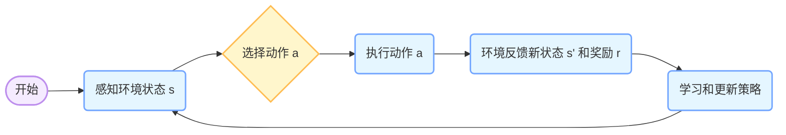

# 构建具有自主探索与学习能力的AI Agent

> 关键词：AI Agent、自主探索、自主学习、强化学习、智能体架构

> 摘要：本文围绕构建具有自主探索与学习能力的AI Agent展开。首先介绍了相关背景，包括目的、预期读者、文档结构和术语表。接着阐述了核心概念与联系，给出了原理和架构的示意图及流程图。详细讲解了核心算法原理，通过Python代码进行说明，还介绍了相关的数学模型和公式。通过项目实战，展示了代码实现和解读。探讨了实际应用场景，推荐了学习资源、开发工具框架和相关论文著作。最后总结了未来发展趋势与挑战，并提供了常见问题解答和扩展阅读参考资料，旨在为开发者和研究者提供全面的技术指导，助力构建强大的AI Agent。

## 1. 背景介绍 
### 1.1 目的和范围
在当今人工智能快速发展的时代，构建具有自主探索与学习能力的AI Agent具有重要意义。传统的AI系统往往需要人类明确地设定任务和规则，缺乏自主适应和探索未知环境的能力。而具有自主探索与学习能力的AI Agent能够在复杂、动态和不确定的环境中，主动地探索新的信息、学习新的知识和技能，从而更好地完成各种任务。

本文的范围涵盖了构建这类AI Agent的核心概念、算法原理、数学模型、项目实战、实际应用场景以及相关的工具和资源推荐等方面。旨在为开发者和研究者提供一个全面、系统的指导，帮助他们深入理解和掌握构建具有自主探索与学习能力的AI Agent的技术和方法。

### 1.2 预期读者
本文预期读者主要包括以下几类人群：
- **人工智能开发者**：希望通过学习和实践，掌握构建具有自主探索与学习能力的AI Agent的技术和方法，将其应用到实际项目中。
- **计算机科学专业的学生**：对人工智能领域感兴趣，希望深入了解AI Agent的相关知识和技术，为未来的学习和研究打下基础。
- **科研人员**：在人工智能、机器学习等领域进行研究工作，希望通过本文了解最新的研究成果和发展趋势，为自己的研究提供参考和启发。
- **技术爱好者**：对人工智能技术充满热情，希望了解具有自主探索与学习能力的AI Agent的原理和应用，拓宽自己的技术视野。

### 1.3 文档结构概述
本文将按照以下结构进行组织：
- **核心概念与联系**：介绍AI Agent、自主探索和自主学习的核心概念，以及它们之间的联系，给出原理和架构的文本示意图和Mermaid流程图。
- **核心算法原理 & 具体操作步骤**：详细讲解构建具有自主探索与学习能力的AI Agent所涉及的核心算法原理，如强化学习算法，并使用Python源代码进行说明。
- **数学模型和公式 & 详细讲解 & 举例说明**：介绍相关的数学模型和公式，如马尔可夫决策过程（MDP），并进行详细讲解和举例说明。
- **项目实战：代码实际案例和详细解释说明**：通过一个具体的项目实战，展示如何构建具有自主探索与学习能力的AI Agent，包括开发环境搭建、源代码详细实现和代码解读。
- **实际应用场景**：探讨具有自主探索与学习能力的AI Agent在不同领域的实际应用场景。
- **工具和资源推荐**：推荐学习资源、开发工具框架和相关论文著作，帮助读者进一步深入学习和研究。
- **总结：未来发展趋势与挑战**：总结具有自主探索与学习能力的AI Agent的未来发展趋势和面临的挑战。
- **附录：常见问题与解答**：提供常见问题的解答，帮助读者解决在学习和实践过程中遇到的问题。
- **扩展阅读 & 参考资料**：提供扩展阅读的建议和相关的参考资料，方便读者进一步深入学习。

### 1.4 术语表
#### 1.4.1 核心术语定义
- **AI Agent（人工智能智能体）**：是一个能够感知环境、做出决策并采取行动的实体，它可以与环境进行交互，以实现特定的目标。
- **自主探索**：指AI Agent在没有明确指导的情况下，主动地在环境中探索新的状态和动作，以获取更多的信息和经验。
- **自主学习**：指AI Agent能够根据自身的经验和反馈，自动地调整自己的行为和策略，以提高在环境中的性能和表现。
- **强化学习**：是一种机器学习方法，通过智能体与环境进行交互，根据环境给予的奖励信号来学习最优的行为策略。
- **马尔可夫决策过程（MDP）**：是一种用于描述智能体在环境中决策过程的数学模型，它具有马尔可夫性质，即智能体的下一个状态只取决于当前状态和当前动作。

#### 1.4.2 相关概念解释
- **状态（State）**：表示环境在某一时刻的特征和信息，智能体可以根据当前状态来做出决策。
- **动作（Action）**：智能体在某一状态下可以采取的行为，不同的动作会导致环境状态的变化。
- **奖励（Reward）**：环境在智能体采取某一动作后给予的反馈信号，用于评估智能体的行为好坏，智能体的目标是最大化累积奖励。
- **策略（Policy）**：是智能体在不同状态下选择动作的规则，它决定了智能体的行为方式。

#### 1.4.3 缩略词列表
- **AI（Artificial Intelligence）**：人工智能
- **MDP（Markov Decision Process）**：马尔可夫决策过程
- **RL（Reinforcement Learning）**：强化学习
- **Q - learning**：一种无模型的强化学习算法

## 2. 核心概念与联系 
### 核心概念原理
#### AI Agent
AI Agent是一个能够感知环境、做出决策并采取行动的实体。它通常由感知模块、决策模块和执行模块组成。感知模块用于获取环境的信息，将其转化为智能体可以理解的状态表示；决策模块根据当前状态和自身的策略，选择合适的动作；执行模块将决策模块选择的动作执行到环境中。

#### 自主探索
自主探索是AI Agent在没有明确指导的情况下，主动地在环境中探索新的状态和动作。探索的目的是为了获取更多的信息和经验，以便更好地了解环境的结构和规律，发现可能的最优策略。常见的探索方法包括随机探索、基于不确定性的探索等。

#### 自主学习
自主学习是AI Agent根据自身的经验和反馈，自动地调整自己的行为和策略，以提高在环境中的性能和表现。在强化学习中，智能体通过与环境进行交互，根据环境给予的奖励信号来学习最优的行为策略。学习的过程通常涉及到对价值函数的估计和更新，以及对策略的优化。

### 架构的文本示意图
```plaintext
             +-----------------+
             |  AI Agent       |
             +-----------------+
             | 感知模块        |
             | 决策模块        |
             | 执行模块        |
             +-----------------+
                   |
                   v
             +-----------------+
             | 环境             |
             +-----------------+
             | 状态 s           |
             | 奖励 r           |
             +-----------------+
```
在这个示意图中，AI Agent通过感知模块获取环境的状态信息，决策模块根据状态信息选择动作，执行模块将动作执行到环境中。环境根据智能体的动作给出新的状态和奖励，智能体根据奖励进行学习和调整。

### Mermaid流程图

这个流程图展示了AI Agent与环境交互的基本过程。智能体首先感知环境状态，然后选择动作并执行，环境反馈新状态和奖励，智能体根据奖励进行学习和更新策略，然后继续感知环境，循环往复。

## 3. 核心算法原理 & 具体操作步骤 
### 强化学习算法原理
强化学习是构建具有自主探索与学习能力的AI Agent的核心算法之一。在强化学习中，智能体与环境进行交互，通过不断地尝试不同的动作，根据环境给予的奖励信号来学习最优的行为策略。

#### Q - learning算法
Q - learning是一种无模型的强化学习算法，它通过估计状态 - 动作对的价值（Q值）来学习最优策略。Q值表示在某一状态下采取某一动作所能获得的长期累积奖励。

Q - learning的更新公式为：
$$Q(s,a) \leftarrow Q(s,a) + \alpha [r + \gamma \max_{a'} Q(s',a') - Q(s,a)]$$
其中：
- $Q(s,a)$ 是当前状态 $s$ 下采取动作 $a$ 的Q值。
- $\alpha$ 是学习率，控制每次更新的步长。
- $r$ 是执行动作 $a$ 后环境给予的即时奖励。
- $\gamma$ 是折扣因子，用于衡量未来奖励的重要性。
- $s'$ 是执行动作 $a$ 后环境转移到的新状态。
- $\max_{a'} Q(s',a')$ 是新状态 $s'$ 下所有可能动作的最大Q值。

### Python源代码实现
```python
import numpy as np

# 定义环境参数
num_states = 10
num_actions = 4
gamma = 0.9  # 折扣因子
alpha = 0.1  # 学习率

# 初始化Q表
Q = np.zeros((num_states, num_actions))

# 定义一个简单的环境交互函数
def env_step(state, action):
    # 这里简单模拟环境的反馈
    new_state = (state + action) % num_states
    reward = 1 if new_state == 0 else 0
    return new_state, reward

# 训练Q - learning算法
num_episodes = 1000
for episode in range(num_episodes):
    state = np.random.randint(0, num_states)  # 随机初始化状态
    done = False
    while not done:
        # 选择动作（这里使用epsilon - greedy策略）
        epsilon = 0.1
        if np.random.uniform(0, 1) < epsilon:
            action = np.random.randint(0, num_actions)  # 随机探索
        else:
            action = np.argmax(Q[state, :])  # 利用最优动作

        # 执行动作，获取新状态和奖励
        new_state, reward = env_step(state, action)

        # 更新Q表
        Q[state, action] = Q[state, action] + alpha * (reward + gamma * np.max(Q[new_state, :]) - Q[state, action])

        # 判断是否结束
        if new_state == 0:
            done = True

        state = new_state

# 输出最终的Q表
print("Final Q - table:")
print(Q)
```
### 具体操作步骤
1. **初始化Q表**：将Q表初始化为全零矩阵，Q表的行数为状态数，列数为动作数。
2. **选择动作**：使用epsilon - greedy策略选择动作。以一定的概率 $\epsilon$ 随机选择动作进行探索，以 $1 - \epsilon$ 的概率选择Q值最大的动作进行利用。
3. **执行动作并获取反馈**：将选择的动作执行到环境中，获取环境反馈的新状态和奖励。
4. **更新Q表**：根据Q - learning的更新公式更新当前状态 - 动作对的Q值。
5. **判断是否结束**：如果达到终止条件（如到达目标状态），则结束当前回合；否则，将新状态作为当前状态，继续下一轮循环。
6. **重复训练**：重复上述步骤，进行多个回合的训练，直到Q表收敛或达到最大训练回合数。

## 4. 数学模型和公式 & 详细讲解 & 举例说明 
### 马尔可夫决策过程（MDP）
马尔可夫决策过程是一种用于描述智能体在环境中决策过程的数学模型，它由一个五元组 $(S, A, P, R, \gamma)$ 组成：
- $S$ 是状态集合，表示环境可能处于的所有状态。
- $A$ 是动作集合，表示智能体在每个状态下可以采取的所有动作。
- $P(s'|s,a)$ 是状态转移概率，表示在状态 $s$ 下采取动作 $a$ 后转移到状态 $s'$ 的概率。
- $R(s,a)$ 是奖励函数，表示在状态 $s$ 下采取动作 $a$ 后获得的即时奖励。
- $\gamma$ 是折扣因子，用于衡量未来奖励的重要性，取值范围为 $[0, 1]$。

### 价值函数
#### 状态价值函数 $V^{\pi}(s)$
状态价值函数表示在策略 $\pi$ 下，从状态 $s$ 开始所能获得的长期累积奖励的期望：
$$V^{\pi}(s) = \mathbb{E}_{\pi} \left[ \sum_{t = 0}^{\infty} \gamma^t r_t | s_0 = s \right]$$
其中，$r_t$ 是在时刻 $t$ 获得的奖励。

#### 动作价值函数 $Q^{\pi}(s,a)$
动作价值函数表示在策略 $\pi$ 下，从状态 $s$ 开始采取动作 $a$ 后所能获得的长期累积奖励的期望：
$$Q^{\pi}(s,a) = \mathbb{E}_{\pi} \left[ \sum_{t = 0}^{\infty} \gamma^t r_t | s_0 = s, a_0 = a \right]$$

### 最优价值函数和最优策略
最优状态价值函数 $V^*(s)$ 和最优动作价值函数 $Q^*(s,a)$ 分别表示在所有可能的策略中，从状态 $s$ 开始所能获得的最大长期累积奖励的期望：
$$V^*(s) = \max_{\pi} V^{\pi}(s)$$
$$Q^*(s,a) = \max_{\pi} Q^{\pi}(s,a)$$
最优策略 $\pi^*$ 是使得最优价值函数达到最大的策略，即：
$$\pi^*(s) = \arg \max_{a} Q^*(s,a)$$

### 举例说明
考虑一个简单的网格世界环境，智能体在一个 $3 \times 3$ 的网格中移动，目标是到达右下角的网格。智能体可以采取上、下、左、右四个动作。

- **状态集合 $S$**：网格中的每个位置都是一个状态，共有 $3 \times 3 = 9$ 个状态。
- **动作集合 $A$**：{上，下，左，右}，共4个动作。
- **状态转移概率 $P(s'|s,a)$**：如果智能体采取的动作不会导致超出网格边界，则以概率1转移到相应的新状态；否则，保持当前状态不变。
- **奖励函数 $R(s,a)$**：如果智能体到达目标状态，获得奖励1；否则，获得奖励0。
- **折扣因子 $\gamma$**：设为0.9。

假设智能体当前处于状态 $(1, 1)$（左上角网格），采取动作“右”，则转移到状态 $(1, 2)$，获得奖励0。智能体可以通过不断地与环境交互，使用强化学习算法（如Q - learning）来学习最优策略，最终找到到达目标状态的最佳路径。

## 5. 项目实战：代码实际案例和详细解释说明 
### 5.1  开发环境搭建
#### 安装Python
首先，确保你已经安装了Python 3.x版本。可以从Python官方网站（https://www.python.org/downloads/） 下载并安装适合你操作系统的Python版本。

#### 安装必要的库
在本项目中，我们需要使用一些Python库，如NumPy、OpenAI Gym等。可以使用以下命令来安装这些库：
```sh
pip install numpy gym
```
- **NumPy**：用于处理数值计算和数组操作。
- **OpenAI Gym**：是一个用于开发和比较强化学习算法的工具包，提供了各种环境供智能体进行训练和测试。

### 5.2  源代码详细实现和代码解读
```python
import gym
import numpy as np

# 创建OpenAI Gym环境
env = gym.make('FrozenLake-v1', desc=None, map_name="4x4", is_slippery=False)

# 环境参数
num_states = env.observation_space.n
num_actions = env.action_space.n
gamma = 0.9  # 折扣因子
alpha = 0.1  # 学习率

# 初始化Q表
Q = np.zeros((num_states, num_actions))

# 训练Q - learning算法
num_episodes = 1000
for episode in range(num_episodes):
    state = env.reset()  # 重置环境
    done = False
    while not done:
        # 选择动作（epsilon - greedy策略）
        epsilon = 0.1
        if np.random.uniform(0, 1) < epsilon:
            action = env.action_space.sample()  # 随机探索
        else:
            action = np.argmax(Q[state, :])  # 利用最优动作

        # 执行动作，获取新状态和奖励
        new_state, reward, done, _ = env.step(action)

        # 更新Q表
        Q[state, action] = Q[state, action] + alpha * (reward + gamma * np.max(Q[new_state, :]) - Q[state, action])

        state = new_state

# 测试训练好的智能体
state = env.reset()
done = False
total_reward = 0
while not done:
    action = np.argmax(Q[state, :])
    new_state, reward, done, _ = env.step(action)
    total_reward += reward
    state = new_state
    env.render()  # 渲染环境

print("Total reward in test: ", total_reward)
env.close()
```
### 代码解读与分析
#### 环境创建
```python
env = gym.make('FrozenLake-v1', desc=None, map_name="4x4", is_slippery=False)
```
使用OpenAI Gym创建一个名为“FrozenLake-v1”的环境，这是一个简单的网格世界环境，智能体需要在冰面上移动，避免掉入洞中，最终到达目标位置。`desc` 参数用于自定义地图，`map_name` 参数指定地图的名称，`is_slippery` 参数表示智能体是否会打滑。

#### Q表初始化
```python
Q = np.zeros((num_states, num_actions))
```
将Q表初始化为全零矩阵，行数为状态数，列数为动作数。

#### 训练过程
```python
for episode in range(num_episodes):
    state = env.reset()  # 重置环境
    done = False
    while not done:
        # 选择动作（epsilon - greedy策略）
        epsilon = 0.1
        if np.random.uniform(0, 1) < epsilon:
            action = env.action_space.sample()  # 随机探索
        else:
            action = np.argmax(Q[state, :])  # 利用最优动作

        # 执行动作，获取新状态和奖励
        new_state, reward, done, _ = env.step(action)

        # 更新Q表
        Q[state, action] = Q[state, action] + alpha * (reward + gamma * np.max(Q[new_state, :]) - Q[state, action])

        state = new_state
```
在每个回合中，首先重置环境，然后使用epsilon - greedy策略选择动作，执行动作并获取新状态和奖励，根据Q - learning的更新公式更新Q表，直到回合结束。

#### 测试过程
```python
state = env.reset()
done = False
total_reward = 0
while not done:
    action = np.argmax(Q[state, :])
    new_state, reward, done, _ = env.step(action)
    total_reward += reward
    state = new_state
    env.render()  # 渲染环境

print("Total reward in test: ", total_reward)
env.close()
```
在测试阶段，使用训练好的Q表选择最优动作，执行动作并累积奖励，直到回合结束。最后输出总奖励，并关闭环境。

## 6. 实际应用场景 
### 游戏领域
在游戏中，具有自主探索与学习能力的AI Agent可以作为游戏的对手或队友，与人类玩家进行对抗或合作。例如，在围棋、象棋等棋类游戏中，AI Agent可以通过自主学习和探索，不断提高自己的棋艺水平，与人类顶尖棋手进行较量。在电子竞技游戏中，AI Agent可以学习游戏的策略和技巧，与人类玩家组队或对战，为玩家带来更加丰富和多样化的游戏体验。

### 机器人领域
在机器人领域，AI Agent可以用于控制机器人的行为，使其能够在复杂的环境中自主探索和学习。例如，在室内导航中，机器人可以通过自主探索环境，构建地图，学习最优的导航路径，从而实现自主导航。在工业生产中，机器人可以通过自主学习和探索，掌握不同的操作技能，完成各种复杂的生产任务。

### 智能交通领域
在智能交通领域，AI Agent可以用于交通流量控制、自动驾驶等方面。例如，交通信号控制智能体可以通过自主学习和探索，根据实时的交通流量情况，动态地调整交通信号的时长，以提高交通效率。自动驾驶汽车可以通过自主探索和学习，掌握不同的驾驶场景和规则，实现安全、高效的自动驾驶。

### 金融领域
在金融领域，AI Agent可以用于投资决策、风险评估等方面。例如，投资智能体可以通过自主学习和探索，分析市场数据和行情，制定最优的投资策略，以实现投资收益的最大化。风险评估智能体可以通过学习历史数据和风险模型，对金融产品和投资组合进行风险评估，为投资者提供参考和建议。

## 7. 工具和资源推荐
### 7.1 学习资源推荐
#### 7.1.1 书籍推荐
- 《强化学习：原理与Python实现》：这本书系统地介绍了强化学习的基本原理、算法和应用，通过Python代码示例帮助读者更好地理解和掌握强化学习技术。
- 《人工智能：一种现代的方法》：这是一本经典的人工智能教材，涵盖了人工智能的各个领域，包括搜索算法、知识表示、机器学习、自然语言处理等，对AI Agent的相关知识也有详细的介绍。
- 《动手学深度学习》：这本书以动手实践为导向，介绍了深度学习的基本概念、算法和应用，通过大量的代码示例和实验帮助读者快速上手深度学习。

#### 7.1.2 在线课程
- Coursera上的“强化学习专项课程”：由加州大学伯克利分校的教授授课，系统地介绍了强化学习的理论和实践，包括马尔可夫决策过程、动态规划、蒙特卡罗方法、时间差分学习等内容。
- edX上的“人工智能基础”：这门课程由麻省理工学院的教授授课，介绍了人工智能的基本概念、算法和应用，包括搜索算法、机器学习、知识表示等内容。
- B站的“李宏毅机器学习课程”：李宏毅教授以生动有趣的方式讲解机器学习的相关知识，包括深度学习、强化学习等内容，适合初学者入门。

#### 7.1.3 技术博客和网站
- OpenAI官方博客：OpenAI是人工智能领域的领先研究机构，其官方博客会发布最新的研究成果和技术文章，对AI Agent的研究和发展有很大的参考价值。
- Medium上的人工智能相关博客：Medium上有很多人工智能领域的专家和爱好者分享自己的研究成果和经验，通过阅读这些博客可以了解到最新的技术动态和发展趋势。
- 机器之心：这是一个专注于人工智能领域的科技媒体，提供了丰富的技术文章、研究报告和行业动态，对AI Agent的相关技术和应用有深入的报道和分析。

### 7.2 开发工具框架推荐
#### 7.2.1 IDE和编辑器
- PyCharm：是一款专门为Python开发设计的集成开发环境（IDE），提供了丰富的代码编辑、调试、测试等功能，适合开发大型的Python项目。
- Jupyter Notebook：是一个交互式的开发环境，支持Python、R等多种编程语言，适合进行数据分析、模型训练和实验验证等工作。
- Visual Studio Code：是一款轻量级的代码编辑器，支持多种编程语言和插件扩展，具有强大的代码编辑和调试功能，适合快速开发和调试代码。

#### 7.2.2 调试和性能分析工具
- PySnooper：是一个简单易用的Python调试工具，可以自动记录函数的调用过程和变量的值，帮助开发者快速定位问题。
- cProfile：是Python标准库中的性能分析工具，可以分析程序的运行时间和函数调用次数，帮助开发者找出程序的性能瓶颈。
- TensorBoard：是TensorFlow提供的可视化工具，可以用于可视化模型的训练过程、损失函数的变化、网络结构等信息，帮助开发者更好地理解和优化模型。

#### 7.2.3 相关框架和库
- OpenAI Gym：是一个用于开发和比较强化学习算法的工具包，提供了各种环境供智能体进行训练和测试，方便开发者快速上手和验证算法。
- Stable Baselines3：是一个基于PyTorch的强化学习库，提供了多种预训练的强化学习算法和模型，方便开发者进行模型训练和应用。
- Ray RLlib：是一个可扩展的强化学习库，支持多种深度学习框架（如TensorFlow、PyTorch），可以在分布式环境中进行高效的模型训练。

### 7.3 相关论文著作推荐
#### 7.3.1 经典论文
- “Q - learning”：由Watkins和Dayan在1992年发表的论文，首次提出了Q - learning算法，是强化学习领域的经典之作。
- “Playing Atari with Deep Reinforcement Learning”：由Mnih等人在2013年发表的论文，提出了深度Q网络（DQN）算法，将深度学习与强化学习相结合，在Atari游戏上取得了很好的效果。
- “Asynchronous Methods for Deep Reinforcement Learning”：由Mnih等人在2016年发表的论文，提出了异步优势演员 - 评论家（A3C）算法，通过异步更新的方式提高了强化学习的训练效率。

#### 7.3.2 最新研究成果
- 关注顶级人工智能会议（如NeurIPS、ICML、AAAI等）上的相关论文，这些会议汇聚了人工智能领域的最新研究成果和技术进展，对AI Agent的研究和发展有很大的启发和指导作用。
- 关注知名学术期刊（如Journal of Artificial Intelligence Research、Artificial Intelligence等）上的相关论文，这些期刊发表的论文具有较高的学术水平和研究价值。

#### 7.3.3 应用案例分析
- 研究一些实际应用中使用AI Agent的案例，如AlphaGo在围棋领域的应用、DeepMind在机器人控制和能源管理等领域的应用等。通过分析这些案例，可以了解AI Agent在不同领域的实际应用场景和技术实现方法。

## 8. 总结：未来发展趋势与挑战
### 未来发展趋势
#### 多智能体系统
未来，具有自主探索与学习能力的AI Agent将更多地应用于多智能体系统中。多个智能体可以通过协作和竞争的方式，共同完成复杂的任务。例如，在自动驾驶领域，多辆自动驾驶汽车可以通过相互协作，实现高效的交通流量控制和安全的行驶。在机器人协作领域，多个机器人可以通过协作完成大型物体的搬运和组装等任务。

#### 结合其他技术
AI Agent将与其他技术（如计算机视觉、自然语言处理、物联网等）进行更深入的结合。例如，结合计算机视觉技术，AI Agent可以更好地感知环境；结合自然语言处理技术，AI Agent可以与人类进行更加自然和流畅的交互；结合物联网技术，AI Agent可以获取更多的环境信息，实现更加智能的决策和控制。

#### 可解释性和可靠性
随着AI Agent在越来越多的关键领域得到应用，其可解释性和可靠性将变得越来越重要。未来的研究将更加关注如何让AI Agent的决策过程和行为更加可解释，以及如何提高AI Agent的可靠性和安全性，以避免出现不可预测的风险和后果。

### 挑战
#### 环境复杂性
现实世界的环境往往非常复杂和不确定，具有大量的噪声和干扰。AI Agent在这样的环境中进行自主探索和学习面临着很大的挑战，需要具备更强的感知能力、决策能力和适应能力。

#### 数据稀缺性
在某些领域，获取大量的高质量数据是非常困难的。AI Agent在数据稀缺的情况下进行学习，可能会导致学习效率低下和性能不稳定。因此，如何在数据稀缺的情况下提高AI Agent的学习能力是一个亟待解决的问题。

#### 伦理和法律问题
随着AI Agent的广泛应用，伦理和法律问题也日益凸显。例如，AI Agent的决策责任归属问题、隐私保护问题等。如何制定相应的伦理和法律规范，确保AI Agent的合法、合规和负责任的使用，是一个需要深入研究和探讨的问题。

## 9. 附录：常见问题与解答
### 问题1：什么是epsilon - greedy策略？
epsilon - greedy策略是一种在强化学习中常用的动作选择策略。它以一定的概率 $\epsilon$ 随机选择动作进行探索，以 $1 - \epsilon$ 的概率选择Q值最大的动作进行利用。这种策略的优点是可以在探索和利用之间进行平衡，使得智能体既能够探索新的状态和动作，又能够利用已经学到的知识。

### 问题2：为什么需要折扣因子 $\gamma$？
折扣因子 $\gamma$ 用于衡量未来奖励的重要性。在强化学习中，智能体的目标是最大化长期累积奖励。由于未来的奖励具有不确定性，而且智能体更关注近期的奖励，因此需要使用折扣因子来对未来奖励进行折扣。当 $\gamma$ 接近1时，智能体更关注长期奖励；当 $\gamma$ 接近0时，智能体更关注即时奖励。

### 问题3：如何选择合适的学习率 $\alpha$？
学习率 $\alpha$ 控制每次更新Q值的步长。如果学习率过大，智能体可能会在学习过程中跳过最优解；如果学习率过小，智能体的学习速度会很慢。一般来说，可以通过实验的方法来选择合适的学习率。可以从一个较大的学习率开始，随着训练的进行逐渐减小学习率，以平衡学习速度和稳定性。

### 问题4：OpenAI Gym中的环境是如何工作的？
OpenAI Gym中的环境是一个抽象的接口，它提供了一些方法供智能体与环境进行交互。主要的方法包括：
- `reset()`：重置环境，返回初始状态。
- `step(action)`：执行动作 `action`，返回新状态、奖励、是否结束和其他信息。
- `render()`：渲染环境，将环境的当前状态可视化。

智能体通过调用这些方法，与环境进行交互，从而学习最优的行为策略。

## 10. 扩展阅读 & 参考资料
### 扩展阅读
- 深入学习深度学习和强化学习的相关知识，如深度强化学习算法（如DQN、A3C、PPO等）的原理和实现。
- 研究多智能体系统的相关理论和算法，如合作博弈论、多智能体强化学习等。
- 关注人工智能伦理和法律的相关研究，了解如何确保AI Agent的合法、合规和负责任的使用。

### 参考资料
- Sutton, R. S., & Barto, A. G. (2018). Reinforcement learning: An introduction. MIT press.
- Goodfellow, I., Bengio, Y., & Courville, A. (2016). Deep learning. MIT press.
- OpenAI Gym官方文档：https://gym.openai.com/docs/
- Stable Baselines3官方文档：https://stable - baselines3.readthedocs.io/en/master/
- Ray RLlib官方文档：https://docs.ray.io/en/latest/rllib.html

作者：AI天才研究院/AI Genius Institute & 禅与计算机程序设计艺术 /Zen And The Art of Computer Programming