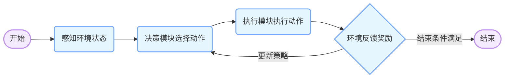

# 构建具有自适应学习能力的AI Agent

> 关键词：自适应学习、AI Agent、强化学习、机器学习、智能体架构、环境交互、模型更新

> 摘要：本文围绕构建具有自适应学习能力的AI Agent展开深入探讨。首先介绍了构建自适应AI Agent的背景，包括目的、预期读者、文档结构和相关术语。接着阐述了核心概念及它们之间的联系，给出了原理和架构的文本示意图与Mermaid流程图。详细讲解了核心算法原理，并用Python代码进行具体操作步骤的阐述，同时给出了相关数学模型和公式。通过项目实战，展示了开发环境搭建、源代码实现及代码解读。分析了实际应用场景，推荐了学习资源、开发工具框架和相关论文著作。最后总结了未来发展趋势与挑战，并提供了常见问题解答和扩展阅读参考资料，旨在为开发者和研究者提供全面且深入的技术指导。

## 1. 背景介绍 
### 1.1 目的和范围
在当今人工智能飞速发展的时代，构建具有自适应学习能力的AI Agent具有重要的现实意义。目的在于使AI Agent能够在不断变化的环境中自主学习、调整策略，以实现最优决策和行为。范围涵盖了从基础的机器学习理论到具体的AI Agent实现，包括算法原理、数学模型、实际应用场景等多个方面。通过本文的研究，希望能够为开发者提供一套完整的构建自适应AI Agent的方法和思路。

### 1.2 预期读者
本文预期读者主要包括人工智能领域的研究者、开发者、程序员，以及对AI Agent技术感兴趣的爱好者。对于有一定机器学习基础的读者，能够帮助他们深入理解自适应学习的原理和实现；对于初学者，也可以作为入门指南，引导他们逐步掌握构建自适应AI Agent的关键技术。

### 1.3 文档结构概述
本文将按照以下结构进行阐述：首先介绍相关背景知识，包括目的、读者和文档结构；接着讲解核心概念及联系，通过文本示意图和Mermaid流程图进行清晰展示；然后详细分析核心算法原理和具体操作步骤，并用Python代码实现；给出相关数学模型和公式，并举例说明；通过项目实战展示代码的实际应用和详细解释；分析实际应用场景；推荐学习资源、开发工具框架和相关论文著作；最后总结未来发展趋势与挑战，提供常见问题解答和扩展阅读参考资料。

### 1.4 术语表
#### 1.4.1 核心术语定义
- **AI Agent（人工智能智能体）**：是一个能够感知环境、做出决策并执行动作的实体，它可以是软件程序、机器人等。
- **自适应学习**：指AI Agent能够根据环境的变化自动调整自己的学习策略和行为模式，以适应新的情况。
- **强化学习**：是一种机器学习方法，通过智能体与环境进行交互，根据环境反馈的奖励信号来学习最优策略。

#### 1.4.2 相关概念解释
- **环境**：是AI Agent所处的外部世界，它可以提供状态信息，并对智能体的动作做出响应，给出奖励信号。
- **策略**：是AI Agent在不同状态下选择动作的规则，它决定了智能体的行为方式。
- **状态**：是环境在某一时刻的描述，智能体根据当前状态来选择合适的动作。

#### 1.4.3 缩略词列表
- **RL（Reinforcement Learning）**：强化学习
- **Q - learning**：一种基于值函数的强化学习算法

## 2. 核心概念与联系 
### 核心概念原理
自适应学习的AI Agent核心在于能够根据环境的动态变化不断调整自身的学习和决策过程。其基本原理基于机器学习中的反馈机制，通过与环境的交互获取信息，评估自身行为的效果，并根据评估结果更新学习策略和决策模型。

AI Agent主要由感知模块、决策模块和执行模块组成。感知模块负责从环境中获取状态信息，决策模块根据感知到的状态选择合适的动作，执行模块将决策结果转化为实际动作作用于环境。环境会根据智能体的动作给出相应的奖励信号，智能体根据奖励信号调整自己的策略，以最大化长期累积奖励。

### 架构的文本示意图
```plaintext
            +----------------+
            |    环境         |
            +----------------+
                  ^     |
                  |     v
            +----------------+
            |   感知模块     |
            +----------------+
                  |
                  v
            +----------------+
            |   决策模块     |
            +----------------+
                  |
                  v
            +----------------+
            |   执行模块     |
            +----------------+
                  |
                  v
            +----------------+
            |    环境         |
            +----------------+
```

### Mermaid流程图


## 3. 核心算法原理 & 具体操作步骤 
### 核心算法原理
在构建具有自适应学习能力的AI Agent中，强化学习是一种常用的方法，其中Q - learning算法是一种经典的基于值函数的强化学习算法。

Q - learning算法的核心思想是学习一个Q值函数 $Q(s, a)$，它表示在状态 $s$ 下采取动作 $a$ 的预期累积奖励。智能体通过不断与环境交互，根据环境反馈的奖励来更新Q值函数，最终找到最优策略。

### 具体操作步骤及Python代码实现
```python
import numpy as np

# 定义环境参数
num_states = 5
num_actions = 2
gamma = 0.9  # 折扣因子
alpha = 0.1  # 学习率

# 初始化Q值表
Q = np.zeros((num_states, num_actions))

# 定义环境交互函数
def get_reward(state, action):
    # 这里简单示例，根据状态和动作返回奖励
    if state == 2 and action == 1:
        return 1
    return 0

# 定义状态转移函数
def next_state(state, action):
    # 简单示例，状态转移规则
    if action == 0:
        return (state + 1) % num_states
    else:
        return (state - 1) % num_states

# Q - learning算法
def q_learning(num_episodes):
    for episode in range(num_episodes):
        state = np.random.randint(0, num_states)  # 随机初始化状态
        done = False
        while not done:
            # 选择动作（这里使用epsilon - greedy策略）
            epsilon = 0.1
            if np.random.uniform(0, 1) < epsilon:
                action = np.random.randint(0, num_actions)
            else:
                action = np.argmax(Q[state, :])

            # 执行动作，获取奖励和下一个状态
            reward = get_reward(state, action)
            next_state_val = next_state(state, action)

            # 更新Q值
            max_Q_next = np.max(Q[next_state_val, :])
            Q[state, action] = Q[state, action] + alpha * (reward + gamma * max_Q_next - Q[state, action])

            # 判断是否结束
            if reward == 1:
                done = True
            state = next_state_val

    return Q

# 运行Q - learning算法
num_episodes = 1000
final_Q = q_learning(num_episodes)
print("Final Q - table:")
print(final_Q)
```
### 代码解释
1. **环境参数定义**：定义了状态数量 `num_states`、动作数量 `num_actions`、折扣因子 `gamma` 和学习率 `alpha`。
2. **Q值表初始化**：使用 `np.zeros` 函数初始化Q值表 `Q`。
3. **环境交互函数**：`get_reward` 函数根据状态和动作返回相应的奖励，`next_state` 函数根据当前状态和动作返回下一个状态。
4. **Q - learning算法实现**：在 `q_learning` 函数中，通过多个回合的训练，智能体不断与环境交互，根据epsilon - greedy策略选择动作，更新Q值表，直到达到结束条件。
5. **运行算法**：调用 `q_learning` 函数进行训练，并输出最终的Q值表。

## 4. 数学模型和公式 & 详细讲解 & 举例说明 
### Q - learning算法的数学模型和公式
Q - learning算法的核心更新公式为：
$$Q(s_t, a_t) \leftarrow Q(s_t, a_t) + \alpha \left[ r_{t+1} + \gamma \max_{a} Q(s_{t+1}, a) - Q(s_t, a_t) \right]$$
其中：
- $s_t$ 表示在时间步 $t$ 的状态。
- $a_t$ 表示在时间步 $t$ 采取的动作。
- $r_{t+1}$ 表示在时间步 $t + 1$ 从环境获得的奖励。
- $\alpha$ 是学习率，控制每次更新的步长。
- $\gamma$ 是折扣因子，用于权衡即时奖励和未来奖励。
- $\max_{a} Q(s_{t+1}, a)$ 表示在状态 $s_{t+1}$ 下所有可能动作的最大Q值。

### 详细讲解
这个公式的含义是，智能体在状态 $s_t$ 采取动作 $a_t$ 后，根据环境反馈的奖励 $r_{t+1}$ 和下一个状态 $s_{t+1}$ 的最大Q值，对当前的Q值 $Q(s_t, a_t)$ 进行更新。学习率 $\alpha$ 决定了新的经验对Q值更新的影响程度，折扣因子 $\gamma$ 表示未来奖励的重要性。

### 举例说明
假设智能体处于状态 $s_1$，选择动作 $a_1$，获得奖励 $r_2 = 1$，进入下一个状态 $s_2$。已知 $Q(s_1, a_1) = 0.2$，$\max_{a} Q(s_2, a) = 0.5$，$\alpha = 0.1$，$\gamma = 0.9$。

根据Q - learning更新公式：
$$Q(s_1, a_1) = 0.2 + 0.1\times(1 + 0.9\times0.5 - 0.2)$$
$$Q(s_1, a_1) = 0.2 + 0.1\times(1 + 0.45 - 0.2)$$
$$Q(s_1, a_1) = 0.2 + 0.1\times1.25$$
$$Q(s_1, a_1) = 0.2 + 0.125 = 0.325$$

经过这次更新，$Q(s_1, a_1)$ 的值从 $0.2$ 变为 $0.325$。

## 5. 项目实战：代码实际案例和详细解释说明 
### 5.1  开发环境搭建
#### 安装Python
首先需要安装Python环境，建议使用Python 3.7及以上版本。可以从Python官方网站（https://www.python.org/downloads/）下载安装包，按照安装向导进行安装。

#### 安装必要的库
在项目中，我们使用了 `numpy` 库，用于数值计算。可以使用以下命令进行安装：
```sh
pip install numpy
```

### 5.2  源代码详细实现和代码解读
```python
import numpy as np

# 定义环境参数
num_states = 5
num_actions = 2
gamma = 0.9  # 折扣因子
alpha = 0.1  # 学习率

# 初始化Q值表
Q = np.zeros((num_states, num_actions))

# 定义环境交互函数
def get_reward(state, action):
    # 这里简单示例，根据状态和动作返回奖励
    if state == 2 and action == 1:
        return 1
    return 0

# 定义状态转移函数
def next_state(state, action):
    # 简单示例，状态转移规则
    if action == 0:
        return (state + 1) % num_states
    else:
        return (state - 1) % num_states

# Q - learning算法
def q_learning(num_episodes):
    for episode in range(num_episodes):
        state = np.random.randint(0, num_states)  # 随机初始化状态
        done = False
        while not done:
            # 选择动作（这里使用epsilon - greedy策略）
            epsilon = 0.1
            if np.random.uniform(0, 1) < epsilon:
                action = np.random.randint(0, num_actions)
            else:
                action = np.argmax(Q[state, :])

            # 执行动作，获取奖励和下一个状态
            reward = get_reward(state, action)
            next_state_val = next_state(state, action)

            # 更新Q值
            max_Q_next = np.max(Q[next_state_val, :])
            Q[state, action] = Q[state, action] + alpha * (reward + gamma * max_Q_next - Q[state, action])

            # 判断是否结束
            if reward == 1:
                done = True
            state = next_state_val

    return Q

# 运行Q - learning算法
num_episodes = 1000
final_Q = q_learning(num_episodes)
print("Final Q - table:")
print(final_Q)
```
### 代码解读与分析
#### 全局变量和初始化
- `num_states` 和 `num_actions` 定义了环境的状态数量和动作数量。
- `gamma` 是折扣因子，用于权衡即时奖励和未来奖励。
- `alpha` 是学习率，控制Q值更新的步长。
- `Q` 是Q值表，初始化为全零矩阵。

#### 环境交互函数
- `get_reward` 函数根据当前状态和动作返回相应的奖励。在这个示例中，当状态为2且动作 为1时，返回奖励1，否则返回0。
- `next_state` 函数根据当前状态和动作计算下一个状态。动作0表示状态加1，动作1表示状态减1，使用取模运算确保状态在有效范围内。

#### Q - learning算法实现
- `q_learning` 函数实现了Q - learning算法的核心逻辑。
- 在每个回合中，随机初始化状态，然后进入循环，直到满足结束条件。
- 使用epsilon - greedy策略选择动作，以一定概率随机选择动作，以探索新的策略，否则选择Q值最大的动作。
- 执行动作后，获取奖励和下一个状态，并根据Q - learning更新公式更新Q值。
- 如果获得奖励为1，则认为回合结束。

#### 运行算法
调用 `q_learning` 函数进行1000个回合的训练，并输出最终的Q值表。

## 6. 实际应用场景 
### 游戏领域
在电子游戏中，具有自适应学习能力的AI Agent可以作为游戏对手。例如在围棋、象棋等策略游戏中，AI Agent可以通过不断与人类玩家或其他AI对手对战，学习不同的策略和战术，逐渐提高自己的游戏水平。在动作游戏中，AI Agent可以根据玩家的操作习惯和游戏场景的变化，实时调整自己的攻击和防御策略。

### 机器人领域
在机器人控制中，自适应AI Agent可以使机器人更好地适应不同的环境。例如，在物流仓库中，机器人需要在复杂的环境中完成货物搬运任务。AI Agent可以根据仓库的布局、货物的分布和其他机器人的运行情况，自主规划路径，避免碰撞，提高工作效率。在服务机器人领域，AI Agent可以根据用户的需求和反馈，不断学习和改进服务质量。

### 金融领域
在金融投资中，AI Agent可以根据市场的动态变化，自适应地调整投资策略。通过分析历史数据、实时市场信息和宏观经济指标，AI Agent可以预测股票、期货等金融产品的价格走势，选择最优的投资组合，降低风险，提高收益。

### 智能交通领域
在智能交通系统中，AI Agent可以用于交通流量控制和自动驾驶。例如，交通信号灯的控制可以根据实时交通流量进行自适应调整，以优化交通流畅性。在自动驾驶汽车中，AI Agent可以感知周围环境，根据路况、交通规则和其他车辆的行为，做出实时决策，确保行车安全。

## 7. 工具和资源推荐
### 7.1 学习资源推荐
#### 7.1.1 书籍推荐
- 《强化学习：原理与Python实现》：这本书详细介绍了强化学习的基本原理和算法，通过Python代码实现了多个实际案例，适合初学者入门。
- 《人工智能：一种现代的方法》：这是一本经典的人工智能教材，涵盖了人工智能的各个领域，包括机器学习、搜索算法、知识表示等，对理解AI Agent的相关知识有很大帮助。
- 《深度学习》：由Ian Goodfellow、Yoshua Bengio和Aaron Courville撰写，全面介绍了深度学习的理论和实践，对于深入理解AI Agent中的神经网络模型有重要参考价值。

#### 7.1.2 在线课程
- Coursera上的“强化学习专项课程”：由DeepMind的专家授课，系统地介绍了强化学习的理论和应用，通过编程作业和实践项目帮助学员掌握相关知识。
- edX上的“人工智能基础”：该课程涵盖了人工智能的基本概念、算法和应用，对AI Agent的构建有一定的指导作用。
- 吴恩达的“深度学习专项课程”：在Coursera平台上，详细讲解了深度学习的各个方面，包括神经网络、卷积神经网络、循环神经网络等，为AI Agent的开发提供了强大的技术支持。

#### 7.1.3 技术博客和网站
- Medium：上面有很多关于人工智能和强化学习的优质文章，作者来自不同的领域和背景，分享了他们的研究成果和实践经验。
- Towards Data Science：专注于数据科学和人工智能领域，提供了大量的技术文章、教程和案例分析，对学习AI Agent有很大帮助。
- OpenAI博客：OpenAI是人工智能领域的领先研究机构，其博客上发布了许多关于最新研究成果和技术进展的文章，值得关注。

### 7.2 开发工具框架推荐
#### 7.2.1 IDE和编辑器
- PyCharm：是一款专业的Python集成开发环境，具有强大的代码编辑、调试和项目管理功能，适合开发Python代码实现的AI Agent。
- Jupyter Notebook：以交互式的方式编写和运行代码，方便进行数据探索、模型实验和结果展示，是机器学习和深度学习开发的常用工具。
- Visual Studio Code：轻量级的代码编辑器，支持多种编程语言和插件扩展，具有丰富的代码提示和调试功能，可用于AI Agent的开发。

#### 7.2.2 调试和性能分析工具
- TensorBoard：是TensorFlow的可视化工具，可用于监控训练过程中的各种指标，如损失函数、准确率等，帮助开发者调试和优化模型。
- Py-Spy：是一个用于Python代码性能分析的工具，可以分析代码的运行时间、函数调用次数等，找出性能瓶颈。
- cProfile：Python标准库中的性能分析模块，可以统计代码中各个函数的执行时间和调用次数，帮助开发者优化代码性能。

#### 7.2.3 相关框架和库
- TensorFlow：是一个开源的机器学习框架，提供了丰富的工具和库，可用于构建和训练各种深度学习模型，包括用于AI Agent的神经网络模型。
- PyTorch：另一个流行的深度学习框架，具有动态图机制，易于使用和调试，广泛应用于学术研究和工业开发中。
- OpenAI Gym：是一个用于开发和比较强化学习算法的工具包，提供了多种环境和任务，方便开发者测试和验证AI Agent的性能。

### 7.3 相关论文著作推荐
#### 7.3.1 经典论文
- “Q - learning” by Watkins and Dayan：这是Q - learning算法的经典论文，详细介绍了Q - learning的原理和算法实现，是强化学习领域的重要基础文献。
- “Playing Atari with Deep Reinforcement Learning” by Mnih et al.：提出了深度Q网络（DQN）算法，将深度学习与强化学习相结合，在Atari游戏中取得了很好的效果，开创了深度强化学习的先河。
- “Asynchronous Methods for Deep Reinforcement Learning” by Mnih et al.：提出了异步优势演员 - 评论家（A3C）算法，通过异步训练的方式提高了强化学习的训练效率和稳定性。

#### 7.3.2 最新研究成果
- 关注顶级学术会议如NeurIPS（神经信息处理系统大会）、ICML（国际机器学习会议）、AAAI（美国人工智能协会会议）上的最新研究论文，了解强化学习和AI Agent领域的最新技术和方法。
- 查阅知名学术期刊如Journal of Artificial Intelligence Research（JAIR）、Artificial Intelligence等上的相关研究成果。

#### 7.3.3 应用案例分析
- 一些知名企业和研究机构会发布关于AI Agent应用的案例分析报告，如Google DeepMind在游戏、医疗等领域的应用案例，以及特斯拉在自动驾驶领域的实践经验。这些案例分析可以帮助开发者了解如何将理论知识应用到实际项目中。

## 8. 总结：未来发展趋势与挑战
### 未来发展趋势
#### 多智能体协作
未来的AI Agent将更多地参与到多智能体系统中，通过与其他智能体的协作完成复杂的任务。例如，在智能交通系统中，多个自动驾驶汽车之间需要进行协作，以实现高效的交通流量控制；在工业生产中，多个机器人需要协同工作，完成生产线的任务。

#### 结合知识图谱
将知识图谱与AI Agent相结合，可以为智能体提供更丰富的背景知识和语义信息。知识图谱可以帮助智能体更好地理解环境和任务，提高决策的准确性和可解释性。例如，在智能客服系统中，结合知识图谱可以使智能体更好地回答用户的问题。

#### 迁移学习和元学习
迁移学习和元学习可以使AI Agent更快地适应新的环境和任务。通过将在一个任务上学习到的知识迁移到另一个相关任务中，或者学习如何快速学习新任务，智能体可以减少训练时间和数据需求，提高学习效率。

### 挑战
#### 计算资源需求
随着AI Agent的复杂度不断增加，对计算资源的需求也越来越大。特别是在深度强化学习中，训练大规模的神经网络需要大量的计算能力和存储空间。如何在有限的计算资源下实现高效的训练和推理是一个挑战。

#### 可解释性和可靠性
AI Agent的决策过程往往是基于复杂的神经网络模型，缺乏可解释性。在一些关键应用领域，如医疗、金融等，需要智能体能够解释其决策的依据，以确保决策的可靠性和安全性。如何提高AI Agent的可解释性是当前研究的热点问题。

#### 环境适应性
现实世界的环境是复杂多变的，AI Agent需要具备更强的环境适应性。例如，在不同的光照、温度、湿度等条件下，智能体的感知和决策能力可能会受到影响。如何使智能体在各种复杂环境中都能稳定运行是一个挑战。

## 9. 附录：常见问题与解答
### 问题1：什么是自适应学习？
自适应学习是指AI Agent能够根据环境的变化自动调整自己的学习策略和行为模式，以适应新的情况。通过与环境的交互，智能体可以获取反馈信息，根据这些信息更新自己的模型和策略，从而在不同的环境中都能实现最优决策和行为。

### 问题2：Q - learning算法有什么优缺点？
#### 优点
- 不需要环境的模型信息，只需要通过与环境的交互获取奖励和状态信息，即可进行学习。
- 算法简单易懂，实现相对容易。
- 可以收敛到最优策略，在一定条件下能够找到全局最优解。

#### 缺点
- 对于高维状态空间和动作空间，Q值表的规模会非常大，导致计算复杂度和存储复杂度很高。
- 学习速度较慢，需要大量的交互数据才能收敛到较好的策略。

### 问题3：如何选择合适的学习率和折扣因子？
学习率 $\alpha$ 和折扣因子 $\gamma$ 是Q - learning算法中的重要参数，它们的选择会影响算法的收敛速度和性能。

- 学习率 $\alpha$：一般来说，学习率不宜过大，否则会导致算法不稳定，难以收敛；也不宜过小，否则学习速度会很慢。通常可以从一个较大的值开始，随着训练的进行逐渐减小学习率。
- 折扣因子 $\gamma$：折扣因子表示未来奖励的重要性。如果 $\gamma$ 接近1，智能体更注重未来的长期奖励；如果 $\gamma$ 接近0，智能体更关注即时奖励。可以根据具体的任务需求选择合适的折扣因子。

### 问题4：如何提高AI Agent的环境适应性？
- **数据增强**：在训练过程中，使用数据增强技术可以增加训练数据的多样性，使智能体能够学习到更多不同环境下的特征和模式。
- **元学习**：通过元学习方法，智能体可以学习如何快速适应新的环境和任务，减少在新环境中的训练时间。
- **多模态感知**：使用多种传感器进行环境感知，如视觉、听觉、触觉等，可以获取更全面的环境信息，提高智能体的环境适应性。

## 10. 扩展阅读 & 参考资料
### 扩展阅读
- 《强化学习精要：核心算法与TensorFlow实现》：深入介绍了强化学习的核心算法，并使用TensorFlow进行实现，适合对强化学习有一定基础的读者进一步学习。
- 《AI 3.0》：探讨了人工智能的发展现状和未来趋势，对理解AI Agent在人工智能领域的地位和作用有一定的帮助。

### 参考资料
- Sutton, R. S., & Barto, A. G. (2018). Reinforcement learning: An introduction. MIT press.
- Mnih, V., Kavukcuoglu, K., Silver, D., Rusu, A. A., Veness, J., Bellemare, M. G.,... & Petersen, S. (2015). Human - level control through deep reinforcement learning. Nature, 518(7540), 529 - 533.
- OpenAI Gym官方文档：https://gym.openai.com/docs/
- TensorFlow官方文档：https://www.tensorflow.org/api_docs

作者：AI天才研究院/AI Genius Institute & 禅与计算机程序设计艺术 /Zen And The Art of Computer Programming