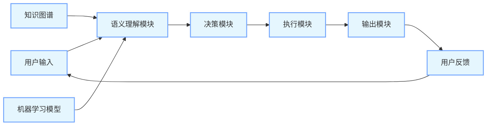

# 构建具有语义理解能力的AI Agent

> 关键词：AI Agent、语义理解、自然语言处理、机器学习、深度学习、知识图谱、对话系统

> 摘要：本文聚焦于构建具有语义理解能力的AI Agent这一核心主题。旨在详细阐述语义理解在AI Agent中的重要性，深入剖析其涉及的核心概念、算法原理、数学模型等方面内容。通过项目实战，展示如何搭建开发环境、实现源代码并进行代码解读。同时，探讨其实际应用场景，推荐相关的学习资源、开发工具和论文著作。最后，总结未来发展趋势与挑战，并给出常见问题的解答和扩展阅读参考资料，为读者全面呈现构建具有语义理解能力的AI Agent的技术全貌。

## 1. 背景介绍 
### 1.1 目的和范围
随着人工智能技术的飞速发展，AI Agent在各个领域的应用越来越广泛。具有语义理解能力的AI Agent能够更好地理解人类的语言和意图，从而提供更加智能、高效、个性化的服务。本文的目的在于深入探讨如何构建这样的AI Agent，涵盖从基础概念、算法原理到实际项目开发的全过程。具体范围包括语义理解的核心概念、相关算法的原理和实现、数学模型的建立与分析、实际应用场景的介绍以及相关工具和资源的推荐等。

### 1.2 预期读者
本文预期读者主要包括人工智能领域的开发者、研究人员，以及对自然语言处理和AI Agent技术感兴趣的爱好者。对于正在从事相关项目开发的专业人士，本文可以提供深入的技术指导和实践经验；对于初学者，能够帮助他们系统地了解构建具有语义理解能力的AI Agent的基本知识和方法。

### 1.3 文档结构概述
本文将按照以下结构进行组织：首先介绍核心概念与联系，包括语义理解、AI Agent等相关概念的原理和架构；接着阐述核心算法原理及具体操作步骤，并使用Python源代码详细说明；然后介绍数学模型和公式，结合具体例子进行讲解；通过项目实战展示代码的实际案例和详细解释；分析实际应用场景；推荐相关的工具和资源；总结未来发展趋势与挑战；提供常见问题的解答和扩展阅读参考资料。

### 1.4 术语表
#### 1.4.1 核心术语定义
- **AI Agent**：是一种能够感知环境、进行决策并采取行动以实现特定目标的软件实体。它可以与用户进行交互，执行各种任务。
- **语义理解**：指计算机对人类语言的含义进行理解和解释的能力，包括识别词语的语义、句子的结构和意图等。
- **自然语言处理（NLP）**：是一门研究如何让计算机处理和理解人类自然语言的学科，是实现语义理解的重要技术手段。
- **机器学习**：是一门多领域交叉学科，涉及概率论、统计学、逼近论、凸分析、算法复杂度理论等多门学科。它专门研究计算机怎样模拟或实现人类的学习行为，以获取新的知识或技能，重新组织已有的知识结构使之不断改善自身的性能。
- **深度学习**：是机器学习的一个分支领域，它是一种基于对数据进行表征学习的方法。深度学习通过构建具有很多层的神经网络模型，自动从大量数据中学习特征和模式。
- **知识图谱**：是一种语义网络，它以图的形式表示实体及其之间的关系，用于存储和管理大量的知识，为语义理解提供知识支持。

#### 1.4.2 相关概念解释
- **词向量**：是将词语表示为向量的形式，使得词语在向量空间中具有一定的语义信息。通过词向量，可以计算词语之间的相似度，从而更好地理解词语的语义。
- **意图识别**：是指从用户的输入中识别出其表达的意图，例如查询信息、请求服务、表达情感等。意图识别是语义理解的重要组成部分。
- **实体识别**：是指从文本中识别出具有特定意义的实体，如人名、地名、组织机构名等。实体识别有助于更准确地理解文本的语义。

#### 1.4.3 缩略词列表
- **NLP**：Natural Language Processing（自然语言处理）
- **ML**：Machine Learning（机器学习）
- **DL**：Deep Learning（深度学习）
- **RNN**：Recurrent Neural Network（循环神经网络）
- **LSTM**：Long Short-Term Memory（长短期记忆网络）
- **GRU**：Gated Recurrent Unit（门控循环单元）
- **BERT**：Bidirectional Encoder Representations from Transformers（基于变换器的双向编码器表示）

## 2. 核心概念与联系 

### 2.1 语义理解原理
语义理解的核心目标是让计算机理解人类语言的含义。这涉及到多个层面的处理，包括词汇层面、句法层面和语义层面。

在词汇层面，需要对词语的语义进行分析和表示。例如，通过词向量技术将词语映射到高维向量空间中，使得语义相近的词语在向量空间中距离较近。

在句法层面，需要分析句子的结构，确定词语之间的语法关系。常见的句法分析方法包括依存句法分析和成分句法分析。

在语义层面，需要理解句子所表达的意图和信息。这可以通过意图识别、实体识别等技术来实现。

### 2.2 AI Agent架构
一个典型的具有语义理解能力的AI Agent通常包括以下几个模块：

- **输入模块**：负责接收用户的输入，如语音或文本。
- **语义理解模块**：对用户输入进行语义分析，识别意图、实体等信息。
- **决策模块**：根据语义理解的结果，制定相应的决策和行动计划。
- **执行模块**：执行决策模块制定的行动计划，与外部环境进行交互。
- **输出模块**：将执行结果反馈给用户，如语音回答或文本回复。

### 2.3 核心概念联系示意图


该流程图展示了具有语义理解能力的AI Agent的工作流程。用户输入首先进入语义理解模块，该模块借助知识图谱和机器学习模型进行语义分析。分析结果传递给决策模块，决策模块制定行动计划并由执行模块执行。执行结果通过输出模块反馈给用户，用户的反馈又可以作为新的输入进入系统，形成一个闭环。

## 3. 核心算法原理 & 具体操作步骤 

### 3.1 词向量算法：Word2Vec
#### 3.1.1 算法原理
Word2Vec是一种用于学习词向量的算法，它基于神经网络模型。其核心思想是通过上下文来预测目标词，或者通过目标词来预测上下文。Word2Vec主要有两种模型：CBOW（Continuous Bag-of-Words）和Skip-gram。

- **CBOW模型**：通过上下文词语的词向量来预测目标词。具体来说，对于一个给定的上下文窗口，将上下文词语的词向量相加或平均，然后通过一个线性变换和softmax函数来预测目标词的概率分布。

- **Skip-gram模型**：通过目标词的词向量来预测上下文词语。与CBOW模型相反，Skip-gram模型以目标词为输入，预测其上下文窗口内的词语。

#### 3.1.2 Python代码实现
```python
from gensim.models import Word2Vec
import numpy as np

# 示例文本数据
sentences = [["I", "love", "natural", "language", "processing"],
             ["AI", "is", "the", "future"],
             ["Machine", "learning", "is", "amazing"]]

# 训练Word2Vec模型
model = Word2Vec(sentences, min_count=1)

# 获取词语的词向量
word_vector = model.wv['language']
print("词向量维度:", word_vector.shape)
print("'language'的词向量:", word_vector)

# 查找最相似的词语
similar_words = model.wv.most_similar('language')
print("与'language'最相似的词语:", similar_words)
```
#### 3.1.3 代码解释
首先，我们导入了`Word2Vec`模型和`numpy`库。然后，定义了一个示例文本数据集`sentences`。接着，使用`Word2Vec`模型对数据进行训练，设置`min_count=1`表示只考虑出现次数不少于1次的词语。训练完成后，我们可以通过`model.wv`来获取词语的词向量，使用`most_similar`方法查找与指定词语最相似的词语。

### 3.2 意图识别算法：基于深度学习的分类模型
#### 3.2.1 算法原理
意图识别可以看作是一个文本分类问题，即将用户输入的文本分类到不同的意图类别中。基于深度学习的分类模型通常使用神经网络，如卷积神经网络（CNN）、循环神经网络（RNN）及其变体（LSTM、GRU）等。

以LSTM为例，LSTM是一种特殊的RNN，它能够处理长序列数据，并解决传统RNN中的梯度消失问题。LSTM通过门控机制来控制信息的流动，包括输入门、遗忘门和输出门。

#### 3.2.2 Python代码实现
```python
import numpy as np
from tensorflow.keras.preprocessing.text import Tokenizer
from tensorflow.keras.preprocessing.sequence import pad_sequences
from tensorflow.keras.models import Sequential
from tensorflow.keras.layers import Embedding, LSTM, Dense

# 示例数据
texts = ["查询天气", "预订酒店", "播放音乐"]
labels = [0, 1, 2]

# 分词
tokenizer = Tokenizer()
tokenizer.fit_on_texts(texts)
sequences = tokenizer.texts_to_sequences(texts)

# 填充序列
max_length = max([len(seq) for seq in sequences])
padded_sequences = pad_sequences(sequences, maxlen=max_length)

# 构建模型
model = Sequential()
model.add(Embedding(input_dim=len(tokenizer.word_index) + 1, output_dim=100, input_length=max_length))
model.add(LSTM(100))
model.add(Dense(3, activation='softmax'))

# 编译模型
model.compile(loss='sparse_categorical_crossentropy', optimizer='adam', metrics=['accuracy'])

# 训练模型
model.fit(padded_sequences, np.array(labels), epochs=10, batch_size=1)

# 预测
new_text = ["查询天气"]
new_sequence = tokenizer.texts_to_sequences(new_text)
new_padded_sequence = pad_sequences(new_sequence, maxlen=max_length)
prediction = model.predict(new_padded_sequence)
predicted_label = np.argmax(prediction)
print("预测的意图标签:", predicted_label)
```
#### 3.2.3 代码解释
首先，我们定义了示例文本数据`texts`和对应的意图标签`labels`。然后，使用`Tokenizer`对文本进行分词，并将文本转换为序列。接着，使用`pad_sequences`对序列进行填充，使所有序列具有相同的长度。

构建模型时，我们使用了`Sequential`模型，添加了一个嵌入层`Embedding`将词语转换为词向量，一个LSTM层进行序列处理，最后添加一个全连接层`Dense`进行分类。编译模型时，使用`sparse_categorical_crossentropy`作为损失函数，`adam`作为优化器。

训练模型后，我们可以使用训练好的模型对新的文本进行预测，将预测结果转换为意图标签。

## 4. 数学模型和公式 & 详细讲解 & 举例说明 

### 4.1 Word2Vec数学模型
#### 4.1.1 CBOW模型
在CBOW模型中，给定一个上下文窗口 $C = \{w_{t - m}, \cdots, w_{t - 1}, w_{t + 1}, \cdots, w_{t + m}\}$，目标是预测中心词 $w_t$。设词向量矩阵为 $W \in \mathbb{R}^{V \times d}$，其中 $V$ 是词汇表的大小，$d$ 是词向量的维度。

首先，将上下文词语的词向量相加或平均：
$$\mathbf{h} = \frac{1}{|C|} \sum_{w_i \in C} \mathbf{W}_{w_i}$$
其中，$\mathbf{W}_{w_i}$ 是词语 $w_i$ 的词向量。

然后，通过一个线性变换和softmax函数来计算目标词的概率分布：
$$\mathbf{u} = \mathbf{W}' \mathbf{h}$$
$$P(w_t | C) = \frac{\exp(\mathbf{u}_{w_t})}{\sum_{w = 1}^{V} \exp(\mathbf{u}_w)}$$
其中，$\mathbf{W}' \in \mathbb{R}^{V \times d}$ 是另一个词向量矩阵，$\mathbf{u}_{w_t}$ 是 $\mathbf{u}$ 中对应于目标词 $w_t$ 的元素。

#### 4.1.2 Skip-gram模型
在Skip-gram模型中，给定一个中心词 $w_t$，目标是预测上下文词语 $w_{t - m}, \cdots, w_{t - 1}, w_{t + 1}, \cdots, w_{t + m}$。设词向量矩阵为 $W \in \mathbb{R}^{V \times d}$。

首先，获取中心词的词向量 $\mathbf{v}_{w_t} = \mathbf{W}_{w_t}$。

然后，对于每个上下文词语 $w_j$，计算其概率分布：
$$P(w_j | w_t) = \frac{\exp(\mathbf{v}_{w_j}'^T \mathbf{v}_{w_t})}{\sum_{w = 1}^{V} \exp(\mathbf{v}_{w}'^T \mathbf{v}_{w_t})}$$
其中，$\mathbf{v}_{w_j}'$ 是上下文词语 $w_j$ 的词向量。

### 4.1.3 举例说明
假设词汇表 $V = \{apple, banana, cherry\}$，词向量维度 $d = 2$。词向量矩阵 $W$ 如下：
$$W = \begin{bmatrix}
0.1 & 0.2 \\
0.3 & 0.4 \\
0.5 & 0.6
\end{bmatrix}$$
对于CBOW模型，假设上下文窗口 $C = \{apple, cherry\}$，则：
$$\mathbf{h} = \frac{1}{2} \left( \begin{bmatrix} 0.1 \\ 0.2 \end{bmatrix} + \begin{bmatrix} 0.5 \\ 0.6 \end{bmatrix} \right) = \begin{bmatrix} 0.3 \\ 0.4 \end{bmatrix}$$

假设另一个词向量矩阵 $\mathbf{W}'$ 为：
$$\mathbf{W}' = \begin{bmatrix}
0.2 & 0.3 \\
0.4 & 0.5 \\
0.6 & 0.7
\end{bmatrix}$$
则：
$$\mathbf{u} = \mathbf{W}' \mathbf{h} = \begin{bmatrix}
0.2 & 0.3 \\
0.4 & 0.5 \\
0.6 & 0.7
\end{bmatrix} \begin{bmatrix} 0.3 \\ 0.4 \end{bmatrix} = \begin{bmatrix} 0.18 \\ 0.32 \\ 0.46 \end{bmatrix}$$
计算目标词的概率分布：
$$P(apple | C) = \frac{\exp(0.18)}{\exp(0.18) + \exp(0.32) + \exp(0.46)} \approx 0.25$$
$$P(banana | C) = \frac{\exp(0.32)}{\exp(0.18) + \exp(0.32) + \exp(0.46)} \approx 0.33$$
$$P(cherry | C) = \frac{\exp(0.46)}{\exp(0.18) + \exp(0.32) + \exp(0.46)} \approx 0.42$$

### 4.2 基于LSTM的意图识别数学模型
#### 4.2.1 LSTM单元结构
LSTM单元由输入门 $i_t$、遗忘门 $f_t$、输出门 $o_t$ 和细胞状态 $C_t$ 组成。其计算公式如下：

$$i_t = \sigma(\mathbf{W}_{ii} \mathbf{x}_t + \mathbf{W}_{hi} \mathbf{h}_{t - 1} + \mathbf{b}_i)$$
$$f_t = \sigma(\mathbf{W}_{if} \mathbf{x}_t + \mathbf{W}_{hf} \mathbf{h}_{t - 1} + \mathbf{b}_f)$$
$$\tilde{C}_t = \tanh(\mathbf{W}_{ic} \mathbf{x}_t + \mathbf{W}_{hc} \mathbf{h}_{t - 1} + \mathbf{b}_c)$$
$$C_t = f_t \odot C_{t - 1} + i_t \odot \tilde{C}_t$$
$$o_t = \sigma(\mathbf{W}_{io} \mathbf{x}_t + \mathbf{W}_{ho} \mathbf{h}_{t - 1} + \mathbf{b}_o)$$
$$\mathbf{h}_t = o_t \odot \tanh(C_t)$$

其中，$\mathbf{x}_t$ 是输入向量，$\mathbf{h}_{t - 1}$ 是上一时刻的隐藏状态，$\mathbf{W}$ 是权重矩阵，$\mathbf{b}$ 是偏置向量，$\sigma$ 是sigmoid函数，$\tanh$ 是双曲正切函数，$\odot$ 表示逐元素相乘。

#### 4.2.2 意图识别模型
在意图识别模型中，输入序列 $\mathbf{X} = [\mathbf{x}_1, \mathbf{x}_2, \cdots, \mathbf{x}_T]$ 通过LSTM层得到隐藏状态序列 $\mathbf{H} = [\mathbf{h}_1, \mathbf{h}_2, \cdots, \mathbf{h}_T]$。通常取最后一个隐藏状态 $\mathbf{h}_T$ 作为整个序列的表示。

然后，通过一个全连接层进行分类：
$$\mathbf{z} = \mathbf{W}_o \mathbf{h}_T + \mathbf{b}_o$$
$$\hat{y} = \text{softmax}(\mathbf{z})$$
其中，$\mathbf{W}_o$ 是输出层的权重矩阵，$\mathbf{b}_o$ 是偏置向量，$\hat{y}$ 是预测的意图概率分布。

#### 4.2.3 举例说明
假设输入序列 $\mathbf{X} = [\mathbf{x}_1, \mathbf{x}_2]$，其中 $\mathbf{x}_1 = \begin{bmatrix} 0.1 \\ 0.2 \end{bmatrix}$，$\mathbf{x}_2 = \begin{bmatrix} 0.3 \\ 0.4 \end{bmatrix}$，LSTM单元的权重矩阵和偏置向量如下：

$$\mathbf{W}_{ii} = \begin{bmatrix} 0.1 & 0.2 \\ 0.3 & 0.4 \end{bmatrix}, \mathbf{W}_{hi} = \begin{bmatrix} 0.5 & 0.6 \\ 0.7 & 0.8 \end{bmatrix}, \mathbf{b}_i = \begin{bmatrix} 0.1 \\ 0.2 \end{bmatrix}$$
$$\mathbf{W}_{if} = \begin{bmatrix} 0.2 & 0.3 \\ 0.4 & 0.5 \end{bmatrix}, \mathbf{W}_{hf} = \begin{bmatrix} 0.6 & 0.7 \\ 0.8 & 0.9 \end{bmatrix}, \mathbf{b}_f = \begin{bmatrix} 0.2 \\ 0.3 \end{bmatrix}$$
$$\mathbf{W}_{ic} = \begin{bmatrix} 0.3 & 0.4 \\ 0.5 & 0.6 \end{bmatrix}, \mathbf{W}_{hc} = \begin{bmatrix} 0.7 & 0.8 \\ 0.9 & 1.0 \end{bmatrix}, \mathbf{b}_c = \begin{bmatrix} 0.3 \\ 0.4 \end{bmatrix}$$
$$\mathbf{W}_{io} = \begin{bmatrix} 0.4 & 0.5 \\ 0.6 & 0.7 \end{bmatrix}, \mathbf{W}_{ho} = \begin{bmatrix} 0.8 & 0.9 \\ 1.0 & 1.1 \end{bmatrix}, \mathbf{b}_o = \begin{bmatrix} 0.4 \\ 0.5 \end{bmatrix}$$

初始隐藏状态 $\mathbf{h}_0 = \begin{bmatrix} 0 \\ 0 \end{bmatrix}$，初始细胞状态 $C_0 = \begin{bmatrix} 0 \\ 0 \end{bmatrix}$。

对于 $t = 1$：
$$i_1 = \sigma(\mathbf{W}_{ii} \mathbf{x}_1 + \mathbf{W}_{hi} \mathbf{h}_0 + \mathbf{b}_i) = \sigma \left( \begin{bmatrix} 0.1 & 0.2 \\ 0.3 & 0.4 \end{bmatrix} \begin{bmatrix} 0.1 \\ 0.2 \end{bmatrix} + \begin{bmatrix} 0.5 & 0.6 \\ 0.7 & 0.8 \end{bmatrix} \begin{bmatrix} 0 \\ 0 \end{bmatrix} + \begin{bmatrix} 0.1 \\ 0.2 \end{bmatrix} \right) \approx \begin{bmatrix} 0.55 \\ 0.65 \end{bmatrix}$$
同理，可以计算出 $f_1$、$\tilde{C}_1$、$C_1$、$o_1$ 和 $\mathbf{h}_1$。

对于 $t = 2$，重复上述计算过程得到 $\mathbf{h}_2$。假设输出层的权重矩阵 $\mathbf{W}_o = \begin{bmatrix} 0.1 & 0.2 \\ 0.3 & 0.4 \end{bmatrix}$，偏置向量 $\mathbf{b}_o = \begin{bmatrix} 0.1 \\ 0.2 \end{bmatrix}$，则：
$$\mathbf{z} = \mathbf{W}_o \mathbf{h}_2 + \mathbf{b}_o$$
$$\hat{y} = \text{softmax}(\mathbf{z})$$

## 5. 项目实战：代码实际案例和详细解释说明 

### 5.1  开发环境搭建
#### 5.1.1 安装Python
首先，确保你已经安装了Python 3.x版本。可以从Python官方网站（https://www.python.org/downloads/）下载并安装适合你操作系统的Python版本。

#### 5.1.2 安装必要的库
使用`pip`命令安装以下必要的库：
```bash
pip install numpy tensorflow gensim
```
- `numpy`：用于数值计算。
- `tensorflow`：用于深度学习模型的构建和训练。
- `gensim`：用于词向量的训练和处理。

### 5.2  源代码详细实现和代码解读
#### 5.2.1 数据准备
```python
import numpy as np

# 示例数据
texts = ["查询天气", "预订酒店", "播放音乐", "查询股票", "查询航班"]
labels = [0, 1, 2, 3, 4]

# 划分训练集和测试集
train_texts = texts[:4]
train_labels = labels[:4]
test_texts = texts[4:]
test_labels = labels[4:]
```
代码解释：首先，定义了示例文本数据`texts`和对应的意图标签`labels`。然后，将数据划分为训练集和测试集，前4条数据作为训练集，最后1条数据作为测试集。

#### 5.2.2 文本预处理
```python
from tensorflow.keras.preprocessing.text import Tokenizer
from tensorflow.keras.preprocessing.sequence import pad_sequences

# 分词
tokenizer = Tokenizer()
tokenizer.fit_on_texts(train_texts)
train_sequences = tokenizer.texts_to_sequences(train_texts)
test_sequences = tokenizer.texts_to_sequences(test_texts)

# 填充序列
max_length = max([len(seq) for seq in train_sequences + test_sequences])
train_padded_sequences = pad_sequences(train_sequences, maxlen=max_length)
test_padded_sequences = pad_sequences(test_sequences, maxlen=max_length)
```
代码解释：使用`Tokenizer`对训练集文本进行分词，并将训练集和测试集文本转换为序列。然后，使用`pad_sequences`对序列进行填充，使所有序列具有相同的长度。

#### 5.2.3 构建模型
```python
from tensorflow.keras.models import Sequential
from tensorflow.keras.layers import Embedding, LSTM, Dense

# 构建模型
model = Sequential()
model.add(Embedding(input_dim=len(tokenizer.word_index) + 1, output_dim=100, input_length=max_length))
model.add(LSTM(100))
model.add(Dense(5, activation='softmax'))

# 编译模型
model.compile(loss='sparse_categorical_crossentropy', optimizer='adam', metrics=['accuracy'])
```
代码解释：使用`Sequential`模型构建一个简单的意图识别模型。添加一个嵌入层将词语转换为词向量，一个LSTM层进行序列处理，最后添加一个全连接层进行分类。编译模型时，使用`sparse_categorical_crossentropy`作为损失函数，`adam`作为优化器。

#### 5.2.4 训练模型
```python
# 训练模型
model.fit(train_padded_sequences, np.array(train_labels), epochs=10, batch_size=1)
```
代码解释：使用训练集数据对模型进行训练，设置训练轮数为10，批量大小为1。

#### 5.2.5 模型评估
```python
# 模型评估
loss, accuracy = model.evaluate(test_padded_sequences, np.array(test_labels))
print("测试集损失:", loss)
print("测试集准确率:", accuracy)
```
代码解释：使用测试集数据对模型进行评估，输出测试集的损失和准确率。

### 5.3  代码解读与分析
- **数据准备**：将数据划分为训练集和测试集是为了评估模型的泛化能力。训练集用于模型的训练，测试集用于评估模型在未见过的数据上的性能。
- **文本预处理**：分词和填充序列是文本数据处理的常见步骤。分词将文本转换为词语序列，填充序列使所有序列具有相同的长度，便于模型处理。
- **模型构建**：嵌入层将词语转换为词向量，LSTM层能够处理序列数据，全连接层进行分类。损失函数和优化器的选择对模型的训练效果有重要影响。
- **训练模型**：通过多次迭代训练集数据，不断调整模型的参数，使模型的损失函数最小化。
- **模型评估**：使用测试集数据评估模型的性能，损失和准确率是常见的评估指标。

## 6. 实际应用场景 
### 6.1 智能客服
在智能客服系统中，具有语义理解能力的AI Agent可以理解用户的问题，识别用户的意图，并提供准确的回答和解决方案。例如，当用户询问“我的订单什么时候能送达”时，AI Agent能够识别出用户的意图是查询订单送达时间，并根据系统中的订单信息进行回复。

### 6.2 智能助手
智能助手如语音助手Siri、小爱同学等，通过语义理解技术理解用户的语音指令，执行相应的任务。例如，用户说“打开音乐播放器”，AI Agent能够识别出用户的意图是打开音乐播放器，并调用相应的应用程序。

### 6.3 信息检索
在信息检索系统中，AI Agent可以理解用户的查询意图，从海量的信息中筛选出相关的内容。例如，用户输入“关于人工智能的最新研究成果”，AI Agent能够根据语义理解技术，在数据库中查找与人工智能最新研究成果相关的文献、新闻等信息。

### 6.4 智能写作
具有语义理解能力的AI Agent可以帮助用户进行智能写作。例如，当用户输入写作主题和要求时，AI Agent能够理解用户的意图，生成相关的文章大纲、段落甚至整篇文章。

### 6.5 情感分析
在社交媒体、电商评论等领域，AI Agent可以通过语义理解技术分析文本中的情感倾向，判断用户是积极、消极还是中立的态度。例如，分析用户对某款产品的评论，了解用户对产品的满意度。

## 7. 工具和资源推荐
### 7.1 学习资源推荐
#### 7.1.1 书籍推荐
- 《自然语言处理入门》：由何晗编写，适合初学者，系统地介绍了自然语言处理的基本概念、方法和技术。
- 《深度学习》：由Ian Goodfellow、Yoshua Bengio和Aaron Courville编写，是深度学习领域的经典教材，涵盖了深度学习的基本原理、模型和应用。
- 《Python自然语言处理》：由Steven Bird、Ewan Klein和Edward Loper编写，介绍了如何使用Python进行自然语言处理，包含大量的实例代码。

#### 7.1.2 在线课程
- Coursera上的“Natural Language Processing Specialization”：由斯坦福大学的教授授课，系统地介绍了自然语言处理的各个方面，包括词向量、文本分类、机器翻译等。
- edX上的“Deep Learning for Natural Language Processing”：深入讲解了深度学习在自然语言处理中的应用，包括神经网络、循环神经网络、变换器等模型。
- 中国大学MOOC上的“自然语言处理”：国内高校的课程，结合了理论和实践，适合国内学习者。

#### 7.1.3 技术博客和网站
- 机器之心：提供人工智能领域的最新技术动态、研究成果和应用案例。
- 新智元：专注于人工智能的前沿技术和产业发展，有很多深度的分析文章。
- Medium上的“Towards Data Science”：有很多关于数据科学、机器学习和自然语言处理的优秀文章。

### 7.2 开发工具框架推荐
#### 7.2.1 IDE和编辑器
- PyCharm：是一款专门为Python开发设计的集成开发环境，具有代码编辑、调试、版本控制等功能。
- Jupyter Notebook：是一个交互式的开发环境，适合进行数据分析、模型实验和代码演示。
- Visual Studio Code：是一款轻量级的代码编辑器，支持多种编程语言，有丰富的插件生态系统。

#### 7.2.2 调试和性能分析工具
- TensorBoard：是TensorFlow的可视化工具，可以用于查看模型的训练过程、损失曲线、准确率等信息。
- Py-Spy：是一个用于分析Python程序性能的工具，可以查看程序的CPU使用率、函数调用时间等信息。
- cProfile：是Python内置的性能分析工具，可以统计程序中各个函数的调用次数和执行时间。

#### 7.2.3 相关框架和库
- TensorFlow：是一个开源的深度学习框架，提供了丰富的工具和函数，用于构建和训练各种深度学习模型。
- PyTorch：是另一个流行的深度学习框架，具有动态图的特点，易于使用和调试。
- NLTK（Natural Language Toolkit）：是一个用于自然语言处理的Python库，提供了丰富的语料库和工具，如分词、词性标注、命名实体识别等。
- spaCy：是一个快速、高效的自然语言处理库，支持多种语言，提供了预训练的模型和简单易用的API。

### 7.3 相关论文著作推荐
#### 7.3.1 经典论文
- “Efficient Estimation of Word Representations in Vector Space”：介绍了Word2Vec算法，是词向量领域的经典论文。
- “Long Short-Term Memory”：提出了LSTM模型，解决了传统RNN中的梯度消失问题，在序列处理任务中取得了很好的效果。
- “Attention Is All You Need”：提出了Transformer模型，是自然语言处理领域的重要突破，广泛应用于机器翻译、文本生成等任务。

#### 7.3.2 最新研究成果
- 关注ACL（Association for Computational Linguistics）、EMNLP（Conference on Empirical Methods in Natural Language Processing）等自然语言处理领域的顶级会议，这些会议上会发布很多最新的研究成果。
- 查阅相关的学术期刊，如Journal of Artificial Intelligence Research（JAIR）、Artificial Intelligence等，了解自然语言处理领域的前沿研究。

#### 7.3.3 应用案例分析
- 可以参考一些知名公司的技术博客，如Google AI Blog、Facebook AI Research等，了解他们在自然语言处理和AI Agent领域的应用案例和实践经验。
- 分析一些开源项目的文档和代码，如Rasa、Dialogflow等，学习如何构建实际的对话系统和AI Agent。

## 8. 总结：未来发展趋势与挑战
### 8.1 未来发展趋势
#### 8.1.1 多模态语义理解
未来的AI Agent将不仅仅局限于文本语义理解，还将融合语音、图像、视频等多种模态的信息，实现更加全面、深入的语义理解。例如，在智能安防领域，AI Agent可以结合视频监控和语音识别技术，更好地理解场景中的事件和意图。

#### 8.1.2 知识增强的语义理解
知识图谱将在语义理解中发挥更加重要的作用。通过将知识图谱中的知识融入到AI Agent的语义理解模型中，可以提高模型的推理能力和知识运用能力。例如，在问答系统中，AI Agent可以利用知识图谱提供更加准确、详细的回答。

#### 8.1.3 个性化语义理解
随着用户数据的不断积累，AI Agent将能够根据用户的个性化特征和历史交互记录，实现更加个性化的语义理解。例如，在智能推荐系统中，AI Agent可以根据用户的兴趣爱好和浏览历史，为用户提供更加符合其需求的推荐内容。

#### 8.1.4 跨语言语义理解
随着全球化的发展，跨语言交流越来越频繁。未来的AI Agent将具备更强的跨语言语义理解能力，能够准确理解不同语言之间的语义差异，实现跨语言的信息交互和知识共享。

### 8.2 挑战
#### 8.2.1 数据质量和数量
语义理解需要大量高质量的数据进行训练。然而，获取和标注这些数据是一项非常耗时、耗力的工作。此外，数据的质量也会影响模型的性能，如数据中的噪声、错误标注等问题。

#### 8.2.2 模型可解释性
深度学习模型在语义理解中取得了很好的效果，但这些模型通常是黑盒模型，难以解释其决策过程和结果。在一些对安全性和可靠性要求较高的领域，如医疗、金融等，模型的可解释性是一个重要的问题。

#### 8.2.3 语义歧义处理
自然语言中存在大量的语义歧义现象，如同义词、多义词、语境依赖等问题。如何准确地处理这些语义歧义，是语义理解面临的一个挑战。

#### 8.2.4 计算资源和效率
深度学习模型通常需要大量的计算资源进行训练和推理。在实际应用中，如何在有限的计算资源下提高模型的效率，是一个需要解决的问题。

## 9. 附录：常见问题与解答
### 9.1 如何选择合适的词向量算法？
选择合适的词向量算法需要考虑多个因素，如数据规模、任务类型、计算资源等。如果数据规模较小，可以选择Word2Vec算法；如果数据规模较大，可以考虑使用更复杂的预训练模型，如BERT。对于文本分类、情感分析等任务，词向量的质量对模型性能有重要影响，可以选择经过大规模语料库训练的词向量。

### 9.2 如何提高意图识别的准确率？
提高意图识别的准确率可以从以下几个方面入手：
- **数据增强**：通过增加训练数据的多样性，如使用数据合成、数据扩充等方法，提高模型的泛化能力。
- **特征工程**：提取更有代表性的特征，如词向量、词性特征、句法特征等，帮助模型更好地理解文本的语义。
- **模型选择和调优**：选择合适的模型结构，如深度学习模型、传统机器学习模型等，并对模型的参数进行调优。
- **引入外部知识**：利用知识图谱、领域词典等外部知识，提高模型的推理能力和知识运用能力。

### 9.3 如何处理语义歧义问题？
处理语义歧义问题可以采用以下方法：
- **上下文分析**：结合上下文信息来消除语义歧义。例如，通过分析句子的前后文来确定多义词的具体含义。
- **知识图谱**：利用知识图谱中的知识来辅助语义理解，解决语义歧义问题。例如，通过知识图谱中的实体关系来确定词语的具体指代。
- **机器学习模型**：训练机器学习模型来识别和处理语义歧义。例如，使用分类模型对不同的语义歧义情况进行分类。

### 9.4 如何评估AI Agent的语义理解能力？
评估AI Agent的语义理解能力可以采用以下指标：
- **准确率**：指模型正确预测的样本数占总样本数的比例。
- **召回率**：指模型正确预测的正样本数占实际正样本数的比例。
- **F1值**：是准确率和召回率的调和平均数，综合考虑了准确率和召回率。
- **困惑度**：用于评估语言模型的性能，衡量模型对文本的预测能力。

此外，还可以通过人工评估的方式，让专业人员对AI Agent的回答进行评价，评估其语义理解的准确性和合理性。

## 10. 扩展阅读 & 参考资料
### 10.1 扩展阅读
- 《人工智能：现代方法》：全面介绍了人工智能的各个领域，包括自然语言处理、机器学习、知识表示等。
- 《统计自然语言处理基础》：深入讲解了自然语言处理中的统计方法和模型，如隐马尔可夫模型、最大熵模型等。
- 《知识图谱：方法、实践与应用》：详细介绍了知识图谱的构建、表示和应用，对于理解知识增强的语义理解有很大帮助。

### 10.2 参考资料
- Word2Vec论文：https://arxiv.org/abs/1301.3781
- LSTM论文：https://www.bioinf.jku.at/publications/older/2604.pdf
- Transformer论文：https://arxiv.org/abs/1706.03762
- TensorFlow官方文档：https://www.tensorflow.org/api_docs
- PyTorch官方文档：https://pytorch.org/docs/stable/index.html
- NLTK官方文档：https://www.nltk.org/

作者：AI天才研究院/AI Genius Institute & 禅与计算机程序设计艺术 /Zen And The Art of Computer Programming