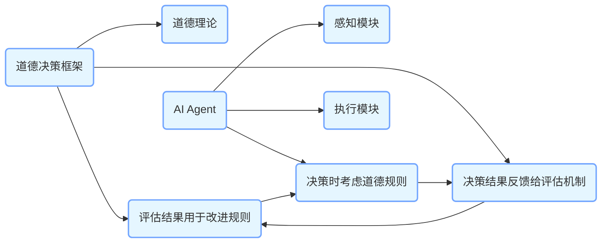

# 构建具有道德决策框架的AI Agent

> 关键词：AI Agent、道德决策框架、人工智能伦理、算法原理、实际应用

> 摘要：本文旨在探讨如何构建具有道德决策框架的AI Agent。随着人工智能技术的飞速发展，AI Agent在各个领域的应用日益广泛，其决策行为可能对人类社会产生重大影响。因此，为AI Agent引入道德决策框架变得至关重要。文章将详细介绍道德决策框架的核心概念、相关算法原理、数学模型，通过项目实战展示具体实现过程，分析实际应用场景，推荐相关工具和资源，并对未来发展趋势与挑战进行总结。

## 1. 背景介绍 
### 1.1 目的和范围
本文章的主要目的是深入探讨构建具有道德决策框架的AI Agent的方法和技术。随着人工智能在医疗、金融、交通等关键领域的广泛应用，AI Agent的决策可能会直接影响人类的生命、财产和社会福祉。因此，确保AI Agent的决策符合道德标准是当前人工智能研究的重要课题。本文将涵盖道德决策框架的核心概念、算法原理、数学模型、实际应用案例等方面，为读者提供全面的技术指导和理论支持。

### 1.2 预期读者
本文预期读者包括人工智能领域的研究人员、开发者、软件架构师、CTO等专业人士，以及对人工智能伦理和道德决策感兴趣的学者和爱好者。通过阅读本文，读者将能够了解构建具有道德决策框架的AI Agent的基本原理和方法，掌握相关的技术细节，并能够将这些知识应用到实际项目中。

### 1.3 文档结构概述
本文将按照以下结构进行组织：
- 核心概念与联系：介绍道德决策框架、AI Agent等核心概念，以及它们之间的联系。
- 核心算法原理 & 具体操作步骤：详细讲解构建道德决策框架的算法原理，并给出具体的操作步骤。
- 数学模型和公式 & 详细讲解 & 举例说明：介绍相关的数学模型和公式，并通过具体的例子进行说明。
- 项目实战：代码实际案例和详细解释说明：通过一个实际的项目案例，展示如何构建具有道德决策框架的AI Agent，并对代码进行详细的解释和分析。
- 实际应用场景：分析具有道德决策框架的AI Agent在不同领域的实际应用场景。
- 工具和资源推荐：推荐相关的学习资源、开发工具和框架，以及经典论文和最新研究成果。
- 总结：未来发展趋势与挑战：对构建具有道德决策框架的AI Agent的未来发展趋势和挑战进行总结。
- 附录：常见问题与解答：解答读者在阅读过程中可能遇到的常见问题。
- 扩展阅读 & 参考资料：提供相关的扩展阅读材料和参考资料。

### 1.4 术语表
#### 1.4.1 核心术语定义
- **AI Agent**：人工智能代理，是一种能够感知环境、做出决策并采取行动的软件实体。
- **道德决策框架**：一种用于指导AI Agent做出符合道德标准的决策的规则和机制。
- **人工智能伦理**：研究人工智能技术的开发和应用中涉及的道德和伦理问题的学科。

#### 1.4.2 相关概念解释
- **后果主义**：一种道德理论，认为行为的道德价值取决于其产生的后果。
- **义务论**：一种道德理论，认为行为的道德价值取决于其是否符合某些道德原则或义务。
- **美德伦理学**：一种道德理论，认为行为的道德价值取决于行为者的品德和美德。

#### 1.4.3 缩略词列表
- **AI**：人工智能（Artificial Intelligence）
- **ML**：机器学习（Machine Learning）
- **DL**：深度学习（Deep Learning）

## 2. 核心概念与联系 
### 2.1 道德决策框架的核心概念
道德决策框架是一种用于指导AI Agent做出符合道德标准的决策的规则和机制。它可以基于不同的道德理论，如后果主义、义务论和美德伦理学等。道德决策框架的核心目标是确保AI Agent的决策行为不会对人类造成伤害，并能够促进人类的福祉。

### 2.2 AI Agent的核心概念
AI Agent是一种能够感知环境、做出决策并采取行动的软件实体。它可以通过传感器获取环境信息，使用算法和模型进行决策，并通过执行器采取相应的行动。AI Agent可以分为反应式Agent、基于模型的Agent、基于目标的Agent和基于效用的Agent等不同类型。

### 2.3 道德决策框架与AI Agent的联系
道德决策框架为AI Agent的决策提供了道德约束和指导。AI Agent在做出决策时，需要考虑道德决策框架中的规则和原则，以确保其决策行为符合道德标准。同时，AI Agent的决策也会影响道德决策框架的有效性和适用性，因此需要不断地对道德决策框架进行评估和改进。

### 2.4 文本示意图
```plaintext
道德决策框架
├── 道德理论（后果主义、义务论、美德伦理学等）
├── 道德规则和原则
└── 道德评估和监督机制

AI Agent
├── 感知模块（传感器）
├── 决策模块（算法和模型）
└── 执行模块（执行器）

联系
道德决策框架为AI Agent的决策提供约束和指导，AI Agent的决策影响道德决策框架的有效性和适用性
```

### 2.5 Mermaid流程图


## 3. 核心算法原理 & 具体操作步骤 
### 3.1 核心算法原理
构建具有道德决策框架的AI Agent的核心算法原理可以基于机器学习和规则引擎相结合的方法。具体来说，可以使用机器学习算法对大量的道德案例进行学习，提取出道德规则和模式，然后将这些规则和模式集成到规则引擎中。当AI Agent需要做出决策时，规则引擎会根据当前的情况和道德规则进行推理，得出符合道德标准的决策。

### 3.2 Python源代码详细阐述
以下是一个简单的示例代码，展示了如何使用Python实现一个基于规则引擎的道德决策框架：

```python
# 定义道德规则类
class MoralRules:
    def __init__(self):
        # 初始化道德规则
        self.rules = [
            # 规则1：不伤害他人
            lambda action: action.get('harm_to_others', 0) == 0,
            # 规则2：遵守承诺
            lambda action: action.get('break_promise', False) == False
        ]

    def check_rules(self, action):
        # 检查行动是否符合所有道德规则
        for rule in self.rules:
            if not rule(action):
                return False
        return True

# 定义AI Agent类
class AIAgent:
    def __init__(self):
        self.moral_rules = MoralRules()

    def make_decision(self, actions):
        # 遍历所有可能的行动
        for action in actions:
            if self.moral_rules.check_rules(action):
                return action
        return None

# 示例使用
if __name__ == "__main__":
    agent = AIAgent()
    possible_actions = [
        {'harm_to_others': 0, 'break_promise': False},
        {'harm_to_others': 1, 'break_promise': False},
        {'harm_to_others': 0, 'break_promise': True}
    ]
    decision = agent.make_decision(possible_actions)
    if decision:
        print("AI Agent做出的符合道德的决策是:", decision)
    else:
        print("没有找到符合道德的决策")
```

### 3.3 具体操作步骤
1. **数据收集**：收集大量的道德案例数据，包括不同情况下的决策和相应的道德评价。
2. **数据预处理**：对收集到的数据进行清洗、标注和特征提取，以便机器学习算法能够处理。
3. **模型训练**：使用机器学习算法（如决策树、神经网络等）对预处理后的数据进行训练，提取出道德规则和模式。
4. **规则引擎集成**：将训练得到的道德规则和模式集成到规则引擎中。
5. **决策推理**：当AI Agent需要做出决策时，规则引擎会根据当前的情况和道德规则进行推理，得出符合道德标准的决策。
6. **评估和改进**：不断对道德决策框架进行评估和改进，以确保其有效性和适用性。

## 4. 数学模型和公式 & 详细讲解 & 举例说明 
### 4.1 数学模型
可以使用效用函数来描述道德决策的过程。效用函数是一个将决策结果映射到一个实数的函数，表示该决策结果的好坏程度。在道德决策中，效用函数可以考虑多个因素，如后果的好坏、是否符合道德原则等。

### 4.2 公式
假设 $A$ 是所有可能的行动集合，$s$ 是当前的状态，$u(a, s)$ 是行动 $a \in A$ 在状态 $s$ 下的效用值。道德决策的目标是选择一个行动 $a^*$，使得效用值最大，即：

$$a^* = \arg\max_{a \in A} u(a, s)$$

### 4.3 详细讲解
效用函数 $u(a, s)$ 可以根据不同的道德理论进行定义。例如，在后果主义中，效用函数可以定义为行动产生的后果的好坏程度；在义务论中，效用函数可以定义为行动是否符合某些道德原则。

### 4.4 举例说明
假设一个AI Agent需要在两个行动 $a_1$ 和 $a_2$ 之间做出决策，当前状态为 $s$。根据后果主义，我们可以定义效用函数如下：

$$u(a_1, s) = 0.8 \times \text{benefit}_1 - 0.2 \times \text{harm}_1$$
$$u(a_2, s) = 0.7 \times \text{benefit}_2 - 0.3 \times \text{harm}_2$$

其中，$\text{benefit}_i$ 表示行动 $a_i$ 产生的好处，$\text{harm}_i$ 表示行动 $a_i$ 产生的伤害。AI Agent会选择效用值最大的行动：

$$a^* = \arg\max_{i \in \{1, 2\}} u(a_i, s)$$

如果 $u(a_1, s) > u(a_2, s)$，则AI Agent会选择行动 $a_1$；否则，会选择行动 $a_2$。

## 5. 项目实战：代码实际案例和详细解释说明 
### 5.1 开发环境搭建
#### 5.1.1 安装Python
首先，需要安装Python编程语言。可以从Python官方网站（https://www.python.org/downloads/）下载适合自己操作系统的Python版本，并按照安装向导进行安装。

#### 5.1.2 安装必要的库
在本项目中，我们将使用一些Python库，如 `numpy`、`pandas` 等。可以使用以下命令来安装这些库：

```sh
pip install numpy pandas
```

### 5.2 源代码详细实现和代码解读
以下是一个更复杂的项目示例，展示了如何构建一个具有道德决策框架的AI Agent，用于自动驾驶汽车的决策：

```python
import numpy as np

# 定义道德规则类
class MoralRules:
    def __init__(self):
        # 规则权重
        self.weights = {
            'harm_to_pedestrians': 0.5,
            'harm_to_passengers': 0.3,
            'violate_traffic_rules': 0.2
        }

    def calculate_utility(self, action):
        # 计算行动的效用值
        utility = 0
        for factor, weight in self.weights.items():
            utility -= weight * action.get(factor, 0)
        return utility

    def check_rules(self, actions):
        # 选择效用值最大的行动
        utilities = [self.calculate_utility(action) for action in actions]
        best_index = np.argmax(utilities)
        return actions[best_index]

# 定义AI Agent类
class AIAgent:
    def __init__(self):
        self.moral_rules = MoralRules()

    def make_decision(self, actions):
        # 做出符合道德的决策
        return self.moral_rules.check_rules(actions)

# 示例使用
if __name__ == "__main__":
    agent = AIAgent()
    possible_actions = [
        {'harm_to_pedestrians': 1, 'harm_to_passengers': 0, 'violate_traffic_rules': 0},
        {'harm_to_pedestrians': 0, 'harm_to_passengers': 1, 'violate_traffic_rules': 0},
        {'harm_to_pedestrians': 0, 'harm_to_passengers': 0, 'violate_traffic_rules': 1}
    ]
    decision = agent.make_decision(possible_actions)
    print("AI Agent做出的符合道德的决策是:", decision)
```

### 5.3 代码解读与分析
#### 5.3.1 道德规则类 `MoralRules`
- `__init__` 方法：初始化道德规则的权重，不同的因素（如伤害行人、伤害乘客、违反交通规则）具有不同的权重。
- `calculate_utility` 方法：根据行动的各项因素和权重计算行动的效用值，效用值越高表示该行动越符合道德标准。
- `check_rules` 方法：遍历所有可能的行动，计算每个行动的效用值，选择效用值最大的行动。

#### 5.3.2 AI Agent类 `AIAgent`
- `__init__` 方法：初始化道德规则对象。
- `make_decision` 方法：调用道德规则对象的 `check_rules` 方法，做出符合道德的决策。

#### 5.3.3 主程序
创建AI Agent对象，定义可能的行动列表，调用 `make_decision` 方法做出决策，并输出决策结果。

## 6. 实际应用场景 
### 6.1 医疗领域
在医疗领域，具有道德决策框架的AI Agent可以用于辅助医生进行诊断和治疗决策。例如，在选择治疗方案时，AI Agent可以考虑患者的利益、治疗的风险和收益、医疗资源的合理分配等因素，做出符合道德标准的决策。

### 6.2 金融领域
在金融领域，AI Agent可以用于风险管理和投资决策。例如，在评估贷款申请人的信用风险时，AI Agent可以考虑申请人的还款能力、信用记录、社会影响等因素，避免对弱势群体的不公平对待。

### 6.3 交通领域
在交通领域，具有道德决策框架的AI Agent可以用于自动驾驶汽车的决策。例如，在遇到紧急情况时，AI Agent可以根据道德规则选择对行人、乘客和其他车辆伤害最小的行动。

### 6.4 教育领域
在教育领域，AI Agent可以用于个性化学习和教学评估。例如，在为学生推荐学习资源时，AI Agent可以考虑学生的学习能力、兴趣爱好、教育公平等因素，提供符合道德标准的建议。

## 7. 工具和资源推荐
### 7.1 学习资源推荐
#### 7.1.1 书籍推荐
- 《人工智能伦理》：本书系统地介绍了人工智能伦理的基本概念、理论和方法，探讨了人工智能技术在不同领域的应用中涉及的道德和伦理问题。
- 《算法之美：指导工作与生活的算法》：本书通过生动有趣的例子，介绍了算法在生活和工作中的应用，同时也探讨了算法的道德和伦理问题。

#### 7.1.2 在线课程
- Coursera上的“人工智能伦理”课程：该课程由知名高校的教授授课，系统地介绍了人工智能伦理的基本概念、理论和方法。
- edX上的“机器学习伦理”课程：该课程主要探讨了机器学习算法在设计和应用中涉及的道德和伦理问题。

#### 7.1.3 技术博客和网站
- Medium上的“人工智能伦理”专栏：该专栏汇集了众多人工智能伦理领域的专家和学者的文章，提供了最新的研究成果和实践经验。
- AI Ethics Institute的官方网站：该网站提供了丰富的人工智能伦理资源，包括研究报告、案例分析、会议信息等。

### 7.2 开发工具框架推荐
#### 7.2.1 IDE和编辑器
- PyCharm：一款专业的Python集成开发环境，提供了丰富的代码编辑、调试和测试功能。
- Visual Studio Code：一款轻量级的代码编辑器，支持多种编程语言，具有丰富的插件扩展功能。

#### 7.2.2 调试和性能分析工具
- PDB：Python自带的调试工具，可以帮助开发者定位和解决代码中的问题。
- cProfile：Python标准库中的性能分析工具，可以帮助开发者分析代码的性能瓶颈。

#### 7.2.3 相关框架和库
- TensorFlow：一个开源的机器学习框架，提供了丰富的深度学习模型和工具。
- PyTorch：另一个开源的机器学习框架，具有简洁易用的API和高效的计算性能。

### 7.3 相关论文著作推荐
#### 7.3.1 经典论文
- “The Ethical Algorithm: The Science of Socially Aware Algorithm Design”：该论文提出了一种社会感知算法设计的科学方法，探讨了如何在算法设计中考虑道德和伦理因素。
- “Machine Bias: There's Software Used Across the Country to Predict Future Criminals. And It's Biased Against Blacks”：该论文揭示了机器学习算法在犯罪预测中的偏见问题，引起了广泛的关注。

#### 7.3.2 最新研究成果
- 近年来，人工智能伦理领域的研究非常活跃，许多顶尖学术会议（如NeurIPS、ICML等）都设有专门的人工智能伦理研讨会，发表了大量的最新研究成果。

#### 7.3.3 应用案例分析
- 《AI 2030：人工智能时代的社会与伦理》：本书通过多个实际应用案例，分析了人工智能技术在不同领域的应用中涉及的道德和伦理问题，并提出了相应的解决方案。

## 8. 总结：未来发展趋势与挑战
### 8.1 未来发展趋势
- **多学科融合**：构建具有道德决策框架的AI Agent需要融合计算机科学、哲学、伦理学、心理学等多个学科的知识和方法，未来的研究将更加注重跨学科的合作。
- **可解释性和透明度**：随着人工智能技术的广泛应用，人们对AI Agent的决策过程和结果的可解释性和透明度提出了更高的要求。未来的研究将致力于开发更加可解释和透明的道德决策框架。
- **自适应和进化**：道德标准是随着社会的发展和变化而不断演变的，未来的AI Agent需要具备自适应和进化的能力，能够根据不同的社会环境和道德标准做出相应的决策。

### 8.2 挑战
- **道德标准的多样性**：不同的文化、宗教和社会群体可能有不同的道德标准，如何在AI Agent中融合这些多样性的道德标准是一个巨大的挑战。
- **数据的偏见和不完整性**：机器学习算法的性能很大程度上依赖于数据的质量和数量，如果数据存在偏见和不完整性，可能会导致AI Agent做出不公正和不道德的决策。
- **法律和监管的滞后性**：人工智能技术的发展速度远远超过了法律和监管的制定速度，如何建立健全的法律和监管体系，确保AI Agent的决策行为符合道德和法律标准，是当前面临的一个重要挑战。

## 9. 附录：常见问题与解答
### 9.1 如何确定道德规则的权重？
道德规则的权重可以根据不同的应用场景和道德理论进行确定。例如，在自动驾驶汽车的决策中，可以根据行人、乘客和其他车辆的安全重要性来确定不同因素的权重。同时，也可以通过专家评估、用户反馈等方式来调整权重。

### 9.2 如何处理道德冲突？
当出现道德冲突时，可以采用以下方法进行处理：
- **优先排序**：根据道德原则的重要性进行优先排序，选择最重要的原则进行遵循。
- **协商和妥协**：通过协商和妥协的方式，寻找一个能够平衡不同道德原则的解决方案。
- **动态调整**：根据具体情况动态调整道德规则和权重，以适应不同的道德冲突。

### 9.3 如何评估道德决策框架的有效性？
可以从以下几个方面评估道德决策框架的有效性：
- **决策的合理性**：评估AI Agent做出的决策是否符合道德原则和常识。
- **决策的一致性**：评估AI Agent在不同情况下做出的决策是否具有一致性。
- **社会影响**：评估AI Agent的决策对社会和人类的影响，是否能够促进社会的公平、正义和福祉。

## 10. 扩展阅读 & 参考资料
### 10.1 扩展阅读
- 《道德计算：信息与通信技术的伦理基础》
- 《智能机器时代的人类价值观》

### 10.2 参考资料
- Bostrom, N., & Yudkowsky, E. (2014). The ethics of artificial intelligence. In The Cambridge handbook of artificial intelligence.
- Floridi, L., & Sanders, J. W. (2004). On the morality of artificial agents. Minds and Machines, 14(3), 349-379.

作者：AI天才研究院/AI Genius Institute & 禅与计算机程序设计艺术 /Zen And The Art of Computer Programming