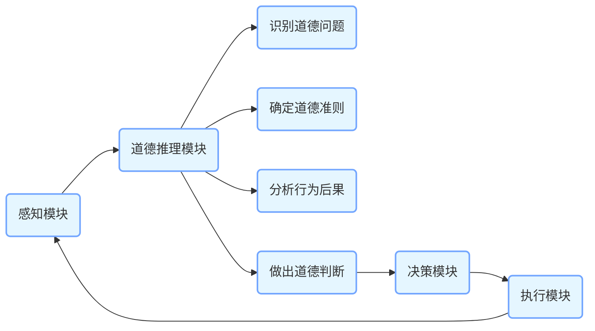

# 构建具有道德推理能力的AI Agent

> 关键词：AI Agent、道德推理、人工智能伦理、算法设计、实际应用

> 摘要：本文聚焦于构建具有道德推理能力的AI Agent这一前沿课题。首先介绍了相关背景，包括目的范围、预期读者等内容。接着阐述了核心概念及联系，以清晰的文本示意图和Mermaid流程图呈现原理与架构。详细讲解了核心算法原理并给出Python源代码示例，同时运用数学模型和公式进行深入分析。通过项目实战展示了代码实现及解读。探讨了实际应用场景，推荐了学习资源、开发工具框架和相关论文著作。最后总结了未来发展趋势与挑战，并提供了常见问题解答和扩展阅读参考资料，旨在为构建具有道德推理能力的AI Agent提供全面且深入的指导。

## 1. 背景介绍 
### 1.1 目的和范围
在当今人工智能快速发展的时代，AI Agent被广泛应用于各个领域，如医疗、交通、金融等。然而，现有的AI Agent往往缺乏道德推理能力，这可能导致其在决策过程中产生不道德或不符合社会价值观的行为。构建具有道德推理能力的AI Agent的目的在于使AI能够在复杂的现实场景中做出符合道德规范的决策，减少潜在的道德风险。

本文章的范围涵盖了从理论层面的核心概念和算法原理，到实践层面的项目实战和实际应用场景。同时，还会提供相关的学习资源、开发工具和论文著作推荐，以帮助读者全面了解和掌握构建具有道德推理能力的AI Agent的方法和技术。

### 1.2 预期读者
本文预期读者包括人工智能领域的研究人员、开发者、伦理学家、政策制定者以及对人工智能伦理感兴趣的爱好者。研究人员可以从文章中获取关于道德推理算法的最新研究成果和发展趋势；开发者能够学习到具体的代码实现和项目实战经验；伦理学家可以借助本文探讨AI伦理的理论和实践问题；政策制定者可以根据文章内容制定相关的政策和法规；爱好者则可以通过阅读本文了解构建具有道德推理能力的AI Agent的基本概念和方法。

### 1.3 文档结构概述
本文将按照以下结构进行组织：
1. 背景介绍：阐述构建具有道德推理能力的AI Agent的目的、范围、预期读者和文档结构概述。
2. 核心概念与联系：介绍AI Agent、道德推理等核心概念，以及它们之间的联系，并通过文本示意图和Mermaid流程图进行展示。
3. 核心算法原理 & 具体操作步骤：详细讲解用于实现道德推理的核心算法原理，并给出具体的Python源代码示例。
4. 数学模型和公式 & 详细讲解 & 举例说明：运用数学模型和公式对道德推理进行深入分析，并通过具体例子进行说明。
5. 项目实战：代码实际案例和详细解释说明：通过一个实际项目，展示如何使用Python实现具有道德推理能力的AI Agent，并对代码进行详细解读。
6. 实际应用场景：探讨具有道德推理能力的AI Agent在医疗、交通、金融等领域的实际应用场景。
7. 工具和资源推荐：推荐相关的学习资源、开发工具框架和论文著作。
8. 总结：未来发展趋势与挑战：总结构建具有道德推理能力的AI Agent的发展趋势和面临的挑战。
9. 附录：常见问题与解答：解答读者在阅读过程中可能遇到的常见问题。
10. 扩展阅读 & 参考资料：提供相关的扩展阅读材料和参考资料。

### 1.4 术语表
#### 1.4.1 核心术语定义
- **AI Agent**：能够感知环境、进行决策并采取行动的人工智能实体。它可以是软件程序、机器人或其他智能设备。
- **道德推理**：指的是在面临道德问题时，运用逻辑和道德原则进行思考和判断，以确定合适的行为或决策的过程。
- **道德准则**：一系列被社会或特定群体认可的道德规范和价值观，用于指导人们的行为和决策。
- **效用函数**：在决策理论中，用于衡量不同行为或决策所带来的价值或收益的函数。

#### 1.4.2 相关概念解释
- **伦理困境**：指的是在某些情况下，不同的道德准则或价值观之间相互冲突，使得决策者难以做出符合所有道德要求的选择。
- **机器学习**：人工智能的一个分支，通过让计算机从数据中学习模式和规律，从而实现对未知数据的预测和决策。
- **深度学习**：一种基于神经网络的机器学习方法，能够自动从大量数据中提取特征和模式，在图像识别、自然语言处理等领域取得了显著的成果。

#### 1.4.3 缩略词列表
- **AI**：Artificial Intelligence，人工智能
- **ML**：Machine Learning，机器学习
- **DL**：Deep Learning，深度学习

## 2. 核心概念与联系 

### 核心概念原理
#### AI Agent
AI Agent是人工智能系统的基本组成部分，它具有感知环境、处理信息、做出决策和执行行动的能力。一个典型的AI Agent可以用以下公式表示：

$$Agent = \langle Percept, State, Action, Policy \rangle$$

其中，$Percept$ 表示Agent从环境中感知到的信息，$State$ 表示Agent当前的内部状态，$Action$ 表示Agent可以采取的行动，$Policy$ 表示Agent根据感知信息和内部状态选择行动的策略。

#### 道德推理
道德推理是指在面临道德问题时，运用逻辑和道德原则进行思考和判断，以确定合适的行为或决策的过程。道德推理通常涉及以下几个步骤：
1. **识别道德问题**：从感知到的信息中识别出可能涉及道德问题的情况。
2. **确定道德准则**：根据具体情况，确定适用的道德准则和价值观。
3. **分析行为后果**：评估不同行为或决策可能带来的后果，包括对个人、社会和环境的影响。
4. **做出道德判断**：根据道德准则和行为后果的分析，做出符合道德要求的决策。

### 架构的文本示意图
```plaintext
AI Agent
├── 感知模块
│   └── 接收环境信息
├── 道德推理模块
│   ├── 识别道德问题
│   ├── 确定道德准则
│   ├── 分析行为后果
│   └── 做出道德判断
├── 决策模块
│   └── 根据道德判断选择行动
└── 执行模块
    └── 执行选定的行动
```

### Mermaid流程图


## 3. 核心算法原理 & 具体操作步骤 

### 算法原理
一种常见的实现道德推理的算法是基于规则的方法。该方法通过定义一系列的道德规则和准则，让AI Agent在面临道德问题时，根据这些规则进行推理和判断。具体步骤如下：
1. **规则定义**：定义一系列的道德规则，例如“不伤害他人”、“诚实守信”等。每个规则可以用逻辑表达式表示。
2. **规则匹配**：当AI Agent感知到环境信息时，将其与定义的道德规则进行匹配，找出适用的规则。
3. **规则推理**：根据适用的规则，进行逻辑推理，得出道德判断结果。
4. **决策制定**：根据道德判断结果，选择合适的行动。

### Python源代码示例
```python
# 定义道德规则
rules = [
    {
        "name": "不伤害他人",
        "condition": lambda action, context: action not in context.get("harm_actions", []),
        "conclusion": "该行动符合不伤害他人的原则"
    },
    {
        "name": "诚实守信",
        "condition": lambda action, context: action not in context.get("dishonest_actions", []),
        "conclusion": "该行动符合诚实守信的原则"
    }
]

def moral_reasoning(action, context):
    """
    道德推理函数
    :param action: 待评估的行动
    :param context: 环境信息
    :return: 道德判断结果
    """
    results = []
    for rule in rules:
        if rule["condition"](action, context):
            results.append(rule["conclusion"])
        else:
            results.append(f"该行动违反了 {rule['name']} 原则")
    return results

# 示例环境信息
context = {
    "harm_actions": ["打人", "骂人"],
    "dishonest_actions": ["说谎", "欺骗"]
}

# 待评估的行动
action = "帮助他人"

# 进行道德推理
judgment = moral_reasoning(action, context)
print(judgment)
```

### 具体操作步骤
1. **规则定义**：在上述代码中，我们定义了两个道德规则：“不伤害他人”和“诚实守信”。每个规则包含一个条件函数和一个结论。
2. **环境信息设置**：设置示例环境信息 `context`，其中包含了可能的伤害行为和不诚实行为。
3. **待评估行动选择**：选择一个待评估的行动 `action`，例如“帮助他人”。
4. **道德推理执行**：调用 `moral_reasoning` 函数进行道德推理，得到道德判断结果。
5. **结果输出**：打印道德判断结果。

## 4. 数学模型和公式 & 详细讲解 & 举例说明 

### 数学模型
我们可以使用决策理论中的效用函数来对道德推理进行建模。效用函数 $U(a, s)$ 表示在状态 $s$ 下采取行动 $a$ 所带来的价值或收益。在道德推理中，我们可以将道德准则转化为效用函数的约束条件，使得AI Agent在决策时优先选择符合道德准则的行动。

假设我们有 $n$ 个道德准则 $C_1, C_2, \cdots, C_n$，每个准则对应一个效用函数 $U_{C_i}(a, s)$。我们可以定义一个综合效用函数 $U_{total}(a, s)$ 如下：

$$U_{total}(a, s) = \sum_{i=1}^{n} w_i U_{C_i}(a, s)$$

其中，$w_i$ 是每个道德准则的权重，表示该准则在决策中的重要程度。

### 详细讲解
在上述数学模型中，每个道德准则 $C_i$ 对应一个效用函数 $U_{C_i}(a, s)$，用于衡量在状态 $s$ 下采取行动 $a$ 是否符合该准则。权重 $w_i$ 表示该准则在决策中的重要程度，可以根据具体情况进行调整。

综合效用函数 $U_{total}(a, s)$ 是所有道德准则效用函数的加权和。AI Agent在决策时，会选择使得 $U_{total}(a, s)$ 最大的行动 $a$。

### 举例说明
假设我们有两个道德准则：“不伤害他人”和“帮助他人”。我们可以定义相应的效用函数如下：

- **不伤害他人准则**：
  - 当行动 $a$ 不伤害他人时，$U_{C_1}(a, s) = 1$；
  - 当行动 $a$ 伤害他人时，$U_{C_1}(a, s) = -1$。

- **帮助他人准则**：
  - 当行动 $a$ 帮助他人时，$U_{C_2}(a, s) = 1$；
  - 当行动 $a$ 不帮助他人时，$U_{C_2}(a, s) = 0$。

假设两个准则的权重分别为 $w_1 = 0.6$ 和 $w_2 = 0.4$。现在考虑两个行动 $a_1$ 和 $a_2$，在状态 $s$ 下的情况如下：

- 行动 $a_1$：不伤害他人且帮助他人。
  - $U_{C_1}(a_1, s) = 1$，$U_{C_2}(a_1, s) = 1$。
  - $U_{total}(a_1, s) = 0.6 \times 1 + 0.4 \times 1 = 1$。

- 行动 $a_2$：不伤害他人但不帮助他人。
  - $U_{C_1}(a_2, s) = 1$，$U_{C_2}(a_2, s) = 0$。
  - $U_{total}(a_2, s) = 0.6 \times 1 + 0.4 \times 0 = 0.6$。

由于 $U_{total}(a_1, s) > U_{total}(a_2, s)$，AI Agent会选择行动 $a_1$。

## 5. 项目实战：代码实际案例和详细解释说明 

### 5.1  开发环境搭建
#### 操作系统
本项目可以在Windows、Linux或macOS等主流操作系统上进行开发。建议使用Linux系统，如Ubuntu 20.04，因为它具有良好的开源软件支持和稳定性。

#### Python环境
安装Python 3.7或更高版本。可以从Python官方网站（https://www.python.org/downloads/）下载并安装Python。安装完成后，使用以下命令验证Python版本：

```bash
python --version
```

#### 依赖库安装
本项目需要使用一些Python依赖库，如 `numpy`、`pandas` 等。可以使用 `pip` 命令进行安装：

```bash
pip install numpy pandas
```

### 5.2  源代码详细实现和代码解读
```python
import numpy as np

# 定义道德准则和效用函数
moral_criteria = [
    {
        "name": "不伤害他人",
        "utility_function": lambda action, context: 1 if action not in context.get("harm_actions", []) else -1,
        "weight": 0.6
    },
    {
        "name": "帮助他人",
        "utility_function": lambda action, context: 1 if action in context.get("help_actions", []) else 0,
        "weight": 0.4
    }
]

def calculate_total_utility(action, context):
    """
    计算综合效用
    :param action: 待评估的行动
    :param context: 环境信息
    :return: 综合效用值
    """
    total_utility = 0
    for criterion in moral_criteria:
        utility = criterion["utility_function"](action, context)
        weight = criterion["weight"]
        total_utility += weight * utility
    return total_utility

def make_decision(actions, context):
    """
    做出决策
    :param actions: 可选的行动列表
    :param context: 环境信息
    :return: 最优行动
    """
    utilities = [calculate_total_utility(action, context) for action in actions]
    best_index = np.argmax(utilities)
    return actions[best_index]

# 示例环境信息
context = {
    "harm_actions": ["打人", "骂人"],
    "help_actions": ["帮助老人", "捐款"]
}

# 可选的行动列表
actions = ["帮助老人", "骂人", "睡觉"]

# 做出决策
best_action = make_decision(actions, context)
print(f"最优行动: {best_action}")
```

### 5.3  代码解读与分析
#### 道德准则和效用函数定义
```python
moral_criteria = [
    {
        "name": "不伤害他人",
        "utility_function": lambda action, context: 1 if action not in context.get("harm_actions", []) else -1,
        "weight": 0.6
    },
    {
        "name": "帮助他人",
        "utility_function": lambda action, context: 1 if action in context.get("help_actions", []) else 0,
        "weight": 0.4
    }
]
```
这里定义了两个道德准则：“不伤害他人”和“帮助他人”。每个准则包含一个名称、一个效用函数和一个权重。效用函数用于衡量某个行动是否符合该准则，权重表示该准则在决策中的重要程度。

#### 综合效用计算
```python
def calculate_total_utility(action, context):
    total_utility = 0
    for criterion in moral_criteria:
        utility = criterion["utility_function"](action, context)
        weight = criterion["weight"]
        total_utility += weight * utility
    return total_utility
```
该函数用于计算某个行动的综合效用。它遍历所有的道德准则，计算每个准则的效用值，并根据权重进行加权求和。

#### 决策制定
```python
def make_decision(actions, context):
    utilities = [calculate_total_utility(action, context) for action in actions]
    best_index = np.argmax(utilities)
    return actions[best_index]
```
该函数用于从可选的行动列表中选择最优行动。它首先计算每个行动的综合效用，然后选择效用值最大的行动。

#### 示例运行
```python
context = {
    "harm_actions": ["打人", "骂人"],
    "help_actions": ["帮助老人", "捐款"]
}
actions = ["帮助老人", "骂人", "睡觉"]
best_action = make_decision(actions, context)
print(f"最优行动: {best_action}")
```
这里设置了示例环境信息和可选的行动列表，然后调用 `make_decision` 函数做出决策，并打印最优行动。

## 6. 实际应用场景 
### 医疗领域
在医疗领域，具有道德推理能力的AI Agent可以辅助医生进行决策。例如，在资源有限的情况下，AI Agent可以根据患者的病情、预后情况和社会价值等因素，运用道德推理算法来决定优先治疗哪些患者。同时，在基因编辑、器官移植等涉及伦理问题的医疗技术应用中，AI Agent可以帮助医生评估潜在的道德风险，确保医疗行为符合伦理准则。

### 交通领域
在自动驾驶汽车中，AI Agent需要在各种复杂的交通场景中做出决策。例如，当面临不可避免的碰撞时，AI Agent需要运用道德推理能力来决定是保护车内乘客还是尽量减少对行人的伤害。此外，在交通流量管理中，AI Agent可以根据公平、效率等道德原则，合理分配道路资源，优化交通拥堵情况。

### 金融领域
在金融领域，具有道德推理能力的AI Agent可以用于风险评估和投资决策。例如，AI Agent可以评估企业的社会责任表现、环境影响等因素，避免投资那些违反道德准则的企业。同时，在信贷审批过程中，AI Agent可以运用道德推理来确保公平对待不同的申请人，避免歧视和不公平的行为。

### 教育领域
在教育领域，AI Agent可以作为智能辅导系统，根据学生的学习情况和特点，提供个性化的学习建议。同时，AI Agent可以运用道德推理能力，引导学生树立正确的价值观和道德观念。例如，在处理学生之间的冲突时，AI Agent可以根据道德准则提供合理的解决方案，促进学生的道德成长。

## 7. 工具和资源推荐
### 7.1 学习资源推荐
#### 7.1.1 书籍推荐
- 《人工智能伦理》：这本书全面介绍了人工智能伦理的基本概念、理论和实践问题，为读者提供了深入了解人工智能伦理的基础。
- 《道德计算：将道德嵌入机器人和人工智能》：该书探讨了如何将道德原则融入到机器人和人工智能系统中，是构建具有道德推理能力的AI Agent的重要参考书籍。
- 《决策理论与理性》：介绍了决策理论的基本概念和方法，对于理解道德推理中的决策过程具有重要的指导意义。

#### 7.1.2 在线课程
- Coursera上的“人工智能伦理”课程：由知名高校的教授授课，系统地讲解了人工智能伦理的各个方面，包括道德推理、隐私保护、公平性等。
- edX上的“人工智能与社会”课程：该课程结合了人工智能的技术发展和社会影响，探讨了人工智能伦理的相关问题，并提供了实际案例分析。

#### 7.1.3 技术博客和网站
- AI Ethics Institute：该网站专注于人工智能伦理的研究和讨论，提供了最新的研究成果、案例分析和政策解读。
- Medium上的AI Ethics专栏：汇集了众多人工智能伦理领域的专家和爱好者的文章，涵盖了道德推理、算法偏见等多个方面的内容。

### 7.2 开发工具框架推荐
#### 7.2.1 IDE和编辑器
- PyCharm：一款功能强大的Python集成开发环境，提供了代码编辑、调试、版本控制等一系列功能，适合开发具有道德推理能力的AI Agent。
- Visual Studio Code：轻量级的代码编辑器，支持多种编程语言和插件扩展，具有良好的开发体验。

#### 7.2.2 调试和性能分析工具
- PDB：Python自带的调试器，可以帮助开发者定位和解决代码中的问题。
- cProfile：Python的性能分析工具，可以分析代码的运行时间和内存使用情况，帮助优化代码性能。

#### 7.2.3 相关框架和库
- TensorFlow：一个开源的机器学习框架，提供了丰富的工具和算法，可用于构建具有道德推理能力的AI Agent的机器学习模型。
- PyTorch：另一个流行的深度学习框架，具有简洁易用的接口和高效的计算性能，适合开发复杂的人工智能系统。

### 7.3 相关论文著作推荐
#### 7.3.1 经典论文
- “The Moral Machine Experiment”：该论文介绍了道德机器实验，探讨了公众对于自动驾驶汽车在道德困境中的决策偏好，为构建具有道德推理能力的自动驾驶AI Agent提供了重要的参考。
- “Moral Reasoning in Artificial Intelligence”：这篇论文系统地阐述了人工智能中的道德推理问题，提出了一些基本的理论和方法。

#### 7.3.2 最新研究成果
- 近年来，在人工智能伦理领域涌现了大量的研究成果。可以通过学术数据库，如IEEE Xplore、ACM Digital Library等，搜索相关的最新论文，了解该领域的前沿动态。

#### 7.3.3 应用案例分析
- 一些知名的研究机构和企业会发布关于具有道德推理能力的AI Agent的应用案例分析报告。例如，OpenAI、Google等公司的研究报告可以帮助读者了解实际应用中的经验和挑战。

## 8. 总结：未来发展趋势与挑战
### 未来发展趋势
#### 多学科融合
构建具有道德推理能力的AI Agent需要融合人工智能、伦理学、哲学、心理学等多个学科的知识。未来，不同学科之间的交叉研究将更加深入，为AI Agent的道德推理能力提供更坚实的理论基础。

#### 个性化道德推理
随着人工智能技术的发展，AI Agent将能够根据用户的个性化需求和价值观，进行更加精准的道德推理。例如，在智能家居系统中，AI Agent可以根据用户的道德偏好，为用户提供符合其价值观的决策建议。

#### 群体道德推理
未来的AI Agent不仅能够进行个体的道德推理，还能够处理群体的道德问题。例如，在社交网络、城市规划等领域，AI Agent可以考虑群体的利益和价值观，做出更加合理的决策。

### 面临的挑战
#### 道德准则的多样性
不同的文化、宗教和社会群体具有不同的道德准则和价值观，如何在AI Agent中融合这些多样性是一个巨大的挑战。需要建立一种通用的道德框架，以适应不同的文化背景和应用场景。

#### 道德推理的复杂性
道德推理涉及到复杂的逻辑和情感因素，目前的人工智能技术还难以完全模拟人类的道德推理过程。如何提高AI Agent的道德推理能力，使其能够在复杂的情况下做出合理的决策，是未来需要解决的重要问题。

#### 可解释性和透明度
具有道德推理能力的AI Agent需要具备良好的可解释性和透明度，以便用户理解其决策过程和依据。然而，目前的一些深度学习模型具有黑盒性质，难以解释其决策的原因。如何提高AI Agent的可解释性，是保障其道德可靠性的关键。

## 9. 附录：常见问题与解答
### 问题1：构建具有道德推理能力的AI Agent有什么实际意义？
答：构建具有道德推理能力的AI Agent可以使人工智能系统在决策过程中考虑道德因素，减少潜在的道德风险。在医疗、交通、金融等领域，具有道德推理能力的AI Agent可以帮助人类做出更加符合道德规范的决策，促进社会的公平、正义和可持续发展。

### 问题2：如何确定道德准则和权重？
答：确定道德准则和权重是一个复杂的问题，需要综合考虑多个因素。可以通过以下几种方式来确定：
1. **专家意见**：咨询伦理学、哲学等领域的专家，获取他们的专业建议。
2. **公众参与**：通过问卷调查、听证会等方式，了解公众的道德观念和价值观。
3. **数据分析**：分析历史数据和实际案例，找出与道德相关的因素和规律。
4. **动态调整**：根据不同的应用场景和实际情况，动态调整道德准则和权重。

### 问题3：具有道德推理能力的AI Agent是否能够完全替代人类的道德判断？
答：目前来看，具有道德推理能力的AI Agent还不能完全替代人类的道德判断。虽然AI Agent可以在一定程度上模拟人类的道德推理过程，但它缺乏人类的情感、直觉和创造力。在一些复杂的道德问题上，人类的道德判断仍然具有不可替代的作用。AI Agent可以作为人类的辅助工具，帮助人类做出更加合理的决策。

### 问题4：如何评估具有道德推理能力的AI Agent的性能？
答：评估具有道德推理能力的AI Agent的性能可以从以下几个方面进行：
1. **道德准确性**：评估AI Agent的决策是否符合道德准则和价值观。
2. **决策效率**：评估AI Agent在规定时间内做出决策的能力。
3. **可解释性**：评估AI Agent的决策过程是否可以被人类理解和解释。
4. **适应性**：评估AI Agent在不同的环境和场景下的适应能力。

## 10. 扩展阅读 & 参考资料
### 扩展阅读
- 《人类的价值：基因、文化与人类合作的兴起》：该书探讨了人类的价值观和道德观念的起源和发展，对于理解人工智能伦理具有重要的启示作用。
- 《算法霸权：数学杀伤性武器的威胁与反击》：揭示了算法在社会中的潜在危害，提醒人们在开发和应用人工智能时要关注道德和伦理问题。

### 参考资料
- [1] Bostrom, N., & Yudkowsky, E. (2014). The ethics of artificial intelligence. In The Cambridge Handbook of Artificial Intelligence (pp. 316-334). Cambridge University Press.
- [2] Wallach, W., & Allen, C. (2008). Moral machines: Teaching robots right from wrong. Oxford University Press.
- [3] Awad, E., Dsouza, S., Kim, R., Schulz, J., Henrich, J., Shariff, A.,... & Rahwan, I. (2018). The moral machine experiment. Nature, 563(7729), 59-64.

作者：AI天才研究院/AI Genius Institute & 禅与计算机程序设计艺术 /Zen And The Art of Computer Programming