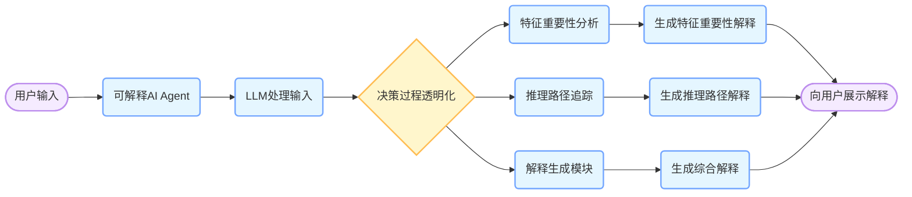

# 构建可解释AI Agent：LLM决策过程的透明化设计

> 关键词：可解释AI Agent、LLM决策过程、透明化设计、人工智能、模型解释性

> 摘要：本文聚焦于构建可解释AI Agent，着重探讨大语言模型（LLM）决策过程的透明化设计。详细介绍了可解释AI Agent的背景知识，包括目的、预期读者、文档结构等。深入剖析了相关核心概念及其联系，阐述了核心算法原理和具体操作步骤，同时给出了数学模型和公式，并结合实际案例进行说明。通过项目实战，展示了代码的实现和解读。还介绍了可解释AI Agent在不同场景下的实际应用，推荐了相关的学习资源、开发工具框架以及论文著作。最后对可解释AI Agent的未来发展趋势与挑战进行了总结，并提供了常见问题的解答和扩展阅读的参考资料，旨在帮助读者全面理解和掌握构建可解释AI Agent的方法和技术。

## 1. 背景介绍 
### 1.1 目的和范围
在人工智能领域，大语言模型（LLM）如GPT系列等取得了巨大的成功，能够在多种自然语言处理任务中表现出色。然而，这些模型往往被视为“黑盒”，其决策过程难以理解和解释。这在一些对决策透明度要求较高的场景中，如医疗诊断、金融风险评估、法律判决等，成为了应用的障碍。构建可解释AI Agent，实现LLM决策过程的透明化设计，目的在于提高模型决策的可理解性、可信度和可追溯性，让用户能够清楚地知道模型为何做出这样的决策。

本文的范围涵盖了可解释AI Agent的基本概念、核心算法原理、数学模型、实际应用案例以及相关的工具和资源推荐等方面。旨在为开发者、研究人员和对可解释AI感兴趣的人士提供一个全面的技术指南，帮助他们理解和实现LLM决策过程的透明化。

### 1.2 预期读者
本文的预期读者包括但不限于以下几类人群：
- **人工智能开发者**：希望了解如何在自己的项目中构建可解释的AI Agent，提高模型的可解释性和可信度。
- **研究人员**：对可解释AI领域的前沿技术和研究方向感兴趣，希望深入了解LLM决策过程透明化的相关理论和方法。
- **行业从业者**：如医疗、金融、法律等领域的专业人士，希望借助可解释AI Agent来辅助决策，提高决策的科学性和可靠性。
- **学生和爱好者**：对人工智能技术有一定的了解，想要进一步学习可解释AI的原理和实践。

### 1.3 文档结构概述
本文将按照以下结构进行组织：
- **核心概念与联系**：介绍可解释AI Agent和LLM决策过程透明化的核心概念，以及它们之间的联系，并通过文本示意图和Mermaid流程图进行直观展示。
- **核心算法原理 & 具体操作步骤**：详细阐述实现LLM决策过程透明化的核心算法原理，并给出具体的操作步骤，同时使用Python源代码进行详细讲解。
- **数学模型和公式 & 详细讲解 & 举例说明**：介绍相关的数学模型和公式，对其进行详细讲解，并通过实际例子进行说明。
- **项目实战：代码实际案例和详细解释说明**：通过一个具体的项目实战，展示如何搭建开发环境、实现源代码，并对代码进行详细解读和分析。
- **实际应用场景**：介绍可解释AI Agent在不同领域的实际应用场景。
- **工具和资源推荐**：推荐相关的学习资源、开发工具框架以及论文著作。
- **总结：未来发展趋势与挑战**：对可解释AI Agent的未来发展趋势进行展望，并分析可能面临的挑战。
- **附录：常见问题与解答**：解答读者在学习和实践过程中可能遇到的常见问题。
- **扩展阅读 & 参考资料**：提供相关的扩展阅读材料和参考资料，方便读者进一步深入学习。

### 1.4 术语表
#### 1.4.1 核心术语定义
- **可解释AI Agent**：一种具有可解释性的人工智能代理，能够对其决策过程进行清晰的解释，让用户理解其决策的依据和原因。
- **LLM（大语言模型）**：基于深度学习技术的大规模语言模型，通常通过在大量文本数据上进行预训练，能够生成自然语言文本、回答问题等。
- **决策过程透明化**：指将AI Agent的决策过程以一种可理解的方式呈现给用户，让用户能够清楚地知道模型是如何做出决策的。

#### 1.4.2 相关概念解释
- **特征重要性**：在机器学习中，特征重要性表示每个特征对模型决策的影响程度。在可解释AI中，通过分析特征重要性可以解释模型为什么会做出某个决策。
- **局部解释**：针对某个具体的输入实例，解释模型对该实例的决策过程。
- **全局解释**：从整体上解释模型的决策机制，不针对具体的输入实例。

#### 1.4.3 缩略词列表
- **LLM**：Large Language Model（大语言模型）
- **AI**：Artificial Intelligence（人工智能）
- **NLP**：Natural Language Processing（自然语言处理）

## 2. 核心概念与联系 

### 可解释AI Agent的核心概念
可解释AI Agent旨在将AI系统的决策过程转化为人类可理解的形式。它不仅仅是一个能够完成任务的智能体，更重要的是能够向用户解释其决策的依据和推理过程。这有助于提高用户对AI系统的信任，特别是在需要依赖AI进行关键决策的场景中。

### LLM决策过程透明化的核心概念
LLM决策过程透明化是指将大语言模型在生成答案或做出决策时的内部计算过程清晰地展现出来。由于LLM通常具有复杂的神经网络结构和大量的参数，其决策过程往往难以直接理解。透明化的目标就是打破这种“黑盒”状态，让用户能够追踪模型从输入到输出的整个推理路径。

### 两者的联系
可解释AI Agent可以利用LLM作为其核心的语言处理能力，但需要对LLM的决策过程进行透明化处理，以便更好地向用户解释其行为。通过透明化LLM的决策过程，可解释AI Agent能够提供更详细、更有说服力的解释，从而增强用户对其决策的信任。

### 文本示意图
```plaintext
可解释AI Agent
|
|-- LLM（核心语言处理能力）
|   |
|   |-- 决策过程透明化机制
|       |
|       |-- 特征重要性分析
|       |-- 推理路径追踪
|       |-- 解释生成模块
|
|-- 用户交互界面
|   |
|   |-- 接收用户输入
|   |-- 展示决策解释
```

### Mermaid流程图


## 3. 核心算法原理 & 具体操作步骤 

### 核心算法原理
实现LLM决策过程透明化的核心算法之一是特征重要性分析。这里我们使用一种基于梯度的方法来计算输入特征对输出的重要性。具体来说，对于一个给定的输入文本 $x$ 和LLM模型 $f$，我们计算输出 $y = f(x)$ 相对于输入 $x$ 的梯度 $\nabla_x y$。梯度的绝对值表示每个输入特征对输出的影响程度，绝对值越大，说明该特征越重要。

另一个重要的算法是推理路径追踪。在LLM的推理过程中，我们记录模型在每个层的中间输出和注意力权重，通过分析这些信息可以追踪模型的推理路径。

### 具体操作步骤
#### 步骤1：数据预处理
首先，我们需要对输入的文本数据进行预处理，将其转换为模型可以接受的格式。通常包括分词、词嵌入等操作。

#### 步骤2：计算梯度
在模型进行前向传播得到输出后，我们使用自动微分工具（如PyTorch中的`torch.autograd`）计算输出相对于输入的梯度。

#### 步骤3：特征重要性排序
根据计算得到的梯度绝对值，对输入特征进行排序，得到每个特征的重要性排名。

#### 步骤4：推理路径记录
在模型的前向传播过程中，记录每个层的中间输出和注意力权重。

#### 步骤5：解释生成
根据特征重要性排名和推理路径记录，生成对模型决策的解释。

### Python源代码详细阐述
```python
import torch
import torch.nn as nn
from transformers import AutoTokenizer, AutoModelForSequenceClassification

# 加载预训练的LLM模型和分词器
model_name = "bert-base-uncased"
tokenizer = AutoTokenizer.from_pretrained(model_name)
model = AutoModelForSequenceClassification.from_pretrained(model_name, num_labels=2)

# 输入文本
text = "This is a positive example."

# 数据预处理
inputs = tokenizer(text, return_tensors="pt")
inputs = {k: v.requires_grad_(True) for k, v in inputs.items()}

# 前向传播
outputs = model(**inputs)
logits = outputs.logits

# 选择一个类别进行梯度计算（这里选择类别0）
selected_logit = logits[0][0]

# 计算梯度
selected_logit.backward()

# 获取输入词的梯度
input_ids = inputs["input_ids"]
gradients = inputs["input_ids"].grad.squeeze()

# 计算特征重要性（梯度绝对值）
feature_importance = torch.abs(gradients)

# 特征重要性排序
sorted_indices = torch.argsort(feature_importance, descending=True)

# 输出特征重要性排名
tokens = tokenizer.convert_ids_to_tokens(input_ids.squeeze())
for index in sorted_indices:
    print(f"Token: {tokens[index]}, Importance: {feature_importance[index].item()}")
```

## 4. 数学模型和公式 & 详细讲解 & 举例说明 

### 特征重要性计算的数学模型
设输入文本 $x = [x_1, x_2, \cdots, x_n]$ 是一个由 $n$ 个词组成的序列，经过词嵌入后表示为 $X = [\mathbf{x}_1, \mathbf{x}_2, \cdots, \mathbf{x}_n]$，其中 $\mathbf{x}_i$ 是第 $i$ 个词的嵌入向量。LLM模型 $f$ 对输入 $X$ 进行处理，得到输出 $y = f(X)$。

我们定义第 $i$ 个输入特征的重要性 $I_i$ 为输出 $y$ 相对于第 $i$ 个输入特征 $\mathbf{x}_i$ 的梯度的绝对值，即：
$$I_i = \left\|\frac{\partial y}{\partial \mathbf{x}_i}\right\|$$

### 详细讲解
在实际计算中，我们通常使用自动微分工具来计算梯度。梯度表示了输出相对于输入的变化率，梯度的绝对值越大，说明该输入特征对输出的影响越大。通过计算每个输入特征的重要性，我们可以找出对模型决策影响最大的特征。

### 举例说明
假设我们有一个二分类的文本分类任务，输入文本为 “This movie is really great”，经过词嵌入后得到输入特征矩阵 $X$。模型的输出是一个二维向量 $y = [y_0, y_1]$，分别表示属于类别0和类别1的概率。我们选择类别0的概率 $y_0$ 进行梯度计算，得到每个输入特征的梯度 $\nabla_{\mathbf{x}_i} y_0$。

计算梯度的绝对值后，我们发现 “great” 这个词的梯度绝对值最大，说明它对模型判断该文本为类别0的影响最大。因此，我们可以解释模型的决策是因为文本中包含了 “great” 这个积极的词汇。

## 5. 项目实战：代码实际案例和详细解释说明 

### 5.1  开发环境搭建
#### 步骤1：安装Python
确保你的系统已经安装了Python 3.6或更高版本。可以从Python官方网站（https://www.python.org/downloads/）下载并安装。

#### 步骤2：创建虚拟环境
使用`venv`或`conda`创建一个虚拟环境，以隔离项目的依赖。以下是使用`venv`创建虚拟环境的示例：
```bash
python -m venv myenv
source myenv/bin/activate  # 对于Linux/Mac
myenv\Scripts\activate  # 对于Windows
```

#### 步骤3：安装依赖库
在虚拟环境中安装所需的依赖库，包括`transformers`、`torch`等。可以使用`pip`进行安装：
```bash
pip install transformers torch
```

### 5.2  源代码详细实现和代码解读
```python
import torch
import torch.nn as nn
from transformers import AutoTokenizer, AutoModelForSequenceClassification

# 加载预训练的LLM模型和分词器
model_name = "bert-base-uncased"
tokenizer = AutoTokenizer.from_pretrained(model_name)
model = AutoModelForSequenceClassification.from_pretrained(model_name, num_labels=2)

# 输入文本
text = "This is a negative review."

# 数据预处理
inputs = tokenizer(text, return_tensors="pt")
inputs = {k: v.requires_grad_(True) for k, v in inputs.items()}

# 前向传播
outputs = model(**inputs)
logits = outputs.logits

# 选择一个类别进行梯度计算（这里选择类别1）
selected_logit = logits[0][1]

# 计算梯度
selected_logit.backward()

# 获取输入词的梯度
input_ids = inputs["input_ids"]
gradients = inputs["input_ids"].grad.squeeze()

# 计算特征重要性（梯度绝对值）
feature_importance = torch.abs(gradients)

# 特征重要性排序
sorted_indices = torch.argsort(feature_importance, descending=True)

# 输出特征重要性排名
tokens = tokenizer.convert_ids_to_tokens(input_ids.squeeze())
for index in sorted_indices:
    print(f"Token: {tokens[index]}, Importance: {feature_importance[index].item()}")
```

#### 代码解读
1. **模型和分词器加载**：使用`transformers`库加载预训练的BERT模型和对应的分词器。
2. **数据预处理**：将输入文本使用分词器进行分词，并转换为模型可以接受的张量形式。同时，设置输入张量需要计算梯度。
3. **前向传播**：将预处理后的输入传入模型，得到模型的输出。
4. **梯度计算**：选择一个类别（这里选择类别1）的输出进行梯度计算，并使用`backward()`方法自动计算梯度。
5. **特征重要性计算和排序**：计算输入词的梯度的绝对值作为特征重要性，并对特征重要性进行排序。
6. **输出结果**：输出每个输入词的特征重要性排名。

### 5.3  代码解读与分析
通过上述代码，我们可以看到如何使用梯度方法计算输入特征的重要性。这种方法简单直观，能够帮助我们理解模型在做出决策时主要考虑了哪些输入特征。

然而，这种方法也有一些局限性。例如，梯度计算只能反映局部的信息，对于复杂的模型和输入，可能无法全面解释模型的决策过程。此外，梯度计算可能会受到输入噪声的影响，导致特征重要性的计算不准确。

## 6. 实际应用场景 
### 医疗领域
在医疗诊断中，可解释AI Agent可以帮助医生理解模型的诊断结果。例如，在癌症诊断中，模型可以根据患者的病历、检查报告等信息做出诊断，并解释哪些特征（如特定的症状、检查指标等）对诊断结果影响最大。这有助于医生验证模型的诊断结果，提高诊断的准确性和可靠性。

### 金融领域
在金融风险评估中，可解释AI Agent可以帮助银行和金融机构理解模型对客户信用风险的评估结果。模型可以解释哪些因素（如客户的收入、负债情况、信用历史等）对风险评估影响最大，从而帮助金融机构做出更合理的贷款决策。

### 法律领域
在法律判决中，可解释AI Agent可以帮助法官和律师理解模型对案件的分析和预测结果。模型可以解释哪些法律条款、案例等因素对判决结果产生了影响，为法律决策提供参考。

### 教育领域
在教育评估中，可解释AI Agent可以帮助教师理解学生的学习情况和成绩预测结果。模型可以解释哪些学习行为（如作业完成情况、课堂表现等）对学生的成绩影响最大，从而帮助教师制定更有针对性的教学计划。

## 7. 工具和资源推荐
### 7.1 学习资源推荐
#### 7.1.1 书籍推荐
- 《可解释人工智能：算法与应用》：全面介绍了可解释AI的基本概念、算法和应用案例。
- 《深度学习》：经典的深度学习教材，对理解LLM的原理和实现有很大帮助。
- 《自然语言处理入门》：适合初学者了解自然语言处理的基本概念和技术。

#### 7.1.2 在线课程
- Coursera上的“可解释人工智能”课程：由知名学者授课，系统讲解可解释AI的理论和实践。
- edX上的“深度学习基础”课程：提供了深度学习的基础知识，为学习LLM和可解释AI打下基础。

#### 7.1.3 技术博客和网站
- Towards Data Science：提供了大量关于人工智能、机器学习和可解释AI的技术文章和案例。
- Hugging Face Blog：Hugging Face官方博客，发布了许多关于LLM和自然语言处理的最新研究成果和技术应用。

### 7.2 开发工具框架推荐
#### 7.2.1 IDE和编辑器
- PyCharm：功能强大的Python集成开发环境，支持代码编辑、调试、版本控制等功能。
- Jupyter Notebook：交互式的开发环境，适合进行数据探索、模型实验和代码演示。

#### 7.2.2 调试和性能分析工具
- TensorBoard：用于可视化深度学习模型的训练过程和性能指标。
- PyTorch Profiler：可以帮助开发者分析PyTorch模型的性能瓶颈，优化代码。

#### 7.2.3 相关框架和库
- Transformers：Hugging Face开发的用于自然语言处理的强大框架，提供了大量预训练的LLM模型和工具。
- Captum：PyTorch官方的可解释AI库，提供了多种解释算法和工具。

### 7.3 相关论文著作推荐
#### 7.3.1 经典论文
- "Why Should I Trust You?": Explaining the Predictions of Any Classifier：提出了一种通用的模型解释方法，适用于各种分类器。
- Attention Is All You Need：介绍了Transformer架构，是现代LLM的基础。

#### 7.3.2 最新研究成果
- 关注arXiv上关于可解释AI和LLM的最新论文，了解该领域的前沿研究动态。

#### 7.3.3 应用案例分析
- 阅读相关的会议论文和期刊文章，了解可解释AI Agent在不同领域的实际应用案例和效果评估。

## 8. 总结：未来发展趋势与挑战
### 未来发展趋势
- **多模态解释**：未来的可解释AI Agent将不仅仅局限于文本解释，还将结合图像、音频等多模态信息，提供更全面、直观的解释。
- **交互式解释**：用户可以与AI Agent进行交互，动态地获取不同层次和角度的解释，满足不同用户的需求。
- **与领域知识融合**：将可解释AI Agent与特定领域的知识相结合，提高解释的专业性和实用性。

### 挑战
- **解释的准确性和可靠性**：如何确保解释的准确性和可靠性是一个重要的挑战。目前的解释方法可能存在一定的误差和局限性，需要进一步改进和完善。
- **计算资源需求**：实现LLM决策过程的透明化通常需要大量的计算资源，如何在保证解释效果的前提下，降低计算成本是一个亟待解决的问题。
- **用户接受度**：用户对可解释AI Agent的接受度也是一个挑战。一些用户可能对复杂的解释信息不感兴趣，需要设计更简洁、易懂的解释界面和方式。

## 9. 附录：常见问题与解答
### 问题1：可解释AI Agent是否会降低模型的性能？
解答：一般情况下，可解释性和模型性能之间存在一定的权衡。在实现可解释性的过程中，可能会引入一些额外的计算和约束，从而对模型的性能产生一定的影响。但是，通过合理的设计和优化，可以在保证一定可解释性的同时，尽量减少对模型性能的损失。

### 问题2：如何选择合适的解释方法？
解答：选择合适的解释方法需要考虑多个因素，如模型类型、数据特点、应用场景等。不同的解释方法适用于不同的情况，例如，基于梯度的方法适用于解释深度学习模型的局部决策，而基于规则的方法适用于解释简单的模型。在实际应用中，可以根据具体情况选择一种或多种解释方法相结合。

### 问题3：可解释AI Agent是否能够完全替代人类决策？
解答：可解释AI Agent可以为人类决策提供重要的参考和支持，但不能完全替代人类决策。虽然可解释AI Agent可以提供详细的决策解释，但在一些复杂的情况下，人类的经验、直觉和价值观仍然起着至关重要的作用。因此，在实际应用中，应该将可解释AI Agent与人类决策相结合，发挥各自的优势。

## 10. 扩展阅读 & 参考资料
### 扩展阅读
- 《人工智能伦理与安全》：探讨了人工智能在发展过程中面临的伦理和安全问题，对于理解可解释AI的重要性有很大帮助。
- 《数据科学实战》：介绍了数据科学的实际应用案例和方法，包括数据预处理、模型选择、评估等方面的内容。

### 参考资料
- Hugging Face官方文档：https://huggingface.co/docs
- PyTorch官方文档：https://pytorch.org/docs/stable/index.html
- Captum官方文档：https://captum.ai/docs/

作者：AI天才研究院/AI Genius Institute & 禅与计算机程序设计艺术 /Zen And The Art of Computer Programming