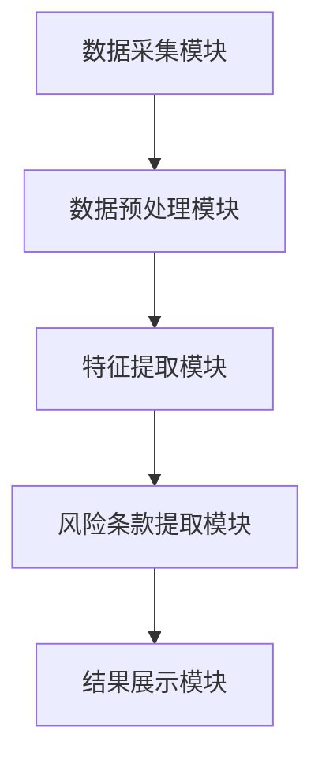

# 构建基于NLP的金融合同风险条款提取系统

> 关键词：自然语言处理（NLP）、金融合同、风险条款提取、深度学习、信息抽取

> 摘要：本文围绕构建基于NLP的金融合同风险条款提取系统展开。首先介绍了该系统构建的背景，包括目的、预期读者、文档结构和相关术语。接着阐述了核心概念，如自然语言处理技术、风险条款的定义等，并给出了系统架构的示意图和流程图。详细讲解了核心算法原理，通过Python代码进行示例说明。对系统涉及的数学模型和公式进行了深入分析并举例。以项目实战的方式展示了开发环境搭建、源代码实现和代码解读。探讨了该系统的实际应用场景，推荐了相关的学习资源、开发工具框架和论文著作。最后总结了系统未来的发展趋势与挑战，还给出了常见问题解答和扩展阅读参考资料。

## 1. 背景介绍 
### 1.1 目的和范围
在金融领域，合同是规范各方权利和义务的重要法律文件。金融合同中往往包含大量的条款，其中一些条款可能存在潜在的风险，如违约条款、利率调整条款等。人工审查金融合同以识别这些风险条款不仅效率低下，而且容易出现疏漏。因此，构建基于NLP的金融合同风险条款提取系统具有重要的现实意义。

本系统的目的是利用自然语言处理技术，自动从金融合同文本中提取出潜在的风险条款，为金融机构和企业提供快速、准确的合同风险评估工具。系统的范围涵盖了常见的金融合同类型，如贷款合同、保险合同、投资合同等。

### 1.2 预期读者
本文的预期读者包括从事自然语言处理、金融科技领域的研究人员和开发者，金融机构的风险管理人员、法务人员，以及对人工智能在金融领域应用感兴趣的技术爱好者。

### 1.3 文档结构概述
本文将按照以下结构进行阐述：首先介绍相关背景知识，包括系统的目的、预期读者和文档结构；接着讲解核心概念，如自然语言处理技术、风险条款的定义等，并给出系统架构的示意图和流程图；详细分析核心算法原理，通过Python代码进行示例说明；对系统涉及的数学模型和公式进行深入探讨并举例；以项目实战的方式展示开发环境搭建、源代码实现和代码解读；探讨系统的实际应用场景；推荐相关的学习资源、开发工具框架和论文著作；最后总结系统未来的发展趋势与挑战，给出常见问题解答和扩展阅读参考资料。

### 1.4 术语表
#### 1.4.1 核心术语定义
- **自然语言处理（NLP）**：是计算机科学、人工智能和语言学交叉领域的一个分支，旨在让计算机能够理解、处理和生成人类语言。
- **金融合同**：是金融领域中各方当事人之间达成的具有法律效力的协议，规定了各方的权利和义务。
- **风险条款**：指金融合同中可能导致一方或多方遭受经济损失、法律纠纷等风险的条款。
- **信息抽取**：是从自然语言文本中提取特定信息的过程，如实体、关系、事件等。

#### 1.4.2 相关概念解释
- **命名实体识别（NER）**：是信息抽取的一个子任务，用于识别文本中的命名实体，如人名、地名、组织机构名等。在金融合同风险条款提取中，可用于识别合同中的金融机构名称、客户姓名等。
- **文本分类**：是将文本划分到不同类别的任务。在本系统中，可用于判断合同条款是否为风险条款。
- **深度学习**：是机器学习的一个分支，通过构建多层神经网络来学习数据的特征和模式。在NLP中，深度学习模型如循环神经网络（RNN）、长短期记忆网络（LSTM）、Transformer等被广泛应用。

#### 1.4.3 缩略词列表
- **NLP**：Natural Language Processing（自然语言处理）
- **NER**：Named Entity Recognition（命名实体识别）
- **RNN**：Recurrent Neural Network（循环神经网络）
- **LSTM**：Long Short-Term Memory（长短期记忆网络）
- **API**：Application Programming Interface（应用程序编程接口）

## 2. 核心概念与联系 

### 核心概念原理
本系统主要涉及以下几个核心概念：
- **自然语言处理（NLP）**：是整个系统的基础，通过各种NLP技术对金融合同文本进行预处理、特征提取和分析。例如，使用分词技术将合同文本拆分成一个个词语，使用词性标注技术为每个词语标注词性，以便后续的处理。
- **信息抽取**：从金融合同文本中提取出与风险条款相关的信息，如条款的主题、风险等级、涉及的金额等。信息抽取可以通过规则匹配、机器学习等方法实现。
- **文本分类**：判断合同条款是否为风险条款，并将其分类到不同的风险类别中，如高风险、中风险、低风险等。文本分类可以使用传统的机器学习算法，如支持向量机（SVM）、朴素贝叶斯（NB），也可以使用深度学习模型，如卷积神经网络（CNN）、循环神经网络（RNN）等。

### 架构的文本示意图
本系统的架构主要包括以下几个部分：
1. **数据采集模块**：负责收集金融合同文本数据，可以从金融机构的数据库、文档管理系统等渠道获取。
2. **数据预处理模块**：对采集到的合同文本数据进行清洗、分词、词性标注等预处理操作，以便后续的处理。
3. **特征提取模块**：从预处理后的文本数据中提取特征，如词向量、句法特征、语义特征等。
4. **风险条款提取模块**：使用信息抽取和文本分类技术，从合同文本中提取出风险条款，并将其分类到不同的风险类别中。
5. **结果展示模块**：将提取出的风险条款以可视化的方式展示给用户，如表格、图表等。

### Mermaid流程图


## 3. 核心算法原理 & 具体操作步骤 

### 核心算法原理
本系统主要使用深度学习模型中的Transformer架构及其变体，如BERT（Bidirectional Encoder Representations from Transformers）来实现风险条款的提取。BERT是一种预训练的语言模型，它通过在大规模文本数据上进行无监督学习，学习到了丰富的语言知识和语义表示。

BERT的核心思想是使用双向Transformer编码器来学习文本的上下文表示。在预训练阶段，BERT使用了两种任务：掩码语言模型（Masked Language Model，MLM）和下一句预测（Next Sentence Prediction，NSP）。在MLM任务中，BERT随机掩码输入文本中的一些词语，然后预测这些掩码词语；在NSP任务中，BERT判断两个句子是否是连续的。通过这两个任务，BERT学习到了文本的语义表示。

在本系统中，我们将使用预训练的BERT模型，并在其基础上进行微调，以适应金融合同风险条款提取的任务。具体来说，我们将合同条款文本作为输入，经过BERT模型处理后，得到文本的特征表示，然后将这些特征输入到一个分类器中，判断该条款是否为风险条款。

### 具体操作步骤
#### 步骤1：数据准备
收集金融合同文本数据，并将其划分为训练集、验证集和测试集。对数据进行标注，标记出哪些条款是风险条款，哪些不是。

#### 步骤2：模型加载
加载预训练的BERT模型，可以使用Hugging Face的Transformers库来实现。以下是一个简单的Python代码示例：
```python
from transformers import BertTokenizer, BertForSequenceClassification

# 加载预训练的BERT分词器
tokenizer = BertTokenizer.from_pretrained('bert-base-uncased')

# 加载预训练的BERT分类模型
model = BertForSequenceClassification.from_pretrained('bert-base-uncased', num_labels=2)
```

#### 步骤3：数据预处理
使用BERT分词器对合同条款文本进行分词和编码，将文本转换为模型可以接受的输入格式。以下是一个示例代码：
```python
import torch

# 示例合同条款文本
text = "本合同规定，若乙方逾期还款超过30天，甲方有权收取高额滞纳金。"

# 分词和编码
inputs = tokenizer(text, return_tensors='pt')

# 输出编码后的输入
print(inputs)
```

#### 步骤4：模型训练
使用训练集对BERT模型进行微调。在训练过程中，需要定义损失函数和优化器，并迭代训练模型。以下是一个简单的训练代码示例：
```python
from torch.utils.data import DataLoader, Dataset
from transformers import AdamW

# 定义自定义数据集类
class FinancialContractDataset(Dataset):
    def __init__(self, texts, labels, tokenizer, max_length):
        self.texts = texts
        self.labels = labels
        self.tokenizer = tokenizer
        self.max_length = max_length

    def __len__(self):
        return len(self.texts)

    def __getitem__(self, idx):
        text = self.texts[idx]
        label = self.labels[idx]
        inputs = self.tokenizer(text, return_tensors='pt', padding='max_length', truncation=True, max_length=self.max_length)
        input_ids = inputs['input_ids'].squeeze()
        attention_mask = inputs['attention_mask'].squeeze()
        return {
            'input_ids': input_ids,
            'attention_mask': attention_mask,
            'labels': torch.tensor(label, dtype=torch.long)
        }

# 示例训练数据
train_texts = ["条款1", "条款2",...]
train_labels = [1, 0,...]

# 创建数据集和数据加载器
train_dataset = FinancialContractDataset(train_texts, train_labels, tokenizer, max_length=128)
train_dataloader = DataLoader(train_dataset, batch_size=16, shuffle=True)

# 定义优化器
optimizer = AdamW(model.parameters(), lr=2e-5)

# 训练模型
device = torch.device('cuda' if torch.cuda.is_available() else 'cpu')
model.to(device)

epochs = 3
for epoch in range(epochs):
    model.train()
    total_loss = 0
    for batch in train_dataloader:
        input_ids = batch['input_ids'].to(device)
        attention_mask = batch['attention_mask'].to(device)
        labels = batch['labels'].to(device)

        optimizer.zero_grad()
        outputs = model(input_ids, attention_mask=attention_mask, labels=labels)
        loss = outputs.loss
        total_loss += loss.item()
        loss.backward()
        optimizer.step()

    print(f'Epoch {epoch + 1}, Loss: {total_loss / len(train_dataloader)}')
```

#### 步骤5：模型评估
使用验证集和测试集对训练好的模型进行评估，计算模型的准确率、召回率、F1值等指标。以下是一个简单的评估代码示例：
```python
from sklearn.metrics import accuracy_score, recall_score, f1_score

# 示例验证数据
val_texts = ["条款3", "条款4",...]
val_labels = [1, 0,...]

# 创建验证数据集和数据加载器
val_dataset = FinancialContractDataset(val_texts, val_labels, tokenizer, max_length=128)
val_dataloader = DataLoader(val_dataset, batch_size=16, shuffle=False)

model.eval()
predictions = []
true_labels = []
with torch.no_grad():
    for batch in val_dataloader:
        input_ids = batch['input_ids'].to(device)
        attention_mask = batch['attention_mask'].to(device)
        labels = batch['labels'].to(device)

        outputs = model(input_ids, attention_mask=attention_mask)
        logits = outputs.logits
        preds = torch.argmax(logits, dim=1)
        predictions.extend(preds.cpu().tolist())
        true_labels.extend(labels.cpu().tolist())

# 计算评估指标
accuracy = accuracy_score(true_labels, predictions)
recall = recall_score(true_labels, predictions)
f1 = f1_score(true_labels, predictions)

print(f'Accuracy: {accuracy}, Recall: {recall}, F1: {f1}')
```

#### 步骤6：风险条款提取
使用训练好的模型对新的金融合同文本进行风险条款提取。以下是一个简单的提取代码示例：
```python
# 示例新合同文本
new_text = "根据本合同，若市场利率波动超过10%，贷款利率将相应调整。"

# 分词和编码
inputs = tokenizer(new_text, return_tensors='pt').to(device)

# 预测
model.eval()
with torch.no_grad():
    outputs = model(**inputs)
    logits = outputs.logits
    preds = torch.argmax(logits, dim=1)

if preds.item() == 1:
    print("该条款是风险条款")
else:
    print("该条款不是风险条款")
```

## 4. 数学模型和公式 & 详细讲解 & 举例说明 

### 掩码语言模型（MLM）
在掩码语言模型任务中，BERT随机掩码输入文本中的一些词语，然后预测这些掩码词语。假设输入文本为 $x = [x_1, x_2,..., x_n]$，其中 $x_i$ 表示第 $i$ 个词语。BERT会随机选择一些词语进行掩码，将其替换为特殊的掩码标记 [MASK]。设掩码后的文本为 $\tilde{x} = [\tilde{x}_1, \tilde{x}_2,..., \tilde{x}_n]$。

BERT的目标是最大化预测掩码词语的概率，即：
$$
\mathcal{L}_{MLM} = - \sum_{i \in \mathcal{M}} \log P(x_i | \tilde{x})
$$
其中 $\mathcal{M}$ 表示被掩码的词语的索引集合，$P(x_i | \tilde{x})$ 表示在输入为 $\tilde{x}$ 的情况下，预测第 $i$ 个词语为 $x_i$ 的概率。

例如，输入文本为 "The dog is running."，假设我们随机掩码了 "dog" 这个词语，将其替换为 [MASK]，得到掩码后的文本 "The [MASK] is running."。BERT的任务就是预测 [MASK] 位置的词语，即最大化 $P(\text{dog} | \text{The [MASK] is running.})$。

### 下一句预测（NSP）
在下一句预测任务中，BERT判断两个句子是否是连续的。给定两个句子 $A$ 和 $B$，BERT的目标是预测 $B$ 是否是 $A$ 的下一句。设 $y$ 是一个二分类标签，$y = 1$ 表示 $B$ 是 $A$ 的下一句，$y = 0$ 表示 $B$ 不是 $A$ 的下一句。

BERT的目标是最大化预测标签的概率，即：
$$
\mathcal{L}_{NSP} = - \sum_{i=1}^{N} [y_i \log P(y_i = 1 | A, B) + (1 - y_i) \log P(y_i = 0 | A, B)]
$$
其中 $N$ 表示训练样本的数量，$P(y_i = 1 | A, B)$ 表示在输入为 $A$ 和 $B$ 的情况下，预测 $B$ 是 $A$ 的下一句的概率。

例如，句子 $A$ 为 "I went to the park."，句子 $B$ 为 "I saw a beautiful flower there."，由于 $B$ 是 $A$ 的下一句，所以 $y = 1$。BERT的任务就是最大化 $P(y = 1 | \text{I went to the park.}, \text{I saw a beautiful flower there.})$。

### 微调损失函数
在微调阶段，我们使用交叉熵损失函数来训练BERT模型进行风险条款分类。设 $y$ 是真实标签，$\hat{y}$ 是模型的预测概率分布。交叉熵损失函数定义为：
$$
\mathcal{L}_{CE} = - \sum_{i=1}^{C} y_i \log \hat{y}_i
$$
其中 $C$ 表示类别数，在风险条款分类任务中，$C = 2$（风险条款和非风险条款）。

例如，假设真实标签 $y = [1, 0]$（表示该条款是风险条款），模型的预测概率分布 $\hat{y} = [0.8, 0.2]$，则交叉熵损失为：
$$
\mathcal{L}_{CE} = - (1 \times \log 0.8 + 0 \times \log 0.2) \approx 0.223
$$

## 5. 项目实战：代码实际案例和详细解释说明 

### 5.1  开发环境搭建
#### 安装Python
首先需要安装Python，建议使用Python 3.7及以上版本。可以从Python官方网站（https://www.python.org/downloads/）下载并安装。

#### 创建虚拟环境
为了避免不同项目之间的依赖冲突，建议使用虚拟环境。可以使用 `venv` 或 `conda` 来创建虚拟环境。以下是使用 `venv` 创建虚拟环境的示例：
```bash
python -m venv financial_contract_env
source financial_contract_env/bin/activate  # 在Windows上使用 financial_contract_env\Scripts\activate
```

#### 安装依赖库
在虚拟环境中安装所需的依赖库，主要包括 `transformers`、`torch`、`sklearn` 等。可以使用 `pip` 进行安装：
```bash
pip install transformers torch scikit-learn
```

### 5.2  源代码详细实现和代码解读
以下是一个完整的基于BERT的金融合同风险条款提取系统的源代码示例：
```python
import torch
from torch.utils.data import DataLoader, Dataset
from transformers import BertTokenizer, BertForSequenceClassification, AdamW
from sklearn.metrics import accuracy_score, recall_score, f1_score

# 定义自定义数据集类
class FinancialContractDataset(Dataset):
    def __init__(self, texts, labels, tokenizer, max_length):
        self.texts = texts
        self.labels = labels
        self.tokenizer = tokenizer
        self.max_length = max_length

    def __len__(self):
        return len(self.texts)

    def __getitem__(self, idx):
        text = self.texts[idx]
        label = self.labels[idx]
        inputs = self.tokenizer(text, return_tensors='pt', padding='max_length', truncation=True, max_length=self.max_length)
        input_ids = inputs['input_ids'].squeeze()
        attention_mask = inputs['attention_mask'].squeeze()
        return {
            'input_ids': input_ids,
            'attention_mask': attention_mask,
            'labels': torch.tensor(label, dtype=torch.long)
        }

# 数据准备
train_texts = ["条款1", "条款2",...]
train_labels = [1, 0,...]
val_texts = ["条款3", "条款4",...]
val_labels = [1, 0,...]

# 加载预训练的BERT分词器和模型
tokenizer = BertTokenizer.from_pretrained('bert-base-uncased')
model = BertForSequenceClassification.from_pretrained('bert-base-uncased', num_labels=2)

# 创建数据集和数据加载器
train_dataset = FinancialContractDataset(train_texts, train_labels, tokenizer, max_length=128)
train_dataloader = DataLoader(train_dataset, batch_size=16, shuffle=True)
val_dataset = FinancialContractDataset(val_texts, val_labels, tokenizer, max_length=128)
val_dataloader = DataLoader(val_dataset, batch_size=16, shuffle=False)

# 定义优化器
optimizer = AdamW(model.parameters(), lr=2e-5)

# 训练模型
device = torch.device('cuda' if torch.cuda.is_available() else 'cpu')
model.to(device)

epochs = 3
for epoch in range(epochs):
    model.train()
    total_loss = 0
    for batch in train_dataloader:
        input_ids = batch['input_ids'].to(device)
        attention_mask = batch['attention_mask'].to(device)
        labels = batch['labels'].to(device)

        optimizer.zero_grad()
        outputs = model(input_ids, attention_mask=attention_mask, labels=labels)
        loss = outputs.loss
        total_loss += loss.item()
        loss.backward()
        optimizer.step()

    print(f'Epoch {epoch + 1}, Loss: {total_loss / len(train_dataloader)}')

# 评估模型
model.eval()
predictions = []
true_labels = []
with torch.no_grad():
    for batch in val_dataloader:
        input_ids = batch['input_ids'].to(device)
        attention_mask = batch['attention_mask'].to(device)
        labels = batch['labels'].to(device)

        outputs = model(input_ids, attention_mask=attention_mask)
        logits = outputs.logits
        preds = torch.argmax(logits, dim=1)
        predictions.extend(preds.cpu().tolist())
        true_labels.extend(labels.cpu().tolist())

# 计算评估指标
accuracy = accuracy_score(true_labels, predictions)
recall = recall_score(true_labels, predictions)
f1 = f1_score(true_labels, predictions)

print(f'Accuracy: {accuracy}, Recall: {recall}, F1: {f1}')

# 风险条款提取
new_text = "根据本合同，若市场利率波动超过10%，贷款利率将相应调整。"
inputs = tokenizer(new_text, return_tensors='pt').to(device)

model.eval()
with torch.no_grad():
    outputs = model(**inputs)
    logits = outputs.logits
    preds = torch.argmax(logits, dim=1)

if preds.item() == 1:
    print("该条款是风险条款")
else:
    print("该条款不是风险条款")
```

### 5.3  代码解读与分析
- **数据集类 `FinancialContractDataset`**：继承自 `torch.utils.data.Dataset`，用于封装金融合同文本数据和标签。在 `__getitem__` 方法中，使用BERT分词器对文本进行分词和编码，并返回输入ID、注意力掩码和标签。
- **数据准备**：定义训练集和验证集的文本数据和标签。
- **模型加载**：使用 `transformers` 库加载预训练的BERT分词器和分类模型。
- **数据加载器**：使用 `torch.utils.data.DataLoader` 创建训练集和验证集的数据加载器，方便批量处理数据。
- **优化器**：使用 `AdamW` 优化器来更新模型的参数。
- **训练过程**：在每个epoch中，将模型设置为训练模式，遍历训练数据加载器，计算损失并进行反向传播和参数更新。
- **评估过程**：将模型设置为评估模式，遍历验证数据加载器，预测标签并计算评估指标。
- **风险条款提取**：对新的合同文本进行分词和编码，使用训练好的模型进行预测，并输出结果。

## 6. 实际应用场景 
### 金融机构风险管理
金融机构如银行、证券、保险等在处理大量的金融合同过程中，需要对合同中的风险条款进行识别和评估。基于NLP的金融合同风险条款提取系统可以帮助金融机构快速、准确地识别潜在的风险条款，为风险管理决策提供支持。例如，银行在审批贷款合同时，可以使用该系统自动检查合同中的违约条款、利率调整条款等，及时发现潜在的风险。

### 企业法务审查
企业在签订各类金融合同前，需要进行法务审查，以确保合同条款符合法律法规和企业的利益。该系统可以帮助企业法务人员快速筛选出合同中的风险条款，提高审查效率，降低法律风险。例如，企业在签订投资合同时，可以使用该系统识别合同中的投资风险、退出机制等条款。

### 监管合规检查
金融监管机构需要对金融机构的合同进行合规检查，确保金融机构遵守相关法律法规和监管要求。基于NLP的金融合同风险条款提取系统可以帮助监管机构快速分析大量的金融合同，发现潜在的合规问题。例如，监管机构可以使用该系统检查金融机构的理财产品合同中是否存在误导性宣传、不合理的收费条款等。

## 7. 工具和资源推荐
### 7.1 学习资源推荐
#### 7.1.1 书籍推荐
- 《自然语言处理入门》：何晗著，本书系统地介绍了自然语言处理的基本概念、算法和应用，适合初学者入门。
- 《深度学习》：Ian Goodfellow、Yoshua Bengio和Aaron Courville著，本书是深度学习领域的经典教材，详细介绍了深度学习的理论和实践。
- 《Python自然语言处理》：Steven Bird、Ewan Klein和Edward Loper著，本书介绍了如何使用Python进行自然语言处理，提供了丰富的代码示例。

#### 7.1.2 在线课程
- Coursera上的“Natural Language Processing Specialization”：由斯坦福大学的教授授课，涵盖了自然语言处理的各个方面，包括词法分析、句法分析、语义分析等。
- edX上的“Deep Learning Specialization”：由Andrew Ng教授授课，介绍了深度学习的基本原理和应用，包括神经网络、卷积神经网络、循环神经网络等。
- 哔哩哔哩（B站）上有许多关于自然语言处理和深度学习的教程视频，适合初学者学习。

#### 7.1.3 技术博客和网站
- Hugging Face博客（https://huggingface.co/blog）：提供了关于自然语言处理和深度学习的最新技术和研究成果，特别是关于Transformer模型和预训练语言模型的介绍。
- Towards Data Science（https://towardsdatascience.com/）：是一个数据科学和机器学习领域的技术博客，有许多关于自然语言处理的文章和教程。
- arXiv（https://arxiv.org/）：是一个预印本平台，提供了大量的学术论文，包括自然语言处理和深度学习领域的最新研究成果。

### 7.2 开发工具框架推荐
#### 7.2.1 IDE和编辑器
- PyCharm：是一款专业的Python集成开发环境，提供了丰富的代码编辑、调试、版本控制等功能，适合Python开发。
- Visual Studio Code：是一款轻量级的代码编辑器，支持多种编程语言，有丰富的插件可以扩展功能，适合快速开发和调试。

#### 7.2.2 调试和性能分析工具
- PyTorch Profiler：是PyTorch提供的性能分析工具，可以帮助开发者分析模型的性能瓶颈，优化代码。
- TensorBoard：是TensorFlow提供的可视化工具，也可以用于PyTorch模型的可视化和调试，方便开发者观察模型的训练过程和性能指标。

#### 7.2.3 相关框架和库
- Transformers：是Hugging Face开发的一个自然语言处理库，提供了丰富的预训练模型和工具，方便开发者进行自然语言处理任务的开发。
- PyTorch：是一个开源的深度学习框架，具有高效的计算性能和丰富的工具库，广泛应用于自然语言处理和深度学习领域。
- scikit-learn：是一个Python机器学习库，提供了各种机器学习算法和工具，可用于数据预处理、模型训练和评估等。

### 7.3 相关论文著作推荐
#### 7.3.1 经典论文
- “Attention Is All You Need”：提出了Transformer架构，是自然语言处理领域的经典论文，为后续的预训练语言模型奠定了基础。
- “BERT: Pre-training of Deep Bidirectional Transformers for Language Understanding”：介绍了BERT模型的预训练方法和应用，开启了预训练语言模型的新时代。

#### 7.3.2 最新研究成果
- 在ACL（Association for Computational Linguistics）、EMNLP（Conference on Empirical Methods in Natural Language Processing）等自然语言处理领域的顶级会议上，有许多关于金融合同风险条款提取、自然语言处理在金融领域应用的最新研究成果。

#### 7.3.3 应用案例分析
- 可以参考一些金融科技公司的研究报告和案例分析，了解基于NLP的金融合同风险条款提取系统在实际应用中的效果和经验。

## 8. 总结：未来发展趋势与挑战
### 未来发展趋势
- **多模态融合**：未来的金融合同风险条款提取系统可能会融合文本、图像、语音等多模态信息，提高风险条款提取的准确性和全面性。例如，对于包含图表和签名的合同文档，可以同时分析文本内容和图像信息。
- **知识图谱的应用**：将知识图谱技术应用于金融合同风险条款提取系统中，可以利用知识图谱的语义信息和推理能力，更好地理解合同条款的含义和潜在风险。例如，通过知识图谱可以关联合同中的金融产品信息、法律法规等，进行更深入的风险分析。
- **实时监测和预警**：随着金融市场的快速变化，未来的系统可能会实现对金融合同风险条款的实时监测和预警。例如，当合同中的某些条件发生变化时，系统可以及时提醒相关人员。

### 挑战
- **数据质量和标注**：金融合同数据往往存在格式不规范、内容复杂等问题，数据质量对系统的性能影响较大。同时，风险条款的标注需要专业的金融知识和法律知识，标注成本较高，且标注的一致性和准确性也需要保证。
- **模型可解释性**：深度学习模型如BERT等往往是黑盒模型，其决策过程难以解释。在金融领域，模型的可解释性非常重要，因为需要向监管机构和客户解释风险评估的依据。如何提高模型的可解释性是一个亟待解决的问题。
- **法律法规的变化**：金融领域的法律法规不断变化，合同条款也需要随之调整。系统需要及时适应法律法规的变化，更新风险条款的定义和识别规则。

## 9. 附录：常见问题与解答
### 问题1：如何收集金融合同数据？
可以从金融机构的数据库、文档管理系统中获取金融合同数据。此外，还可以通过公开数据集、网络爬虫等方式收集相关数据。在收集数据时，需要注意数据的合法性和合规性。

### 问题2：如何处理金融合同中的专业术语？
可以使用专业的金融词典和词向量来处理金融合同中的专业术语。在数据预处理阶段，可以对专业术语进行特殊处理，如进行词法分析、词性标注等。同时，在模型训练阶段，可以使用预训练的金融领域语言模型，提高模型对专业术语的理解能力。

### 问题3：系统的性能如何评估？
可以使用准确率、召回率、F1值等指标来评估系统的性能。此外，还可以进行人工评估，邀请金融专家和法务人员对系统提取的风险条款进行审核，计算系统的准确率和召回率。

### 问题4：如何提高系统的鲁棒性？
可以通过增加训练数据的多样性、进行数据增强、使用正则化方法等方式提高系统的鲁棒性。此外，还可以对模型进行集成学习，将多个模型的预测结果进行融合，提高系统的稳定性和准确性。

## 10. 扩展阅读 & 参考资料
- 《金融科技前沿：自然语言处理在金融领域的应用》
- 《人工智能与金融风险管理》
- ACL、EMNLP等自然语言处理领域顶级会议的论文集
- Hugging Face官方文档（https://huggingface.co/docs）
- PyTorch官方文档（https://pytorch.org/docs/stable/index.html）

作者：AI天才研究院/AI Genius Institute & 禅与计算机程序设计艺术 /Zen And The Art of Computer Programming