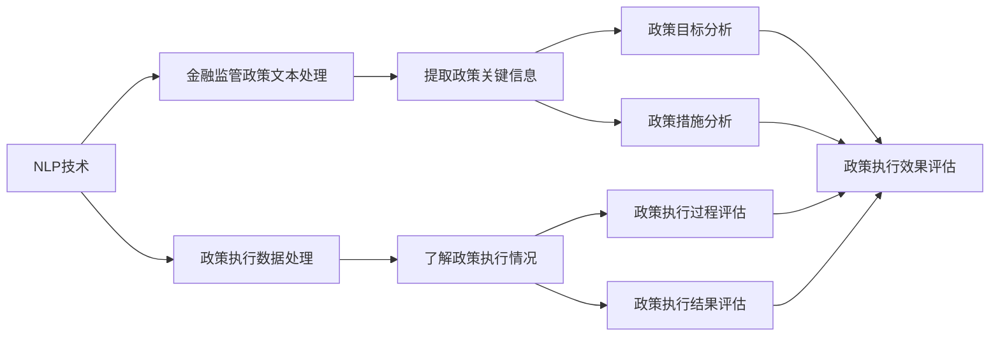

# 构建基于NLP的金融监管政策执行效果评估系统

> 关键词：自然语言处理（NLP）、金融监管政策、执行效果评估、文本挖掘、机器学习

> 摘要：本文聚焦于构建基于自然语言处理（NLP）的金融监管政策执行效果评估系统。随着金融行业的快速发展和监管政策的不断出台，准确评估政策执行效果对于保障金融市场稳定和健康发展至关重要。传统的评估方法往往依赖于人工分析，效率低且主观性强。NLP技术的出现为解决这一问题提供了新的途径。文章将详细介绍该评估系统的核心概念、算法原理、数学模型，通过项目实战展示系统的具体实现，探讨其实际应用场景，推荐相关的工具和资源，并对未来发展趋势与挑战进行总结，旨在为金融监管政策执行效果评估提供一种高效、客观的解决方案。

## 1. 背景介绍 
### 1.1 目的和范围
金融监管政策是维护金融市场稳定、防范金融风险、促进金融行业健康发展的重要手段。准确评估金融监管政策的执行效果，有助于监管机构及时发现政策实施过程中存在的问题，调整和完善政策，提高监管效率。然而，金融监管政策文本通常具有专业性强、内容复杂、数量庞大等特点，传统的人工评估方法难以满足快速、准确评估的需求。

本系统的目的是利用自然语言处理（NLP）技术，开发一个能够自动分析金融监管政策文本和相关执行数据，评估政策执行效果的系统。系统的范围涵盖金融领域各类监管政策，包括银行、证券、保险等行业的政策文件，以及政策执行过程中的相关文本数据，如新闻报道、企业公告、监管报告等。

### 1.2 预期读者
本文的预期读者包括金融监管机构工作人员、金融行业从业者、NLP技术研究人员和开发者、对金融监管政策评估感兴趣的学者等。对于金融监管机构工作人员，该系统可以为政策制定和调整提供科学依据；对于金融行业从业者，有助于理解和遵守监管政策；对于NLP技术研究人员和开发者，可作为NLP技术在金融领域应用的案例参考；对于学者，可作为相关研究的基础资料。

### 1.3 文档结构概述
本文将按照以下结构进行阐述：首先介绍系统相关的核心概念与联系，包括NLP技术、金融监管政策等；接着详细讲解核心算法原理和具体操作步骤，并给出Python源代码示例；然后介绍系统所涉及的数学模型和公式，并通过举例进行说明；再通过项目实战展示系统的具体实现过程，包括开发环境搭建、源代码详细实现和代码解读；之后探讨系统的实际应用场景；推荐相关的工具和资源；总结未来发展趋势与挑战；最后给出附录，解答常见问题，并提供扩展阅读和参考资料。

### 1.4 术语表
#### 1.4.1 核心术语定义
- **自然语言处理（NLP）**：是计算机科学、人工智能和语言学的交叉领域，旨在让计算机能够理解、处理和生成人类语言。
- **金融监管政策**：是政府或金融监管机构为了维护金融市场稳定、防范金融风险、保护投资者利益等目的而制定的一系列规则和措施。
- **政策执行效果评估**：是对金融监管政策在实施过程中所产生的实际效果进行评价和分析的过程。
- **文本挖掘**：是从大量文本数据中发现有价值信息和知识的过程，是NLP的重要应用之一。
- **机器学习**：是一门多领域交叉学科，涉及概率论、统计学、逼近论、凸分析、算法复杂度理论等多门学科。它专门研究计算机怎样模拟或实现人类的学习行为，以获取新的知识或技能，重新组织已有的知识结构使之不断改善自身的性能。

#### 1.4.2 相关概念解释
- **词法分析**：是NLP中的基础任务，主要包括分词、词性标注、命名实体识别等，用于将文本分解为一个个有意义的单元。
- **句法分析**：是分析句子的语法结构，确定句子中各个成分之间的关系。
- **语义分析**：是理解文本的含义，包括词义理解、句子语义理解、篇章语义理解等。
- **情感分析**：是判断文本所表达的情感倾向，如积极、消极、中性等。

#### 1.4.3 缩略词列表
- **NLP**：自然语言处理（Natural Language Processing）
- **ML**：机器学习（Machine Learning）
- **LDA**：潜在狄利克雷分配（Latent Dirichlet Allocation）
- **TF-IDF**：词频 - 逆文档频率（Term Frequency - Inverse Document Frequency）

## 2. 核心概念与联系 

### 2.1 自然语言处理（NLP）技术原理
自然语言处理是让计算机能够理解、处理和生成人类语言的技术。其核心任务包括词法分析、句法分析、语义分析等。

词法分析是将文本分解为一个个有意义的单元，如分词、词性标注、命名实体识别等。例如，对于句子“中国人民银行发布了新的金融监管政策”，分词后可以得到“中国人民银行”、“发布”、“了”、“新的”、“金融监管政策”等词语。词性标注可以确定每个词语的词性，如“中国人民银行”是名词，“发布”是动词。命名实体识别可以识别出句子中的实体，如“中国人民银行”是组织机构名。

句法分析是分析句子的语法结构，确定句子中各个成分之间的关系。例如，对于上述句子，句法分析可以确定“中国人民银行”是主语，“发布”是谓语，“金融监管政策”是宾语。

语义分析是理解文本的含义，包括词义理解、句子语义理解、篇章语义理解等。例如，理解“金融监管政策”的含义，以及整个句子所表达的事件。

### 2.2 金融监管政策执行效果评估的核心要素
金融监管政策执行效果评估的核心要素包括政策目标、政策执行过程、政策执行结果等。

政策目标是政策制定的出发点和落脚点，是评估政策执行效果的重要依据。例如，金融监管政策的目标可能包括维护金融市场稳定、防范金融风险、保护投资者利益等。

政策执行过程是政策从制定到实施的一系列活动，包括政策宣传、政策落实、政策监督等。评估政策执行过程可以了解政策在实施过程中是否得到有效执行。

政策执行结果是政策实施后所产生的实际效果，包括经济效果、社会效果等。评估政策执行结果可以判断政策是否达到了预期目标。

### 2.3 核心概念的联系
NLP技术在金融监管政策执行效果评估中起着关键作用。通过NLP技术，可以对金融监管政策文本和相关执行数据进行处理和分析，提取有用信息，从而实现对政策执行效果的评估。

例如，利用词法分析和句法分析技术，可以对政策文本进行解析，提取政策的关键信息，如政策目标、政策措施等。利用语义分析和情感分析技术，可以对政策执行数据进行分析，了解政策执行过程中的情况和公众对政策的态度。

以下是核心概念联系的Mermaid流程图：


## 3. 核心算法原理 & 具体操作步骤 

### 3.1 文本预处理算法
文本预处理是NLP任务的基础，主要包括去除噪声、分词、词性标注等操作。以下是使用Python的`jieba`库进行中文分词的示例代码：
```python
import jieba

def preprocess_text(text):
    # 去除噪声，如标点符号、空格等
    import re
    text = re.sub(r'[^\w\s]', '', text)
    # 分词
    words = jieba.lcut(text)
    return words

# 示例文本
text = "中国人民银行发布了新的金融监管政策"
words = preprocess_text(text)
print(words)
```
在上述代码中，首先使用正则表达式去除文本中的标点符号，然后使用`jieba`库进行分词。

### 3.2 特征提取算法
特征提取是将文本数据转换为计算机能够处理的数值特征的过程。常用的特征提取方法包括词频 - 逆文档频率（TF-IDF）、词嵌入等。以下是使用Python的`sklearn`库进行TF-IDF特征提取的示例代码：
```python
from sklearn.feature_extraction.text import TfidfVectorizer

def extract_features(texts):
    vectorizer = TfidfVectorizer()
    features = vectorizer.fit_transform(texts)
    return features, vectorizer

# 示例文本列表
texts = ["中国人民银行发布了新的金融监管政策", "金融监管政策对市场有重要影响"]
features, vectorizer = extract_features(texts)
print(features.toarray())
```
在上述代码中，使用`TfidfVectorizer`类将文本列表转换为TF-IDF特征矩阵。

### 3.3 分类算法
分类算法用于对文本进行分类，例如判断政策执行数据是积极的、消极的还是中性的。常用的分类算法包括逻辑回归、支持向量机、决策树等。以下是使用Python的`sklearn`库进行逻辑回归分类的示例代码：
```python
from sklearn.linear_model import LogisticRegression
from sklearn.model_selection import train_test_split
from sklearn.metrics import accuracy_score

def classify_text(features, labels):
    X_train, X_test, y_train, y_test = train_test_split(features, labels, test_size=0.2, random_state=42)
    model = LogisticRegression()
    model.fit(X_train, y_train)
    y_pred = model.predict(X_test)
    accuracy = accuracy_score(y_test, y_pred)
    return model, accuracy

# 示例标签列表
labels = [1, 0]
model, accuracy = classify_text(features, labels)
print("Accuracy:", accuracy)
```
在上述代码中，使用`LogisticRegression`类进行逻辑回归分类，并计算分类准确率。

### 3.4 具体操作步骤
1. **数据收集**：收集金融监管政策文本和相关执行数据，包括政策文件、新闻报道、企业公告、监管报告等。
2. **文本预处理**：对收集到的数据进行预处理，包括去除噪声、分词、词性标注等操作。
3. **特征提取**：将预处理后的文本数据转换为数值特征，如使用TF-IDF、词嵌入等方法。
4. **模型训练**：使用分类算法对特征数据进行训练，得到分类模型。
5. **效果评估**：使用训练好的模型对新的政策执行数据进行分类，评估政策执行效果。

## 4. 数学模型和公式 & 详细讲解 & 举例说明 

### 4.1 词频 - 逆文档频率（TF-IDF）
词频 - 逆文档频率（TF-IDF）是一种常用的文本特征提取方法，用于衡量一个词语在文档中的重要性。其计算公式如下：
$$TF - IDF(t, d, D) = TF(t, d) \times IDF(t, D)$$
其中，$TF(t, d)$ 表示词语 $t$ 在文档 $d$ 中的词频，即词语 $t$ 在文档 $d$ 中出现的次数；$IDF(t, D)$ 表示词语 $t$ 的逆文档频率，计算公式为：
$$IDF(t, D) = \log\frac{|D|}{|d \in D : t \in d| + 1}$$
其中，$|D|$ 表示文档集合 $D$ 中的文档总数，$|d \in D : t \in d|$ 表示包含词语 $t$ 的文档数。

例如，假设有文档集合 $D = \{d_1, d_2, d_3\}$，其中 $d_1$ 包含词语“金融监管政策” 2 次，$d_2$ 包含词语“金融监管政策” 1 次，$d_3$ 不包含该词语。则词语“金融监管政策”在 $d_1$ 中的词频 $TF$ 为 2，在整个文档集合中的逆文档频率 $IDF$ 为：
$$IDF = \log\frac{3}{2 + 1} = \log1 = 0$$
因此，词语“金融监管政策”在 $d_1$ 中的 TF-IDF 值为 $2 \times 0 = 0$。

### 4.2 逻辑回归
逻辑回归是一种常用的分类算法，用于解决二分类问题。其基本原理是通过逻辑函数将线性回归的结果映射到 $[0, 1]$ 区间，从而得到样本属于正类的概率。

逻辑函数的表达式为：
$$\sigma(z) = \frac{1}{1 + e^{-z}}$$
其中，$z$ 是线性回归的结果，即 $z = \theta_0 + \theta_1x_1 + \theta_2x_2 + \cdots + \theta_nx_n$，$\theta$ 是模型的参数，$x$ 是样本的特征。

逻辑回归的损失函数通常使用对数损失函数，其表达式为：
$$J(\theta) = -\frac{1}{m}\sum_{i = 1}^{m}[y^{(i)}\log(h_{\theta}(x^{(i)})) + (1 - y^{(i)})\log(1 - h_{\theta}(x^{(i)}))]$$
其中，$m$ 是样本数量，$y^{(i)}$ 是第 $i$ 个样本的真实标签，$h_{\theta}(x^{(i)})$ 是第 $i$ 个样本属于正类的概率。

例如，假设有一个二分类问题，样本的特征为 $x = [1, 2]$，模型的参数为 $\theta = [0.1, 0.2]$，则线性回归的结果为：
$$z = 0.1 + 0.2 \times 1 + 0.2 \times 2 = 0.7$$
逻辑函数的结果为：
$$\sigma(z) = \frac{1}{1 + e^{-0.7}} \approx 0.668$$
即样本属于正类的概率约为 0.668。

## 5. 项目实战：代码实际案例和详细解释说明 

### 5.1  开发环境搭建
本项目使用Python语言进行开发，需要安装以下库：
- `jieba`：用于中文分词
- `sklearn`：用于机器学习算法
- `pandas`：用于数据处理
- `numpy`：用于数值计算

可以使用以下命令进行安装：
```sh
pip install jieba sklearn pandas numpy
```

### 5.2  源代码详细实现和代码解读
以下是一个完整的基于NLP的金融监管政策执行效果评估系统的实现代码：
```python
import jieba
from sklearn.feature_extraction.text import TfidfVectorizer
from sklearn.linear_model import LogisticRegression
from sklearn.model_selection import train_test_split
from sklearn.metrics import accuracy_score
import pandas as pd
import numpy as np

# 文本预处理函数
def preprocess_text(text):
    import re
    text = re.sub(r'[^\w\s]', '', text)
    words = jieba.lcut(text)
    return " ".join(words)

# 数据加载和预处理
def load_and_preprocess_data(file_path):
    data = pd.read_csv(file_path)
    texts = data['text'].apply(preprocess_text)
    labels = data['label']
    return texts, labels

# 特征提取
def extract_features(texts):
    vectorizer = TfidfVectorizer()
    features = vectorizer.fit_transform(texts)
    return features, vectorizer

# 模型训练和评估
def train_and_evaluate(features, labels):
    X_train, X_test, y_train, y_test = train_test_split(features, labels, test_size=0.2, random_state=42)
    model = LogisticRegression()
    model.fit(X_train, y_train)
    y_pred = model.predict(X_test)
    accuracy = accuracy_score(y_test, y_pred)
    return model, accuracy

# 主函数
def main():
    file_path = 'data.csv'
    texts, labels = load_and_preprocess_data(file_path)
    features, vectorizer = extract_features(texts)
    model, accuracy = train_and_evaluate(features, labels)
    print("Accuracy:", accuracy)

if __name__ == "__main__":
    main()
```
### 代码解读与分析
1. **文本预处理函数 `preprocess_text`**：该函数使用正则表达式去除文本中的标点符号，然后使用`jieba`库进行分词，最后将分词结果用空格连接成字符串。
2. **数据加载和预处理函数 `load_and_preprocess_data`**：该函数使用`pandas`库读取CSV文件，对文件中的文本数据进行预处理，并提取标签数据。
3. **特征提取函数 `extract_features`**：该函数使用`TfidfVectorizer`类将文本数据转换为TF-IDF特征矩阵。
4. **模型训练和评估函数 `train_and_evaluate`**：该函数使用`train_test_split`函数将特征数据和标签数据分为训练集和测试集，然后使用`LogisticRegression`类进行逻辑回归分类，最后计算分类准确率。
5. **主函数 `main`**：该函数调用上述函数，完成数据加载、预处理、特征提取、模型训练和评估的整个流程。

## 6. 实际应用场景 
### 6.1 金融监管机构