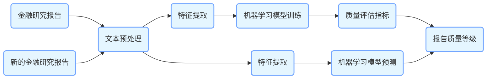

# 构建基于NLP的金融研究报告质量评估系统

> 关键词：自然语言处理（NLP）、金融研究报告、质量评估系统、文本分析、机器学习

> 摘要：本文聚焦于构建基于自然语言处理（NLP）的金融研究报告质量评估系统。首先介绍了该系统构建的背景、目的和适用读者，阐述了文档结构和相关术语。接着详细讲解了核心概念、算法原理及具体操作步骤，包括使用Python代码实现关键算法。同时给出了数学模型和公式，并结合实例说明。通过项目实战，展示了开发环境搭建、源代码实现与解读。探讨了该系统在金融领域的实际应用场景，推荐了学习资源、开发工具框架和相关论文著作。最后总结了系统的未来发展趋势与挑战，还设置了常见问题解答和扩展阅读参考资料。

## 1. 背景介绍 
### 1.1 目的和范围
金融研究报告是金融市场中重要的信息来源，其质量的高低直接影响投资者的决策和金融机构的声誉。然而，由于报告数量众多且内容复杂，人工评估报告质量效率低下且主观性较强。因此，构建基于NLP的金融研究报告质量评估系统的目的在于利用自然语言处理技术实现对金融研究报告质量的客观、高效评估。

本系统的范围涵盖了对金融研究报告的多个维度评估，包括报告的准确性、完整性、逻辑性、可读性等。评估对象主要是各类金融机构发布的股票研究报告、行业研究报告、宏观经济研究报告等。

### 1.2 预期读者
本系统的预期读者包括金融从业者，如分析师、投资经理等，他们可以借助该系统快速评估研究报告的质量，辅助投资决策；金融机构的管理层，可用于监控内部研究报告的质量；以及对自然语言处理和金融领域交叉应用感兴趣的科研人员和学生。

### 1.3 文档结构概述
本文将按照以下结构进行阐述：首先介绍相关背景知识和术语；接着讲解核心概念及它们之间的联系，通过文本示意图和Mermaid流程图展示；然后详细说明核心算法原理和具体操作步骤，并用Python代码实现；给出相关数学模型和公式，并举例说明；通过项目实战展示系统的开发过程，包括环境搭建、代码实现和解读；探讨系统的实际应用场景；推荐学习资源、开发工具框架和相关论文著作；最后总结系统的未来发展趋势与挑战，提供常见问题解答和扩展阅读参考资料。

### 1.4 术语表
#### 1.4.1 核心术语定义
- **自然语言处理（NLP）**：是计算机科学、人工智能和语言学交叉领域的一个分支，旨在让计算机能够理解、处理和生成人类语言。
- **金融研究报告**：金融机构或分析师对金融市场、行业、公司等进行研究和分析后发布的报告，用于为投资者提供决策依据。
- **质量评估**：对金融研究报告的各个方面进行量化或定性的评价，以确定其质量水平。

#### 1.4.2 相关概念解释
- **文本分析**：对文本数据进行预处理、特征提取、情感分析等操作，以获取文本中的有用信息。
- **机器学习**：是一门多领域交叉学科，涉及概率论、统计学、逼近论、凸分析、算法复杂度理论等多门学科。它专门研究计算机怎样模拟或实现人类的学习行为，以获取新的知识或技能，重新组织已有的知识结构使之不断改善自身的性能。

#### 1.4.3 缩略词列表
- **NLP**：Natural Language Processing（自然语言处理）
- **TF-IDF**：Term Frequency - Inverse Document Frequency（词频 - 逆文档频率）
- **SVM**：Support Vector Machine（支持向量机）

## 2. 核心概念与联系 
### 核心概念原理
本系统的核心概念主要包括自然语言处理技术、金融研究报告质量评估指标以及机器学习模型。

自然语言处理技术是实现系统的基础，它包括文本预处理、特征提取、文本分类等任务。文本预处理主要是对金融研究报告进行清洗，去除噪声信息，如标点符号、停用词等；特征提取则是从文本中提取有代表性的特征，如词频、词性等；文本分类用于将报告分类到不同的质量等级。

金融研究报告质量评估指标是系统评估的依据，主要包括准确性、完整性、逻辑性、可读性等。准确性指报告中的数据和信息是否准确无误；完整性要求报告涵盖研究对象的各个方面；逻辑性体现报告的论证过程是否合理；可读性则关注报告的语言表达是否清晰易懂。

机器学习模型用于根据提取的特征对报告质量进行评估。常见的机器学习模型有支持向量机（SVM）、决策树、神经网络等。这些模型通过对大量标注数据的学习，建立特征与质量等级之间的映射关系。

### 文本示意图
```plaintext
金融研究报告质量评估系统
|
|-- 自然语言处理技术
|   |-- 文本预处理
|   |   |-- 去除噪声
|   |   |-- 分词
|   |   |-- 词性标注
|   |-- 特征提取
|   |   |-- 词频统计
|   |   |-- TF-IDF
|   |   |-- 词性特征
|   |-- 文本分类
|       |-- 机器学习模型
|           |-- SVM
|           |-- 决策树
|           |-- 神经网络
|
|-- 金融研究报告质量评估指标
|   |-- 准确性
|   |-- 完整性
|   |-- 逻辑性
|   |-- 可读性
|
|-- 机器学习模型
|   |-- 训练
|   |-- 预测
```

### Mermaid流程图


## 3. 核心算法原理 & 具体操作步骤 
### 核心算法原理
本系统主要使用TF-IDF算法进行特征提取，使用支持向量机（SVM）进行分类。

#### TF-IDF算法
TF-IDF（Term Frequency - Inverse Document Frequency）是一种常用的文本特征提取方法，用于评估一个词在文档中的重要性。其基本思想是：如果一个词在某个文档中出现的频率较高，而在其他文档中出现的频率较低，那么这个词对该文档具有较高的区分度。

TF-IDF的计算公式为：
$$TF - IDF(t, d, D) = TF(t, d) \times IDF(t, D)$$
其中，$TF(t, d)$ 表示词 $t$ 在文档 $d$ 中的词频，即词 $t$ 在文档 $d$ 中出现的次数除以文档 $d$ 中词的总数；$IDF(t, D)$ 表示词 $t$ 的逆文档频率，计算公式为：
$$IDF(t, D) = \log\frac{|D|}{|{d \in D: t \in d}| + 1}$$
其中，$|D|$ 表示文档集合 $D$ 中文档的总数，$|{d \in D: t \in d}|$ 表示包含词 $t$ 的文档数量。

#### 支持向量机（SVM）
支持向量机是一种二分类模型，其基本思想是在特征空间中找到一个最优的超平面，使得不同类别的样本能够被最大程度地分开。对于线性可分的情况，SVM通过求解以下优化问题来找到最优超平面：
$$\min_{\mathbf{w}, b} \frac{1}{2} \|\mathbf{w}\|^2$$
$$\text{s.t. } y_i(\mathbf{w}^T \mathbf{x}_i + b) \geq 1, i = 1, \cdots, n$$
其中，$\mathbf{w}$ 是超平面的法向量，$b$ 是偏置项，$\mathbf{x}_i$ 是第 $i$ 个样本的特征向量，$y_i$ 是第 $i$ 个样本的类别标签。

对于线性不可分的情况，SVM引入了松弛变量 $\xi_i$ 和惩罚参数 $C$，优化问题变为：
$$\min_{\mathbf{w}, b, \xi} \frac{1}{2} \|\mathbf{w}\|^2 + C \sum_{i=1}^{n} \xi_i$$
$$\text{s.t. } y_i(\mathbf{w}^T \mathbf{x}_i + b) \geq 1 - \xi_i, \xi_i \geq 0, i = 1, \cdots, n$$

### 具体操作步骤
#### 步骤1：数据收集与预处理
收集大量的金融研究报告，并对其进行预处理。以下是使用Python实现的文本预处理代码：
```python
import re
import jieba
from sklearn.feature_extraction.text import TfidfVectorizer
from sklearn.svm import SVC
import pandas as pd

# 读取停用词列表
def read_stopwords(file_path):
    with open(file_path, 'r', encoding='utf-8') as f:
        stopwords = [line.strip() for line in f.readlines()]
    return stopwords

# 文本预处理
def preprocess_text(text, stopwords):
    # 去除标点符号
    text = re.sub(r'[^\w\s]', '', text)
    # 分词
    words = jieba.lcut(text)
    # 去除停用词
    filtered_words = [word for word in words if word not in stopwords]
    return ' '.join(filtered_words)

# 示例数据
data = pd.read_csv('financial_reports.csv')
stopwords = read_stopwords('stopwords.txt')
data['processed_text'] = data['text'].apply(lambda x: preprocess_text(x, stopwords))
```

#### 步骤2：特征提取
使用TF-IDF算法提取文本特征：
```python
# 特征提取
vectorizer = TfidfVectorizer()
X = vectorizer.fit_transform(data['processed_text'])
y = data['label']
```

#### 步骤3：模型训练
使用支持向量机（SVM）进行模型训练：
```python
# 模型训练
model = SVC()
model.fit(X, y)
```

#### 步骤4：模型评估与预测
对模型进行评估，并使用训练好的模型对新的金融研究报告进行预测：
```python
from sklearn.model_selection import train_test_split
from sklearn.metrics import accuracy_score

# 划分训练集和测试集
X_train, X_test, y_train, y_test = train_test_split(X, y, test_size=0.2, random_state=42)

# 重新训练模型
model.fit(X_train, y_train)

# 模型预测
y_pred = model.predict(X_test)

# 模型评估
accuracy = accuracy_score(y_test, y_pred)
print(f"模型准确率: {accuracy}")

# 对新报告进行预测
new_report = "这是一份新的金融研究报告。"
new_report_processed = preprocess_text(new_report, stopwords)
new_report_vector = vectorizer.transform([new_report_processed])
predicted_label = model.predict(new_report_vector)
print(f"新报告的预测质量等级: {predicted_label[0]}")
```

## 4. 数学模型和公式 & 详细讲解 & 举例说明 
### TF-IDF数学模型和公式
#### 详细讲解
TF-IDF的核心思想是结合词频（TF）和逆文档频率（IDF）来评估一个词在文档中的重要性。词频（TF）反映了一个词在文档中出现的频繁程度，出现次数越多，说明该词对文档的代表性越强。但仅仅依靠词频可能会导致一些常见词（如“的”、“是”等）的权重过高，因此引入了逆文档频率（IDF）。逆文档频率衡量了一个词在整个文档集合中的普遍程度，一个词在越多的文档中出现，其逆文档频率就越低，说明该词的区分度越低。

#### 举例说明
假设有一个文档集合 $D$ 包含3篇文档：
- $d_1$: "苹果 手机 性能 好"
- $d_2$: "苹果 公司 市值 高"
- $d_3$: "华为 手机 性价比 高"

我们来计算词“苹果”在文档 $d_1$ 中的TF-IDF值。

首先计算词频（TF）：
文档 $d_1$ 中总共有4个词，“苹果”出现了1次，所以 $TF(苹果, d_1) = \frac{1}{4} = 0.25$。

然后计算逆文档频率（IDF）：
文档集合 $D$ 中总共有3篇文档，包含“苹果”的文档有2篇，所以 $IDF(苹果, D) = \log\frac{3}{2 + 1} = \log 1 = 0$。

最后计算TF-IDF值：
$TF - IDF(苹果, d_1, D) = TF(苹果, d_1) \times IDF(苹果, D) = 0.25 \times 0 = 0$

### 支持向量机（SVM）数学模型和公式
#### 详细讲解
支持向量机的目标是在特征空间中找到一个最优的超平面，使得不同类别的样本能够被最大程度地分开。对于线性可分的情况，我们希望找到一个超平面 $\mathbf{w}^T \mathbf{x} + b = 0$，使得所有正类样本 $\mathbf{x}_i$ 满足 $\mathbf{w}^T \mathbf{x}_i + b \geq 1$，所有负类样本 $\mathbf{x}_j$ 满足 $\mathbf{w}^T \mathbf{x}_j + b \leq -1$。同时，我们希望超平面到最近样本点的距离（即间隔）最大，这可以通过最小化 $\frac{1}{2} \|\mathbf{w}\|^2$ 来实现。

对于线性不可分的情况，我们引入了松弛变量 $\xi_i$ 来允许一些样本点违反间隔约束，但会对违反约束的样本点进行惩罚，惩罚参数 $C$ 控制了惩罚的程度。

#### 举例说明
假设有一个二维特征空间，有两个类别的样本点：
- 正类样本：$(1, 2)$，$(2, 3)$
- 负类样本：$(3, 1)$，$(4, 2)$

我们的目标是找到一个最优的超平面 $w_1x_1 + w_2x_2 + b = 0$ 来分开这两类样本。通过求解支持向量机的优化问题，我们可以得到 $\mathbf{w} = (w_1, w_2)$ 和 $b$ 的值，从而确定超平面的位置。

## 5. 项目实战：代码实际案例和详细解释说明 
### 5.1  开发环境搭建
#### 操作系统
建议使用Windows、Linux或macOS操作系统。

#### Python环境
安装Python 3.6及以上版本，可以从Python官方网站（https://www.python.org/downloads/）下载安装包进行安装。

#### 依赖库安装
使用pip安装以下依赖库：
```bash
pip install pandas jieba scikit-learn
```

### 5.2  源代码详细实现和代码解读
```python
import re
import jieba
from sklearn.feature_extraction.text import TfidfVectorizer
from sklearn.svm import SVC
import pandas as pd
from sklearn.model_selection import train_test_split
from sklearn.metrics import accuracy_score

# 读取停用词列表
def read_stopwords(file_path):
    with open(file_path, 'r', encoding='utf-8') as f:
        stopwords = [line.strip() for line in f.readlines()]
    return stopwords

# 文本预处理
def preprocess_text(text, stopwords):
    # 去除标点符号
    text = re.sub(r'[^\w\s]', '', text)
    # 分词
    words = jieba.lcut(text)
    # 去除停用词
    filtered_words = [word for word in words if word not in stopwords]
    return ' '.join(filtered_words)

# 主函数
def main():
    # 读取数据
    data = pd.read_csv('financial_reports.csv')
    stopwords = read_stopwords('stopwords.txt')
    
    # 文本预处理
    data['processed_text'] = data['text'].apply(lambda x: preprocess_text(x, stopwords))
    
    # 特征提取
    vectorizer = TfidfVectorizer()
    X = vectorizer.fit_transform(data['processed_text'])
    y = data['label']
    
    # 划分训练集和测试集
    X_train, X_test, y_train, y_test = train_test_split(X, y, test_size=0.2, random_state=42)
    
    # 模型训练
    model = SVC()
    model.fit(X_train, y_train)
    
    # 模型预测
    y_pred = model.predict(X_test)
    
    # 模型评估
    accuracy = accuracy_score(y_test, y_pred)
    print(f"模型准确率: {accuracy}")
    
    # 对新报告进行预测
    new_report = "这是一份新的金融研究报告。"
    new_report_processed = preprocess_text(new_report, stopwords)
    new_report_vector = vectorizer.transform([new_report_processed])
    predicted_label = model.predict(new_report_vector)
    print(f"新报告的预测质量等级: {predicted_label[0]}")

if __name__ == "__main__":
    main()
```

### 代码解读与分析
#### 读取停用词列表
`read_stopwords` 函数用于读取停用词文件，并将停用词存储在一个列表中。停用词是一些常见的、对文本分类没有太大意义的词，如“的”、“是”等，去除停用词可以减少噪声，提高模型的准确性。

#### 文本预处理
`preprocess_text` 函数对文本进行预处理，包括去除标点符号、分词和去除停用词。使用正则表达式去除标点符号，使用 `jieba` 库进行中文分词。

#### 特征提取
使用 `TfidfVectorizer` 类将预处理后的文本转换为TF-IDF特征向量。该类会自动计算每个词的TF-IDF值，并将文本表示为一个稀疏矩阵。

#### 模型训练与评估
使用 `SVC` 类创建一个支持向量机模型，并使用训练集进行训练。使用 `train_test_split` 函数将数据集划分为训练集和测试集，使用 `accuracy_score` 函数计算模型的准确率。

#### 新报告预测
对新的金融研究报告进行预处理和特征提取，然后使用训练好的模型进行预测。

## 6. 实际应用场景 
### 金融机构内部评估
金融机构可以使用该系统对内部分析师撰写的研究报告进行质量评估，确保报告的准确性、完整性和逻辑性。通过及时发现报告中的问题，金融机构可以提高研究报告的质量，增强自身的声誉和竞争力。

### 投资者决策辅助
投资者可以利用该系统评估不同金融机构发布的研究报告质量，从而更准确地筛选出有价值的信息，辅助投资决策。例如，投资者可以优先参考质量评估等级较高的研究报告，降低投资风险。

### 监管机构监督
监管机构可以使用该系统对金融市场中的研究报告进行监测和监管，确保报告内容符合相关法规和规范。通过对报告质量的评估，监管机构可以及时发现违规行为，维护金融市场的稳定和健康发展。

## 7. 工具和资源推荐
### 7.1 学习资源推荐
#### 7.1.1 书籍推荐
- 《自然语言处理入门》：何晗著，本书系统地介绍了自然语言处理的基础知识和常用技术，适合初学者入门。
- 《机器学习》：周志华著，也被称为“西瓜书”，全面介绍了机器学习的基本概念、算法和应用，是机器学习领域的经典教材。
- 《Python自然语言处理》：Steven Bird、Ewan Klein和Edward Loper著，本书详细介绍了如何使用Python进行自然语言处理，提供了丰富的实例代码。

#### 7.1.2 在线课程
- Coursera上的“Natural Language Processing Specialization”：由顶尖大学的教授授课，涵盖了自然语言处理的多个方面，包括文本分类、情感分析等。
- edX上的“Introduction to Artificial Intelligence”：介绍了人工智能的基本概念和方法，其中包括自然语言处理的相关内容。
- 中国大学MOOC上的“机器学习”：由国内知名高校的教师授课，内容丰富，适合国内学习者。

#### 7.1.3 技术博客和网站
- 博客园：有很多开发者分享自然语言处理和机器学习的技术文章和实践经验。
- 开源中国：提供了大量的开源项目和技术文章，涵盖了自然语言处理的各个领域。
- Medium：有许多专业的技术博客，其中不乏关于自然语言处理和金融科技的优质文章。

### 7.2 开发工具框架推荐
#### 7.2.1 IDE和编辑器
- PyCharm：一款功能强大的Python集成开发环境，提供了代码编辑、调试、版本控制等功能，适合专业开发者使用。
- Jupyter Notebook：一种交互式的开发环境，支持代码、文本、图像等多种形式的展示，适合数据探索和模型开发。
- Visual Studio Code：一款轻量级的代码编辑器，支持多种编程语言和插件扩展，可用于自然语言处理项目的开发。

#### 7.2.2 调试和性能分析工具
- Py-Spy：一个简单易用的Python性能分析工具，可以帮助开发者找出代码中的性能瓶颈。
- cProfile：Python标准库中的性能分析模块，可以对代码的执行时间和函数调用情况进行详细分析。
- TensorBoard：TensorFlow提供的可视化工具，可以用于监控模型的训练过程和性能指标。

#### 7.2.3 相关框架和库
- NLTK：Natural Language Toolkit，是Python中最常用的自然语言处理库之一，提供了丰富的语料库和工具，如分词、词性标注、命名实体识别等。
- spaCy：一个高效的自然语言处理库，专注于处理大规模文本数据，具有快速、易用的特点。
- Scikit-learn：一个简单易用的机器学习库，提供了多种机器学习算法和工具，如分类、回归、聚类等。

### 7.3 相关论文著作推荐
#### 7.3.1 经典论文
- “A Statistical Approach to Machine Translation”：由Peter F. Brown等人发表，奠定了统计机器翻译的基础。
- “Long Short-Term Memory”：由Sepp Hochreiter和Jürgen Schmidhuber发表，介绍了长短期记忆网络（LSTM）的原理和应用。
- “Support-Vector Networks”：由Corinna Cortes和Vladimir Vapnik发表，提出了支持向量机（SVM）的理论和算法。

#### 7.3.2 最新研究成果
- 在ACL（Association for Computational Linguistics）、EMNLP（Conference on Empirical Methods in Natural Language Processing）等自然语言处理领域的顶级会议上，每年都会有大量的最新研究成果发表，关注这些会议的论文可以了解该领域的最新动态。
- arXiv.org是一个预印本平台，很多研究者会在上面发布他们的最新研究成果，及时关注相关领域的论文可以获取最前沿的研究信息。

#### 7.3.3 应用案例分析
- 《金融科技前沿：应用实践与案例剖析》：本书介绍了金融科技在各个领域的应用实践和案例分析，其中包括自然语言处理在金融研究报告分析中的应用。
- 一些知名金融机构的研究报告和白皮书也会分享他们在金融研究报告质量评估方面的实践经验和案例，可以作为参考。

## 8. 总结：未来发展趋势与挑战
### 未来发展趋势
#### 多模态融合
未来的金融研究报告质量评估系统可能会融合多种模态的数据，如文本、图像、音频等。例如，研究报告中可能会包含图表、图片等信息，通过结合图像识别技术，可以更全面地评估报告的质量。

#### 深度学习的广泛应用
随着深度学习技术的不断发展，其在自然语言处理领域的应用将越来越广泛。未来的评估系统可能会采用更复杂的深度学习模型，如Transformer、BERT等，以提高评估的准确性和效率。

#### 个性化评估
根据不同用户的需求和偏好，系统可以提供个性化的评估结果。例如，投资者可以根据自己的投资风格和风险偏好，定制评估指标和权重，从而获得更符合自己需求的报告质量评估结果。

### 挑战
#### 数据质量问题
金融研究报告的数据质量参差不齐，可能存在数据缺失、错误、不一致等问题。如何处理这些数据质量问题，提高数据的可用性和可靠性，是系统面临的一个挑战。

#### 模型解释性
深度学习模型通常是黑盒模型，其决策过程难以解释。在金融领域，模型的解释性非常重要，因为投资者和监管机构需要了解模型是如何做出评估决策的。如何提高模型的解释性，是未来需要解决的一个问题。

#### 法律法规和隐私问题
金融研究报告涉及大量的敏感信息，如公司财务数据、市场预测等。在处理这些数据时，需要遵守相关的法律法规和隐私政策，确保数据的安全和合规使用。

## 9. 附录：常见问题与解答
### 问题1：如何选择合适的停用词列表？
解答：可以使用通用的停用词列表，如哈工大停用词表、百度停用词表等。也可以根据具体的应用场景，对通用停用词列表进行调整和扩展，去除一些对本任务有意义的词，添加一些新的停用词。

### 问题2：如何提高模型的准确率？
解答：可以从以下几个方面入手：
- 增加训练数据的数量和质量，确保数据的多样性和代表性。
- 优化特征提取方法，尝试不同的特征组合和特征选择算法。
- 调整模型的参数，如SVM的惩罚参数 $C$、核函数等，可以使用网格搜索、随机搜索等方法进行参数调优。
- 尝试不同的机器学习模型，如决策树、神经网络等，选择最适合的模型。

### 问题3：系统可以评估哪些类型的金融研究报告？
解答：系统可以评估各类金融研究报告，包括股票研究报告、行业研究报告、宏观经济研究报告等。只要报告是以文本形式存在，并且可以进行自然语言处理，都可以使用本系统进行质量评估。

## 10. 扩展阅读 & 参考资料
### 扩展阅读
- 《深度学习》：Ian Goodfellow、Yoshua Bengio和Aaron Courville著，深入介绍了深度学习的理论和实践，适合有一定基础的读者进一步学习。
- 《人工智能：现代方法》：Stuart Russell和Peter Norvig著，是人工智能领域的经典教材，涵盖了自然语言处理、机器学习等多个方面的内容。

### 参考资料
- 相关学术论文和研究报告，如在ACM、IEEE等学术数据库中搜索自然语言处理和金融研究报告评估相关的论文。
- 开源项目的文档和代码，如NLTK、Scikit-learn等开源库的官方文档。

作者：AI天才研究院/AI Genius Institute & 禅与计算机程序设计艺术 /Zen And The Art of Computer Programming