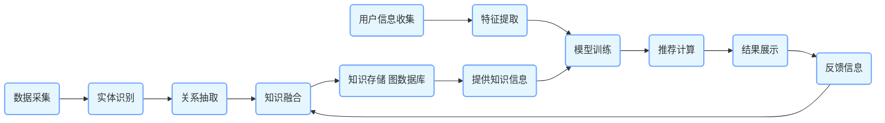

# 构建基于知识图谱的金融产品组合推荐引擎

> 关键词：知识图谱、金融产品组合、推荐引擎、图数据库、人工智能

> 摘要：本文旨在深入探讨如何构建基于知识图谱的金融产品组合推荐引擎。首先介绍了相关背景，包括目的、预期读者等内容。接着阐述了核心概念与联系，详细解释知识图谱和金融产品组合推荐引擎的原理及架构。通过Python代码详细讲解了核心算法原理与具体操作步骤，同时给出数学模型和公式并举例说明。以实际项目为例，展示了开发环境搭建、源代码实现与解读。分析了该推荐引擎的实际应用场景，推荐了相关学习资源、开发工具框架以及论文著作。最后总结了未来发展趋势与挑战，提供常见问题解答及扩展阅读参考资料，为构建高效、智能的金融产品组合推荐引擎提供全面的技术指导。

## 1. 背景介绍 
### 1.1 目的和范围
在金融领域，随着产品种类的日益增多，投资者面临着选择困难的问题。如何为投资者提供个性化、精准的金融产品组合推荐成为金融机构关注的焦点。本文章的目的是构建一个基于知识图谱的金融产品组合推荐引擎，以解决金融产品推荐中的信息不对称、推荐不精准等问题。范围涵盖了从知识图谱的构建到推荐引擎的实现，包括数据处理、算法设计、模型训练等多个环节，旨在为金融机构和投资者提供一个可行的技术方案。

### 1.2 预期读者
本文预期读者包括金融科技领域的从业者，如数据科学家、算法工程师、金融分析师等；对金融产品推荐技术感兴趣的研究人员；以及希望深入了解知识图谱在金融领域应用的学生和爱好者。

### 1.3 文档结构概述
本文首先介绍背景信息，包括目的、读者和文档结构。接着阐述核心概念与联系，解释知识图谱和推荐引擎的原理及架构。然后详细讲解核心算法原理和具体操作步骤，给出数学模型和公式并举例说明。通过项目实战展示推荐引擎的实现过程，包括开发环境搭建、源代码实现与解读。分析实际应用场景，推荐相关工具和资源。最后总结未来发展趋势与挑战，提供常见问题解答和扩展阅读参考资料。

### 1.4 术语表
#### 1.4.1 核心术语定义
- **知识图谱**：一种语义网络，用于表示实体、概念及其之间的关系，将现实世界中的各种信息以图的形式进行组织和存储。
- **金融产品组合**：由多种金融产品组成的投资组合，旨在通过分散投资降低风险并实现预期收益。
- **推荐引擎**：一种信息过滤系统，通过分析用户的历史行为、偏好等数据，为用户推荐相关的产品或服务。

#### 1.4.2 相关概念解释
- **图数据库**：一种专门用于存储和管理图数据的数据库，支持高效的图查询和分析操作。
- **实体**：知识图谱中的节点，表示现实世界中的具体对象，如金融产品、投资者等。
- **关系**：知识图谱中连接实体的边，表示实体之间的语义联系，如“投资于”“属于”等。

#### 1.4.3 缩略词列表
- **KG**：Knowledge Graph（知识图谱）
- **DB**：Database（数据库）
- **AI**：Artificial Intelligence（人工智能）

## 2. 核心概念与联系 
### 2.1 知识图谱原理
知识图谱是一种基于图的数据结构，由节点（实体）和边（关系）组成。它通过将现实世界中的各种信息进行语义化表示，构建出一个庞大的语义网络。知识图谱的构建过程包括数据采集、实体识别、关系抽取、知识融合和知识存储等步骤。

知识图谱的优势在于能够有效地整合多源异构数据，挖掘数据之间的潜在关系，提供更全面、准确的信息。在金融领域，知识图谱可以整合金融产品信息、投资者信息、市场信息等，为金融决策提供有力支持。

### 2.2 金融产品组合推荐引擎原理
金融产品组合推荐引擎的核心目标是根据投资者的风险偏好、投资目标、资产状况等信息，为投资者推荐合适的金融产品组合。推荐引擎通常采用协同过滤、内容推荐、基于模型的推荐等算法，结合知识图谱的信息，实现个性化的推荐服务。

推荐引擎的工作流程包括用户信息收集、特征提取、模型训练、推荐计算和结果展示等环节。通过不断地学习和优化，推荐引擎可以提高推荐的准确性和有效性。

### 2.3 知识图谱与金融产品组合推荐引擎的联系
知识图谱为金融产品组合推荐引擎提供了丰富的背景知识和语义信息。通过知识图谱，推荐引擎可以更好地理解金融产品的属性、投资者的偏好以及它们之间的关系，从而实现更精准的推荐。

例如，知识图谱可以帮助推荐引擎识别投资者的风险承受能力与金融产品的风险等级之间的匹配关系，以及不同金融产品之间的相关性。同时，推荐引擎的反馈信息也可以用于知识图谱的更新和完善，形成一个良性循环。

### 2.4 核心概念架构的文本示意图
```plaintext
+----------------------+         +----------------------+
|      知识图谱        |         | 金融产品组合推荐引擎 |
+----------------------+         +----------------------+
| - 实体（金融产品、    |         | - 用户信息收集       |
|   投资者等）         |         | - 特征提取           |
| - 关系（投资于、      |         | - 模型训练           |
|   属于等）           |         | - 推荐计算           |
| - 知识存储（图数据库）|         | - 结果展示           |
+----------------------+         +----------------------+
              |                             |
              | 提供背景知识和语义信息       | 反馈信息更新知识图谱
              v                             v
+-----------------------------------------------------+
|                    金融领域数据                     |
+-----------------------------------------------------+
```

### 2.5 Mermaid 流程图


## 3. 核心算法原理 & 具体操作步骤 
### 3.1 核心算法原理
本推荐引擎主要采用基于知识图谱的图嵌入算法和协同过滤算法相结合的方法。

#### 3.1.1 图嵌入算法
图嵌入算法的目的是将知识图谱中的节点和边映射到低维向量空间中，以便于进行机器学习和数据分析。常用的图嵌入算法有DeepWalk、Node2Vec等。

以DeepWalk为例，其基本思想是通过随机游走生成节点的序列，然后将这些序列作为文本进行处理，使用Word2Vec算法学习节点的向量表示。

#### 3.1.2 协同过滤算法
协同过滤算法是一种基于用户行为的推荐算法，分为用户协同过滤和物品协同过滤。用户协同过滤通过计算用户之间的相似度，找到与目标用户相似的用户，然后推荐这些相似用户喜欢的金融产品。物品协同过滤则通过计算金融产品之间的相似度，为用户推荐与他们已经购买过的产品相似的产品。

### 3.2 具体操作步骤
#### 3.2.1 数据预处理
首先，收集金融领域的相关数据，包括金融产品信息、投资者信息、交易记录等。然后对数据进行清洗、去重、归一化等处理，以提高数据质量。

#### 3.2.2 知识图谱构建
使用实体识别和关系抽取技术，从预处理后的数据中提取实体和关系，构建知识图谱。将知识图谱存储在图数据库中，以便于后续的查询和分析。

#### 3.2.3 图嵌入计算
使用DeepWalk算法对知识图谱中的节点进行嵌入计算，得到节点的向量表示。

```python
import networkx as nx
import random
from gensim.models import Word2Vec

def random_walk(G, node, walk_length):
    walk = [node]
    for _ in range(walk_length - 1):
        neighbors = list(G.neighbors(walk[-1]))
        if neighbors:
            walk.append(random.choice(neighbors))
        else:
            break
    return walk

def generate_walks(G, num_walks, walk_length):
    walks = []
    nodes = list(G.nodes())
    for _ in range(num_walks):
        random.shuffle(nodes)
        for node in nodes:
            walk = random_walk(G, node, walk_length)
            walks.append(walk)
    return walks

def deepwalk(G, num_walks=10, walk_length=80, embedding_size=128):
    walks = generate_walks(G, num_walks, walk_length)
    model = Word2Vec(walks, size=embedding_size, window=5, min_count=0, sg=1, workers=4)
    return model

# 示例使用
G = nx.karate_club_graph()
model = deepwalk(G)
node_embeddings = {node: model.wv[node] for node in G.nodes()}
```

#### 3.2.4 协同过滤计算
根据节点的向量表示，计算用户之间或产品之间的相似度。对于用户协同过滤，使用余弦相似度计算用户之间的相似度；对于物品协同过滤，使用同样的方法计算产品之间的相似度。

```python
import numpy as np
from sklearn.metrics.pairwise import cosine_similarity

def user_similarity(user_embeddings):
    user_ids = list(user_embeddings.keys())
    embeddings = np.array([user_embeddings[user_id] for user_id in user_ids])
    similarity_matrix = cosine_similarity(embeddings)
    similarity_dict = {}
    for i in range(len(user_ids)):
        similarity_dict[user_ids[i]] = {}
        for j in range(len(user_ids)):
            similarity_dict[user_ids[i]][user_ids[j]] = similarity_matrix[i][j]
    return similarity_dict

# 示例使用
user_embeddings = {1: np.array([0.1, 0.2, 0.3]), 2: np.array([0.4, 0.5, 0.6])}
user_similarity_dict = user_similarity(user_embeddings)
```

#### 3.2.5 推荐计算
根据相似度矩阵，为用户推荐金融产品。对于用户协同过滤，选择与目标用户相似度较高的用户，推荐这些用户购买过但目标用户未购买的金融产品；对于物品协同过滤，推荐与目标用户已经购买过的产品相似度较高的金融产品。

```python
def user_based_recommendation(user_id, user_similarity_dict, user_product_dict, top_k=5):
    similar_users = sorted(user_similarity_dict[user_id].items(), key=lambda x: x[1], reverse=True)[1:top_k + 1]
    recommended_products = []
    user_products = user_product_dict.get(user_id, [])
    for similar_user, similarity in similar_users:
        similar_user_products = user_product_dict.get(similar_user, [])
        for product in similar_user_products:
            if product not in user_products and product not in recommended_products:
                recommended_products.append(product)
    return recommended_products

# 示例使用
user_product_dict = {1: [101, 102], 2: [102, 103]}
recommended_products = user_based_recommendation(1, user_similarity_dict, user_product_dict)
```

## 4. 数学模型和公式 & 详细讲解 & 举例说明 
### 4.1 图嵌入算法的数学模型
#### 4.1.1 DeepWalk 算法
DeepWalk 算法基于随机游走和 Word2Vec 模型。随机游走是一种在图中随机选择节点进行遍历的过程。设图 $G=(V, E)$，其中 $V$ 是节点集合，$E$ 是边集合。从节点 $v_i \in V$ 开始的随机游走可以表示为一个序列 $W_{v_i}=(v_{i_1}, v_{i_2}, \cdots, v_{i_l})$，其中 $v_{i_j} \in V$ 且 $(v_{i_{j}}, v_{i_{j + 1}}) \in E$，$l$ 是游走的长度。

Word2Vec 模型的目标是最大化节点序列的条件概率：
$$P(W_{v_i})=\prod_{j = 1}^{l}P(v_{i_j}|\{v_{i_{j - w}}, \cdots, v_{i_{j - 1}}, v_{i_{j + 1}}, \cdots, v_{i_{j + w}}\})$$
其中 $w$ 是窗口大小。

通过优化这个目标函数，可以得到节点的向量表示。

#### 4.1.2 举例说明
假设我们有一个简单的图 $G$，节点集合 $V = \{A, B, C, D\}$，边集合 $E = \{(A, B), (B, C), (C, D)\}$。从节点 $A$ 开始，进行长度为 3 的随机游走，可能得到的序列为 $(A, B, C)$。将这些序列作为 Word2Vec 的输入，经过训练后，节点 $A$ 会被映射到一个低维向量空间中，得到其向量表示。

### 4.2 协同过滤算法的数学模型
#### 4.2.1 余弦相似度
余弦相似度是一种常用的计算向量相似度的方法。设向量 $\mathbf{u}=(u_1, u_2, \cdots, u_n)$ 和 $\mathbf{v}=(v_1, v_2, \cdots, v_n)$，则它们的余弦相似度定义为：
$$\text{sim}(\mathbf{u}, \mathbf{v})=\frac{\mathbf{u} \cdot \mathbf{v}}{\|\mathbf{u}\| \|\mathbf{v}\|}=\frac{\sum_{i = 1}^{n}u_iv_i}{\sqrt{\sum_{i = 1}^{n}u_i^2}\sqrt{\sum_{i = 1}^{n}v_i^2}}$$

#### 4.2.2 用户协同过滤推荐公式
设用户 $u$ 的邻居集合为 $N(u)$，用户 $u$ 对物品 $i$ 没有评分，用户 $v \in N(u)$ 对物品 $i$ 有评分 $r_{vi}$，则用户 $u$ 对物品 $i$ 的预测评分 $\hat{r}_{ui}$ 可以表示为：
$$\hat{r}_{ui}=\bar{r}_u+\frac{\sum_{v \in N(u)}\text{sim}(u, v)(r_{vi}-\bar{r}_v)}{\sum_{v \in N(u)}|\text{sim}(u, v)|}$$
其中 $\bar{r}_u$ 和 $\bar{r}_v$ 分别是用户 $u$ 和用户 $v$ 的平均评分。

#### 4.2.3 举例说明
假设有两个用户 $u$ 和 $v$，他们的特征向量分别为 $\mathbf{u}=(1, 2, 3)$ 和 $\mathbf{v}=(4, 5, 6)$。则它们的余弦相似度为：
$$\text{sim}(\mathbf{u}, \mathbf{v})=\frac{1\times4 + 2\times5 + 3\times6}{\sqrt{1^2 + 2^2 + 3^2}\sqrt{4^2 + 5^2 + 6^2}}=\frac{4 + 10 + 18}{\sqrt{14}\sqrt{77}}=\frac{32}{\sqrt{1078}}\approx0.97$$

假设用户 $u$ 的平均评分 $\bar{r}_u = 3$，用户 $v$ 的平均评分 $\bar{r}_v = 4$，用户 $v$ 对物品 $i$ 的评分 $r_{vi} = 5$，用户 $u$ 和用户 $v$ 的相似度 $\text{sim}(u, v) = 0.9$，则用户 $u$ 对物品 $i$ 的预测评分 $\hat{r}_{ui}$ 为：
$$\hat{r}_{ui}=3+\frac{0.9\times(5 - 4)}{0.9}=4$$

## 5. 项目实战：代码实际案例和详细解释说明 
### 5.1  开发环境搭建
#### 5.1.1 操作系统
建议使用 Linux 或 macOS 操作系统，以确保代码的兼容性和稳定性。

#### 5.1.2 编程语言和库
- **Python**：版本 3.7 及以上。
- **图数据库**：使用 Neo4j 作为图数据库，用于存储知识图谱。
- **Python 库**：安装必要的 Python 库，如 `networkx`、`gensim`、`scikit-learn`、`py2neo` 等。

```bash
pip install networkx gensim scikit-learn py2neo
```

#### 5.1.3 Neo4j 安装和配置
1. 下载并安装 Neo4j 社区版。
2. 启动 Neo4j 服务，打开浏览器访问 `http://localhost:7474`，设置用户名和密码。
3. 配置 Neo4j 的连接信息，如主机地址、端口、用户名和密码。

### 5.2  源代码详细