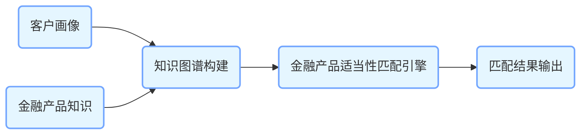

# 构建基于知识图谱的金融产品适当性匹配引擎

> 关键词：知识图谱、金融产品适当性、匹配引擎、风险评估、客户画像

> 摘要：本文聚焦于构建基于知识图谱的金融产品适当性匹配引擎。首先介绍了相关背景，包括目的、预期读者等。详细阐述了知识图谱和金融产品适当性匹配的核心概念及联系，给出了相应的原理和架构示意图。深入讲解了核心算法原理，并用 Python 代码进行了具体实现。同时给出了相关的数学模型和公式，并举例说明。通过项目实战，展示了开发环境搭建、源代码实现及解读。探讨了该匹配引擎的实际应用场景，推荐了学习资源、开发工具框架以及相关论文著作。最后总结了未来发展趋势与挑战，并给出常见问题解答和扩展阅读参考资料。

## 1. 背景介绍 
### 1.1 目的和范围
在金融市场中，金融产品种类繁多，不同客户的风险承受能力、投资目标和财务状况等存在巨大差异。金融产品适当性匹配的目的是确保金融机构将合适的金融产品销售给合适的客户，避免客户购买不适合自己的金融产品而遭受损失，同时也有助于金融机构合规经营，降低声誉风险。

本文章的范围主要涵盖了如何利用知识图谱技术构建一个金融产品适当性匹配引擎，包括知识图谱的构建、匹配算法的设计、系统的实现以及实际应用等方面。

### 1.2 预期读者
本文的预期读者包括金融科技领域的从业者，如金融机构的技术人员、数据分析师、产品经理等；对知识图谱和金融科技交叉领域感兴趣的研究人员；以及希望了解金融产品适当性匹配技术原理和实现方法的学生和爱好者。

### 1.3 文档结构概述
本文首先介绍背景信息，让读者了解构建基于知识图谱的金融产品适当性匹配引擎的目的和意义。接着阐述核心概念与联系，帮助读者理解相关技术原理。然后详细讲解核心算法原理和具体操作步骤，并用 Python 代码进行说明。通过数学模型和公式进一步深入分析匹配过程。项目实战部分展示了如何在实际中实现该匹配引擎。探讨实际应用场景，让读者了解其应用价值。推荐相关的工具和资源，方便读者进一步学习和研究。最后总结未来发展趋势与挑战，给出常见问题解答和扩展阅读参考资料。

### 1.4 术语表
#### 1.4.1 核心术语定义
- **知识图谱**：是一种基于图的数据结构，由节点（实体）和边（关系）组成，用于表示现实世界中各种实体之间的关系。在金融领域，实体可以是客户、金融产品、风险等级等，关系可以是“适合”、“拥有”等。
- **金融产品适当性**：指金融机构在销售金融产品时，应当根据客户的风险承受能力、投资目标、财务状况等因素，评估客户是否适合购买该金融产品。
- **匹配引擎**：是一种软件系统，用于根据一定的规则和算法，将客户与适合的金融产品进行匹配。

#### 1.4.2 相关概念解释
- **客户画像**：是根据客户的基本信息、交易记录、风险偏好等数据，构建的客户特征模型。通过客户画像，可以更全面地了解客户的需求和风险承受能力。
- **风险评估**：是对金融产品的风险程度进行评估的过程，通常考虑产品的市场风险、信用风险、流动性风险等因素。

#### 1.4.3 缩略词列表
- **KG**：Knowledge Graph，知识图谱
- **FPM**：Financial Product Matching，金融产品匹配

## 2. 核心概念与联系 

### 知识图谱原理
知识图谱是一种语义网络，它以图的形式来表示实体和实体之间的关系。在知识图谱中，节点代表实体，边代表实体之间的关系。例如，在金融知识图谱中，客户、金融产品、风险等级等可以作为节点，而客户与金融产品之间的“适合”关系、金融产品与风险等级之间的“对应”关系等可以作为边。

知识图谱的构建过程通常包括数据收集、数据清洗、实体识别、关系抽取和知识融合等步骤。通过这些步骤，可以将各种来源的数据整合到一个统一的知识图谱中，从而为金融产品适当性匹配提供丰富的信息。

### 金融产品适当性匹配原理
金融产品适当性匹配的核心是根据客户的特征和金融产品的属性，评估客户是否适合购买该金融产品。客户的特征包括风险承受能力、投资目标、财务状况等，金融产品的属性包括风险等级、收益预期、投资期限等。

匹配过程通常包括以下几个步骤：首先，对客户进行风险评估，确定客户的风险承受能力；然后，根据客户的投资目标和财务状况，筛选出符合条件的金融产品；最后，对筛选出的金融产品进行进一步的评估，根据风险匹配原则，确定最适合客户的金融产品。

### 知识图谱与金融产品适当性匹配的联系
知识图谱可以为金融产品适当性匹配提供丰富的语义信息和关系信息。通过知识图谱，可以将客户、金融产品、风险等级等实体以及它们之间的关系进行可视化表示，从而更直观地进行匹配分析。

例如，通过知识图谱可以快速找到与客户风险承受能力相匹配的金融产品，同时还可以考虑金融产品之间的关联关系，如替代关系、互补关系等，为客户提供更全面的投资建议。

### 核心概念架构的文本示意图
```plaintext
+-------------------+           +-------------------+
|       客户画像      |           |    金融产品知识   |
|  (风险承受能力等)  |           |  (风险等级等属性) |
+-------------------+           +-------------------+
           |                               |
           |                               |
           v                               v
+-------------------+           +-------------------+
|      知识图谱构建    |           |      知识图谱构建    |
+-------------------+           +-------------------+
           |                               |
           |                               |
           v                               v
+--------------------------------------------------+
|                  金融产品适当性匹配引擎           |
| (基于知识图谱的匹配算法和规则)                   |
+--------------------------------------------------+
           |
           |
           v
+-------------------+
|     匹配结果输出    |
| (适合客户的金融产品) |
+-------------------+
```

### Mermaid 流程图


## 3. 核心算法原理 & 具体操作步骤 

### 核心算法原理
我们采用基于规则和相似度计算的算法来实现金融产品适当性匹配。具体步骤如下：
1. **数据预处理**：对客户信息和金融产品信息进行清洗和标准化处理，以便后续的匹配计算。
2. **特征提取**：从客户信息中提取风险承受能力、投资目标、财务状况等特征，从金融产品信息中提取风险等级、收益预期、投资期限等特征。
3. **规则匹配**：根据预先设定的规则，筛选出符合客户基本条件的金融产品。例如，客户的风险承受能力为低风险，那么只选择风险等级为低风险的金融产品。
4. **相似度计算**：对于筛选出的金融产品，计算其与客户特征的相似度。相似度计算可以采用余弦相似度、欧几里得距离等方法。
5. **排序和推荐**：根据相似度得分对金融产品进行排序，推荐相似度得分最高的金融产品给客户。

### Python 代码实现

```python
import pandas as pd
from sklearn.metrics.pairwise import cosine_similarity
import numpy as np

# 数据预处理
def preprocess_data(customer_data, product_data):
    # 清洗和标准化处理
    customer_data = customer_data.dropna()
    product_data = product_data.dropna()
    return customer_data, product_data

# 特征提取
def extract_features(customer_data, product_data):
    customer_features = customer_data[['risk_tolerance', 'investment_goal', 'financial_status']].values
    product_features = product_data[['risk_level', 'expected_return', 'investment_period']].values
    return customer_features, product_features

# 规则匹配
def rule_matching(customer_data, product_data):
    risk_tolerance = customer_data['risk_tolerance'].values[0]
    matched_products = product_data[product_data['risk_level'] == risk_tolerance]
    return matched_products

# 相似度计算
def similarity_calculation(customer_features, product_features):
    similarities = cosine_similarity(customer_features, product_features)
    return similarities

# 排序和推荐
def recommend_products(similarities, product_data):
    sorted_indices = np.argsort(similarities[0])[::-1]
    recommended_products = product_data.iloc[sorted_indices]
    return recommended_products

# 主函数
def main():
    # 示例数据
    customer_data = pd.DataFrame({
        'risk_tolerance': ['low'],
        'investment_goal': [5],
        'financial_status': [3]
    })
    product_data = pd.DataFrame({
        'risk_level': ['low', 'medium', 'low'],
        'expected_return': [2, 5, 3],
        'investment_period': [1, 2, 1]
    })

    # 数据预处理
    customer_data, product_data = preprocess_data(customer_data, product_data)

    # 规则匹配
    matched_products = rule_matching(customer_data, product_data)

    # 特征提取
    customer_features, product_features = extract_features(customer_data, matched_products)

    # 相似度计算
    similarities = similarity_calculation(customer_features, product_features)

    # 排序和推荐
    recommended_products = recommend_products(similarities, matched_products)

    print("Recommended products:")
    print(recommended_products)

if __name__ == "__main__":
    main()
```

### 具体操作步骤
1. **数据准备**：收集客户信息和金融产品信息，并将其存储在数据框中。
2. **调用 `preprocess_data` 函数进行数据预处理**：清洗和标准化客户信息和金融产品信息。
3. **调用 `rule_matching` 函数进行规则匹配**：根据客户的风险承受能力筛选出符合条件的金融产品。
4. **调用 `extract_features` 函数进行特征提取**：从客户信息和筛选出的金融产品信息中提取特征。
5. **调用 `similarity_calculation` 函数进行相似度计算**：计算客户特征与金融产品特征的相似度。
6. **调用 `recommend_products` 函数进行排序和推荐**：根据相似度得分对金融产品进行排序，推荐相似度得分最高的金融产品给客户。

## 4. 数学模型和公式 & 详细讲解 & 举例说明 

### 相似度计算的数学模型
在本匹配引擎中，我们使用余弦相似度来计算客户特征与金融产品特征之间的相似度。余弦相似度的计算公式如下：

$$
\cos(\theta) = \frac{\mathbf{A} \cdot \mathbf{B}}{\|\mathbf{A}\| \|\mathbf{B}\|}
$$

其中，$\mathbf{A}$ 和 $\mathbf{B}$ 分别表示客户特征向量和金融产品特征向量，$\cdot$ 表示向量的点积，$\|\mathbf{A}\|$ 和 $\|\mathbf{B}\|$ 分别表示向量 $\mathbf{A}$ 和 $\mathbf{B}$ 的模。

### 详细讲解
余弦相似度的取值范围在 $[-1, 1]$ 之间，值越接近 1 表示两个向量越相似，值越接近 -1 表示两个向量越不相似。在金融产品适当性匹配中，我们希望找到与客户特征向量相似度最高的金融产品特征向量，即余弦相似度值最大的金融产品。

### 举例说明
假设客户的特征向量为 $\mathbf{A} = [1, 2, 3]$，金融产品的特征向量为 $\mathbf{B} = [2, 4, 6]$。

首先，计算向量的点积：
$$
\mathbf{A} \cdot \mathbf{B} = 1 \times 2 + 2 \times 4 + 3 \times 6 = 2 + 8 + 18 = 28
$$

然后，计算向量的模：
$$
\|\mathbf{A}\| = \sqrt{1^2 + 2^2 + 3^2} = \sqrt{1 + 4 + 9} = \sqrt{14}
$$
$$
\|\mathbf{B}\| = \sqrt{2^2 + 4^2 + 6^2} = \sqrt{4 + 16 + 36} = \sqrt{56} = 2\sqrt{14}
$$

最后，计算余弦相似度：
$$
\cos(\theta) = \frac{\mathbf{A} \cdot \mathbf{B}}{\|\mathbf{A}\| \|\mathbf{B}\|} = \frac{28}{\sqrt{14} \times 2\sqrt{14}} = \frac{28}{2 \times 14} = 1
$$

由于余弦相似度值为 1，说明客户特征向量和金融产品特征向量完全相似，该金融产品非常适合该客户。

## 5. 项目实战：代码实际案例和详细解释说明 

### 5.1  开发环境搭建
#### 安装 Python
首先，确保你已经安装了 Python 3.x 版本。你可以从 Python 官方网站（https://www.python.org/downloads/） 下载并安装适合你操作系统的 Python 版本。

#### 安装必要的库
在命令行中使用以下命令安装所需的库：
```sh
pip install pandas scikit-learn
```

### 5.2  源代码详细实现和代码解读
```python
import pandas as pd
from sklearn.metrics.pairwise import cosine_similarity
import numpy as np

# 数据预处理
def preprocess_data(customer_data, product_data):
    # 清洗和标准化处理
    customer_data = customer_data.dropna()
    product_data = product_data.dropna()
    return customer_data, product_data

# 特征提取
def extract_features(customer_data, product_data):
    customer_features = customer_data[['risk_tolerance', 'investment_goal', 'financial_status']].values
    product_features = product_data[['risk_level', 'expected_return', 'investment_period']].values
    return customer_features, product_features

# 规则匹配
def rule_matching(customer_data, product_data):
    risk_tolerance = customer_data['risk_tolerance'].values[0]
    matched_products = product_data[product_data['risk_level'] == risk_tolerance]
    return matched_products

# 相似度计算
def similarity_calculation(customer_features, product_features):
    similarities = cosine_similarity(customer_features, product_features)
    return similarities

# 排序和推荐
def recommend_products(similarities, product_data):
    sorted_indices = np.argsort(similarities[0])[::-1]
    recommended_products = product_data.iloc[sorted_indices]
    return recommended_products

# 主函数
def main():
    # 示例数据
    customer_data = pd.DataFrame({
        'risk_tolerance': ['low'],
        'investment_goal': [5],
        'financial_status': [3]
    })
    product_data = pd.DataFrame({
        'risk_level': ['low', 'medium', 'low'],
        'expected_return': [2, 5, 3],
        'investment_period': [1, 2, 1]
    })

    # 数据预处理
    customer_data, product_data = preprocess_data(customer_data, product_data)

    # 规则匹配
    matched_products = rule_matching(customer_data, product_data)

    # 特征提取
    customer_features, product_features = extract_features(customer_data, matched_products)

    # 相似度计算
    similarities = similarity_calculation(customer_features, product_features)

    # 排序和推荐
    recommended_products = recommend_products(similarities, matched_products)

    print("Recommended products:")
    print(recommended_products)

if __name__ == "__main__":
    main()
```

### 代码解读与分析
- **数据预处理函数 `preprocess_data`**：该函数接受客户数据和金融产品数据作为输入，使用 `dropna` 方法去除数据中的缺失值，然后返回处理后的数据。
- **特征提取函数 `extract_features`**：该函数从客户数据和金融产品数据中提取所需的特征，将其转换为 NumPy 数组并返回。
- **规则匹配函数 `rule_matching`**：该函数根据客户的风险承受能力筛选出符合条件的金融产品，返回筛选后的金融产品数据。
- **相似度计算函数 `similarity_calculation`**：该函数使用 `cosine_similarity` 函数计算客户特征与金融产品特征之间的余弦相似度，返回相似度矩阵。
- **排序和推荐函数 `recommend_products`**：该函数根据相似度矩阵对金融产品进行排序，返回排序后的金融产品数据。
- **主函数 `main`**：该函数创建示例客户数据和金融产品数据，依次调用上述函数进行数据预处理、规则匹配、特征提取、相似度计算和排序推荐，最后打印推荐的金融产品。

## 6. 实际应用场景 
### 金融机构的客户服务
金融机构可以利用基于知识图谱的金融产品适当性匹配引擎为客户提供个性化的金融产品推荐服务。当客户咨询金融产品时，系统可以根据客户的风险承受能力、投资目标等信息，快速筛选出适合客户的金融产品，并向客户推荐。这不仅可以提高客户的满意度，还可以增加金融机构的销售业绩。

### 金融监管
金融监管机构可以使用该匹配引擎对金融机构的销售行为进行监管。通过分析金融机构的客户数据和销售记录，监管机构可以检查金融机构是否将合适的金融产品销售给了合适的客户，从而确保金融市场的稳定和健康发展。

### 投资者教育
该匹配引擎可以作为投资者教育的工具，帮助投资者了解自己的风险承受能力和投资目标，以及不同金融产品的特点和风险。投资者可以通过输入自己的信息，获取适合自己的金融产品推荐，从而提高投资决策的科学性和合理性。

## 7. 工具和资源推荐
### 7.1 学习资源推荐
#### 7.1.1 书籍推荐
- 《知识图谱：方法、实践与应用》：本书全面介绍了知识图谱的理论、方法和应用，包括知识图谱的构建、表示、推理等方面的内容，适合对知识图谱感兴趣的读者阅读。
- 《金融科技：架构与实践》：该书涵盖了金融科技的各个领域，包括金融产品适当性匹配、风险评估等内容，对金融科技从业者有很大的帮助。

#### 7.1.2 在线课程
- Coursera 上的“Knowledge Graphs”课程：该课程由知名高校的教授授课，系统地介绍了知识图谱的基本概念、技术和应用，通过在线视频、作业和讨论等方式进行学习。
- edX 上的“Fintech: Foundations and Applications”课程：该课程介绍了金融科技的基础知识和应用案例，包括金融产品适当性匹配的相关内容，适合初学者学习。

#### 7.1.3 技术博客和网站
- 知识图谱社区（https://kg.cs.tsinghua.edu.cn/）：该网站提供了知识图谱领域的最新研究成果、技术文章和开源代码等资源，是知识图谱爱好者交流和学习的平台。
- 金融科技前沿（https://www.fintech前沿.com/）：该网站关注金融科技的最新动态和发展趋势，分享金融科技领域的技术文章和案例分析，对金融科技从业者有很大的参考价值。

### 7.2 开发工具框架推荐
#### 7.2.1 IDE和编辑器
- PyCharm：是一款专门为 Python 开发设计的集成开发环境（IDE），具有代码编辑、调试、版本控制等功能，适合开发基于 Python 的金融产品适当性匹配引擎。
- Jupyter Notebook：是一个开源的交互式笔记本，支持多种编程语言，包括 Python。它可以方便地进行代码编写、数据可视化和文档记录，适合进行数据探索和算法实验。

#### 7.2.2 调试和性能分析工具
- PDB：是 Python 自带的调试工具，可以在代码中设置断点，逐行执行代码，查看变量的值和程序的执行流程，帮助开发者调试代码。
- cProfile：是 Python 的性能分析工具，可以统计代码的运行时间和函数调用次数，帮助开发者找出代码中的性能瓶颈。

#### 7.2.3 相关框架和库
- Pandas：是一个强大的数据处理和分析库，提供了数据结构和数据操作方法，适合处理客户信息和金融产品信息等结构化数据。
- Scikit-learn：是一个常用的机器学习库，提供了各种机器学习算法和工具，包括相似度计算、分类、回归等，适合实现金融产品适当性匹配算法。

### 7.3 相关论文著作推荐
#### 7.3.1 经典论文
- 《Knowledge Graph Embedding: A Survey of Approaches and Applications》：该论文对知识图谱嵌入的方法和应用进行了全面的综述，介绍了知识图谱嵌入的基本概念、主要方法和应用场景，是知识图谱领域的经典论文之一。
- 《Financial Product Recommendation Based on Knowledge Graph and Deep Learning》：该论文提出了一种基于知识图谱和深度学习的金融产品推荐方法，通过构建金融知识图谱和使用深度学习模型进行客户特征提取和产品推荐，取得了较好的推荐效果。

#### 7.3.2 最新研究成果
- 《Enhancing Financial Product Suitability Assessment with Knowledge Graphs》：该研究成果提出了一种利用知识图谱增强金融产品适当性评估的方法，通过引入知识图谱中的语义信息和关系信息，提高了金融产品适当性评估的准确性和可靠性。
- 《A Knowledge Graph-based Approach for Personalized Financial Product Recommendation》：该研究提出了一种基于知识图谱的个性化金融产品推荐方法，通过构建客户知识图谱和产品知识图谱，实现了客户与金融产品的精准匹配。

#### 7.3.3 应用案例分析
- 《Case Study: Implementing a Knowledge Graph-based Financial Product Matching System in a Commercial Bank》：该案例分析介绍了某商业银行实施基于知识图谱的金融产品匹配系统的过程和效果，包括系统的架构设计、数据处理、算法实现等方面的内容，对实际应用具有一定的参考价值。

## 8. 总结：未来发展趋势与挑战
### 未来发展趋势
- **与人工智能技术的深度融合**：未来，基于知识图谱的金融产品适当性匹配引擎将与人工智能技术，如深度学习、自然语言处理等深度融合。通过深度学习模型可以更准确地提取客户特征和金融产品特征，通过自然语言处理技术可以实现与客户的自然交互，提高匹配的准确性和效率。
- **多源数据的整合**：随着金融市场的发展和信息技术的进步，金融数据的来源越来越广泛，包括社交媒体数据、物联网数据等。未来的匹配引擎将整合多源数据，更全面地了解客户的需求和行为，提供更个性化的金融产品推荐。
- **跨境金融产品匹配**：随着全球金融市场的一体化，跨境金融产品的交易越来越频繁。未来的匹配引擎将支持跨境金融产品的匹配，考虑不同国家和地区的金融法规、市场环境等因素，为客户提供更全面的金融服务。

### 挑战
- **数据质量和安全问题**：金融数据的质量和安全是构建匹配引擎的关键。数据质量不佳可能导致匹配结果不准确，数据安全问题可能导致客户信息泄露和金融风险。因此，需要加强数据质量管理和安全保障措施。
- **知识图谱的构建和维护**：知识图谱的构建和维护是一个复杂的过程，需要大量的人力、物力和时间。同时，知识图谱需要不断更新和完善，以反映金融市场的变化和客户需求的变化。
- **法律法规和监管要求**：金融产品适当性匹配涉及到法律法规和监管要求，如客户隐私保护、反洗钱等。匹配引擎的设计和实现需要符合相关的法律法规和监管要求，否则可能面临法律风险。

## 9. 附录：常见问题与解答
### 问题 1：知识图谱的构建需要哪些数据？
答：知识图谱的构建需要多种类型的数据，包括客户信息、金融产品信息、风险等级信息等。客户信息可以包括基本信息、交易记录、风险偏好等；金融产品信息可以包括产品名称、类型、风险等级、收益预期等；风险等级信息可以包括低风险、中风险、高风险等。此外，还可以收集金融市场数据、行业报告等外部数据，以丰富知识图谱的内容。

### 问题 2：如何评估匹配引擎的性能？
答：可以从以下几个方面评估匹配引擎的性能：
- **准确性**：评估匹配结果与客户实际需求的符合程度，可以通过客户反馈、实际交易数据等方式进行验证。
- **召回率**：评估匹配引擎能够找出的适合客户的金融产品的比例，召回率越高，说明匹配引擎能够覆盖更多的合适产品。
- **效率**：评估匹配引擎的响应时间和处理能力，效率越高，说明匹配引擎能够快速为客户提供匹配结果。

### 问题 3：匹配引擎是否可以实时更新？
答：可以。为了保证匹配结果的准确性和及时性，匹配引擎需要实时更新客户信息和金融产品信息。可以通过实时数据采集和处理技术，如消息队列、流处理等，实现数据的实时更新。同时，匹配算法也可以进行实时优化和调整，以适应金融市场的变化和客户需求的变化。

## 10. 扩展阅读 & 参考资料
- 《知识图谱与深度学习》，作者：李涓子等，出版社：机械工业出版社
- 《金融科技概论》，作者：谢平，出版社：中国金融出版社
- “Knowledge Graphs in Finance: A Survey”，作者：A. Pal et al.，发表于《ACM Computing Surveys》
- “A Survey on Deep Learning for Financial Time Series Forecasting”，作者：S. Zhang et al.，发表于《IEEE Transactions on Neural Networks and Learning Systems》

作者：AI天才研究院/AI Genius Institute & 禅与计算机程序设计艺术 /Zen And The Art of Computer Programming