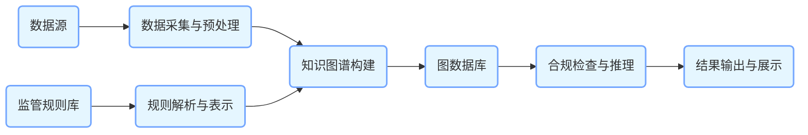

# 构建基于知识图谱的金融监管合规系统

> 关键词：知识图谱、金融监管合规系统、图数据库、规则推理、信息融合

> 摘要：本文聚焦于构建基于知识图谱的金融监管合规系统。首先介绍了该系统构建的背景，包括目的、预期读者、文档结构和相关术语。接着阐述了核心概念，如知识图谱、金融监管合规等，以及它们之间的联系，并给出了原理和架构的文本示意图与 Mermaid 流程图。详细讲解了核心算法原理，用 Python 代码展示具体操作步骤。通过数学模型和公式进一步剖析系统机制，并举例说明。在项目实战部分，给出开发环境搭建、源代码实现和解读。探讨了该系统的实际应用场景，推荐了相关的学习资源、开发工具框架和论文著作。最后总结了未来发展趋势与挑战，解答了常见问题，并提供了扩展阅读和参考资料。

## 1. 背景介绍 
### 1.1 目的和范围
金融行业是一个高度监管的领域，金融机构需要遵守众多复杂的法规和政策。传统的金融监管合规方式往往依赖于人工审查和简单的规则引擎，效率低下且容易出错。构建基于知识图谱的金融监管合规系统的目的在于利用知识图谱强大的知识表示和推理能力，实现对金融业务数据的自动化分析和合规检查，提高监管合规的效率和准确性。

本系统的范围涵盖了金融机构的各类业务，如银行业务、证券业务、保险业务等。它能够处理多种类型的数据，包括结构化数据（如交易记录、客户信息）和非结构化数据（如新闻报道、监管文件），并通过知识图谱将这些数据进行整合和关联，为监管合规提供全面的支持。

### 1.2 预期读者
本文的预期读者包括金融机构的合规管理人员、技术人员，监管机构的工作人员，以及对知识图谱和金融科技感兴趣的研究人员和学生。对于合规管理人员，本文可以帮助他们了解如何利用知识图谱技术提升监管合规工作的效率；技术人员可以从中学习到构建基于知识图谱的金融监管合规系统的具体技术和方法；监管机构工作人员可以了解该系统在监管中的应用价值；研究人员和学生则可以将其作为研究和学习的参考资料。

### 1.3 文档结构概述
本文将按照以下结构进行阐述：首先介绍构建基于知识图谱的金融监管合规系统的背景，包括目的、预期读者、文档结构和术语表。接着详细讲解核心概念与联系，通过文本示意图和 Mermaid 流程图展示系统的原理和架构。然后介绍核心算法原理和具体操作步骤，并用 Python 代码进行详细阐述。随后给出数学模型和公式，通过举例说明其应用。在项目实战部分，会介绍开发环境搭建、源代码详细实现和代码解读。接着探讨该系统的实际应用场景。之后推荐相关的工具和资源，包括学习资源、开发工具框架和相关论文著作。最后总结未来发展趋势与挑战，解答常见问题，并提供扩展阅读和参考资料。

### 1.4 术语表
#### 1.4.1 核心术语定义
- **知识图谱**：知识图谱是一种基于图的数据结构，由节点（实体）和边（关系）组成，用于表示实体之间的语义关系。在金融监管合规系统中，知识图谱可以将金融实体（如金融机构、客户、产品）和监管规则进行关联，形成一个复杂的知识网络。
- **金融监管合规**：指金融机构在开展业务活动时，必须遵守国家和地方政府制定的法律法规、监管政策和行业规范。金融监管合规系统的主要任务是确保金融机构的业务活动符合这些要求。
- **图数据库**：图数据库是专门用于存储和管理图数据的数据库系统，它支持高效的图查询和遍历操作。在构建知识图谱的金融监管合规系统中，图数据库是存储知识图谱的重要工具。

#### 1.4.2 相关概念解释
- **实体识别**：从文本数据中识别出具有特定意义的实体，如人名、地名、组织机构名等。在金融监管合规系统中，实体识别可以用于从监管文件和业务数据中提取金融实体。
- **关系抽取**：从文本数据中提取实体之间的关系。例如，在金融领域，关系抽取可以识别出金融机构与客户之间的业务关系、金融产品与监管规则之间的关联关系等。
- **规则推理**：基于知识图谱中的知识和预设的规则，进行逻辑推理，得出新的结论。在金融监管合规系统中，规则推理可以用于检查金融机构的业务活动是否符合监管规则。

#### 1.4.3 缩略词列表
- **RDF**：Resource Description Framework，资源描述框架，是一种用于表示知识图谱的标准数据模型。
- **OWL**：Web Ontology Language，网络本体语言，用于定义知识图谱中的概念和关系。
- **Neo4j**：一种流行的图数据库管理系统。

## 2. 核心概念与联系 

### 核心概念原理
#### 知识图谱
知识图谱是一种语义网络，它以实体为节点，以关系为边，将现实世界中的各种信息进行形式化表示。在金融监管合规系统中，知识图谱可以整合来自不同数据源的信息，包括监管文件、业务数据、市场信息等。通过构建知识图谱，可以将金融实体（如银行、证券公司、基金公司）、金融产品（如股票、债券、基金）、监管规则（如资本充足率要求、反洗钱规定）等信息进行关联，形成一个全面的知识网络。

知识图谱的构建过程通常包括数据采集、数据预处理、实体识别、关系抽取、知识融合和知识存储等步骤。数据采集是从各种数据源中获取相关信息；数据预处理是对采集到的数据进行清洗、转换和归一化处理；实体识别是从文本数据中识别出金融实体；关系抽取是确定实体之间的关系；知识融合是将不同来源的知识进行整合；知识存储是将构建好的知识图谱存储到图数据库中。

#### 金融监管合规
金融监管合规是金融机构必须遵循的基本原则。监管机构制定了一系列的法律法规和政策，以确保金融市场的稳定和健康发展。金融机构需要对自身的业务活动进行合规检查，以避免违规行为带来的法律风险和声誉损失。

金融监管合规的检查通常涉及多个方面，如客户身份验证、交易合规性检查、风险评估等。传统的合规检查方式主要依赖于人工审查和简单的规则引擎，效率低下且容易出现遗漏。基于知识图谱的金融监管合规系统可以利用知识图谱的强大推理能力，实现自动化的合规检查，提高检查的效率和准确性。

### 架构的文本示意图
```plaintext
+-------------------+         +-------------------+
|   数据源           |         |   监管规则库       |
| （业务数据、新闻   |         | （法律法规、政策  |
| 报道等）           |         |  文件等）         |
+-------------------+         +-------------------+
          |                          |
          |                          |
          v                          v
+-------------------+         +-------------------+
|   数据采集与预处理 |         |   规则解析与表示  |
+-------------------+         +-------------------+
          |                          |
          |                          |
          v                          v
+-------------------+
|   知识图谱构建     |
| （实体识别、关系   |
| 抽取、知识融合）   |
+-------------------+
          |
          |
          v
+-------------------+
|   图数据库         |
+-------------------+
          |
          |
          v
+-------------------+
|   合规检查与推理   |
| （规则匹配、逻辑   |
| 推理等）           |
+-------------------+
          |
          |
          v
+-------------------+
|   结果输出与展示   |
| （报表、可视化等） |
+-------------------+
```

### Mermaid 流程图


## 3. 核心算法原理 & 具体操作步骤 

### 实体识别算法原理
实体识别是知识图谱构建的重要步骤，其目的是从文本数据中识别出具有特定意义的实体。在金融领域，常见的实体包括金融机构、客户、金融产品等。一种常用的实体识别算法是基于条件随机场（CRF）的算法。

条件随机场是一种概率图模型，它可以用于序列标注任务。在实体识别中，将文本看作一个序列，每个词作为一个元素，需要为每个词标注一个实体类别。CRF 模型通过学习输入序列和输出标签之间的条件概率分布，来预测新的输入序列的标签。

### Python 代码实现实体识别
```python
import nltk
from nltk.tag import CRFTagger

# 加载训练数据
train_data = [
    [('中国工商银行', '金融机构'), ('是', 'O'), ('一家', 'O'), ('大型', 'O'), ('银行', 'O')],
    [('张三', '客户'), ('购买', 'O'), ('了', 'O'), ('一支', 'O'), ('股票', '金融产品')]
]

# 初始化 CRF 标签器
ct = CRFTagger()

# 训练模型
ct.train(train_data, 'model.crf.tagger')

# 待识别的文本
text = "中国农业银行是一家知名银行"
words = nltk.word_tokenize(text)

# 进行实体识别
tags = ct.tag(words)

print(tags)
```
### 代码解释
1. **数据加载**：定义了一个训练数据集 `train_data`，其中每个元素是一个由词和对应的实体标签组成的列表。
2. **模型初始化**：使用 `CRFTagger` 初始化一个 CRF 标签器。
3. **模型训练**：调用 `train` 方法，将训练数据和模型保存的文件名作为参数，训练 CRF 模型。
4. **文本处理**：使用 `nltk.word_tokenize` 对输入的文本进行分词。
5. **实体识别**：调用 `tag` 方法，对分词后的文本进行实体识别，并输出结果。

### 关系抽取算法原理
关系抽取是确定实体之间关系的过程。在金融领域，常见的关系包括客户与金融机构之间的开户关系、金融产品与监管规则之间的适用关系等。一种常用的关系抽取算法是基于深度学习的方法，如卷积神经网络（CNN）。

CNN 可以自动学习文本中的特征，通过卷积层、池化层和全连接层对输入的文本进行处理，最终输出实体之间的关系类别。

### Python 代码实现关系抽取
```python
import torch
import torch.nn as nn
import torch.optim as optim

# 定义 CNN 模型
class CNNRelationExtractor(nn.Module):
    def __init__(self, vocab_size, embedding_dim, num_filters, filter_sizes, output_dim, dropout):
        super().__init__()
        self.embedding = nn.Embedding(vocab_size, embedding_dim)
        self.convs = nn.ModuleList([
            nn.Conv2d(in_channels=1,
                      out_channels=num_filters,
                      kernel_size=(fs, embedding_dim))
            for fs in filter_sizes
        ])
        self.fc = nn.Linear(len(filter_sizes) * num_filters, output_dim)
        self.dropout = nn.Dropout(dropout)

    def forward(self, text):
        embedded = self.embedding(text)
        embedded = embedded.unsqueeze(1)
        conved = [torch.relu(conv(embedded)).squeeze(3) for conv in self.convs]
        pooled = [torch.max_pool1d(conv, conv.shape[2]).squeeze(2) for conv in conved]
        cat = self.dropout(torch.cat(pooled, dim=1))
        return self.fc(cat)

# 示例参数
vocab_size = 1000
embedding_dim = 100
num_filters = 100
filter_sizes = [3, 4, 5]
output_dim = 5
dropout = 0.5

# 初始化模型
model = CNNRelationExtractor(vocab_size, embedding_dim, num_filters, filter_sizes, output_dim, dropout)

# 定义损失函数和优化器
criterion = nn.CrossEntropyLoss()
optimizer = optim.Adam(model.parameters())

# 模拟训练数据
text = torch.randint(0, vocab_size, (10, 20))
labels = torch.randint(0, output_dim, (10,))

# 训练模型
for epoch in range(10):
    optimizer.zero_grad()
    predictions = model(text)
    loss = criterion(predictions, labels)
    loss.backward()
    optimizer.step()

    print(f'Epoch {epoch+1}, Loss: {loss.item()}')
```
### 代码解释
1. **模型定义**：定义了一个 `CNNRelationExtractor` 类，继承自 `nn.Module`，包含嵌入层、卷积层、池化层和全连接层。
2. **参数初始化**：设置了词汇表大小、嵌入维度、滤波器数量、滤波器大小、输出维度和丢弃率等参数。
3. **模型初始化**：创建了一个 `CNNRelationExtractor` 模型实例。
4. **损失函数和优化器**：使用交叉熵损失函数和 Adam 优化器。
5. **模拟训练数据**：生成了随机的文本数据和标签。
6. **模型训练**：在 10 个 epoch 中，对模型进行训练，并输出每个 epoch 的损失值。

## 4. 数学模型和公式 & 详细讲解 & 举例说明 

### 条件随机场（CRF）数学模型
条件随机场是一种判别式概率图模型，用于处理序列标注问题。在实体识别中，给定一个输入序列 $x = (x_1, x_2, \cdots, x_n)$ 和对应的输出标签序列 $y = (y_1, y_2, \cdots, y_n)$，CRF 模型计算条件概率 $P(y|x)$。

CRF 模型的条件概率公式为：
$$P(y|x) = \frac{1}{Z(x)} \exp \left( \sum_{i=1}^{n} \sum_{k=1}^{K} \lambda_k t_k(y_{i-1}, y_i, x, i) + \sum_{i=1}^{n} \sum_{l=1}^{L} \mu_l s_l(y_i, x, i) \right)$$
其中：
- $Z(x)$ 是归一化因子，$Z(x) = \sum_{y'} \exp \left( \sum_{i=1}^{n} \sum_{k=1}^{K} \lambda_k t_k(y'_{i-1}, y'_i, x, i) + \sum_{i=1}^{n} \sum_{l=1}^{L} \mu_l s_l(y'_i, x, i) \right)$
- $t_k(y_{i-1}, y_i, x, i)$ 是转移特征函数，用于描述相邻标签之间的转移关系。
- $s_l(y_i, x, i)$ 是状态特征函数，用于描述当前标签和输入序列之间的关系。
- $\lambda_k$ 和 $\mu_l$ 是特征函数的权重。

### 详细讲解
- **转移特征函数**：$t_k(y_{i-1}, y_i, x, i)$ 表示从标签 $y_{i-1}$ 转移到标签 $y_i$ 在位置 $i$ 和输入序列 $x$ 下的得分。例如，在实体识别中，如果 $y_{i-1}$ 是“金融机构”，$y_i$ 是“客户”，转移特征函数可以表示这两个标签之间的转移是否合理。
- **状态特征函数**：$s_l(y_i, x, i)$ 表示标签 $y_i$ 在位置 $i$ 和输入序列 $x$ 下的得分。例如，在位置 $i$ 的词是“中国工商银行”，状态特征函数可以判断这个词是否对应“金融机构”标签。
- **权重**：$\lambda_k$ 和 $\mu_l$ 是特征函数的权重，通过训练数据学习得到。权重越大，对应的特征函数对条件概率的影响越大。

### 举例说明
假设输入序列 $x = (\text{中国工商银行}, \text{是}, \text{一家}, \text{大型}, \text{银行})$，输出标签序列 $y = (\text{金融机构}, \text{O}, \text{O}, \text{O}, \text{O})$。

对于转移特征函数，假设 $t_1(y_{i-1}, y_i, x, i)$ 表示从“金融机构”转移到“O”的得分，当 $i = 2$ 时，$y_{i-1} = \text{金融机构}$，$y_i = \text{O}$，$t_1(y_{i-1}, y_i, x, i)$ 可能有一个正的得分，表示这种转移是合理的。

对于状态特征函数，假设 $s_1(y_i, x, i)$ 表示位置 $i$ 的词是“中国工商银行”时对应“金融机构”标签的得分，当 $i = 1$ 时，$y_i = \text{金融机构}$，$s_1(y_i, x, i)$ 会有一个较高的得分。

### 卷积神经网络（CNN）数学模型
卷积神经网络在关系抽取中用于自动学习文本的特征。CNN 的主要操作包括卷积层、池化层和全连接层。

#### 卷积层
卷积层通过卷积核在输入文本上进行滑动卷积操作，提取文本的局部特征。假设输入文本的嵌入矩阵为 $X \in \mathbb{R}^{n \times d}$，其中 $n$ 是文本的长度，$d$ 是嵌入维度。卷积核 $W \in \mathbb{R}^{h \times d}$，其中 $h$ 是卷积核的高度。

卷积操作的公式为：
$$c_i = f(W \cdot x_{i:i+h-1} + b)$$
其中：
- $x_{i:i+h-1}$ 是输入文本从位置 $i$ 到 $i+h-1$ 的子矩阵。
- $b$ 是偏置项。
- $f$ 是激活函数，如 ReLU 函数。

#### 池化层
池化层用于对卷积层的输出进行降维，提取最重要的特征。常见的池化操作是最大池化。假设卷积层的输出为 $C \in \mathbb{R}^{n-h+1}$，最大池化操作的公式为：
$$p = \max(C)$$

#### 全连接层
全连接层将池化层的输出映射到关系类别空间。假设池化层的输出为 $p$，全连接层的权重矩阵为 $W_{fc} \in \mathbb{R}^{m \times k}$，其中 $m$ 是关系类别的数量，$k$ 是池化层输出的维度。全连接层的输出为：
$$o = W_{fc} \cdot p + b_{fc}$$
其中 $b_{fc}$ 是偏置项。

### 详细讲解
- **卷积层**：卷积核在输入文本上滑动，每次与一个子矩阵进行卷积操作，得到一个卷积结果。通过多个不同的卷积核，可以提取不同类型的局部特征。
- **池化层**：最大池化操作选择卷积层输出中的最大值，减少数据的维度，同时保留最重要的特征。
- **全连接层**：将池化层的输出进行线性变换，映射到关系类别空间，最终输出每个关系类别的得分。

### 举例说明
假设输入文本的嵌入矩阵 $X$ 是一个 $10 \times 100$ 的矩阵，卷积核 $W$ 是一个 $3 \times 100$ 的矩阵。卷积核在输入文本上滑动，每次与一个 $3 \times 100$ 的子矩阵进行卷积操作，得到一个卷积结果。假设卷积层有 100 个卷积核，那么卷积层的输出是一个 $8 \times 100$ 的矩阵。

接着进行最大池化操作，对每个卷积核的输出取最大值，得到一个长度为 100 的向量。

最后，全连接层将这个长度为 100 的向量映射到 5 个关系类别空间，输出一个长度为 5 的向量，表示每个关系类别的得分。

## 5. 项目实战：代码实际案例和详细解释说明 

### 5.1  开发环境搭建
#### 操作系统
可以选择 Linux 系统（如 Ubuntu）或 Windows 系统。Linux 系统在开发和部署方面具有更好的稳定性和兼容性，推荐使用 Ubuntu 18.04 及以上版本。

#### 编程语言和库
- **Python**：Python 是一种功能强大、易于学习的编程语言，在数据处理、机器学习等领域有广泛的应用。推荐使用 Python 3.7 及以上版本。
- **PyTorch**：一个开源的深度学习框架，用于构建和训练神经网络模型。可以使用 `pip install torch` 进行安装。
- **NLTK**：自然语言处理工具包，用于文本处理和实体识别。可以使用 `pip install nltk` 进行安装，并下载相关的语料库和模型。
- **Neo4j**：图数据库管理系统，用于存储和管理知识图谱。可以从 Neo4j 官方网站下载并安装。

#### 开发工具
- **PyCharm**：一款专业的 Python 集成开发环境（IDE），提供代码编辑、调试、版本控制等功能。可以从 JetBrains 官方网站下载并安装。

### 5.2  源代码详细实现和代码解读
#### 知识图谱构建代码
```python
from py2neo import Graph, Node, Relationship

# 连接到 Neo4j 数据库
graph = Graph("bolt://localhost:7687", auth=("neo4j", "password"))

# 创建实体节点
bank = Node("金融机构", name="中国工商银行")
customer = Node("客户", name="张三")

# 创建关系
relationship = Relationship(customer, "开户于", bank)

# 将节点和关系添加到图数据库中
graph.create(bank)
graph.create(customer)
graph.create(relationship)
```
#### 代码解读
1. **数据库连接**：使用 `py2neo` 库连接到 Neo4j 数据库，需要提供数据库的地址和认证信息。
2. **节点创建**：使用 `Node` 类创建金融机构和客户节点，分别指定节点的标签和属性。
3. **关系创建**：使用 `Relationship` 类创建客户与金融机构之间的“开户于”关系。
4. **数据添加**：使用 `graph.create` 方法将节点和关系添加到图数据库中。

#### 合规检查代码
```python
from py2neo import Graph

# 连接到 Neo4j 数据库
graph = Graph("bolt://localhost:7687", auth=("neo4j", "password"))

# 定义合规规则：检查客户是否在合规的金融机构开户
query = """
MATCH (c:客户)-[:开户于]->(b:金融机构)
WHERE b.name IN ['中国工商银行', '中国农业银行']
RETURN c.name, b.name
"""

# 执行查询
results = graph.run(query)

# 输出结果
for record in results:
    print(f"客户 {record['c.name']} 在 {record['b.name']} 开户，符合合规要求。")
```
#### 代码解读
1. **数据库连接**：同样使用 `py2neo` 库连接到 Neo4j 数据库。
2. **查询定义**：使用 Cypher 查询语言定义合规检查规则，查询客户是否在指定的金融机构开户。
3. **查询执行**：使用 `graph.run` 方法执行查询，并获取查询结果。
4. **结果输出**：遍历查询结果，输出符合合规要求的客户和金融机构信息。

### 5.3  代码解读与分析
#### 知识图谱构建代码分析
- **优点**：代码简洁易懂，使用 `py2neo` 库可以方便地与 Neo4j 数据库进行交互，实现知识图谱的构建。
- **缺点**：代码中实体和关系的创建是硬编码的，在实际应用中需要从数据源中动态提取实体和关系。

#### 合规检查代码分析
- **优点**：使用 Cypher 查询语言可以方便地在图数据库中进行合规检查，查询结果直观。
- **缺点**：合规规则的定义是静态的，在实际应用中需要根据监管规则的变化动态更新规则。

## 6. 实际应用场景 
### 客户身份验证
金融机构在开展业务时，需要对客户的身份进行验证，确保客户身份的真实性和合法性。基于知识图谱的金融监管合规系统可以整合客户的基本信息、交易记录、社交网络信息等，构建客户的知识图谱。通过知识图谱的推理能力，可以发现客户身份信息中的异常情况，如身份信息不一致、存在欺诈记录等，从而提高客户身份验证的准确性和效率。

### 交易合规性检查
金融交易需要遵守各种监管规则，如反洗钱规定、内幕交易禁止等。知识图谱可以将交易记录、交易主体、监管规则等信息进行关联，形成一个复杂的交易知识网络。通过对知识图谱的查询和推理，可以实时检查交易是否符合监管规则。例如，检查交易金额是否超过规定的限额、交易双方是否存在关联关系等。

### 风险评估
金融机构需要对业务活动进行风险评估，以确保自身的稳健运营。知识图谱可以整合市场信息、宏观经济数据、企业财务数据等，构建风险评估知识图谱。通过对知识图谱的分析和推理，可以评估业务活动的风险程度，如信用风险、市场风险、操作风险等。同时，知识图谱还可以发现风险之间的关联关系，为金融机构制定风险应对策略提供支持。

### 监管报告生成
金融机构需要定期向监管机构提交监管报告，报告内容包括业务数据、合规情况等。基于知识图谱的金融监管合规系统可以自动从知识图谱中提取相关信息，生成符合监管要求的报告。同时，知识图谱的可视化功能可以帮助监管机构直观地了解金融机构的业务情况和合规情况。

## 7. 工具和资源推荐
### 7.1 学习资源推荐
#### 7.1.1 书籍推荐
- 《知识图谱：方法、实践与应用》：本书系统地介绍了知识图谱的基本概念、构建方法、应用场景等内容，是学习知识图谱的经典教材。
- 《Python 自然语言处理实战》：本书详细介绍了使用 Python 进行自然语言处理的方法和技术，包括实体识别、关系抽取等，对于构建基于知识图谱的金融监管合规系统有很大的帮助。
- 《深度学习》：由 Ian Goodfellow、Yoshua Bengio 和 Aaron Courville 合著，是深度学习领域的权威著作，对于理解卷积神经网络等深度学习算法有很大的帮助。

#### 7.1.2 在线课程
- Coursera 上的“Natural Language Processing Specialization”：该课程由斯坦福大学的教授授课，系统地介绍了自然语言处理的理论和实践，包括实体识别、关系抽取等内容。
- edX 上的“Deep Learning Specialization”：由 Andrew Ng 教授授课，是深度学习领域的经典课程，对于学习卷积神经网络等深度学习算法有很大的帮助。
- 中国大学 MOOC 上的“知识图谱与语义网”：该课程由国内知名高校的教授授课，详细介绍了知识图谱的基本概念、构建方法和应用场景。

#### 7.1.3 技术博客和网站
- 开源中国（https://www.oschina.net/）：提供了丰富的开源项目和技术文章，对于了解最新的技术动态和开源工具非常有帮助。
- 博客园（https://www.cnblogs.com/）：是国内知名的技术博客平台，有很多技术专家分享知识图谱和金融科技方面的经验和心得。
- Towards Data Science（https://towardsdatascience.com/）：是一个专注于数据科学和机器学习的网站，有很多关于知识图谱和深度学习的高质量文章。

### 7.2 开发工具框架推荐
#### 7.2.1 IDE和编辑器
- PyCharm：一款专业的 Python 集成开发环境，提供代码编辑、调试、版本控制等功能，非常适合开发基于 Python 的金融监管合规系统。
- Visual Studio Code：一款轻量级的代码编辑器，支持多种编程语言和插件扩展，具有丰富的代码编辑和调试功能。

#### 7.2.2 调试和性能分析工具
- Py-Spy：一个用于分析 Python 程序性能的工具，可以实时监控 Python 程序的 CPU 使用率和函数调用情况，帮助开发者找出性能瓶颈。
- TensorBoard：是 TensorFlow 提供的可视化工具，可以用于监控深度学习模型的训练过程，如损失函数、准确率等指标的变化情况。

#### 7.2.3 相关框架和库
- PyTorch：一个开源的深度学习框架，提供了丰富的神经网络层和优化算法，方便开发者构建和训练深度学习模型。
- SpaCy：一个高效的自然语言处理库，提供了实体识别、关系抽取等功能，具有很高的性能和易用性。
- Neo4j Python Driver：Neo4j 官方提供的 Python 驱动程序，用于与 Neo4j 图数据库进行交互，方便开发者进行知识图谱的存储和查询。

### 7.3 相关论文著作推荐
#### 7.3.1 经典论文
- “Knowledge Graph Embedding: A Survey of Approaches and Applications”：该论文对知识图谱嵌入技术进行了全面的综述，介绍了各种知识图谱嵌入方法的原理和应用场景。
- “Convolutional Neural Networks for Sentence Classification”：该论文提出了一种使用卷积神经网络进行句子分类的方法，对于关系抽取等自然语言处理任务有很大的启发。
- “Conditional Random Fields: Probabilistic Models for Segmenting and Labeling Sequence Data”：该论文是条件随机场领域的经典论文，详细介绍了条件随机场的原理和应用。

#### 7.3.2 最新研究成果
- 可以关注 AAAI、IJCAI、KDD 等顶级人工智能会议和期刊上发表的关于知识图谱和金融科技的最新研究成果。这些会议和期刊收录了很多前沿的研究论文，反映了该领域的最新发展趋势。

#### 7.3.3 应用案例分析
- 可以参考一些金融机构和科技公司发布的关于基于知识图谱的金融监管合规系统的应用案例分析报告。这些报告通常会介绍系统的架构、实现方法、应用效果等内容，对于实际项目的开发有很大的参考价值。

## 8. 总结：未来发展趋势与挑战
### 未来发展趋势
#### 多源数据融合
未来的金融监管合规系统将更加注重多源数据的融合，除了业务数据和监管规则数据外，还将整合社交媒体数据、新闻报道数据、宏观经济数据等，以更全面地了解金融机构的业务情况和市场环境。通过知识图谱将这些多源数据进行关联和整合，可以发现更多潜在的合规风险和业务机会。

#### 智能推理和决策
随着人工智能技术的不断发展，金融监管合规系统将具备更强的智能推理和决策能力。系统将不仅能够进行简单的规则匹配和合规检查，还能够通过深度学习和强化学习等技术，自动学习和发现新的合规规则和风险模式，为金融机构提供更智能的决策支持。

#### 可视化和交互性
未来的金融监管合规系统将更加注重可视化和交互性，通过直观的图表和界面展示知识图谱和合规检查结果，方便合规管理人员和监管机构工作人员进行查看和分析。同时，系统还将支持用户与知识图谱进行交互，如查询、筛选、挖掘等操作，提高用户的使用体验和工作效率。

### 挑战
#### 数据质量和安全
金融数据通常具有高度的敏感性和保密性，数据质量和安全是构建基于知识图谱的金融监管合规系统面临的重要挑战。在数据采集和预处理过程中，需要确保数据的准确性、完整性和一致性。同时，需要采取有效的数据安全措施，如加密、访问控制等，保护金融数据的安全。

#### 知识图谱构建的复杂性
知识图谱的构建是一个复杂的过程，涉及到数据采集、实体识别、关系抽取、知识融合等多个环节。在金融领域，由于数据的复杂性和专业性，知识图谱的构建难度更大。需要开发更加高效、准确的实体识别和关系抽取算法，提高知识图谱的构建质量和效率。

#### 监管规则的动态变化
金融监管规则是不断变化的，需要金融监管合规系统能够及时适应这些变化。系统需要具备动态更新知识图谱和合规规则的能力，确保合规检查的准确性和有效性。同时，需要建立有效的规则管理机制，对监管规则进行分类、存储和维护。

## 9. 附录：常见问题与解答
### 问题 1：知识图谱和传统数据库有什么区别？
知识图谱是一种基于图的数据结构，强调实体之间的语义关系，能够更直观地表示复杂的知识网络。而传统数据库（如关系数据库）主要以表格的形式存储数据，更注重数据的结构化和规范化。知识图谱在处理复杂关系查询和推理方面具有优势，而传统数据库在处理大量结构化数据的增删改查操作方面更加高效。

### 问题 2：如何选择合适的图数据库？
选择合适的图数据库需要考虑以下因素：
- **功能需求**：不同的图数据库支持的功能不同，如查询语言、数据模型、推理能力等。需要根据项目的具体需求选择支持相应功能的图数据库。
- **性能**：图数据库的性能包括数据存储和查询的效率。需要考虑数据库的读写性能、并发处理能力等因素。
- **社区支持**：选择有活跃社区支持的图数据库，可以更容易地获取技术文档、教程和开源代码，解决遇到的问题。

### 问题 3：如何评估知识图谱的质量？
可以从以下几个方面评估知识图谱的质量：
- **完整性**：知识图谱是否包含了所需的实体和关系，是否覆盖了业务领域的主要知识。
- **准确性**：实体和关系的表示是否准确，是否存在错误或歧义。
- **一致性**：知识图谱中的知识是否一致，是否存在矛盾或冲突。
- **时效性**：知识图谱中的知识是否及时更新，是否反映了最新的业务情况和监管规则。

### 问题 4：如何处理知识图谱中的不确定性？
处理知识图谱中的不确定性可以采用以下方法：
- **概率图模型**：使用概率图模型（如贝叶斯网络、马尔可夫随机场）来表示知识图谱中的不确定性，通过概率推理来处理不确定性信息。
- **模糊逻辑**：引入模糊逻辑的概念，对知识图谱中的实体和关系进行模糊表示和推理，处理模糊和不确定的信息。
- **机器学习方法**：使用机器学习算法（如深度学习、强化学习）来学习知识图谱中的不确定性模式，提高知识图谱的推理和决策能力。

## 10. 扩展阅读 & 参考资料
### 扩展阅读
- 《人工智能：现代方法》：本书全面介绍了人工智能的基本概念、算法和应用，对于深入理解知识图谱和金融监管合规系统背后的人工智能技术有很大的帮助。
- 《大数据时代：生活、工作与思维的大变革》：本书探讨了大数据时代的特点和挑战，对于理解金融领域的数据特点和数据驱动的决策有很大的启发。
- 《金融科技：框架与实践》：本书介绍了金融科技的基本概念、技术和应用，对于了解金融监管合规系统在金融科技领域的应用有很大的帮助。

### 参考资料
- 相关金融监管机构的官方网站，如中国人民银行、中国银保监会、中国证监会等，获取最新的监管规则和政策文件。
- 学术数据库，如 IEEE Xplore、ACM Digital Library、Web of Science 等，获取关于知识图谱、金融科技和自然语言处理的学术论文。
- 开源项目的官方文档和代码仓库，如 PyTorch、Neo4j、NLTK 等，获取相关技术的详细文档和示例代码。

作者：AI天才研究院/AI Genius Institute & 禅与计算机程序设计艺术 /Zen And The Art of Computer Programming