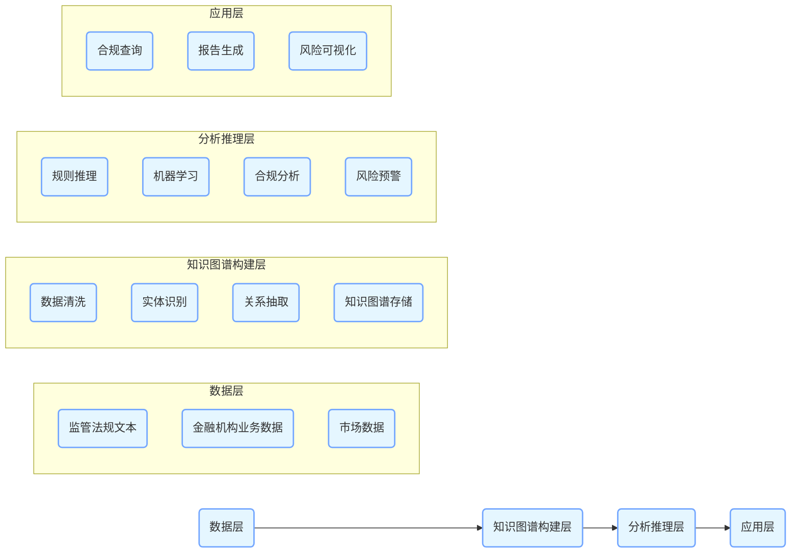

# 构建基于知识图谱的金融监管合规追踪系统

> 关键词：知识图谱、金融监管、合规追踪系统、图数据库、数据融合

> 摘要：本文围绕构建基于知识图谱的金融监管合规追踪系统展开。详细阐述了该系统构建的背景、核心概念、算法原理、数学模型，通过实际项目案例展示了系统的开发过程，探讨了其实际应用场景，推荐了相关的学习资源、开发工具和论文著作。最后对系统未来的发展趋势与挑战进行了总结，并提供了常见问题解答和扩展阅读参考资料。旨在为金融行业构建有效的监管合规追踪系统提供全面的技术指导和实践参考。

## 1. 背景介绍 
### 1.1 目的和范围
金融行业面临着复杂且不断变化的监管要求，合规追踪对于金融机构至关重要。构建基于知识图谱的金融监管合规追踪系统的目的在于利用知识图谱的强大关联能力，整合金融监管法规、机构业务数据、市场动态等多源信息，实现对金融机构合规情况的实时监测、精准预警和深度分析。本系统的范围涵盖了金融行业的多个领域，包括银行、证券、保险等，旨在为金融机构和监管部门提供全面、高效的合规追踪解决方案。

### 1.2 预期读者
本文的预期读者包括金融行业的从业者，如合规管理人员、风险分析师等，他们可以通过本文了解如何利用知识图谱技术提升合规管理效率；软件开发人员和数据科学家，可从中获取构建相关系统的技术思路和实践经验；监管部门的工作人员，有助于其深入理解基于知识图谱的监管工具，为制定监管政策提供参考。

### 1.3 文档结构概述
本文将按照以下结构进行阐述：首先介绍核心概念与联系，包括知识图谱、金融监管合规等概念及其相互关系，并给出相应的文本示意图和 Mermaid 流程图；接着详细讲解核心算法原理和具体操作步骤，使用 Python 源代码进行说明；然后介绍系统涉及的数学模型和公式，并举例说明；通过实际项目案例，详细阐述开发环境搭建、源代码实现和代码解读；探讨系统的实际应用场景；推荐相关的学习资源、开发工具和论文著作；最后总结系统未来的发展趋势与挑战，提供常见问题解答和扩展阅读参考资料。

### 1.4 术语表
#### 1.4.1 核心术语定义
- **知识图谱**：一种以图结构形式表示实体及其之间关系的语义网络，通过节点表示实体，边表示实体之间的关系，能够整合多源数据，揭示数据背后的语义信息。
- **金融监管合规**：金融机构在开展业务过程中，必须遵守国家法律法规、监管政策和行业规范的要求，确保业务活动的合法性、稳健性和透明度。
- **合规追踪系统**：用于实时监测金融机构业务活动是否符合监管要求，及时发现潜在合规风险，并提供相应预警和解决方案的信息系统。

#### 1.4.2 相关概念解释
- **图数据库**：专门用于存储和管理图数据的数据库，能够高效地处理节点和边的存储、查询和分析，是知识图谱构建和应用的重要支撑技术。
- **数据融合**：将来自不同数据源、不同格式的数据进行整合和处理，消除数据之间的冲突和冗余，形成统一、一致的数据集合，为知识图谱的构建提供高质量的数据基础。

#### 1.4.3 缩略词列表
- **KG**：Knowledge Graph，知识图谱
- **RDF**：Resource Description Framework，资源描述框架
- **Neo4j**：一种流行的图数据库管理系统

## 2. 核心概念与联系 

### 核心概念原理
知识图谱是构建金融监管合规追踪系统的核心技术。它通过将金融监管法规、金融机构业务实体（如客户、产品、交易等）以及它们之间的关系以图的形式表示出来，能够清晰地展示金融业务的全貌和监管要求的关联。例如，一条监管法规可能与多个金融产品相关，而一个金融产品又涉及多个客户交易，通过知识图谱可以直观地反映这些复杂的关系。

### 架构的文本示意图
金融监管合规追踪系统的架构主要包括数据层、知识图谱构建层、分析推理层和应用层。
- **数据层**：收集来自多个数据源的金融数据，包括监管法规文本、金融机构内部业务数据、市场数据等。
- **知识图谱构建层**：对数据层的数据进行清洗、预处理和实体识别、关系抽取等操作，构建知识图谱。
- **分析推理层**：基于构建好的知识图谱，运用规则推理、机器学习等方法进行合规分析和风险预警。
- **应用层**：为金融机构和监管部门提供合规查询、报告生成、风险可视化等应用服务。

### Mermaid 流程图


## 3. 核心算法原理 & 具体操作步骤 

### 实体识别算法原理
实体识别是知识图谱构建的基础步骤，其目的是从文本数据中识别出具有特定意义的实体。常见的实体识别算法有基于规则的方法、基于机器学习的方法和基于深度学习的方法。这里我们以基于深度学习的 BiLSTM - CRF 模型为例进行介绍。

BiLSTM（双向长短期记忆网络）能够捕捉文本中的上下文信息，通过正向和反向的 LSTM 网络分别处理文本序列，将两个方向的隐藏状态拼接起来，得到更丰富的特征表示。CRF（条件随机场）则用于对实体标签进行序列标注，考虑标签之间的上下文依赖关系，提高实体识别的准确性。

### Python 代码实现
```python
import torch
import torch.nn as nn
from torchcrf import CRF

class BiLSTM_CRF(nn.Module):
    def __init__(self, vocab_size, embedding_dim, hidden_dim, num_tags):
        super(BiLSTM_CRF, self).__init__()
        self.embedding = nn.Embedding(vocab_size, embedding_dim)
        self.lstm = nn.LSTM(embedding_dim, hidden_dim // 2,
                            num_layers=1, bidirectional=True)
        self.hidden2tag = nn.Linear(hidden_dim, num_tags)
        self.crf = CRF(num_tags)

    def forward(self, x, tags=None):
        embedded = self.embedding(x)
        lstm_out, _ = self.lstm(embedded.view(len(x), 1, -1))
        emissions = self.hidden2tag(lstm_out.view(len(x), -1))
        if tags is not None:
            loss = -self.crf(emissions.unsqueeze(0), tags.unsqueeze(0))
            return loss
        else:
            return self.crf.decode(emissions.unsqueeze(0))


# 示例使用
vocab_size = 1000
embedding_dim = 100
hidden_dim = 200
num_tags = 5
model = BiLSTM_CRF(vocab_size, embedding_dim, hidden_dim, num_tags)
input_tensor = torch.randint(0, vocab_size, (10,))
tags = torch.randint(0, num_tags, (10,))
loss = model(input_tensor, tags)
print(f"Loss: {loss.item()}")
```

### 关系抽取算法原理
关系抽取的目的是识别实体之间的语义关系。一种常见的方法是基于深度学习的卷积神经网络（CNN）。CNN 能够自动提取文本中的局部特征，通过卷积层和池化层对文本进行特征提取和降维，最后通过全连接层输出实体之间的关系类别。

### Python 代码实现
```python
import torch
import torch.nn as nn

class CNN_Relation_Extraction(nn.Module):
    def __init__(self, vocab_size, embedding_dim, num_filters, filter_sizes, num_classes):
        super(CNN_Relation_Extraction, self).__init__()
        self.embedding = nn.Embedding(vocab_size, embedding_dim)
        self.convs = nn.ModuleList([
            nn.Conv2d(1, num_filters, (fs, embedding_dim)) for fs in filter_sizes
        ])
        self.fc = nn.Linear(num_filters * len(filter_sizes), num_classes)

    def forward(self, x):
        embedded = self.embedding(x).unsqueeze(1)
        conved = [nn.functional.relu(conv(embedded)).squeeze(3) for conv in self.convs]
        pooled = [nn.functional.max_pool1d(conv, conv.shape[2]).squeeze(2) for conv in conved]
        cat = torch.cat(pooled, dim=1)
        output = self.fc(cat)
        return output


# 示例使用
vocab_size = 1000
embedding_dim = 100
num_filters = 100
filter_sizes = [3, 4, 5]
num_classes = 3
model = CNN_Relation_Extraction(vocab_size, embedding_dim, num_filters, filter_sizes, num_classes)
input_tensor = torch.randint(0, vocab_size, (10,))
output = model(input_tensor.unsqueeze(0))
print(f"Output shape: {output.shape}")
```

### 具体操作步骤
1. **数据准备**：收集金融监管法规文本、金融机构业务数据等，并进行标注，为实体识别和关系抽取提供训练数据。
2. **模型训练**：使用准备好的训练数据对 BiLSTM - CRF 模型和 CNN 关系抽取模型进行训练，调整模型参数以提高性能。
3. **知识图谱构建**：使用训练好的模型对新的数据进行实体识别和关系抽取，将结果存储到图数据库中，构建知识图谱。
4. **分析推理**：基于构建好的知识图谱，运用规则推理和机器学习算法进行合规分析和风险预警。

## 4. 数学模型和公式 & 详细讲解 & 举例说明 

### BiLSTM - CRF 模型数学公式
#### BiLSTM 部分
BiLSTM 由正向 LSTM 和反向 LSTM 组成。正向 LSTM 的隐藏状态更新公式为：
$$
\begin{align*}
\mathbf{i}_t &= \sigma(\mathbf{W}_{ii}\mathbf{x}_t + \mathbf{W}_{hi}\mathbf{h}_{t - 1} + \mathbf{b}_i)\\
\mathbf{f}_t &= \sigma(\mathbf{W}_{if}\mathbf{x}_t + \mathbf{W}_{hf}\mathbf{h}_{t - 1} + \mathbf{b}_f)\\
\mathbf{g}_t &= \tanh(\mathbf{W}_{ig}\mathbf{x}_t + \mathbf{W}_{hg}\mathbf{h}_{t - 1} + \mathbf{b}_g)\\
\mathbf{c}_t &= \mathbf{f}_t \odot \mathbf{c}_{t - 1} + \mathbf{i}_t \odot \mathbf{g}_t\\
\mathbf{o}_t &= \sigma(\mathbf{W}_{io}\mathbf{x}_t + \mathbf{W}_{ho}\mathbf{h}_{t - 1} + \mathbf{b}_o)\\
\mathbf{h}_t &= \mathbf{o}_t \odot \tanh(\mathbf{c}_t)
\end{align*}
$$
其中，$\mathbf{i}_t$、$\mathbf{f}_t$、$\mathbf{o}_t$ 分别为输入门、遗忘门和输出门，$\mathbf{g}_t$ 为候选记忆单元，$\mathbf{c}_t$ 为记忆单元，$\mathbf{h}_t$ 为隐藏状态，$\sigma$ 为 sigmoid 函数，$\tanh$ 为双曲正切函数，$\mathbf{W}$ 为权重矩阵，$\mathbf{b}$ 为偏置向量，$\odot$ 为逐元素相乘。

反向 LSTM 的隐藏状态更新公式与正向 LSTM 类似，只是时间顺序相反。最后将正向和反向的隐藏状态拼接起来得到最终的隐藏状态 $\mathbf{h}_t^{concat}$。

#### CRF 部分
CRF 的目标是最大化给定输入序列 $\mathbf{x}$ 下标签序列 $\mathbf{y}$ 的条件概率 $P(\mathbf{y}|\mathbf{x})$。其对数似然函数为：
$$
\log P(\mathbf{y}|\mathbf{x}) = \mathbf{s}(\mathbf{x}, \mathbf{y}) - \log Z(\mathbf{x})
$$
其中，$\mathbf{s}(\mathbf{x}, \mathbf{y})$ 为标签序列 $\mathbf{y}$ 的得分，$Z(\mathbf{x})$ 为配分函数，定义为所有可能标签序列的得分之和：
$$
Z(\mathbf{x}) = \sum_{\mathbf{y}' \in \mathcal{Y}} \exp(\mathbf{s}(\mathbf{x}, \mathbf{y}'))
$$
在训练过程中，通过最小化负对数似然函数来更新模型参数。

### 举例说明
假设我们有一个文本序列 “张三在银行办理了信用卡”，经过 BiLSTM 处理后得到每个词的隐藏状态，然后输入到 CRF 层进行序列标注。假设标签集合为 {“人名”，“机构名”，“业务名”，“其他”}，CRF 会根据输入的隐藏状态和标签之间的转移概率，计算出最可能的标签序列，如 [“人名”，“机构名”，“其他”，“业务名”]，从而完成实体识别任务。

### CNN 关系抽取模型数学公式
#### 卷积层
卷积层的计算公式为：
$$
\mathbf{c}_i = \tanh(\mathbf{W} \cdot \mathbf{x}_{i:i + k - 1} + \mathbf{b})
$$
其中，$\mathbf{x}_{i:i + k - 1}$ 为输入文本的第 $i$ 到 $i + k - 1$ 个词的向量表示，$\mathbf{W}$ 为卷积核，$\mathbf{b}$ 为偏置向量，$\tanh$ 为激活函数，$\mathbf{c}_i$ 为卷积后的特征向量。

#### 池化层
池化层通常采用最大池化，计算公式为：
$$
\mathbf{p} = \max(\mathbf{c})
$$
其中，$\mathbf{c}$ 为卷积层的输出，$\mathbf{p}$ 为池化后的特征向量。

#### 全连接层
全连接层的计算公式为：
$$
\mathbf{y} = \mathbf{W}_{fc} \cdot \mathbf{p} + \mathbf{b}_{fc}
$$
其中，$\mathbf{W}_{fc}$ 为全连接层的权重矩阵，$\mathbf{b}_{fc}$ 为偏置向量，$\mathbf{y}$ 为输出的关系类别得分。

### 举例说明
假设我们有两个实体 “张三” 和 “银行”，以及它们所在的文本上下文，通过 CNN 模型进行关系抽取。卷积层会提取文本中的局部特征，池化层对特征进行降维，最后全连接层输出它们之间的关系类别，如 “客户 - 机构” 关系。

## 5. 项目实战：代码实际案例和详细解释说明 

### 5.1  开发环境搭建
#### 硬件环境
- 服务器：建议使用多核 CPU 和大容量内存的服务器，如 Intel Xeon 系列 CPU，内存 32GB 以上。
- 存储：使用高速硬盘或固态硬盘，以满足数据存储和读写需求。

#### 软件环境
- 操作系统：Linux 系统，如 Ubuntu 18.04 或 CentOS 7。
- 编程语言：Python 3.7 及以上版本。
- 数据库：Neo4j 图数据库，用于存储知识图谱数据。

#### 安装依赖库
```bash
pip install torch torchcrf numpy pandas neo4j
```

### 5.2  源代码详细实现和代码解读
#### 数据预处理
```python
import pandas as pd
from sklearn.model_selection import train_test_split

# 读取数据
data = pd.read_csv('financial_data.csv')

# 划分训练集和测试集
train_data, test_data = train_test_split(data, test_size=0.2, random_state=42)

# 数据清洗和标注
def preprocess_data(data):
    # 清洗文本数据
    data['text'] = data['text'].str.replace('[^\w\s]', '')
    # 标注实体和关系
    # 这里省略具体的标注代码
    return data

train_data = preprocess_data(train_data)
test_data = preprocess_data(test_data)
```
代码解读：首先使用 `pandas` 库读取金融数据文件，然后使用 `sklearn` 库的 `train_test_split` 函数将数据划分为训练集和测试集。`preprocess_data` 函数用于对数据进行清洗和标注，具体的标注过程可以根据实际需求进行实现。

#### 实体识别模型训练
```python
from torch.utils.data import Dataset, DataLoader
import torch.optim as optim

# 自定义数据集类
class FinancialDataset(Dataset):
    def __init__(self, data):
        self.data = data

    def __len__(self):
        return len(self.data)

    def __getitem__(self, idx):
        text = self.data.iloc[idx]['text']
        tags = self.data.iloc[idx]['tags']
        # 这里需要将文本和标签转换为模型输入的格式
        # 省略具体代码
        return text, tags

train_dataset = FinancialDataset(train_data)
train_dataloader = DataLoader(train_dataset, batch_size=32, shuffle=True)

# 初始化模型
vocab_size = 1000
embedding_dim = 100
hidden_dim = 200
num_tags = 5
model = BiLSTM_CRF(vocab_size, embedding_dim, hidden_dim, num_tags)

# 定义优化器
optimizer = optim.Adam(model.parameters(), lr=0.001)

# 训练模型
num_epochs = 10
for epoch in range(num_epochs):
    total_loss = 0
    for texts, tags in train_dataloader:
        optimizer.zero_grad()
        loss = model(texts, tags)
        loss.backward()
        optimizer.step()
        total_loss += loss.item()
    print(f'Epoch {epoch + 1}, Loss: {total_loss / len(train_dataloader)}')
```
代码解读：定义了一个自定义的数据集类 `FinancialDataset`，用于封装训练数据。使用 `DataLoader` 类将数据集封装为可迭代的数据加载器。初始化 BiLSTM - CRF 模型，并定义优化器。在训练过程中，通过循环遍历数据加载器，计算损失并进行反向传播和参数更新。

#### 关系抽取模型训练
```python
# 同样定义数据集和数据加载器
train_dataset_rel = FinancialDataset(train_data)
train_dataloader_rel = DataLoader(train_dataset_rel, batch_size=32, shuffle=True)

# 初始化关系抽取模型
vocab_size = 1000
embedding_dim = 100
num_filters = 100
filter_sizes = [3, 4, 5]
num_classes = 3
model_rel = CNN_Relation_Extraction(vocab_size, embedding_dim, num_filters, filter_sizes, num_classes)

# 定义损失函数和优化器
criterion = nn.CrossEntropyLoss()
optimizer_rel = optim.Adam(model_rel.parameters(), lr=0.001)

# 训练模型
num_epochs = 10
for epoch in range(num_epochs):
    total_loss = 0
    for texts, labels in train_dataloader_rel:
        optimizer_rel.zero_grad()
        outputs = model_rel(texts)
        loss = criterion(outputs, labels)
        loss.backward()
        optimizer_rel.step()
        total_loss += loss.item()
    print(f'Epoch {epoch + 1}, Loss: {total_loss / len(train_dataloader_rel)}')
```
代码解读：与实体识别模型训练类似，定义了关系抽取模型的数据集和数据加载器。初始化 CNN 关系抽取模型，并定义损失函数和优化器。在训练过程中，通过循环遍历数据加载器，计算损失并进行反向传播和参数更新。

#### 知识图谱构建
```python
from neo4j import GraphDatabase

# 连接 Neo4j 数据库
uri = "bolt://localhost:7687"
driver = GraphDatabase.driver(uri, auth=("neo4j", "password"))

def create_entity(tx, entity_name, entity_type):
    tx.run("MERGE (e:Entity {name: $name, type: $type})", name=entity_name, type=entity_type)

def create_relationship(tx, entity1_name, entity2_name, relation_type):
    tx.run("MATCH (e1:Entity {name: $name1}), (e2:Entity {name: $name2}) "
           "MERGE (e1)-[r:Relation {type: $type}]->(e2)",
           name1=entity1_name, name2=entity2_name, type=relation_type)

# 使用训练好的模型进行实体识别和关系抽取
for text in test_data['text']:
    entities = model.predict_entities(text)
    relations = model_rel.predict_relations(text, entities)
    with driver.session() as session:
        for entity in entities:
            session.write_transaction(create_entity, entity.name, entity.type)
        for relation in relations:
            session.write_transaction(create_relationship, relation.entity1.name, relation.entity2.name, relation.type)

driver.close()
```
代码解读：使用 `neo4j` 库连接到 Neo4j 数据库。定义了创建实体和关系的函数。使用训练好的实体识别和关系抽取模型对测试数据进行处理，将识别出的实体和关系存储到 Neo4j 数据库中，构建知识图谱。

### 5.3  代码解读与分析
#### 数据预处理部分
数据预处理是整个项目的基础，通过清洗和标注数据，为模型训练提供高质量的输入。划分训练集和测试集可以评估模型的泛化能力。

#### 模型训练部分
实体识别和关系抽取模型的训练过程类似，都是通过定义数据集、数据加载器、模型、损失函数和优化器，然后进行多次迭代训练，不断调整模型参数以提高性能。

#### 知识图谱构建部分
使用 Neo4j 图数据库存储知识图谱数据，通过创建实体和关系的函数，将模型识别出的实体和关系存储到数据库中。这种方式可以方便地进行知识图谱的查询和分析。

## 6. 实际应用场景 
### 合规监测与预警
金融机构可以使用基于知识图谱的金融监管合规追踪系统实时监测业务活动是否符合监管要求。系统可以通过知识图谱的关联分析，及时发现潜在的合规风险，并发出预警。例如，当某笔交易涉及到禁止的客户或业务类型时，系统可以立即发出警报，提醒合规管理人员进行处理。

### 风险评估与管理
监管部门可以利用系统对金融机构的整体风险状况进行评估。通过分析知识图谱中金融机构与监管法规、市场风险因素等之间的关系，评估机构的合规程度和风险水平。例如，通过分析金融机构的业务结构、客户群体和交易行为，预测其可能面临的信用风险、市场风险等。

### 监管政策分析
知识图谱可以帮助监管部门更好地理解监管政策的影响范围和实施效果。通过将监管政策与金融机构的业务数据进行关联，分析政策对不同机构、不同业务的影响，为政策制定和调整提供参考依据。例如，分析某项新的监管政策对银行业务的盈利能力、风险水平的影响。

### 客户身份识别与反洗钱
在金融业务中，客户身份识别和反洗钱是重要的合规要求。知识图谱可以整合客户的多源信息，如身份信息、交易记录、社交关系等，通过关联分析发现潜在的洗钱风险。例如，通过分析客户之间的资金往来关系和交易模式，识别出异常的资金流动，及时采取措施防范洗钱活动。

## 7. 工具和资源推荐
### 7.1 学习资源推荐
#### 7.1.1 书籍推荐
- 《知识图谱：方法、实践与应用》：全面介绍了知识图谱的基本概念、技术方法和实际应用案例，适合初学者和有一定基础的开发者阅读。
- 《深度学习》：由 Ian Goodfellow、Yoshua Bengio 和 Aaron Courville 编写，是深度学习领域的经典教材，对理解深度学习算法在知识图谱构建中的应用有很大帮助。
- 《Python 数据分析实战》：介绍了 Python 在数据分析领域的应用，包括数据处理、可视化和机器学习等方面，对于处理金融数据和构建金融监管合规追踪系统非常有用。

#### 7.1.2 在线课程
- Coursera 上的 “Knowledge Graphs” 课程：由阿姆斯特丹大学的教授授课，系统地介绍了知识图谱的理论和实践，包括知识表示、知识获取、知识推理等方面的内容。
- edX 上的 “Deep Learning Specialization” 课程：由 Andrew Ng 教授授课，深入讲解了深度学习的各种算法和应用，对理解和应用深度学习模型进行实体识别和关系抽取有很大帮助。

#### 7.1.3 技术博客和网站
- 博客园：有很多开发者分享知识图谱、金融科技等方面的技术文章和实践经验。
- Medium：有许多专业的技术博主发布关于知识图谱、人工智能等领域的最新研究成果和实践案例。
- 开源中国：提供了丰富的开源项目资源和技术文章，对于学习和实践知识图谱相关技术有很大帮助。

### 7.2 开发工具框架推荐
#### 7.2.1 IDE和编辑器
- PyCharm：是一款专业的 Python 集成开发环境，具有代码自动补全、调试、版本控制等功能，适合开发基于 Python 的金融监管合规追踪系统。
- Visual Studio Code：是一款轻量级的代码编辑器，支持多种编程语言和插件扩展，具有丰富的开发工具和社区资源。

#### 7.2.2 调试和性能分析工具
- PyTorch Profiler：可以对 PyTorch 模型的性能进行分析，帮助开发者找出模型训练过程中的性能瓶颈，优化代码性能。
- Neo4j Browser：是 Neo4j 图数据库的可视化工具，可以方便地进行知识图谱的查询和可视化展示，帮助开发者调试和验证知识图谱的构建结果。

#### 7.2.3 相关框架和库
- PyTorch：是一个开源的深度学习框架，提供了丰富的神经网络层和优化算法，方便开发者实现实体识别和关系抽取等深度学习模型。
- Neo4j Python Driver：是 Neo4j 图数据库的 Python 驱动程序，提供了与 Neo4j 数据库进行交互的接口，方便开发者将知识图谱数据存储到 Neo4j 数据库中。
- SpaCy：是一个开源的自然语言处理库，提供了高效的实体识别、词性标注等功能，可以作为实体识别的基础工具。

### 7.3 相关论文著作推荐
#### 7.3.1 经典论文
- “Knowledge Graph Embedding: A Survey of Approaches and Applications”：对知识图谱嵌入技术进行了全面的综述，介绍了各种知识图谱嵌入方法的原理和应用场景。
- “Entity Recognition and Classification in News”：提出了一种基于机器学习的实体识别方法，在新闻文本的实体识别任务中取得了较好的效果。

#### 7.3.2 最新研究成果
- 关注 ACL（Association for Computational Linguistics）、KDD（Knowledge Discovery and Data Mining）等顶级学术会议上的最新研究成果，了解知识图谱和金融监管合规领域的最新技术和方法。

#### 7.3.3 应用案例分析
- 一些金融机构和研究机构会发布关于金融监管合规系统的应用案例分析报告，可以从中了解实际项目中的技术选型、实施过程和应用效果。

## 8. 总结：未来发展趋势与挑战
### 未来发展趋势
#### 与其他技术的融合
基于知识图谱的金融监管合规追踪系统将与人工智能的其他技术，如自然语言处理、机器学习、深度学习等进一步融合，提高系统的智能化水平。例如，结合强化学习算法，实现系统的自动决策和优化；利用预训练语言模型，提高实体识别和关系抽取的准确性。

#### 跨领域应用拓展
系统将不仅仅局限于金融行业，还将拓展到其他领域，如医疗、能源、交通等。通过构建跨领域的知识图谱，实现不同行业之间的监管信息共享和协同监管，提高整体的监管效率和效果。

#### 实时性和动态性增强
随着金融市场的快速变化和监管要求的不断更新，系统需要具备更强的实时性和动态性。未来的系统将能够实时监测金融数据的变化，及时更新知识图谱，实现对合规风险的实时预警和处理。

### 挑战
#### 数据质量和安全性
金融数据的质量和安全性是构建金融监管合规追踪系统的关键挑战。数据可能存在噪声、缺失值和错误，需要进行有效的数据清洗和预处理。同时，金融数据涉及大量的敏感信息，需要采取严格的安全措施，防止数据泄露和滥用。

#### 知识图谱的构建和维护
知识图谱的构建和维护是一个复杂的过程，需要大量的人力和物力投入。如何从多源、异构的数据中准确地提取实体和关系，构建高质量的知识图谱，以及如何随着数据的更新和业务的变化及时维护知识图谱，是需要解决的重要问题。

#### 技术人才短缺
构建基于知识图谱的金融监管合规追踪系统需要具备跨领域知识的技术人才，包括金融知识、自然语言处理、机器学习、数据库管理等方面的知识。目前，这类复合型技术人才相对短缺，制约了系统的发展和应用。

## 9. 附录：常见问题与解答
### 问题 1：知识图谱构建过程中如何处理数据的不确定性？
解答：在知识图谱构建过程中，可以采用概率图模型、模糊逻辑等方法处理数据的不确定性。例如，使用贝叶斯网络对实体和关系的存在概率进行建模，通过概率推理来处理不确定性信息。另外，也可以采用多源数据融合的方法，通过综合多个数据源的信息来降低不确定性。

### 问题 2：如何评估基于知识图谱的金融监管合规追踪系统的性能？
解答：可以从多个方面评估系统的性能，如准确性、召回率、F1 值等指标用于评估实体识别和关系抽取的性能；系统的响应时间、吞吐量等指标用于评估系统的实时性和处理能力；合规监测的准确率、预警的及时性等指标用于评估系统在合规追踪方面的性能。

### 问题 3：系统如何与金融机构现有的业务系统集成？
解答：可以通过接口的方式实现系统与金融机构现有业务系统的集成。例如，使用 RESTful API 接口实现数据的交互和共享，将业务系统中的数据同步到知识图谱系统中，同时将知识图谱系统的合规分析结果反馈给业务系统。另外，也可以采用消息队列等技术实现系统之间的异步通信。

## 10. 扩展阅读 & 参考资料
### 扩展阅读
- 《金融科技前沿：技术应用与监管挑战》：深入探讨了金融科技领域的最新技术应用和监管挑战，对于理解金融监管合规追踪系统的背景和发展趋势有很大帮助。
- 《人工智能时代的金融风险管理》：介绍了人工智能技术在金融风险管理中的应用，包括知识图谱在风险评估和预警中的作用。

### 参考资料
- 相关金融监管法规文件，如中国人民银行、银保监会、证监会发布的监管政策和规定。
- 开源项目的官方文档，如 PyTorch、Neo4j 等项目的官方文档，提供了详细的使用说明和示例代码。

作者：AI天才研究院/AI Genius Institute & 禅与计算机程序设计艺术 /Zen And The Art of Computer Programming