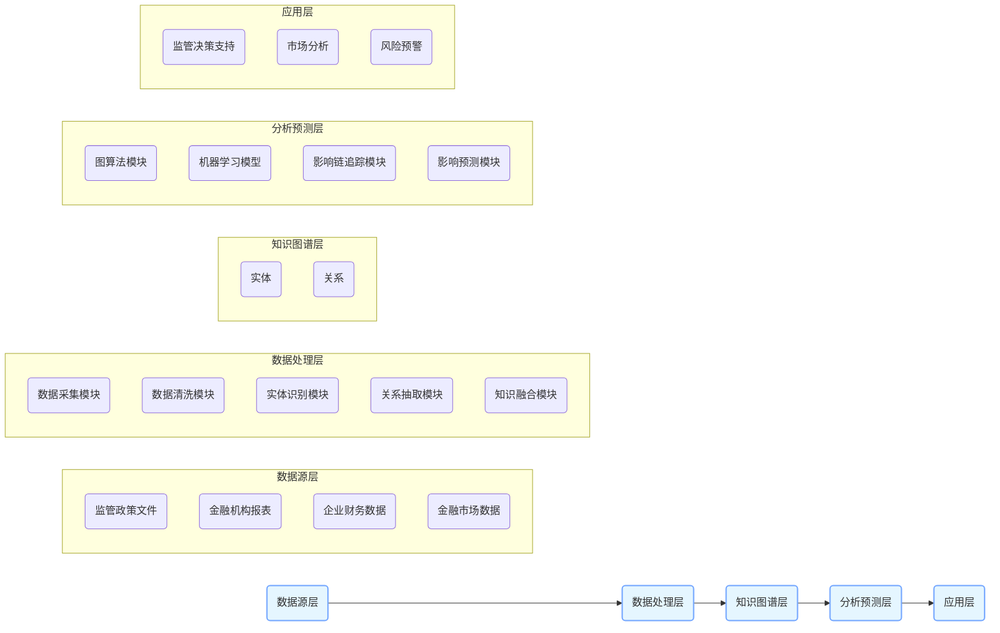

# 构建基于知识图谱的金融监管政策影响链追踪与预测系统

> 关键词：知识图谱、金融监管政策、影响链追踪、影响预测系统、图算法

> 摘要：本文聚焦于构建基于知识图谱的金融监管政策影响链追踪与预测系统。首先介绍了该系统构建的背景、目的和适用读者，明确文档结构和相关术语。详细阐述了知识图谱、金融监管政策影响链等核心概念及其联系，并给出了架构示意图和流程图。深入讲解了系统所涉及的核心算法原理，结合Python代码进行具体操作步骤的说明，同时介绍了相关数学模型和公式。通过项目实战，展示了开发环境搭建、源代码实现及代码解读。探讨了系统在金融市场监测、风险预警等方面的实际应用场景。推荐了学习资源、开发工具框架以及相关论文著作。最后总结了系统未来发展趋势与挑战，并提供常见问题解答和扩展阅读参考资料。

## 1. 背景介绍 
### 1.1 目的和范围
金融监管政策对于维护金融市场的稳定、防范金融风险起着至关重要的作用。然而，金融市场是一个复杂的生态系统，监管政策的出台往往会引发一系列连锁反应，影响到金融机构、企业和投资者等多个主体。传统的监管方式难以全面、准确地追踪政策影响链，也无法对未来的影响进行有效的预测。

本系统的目的在于利用知识图谱技术，构建一个能够追踪金融监管政策影响链并进行预测的系统。该系统的范围涵盖了各类金融监管政策，包括货币政策、财政政策、行业监管政策等，以及这些政策对金融机构（银行、证券、保险等）、企业和金融市场（股票市场、债券市场、外汇市场等）的影响。

### 1.2 预期读者
本文的预期读者包括金融监管机构的工作人员、金融行业的从业者（如分析师、风险管理人员）、对金融科技和知识图谱技术感兴趣的研究人员和开发者。对于金融监管机构人员，可帮助他们更好地理解政策影响，制定更有效的监管策略；金融行业从业者可利用系统进行市场分析和风险预警；研究人员和开发者则可从技术实现角度获取灵感，开展相关研究和开发工作。

### 1.3 文档结构概述
本文将按照以下结构展开：首先介绍核心概念与联系，包括知识图谱、金融监管政策影响链等概念的原理和架构；接着阐述核心算法原理和具体操作步骤，结合Python代码进行说明；然后介绍相关的数学模型和公式，并举例说明；通过项目实战展示系统的开发过程，包括环境搭建、源代码实现和代码解读；探讨系统的实际应用场景；推荐学习资源、开发工具框架和相关论文著作；最后总结系统的未来发展趋势与挑战，提供常见问题解答和扩展阅读参考资料。

### 1.4 术语表
#### 1.4.1 核心术语定义
- **知识图谱**：是一种语义网络，以图的形式表示实体（如金融机构、企业、政策等）及其之间的关系（如政策影响、业务关联等），用于存储和表示知识。
- **金融监管政策**：政府或金融监管机构为了维护金融市场稳定、防范金融风险、促进金融市场健康发展而制定的一系列规则、法规和措施。
- **影响链**：指金融监管政策出台后，在金融市场中引发的一系列连锁反应，表现为政策对不同主体（金融机构、企业等）和市场（股票市场、债券市场等）的影响路径。
- **影响预测**：根据历史数据和当前的知识图谱，对金融监管政策未来可能产生的影响进行估计和推断。

#### 1.4.2 相关概念解释
- **实体**：知识图谱中的节点，表示现实世界中的具体对象，如金融机构、企业、政策等。
- **关系**：知识图谱中连接实体的边，表示实体之间的关联，如“政策影响”“业务合作”等。
- **图算法**：用于处理和分析图数据的算法，如最短路径算法、中心性算法等，在知识图谱分析中具有重要作用。

#### 1.4.3 缩略词列表
- **KG**：Knowledge Graph，知识图谱
- **API**：Application Programming Interface，应用程序编程接口

## 2. 核心概念与联系 
### 核心概念原理
#### 知识图谱
知识图谱是一种基于图的数据结构，由节点（实体）和边（关系）组成。在金融领域，知识图谱可以将金融机构、企业、金融产品、监管政策等实体以及它们之间的关系进行整合和表示。例如，一家银行可能与多个企业有贷款关系，同时受到多项监管政策的影响，这些信息都可以通过知识图谱清晰地展示出来。

知识图谱的构建通常包括数据采集、数据清洗、实体识别、关系抽取和知识融合等步骤。通过这些步骤，可以将分散的金融数据转化为结构化的知识图谱，为后续的分析和预测提供基础。

#### 金融监管政策影响链
金融监管政策影响链描述了监管政策出台后，在金融市场中产生的一系列连锁反应。政策可能直接影响金融机构的业务操作和风险状况，金融机构的变化又会进一步影响企业的融资环境和经营决策，最终影响金融市场的整体表现。例如，货币政策的收紧可能导致银行提高贷款利率，企业的融资成本增加，进而影响企业的投资和生产，最终对股票市场和债券市场产生影响。

### 架构的文本示意图
```plaintext
金融监管政策影响链追踪与预测系统架构

数据源层
|-- 监管政策文件
|-- 金融机构报表
|-- 企业财务数据
|-- 金融市场数据

数据处理层
|-- 数据采集模块
|-- 数据清洗模块
|-- 实体识别模块
|-- 关系抽取模块
|-- 知识融合模块

知识图谱层
|-- 实体（金融机构、企业、政策等）
|-- 关系（政策影响、业务关联等）

分析预测层
|-- 图算法模块（最短路径、中心性等）
|-- 机器学习模型（回归、分类等）
|-- 影响链追踪模块
|-- 影响预测模块

应用层
|-- 监管决策支持
|-- 市场分析
|-- 风险预警
```

### Mermaid 流程图


## 3. 核心算法原理 & 具体操作步骤 
### 核心算法原理
#### 图算法
在知识图谱中，图算法用于分析实体之间的关系和路径。常用的图算法包括最短路径算法（如Dijkstra算法）和中心性算法（如度中心性、介数中心性）。

- **最短路径算法**：用于找到两个实体之间的最短路径，在金融监管政策影响链追踪中，可以找到政策影响的最短路径，帮助监管机构快速了解政策的直接影响范围。
- **中心性算法**：用于衡量实体在知识图谱中的重要性。度中心性衡量实体的连接数量，介数中心性衡量实体在其他实体之间最短路径上的出现频率。通过计算实体的中心性，可以找出在金融市场中具有重要影响力的节点。

#### 机器学习算法
机器学习算法用于对金融监管政策的影响进行预测。常用的机器学习算法包括线性回归、逻辑回归、决策树和神经网络等。

- **线性回归**：用于建立政策变量和市场指标之间的线性关系，预测市场指标随政策变化的趋势。
- **逻辑回归**：用于分类问题，例如预测企业在政策影响下是否会面临财务风险。
- **决策树**：可以处理非线性关系，通过构建决策树模型，对政策影响进行分类和预测。
- **神经网络**：具有强大的非线性拟合能力，能够处理复杂的金融数据，对政策影响进行高精度的预测。

### 具体操作步骤及Python代码实现
#### 图算法示例：最短路径算法（Dijkstra算法）
```python
import heapq

def dijkstra(graph, start):
    distances = {node: float('inf') for node in graph}
    distances[start] = 0
    priority_queue = [(0, start)]

    while priority_queue:
        current_distance, current_node = heapq.heappop(priority_queue)

        if current_distance > distances[current_node]:
            continue

        for neighbor, weight in graph[current_node].items():
            distance = current_distance + weight

            if distance < distances[neighbor]:
                distances[neighbor] = distance
                heapq.heappush(priority_queue, (distance, neighbor))

    return distances

# 示例图
graph = {
    'A': {'B': 1, 'C': 4},
    'B': {'A': 1, 'C': 2, 'D': 5},
    'C': {'A': 4, 'B': 2, 'D': 1},
    'D': {'B': 5, 'C': 1}
}

start_node = 'A'
distances = dijkstra(graph, start_node)
print(f"从节点 {start_node} 到其他节点的最短距离: {distances}")
```

#### 机器学习算法示例：线性回归
```python
import numpy as np
from sklearn.linear_model import LinearRegression

# 示例数据
X = np.array([[1], [2], [3], [4], [5]])
y = np.array([2, 4, 6, 8, 10])

# 创建线性回归模型
model = LinearRegression()

# 拟合模型
model.fit(X, y)

# 预测
new_X = np.array([[6]])
prediction = model.predict(new_X)
print(f"预测值: {prediction}")
```

## 4. 数学模型和公式 & 详细讲解 & 举例说明 
### 图算法相关数学模型和公式
#### 最短路径算法（Dijkstra算法）
Dijkstra算法用于求解单源最短路径问题，其基本思想是从起始节点开始，逐步扩展到其他节点，每次选择距离起始节点最近的节点进行扩展。

设 $G=(V, E)$ 是一个带权有向图，其中 $V$ 是节点集合，$E$ 是边集合。对于每条边 $(u, v) \in E$，有一个非负的权重 $w(u, v)$。设 $s$ 是起始节点，$d(v)$ 表示从 $s$ 到 $v$ 的最短距离。

Dijkstra算法的伪代码如下：
```plaintext
初始化：
    对于所有节点 v in V:
        d(v) = infinity
    d(s) = 0
    优先队列 Q = {s}

循环直到 Q 为空:
    从 Q 中取出距离最小的节点 u
    对于 u 的所有邻接节点 v:
        if d(u) + w(u, v) < d(v):
            d(v) = d(u) + w(u, v)
            将 v 加入 Q
```

举例说明：在上述的图算法示例中，我们使用Dijkstra算法计算从节点 'A' 到其他节点的最短距离。通过不断更新节点的距离值，最终得到最短距离结果。

#### 中心性算法
- **度中心性**：度中心性衡量节点的连接数量，对于有向图，节点 $v$ 的入度中心性 $C_{in}(v)$ 和出度中心性 $C_{out}(v)$ 分别定义为：
$$C_{in}(v) = \text{入边数量}$$
$$C_{out}(v) = \text{出边数量}$$

- **介数中心性**：介数中心性衡量节点在其他节点之间最短路径上的出现频率。节点 $v$ 的介数中心性 $C_{B}(v)$ 定义为：
$$C_{B}(v) = \sum_{s \neq v \neq t} \frac{\sigma_{st}(v)}{\sigma_{st}}$$
其中，$\sigma_{st}$ 是从节点 $s$ 到节点 $t$ 的最短路径数量，$\sigma_{st}(v)$ 是从节点 $s$ 到节点 $t$ 且经过节点 $v$ 的最短路径数量。

### 机器学习算法相关数学模型和公式
#### 线性回归
线性回归模型假设因变量 $y$ 与自变量 $X$ 之间存在线性关系，其数学模型为：
$$y = \beta_0 + \beta_1x_1 + \beta_2x_2 + \cdots + \beta_nx_n + \epsilon$$
其中，$\beta_0, \beta_1, \cdots, \beta_n$ 是模型的参数，$\epsilon$ 是误差项。

通过最小化误差平方和来估计模型参数，即：
$$\min_{\beta_0, \beta_1, \cdots, \beta_n} \sum_{i=1}^{m} (y_i - (\beta_0 + \beta_1x_{i1} + \beta_2x_{i2} + \cdots + \beta_nx_{in}))^2$$

举例说明：在上述的线性回归示例中，我们使用简单的一维数据 $X$ 和 $y$ 来拟合线性回归模型。通过最小化误差平方和，得到模型的参数，进而进行预测。

## 5. 项目实战：代码实际案例和详细解释说明 
### 5.1  开发环境搭建
#### 软件安装
- **Python**：建议安装Python 3.7及以上版本，可以从Python官方网站（https://www.python.org/downloads/）下载安装包进行安装。
- **开发工具**：推荐使用PyCharm或Jupyter Notebook。PyCharm是一款功能强大的Python集成开发环境，Jupyter Notebook则适合进行交互式编程和数据分析。
- **数据库**：使用Neo4j作为知识图谱的存储数据库。Neo4j是一个开源的图数据库，支持高效的图数据存储和查询。可以从Neo4j官方网站（https://neo4j.com/download/）下载安装包进行安装。

#### 库安装
在命令行中使用以下命令安装所需的Python库：
```sh
pip install neo4j pandas numpy scikit-learn
```

### 5.2  源代码详细实现和代码解读
#### 数据采集和处理
```python
import pandas as pd

# 模拟读取监管政策文件、金融机构报表等数据
policy_data = pd.read_csv('policy_data.csv')
institution_data = pd.read_csv('institution_data.csv')
market_data = pd.read_csv('market_data.csv')

# 数据清洗
policy_data = policy_data.dropna()
institution_data = institution_data.dropna()
market_data = market_data.dropna()

# 实体识别和关系抽取
# 这里可以使用自然语言处理技术，如命名实体识别和关系抽取模型
# 示例：简单的实体识别和关系定义
entities = []
relationships = []

for index, row in policy_data.iterrows():
    policy_entity = {'id': row['policy_id'], 'type': 'Policy', 'name': row['policy_name']}
    entities.append(policy_entity)

for index, row in institution_data.iterrows():
    institution_entity = {'id': row['institution_id'], 'type': 'Institution', 'name': row['institution_name']}
    entities.append(institution_entity)
    # 假设政策对金融机构有影响关系
    relationship = {'source': row['policy_id'], 'target': row['institution_id'], 'type': 'PolicyImpact'}
    relationships.append(relationship)
```
代码解读：首先，使用`pandas`库读取模拟的监管政策文件、金融机构报表和金融市场数据。然后进行数据清洗，去除缺失值。接着进行简单的实体识别和关系抽取，将政策和金融机构作为实体，定义政策对金融机构的影响关系。

#### 知识图谱构建
```python
from neo4j import GraphDatabase

# 连接Neo4j数据库
uri = "bolt://localhost:7687"
driver = GraphDatabase.driver(uri, auth=("neo4j", "password"))

def create_entity(tx, entity):
    query = f"MERGE (n:{entity['type']} {{id: $id, name: $name}})"
    tx.run(query, id=entity['id'], name=entity['name'])

def create_relationship(tx, relationship):
    query = f"MATCH (s),(t) WHERE s.id = $source AND t.id = $target MERGE (s)-[r:{relationship['type']}]->(t)"
    tx.run(query, source=relationship['source'], target=relationship['target'])

with driver.session() as session:
    for entity in entities:
        session.write_transaction(create_entity, entity)
    for relationship in relationships:
        session.write_transaction(create_relationship, relationship)

driver.close()
```
代码解读：使用`neo4j`库连接到Neo4j数据库。定义了两个函数`create_entity`和`create_relationship`，分别用于创建实体和关系。通过遍历实体和关系列表，将它们写入Neo4j数据库中。

#### 影响链追踪和预测
```python
from sklearn.linear_model import LinearRegression

# 假设我们有政策变量和市场指标数据
X = policy_data[['policy_variable']]
y = market_data[['market_index']]

# 创建线性回归模型
model = LinearRegression()

# 拟合模型
model.fit(X, y)

# 预测
new_policy_variable = pd.DataFrame([[10]])
prediction = model.predict(new_policy_variable)
print(f"预测的市场指标值: {prediction}")
```
代码解读：使用`sklearn`库中的线性回归模型进行影响预测。假设我们有政策变量和市场指标数据，将政策变量作为自变量，市场指标作为因变量，拟合线性回归模型。然后使用新的政策变量进行预测。

### 5.3  代码解读与分析
#### 数据处理部分
数据处理是构建知识图谱的基础，通过数据采集和清洗，可以确保数据的质量。实体识别和关系抽取是将原始数据转化为知识图谱的关键步骤，需要使用自然语言处理等技术来实现。

#### 知识图谱构建部分
使用Neo4j数据库存储知识图谱，通过创建实体和关系，可以将金融领域的信息以图的形式进行存储和管理。Neo4j的图数据库特性使得可以方便地进行图查询和分析。

#### 影响链追踪和预测部分
使用机器学习算法进行影响预测，可以根据历史数据和当前的政策变量，预测市场指标的变化。线性回归是一种简单而有效的预测方法，但在实际应用中，可能需要使用更复杂的机器学习模型来提高预测的准确性。

## 6. 实际应用场景 
### 监管决策支持
金融监管机构可以利用该系统追踪监管政策的影响链，了解政策对金融机构、企业和金融市场的具体影响。通过对影响链的分析，监管机构可以评估政策的有效性，及时调整监管策略，提高监管效率。例如，当出台一项新的货币政策时，系统可以实时追踪政策对银行信贷业务、企业融资成本和股票市场的影响，为监管机构提供决策依据。

### 市场分析
金融行业的分析师可以使用该系统进行市场分析。通过对知识图谱的挖掘和分析，分析师可以发现市场中的潜在趋势和风险。例如，通过分析政策影响链，分析师可以预测某些行业在政策影响下的发展趋势，为投资者提供投资建议。

### 风险预警
系统可以实时监测金融市场的变化，当发现政策影响可能导致金融风险时，及时发出预警。例如，当某项监管政策可能导致银行不良贷款率上升时，系统可以提前预警，帮助金融机构采取措施防范风险。

## 7. 工具和资源推荐
### 7.1 学习资源推荐
#### 7.1.1 书籍推荐
- 《知识图谱：方法、实践与应用》：全面介绍了知识图谱的理论、方法和应用案例，对于理解知识图谱技术在金融领域的应用具有重要参考价值。
- 《Python数据分析实战》：详细介绍了Python在数据分析中的应用，包括数据采集、清洗、分析和可视化等方面的内容，是学习金融数据处理的优秀书籍。
- 《机器学习》：由周志华教授编写，系统介绍了机器学习的基本概念、算法和应用，对于理解金融监管政策影响预测中的机器学习算法有很大帮助。

#### 7.1.2 在线课程
- Coursera上的“Knowledge Graphs”课程：由美国南加州大学的教授授课，深入讲解了知识图谱的构建、查询和应用等方面的知识。
- edX上的“Python for Data Science”课程：通过实际案例介绍了Python在数据分析中的应用，适合初学者学习。
- 中国大学MOOC上的“机器学习基础”课程：由国内知名高校的教授授课，系统介绍了机器学习的基本原理和算法。

#### 7.1.3 技术博客和网站
- 掘金：提供了丰富的技术文章和案例，包括知识图谱、金融科技等方面的内容。
- 开源中国：关注开源技术的发展，有很多关于图数据库、机器学习等方面的技术分享。
- 金融界网站：提供金融市场的实时数据和分析报告，对于了解金融监管政策和市场动态有很大帮助。

### 7.2 开发工具框架推荐
#### 7.2.1 IDE和编辑器
- PyCharm：功能强大的Python集成开发环境，支持代码编辑、调试、版本控制等功能，适合开发复杂的Python项目。
- Jupyter Notebook：交互式编程环境，适合进行数据分析和模型训练，方便展示代码和结果。
- Visual Studio Code：轻量级的代码编辑器，支持多种编程语言，具有丰富的插件生态系统。

#### 7.2.2 调试和性能分析工具
- PDB：Python自带的调试工具，可以帮助开发者定位代码中的问题。
- cProfile：Python的性能分析工具，可以分析代码的运行时间和函数调用情况，帮助优化代码性能。
- Neo4j Browser：Neo4j数据库的可视化工具，支持对知识图谱进行查询和可视化展示，方便调试和分析。

#### 7.2.3 相关框架和库
- Neo4j Python Driver：用于连接和操作Neo4j数据库的Python库，提供了简单易用的API。
- Pandas：强大的数据分析库，支持数据读取、清洗、处理和分析等操作，是金融数据处理的常用工具。
- Scikit-learn：机器学习库，提供了丰富的机器学习算法和工具，方便进行模型训练和预测。

### 7.3 相关论文著作推荐
#### 7.3.1 经典论文
- “Knowledge Graph Embedding: A Survey of Approaches and Applications”：对知识图谱嵌入技术进行了全面的综述，介绍了各种知识图谱嵌入方法和应用场景。
- “Machine Learning in Finance: The Case of Algorithmic Trading”：探讨了机器学习在金融算法交易中的应用，对于理解机器学习在金融领域的应用有重要参考价值。
- “Graph Neural Networks: A Review of Methods and Applications”：对图神经网络进行了综述，介绍了图神经网络的原理、算法和应用，为知识图谱分析提供了新的思路。

#### 7.3.2 最新研究成果
- 在顶级学术会议（如KDD、SIGIR等）和期刊（如Journal of Financial Economics、Journal of Banking & Finance等）上搜索关于金融监管政策影响分析和知识图谱应用的最新研究成果。

#### 7.3.3 应用案例分析
- 可以参考金融机构和监管机构发布的报告和案例分析，了解知识图谱在金融监管政策影响链追踪和预测中的实际应用情况。

## 8. 总结：未来发展趋势与挑战
### 未来发展趋势
#### 多源数据融合
未来，系统将融合更多来源的数据，如社交媒体数据、新闻资讯数据等，以更全面地了解金融市场的动态和政策影响。通过多源数据融合，可以发现更多潜在的影响因素和关系，提高影响链追踪和预测的准确性。

#### 人工智能技术的深度应用
随着人工智能技术的不断发展，系统将更多地应用深度学习、强化学习等技术。深度学习模型可以处理更复杂的金融数据和关系，强化学习可以根据环境的变化自动调整预测策略，提高系统的智能水平和适应性。

#### 与区块链技术的结合
区块链技术具有去中心化、不可篡改等特点，可以为金融监管政策影响链追踪和预测系统提供更可靠的数据来源和安全保障。通过将知识图谱与区块链技术结合，可以确保数据的真实性和完整性，提高系统的可信度。

### 挑战
#### 数据质量和隐私保护
金融数据的质量和隐私保护是系统面临的重要挑战。金融数据往往存在噪声、缺失值等问题，需要进行有效的数据清洗和预处理。同时，金融数据涉及大量的个人和企业隐私信息，需要采取严格的隐私保护措施，确保数据的安全。

#### 模型可解释性
机器学习模型在金融监管政策影响预测中具有很高的准确性，但模型的可解释性较差。监管机构和金融从业者需要了解模型的决策过程和依据，以便做出合理的决策。因此，提高模型的可解释性是未来需要解决的重要问题。

#### 技术更新换代快
人工智能和知识图谱技术发展迅速，系统需要不断更新和升级，以适应新的技术和需求。这对开发团队的技术能力和创新能力提出了很高的要求。

## 9. 附录：常见问题与解答
### 问题1：知识图谱的构建需要哪些数据？
答：知识图谱的构建需要多种类型的数据，包括监管政策文件、金融机构报表、企业财务数据、金融市场数据等。此外，还可以利用社交媒体数据、新闻资讯数据等外部数据，以丰富知识图谱的信息。

### 问题2：如何选择合适的机器学习算法进行影响预测？
答：选择合适的机器学习算法需要考虑数据的特点和问题的性质。如果数据具有线性关系，可以选择线性回归算法；如果是分类问题，可以选择逻辑回归、决策树等算法；如果数据复杂且具有非线性关系，可以选择神经网络等深度学习算法。同时，还需要进行模型评估和调优，选择性能最优的算法。

### 问题3：系统的性能如何优化？
答：系统的性能优化可以从多个方面入手。在数据处理方面，可以优化数据采集和清洗的流程，提高数据处理的效率。在知识图谱构建方面，可以优化图数据库的存储和查询策略，提高图查询的速度。在模型训练方面，可以选择合适的算法和参数，进行模型调优，提高模型的训练速度和预测准确性。

### 问题4：如何确保系统的安全性？
答：确保系统的安全性需要采取多种措施。在数据层面，需要对数据进行加密处理，确保数据的隐私和安全。在系统层面，需要设置访问权限和身份验证机制，防止非法访问。同时，需要定期进行安全审计和漏洞修复，及时发现和解决安全问题。

## 10. 扩展阅读 & 参考资料
### 扩展阅读
- 《人工智能时代的金融监管》：探讨了人工智能技术在金融监管中的应用和挑战，为理解金融监管政策影响链追踪与预测系统的背景和意义提供了更深入的视角。
- 《金融科技前沿》：介绍了金融科技领域的最新发展动态和技术应用，对于了解金融监管政策影响链追踪与预测系统的未来发展趋势有很大帮助。

### 参考资料
- 《Knowledge Graphs in Finance: A Survey》：对知识图谱在金融领域的应用进行了全面的综述，是了解知识图谱在金融监管政策影响分析中应用的重要参考资料。
- 《Machine Learning for Financial Risk Management》：介绍了机器学习在金融风险管理中的应用，对于理解金融监管政策影响预测中的风险预警部分有重要参考价值。

作者：AI天才研究院/AI Genius Institute & 禅与计算机程序设计艺术 /Zen And The Art of Computer Programming