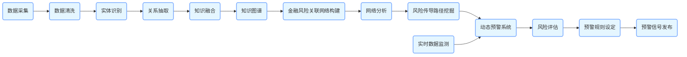

# 构建基于知识图谱的金融风险关联网络动态预警系统

> 关键词：知识图谱、金融风险关联网络、动态预警系统、图数据库、机器学习

> 摘要：本文围绕构建基于知识图谱的金融风险关联网络动态预警系统展开。详细介绍了该系统的背景，包括目的、预期读者等信息。深入剖析了知识图谱、金融风险关联网络等核心概念及其联系，并给出相应的文本示意图和 Mermaid 流程图。阐述了系统涉及的核心算法原理，用 Python 代码进行详细说明。讲解了相关数学模型和公式，并举例解释。通过项目实战展示了系统的开发环境搭建、源代码实现及解读。探讨了系统在金融领域的实际应用场景，推荐了学习、开发相关的工具和资源，最后总结了系统未来发展趋势与挑战，解答常见问题并提供扩展阅读与参考资料。

## 1. 背景介绍 
### 1.1 目的和范围
金融行业面临着各种复杂的风险，传统的风险预警系统往往难以全面、动态地捕捉风险之间的关联关系。本系统的目的在于利用知识图谱技术构建金融风险关联网络，实现对金融风险的动态预警。系统的范围涵盖了金融市场中的各类主体，如企业、金融机构、投资者等，以及它们之间的各种业务关系和风险传导路径。通过整合多源异构数据，构建知识图谱，挖掘潜在的风险关联，为金融监管机构、金融机构和投资者提供及时、准确的风险预警信息。

### 1.2 预期读者
本文的预期读者包括金融领域的从业者，如金融分析师、风险管理人员、监管人员等，他们可以通过本系统更好地识别和管理金融风险；计算机科学领域的研究人员和开发者，他们可以借鉴本系统的技术架构和实现方法，开展相关的研究和开发工作；以及对金融科技感兴趣的爱好者，了解知识图谱在金融风险预警中的应用。

### 1.3 文档结构概述
本文将按照以下结构进行阐述：首先介绍核心概念与联系，包括知识图谱、金融风险关联网络等概念的原理和架构；接着讲解核心算法原理和具体操作步骤，并用 Python 代码详细说明；然后介绍相关的数学模型和公式，并举例说明；通过项目实战展示系统的开发环境搭建、源代码实现和代码解读；探讨系统的实际应用场景；推荐学习和开发相关的工具和资源；最后总结系统的未来发展趋势与挑战，解答常见问题并提供扩展阅读与参考资料。

### 1.4 术语表
#### 1.4.1 核心术语定义
- **知识图谱**：是一种语义网络，用于表示实体、概念及其之间的关系。在金融领域，知识图谱可以整合企业、金融产品、交易记录等多源数据，形成一个结构化的知识网络。
- **金融风险关联网络**：基于知识图谱构建的网络，反映了金融市场中各类主体之间的风险关联关系。通过分析网络结构和节点之间的连接，可以发现潜在的风险传导路径。
- **动态预警系统**：能够实时监测金融市场的变化，根据预设的规则和模型，及时发出风险预警信号的系统。该系统可以根据最新的数据动态调整预警阈值和模型参数。

#### 1.4.2 相关概念解释
- **图数据库**：专门用于存储和处理图数据的数据库，如 Neo4j。图数据库可以高效地存储知识图谱中的实体和关系，并支持复杂的图查询操作。
- **机器学习算法**：用于从数据中学习模式和规律的算法，如决策树、神经网络等。在金融风险预警系统中，机器学习算法可以用于风险评估和预测。
- **数据融合**：将来自不同数据源、不同格式的数据进行整合和清洗，形成统一的数据格式和结构的过程。在构建知识图谱时，数据融合是关键步骤之一。

#### 1.4.3 缩略词列表
- **KG**：Knowledge Graph，知识图谱
- **FRAN**：Financial Risk Association Network，金融风险关联网络
- **DWS**：Dynamic Warning System，动态预警系统

## 2. 核心概念与联系 

### 知识图谱原理
知识图谱是一种以图的形式表示知识的方法，由节点和边组成。节点表示实体或概念，边表示实体之间的关系。例如，在金融知识图谱中，节点可以是企业、金融产品、投资者等，边可以表示股权关系、交易关系、担保关系等。知识图谱的构建过程包括数据采集、数据清洗、实体识别、关系抽取和知识融合等步骤。

### 金融风险关联网络原理
金融风险关联网络是基于知识图谱构建的，它反映了金融市场中各类主体之间的风险关联关系。在这个网络中，节点表示金融主体，边表示风险传导路径。例如，一家企业的经营风险可能通过供应链关系传导到其上下游企业，通过担保关系传导到担保企业，通过股权关系传导到股东企业等。通过分析金融风险关联网络的结构和节点之间的连接，可以发现潜在的风险传导路径，为风险预警提供依据。

### 核心概念架构的文本示意图
```plaintext
金融风险关联网络动态预警系统
|
|-- 知识图谱构建
|   |-- 数据采集
|   |   |-- 金融市场数据
|   |   |-- 企业财务数据
|   |   |-- 监管信息数据
|   |-- 数据清洗
|   |-- 实体识别
|   |-- 关系抽取
|   |-- 知识融合
|
|-- 金融风险关联网络分析
|   |-- 网络构建
|   |-- 节点分析
|   |-- 边分析
|   |-- 风险传导路径挖掘
|
|-- 动态预警系统
|   |-- 数据监测
|   |-- 风险评估
|   |-- 预警规则设定
|   |-- 预警信号发布
```

### Mermaid 流程图


## 3. 核心算法原理 & 具体操作步骤 

### 知识图谱构建算法
知识图谱构建的核心算法包括实体识别和关系抽取。实体识别的目的是从文本数据中识别出实体，常用的算法有基于规则的方法、基于机器学习的方法和基于深度学习的方法。关系抽取的目的是识别实体之间的关系，常用的算法有基于特征工程的方法、基于核方法的方法和基于深度学习的方法。

以下是一个使用 Python 和 SpaCy 库进行实体识别的示例代码：
```python
import spacy

# 加载英文语言模型
nlp = spacy.load("en_core_web_sm")

# 待处理的文本
text = "Apple is a technology company based in California."

# 处理文本
doc = nlp(text)

# 输出识别出的实体
for ent in doc.ents:
    print(ent.text, ent.start_char, ent.end_char, ent.label_)
```
### 金融风险关联网络分析算法
金融风险关联网络分析的核心算法包括图遍历算法、中心性分析算法和社区发现算法。图遍历算法用于遍历金融风险关联网络，发现节点之间的路径。中心性分析算法用于评估节点在网络中的重要性，常用的中心性指标有度中心性、接近中心性和中介中心性。社区发现算法用于将网络划分为不同的社区，发现网络中的聚类结构。

以下是一个使用 NetworkX 库进行度中心性分析的示例代码：
```python
import networkx as nx

# 创建一个简单的图
G = nx.Graph()
G.add_edges_from([(1, 2), (2, 3), (3, 4), (4, 1)])

# 计算度中心性
degree_centrality = nx.degree_centrality(G)

# 输出度中心性结果
for node, centrality in degree_centrality.items():
    print(f"Node {node}: Degree Centrality = {centrality}")
```
### 动态预警算法
动态预警算法的核心是风险评估和预警规则设定。风险评估可以使用机器学习算法，如逻辑回归、决策树和神经网络等，根据历史数据和实时数据预测风险发生的概率。预警规则设定可以根据风险评估结果和业务需求，设定不同的预警阈值和预警级别。

以下是一个使用 Scikit-learn 库进行逻辑回归风险评估的示例代码：
```python
from sklearn.linear_model import LogisticRegression
from sklearn.datasets import make_classification
from sklearn.model_selection import train_test_split

# 生成示例数据
X, y = make_classification(n_samples=1000, n_features=10, n_informative=5, n_redundant=0, random_state=42)

# 划分训练集和测试集
X_train, X_test, y_train, y_test = train_test_split(X, y, test_size=0.2, random_state=42)

# 创建逻辑回归模型
model = LogisticRegression()

# 训练模型
model.fit(X_train, y_train)

# 预测风险概率
y_pred_proba = model.predict_proba(X_test)[:, 1]

# 输出预测结果
print(y_pred_proba)
```

## 4. 数学模型和公式 & 详细讲解 & 举例说明 

### 度中心性公式
度中心性是衡量节点在网络中连接程度的指标，计算公式如下：
$$C_D(v)=\frac{k_v}{N - 1}$$
其中，$C_D(v)$ 表示节点 $v$ 的度中心性，$k_v$ 表示节点 $v$ 的度，即与节点 $v$ 相连的边的数量，$N$ 表示网络中节点的总数。

例如，在一个包含 5 个节点的网络中，节点 $A$ 的度为 3，则节点 $A$ 的度中心性为：
$$C_D(A)=\frac{3}{5 - 1}=\frac{3}{4}=0.75$$

### 逻辑回归模型公式
逻辑回归是一种常用的分类算法，用于预测事件发生的概率。逻辑回归模型的公式如下：
$$P(Y = 1|X)=\frac{1}{1 + e^{-(\beta_0+\beta_1X_1+\beta_2X_2+\cdots+\beta_nX_n)}}$$
其中，$P(Y = 1|X)$ 表示在给定特征 $X=(X_1,X_2,\cdots,X_n)$ 的情况下，事件 $Y = 1$ 发生的概率，$\beta_0,\beta_1,\beta_2,\cdots,\beta_n$ 是模型的参数。

例如，假设我们有一个二分类问题，特征 $X=(X_1,X_2)$，模型的参数 $\beta_0 = 0.5$，$\beta_1 = 0.2$，$\beta_2 = 0.3$，则当 $X_1 = 1$，$X_2 = 2$ 时，事件 $Y = 1$ 发生的概率为：
$$P(Y = 1|X)=\frac{1}{1 + e^{-(0.5 + 0.2\times1+0.3\times2)}}=\frac{1}{1 + e^{-1.3}}\approx0.78$$

## 5. 项目实战：代码实际案例和详细解释说明 

### 5.1  开发环境搭建
- **操作系统**：建议使用 Linux 系统，如 Ubuntu 或 CentOS。
- **编程语言**：Python 3.x。
- **数据库**：Neo4j 图数据库。
- **开发工具**：PyCharm 或 Jupyter Notebook。

### 5.2  源代码详细实现和代码解读
以下是一个完整的基于知识图谱的金融风险关联网络动态预警系统的示例代码：
```python
from py2neo import Graph
import pandas as pd
from sklearn.linear_model import LogisticRegression
from sklearn.model_selection import train_test_split

# 连接 Neo4j 数据库
graph = Graph("bolt://localhost:7687", auth=("neo4j", "password"))

# 从数据库中查询数据
query = """
MATCH (n:Company)-[r:RELATED_TO]->(m:Company)
RETURN n.name as company1, m.name as company2, r.risk_score as risk_score
"""
data = graph.run(query).to_data_frame()

# 数据预处理
X = data[['risk_score']]
y = (data['risk_score'] > 0.5).astype(int)

# 划分训练集和测试集
X_train, X_test, y_train, y_test = train_test_split(X, y, test_size=0.2, random_state=42)

# 创建逻辑回归模型
model = LogisticRegression()

# 训练模型
model.fit(X_train, y_train)

# 预测风险概率
y_pred_proba = model.predict_proba(X_test)[:, 1]

# 输出预测结果
print(y_pred_proba)
```
### 代码解读与分析
- **数据库连接**：使用 `py2neo` 库连接到 Neo4j 图数据库。
- **数据查询**：使用 Cypher 查询语言从数据库中查询金融风险关联数据。
- **数据预处理**：将查询结果转换为 Pandas 数据框，并提取特征和标签。
- **模型训练**：使用逻辑回归模型对数据进行训练。
- **风险预测**：使用训练好的模型对测试数据进行风险预测，并输出预测概率。

## 6. 实际应用场景 
### 金融监管
金融监管机构可以使用基于知识图谱的金融风险关联网络动态预警系统，实时监测金融市场的风险状况，发现潜在的系统性风险。通过分析金融机构之间的关联关系和风险传导路径，监管机构可以提前采取措施，防范金融风险的扩散。

### 金融机构风险管理
金融机构可以利用该系统对自身的业务风险进行评估和管理。通过构建内部的知识图谱，金融机构可以识别客户、交易和资产之间的风险关联关系，及时发现潜在的风险点，并采取相应的风险控制措施。

### 投资者决策支持
投资者可以使用该系统获取金融市场的风险信息，辅助投资决策。通过分析企业之间的关联关系和风险传导路径，投资者可以更好地评估投资组合的风险，避免投资于高风险的企业和行业。

## 7. 工具和资源推荐
### 7.1 学习资源推荐
#### 7.1.1 书籍推荐
- 《知识图谱：方法、实践与应用》：全面介绍了知识图谱的理论、方法和应用，是学习知识图谱的经典书籍。
- 《Python 数据分析实战》：详细介绍了 Python 在数据分析领域的应用，包括数据处理、可视化和机器学习等方面的内容。
- 《金融风险管理》：系统介绍了金融风险管理的理论和方法，对于理解金融风险预警系统的原理和应用有很大帮助。

#### 7.1.2 在线课程
- Coursera 上的“Knowledge Graphs”课程：由知名教授授课，深入讲解了知识图谱的构建、存储和应用。
- edX 上的“Python for Data Science”课程：提供了 Python 数据分析的基础知识和实践经验。
- 网易云课堂上的“金融风险管理实战”课程：结合实际案例，介绍了金融风险管理的方法和工具。

#### 7.1.3 技术博客和网站
- 知识图谱社区（https://kg.cs.tsinghua.edu.cn/）：提供了知识图谱领域的最新研究成果和技术动态。
- 开源中国（https://www.oschina.net/）：涵盖了各种开源技术和项目，包括知识图谱和金融科技相关的项目。
- 金融界（https://www.jrj.com.cn/）：提供了丰富的金融市场信息和分析报告。

### 7.2 开发工具框架推荐
#### 7.2.1 IDE和编辑器
- PyCharm：一款功能强大的 Python 集成开发环境，提供了代码编辑、调试、版本控制等功能。
- Jupyter Notebook：一种交互式的开发环境，适合进行数据分析和机器学习实验。
- Visual Studio Code：一款轻量级的代码编辑器，支持多种编程语言和插件扩展。

#### 7.2.2 调试和性能分析工具
- PDB：Python 自带的调试工具，可以帮助开发者定位和解决代码中的问题。
- cProfile：Python 自带的性能分析工具，可以分析代码的运行时间和资源消耗情况。
- Neo4j Browser：Neo4j 图数据库的可视化工具，可以方便地进行数据查询和分析。

#### 7.2.3 相关框架和库
- Py2neo：用于连接和操作 Neo4j 图数据库的 Python 库。
- SpaCy：用于自然语言处理的 Python 库，提供了实体识别、关系抽取等功能。
- NetworkX：用于图分析的 Python 库，提供了图遍历、中心性分析等算法。

### 7.3 相关论文著作推荐
#### 7.3.1 经典论文
- 《Knowledge Graph Embedding: A Survey of Approaches and Applications》：对知识图谱嵌入技术进行了全面的综述，介绍了各种知识图谱嵌入方法和应用场景。
- 《Financial Risk Assessment Using Machine Learning Techniques》：探讨了机器学习技术在金融风险评估中的应用，提出了一些有效的风险评估模型。
- 《Graph Neural Networks for Financial Risk Prediction》：研究了图神经网络在金融风险预测中的应用，展示了图神经网络在处理金融关联数据方面的优势。

#### 7.3.2 最新研究成果
- 《Dynamic Knowledge Graph for Real-Time Financial Risk Monitoring》：提出了一种动态知识图谱的方法，用于实时监测金融风险。
- 《Multi-Relational Graph Convolutional Networks for Financial Risk Analysis》：研究了多关系图卷积网络在金融风险分析中的应用，提高了风险分析的准确性。
- 《Deep Learning for Financial Risk Prediction: A Review》：对深度学习在金融风险预测中的应用进行了综述，总结了最新的研究成果和发展趋势。

#### 7.3.3 应用案例分析
- 《Case Study: Using Knowledge Graphs for Financial Fraud Detection》：介绍了使用知识图谱进行金融欺诈检测的实际案例，分析了知识图谱在欺诈检测中的优势和挑战。
- 《Application of Financial Risk Association Network in Credit Risk Assessment》：探讨了金融风险关联网络在信用风险评估中的应用，通过实际案例验证了该方法的有效性。
- 《Real-Time Risk Monitoring System Based on Knowledge Graph in Financial Institutions》：介绍了金融机构基于知识图谱构建实时风险监测系统的案例，分享了系统的设计和实现经验。

## 8. 总结：未来发展趋势与挑战
### 未来发展趋势
- **多源数据融合**：未来的金融风险关联网络动态预警系统将整合更多类型的数据，如社交媒体数据、物联网数据等，以更全面地反映金融市场的风险状况。
- **深度学习与图神经网络的应用**：深度学习和图神经网络技术将在金融风险预警中得到更广泛的应用，提高风险预测的准确性和效率。
- **实时监测与动态调整**：系统将实现更实时的风险监测和动态调整，能够及时响应金融市场的变化，提供更及时、准确的预警信息。

### 挑战
- **数据质量与隐私保护**：多源数据的融合带来了数据质量和隐私保护的挑战，需要确保数据的准确性、完整性和安全性。
- **模型可解释性**：深度学习和图神经网络模型的可解释性较差，需要研究有效的方法来解释模型的决策过程，提高模型的可信度。
- **系统性能与扩展性**：随着数据量的增加和业务的发展，系统需要具备良好的性能和扩展性，以满足大规模数据处理和实时预警的需求。

## 9. 附录：常见问题与解答
### 问题 1：知识图谱构建过程中，如何处理多源异构数据？
解答：处理多源异构数据需要进行数据清洗、转换和融合。首先，对不同数据源的数据进行清洗，去除噪声和错误数据；然后，将数据转换为统一的格式和结构；最后，使用数据融合技术将不同数据源的数据整合到知识图谱中。

### 问题 2：金融风险关联网络中的风险传导路径是如何确定的？
解答：风险传导路径可以通过图遍历算法和机器学习算法来确定。图遍历算法可以发现节点之间的路径，机器学习算法可以根据历史数据和实时数据预测风险传导的概率。

### 问题 3：动态预警系统的预警阈值是如何设定的？
解答：预警阈值可以根据历史数据、业务需求和风险偏好来设定。可以使用统计分析方法和机器学习算法来确定合理的预警阈值。

## 10. 扩展阅读 & 参考资料
- 《人工智能：现代方法》
- 《数据挖掘：概念与技术》
- 《图算法》
- https://neo4j.com/
- https://scikit-learn.org/
- https://spacy.io/

作者：AI天才研究院/AI Genius Institute & 禅与计算机程序设计艺术 /Zen And The Art of Computer Programming