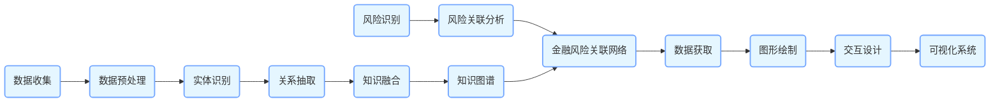
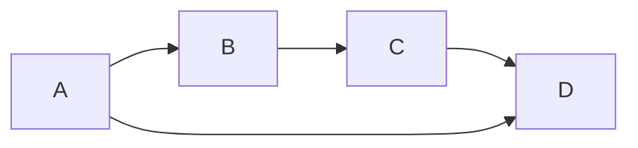

# 构建基于知识图谱的金融风险关联网络可视化系统

> 关键词：知识图谱、金融风险关联网络、可视化系统、图数据库、数据分析

> 摘要：本文围绕构建基于知识图谱的金融风险关联网络可视化系统展开。首先介绍了构建该系统的背景、目的和预期读者等内容。接着详细阐述了知识图谱、金融风险关联网络等核心概念及其联系，并给出了相应的原理和架构示意图。通过 Python 代码深入讲解了核心算法原理和具体操作步骤，同时介绍了相关的数学模型和公式。在项目实战部分，详细说明了开发环境搭建、源代码实现及代码解读。还探讨了该系统的实际应用场景，推荐了学习资源、开发工具框架和相关论文著作。最后对系统未来发展趋势与挑战进行总结，并给出常见问题解答和扩展阅读参考资料，旨在为金融领域的风险监测和管理提供有效的技术支持和解决方案。

## 1. 背景介绍 
### 1.1 目的和范围
在金融领域，风险的监测和管理至关重要。随着金融业务的不断发展和复杂化，金融机构面临着各种各样的风险，如信用风险、市场风险、操作风险等。这些风险之间存在着复杂的关联关系，传统的风险分析方法往往难以全面、准确地捕捉这些关联。知识图谱作为一种强大的知识表示和推理工具，可以有效地整合金融领域的各种数据，揭示实体之间的复杂关系。本项目的目的是构建一个基于知识图谱的金融风险关联网络可视化系统，通过可视化的方式直观地展示金融风险之间的关联关系，帮助金融从业者更好地理解和管理风险。

本系统的范围主要包括以下几个方面：
- 数据收集和预处理：收集金融领域的相关数据，如企业信息、交易记录、信用评级等，并进行清洗、转换和整合。
- 知识图谱构建：利用收集到的数据构建金融知识图谱，定义实体、关系和属性。
- 金融风险关联网络分析：基于知识图谱分析金融风险之间的关联关系，如风险传播路径、风险聚集区域等。
- 可视化展示：将金融风险关联网络以直观的图形方式展示出来，支持用户进行交互操作，如节点查询、路径分析等。

### 1.2 预期读者
本系统的预期读者主要包括以下几类人群：
- 金融从业者：如银行信贷人员、风险管理人员、投资经理等，他们可以利用该系统更好地了解金融风险的关联关系，制定更加有效的风险管理策略。
- 金融监管机构：监管机构可以通过该系统实时监测金融市场的风险状况，及时发现潜在的风险隐患，采取相应的监管措施。
- 科研人员：从事金融风险分析、知识图谱技术等领域研究的科研人员可以将该系统作为研究平台，开展相关的研究工作。
- 技术人员：对知识图谱、可视化技术等感兴趣的技术人员可以学习该系统的实现原理和技术细节，进行技术探索和创新。

### 1.3 文档结构概述
本文将按照以下结构进行组织：
- 背景介绍：介绍构建基于知识图谱的金融风险关联网络可视化系统的目的、范围、预期读者和文档结构。
- 核心概念与联系：阐述知识图谱、金融风险关联网络等核心概念的原理和架构，并给出相应的示意图和流程图。
- 核心算法原理 & 具体操作步骤：使用 Python 代码详细讲解核心算法原理和具体操作步骤。
- 数学模型和公式 & 详细讲解 & 举例说明：介绍相关的数学模型和公式，并进行详细讲解和举例说明。
- 项目实战：代码实际案例和详细解释说明，包括开发环境搭建、源代码实现和代码解读。
- 实际应用场景：探讨该系统在金融领域的实际应用场景。
- 工具和资源推荐：推荐学习资源、开发工具框架和相关论文著作。
- 总结：未来发展趋势与挑战：对系统的未来发展趋势和面临的挑战进行总结。
- 附录：常见问题与解答：解答用户在使用系统过程中可能遇到的常见问题。
- 扩展阅读 & 参考资料：提供相关的扩展阅读资料和参考文献。

### 1.4 术语表
#### 1.4.1 核心术语定义
- 知识图谱：知识图谱是一种基于图的数据结构，由节点（实体）和边（关系）组成，用于表示实体之间的语义关系。在金融领域，知识图谱可以整合企业、金融产品、交易记录等各种信息，形成一个全面的金融知识网络。
- 金融风险关联网络：金融风险关联网络是基于知识图谱构建的，用于表示金融风险之间的关联关系。通过分析金融风险关联网络，可以发现风险传播的路径和规律，为金融风险管理提供支持。
- 可视化系统：可视化系统是将金融风险关联网络以图形化的方式展示出来的系统，支持用户进行交互操作，如节点查询、路径分析等，帮助用户直观地理解金融风险之间的关联关系。
- 图数据库：图数据库是专门用于存储和管理图数据的数据库，它支持高效的图查询和分析操作。在本系统中，图数据库用于存储金融知识图谱和金融风险关联网络。

#### 1.4.2 相关概念解释
- 实体：实体是知识图谱中的节点，表示现实世界中的具体对象，如企业、个人、金融产品等。
- 关系：关系是知识图谱中的边，表示实体之间的语义联系，如“投资”、“担保”、“交易”等。
- 属性：属性是实体和关系的描述信息，如企业的注册资本、成立时间，关系的发生时间、金额等。
- 风险传播：风险传播是指金融风险在金融体系中从一个实体传递到另一个实体的过程。通过分析金融风险关联网络，可以发现风险传播的路径和规律，提前采取措施防范风险的扩散。

#### 1.4.3 缩略词列表
- KG：Knowledge Graph，知识图谱
- FRAN：Financial Risk Association Network，金融风险关联网络
- DB：Database，数据库
- RDF：Resource Description Framework，资源描述框架
- SPARQL：SPARQL Protocol and RDF Query Language，SPARQL 协议和 RDF 查询语言

## 2. 核心概念与联系 

### 2.1 知识图谱原理
知识图谱是一种语义网络，它以图的形式表示知识，将实体作为节点，将实体之间的关系作为边。知识图谱的构建过程主要包括数据收集、数据预处理、实体识别、关系抽取和知识融合等步骤。

#### 2.1.1 数据收集
数据收集是构建知识图谱的第一步，需要收集金融领域的各种数据，如企业信息、金融产品信息、交易记录等。数据来源可以包括金融机构的内部数据库、公开的金融数据网站、新闻媒体等。

#### 2.1.2 数据预处理
收集到的数据往往存在噪声、重复和不一致等问题，需要进行数据预处理。数据预处理的主要任务包括数据清洗、数据转换和数据整合等。数据清洗是去除数据中的噪声和错误信息；数据转换是将数据转换为统一的格式；数据整合是将不同来源的数据进行合并。

#### 2.1.3 实体识别
实体识别是从文本中识别出实体的过程。在金融领域，实体可以包括企业、个人、金融产品等。实体识别可以使用基于规则的方法、基于机器学习的方法或基于深度学习的方法。

#### 2.1.4 关系抽取
关系抽取是从文本中抽取实体之间关系的过程。在金融领域，关系可以包括“投资”、“担保”、“交易”等。关系抽取可以使用基于规则的方法、基于机器学习的方法或基于深度学习的方法。

#### 2.1.5 知识融合
知识融合是将不同来源的知识进行合并和统一的过程。知识融合的主要任务包括实体对齐、关系对齐和属性对齐等。实体对齐是将不同来源的同一实体进行合并；关系对齐是将不同来源的同一关系进行合并；属性对齐是将不同来源的同一属性进行合并。

### 2.2 金融风险关联网络原理
金融风险关联网络是基于知识图谱构建的，用于表示金融风险之间的关联关系。金融风险关联网络的构建过程主要包括风险识别、风险关联分析和网络构建等步骤。

#### 2.2.1 风险识别
风险识别是从金融数据中识别出潜在的风险因素的过程。在金融领域，风险因素可以包括信用风险、市场风险、操作风险等。风险识别可以使用基于规则的方法、基于机器学习的方法或基于深度学习的方法。

#### 2.2.2 风险关联分析
风险关联分析是分析不同风险因素之间的关联关系的过程。风险关联分析可以使用图分析方法，如最短路径分析、中心性分析、社区发现等。

#### 2.2.3 网络构建
网络构建是将识别出的风险因素和分析出的关联关系以图的形式表示出来的过程。在金融风险关联网络中，节点表示风险因素，边表示风险因素之间的关联关系。

### 2.3 可视化系统原理
可视化系统是将金融风险关联网络以图形化的方式展示出来的系统，支持用户进行交互操作，如节点查询、路径分析等。可视化系统的构建过程主要包括数据获取、图形绘制和交互设计等步骤。

#### 2.3.1 数据获取
数据获取是从图数据库中获取金融风险关联网络的数据的过程。可以使用图数据库的查询语言，如 SPARQL，来获取数据。

#### 2.3.2 图形绘制
图形绘制是将获取到的数据以图形的形式展示出来的过程。可以使用可视化库，如 D3.js、ECharts 等，来绘制图形。

#### 2.3.3 交互设计
交互设计是为可视化系统设计交互功能的过程。交互功能可以包括节点查询、路径分析、缩放平移等。可以使用 JavaScript 等编程语言来实现交互功能。

### 2.4 核心概念架构示意图


## 3. 核心算法原理 & 具体操作步骤 

### 3.1 实体识别算法
实体识别是从文本中识别出实体的过程。在本系统中，我们使用基于深度学习的 BiLSTM-CRF 模型进行实体识别。

#### 3.1.1 算法原理
BiLSTM-CRF 模型由双向长短期记忆网络（BiLSTM）和条件随机场（CRF）组成。BiLSTM 用于提取文本的特征，CRF 用于对提取的特征进行序列标注。

#### 3.1.2 Python 代码实现
```python
import torch
import torch.nn as nn
import torch.optim as optim
from torch.utils.data import Dataset, DataLoader

# 定义 BiLSTM-CRF 模型
class BiLSTM_CRF(nn.Module):
    def __init__(self, vocab_size, tag_to_ix, embedding_dim, hidden_dim):
        super(BiLSTM_CRF, self).__init__()
        self.embedding_dim = embedding_dim
        self.hidden_dim = hidden_dim
        self.vocab_size = vocab_size
        self.tag_to_ix = tag_to_ix
        self.tagset_size = len(tag_to_ix)

        self.word_embeds = nn.Embedding(vocab_size, embedding_dim)
        self.lstm = nn.LSTM(embedding_dim, hidden_dim // 2,
                            num_layers=1, bidirectional=True)

        # 将 LSTM 的输出映射到标签空间
        self.hidden2tag = nn.Linear(hidden_dim, self.tagset_size)

        # 转移矩阵
        self.transitions = nn.Parameter(
            torch.randn(self.tagset_size, self.tagset_size))

        # 确保开始标签不会转移到其他标签，结束标签不会从其他标签转移
        self.transitions.data[tag_to_ix[START_TAG], :] = -10000
        self.transitions.data[:, tag_to_ix[STOP_TAG]] = -10000

        self.hidden = self.init_hidden()

    def init_hidden(self):
        return (torch.randn(2, 1, self.hidden_dim // 2),
                torch.randn(2, 1, self.hidden_dim // 2))

    def _forward_alg(self, feats):
        # 前向算法计算分区函数
        init_alphas = torch.full((1, self.tagset_size), -10000.)
        # START_TAG 有所有的分数
        init_alphas[0][self.tag_to_ix[START_TAG]] = 0.

        # 包装在一个变量中，以便自动反向传播
        forward_var = init_alphas

        # 遍历句子
        for feat in feats:
            alphas_t = []  # 当前时间步的前向变量
            for next_tag in range(self.tagset_size):
                # 转移到 next_tag 的发射分数
                emit_score = feat[next_tag].view(
                    1, -1).expand(1, self.tagset_size)
                # 转移到 next_tag 的转移分数
                trans_score = self.transitions[next_tag].view(1, -1)
                # 下一个标签的总得分
                next_tag_var = forward_var + trans_score + emit_score
                # 前向变量
                alphas_t.append(log_sum_exp(next_tag_var).view(1))
            forward_var = torch.cat(alphas_t).view(1, -1)
        terminal_var = forward_var + self.transitions[self.tag_to_ix[STOP_TAG]]
        alpha = log_sum_exp(terminal_var)
        return alpha

    def _get_lstm_features(self, sentence):
        self.hidden = self.init_hidden()
        embeds = self.word_embeds(sentence).view(len(sentence), 1, -1)
        lstm_out, self.hidden = self.lstm(embeds, self.hidden)
        lstm_out = lstm_out.view(len(sentence), self.hidden_dim)
        lstm_feats = self.hidden2tag(lstm_out)
        return lstm_feats

    def _score_sentence(self, feats, tags):
        # 给出标签序列的分数
        score = torch.zeros(1)
        tags = torch.cat([torch.tensor([self.tag_to_ix[START_TAG]], dtype=torch.long), tags])
        for i, feat in enumerate(feats):
            score = score + \
                    self.transitions[tags[i + 1], tags[i]] + feat[tags[i + 1]]
        score = score + self.transitions[self.tag_to_ix[STOP_TAG], tags[-1]]
        return score

    def _viterbi_decode(self, feats):
        backpointers = []

        # 初始化前向变量
        init_vvars = torch.full((1, self.tagset_size), -10000.)
        init_vvars[0][self.tag_to_ix[START_TAG]] = 0

        # 前向变量在每个时间步的状态
        forward_var = init_vvars
        for feat in feats:
            bptrs_t = []  # 反向指针
            viterbivars_t = []  # 当前时间步的维特比变量

            for next_tag in range(self.tagset_size):
                # 转移到 next_tag 的转移分数
                next_tag_var = forward_var + self.transitions[next_tag]
                best_tag_id = argmax(next_tag_var)
                bptrs_t.append(best_tag_id)
                viterbivars_t.append(next_tag_var[0][best_tag_id].view(1))
            # 现在添加发射分数，并将其用作下一个前向变量
            forward_var = (torch.cat(viterbivars_t) + feat).view(1, -1)
            backpointers.append(bptrs_t)

        # 转移到 STOP_TAG
        terminal_var = forward_var + self.transitions[self.tag_to_ix[STOP_TAG]]
        best_tag_id = argmax(terminal_var)
        path_score = terminal_var[0][best_tag_id]

        # 沿着反向指针解码最佳路径
        best_path = [best_tag_id]
        for bptrs_t in reversed(backpointers):
            best_tag_id = bptrs_t[best_tag_id]
            best_path.append(best_tag_id)
        # 弹出开始标签
        start = best_path.pop()
        assert start == self.tag_to_ix[START_TAG]  # 开始标签应该是 START_TAG
        best_path.reverse()
        return path_score, best_path

    def neg_log_likelihood(self, sentence, tags):
        feats = self._get_lstm_features(sentence)
        forward_score = self._forward_alg(feats)
        gold_score = self._score_sentence(feats, tags)
        return forward_score - gold_score

    def forward(self, sentence):  # 不要使用此函数进行训练！
        # 得到 LSTM 的特征
        lstm_feats = self._get_lstm_features(sentence)

        # 维特比解码
        score, tag_seq = self._viterbi_decode(lstm_feats)
        return score, tag_seq


# 辅助函数
def argmax(vec):
    # 返回向量中最大值的索引
    _, idx = torch.max(vec, 1)
    return idx.item()


def prepare_sequence(seq, to_ix):
    idxs = [to_ix[w] for w in seq]
    return torch.tensor(idxs, dtype=torch.long)


def log_sum_exp(vec):
    max_score = vec[0, argmax(vec)]
    return max_score + \
           torch.log(torch.sum(torch.exp(vec - max_score)))


START_TAG = "<START>"
STOP_TAG = "<STOP>"
EMBEDDING_DIM = 5
HIDDEN_DIM = 4

# 示例数据
training_data = [
    ("the wall street journal reported today that apple corporation made money".split(),
     "B I I I O O O B I O O".split()),
    ("georgia tech is a university in georgia".split(),
     "B I O O O O B".split())
]

# 创建词汇表和标签表
word_to_ix = {}
for sentence, tags in training_data:
    for word in sentence:
        if word not in word_to_ix:
            word_to_ix[word] = len(word_to_ix)

tag_to_ix = {"B": 0, "I": 1, "O": 2, START_TAG: 3, STOP_TAG: 4}

# 初始化模型
model = BiLSTM_CRF(len(word_to_ix), tag_to_ix, EMBEDDING_DIM, HIDDEN_DIM)
optimizer = optim.SGD(model.parameters(), lr=0.01, weight_decay=1e-4)

# 训练模型
for epoch in range(300):
    for sentence, tags in training_data:
        # 步骤 1. 请记住，PyTorch 累积梯度。
        # 我们需要在每个实例之前清除它们
        model.zero_grad()

        # 步骤 2. 为输入做准备，即
        # 将它们转换为单词索引变量
        sentence_in = prepare_sequence(sentence, word_to_ix)
        targets = torch.tensor([tag_to_ix[t] for t in tags], dtype=torch.long)

        # 步骤 3. 运行前向传播
        loss = model.neg_log_likelihood(sentence_in, targets)

        # 步骤 4. 通过调用 optimizer.step() 计算梯度并更新参数
        loss.backward()
        optimizer.step()

# 测试模型
with torch.no_grad():
    precheck_sent = prepare_sequence(training_data[0][0], word_to_ix)
    print(model(precheck_sent))


```

### 3.2 关系抽取算法
关系抽取是从文本中抽取实体之间关系的过程。在本系统中，我们使用基于深度学习的 CNN 模型进行关系抽取。

#### 3.2.1 算法原理
CNN 模型通过卷积层提取文本的局部特征，通过池化层对特征进行降维，最后通过全连接层进行分类，从而确定实体之间的关系。

#### 3.2.2 Python 代码实现
```python
import torch
import torch.nn as nn
import torch.optim as optim
from torch.utils.data import Dataset, DataLoader

# 定义 CNN 模型
class CNN_Relation_Extraction(nn.Module):
    def __init__(self, vocab_size, embedding_dim, num_filters, filter_sizes, output_dim, dropout):
        super(CNN_Relation_Extraction, self).__init__()
        self.embedding = nn.Embedding(vocab_size, embedding_dim)
        self.convs = nn.ModuleList([
            nn.Conv2d(in_channels=1,
                      out_channels=num_filters,
                      kernel_size=(fs, embedding_dim))
            for fs in filter_sizes
        ])
        self.fc = nn.Linear(len(filter_sizes) * num_filters, output_dim)
        self.dropout = nn.Dropout(dropout)

    def forward(self, text):
        # text = [batch size, sent len]
        embedded = self.embedding(text)
        # embedded = [batch size, sent len, emb dim]
        embedded = embedded.unsqueeze(1)
        # embedded = [batch size, 1, sent len, emb dim]
        conved = [torch.relu(conv(embedded)).squeeze(3) for conv in self.convs]
        # conved_n = [batch size, n_filters, sent len - filter_sizes[n] + 1]
        pooled = [torch.max_pool1d(conv, conv.shape[2]).squeeze(2) for conv in conved]
        # pooled_n = [batch size, n_filters]
        cat = self.dropout(torch.cat(pooled, dim=1))
        # cat = [batch size, n_filters * len(filter_sizes)]
        return self.fc(cat)


# 示例数据
vocab_size = 1000
embedding_dim = 100
num_filters = 100
filter_sizes = [3, 4, 5]
output_dim = 10
dropout = 0.5

# 初始化模型
model = CNN_Relation_Extraction(vocab_size, embedding_dim, num_filters, filter_sizes, output_dim, dropout)
optimizer = optim.Adam(model.parameters())
criterion = nn.CrossEntropyLoss()

# 模拟训练数据
batch_size = 32
sent_len = 20
input_text = torch.randint(0, vocab_size, (batch_size, sent_len))
labels = torch.randint(0, output_dim, (batch_size,))

# 训练模型
for epoch in range(10):
    optimizer.zero_grad()
    predictions = model(input_text)
    loss = criterion(predictions, labels)
    loss.backward()
    optimizer.step()
    print(f'Epoch {epoch+1}, Loss: {loss.item()}')


```

### 3.3 图分析算法
图分析算法用于分析金融风险关联网络，如最短路径分析、中心性分析、社区发现等。在本系统中，我们使用 NetworkX 库进行图分析。

#### 3.3.1 最短路径分析
最短路径分析用于找出两个节点之间的最短路径。

```python
import networkx as nx

# 创建一个有向图
G = nx.DiGraph()

# 添加节点
G.add_nodes_from([1, 2, 3, 4, 5])

# 添加边
G.add_edges_from([(1, 2), (2, 3), (3, 4), (4, 5), (1, 5)])

# 计算最短路径
shortest_path = nx.shortest_path(G, source=1, target=5)
print("最短路径:", shortest_path)


```

#### 3.3.2 中心性分析
中心性分析用于找出图中最重要的节点。常见的中心性指标包括度中心性、接近中心性和中介中心性等。

```python
# 计算度中心性
degree_centrality = nx.degree_centrality(G)
print("度中心性:", degree_centrality)

# 计算接近中心性
closeness_centrality = nx.closeness_centrality(G)
print("接近中心性:", closeness_centrality)

# 计算中介中心性
betweenness_centrality = nx.betweenness_centrality(G)
print("中介中心性:", betweenness_centrality)


```

#### 3.3.3 社区发现
社区发现用于将图划分为不同的社区，每个社区内的节点之间连接紧密，不同社区之间的节点连接稀疏。

```python
import community

# 将有向图转换为无向图
G_undirected = G.to_undirected()

# 进行社区发现
partition = community.best_partition(G_undirected)
print("社区划分:", partition)


```

## 4. 数学模型和公式 & 详细讲解 & 举例说明 

### 4.1 实体识别的损失函数
在实体识别中，我们使用负对数似然损失函数。负对数似然损失函数的公式如下：

$$
L = \log Z(x) - s(x, y)
$$

其中，$L$ 是损失函数，$Z(x)$ 是分区函数，$s(x, y)$ 是标签序列 $y$ 在输入序列 $x$ 下的得分。

分区函数 $Z(x)$ 的计算公式如下：

$$
Z(x) = \sum_{y' \in Y} \exp(s(x, y'))
$$

其中，$Y$ 是所有可能的标签序列集合。

得分 $s(x, y)$ 的计算公式如下：

$$
s(x, y) = \sum_{i=1}^{n} \left( E(x_i, y_i) + T(y_{i-1}, y_i) \right)
$$

其中，$E(x_i, y_i)$ 是发射分数，表示在输入 $x_i$ 下标签 $y_i$ 的得分；$T(y_{i-1}, y_i)$ 是转移分数，表示从标签 $y_{i-1}$ 转移到标签 $y_i$ 的得分。

### 4.2 关系抽取的损失函数
在关系抽取中，我们使用交叉熵损失函数。交叉熵损失函数的公式如下：

$$
L = - \sum_{i=1}^{N} \sum_{j=1}^{C} y_{ij} \log(p_{ij})
$$

其中，$L$ 是损失函数，$N$ 是样本数量，$C$ 是类别数量，$y_{ij}$ 是第 $i$ 个样本的真实标签的第 $j$ 个分量，$p_{ij}$ 是第 $i$ 个样本预测为第 $j$ 个类别的概率。

### 4.3 图分析的中心性指标

#### 4.3.1 度中心性
度中心性衡量节点的连接数量。节点 $i$ 的度中心性 $C_D(i)$ 的计算公式如下：

$$
C_D(i) = \frac{d_i}{n - 1}
$$

其中，$d_i$ 是节点 $i$ 的度，$n$ 是图中节点的总数。

#### 4.3.2 接近中心性
接近中心性衡量节点到其他节点的平均距离。节点 $i$ 的接近中心性 $C_C(i)$ 的计算公式如下：

$$
C_C(i) = \frac{n - 1}{\sum_{j=1}^{n} d(i, j)}
$$

其中，$d(i, j)$ 是节点 $i$ 到节点 $j$ 的最短路径长度。

#### 4.3.3 中介中心性
中介中心性衡量节点在其他节点之间最短路径中的作用。节点 $i$ 的中介中心性 $C_B(i)$ 的计算公式如下：

$$
C_B(i) = \sum_{s \neq i \neq t} \frac{\sigma_{st}(i)}{\sigma_{st}}
$$

其中，$\sigma_{st}$ 是节点 $s$ 到节点 $t$ 的最短路径数量，$\sigma_{st}(i)$ 是节点 $s$ 到节点 $t$ 的最短路径中经过节点 $i$ 的数量。

### 4.4 举例说明
假设我们有一个简单的图，包含 4 个节点和 4 条边，如下所示：



#### 4.4.1 度中心性计算
节点 $A$ 的度为 2，节点 $B$ 的度为 2，节点 $C$ 的度为 2，节点 $D$ 的度为 2。图中节点总数 $n = 4$。

节点 $A$ 的度中心性为：

$$
C_D(A) = \frac{2}{4 - 1} = \frac{2}{3}
$$

同理，节点 $B$、$C$、$D$ 的度中心性也为 $\frac{2}{3}$。

#### 4.4.2 接近中心性计算
节点 $A$ 到节点 $B$ 的最短路径长度为 1，到节点 $C$ 的最短路径长度为 2，到节点 $D$ 的最短路径长度为 1。

$$
\sum_{j=1}^{4} d(A, j) = 1 + 2 + 1 = 4
$$

节点 $A$ 的接近中心性为：

$$
C_C(A) = \frac{4 - 1}{4} = \frac{3}{4}
$$

同理，可以计算出节点 $B$、$C$、$D$ 的接近中心性。

#### 4.4.3 中介中心性计算
节点 $A$ 到节点 $C$ 的最短路径有 1 条，经过节点 $B$ 的最短路径有 1 条。

$$
\sigma_{AC} = 1, \sigma_{AC}(B) = 1
$$

节点 $B$ 的中介中心性为：

$$
C_B(B) = \frac{\sigma_{AC}(B)}{\sigma_{AC}} = 1
$$

同理，可以计算出其他节点的中介中心性。

## 5. 项目实战：代码实际案例和详细解释说明 

### 5.1  开发环境搭建
#### 5.1.1 安装 Python
本系统使用 Python 进行开发，建议安装 Python 3.7 及以上版本。可以从 Python 官方网站（https://www.python.org/downloads/） 下载并安装 Python。

#### 5.1.2 安装必要的库
使用以下命令安装必要的库：

```bash
pip install torch
pip install networkx
pip install community
pip install d3.js  # 如果使用 D3.js 进行可视化
pip install echarts-python  # 如果使用 ECharts 进行可视化
```

#### 5.1.3 安装图数据库
本系统使用图数据库存储知识图谱和金融风险关联网络。可以选择 Neo4j 作为图数据库。可以从 Neo4j 官方网站（https://neo4j.com/download/） 下载并安装 Neo4j。

### 5.2  源代码详细实现和代码解读
#### 5.2.1 数据收集和预处理
数据收集和预处理的代码示例如下：

```python
import pandas as pd

# 读取数据
data = pd.read_csv('financial_data.csv')

# 数据清洗
data = data.dropna()

# 数据转换
data['date'] = pd.to_datetime(data['date'])

# 数据整合
# 假设需要将不同来源的数据进行合并
# 这里简单示例
data2 = pd.read_csv('other_data.csv')
merged_data = pd.merge(data, data2, on='id')

# 保存预处理后的数据
merged_data.to_csv('preprocessed_data.csv', index=False)


```

代码解读：
- 使用 `pandas` 库读取 CSV 文件中的数据。
- 使用 `dropna()` 方法去除数据中的缺失值。
- 使用 `to_datetime()` 方法将日期列转换为日期类型。
- 使用 `merge()` 方法将不同来源的数据进行合并。
- 使用 `to_csv()` 方法保存预处理后的数据。

#### 5.2.2 知识图谱构建
知识图谱构建的代码示例如下：

```python
from py2neo import Graph, Node, Relationship

# 连接到 Neo4j 数据库
graph = Graph("bolt://localhost:7687", auth=("neo4j", "password"))

# 读取预处理后的数据
data = pd.read_csv('preprocessed_data.csv')

# 构建知识图谱
for index, row in data.iterrows():
    # 创建实体节点
    entity1 = Node("Entity", id=row['id1'], name=row['name1'])
    entity2 = Node("Entity", id=row['id2'], name=row['name2'])

    # 创建关系
    relationship = Relationship(entity1, row['relationship_type'], entity2)

    # 将节点和关系添加到图数据库中
    graph.create(entity1)
    graph.create(entity2)
    graph.create(relationship)


```

代码解读：
- 使用 `py2neo` 库连接到 Neo4j 数据库。
- 读取预处理后的数据。
- 遍历数据的每一行，创建实体节点和关系。
- 使用 `create()` 方法将节点和关系添加到图数据库中。

#### 5.2.3 金融风险关联网络分析
金融风险关联网络分析的代码示例如下：

```python
import networkx as nx

# 从 Neo4j 数据库中获取数据
query = "MATCH (n)-[r]->(m) RETURN n.id, r.type, m.id"
results = graph.run(query)

# 创建有向图
G = nx.DiGraph()

# 添加节点和边
for record in results:
    source_id = record[0]
    relationship_type = record[1]
    target_id = record[2]
    G.add_edge(source_id, target_id, type=relationship_type)

# 进行图分析
# 计算最短路径
shortest_path = nx.shortest_path(G, source='1', target='2')
print("最短路径:", shortest_path)

# 计算度中心性
degree_centrality = nx.degree_centrality(G)
print("度中心性:", degree_centrality)


```

代码解读：
- 使用 `py2neo` 库从 Neo4j 数据库中获取数据。
- 使用 `networkx` 库创建有向图，并添加节点和边。
- 使用 `networkx` 库的图分析方法进行最短路径分析和度中心性分析。

#### 5.2.4 可视化展示
可视化展示的代码示例如下：

```python
import echarts_python as echarts

# 将 NetworkX 图转换为 ECharts 格式
echarts_graph = echarts.Graph.from_networkx(G)

# 创建 ECharts 图表
chart = echarts.Chart(echarts_graph)

# 保存图表为 HTML 文件
chart.render('financial_risk_network.html')


```

代码解读：
- 使用 `echarts_python` 库将 `networkx` 图转换为 ECharts 格式。
- 创建 ECharts 图表。
- 使用 `render()` 方法将图表保存为 HTML 文件。

### 5.3  代码解读与分析
#### 5.3.1 数据收集和预处理
数据收集和预处理是构建知识图谱和金融风险关联网络的基础。通过数据清洗、转换和整合，可以提高数据的质量和可用性。在代码中，使用 `pandas` 库进行数据处理，操作简单方便。

#### 5.3.2 知识图谱构建
知识图谱构建是将数据转换为图结构的过程。在代码中，使用 `py2neo` 库连接到 Neo4j 数据库，并将实体节点和关系添加到数据库中。通过知识图谱的构建，可以将金融领域的各种信息整合在一起，方便后续的分析和查询。

#### 5.3.3 金融风险关联网络分析
金融风险关联网络分析是通过图分析方法揭示金融风险之间的关联关系。在代码中，使用 `networkx` 库进行图分析，如最短路径分析、度中心性分析等。通过这些分析方法，可以发现风险传播的路径和重要的风险节点，为金融风险管理提供支持。

#### 5.3.4 可视化展示
可视化展示是将金融风险关联网络以直观的图形方式展示出来的过程。在代码中，使用 `echarts_python` 库将 `networkx` 图转换为 ECharts 格式，并保存为 HTML 文件。通过可视化展示，可以帮助用户更好地理解金融风险之间的关联关系。

## 6. 实际应用场景 
### 6.1 银行信贷风险管理
银行在进行信贷业务时，需要对借款人的信用风险进行评估。通过构建基于知识图谱的金融风险关联网络可视化系统，银行可以全面了解借款人的关联信息，如借款人的合作伙伴、担保关系等。通过分析这些关联信息，银行可以发现潜在的风险隐患，如借款人的合作伙伴存在信用问题，可能会影响借款人的还款能力。同时，可视化系统可以直观地展示风险传播的路径，帮助银行及时采取措施防范风险的扩散。

### 6.2 金融市场监管
金融监管机构需要实时监测金融市场的风险状况，及时发现潜在的风险隐患。基于知识图谱的金融风险关联网络可视化系统可以整合金融市场的各种数据，如企业信息、交易记录、金融产品信息等。通过分析这些数据，监管机构可以发现金融市场中的异常交易行为、风险聚集区域等。可视化系统可以将这些信息以直观的图形方式展示出来，帮助监管机构更好地理解金融市场的风险状况，及时采取相应的监管措施。

### 6.3 投资决策分析
投资者在进行投资决策时，需要考虑各种因素，如企业的财务状况、行业发展趋势、市场风险等。通过构建基于知识图谱的金融风险关联网络可视化系统，投资者可以全面了解投资对象的关联信息，如投资对象的上下游企业、竞争对手等。通过分析这些关联信息，投资者可以发现潜在的投资机会和风险。可视化系统可以直观地展示投资对象的风险关联网络，帮助投资者更好地进行投资决策。

### 6.4 金融机构内部风险管理
金融机构内部需要对各种风险进行管理，如信用风险、市场风险、操作风险等。基于知识图谱的金融风险关联网络可视化系统可以整合金融机构内部的各种数据，如客户信息、交易记录、风险评估报告等。通过分析这些数据，金融机构可以发现内部风险的关联关系，如不同部门之间的风险传递、不同业务之间的风险关联等。可视化系统可以将这些信息以直观的图形方式展示出来，帮助金融机构更好地进行内部风险管理。

## 7. 工具和资源推荐
### 7.1 学习资源推荐
#### 7.1.1 书籍推荐
- 《知识图谱：方法、实践与应用》：本书全面介绍了知识图谱的相关技术和应用，包括知识图谱的构建、知识表示、知识推理、知识融合等方面。
- 《Python 数据分析实战》：本书通过实际案例介绍了 Python 在数据分析领域的应用，包括数据收集、数据预处理、数据分析和可视化等方面。
- 《深度学习》：本书是深度学习领域的经典教材，介绍了深度学习的基本原理、算法和应用，对于理解实体识别、关系抽取等深度学习算法有很大帮助。

#### 7.1.2 在线课程
- Coursera 上的“Knowledge Graphs”课程：该课程由美国伊利诺伊大学香槟分校的教授授课，介绍了知识图谱的基本概念、构建方法和应用场景。
- edX 上的“Data Science MicroMasters Program”课程：该课程涵盖了数据科学的各个方面，包括数据收集、数据预处理、数据分析和可视化等，对于学习数据处理和分析有很大帮助。
- 网易云课堂上的“Python 数据分析实战”课程：该课程通过实际案例介绍了 Python 在数据分析领域的应用，适合初学者学习。

#### 7.1.3 技术博客和网站
- 知乎：知乎上有很多关于知识图谱、金融风险分析等方面的讨论和文章，可以从中获取最新的技术动态和应用案例。
- 博客园：博客园上有很多技术博客，涵盖了知识图谱、深度学习、数据分析等多个领域，可以学习到很多实用的技术和经验。
- 开源中国：开源中国上有很多开源项目和技术文章，对于学习和实践有很大帮助。

### 7.2 开发工具框架推荐
#### 7.2.1 IDE和编辑器
- PyCharm：PyCharm 是一款专门为 Python 开发设计的集成开发环境，具有代码编辑、调试、版本控制等功能，适合 Python 开发人员使用。
- Visual Studio Code：Visual Studio Code 是一款轻量级的代码编辑器，支持多种编程语言，具有丰富的插件和扩展功能，适合初学者和有经验的开发人员使用。

#### 7.2.2 调试和性能分析工具
- Py-Spy：Py-Spy 是一款用于 Python 代码性能分析的工具，可以实时监测 Python 程序的性能，找出性能瓶颈。
- PDB：PDB 是 Python 自带的调试工具，可以帮助开发人员调试 Python 代码，找出代码中的错误。

#### 7.2.3 相关框架和库
- PyTorch：PyTorch 是一个开源的深度学习框架，提供了丰富的深度学习模型和工具，适合进行实体识别、关系抽取等深度学习任务。
- NetworkX：NetworkX 是一个用于复杂网络分析的 Python 库，提供了丰富的图分析算法和工具，适合进行金融风险关联网络分析。
- D3.js：D3.js 是一个用于数据可视化的 JavaScript 库，提供了丰富的可视化组件和工具，适合进行金融风险关联网络的可视化展示。

### 7.3 相关论文著作推荐
#### 7.3.1 经典论文
- 《Knowledge Graph Embedding: A Survey of Approaches and Applications》：该论文对知识图谱嵌入技术进行了全面的综述，介绍了知识图谱嵌入的方法和应用。
- 《Convolutional Neural Networks for Sentence Classification》：该论文提出了一种基于卷积神经网络的句子分类方法，对于关系抽取任务有很大的启发。
- 《Graph Convolutional Networks for Semi-Supervised Classification》：该论文提出了一种基于图卷积网络的半监督分类方法，对于图分析任务有很大的帮助。

#### 7.3.2 最新研究成果
- 关注顶级学术会议和期刊，如 AAAI、IJCAI、KDD、SIGKDD 等，这些会议和期刊上会发表知识图谱、金融风险分析等领域的最新研究成果。
- 关注知名研究机构和学者的研究动态，如斯坦福大学、麻省理工学院、清华大学等高校的研究团队，以及图灵奖获得者等知名学者的研究成果。

#### 7.3.3 应用案例分析
- 《金融科技前沿：从理论到实践》：本书介绍了金融科技领域的最新应用案例，包括知识图谱在金融领域的应用案例，对于了解实际应用场景有很大帮助。
- 关注金融机构的官方网站和研究报告，这些机构会发布自己在金融风险管理、投资决策等方面的应用案例和研究成果。

## 8. 总结：未来发展趋势与挑战
### 8.1 未来发展趋势
#### 8.1.1 多源数据融合
未来，基于知识图谱的金融风险关联网络可视化系统将融合更多源的数据，如社交媒体数据、物联网数据等。通过融合多源数据，可以更全面地了解金融风险的关联关系，提高风险监测和管理的准确性。

#### 8.1.2 人工智能与知识图谱的深度融合
人工智能技术，如深度学习、强化学习等，将与知识图谱技术深度融合。通过人工智能技术，可以自动发现知识图谱