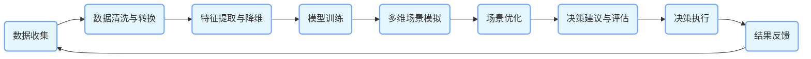

# 构建智能企业决策支持系统：多维场景模拟与优化

> 关键词：智能企业决策支持系统、多维场景模拟、场景优化、数据分析、机器学习

> 摘要：本文聚焦于构建智能企业决策支持系统，详细探讨了多维场景模拟与优化的相关技术和方法。通过对背景的介绍，明确了系统构建的目的和适用范围，阐述了核心概念及其联系，并深入分析了核心算法原理、数学模型。结合项目实战，给出了代码实现和详细解读，同时探讨了系统在实际中的应用场景。此外，推荐了相关的学习资源、开发工具框架以及论文著作，最后对系统未来的发展趋势与挑战进行了总结，并提供了常见问题解答和扩展阅读参考资料，旨在为企业构建高效的决策支持系统提供全面的技术指导。

## 1. 背景介绍 
### 1.1 目的和范围
在当今竞争激烈且复杂多变的商业环境中，企业面临着众多决策难题，如市场战略规划、资源分配、风险管理等。传统的决策方式往往依赖于经验和简单的数据分析，难以应对复杂的多维场景。构建智能企业决策支持系统的目的在于利用先进的数据分析、机器学习和模拟技术，为企业决策者提供全面、准确、及时的决策依据，帮助企业在不同的场景下做出最优决策。

本系统的范围涵盖了多个领域，包括但不限于市场营销、生产运营、财务管理等。它能够处理多种类型的数据，如结构化数据（如财务报表、销售数据）和非结构化数据（如市场调研报告、社交媒体信息），并通过多维场景模拟，为企业提供多种可能的决策方案及其评估结果。

### 1.2 预期读者
本文的预期读者主要包括企业管理人员、决策制定者、数据分析师、软件开发人员以及对智能决策支持系统感兴趣的研究人员。企业管理人员和决策制定者可以从中了解系统的功能和价值，以便更好地应用系统进行决策；数据分析师可以学习系统中的数据分析和建模方法；软件开发人员可以参考系统的架构和代码实现，进行相关系统的开发；研究人员则可以在本文的基础上开展更深入的研究。

### 1.3 文档结构概述
本文将按照以下结构进行阐述：首先介绍核心概念与联系，明确系统中涉及的关键概念及其相互关系；接着详细讲解核心算法原理和具体操作步骤，并通过 Python 代码进行说明；然后给出系统所涉及的数学模型和公式，并举例说明其应用；之后通过项目实战，介绍开发环境搭建、源代码实现和代码解读；再探讨系统在实际中的应用场景；随后推荐相关的学习资源、开发工具框架和论文著作；最后对系统的未来发展趋势与挑战进行总结，提供常见问题解答和扩展阅读参考资料。

### 1.4 术语表
#### 1.4.1 核心术语定义
- **智能企业决策支持系统**：利用先进的信息技术和数据分析方法，为企业决策提供支持的系统，能够对多种数据进行处理和分析，通过模拟不同场景为决策者提供决策方案和评估结果。
- **多维场景模拟**：考虑多个维度的因素，如市场需求、成本、政策等，对企业面临的各种可能情况进行模拟和预测。
- **场景优化**：在多维场景模拟的基础上，通过一定的算法和策略，找出最优的决策方案。
- **数据分析**：对收集到的数据进行清洗、转换、分析和可视化，以发现数据中的规律和信息。
- **机器学习**：让计算机通过数据学习模式和规律，从而实现预测和决策的技术。

#### 1.4.2 相关概念解释
- **数据挖掘**：从大量数据中发现潜在模式和知识的过程，是数据分析的重要手段之一。
- **预测分析**：利用历史数据和统计模型，对未来事件或趋势进行预测的方法。
- **决策树**：一种基于树结构进行决策的模型，每个内部节点是一个属性上的测试，每个分支是测试输出，每个叶节点是类别或值。

#### 1.4.3 缩略词列表
- **DSS**：Decision Support System，决策支持系统
- **ML**：Machine Learning，机器学习
- **AI**：Artificial Intelligence，人工智能
- **KPI**：Key Performance Indicator，关键绩效指标

## 2. 核心概念与联系 

### 核心概念原理
智能企业决策支持系统的核心在于将数据分析、机器学习和多维场景模拟相结合，为企业决策提供支持。数据分析是基础，通过对企业内外部各种数据的收集、清洗和分析，提取有价值的信息。机器学习则用于建立预测模型和优化算法，根据历史数据和实时数据进行预测和决策。多维场景模拟是指考虑多个维度的因素，如市场需求、成本、政策等，对企业面临的各种可能情况进行模拟和预测。场景优化则是在多维场景模拟的基础上，通过一定的算法和策略，找出最优的决策方案。

### 架构的文本示意图
智能企业决策支持系统的架构主要包括数据层、处理层、模型层和应用层。

- **数据层**：负责收集企业内外部的各种数据，包括结构化数据和非结构化数据。数据来源可以是企业的数据库、市场调研机构、社交媒体等。
- **处理层**：对收集到的数据进行清洗、转换和集成，以提高数据的质量和可用性。同时，对数据进行特征提取和降维，以便后续的分析和建模。
- **模型层**：利用机器学习和统计模型，对处理后的数据进行分析和建模。模型包括预测模型、分类模型、优化模型等，用于预测市场趋势、评估风险、优化决策方案等。
- **应用层**：将模型的结果以可视化的方式呈现给决策者，并提供决策建议和方案评估。决策者可以根据系统提供的信息，进行决策和调整。

### Mermaid 流程图


该流程图展示了智能企业决策支持系统的工作流程。首先进行数据收集，然后对数据进行清洗和转换，接着进行特征提取和降维。之后利用处理后的数据进行模型训练，通过模型进行多维场景模拟和场景优化。最后将优化后的结果提供给决策者，决策者执行决策并将结果反馈给系统，形成一个闭环。

## 3. 核心算法原理 & 具体操作步骤 

### 核心算法原理
本系统主要涉及到的核心算法包括线性回归、决策树和遗传算法。

- **线性回归**：用于建立自变量和因变量之间的线性关系。在企业决策中，可以用于预测市场需求、成本等因素与企业绩效之间的关系。其基本公式为 $y = \beta_0 + \beta_1x_1 + \beta_2x_2 + \cdots + \beta_nx_n + \epsilon$，其中 $y$ 是因变量，$x_1, x_2, \cdots, x_n$ 是自变量，$\beta_0, \beta_1, \cdots, \beta_n$ 是回归系数，$\epsilon$ 是误差项。
- **决策树**：是一种基于树结构进行决策的模型。它通过对数据的属性进行划分，构建一棵决策树，每个内部节点是一个属性上的测试，每个分支是测试输出，每个叶节点是类别或值。在企业决策中，可以用于分类和预测问题，如客户分类、风险评估等。
- **遗传算法**：是一种模拟自然选择和遗传机制的优化算法。它通过对一组候选解进行选择、交叉和变异操作，不断进化出更优的解。在企业决策中，可以用于求解复杂的优化问题，如资源分配、生产计划等。

### 具体操作步骤及 Python 代码实现

#### 线性回归
```python
import numpy as np
from sklearn.linear_model import LinearRegression

# 生成示例数据
X = np.array([[1], [2], [3], [4], [5]])
y = np.array([2, 4, 6, 8, 10])

# 创建线性回归模型
model = LinearRegression()

# 训练模型
model.fit(X, y)

# 进行预测
new_X = np.array([[6]])
prediction = model.predict(new_X)
print("线性回归预测结果:", prediction)
```

#### 决策树
```python
from sklearn.datasets import load_iris
from sklearn.tree import DecisionTreeClassifier
from sklearn.model_selection import train_test_split
from sklearn.metrics import accuracy_score

# 加载鸢尾花数据集
iris = load_iris()
X = iris.data
y = iris.target

# 划分训练集和测试集
X_train, X_test, y_train, y_test = train_test_split(X, y, test_size=0.2, random_state=42)

# 创建决策树模型
model = DecisionTreeClassifier()

# 训练模型
model.fit(X_train, y_train)

# 进行预测
y_pred = model.predict(X_test)

# 计算准确率
accuracy = accuracy_score(y_test, y_pred)
print("决策树预测准确率:", accuracy)
```

#### 遗传算法
```python
import numpy as np
from deap import base, creator, tools, algorithms

# 定义适应度函数和个体类型
creator.create("FitnessMin", base.Fitness, weights=(-1.0,))
creator.create("Individual", list, fitness=creator.FitnessMin)

# 定义遗传算法的工具箱
toolbox = base.Toolbox()
toolbox.register("attr_float", np.random.uniform, -5, 5)
toolbox.register("individual", tools.initRepeat, creator.Individual, toolbox.attr_float, n=2)
toolbox.register("population", tools.initRepeat, list, toolbox.individual)

# 定义适应度函数
def eval_function(individual):
    x, y = individual
    return (x - 2) ** 2 + (y - 3) ** 2,

toolbox.register("evaluate", eval_function)
toolbox.register("mate", tools.cxTwoPoint)
toolbox.register("mutate", tools.mutGaussian, mu=0, sigma=1, indpb=0.1)
toolbox.register("select", tools.selTournament, tournsize=3)

# 创建种群并运行遗传算法
pop = toolbox.population(n=50)
NGEN = 40
for gen in range(NGEN):
    offspring = algorithms.varAnd(pop, toolbox, cxpb=0.5, mutpb=0.2)
    fits = toolbox.map(toolbox.evaluate, offspring)
    for fit, ind in zip(fits, offspring):
        ind.fitness.values = fit
    pop = toolbox.select(offspring, k=len(pop))

best_ind = tools.selBest(pop, k=1)[0]
print("遗传算法最优解:", best_ind)
```

## 4. 数学模型和公式 & 详细讲解 & 举例说明 

### 线性回归模型
线性回归模型的基本公式为 $y = \beta_0 + \beta_1x_1 + \beta_2x_2 + \cdots + \beta_nx_n + \epsilon$，其中 $y$ 是因变量，$x_1, x_2, \cdots, x_n$ 是自变量，$\beta_0, \beta_1, \cdots, \beta_n$ 是回归系数，$\epsilon$ 是误差项。

回归系数 $\beta_0, \beta_1, \cdots, \beta_n$ 的估计通常采用最小二乘法，即最小化误差平方和 $S(\beta) = \sum_{i=1}^{m}(y_i - \hat{y}_i)^2$，其中 $y_i$ 是实际值，$\hat{y}_i$ 是预测值。

举例说明：假设某企业的销售额 $y$ 与广告投入 $x_1$ 和促销活动投入 $x_2$ 有关，通过收集历史数据，可以建立线性回归模型 $y = \beta_0 + \beta_1x_1 + \beta_2x_2 + \epsilon$。利用最小二乘法估计出回归系数 $\beta_0, \beta_1, \beta_2$ 后，就可以根据新的广告投入和促销活动投入预测销售额。

### 决策树模型
决策树模型的核心是信息增益和信息熵。信息熵用于衡量数据的不确定性，其公式为 $H(D) = -\sum_{k=1}^{K}p_k\log_2p_k$，其中 $D$ 是数据集，$K$ 是类别数，$p_k$ 是第 $k$ 类样本在数据集中所占的比例。

信息增益是指在划分数据集前后信息熵的减少量，其公式为 $Gain(D, A) = H(D) - \sum_{v=1}^{V}\frac{|D^v|}{|D|}H(D^v)$，其中 $A$ 是属性，$V$ 是属性 $A$ 的取值数，$D^v$ 是属性 $A$ 取值为 $v$ 的样本子集。

举例说明：在客户分类问题中，假设数据集包含客户的年龄、性别、收入等属性，以及客户是否购买某产品的类别信息。通过计算每个属性的信息增益，可以选择信息增益最大的属性作为决策树的根节点，然后递归地构建决策树。

### 遗传算法模型
遗传算法的核心是适应度函数、选择、交叉和变异操作。适应度函数用于评估每个个体的优劣，选择操作根据个体的适应度值选择优良个体，交叉操作将优良个体的基因进行交换，变异操作对个体的基因进行随机变异。

举例说明：在资源分配问题中，假设有 $n$ 种资源需要分配给 $m$ 个项目，每个项目有不同的收益和资源需求。可以将每个资源分配方案看作一个个体，定义适应度函数为总收益，通过遗传算法不断进化出最优的资源分配方案。

## 5. 项目实战：代码实际案例和详细解释说明 

### 5.1  开发环境搭建
本项目的开发环境主要包括 Python 编程语言和相关的库，具体步骤如下：

1. **安装 Python**：从 Python 官方网站（https://www.python.org/downloads/）下载并安装 Python 3.x 版本。
2. **安装必要的库**：使用 pip 命令安装以下库：
```bash
pip install numpy pandas scikit-learn deap matplotlib
```
- `numpy`：用于数值计算。
- `pandas`：用于数据处理和分析。
- `scikit-learn`：用于机器学习模型的构建和训练。
- `deap`：用于实现遗传算法。
- `matplotlib`：用于数据可视化。

### 5.2  源代码详细实现和代码解读
以下是一个简单的智能企业决策支持系统的代码示例，用于预测企业的销售额并进行资源分配优化。

```python
import numpy as np
import pandas as pd
from sklearn.linear_model import LinearRegression
from deap import base, creator, tools, algorithms
import matplotlib.pyplot as plt

# 数据加载和预处理
def load_data():
    data = pd.read_csv('sales_data.csv')
    X = data[['advertising', 'promotion']].values
    y = data['sales'].values
    return X, y

# 线性回归模型训练和预测
def train_and_predict(X, y):
    model = LinearRegression()
    model.fit(X, y)
    new_X = np.array([[100, 50]])
    prediction = model.predict(new_X)
    print("预测销售额:", prediction)
    return model

# 遗传算法进行资源分配优化
def resource_allocation_optimization(model):
    # 定义适应度函数和个体类型
    creator.create("FitnessMax", base.Fitness, weights=(1.0,))
    creator.create("Individual", list, fitness=creator.FitnessMax)

    # 定义遗传算法的工具箱
    toolbox = base.Toolbox()
    toolbox.register("attr_float", np.random.uniform, 0, 200)
    toolbox.register("individual", tools.initRepeat, creator.Individual, toolbox.attr_float, n=2)
    toolbox.register("population", tools.initRepeat, list, toolbox.individual)

    # 定义适应度函数
    def eval_function(individual):
        advertising, promotion = individual
        X = np.array([[advertising, promotion]])
        sales = model.predict(X)
        return sales[0],

    toolbox.register("evaluate", eval_function)
    toolbox.register("mate", tools.cxTwoPoint)
    toolbox.register("mutate", tools.mutGaussian, mu=0, sigma=10, indpb=0.1)
    toolbox.register("select", tools.selTournament, tournsize=3)

    # 创建种群并运行遗传算法
    pop = toolbox.population(n=50)
    NGEN = 40
    hof = tools.HallOfFame(1)
    stats = tools.Statistics(lambda ind: ind.fitness.values)
    stats.register("avg", np.mean)
    stats.register("std", np.std)
    stats.register("min", np.min)
    stats.register("max", np.max)

    pop, log = algorithms.eaSimple(pop, toolbox, cxpb=0.5, mutpb=0.2, ngen=NGEN, stats=stats, halloffame=hof, verbose=True)

    best_ind = hof[0]
    print("最优资源分配方案: 广告投入 =", best_ind[0], "促销投入 =", best_ind[1])

    # 绘制适应度曲线
    gen = log.select("gen")
    avg = log.select("avg")
    plt.plot(gen, avg)
    plt.xlabel('Generation')
    plt.ylabel('Average Fitness')
    plt.title('Genetic Algorithm Optimization')
    plt.show()

# 主函数
def main():
    X, y = load_data()
    model = train_and_predict(X, y)
    resource_allocation_optimization(model)

if __name__ == "__main__":
    main()
```

### 5.3  代码解读与分析
- **数据加载和预处理**：`load_data` 函数从 CSV 文件中加载销售数据，并将广告投入和促销投入作为自变量，销售额作为因变量。
- **线性回归模型训练和预测**：`train_and_predict` 函数使用线性回归模型对数据进行训练，并根据新的广告投入和促销投入预测销售额。
- **遗传算法进行资源分配优化**：`resource_allocation_optimization` 函数使用遗传算法对资源分配进行优化。首先定义适应度函数，将预测的销售额作为适应度值。然后创建种群，进行选择、交叉和变异操作，不断进化出最优的资源分配方案。最后绘制适应度曲线，展示遗传算法的优化过程。
- **主函数**：`main` 函数调用上述函数，完成数据加载、模型训练、预测和资源分配优化的整个流程。

## 6. 实际应用场景 
智能企业决策支持系统在多个实际应用场景中具有重要价值，以下是一些常见的应用场景：

### 市场营销决策
在市场营销中，企业需要决定广告投放策略、促销活动方案等。通过多维场景模拟，可以考虑不同的市场需求、竞争对手策略、消费者行为等因素，预测不同营销方案的效果。例如，通过线性回归模型预测广告投入和促销活动投入对销售额的影响，然后使用遗传算法优化资源分配，找出最优的营销方案。

### 生产运营决策
在生产运营中，企业需要决定生产计划、库存管理、供应链优化等。通过多维场景模拟，可以考虑原材料价格波动、生产能力限制、交货期要求等因素，预测不同生产方案的成本和效益。例如，使用决策树模型对订单进行分类，根据订单的优先级和生产能力安排生产计划，同时使用线性规划模型优化库存管理和供应链配置。

### 财务管理决策
在财务管理中，企业需要决定投资策略、融资方案、成本控制等。通过多维场景模拟，可以考虑市场利率变化、汇率波动、行业发展趋势等因素，预测不同财务决策的风险和收益。例如，使用蒙特卡罗模拟方法对投资组合进行风险评估，然后使用遗传算法优化投资组合，找出最优的投资策略。

### 风险管理决策
在风险管理中，企业需要识别、评估和应对各种风险，如市场风险、信用风险、操作风险等。通过多维场景模拟，可以考虑不同的风险因素和风险事件，预测风险的发生概率和影响程度。例如，使用风险价值（VaR）模型对市场风险进行评估，然后使用决策树模型制定风险应对策略。

## 7. 工具和资源推荐
### 7.1 学习资源推荐
#### 7.1.1 书籍推荐
- 《Python 数据分析实战》：介绍了使用 Python 进行数据分析的方法和技巧，包括数据处理、可视化、机器学习等方面的内容。
- 《机器学习》（周志华）：系统地介绍了机器学习的基本概念、算法和应用，是机器学习领域的经典教材。
- 《决策支持系统原理与应用》：详细阐述了决策支持系统的原理、技术和应用案例，对构建智能企业决策支持系统具有重要的参考价值。

#### 7.1.2 在线课程
- Coursera 上的“机器学习”课程：由斯坦福大学的 Andrew Ng 教授授课，是机器学习领域的经典在线课程。
- edX 上的“数据科学基础”课程：介绍了数据科学的基本概念、方法和工具，包括数据分析、机器学习、深度学习等方面的内容。
- 网易云课堂上的“Python 数据分析实战”课程：通过实际案例介绍了使用 Python 进行数据分析的方法和技巧。

#### 7.1.3 技术博客和网站
- 博客园：提供了大量的技术文章和博客，涵盖了数据分析、机器学习、人工智能等多个领域。
- 开源中国：是国内知名的开源技术社区，提供了丰富的开源项目和技术资源。
- Kaggle：是一个数据科学竞赛平台，提供了大量的数据集和竞赛题目，可以用于学习和实践。

### 7.2 开发工具框架推荐
#### 7.2.1 IDE和编辑器
- PyCharm：是一款专业的 Python 集成开发环境，提供了丰富的代码编辑、调试、测试等功能。
- Jupyter Notebook：是一个交互式的开发环境，适合进行数据分析和机器学习的实验和演示。
- Visual Studio Code：是一款轻量级的代码编辑器，支持多种编程语言和插件，具有良好的扩展性。

#### 7.2.2 调试和性能分析工具
- PDB：是 Python 自带的调试工具，可以用于调试 Python 代码。
- Py-Spy：是一个性能分析工具，可以用于分析 Python 程序的性能瓶颈。
- cProfile：是 Python 自带的性能分析工具，可以用于分析 Python 程序的运行时间和函数调用情况。

#### 7.2.3 相关框架和库
- Scikit-learn：是一个常用的机器学习库，提供了丰富的机器学习算法和工具，如分类、回归、聚类等。
- TensorFlow：是一个开源的深度学习框架，广泛应用于图像识别、自然语言处理等领域。
- PyTorch：是一个开源的深度学习框架，具有动态图、易于使用等特点，受到了很多研究人员和开发者的喜爱。

### 7.3 相关论文著作推荐
#### 7.3.1 经典论文
- “A Mathematical Theory of Communication”（Claude E. Shannon）：信息论的经典论文，提出了信息熵的概念，对决策树等算法的发展产生了重要影响。
- “Gradient-Based Learning Applied to Document Recognition”（Yann LeCun, Léon Bottou, Yoshua Bengio, and Patrick Haffner）：介绍了卷积神经网络（CNN）在文档识别中的应用，是深度学习领域的经典论文。
- “The Nature of Statistical Learning Theory”（Vladimir N. Vapnik）：阐述了统计学习理论的基本概念和方法，对支持向量机等算法的发展产生了重要影响。

#### 7.3.2 最新研究成果
- 关注顶级学术会议，如 NeurIPS（神经信息处理系统大会）、ICML（国际机器学习会议）、KDD（知识发现与数据挖掘会议）等，这些会议上会发布机器学习、数据挖掘等领域的最新研究成果。
- 关注顶级学术期刊，如 Journal of Machine Learning Research（JMLR）、Artificial Intelligence（AI）等，这些期刊上会发表机器学习、人工智能等领域的高质量研究论文。

#### 7.3.3 应用案例分析
- 可以参考一些企业的案例分析报告，了解智能企业决策支持系统在实际应用中的效果和经验。例如，亚马逊的供应链优化案例、谷歌的广告投放优化案例等。

## 8. 总结：未来发展趋势与挑战
### 未来发展趋势
- **智能化程度不断提高**：随着人工智能技术的不断发展，智能企业决策支持系统将具备更强的自主学习和推理能力，能够自动发现数据中的规律和模式，为企业提供更准确、更智能的决策建议。
- **与大数据和云计算深度融合**：大数据和云计算技术的发展为智能企业决策支持系统提供了更强大的数据处理和存储能力。系统可以处理更大量、更复杂的数据，并通过云计算平台实现分布式计算和并行处理，提高系统的性能和效率。
- **跨领域融合应用**：智能企业决策支持系统将与物联网、区块链、虚拟现实等技术进行跨领域融合，拓展应用场景和功能。例如，结合物联网技术实现对生产设备的实时监测和控制，结合区块链技术实现数据的安全共享和可信交易。

### 挑战
- **数据质量和安全问题**：智能企业决策支持系统依赖于大量的数据进行分析和决策，数据的质量和安全直接影响系统的性能和可靠性。因此，如何保证数据的准确性、完整性和安全性是一个重要的挑战。
- **算法复杂度和可解释性**：随着人工智能算法的不断发展，算法的复杂度越来越高，导致模型的可解释性变差。在企业决策中，决策者需要了解模型的决策依据和过程，因此如何提高算法的可解释性是一个亟待解决的问题。
- **人才短缺问题**：构建和应用智能企业决策支持系统需要具备数据分析、机器学习、人工智能等多方面知识和技能的专业人才。目前，这类人才相对短缺，如何培养和吸引更多的专业人才是企业面临的一个挑战。

## 9. 附录：常见问题与解答
### 1. 智能企业决策支持系统与传统决策支持系统有什么区别？
智能企业决策支持系统引入了人工智能技术，如机器学习、深度学习等，能够自动学习数据中的规律和模式，为企业提供更准确、更智能的决策建议。而传统决策支持系统主要依赖于决策者的经验和简单的数据分析方法，决策的准确性和效率相对较低。

### 2. 如何保证智能企业决策支持系统的可靠性？
可以从以下几个方面保证系统的可靠性：
- 确保数据的质量，对数据进行清洗、验证和预处理。
- 选择合适的算法和模型，并进行充分的训练和验证。
- 建立完善的监控和反馈机制，及时发现和解决系统中出现的问题。

### 3. 智能企业决策支持系统需要哪些数据？
智能企业决策支持系统需要企业内外部的各种数据，包括结构化数据（如财务报表、销售数据）和非结构化数据（如市场调研报告、社交媒体信息）。具体的数据需求取决于系统的应用场景和功能。

### 4. 如何评估智能企业决策支持系统的效果？
可以从以下几个方面评估系统的效果：
- 决策的准确性：比较系统提供的决策方案与实际结果的一致性。
- 决策的效率：评估系统提供决策建议的时间和成本。
- 决策的效益：评估系统的决策方案对企业绩效的提升作用。

## 10. 扩展阅读 & 参考资料
- 《人工智能：现代方法》（Stuart Russell, Peter Norvig）
- 《数据挖掘：概念与技术》（Jiawei Han, Micheline Kamber, Jian Pei）
- https://scikit-learn.org/stable/
- https://www.tensorflow.org/
- https://pytorch.org/

作者：AI天才研究院/AI Genius Institute & 禅与计算机程序设计艺术 /Zen And The Art of Computer Programming