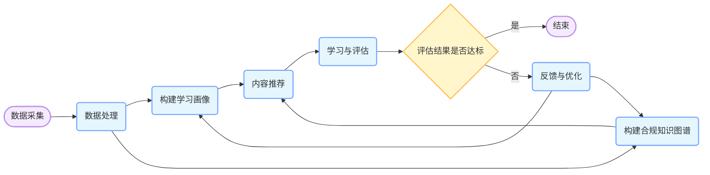

# 构建智能企业合规培训系统：个性化学习内容与评估的自动化

> 关键词：智能企业合规培训系统、个性化学习内容、评估自动化、机器学习、自然语言处理

> 摘要：本文聚焦于构建智能企业合规培训系统，旨在实现个性化学习内容的推送以及评估过程的自动化。首先介绍了系统构建的背景、目的和适用读者等信息，接着阐述了核心概念与联系，包括系统的架构和原理。详细讲解了核心算法原理，并用Python代码进行说明，同时给出了相关的数学模型和公式。通过项目实战展示了系统的开发环境搭建、源代码实现及解读。分析了系统的实际应用场景，推荐了学习资源、开发工具框架和相关论文著作。最后总结了系统的未来发展趋势与挑战，并给出常见问题的解答和扩展阅读参考资料。

## 1. 背景介绍 
### 1.1 目的和范围
企业合规是企业运营中至关重要的一环，它涉及到遵守各种法律法规、行业标准和内部政策。传统的企业合规培训往往采用统一的培训内容和方式，无法满足不同员工的个性化需求，导致培训效果不佳。本项目的目的是构建一个智能企业合规培训系统，通过利用先进的技术手段，实现个性化学习内容的推送和评估过程的自动化，提高培训的针对性和有效性。

本系统的范围涵盖了从员工信息收集、学习内容定制、学习过程跟踪到评估结果反馈的整个培训流程。系统将集成多种数据源，包括员工的岗位信息、历史学习记录、合规考试成绩等，以便为员工提供最适合他们的学习内容。

### 1.2 预期读者
本文的预期读者包括企业的人力资源部门、培训部门人员，他们负责设计和实施企业的合规培训计划；企业的合规管理人员，他们关注培训系统是否能有效提升员工的合规意识和能力；以及对人工智能在企业培训领域应用感兴趣的技术人员和研究人员。

### 1.3 文档结构概述
本文将按照以下结构进行组织：
- 核心概念与联系：介绍系统中涉及的核心概念，如个性化学习、评估自动化等，并展示它们之间的联系。
- 核心算法原理 & 具体操作步骤：详细讲解实现个性化学习和评估自动化的核心算法，并用Python代码进行说明。
- 数学模型和公式 & 详细讲解 & 举例说明：给出相关的数学模型和公式，帮助读者深入理解算法原理。
- 项目实战：通过实际案例展示系统的开发环境搭建、源代码实现和代码解读。
- 实际应用场景：分析系统在不同企业场景下的应用。
- 工具和资源推荐：推荐学习系统开发所需的资源、工具和框架，以及相关的论文著作。
- 总结：未来发展趋势与挑战：总结系统的发展趋势和面临的挑战。
- 附录：常见问题与解答：解答读者可能遇到的常见问题。
- 扩展阅读 & 参考资料：提供进一步学习的参考资料。

### 1.4 术语表
#### 1.4.1 核心术语定义
- **智能企业合规培训系统**：利用人工智能技术，根据员工的个性化需求提供合规培训内容，并实现评估自动化的系统。
- **个性化学习内容**：根据员工的岗位、知识水平、学习历史等因素，为每个员工定制的培训内容。
- **评估自动化**：系统自动对员工的学习效果进行评估，减少人工干预。
- **机器学习**：让计算机通过数据学习模式和规律，从而做出预测和决策的技术。
- **自然语言处理**：使计算机能够理解、处理和生成人类语言的技术。

#### 1.4.2 相关概念解释
- **推荐系统**：根据用户的历史行为和偏好，为用户推荐相关内容的系统。在本系统中，用于为员工推荐个性化的学习内容。
- **知识图谱**：将实体及其之间的关系以图形化的方式表示出来的知识库。在合规培训中，可以用于组织和管理合规知识。
- **自适应学习**：根据学生的学习进度和表现，动态调整学习内容和难度的学习方式。

#### 1.4.3 缩略词列表
- **AI**：Artificial Intelligence，人工智能
- **ML**：Machine Learning，机器学习
- **NLP**：Natural Language Processing，自然语言处理
- **LSTM**：Long Short-Term Memory，长短期记忆网络

## 2. 核心概念与联系 

### 核心概念原理
#### 个性化学习内容
个性化学习内容的原理是基于员工的多维度信息，包括岗位信息、知识水平、学习历史等，通过数据分析和机器学习算法，为每个员工构建个性化的学习画像。然后，根据学习画像从合规知识库中筛选出最适合该员工的学习内容。例如，对于一名财务岗位的员工，系统可能会推荐与财务合规相关的法律法规、财务报表编制规范等内容。

#### 评估自动化
评估自动化的原理是利用机器学习和自然语言处理技术，对员工的学习成果进行自动评估。系统可以通过分析员工的在线测试答案、学习笔记、讨论发言等数据，判断员工对合规知识的掌握程度。例如，利用自然语言处理技术对员工的主观题答案进行语义分析，判断答案的准确性和完整性。

### 架构的文本示意图
智能企业合规培训系统主要由以下几个部分组成：
- **数据采集层**：负责收集员工的基本信息、岗位信息、学习历史记录、考试成绩等数据。
- **数据处理层**：对采集到的数据进行清洗、转换和存储，同时利用机器学习和自然语言处理技术对数据进行分析，构建员工的学习画像和合规知识图谱。
- **内容推荐层**：根据员工的学习画像，从合规知识库中筛选出个性化的学习内容，并推送给员工。
- **学习与评估层**：员工在该层进行学习和测试，系统自动记录学习过程和测试结果，并进行评估。
- **反馈与优化层**：根据评估结果，为员工提供反馈和建议，同时对学习内容和推荐算法进行优化。

### Mermaid 流程图


## 3. 核心算法原理 & 具体操作步骤 

### 个性化学习内容推荐算法
#### 算法原理
我们可以使用协同过滤算法来实现个性化学习内容推荐。协同过滤算法基于这样一个假设：具有相似历史行为的用户，对未来的内容偏好也可能相似。在本系统中，我们可以根据员工的学习历史记录，找出与目标员工相似的其他员工，然后将这些相似员工学习过的、目标员工尚未学习的内容推荐给目标员工。

#### Python 代码实现
```python
import pandas as pd
from sklearn.metrics.pairwise import cosine_similarity

# 假设我们有一个员工学习记录的数据集，格式为：员工ID，内容ID，学习标记（0或1）
data = {
    'employee_id': [1, 1, 2, 2, 3, 3],
    'content_id': [101, 102, 101, 103, 102, 103],
    'learning_flag': [1, 1, 1, 1, 1, 1]
}
df = pd.DataFrame(data)

# 创建用户-内容矩阵
user_content_matrix = df.pivot(index='employee_id', columns='content_id', values='learning_flag').fillna(0)

# 计算用户之间的相似度
user_similarity = cosine_similarity(user_content_matrix)

# 定义一个函数来进行推荐
def recommend_content(target_employee_id, top_n=3):
    target_index = user_content_matrix.index.tolist().index(target_employee_id)
    similar_users = user_similarity[target_index].argsort()[::-1][1:top_n + 1]
    target_user_content = user_content_matrix.iloc[target_index]
    recommended_content = []
    for similar_user_index in similar_users:
        similar_user_content = user_content_matrix.iloc[similar_user_index]
        new_content = similar_user_content[target_user_content == 0].index.tolist()
        recommended_content.extend(new_content)
    return recommended_content

# 示例：为员工ID为1的员工推荐内容
recommended = recommend_content(1)
print("推荐的内容ID：", recommended)
```

### 评估自动化算法
#### 算法原理
对于客观题的评估，我们可以直接比较员工的答案和正确答案，计算得分。对于主观题的评估，我们可以使用自然语言处理技术，将员工的答案和标准答案进行语义相似度计算。常用的方法是使用词向量表示文本，然后计算向量之间的余弦相似度。

#### Python 代码实现
```python
import numpy as np
from sklearn.feature_extraction.text import TfidfVectorizer
from sklearn.metrics.pairwise import cosine_similarity

# 假设我们有一个标准答案和员工答案的列表
standard_answers = ["合规是企业运营的基础，必须严格遵守法律法规。"]
employee_answers = ["企业要严格遵守法律法规，合规是运营的基础。"]

# 使用TF-IDF向量器将文本转换为向量
vectorizer = TfidfVectorizer()
standard_vectors = vectorizer.fit_transform(standard_answers)
employee_vectors = vectorizer.transform(employee_answers)

# 计算余弦相似度
similarity_scores = cosine_similarity(employee_vectors, standard_vectors)

# 根据相似度计算得分
scores = similarity_scores * 100

print("员工答案的得分：", scores[0][0])
```

## 4. 数学模型和公式 & 详细讲解 & 举例说明 

### 协同过滤算法的数学模型
#### 相似度计算
在协同过滤算法中，我们使用余弦相似度来计算用户之间的相似度。余弦相似度的计算公式为：
$$
\cos(\theta) = \frac{\mathbf{A} \cdot \mathbf{B}}{\|\mathbf{A}\| \|\mathbf{B}\|}
$$
其中，$\mathbf{A}$ 和 $\mathbf{B}$ 分别表示两个用户的特征向量，$\cdot$ 表示向量的点积，$\|\mathbf{A}\|$ 和 $\|\mathbf{B}\|$ 分别表示向量的模。

例如，假设有两个用户的特征向量分别为 $\mathbf{A} = [1, 0, 1]$ 和 $\mathbf{B} = [0, 1, 1]$，则它们的余弦相似度为：
$$
\cos(\theta) = \frac{1\times0 + 0\times1 + 1\times1}{\sqrt{1^2 + 0^2 + 1^2} \sqrt{0^2 + 1^2 + 1^2}} = \frac{1}{\sqrt{2} \sqrt{2}} = 0.5
$$

#### 推荐得分计算
对于一个目标用户 $u$ 和一个未学习的内容 $i$，我们可以根据与 $u$ 相似的用户对 $i$ 的学习情况来计算推荐得分。推荐得分的计算公式为：
$$
\hat{r}_{ui} = \frac{\sum_{v \in N(u)} s_{uv} r_{vi}}{\sum_{v \in N(u)} |s_{uv}|}
$$
其中，$\hat{r}_{ui}$ 表示用户 $u$ 对内容 $i$ 的预测得分，$N(u)$ 表示与用户 $u$ 相似的用户集合，$s_{uv}$ 表示用户 $u$ 和用户 $v$ 的相似度，$r_{vi}$ 表示用户 $v$ 对内容 $i$ 的实际得分。

### 语义相似度计算的数学模型
#### TF-IDF 向量表示
TF-IDF（Term Frequency-Inverse Document Frequency）是一种常用的文本特征提取方法。对于一个词 $t$ 在文档 $d$ 中的 TF-IDF 值的计算公式为：
$$
\text{TF-IDF}(t, d) = \text{TF}(t, d) \times \text{IDF}(t)
$$
其中，$\text{TF}(t, d)$ 表示词 $t$ 在文档 $d$ 中的词频，即词 $t$ 在文档 $d$ 中出现的次数除以文档 $d$ 的总词数；$\text{IDF}(t)$ 表示词 $t$ 的逆文档频率，计算公式为：
$$
\text{IDF}(t) = \log \frac{N}{n_t + 1}
$$
其中，$N$ 表示文档总数，$n_t$ 表示包含词 $t$ 的文档数。

#### 余弦相似度计算
在将文本转换为 TF-IDF 向量后，我们可以使用余弦相似度来计算两个文本的语义相似度，公式与协同过滤算法中的余弦相似度公式相同。

例如，假设有两个文档 $d_1 = "合规培训很重要"$ 和 $d_2 = "合规是企业运营的关键"$，我们可以使用 TF-IDF 向量器将它们转换为向量，然后计算余弦相似度来评估它们的语义相似度。

## 5. 项目实战：代码实际案例和详细解释说明 

### 5.1  开发环境搭建
#### 操作系统
我们可以选择使用 Windows、Linux 或 macOS 操作系统。这里以 Ubuntu 18.04 为例进行说明。

#### 编程语言和版本
使用 Python 3.7 或更高版本。可以通过以下命令安装 Python：
```bash
sudo apt update
sudo apt install python3 python3-pip
```

#### 依赖库安装
安装项目所需的依赖库，包括 Pandas、Scikit-learn、Numpy 等。可以使用以下命令进行安装：
```bash
pip3 install pandas scikit-learn numpy
```

### 5.2  源代码详细实现和代码解读
#### 数据采集模块
```python
import pandas as pd

# 模拟从数据库中读取员工学习记录数据
def collect_data():
    data = {
        'employee_id': [1, 1, 2, 2, 3, 3],
        'content_id': [101, 102, 101, 103, 102, 103],
        'learning_flag': [1, 1, 1, 1, 1, 1]
    }
    df = pd.DataFrame(data)
    return df

# 调用数据采集函数
data = collect_data()
print("采集到的数据：")
print(data)
```
代码解读：该模块模拟从数据库中读取员工学习记录数据，使用 Pandas 库将数据存储为 DataFrame 格式。

#### 个性化学习内容推荐模块
```python
from sklearn.metrics.pairwise import cosine_similarity

# 创建用户-内容矩阵
def create_user_content_matrix(data):
    user_content_matrix = data.pivot(index='employee_id', columns='content_id', values='learning_flag').fillna(0)
    return user_content_matrix

# 计算用户之间的相似度
def calculate_user_similarity(user_content_matrix):
    user_similarity = cosine_similarity(user_content_matrix)
    return user_similarity

# 推荐内容
def recommend_content(target_employee_id, user_content_matrix, user_similarity, top_n=3):
    target_index = user_content_matrix.index.tolist().index(target_employee_id)
    similar_users = user_similarity[target_index].argsort()[::-1][1:top_n + 1]
    target_user_content = user_content_matrix.iloc[target_index]
    recommended_content = []
    for similar_user_index in similar_users:
        similar_user_content = user_content_matrix.iloc[similar_user_index]
        new_content = similar_user_content[target_user_content == 0].index.tolist()
        recommended_content.extend(new_content)
    return recommended_content

# 调用推荐模块
user_content_matrix = create_user_content_matrix(data)
user_similarity = calculate_user_similarity(user_content_matrix)
recommended = recommend_content(1, user_content_matrix, user_similarity)
print("推荐的内容ID：", recommended)
```
代码解读：该模块首先创建用户-内容矩阵，然后计算用户之间的相似度，最后根据相似度为目标用户推荐内容。

#### 评估自动化模块
```python
from sklearn.feature_extraction.text import TfidfVectorizer
from sklearn.metrics.pairwise import cosine_similarity

# 模拟标准答案和员工答案
standard_answers = ["合规是企业运营的基础，必须严格遵守法律法规。"]
employee_answers = ["企业要严格遵守法律法规，合规是运营的基础。"]

# 计算得分
def calculate_score(standard_answers, employee_answers):
    vectorizer = TfidfVectorizer()
    standard_vectors = vectorizer.fit_transform(standard_answers)
    employee_vectors = vectorizer.transform(employee_answers)
    similarity_scores = cosine_similarity(employee_vectors, standard_vectors)
    scores = similarity_scores * 100
    return scores[0][0]

# 调用评估模块
score = calculate_score(standard_answers, employee_answers)
print("员工答案的得分：", score)
```
代码解读：该模块使用 TF-IDF 向量器将标准答案和员工答案转换为向量，然后计算余弦相似度，根据相似度计算员工答案的得分。

### 5.3  代码解读与分析
#### 数据采集模块
数据采集模块是整个系统的基础，它负责收集员工的学习记录数据。在实际应用中，我们可以从数据库、文件系统或其他数据源中读取数据。

#### 个性化学习内容推荐模块
个性化学习内容推荐模块的核心是协同过滤算法。通过计算用户之间的相似度，找出与目标用户相似的用户，然后将这些相似用户学习过的、目标用户尚未学习的内容推荐给目标用户。这种方法可以提高推荐的准确性和个性化程度。

#### 评估自动化模块
评估自动化模块使用自然语言处理技术对员工的主观题答案进行评估。通过将答案转换为向量，计算向量之间的余弦相似度，从而得到答案的得分。这种方法可以减少人工评估的工作量，提高评估的效率和准确性。

## 6. 实际应用场景 
### 金融行业
在金融行业，合规要求非常严格。智能企业合规培训系统可以根据员工的岗位，如银行柜员、理财经理、风险管理人员等，为他们提供个性化的合规培训内容。例如，为银行柜员提供与客户身份识别、反洗钱等相关的培训内容；为理财经理提供与理财产品销售合规等相关的培训内容。同时，系统可以自动评估员工的学习效果，及时发现员工在合规知识掌握方面的不足，并提供针对性的辅导和建议。

### 医疗行业
医疗行业涉及到患者的生命健康和隐私保护，合规培训至关重要。系统可以根据医生、护士、药剂师等不同岗位的需求，为他们提供个性化的合规培训，如医疗数据安全、药品管理规范等。通过评估自动化，系统可以快速了解员工对合规知识的掌握情况，确保员工在日常工作中能够遵守相关的法律法规和行业标准。

### 制造业
制造业企业需要遵守环境保护、安全生产等方面的合规要求。智能企业合规培训系统可以根据员工的工作内容和职责，为他们提供相应的合规培训。例如，为生产线上的工人提供安全生产操作规程的培训；为环保部门的员工提供环境法规和排放标准的培训。系统的评估功能可以帮助企业及时发现员工在合规操作方面的问题，减少事故和违规行为的发生。

## 7. 工具和资源推荐
### 7.1 学习资源推荐
#### 7.1.1 书籍推荐
- 《Python 机器学习实战》：本书详细介绍了 Python 在机器学习领域的应用，包括数据处理、模型训练和评估等方面的内容，对于学习系统开发中的机器学习算法非常有帮助。
- 《自然语言处理入门》：这本书深入浅出地介绍了自然语言处理的基本概念、算法和应用，适合初学者快速入门。
- 《推荐系统实践》：全面介绍了推荐系统的原理、算法和实践案例，对于理解和实现个性化学习内容推荐算法具有重要的参考价值。

#### 7.1.2 在线课程
- Coursera 上的“机器学习”课程：由斯坦福大学的 Andrew Ng 教授授课，是机器学习领域的经典课程，涵盖了机器学习的基本概念、算法和应用。
- edX 上的“自然语言处理”课程：该课程系统地介绍了自然语言处理的理论和实践，包括词法分析、句法分析、语义理解等方面的内容。
- Udemy 上的“Python 数据科学实战”课程：课程结合实际案例，讲解了 Python 在数据科学领域的应用，包括数据处理、数据分析和可视化等方面的内容。

#### 7.1.3 技术博客和网站
- 机器学习算法全栈工程师：该博客提供了丰富的机器学习和深度学习相关的技术文章和案例，对于学习算法原理和实践应用非常有帮助。
- 自然语言处理社区：专注于自然语言处理领域的技术交流和分享，提供了最新的研究成果和技术动态。
- Kaggle：一个数据科学竞赛平台，上面有很多关于机器学习和数据分析的竞赛和数据集，可以通过参与竞赛来提高自己的实践能力。

### 7.2 开发工具框架推荐
#### 7.2.1 IDE和编辑器
- PyCharm：一款专业的 Python 集成开发环境，具有代码编辑、调试、版本控制等功能，适合大型项目的开发。
- Jupyter Notebook：一个交互式的开发环境，可以方便地进行代码编写、运行和可视化展示，适合数据探索和模型实验。
- Visual Studio Code：一款轻量级的代码编辑器，支持多种编程语言，具有丰富的插件扩展功能，可以满足不同的开发需求。

#### 7.2.2 调试和性能分析工具
- Py-Spy：一个用于分析 Python 程序性能的工具，可以实时监测程序的 CPU 使用率和函数调用情况，帮助开发者找出性能瓶颈。
- pdb：Python 内置的调试器，可以在代码中设置断点，逐步执行代码，查看变量的值和程序的执行流程。
- TensorBoard：一个用于可视化深度学习模型训练过程的工具，可以展示模型的损失曲线、准确率曲线等信息，帮助开发者优化模型。

#### 7.2.3 相关框架和库
- Scikit-learn：一个简单易用的机器学习库，提供了丰富的机器学习算法和工具，如分类、回归、聚类等算法，以及数据预处理、模型评估等功能。
- NLTK：自然语言处理工具包，提供了丰富的自然语言处理工具和数据集，如词法分析、句法分析、情感分析等功能。
- Pandas：一个用于数据处理和分析的库，提供了高效的数据结构和数据操作方法，如 DataFrame、Series 等，方便对数据进行清洗、转换和分析。

### 7.3 相关论文著作推荐
#### 7.3.1 经典论文
- 《Matrix Factorization Techniques for Recommender Systems》：介绍了矩阵分解技术在推荐系统中的应用，是推荐系统领域的经典论文。
- 《Efficient Estimation of Word Representations in Vector Space》：提出了 Word2Vec 模型，用于将词语表示为向量，在自然语言处理领域具有重要的影响。
- 《Long Short-Term Memory》：介绍了长短期记忆网络（LSTM）的原理和应用，LSTM 在处理序列数据方面具有很好的效果。

#### 7.3.2 最新研究成果
- 《Graph Neural Networks for Recommender Systems: A Survey》：对图神经网络在推荐系统中的应用进行了综述，介绍了最新的研究进展和方法。
- 《Natural Language Processing with Transformers: State-of-the-Art》：介绍了基于 Transformer 架构的自然语言处理技术的最新发展，如 BERT、GPT 等模型。
- 《Adaptive Learning Systems: A Comprehensive Review》：对自适应学习系统的理论、方法和应用进行了全面的综述，为智能企业合规培训系统的开发提供了参考。

#### 7.3.3 应用案例分析
- 《Case Studies in Enterprise Compliance Training Systems》：通过实际案例分析了企业合规培训系统的设计、实施和效果评估，为系统的实际应用提供了借鉴。
- 《Personalized Learning in the Workplace: Real-World Examples》：介绍了个性化学习在企业中的实际应用案例，包括学习内容推荐、学习路径规划等方面的内容。
- 《Automated Assessment in Online Learning: Lessons Learned from Practice》：分享了在线学习中自动化评估的实践经验和案例，对于实现评估自动化具有重要的参考价值。

## 8. 总结：未来发展趋势与挑战
### 未来发展趋势
#### 融合更多的人工智能技术
未来的智能企业合规培训系统将融合更多的人工智能技术，如深度学习、强化学习等。深度学习可以用于更复杂的文本理解和图像识别任务，例如对合规文档中的图片和视频内容进行分析；强化学习可以用于优化学习路径和推荐策略，根据员工的实时反馈动态调整学习内容和难度。

#### 与企业业务系统深度集成
系统将与企业的业务系统，如人力资源管理系统、财务管理系统等深度集成。通过获取业务系统中的数据，系统可以更准确地了解员工的工作场景和合规需求，提供更贴合实际工作的培训内容。同时，培训结果可以直接反馈到业务系统中，影响员工的绩效考核和晋升决策。

#### 提供更加个性化的学习体验
除了根据员工的岗位和学习历史提供个性化的学习内容外，系统还将考虑员工的学习风格、兴趣爱好等因素，提供更加个性化的学习体验。例如，对于视觉型学习者，系统可以提供更多的图片和视频教程；对于听觉型学习者，系统可以提供音频讲解。

### 挑战
#### 数据隐私和安全问题
系统需要收集和处理大量的员工数据，包括个人信息、学习记录等，这涉及到数据隐私和安全问题。企业需要采取有效的措施来保护员工数据的安全，防止数据泄露和滥用。

#### 算法的可解释性
人工智能算法，尤其是深度学习算法，往往具有较高的复杂性，其决策过程难以解释。在企业合规培训系统中，员工和管理人员需要了解系统为什么推荐某些学习内容或给出某个评估结果。因此，提高算法的可解释性是一个重要的挑战。

#### 技术更新换代快
人工智能技术发展迅速，新的算法和模型不断涌现。企业需要不断更新和升级系统，以跟上技术的发展步伐，确保系统的性能和功能始终处于领先水平。

## 9. 附录：常见问题与解答
### 问题1：系统如何确保推荐的学习内容符合合规要求？
解答：系统的合规知识库是由专业的合规专家进行整理和审核的，确保其中的内容符合最新的法律法规和行业标准。同时，系统会定期对知识库进行更新和维护，以保证推荐的学习内容的准确性和合规性。

### 问题2：评估自动化的结果是否准确可靠？
解答：评估自动化的准确性取决于多个因素，包括标准答案的准确性、语义相似度计算的方法等。在实际应用中，我们可以通过不断优化标准答案和算法，提高评估的准确性。同时，对于一些重要的评估结果，可以结合人工审核来确保其可靠性。

### 问题3：系统是否支持多语言？
解答：系统可以支持多语言，通过使用多语言的自然语言处理模型和技术，如多语言的词向量表示和翻译模型，系统可以处理不同语言的学习内容和员工答案。

### 问题4：如何集成系统到企业现有的培训平台中？
解答：系统可以通过 API 接口与企业现有的培训平台进行集成。通过 API 接口，培训平台可以将员工的学习记录和考试数据发送到系统中，系统可以将个性化的学习内容和评估结果返回给培训平台，实现数据的共享和交互。

## 10. 扩展阅读 & 参考资料
- 《人工智能：现代方法》
- 《Python 数据分析实战》
- 《深度学习》
- 人工智能顶级会议论文，如 NeurIPS、ICML、ACL 等。
- 企业合规相关的法律法规和行业标准文件。

作者：AI天才研究院/AI Genius Institute & 禅与计算机程序设计艺术 /Zen And The Art of Computer Programming