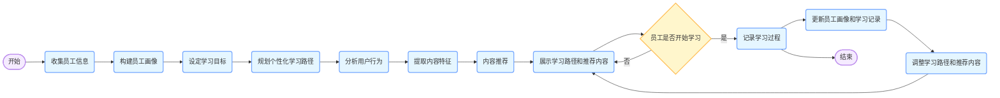

# 构建智能企业培训系统：个性化学习路径与内容推荐

> 关键词：智能企业培训系统、个性化学习路径、内容推荐、机器学习、数据分析

> 摘要：本文围绕构建智能企业培训系统展开，详细阐述了个性化学习路径与内容推荐的相关技术和实现方法。通过对背景的介绍，让读者了解构建该系统的目的和适用范围。核心概念部分解释了关键概念及其联系，并给出了架构示意图和流程图。核心算法原理借助Python代码进行了深入剖析，同时介绍了相关数学模型和公式。项目实战部分提供了开发环境搭建、源代码实现和解读。此外，还探讨了实际应用场景，推荐了学习资源、开发工具和相关论文著作。最后对未来发展趋势与挑战进行了总结，并给出常见问题解答和扩展阅读参考资料，旨在为企业构建高效的智能培训系统提供全面的技术指导。

## 1. 背景介绍 
### 1.1 目的和范围
在当今竞争激烈的商业环境中，企业员工的持续学习和技能提升对于企业的发展至关重要。传统的企业培训系统往往采用一刀切的方式，无法满足员工的个性化需求，导致培训效果不佳。构建智能企业培训系统，实现个性化学习路径与内容推荐的目的在于：
- 提高培训效率：根据员工的个人能力、兴趣和职业发展目标，为其提供精准的学习内容和路径，减少不必要的学习时间。
- 提升员工满意度：满足员工的个性化需求，使员工能够更加积极主动地参与培训，提高学习的积极性和满意度。
- 增强企业竞争力：通过提升员工的技能和知识水平，提高企业的整体绩效和竞争力。

本文的范围主要涵盖智能企业培训系统的核心技术和实现方法，包括个性化学习路径的规划、内容推荐算法的设计、系统的架构和开发等方面。

### 1.2 预期读者
本文的预期读者包括：
- 企业培训管理人员：了解如何构建智能培训系统，以提高企业培训的效果和效率。
- 软件开发人员：掌握实现个性化学习路径与内容推荐的技术和方法，为开发相关系统提供参考。
- 人工智能研究人员：关注个性化推荐和机器学习在企业培训领域的应用，探索新的研究方向。

### 1.3 文档结构概述
本文的文档结构如下：
- 核心概念与联系：介绍智能企业培训系统中个性化学习路径和内容推荐的核心概念及其联系，并给出架构示意图和流程图。
- 核心算法原理 & 具体操作步骤：详细阐述实现个性化学习路径和内容推荐的核心算法原理，并使用Python代码进行具体实现。
- 数学模型和公式 & 详细讲解 & 举例说明：介绍相关的数学模型和公式，并通过具体例子进行详细讲解。
- 项目实战：代码实际案例和详细解释说明，包括开发环境搭建、源代码实现和代码解读。
- 实际应用场景：探讨智能企业培训系统在不同行业和场景中的应用。
- 工具和资源推荐：推荐学习资源、开发工具和相关论文著作。
- 总结：未来发展趋势与挑战：对智能企业培训系统的未来发展趋势进行总结，并分析面临的挑战。
- 附录：常见问题与解答：解答读者在构建智能企业培训系统过程中可能遇到的常见问题。
- 扩展阅读 & 参考资料：提供相关的扩展阅读资料和参考文献。

### 1.4 术语表
#### 1.4.1 核心术语定义
- 智能企业培训系统：利用人工智能技术，根据员工的个人信息、学习历史和职业发展目标，为员工提供个性化学习路径和内容推荐的培训系统。
- 个性化学习路径：根据员工的个人能力、兴趣和职业发展目标，为其量身定制的学习计划和课程安排。
- 内容推荐：根据员工的个人信息和学习历史，为其推荐适合的学习内容，如课程、文章、视频等。
- 机器学习：一门多领域交叉学科，涉及概率论、统计学、逼近论、凸分析、算法复杂度理论等多门学科。它专门研究计算机怎样模拟或实现人类的学习行为，以获取新的知识或技能，重新组织已有的知识结构使之不断改善自身的性能。
- 数据分析：指用适当的统计分析方法对收集来的大量数据进行分析，提取有用信息和形成结论而对数据加以详细研究和概括总结的过程。

#### 1.4.2 相关概念解释
- 协同过滤：一种基于用户行为数据的推荐算法，通过分析用户之间的相似性或物品之间的相似性来进行推荐。
- 深度学习：一类基于人工神经网络的机器学习技术，通过构建多层神经网络来学习数据的特征和模式。
- 特征工程：指从原始数据中提取有用的特征，以提高机器学习模型的性能和效果。

#### 1.4.3 缩略词列表
- AI：Artificial Intelligence，人工智能
- ML：Machine Learning，机器学习
- DL：Deep Learning，深度学习
- CF：Collaborative Filtering，协同过滤

## 2. 核心概念与联系 
### 核心概念原理
#### 个性化学习路径
个性化学习路径是根据员工的个人能力、兴趣和职业发展目标，为其量身定制的学习计划和课程安排。其原理主要基于以下几个方面：
- 员工画像：通过收集员工的个人信息、学习历史、工作绩效等数据，构建员工的画像，以了解员工的能力水平、兴趣爱好和职业发展目标。
- 学习目标设定：根据员工的职业发展目标和企业的业务需求，为员工设定明确的学习目标。
- 学习路径规划：根据员工的画像和学习目标，结合课程体系和学习资源，为员工规划个性化的学习路径，包括学习课程的选择、学习顺序的安排等。

#### 内容推荐
内容推荐是根据员工的个人信息和学习历史，为其推荐适合的学习内容，如课程、文章、视频等。其原理主要基于以下几个方面：
- 用户行为分析：通过分析员工的学习历史、浏览记录、收藏记录等行为数据，了解员工的兴趣偏好和学习需求。
- 内容特征提取：对学习内容进行特征提取，如课程的主题、难度、时长等，以便更好地描述和匹配内容。
- 推荐算法：利用机器学习算法，如协同过滤、深度学习等，根据用户行为分析和内容特征提取的结果，为员工推荐适合的学习内容。

### 架构的文本示意图
```plaintext
智能企业培训系统
|-- 用户层
|   |-- 员工
|   |-- 培训管理人员
|-- 数据层
|   |-- 员工信息数据库
|   |-- 学习内容数据库
|   |-- 学习记录数据库
|-- 算法层
|   |-- 个性化学习路径规划算法
|   |-- 内容推荐算法
|-- 应用层
|   |-- 个性化学习路径展示
|   |-- 内容推荐展示
|   |-- 学习管理与监控
```

### Mermaid 流程图


## 3. 核心算法原理 & 具体操作步骤 
### 个性化学习路径规划算法
#### 算法原理
个性化学习路径规划算法的核心思想是根据员工的画像和学习目标，结合课程体系和学习资源，为员工规划出一条最优的学习路径。这里我们采用基于图论的方法，将课程看作图中的节点，课程之间的依赖关系看作图中的边，通过求解图中的最短路径来得到学习路径。

#### Python 源代码实现
```python
import networkx as nx

# 构建课程图
def build_course_graph(course_dependencies):
    G = nx.DiGraph()
    for course, prerequisites in course_dependencies.items():
        G.add_node(course)
        for prerequisite in prerequisites:
            G.add_edge(prerequisite, course)
    return G

# 规划个性化学习路径
def plan_learning_path(course_graph, employee_skills, learning_goal):
    available_courses = []
    for course in course_graph.nodes():
        if all(prerequisite in employee_skills for prerequisite in course_graph.predecessors(course)):
            available_courses.append(course)
    shortest_path = nx.shortest_path(course_graph, source=None, target=learning_goal, weight=None)
    learning_path = []
    for course in shortest_path:
        if course not in employee_skills:
            learning_path.append(course)
    return learning_path

# 示例数据
course_dependencies = {
    'CourseA': [],
    'CourseB': ['CourseA'],
    'CourseC': ['CourseB'],
    'CourseD': ['CourseA'],
    'CourseE': ['CourseC', 'CourseD']
}
employee_skills = ['CourseA']
learning_goal = 'CourseE'

# 构建课程图
course_graph = build_course_graph(course_dependencies)

# 规划学习路径
learning_path = plan_learning_path(course_graph, employee_skills, learning_goal)
print("个性化学习路径:", learning_path)
```

### 内容推荐算法
#### 算法原理
内容推荐算法采用基于用户的协同过滤算法。该算法的基本思想是通过分析用户之间的相似性，找到与目标用户兴趣相似的其他用户，然后根据这些相似用户的学习历史为目标用户推荐学习内容。

#### Python 源代码实现
```python
import numpy as np
from sklearn.metrics.pairwise import cosine_similarity

# 构建用户-课程矩阵
def build_user_course_matrix(user_learning_history):
    courses = set()
    for user, history in user_learning_history.items():
        courses.update(history)
    courses = sorted(courses)
    user_course_matrix = []
    for user, history in user_learning_history.items():
        vector = [1 if course in history else 0 for course in courses]
        user_course_matrix.append(vector)
    user_course_matrix = np.array(user_course_matrix)
    return user_course_matrix, courses

# 计算用户之间的相似度
def calculate_user_similarity(user_course_matrix):
    similarity_matrix = cosine_similarity(user_course_matrix)
    return similarity_matrix

# 内容推荐
def recommend_content(user_course_matrix, similarity_matrix, user_index, top_n=3):
    user_similarities = similarity_matrix[user_index]
    similar_users_indices = np.argsort(user_similarities)[::-1][1:top_n + 1]
    recommended_courses = []
    user_history = user_course_matrix[user_index]
    for similar_user_index in similar_users_indices:
        similar_user_history = user_course_matrix[similar_user_index]
        for i, course_taken in enumerate(similar_user_history):
            if course_taken == 1 and user_history[i] == 0:
                recommended_courses.append(i)
    recommended_courses = list(set(recommended_courses))
    return recommended_courses

# 示例数据
user_learning_history = {
    'User1': ['CourseA', 'CourseB'],
    'User2': ['CourseA', 'CourseC'],
    'User3': ['CourseB', 'CourseD'],
    'User4': ['CourseC', 'CourseD']
}

# 构建用户-课程矩阵
user_course_matrix, courses = build_user_course_matrix(user_learning_history)

# 计算用户之间的相似度
similarity_matrix = calculate_user_similarity(user_course_matrix)

# 选择目标用户
target_user_index = 0

# 内容推荐
recommended_courses_indices = recommend_content(user_course_matrix, similarity_matrix, target_user_index)
recommended_courses = [courses[i] for i in recommended_courses_indices]
print("推荐的学习内容:", recommended_courses)
```

## 4. 数学模型和公式 & 详细讲解 & 举例说明 
### 个性化学习路径规划的数学模型
#### 图的表示
设课程集合为 $C = \{c_1, c_2, \cdots, c_n\}$，课程之间的依赖关系可以用有向图 $G=(V, E)$ 表示，其中 $V = C$ 是节点集合，$E$ 是边集合。如果课程 $c_i$ 是课程 $c_j$ 的先决条件，则存在边 $(c_i, c_j) \in E$。

#### 最短路径问题
个性化学习路径规划问题可以转化为图中的最短路径问题。设员工的初始技能集合为 $S$，学习目标为 $g \in C$，我们需要找到从 $S$ 中的某个节点到 $g$ 的最短路径。在无权图中，最短路径可以使用广度优先搜索（BFS）或 Dijkstra 算法求解。

#### 举例说明
假设有课程集合 $C = \{A, B, C, D, E\}$，课程依赖关系如下：
- $B$ 依赖于 $A$
- $C$ 依赖于 $B$
- $D$ 依赖于 $A$
- $E$ 依赖于 $C$ 和 $D$

员工的初始技能集合 $S = \{A\}$，学习目标 $g = E$。构建的有向图如下：

```plaintext
A --> B --> C
|         |
v         v
D -------> E
```

使用广度优先搜索算法可以找到从 $A$ 到 $E$ 的最短路径为 $A \to B \to C \to E$，因此个性化学习路径为 $[B, C, E]$。

### 内容推荐的数学模型
#### 用户-课程矩阵
设用户集合为 $U = \{u_1, u_2, \cdots, u_m\}$，课程集合为 $C = \{c_1, c_2, \cdots, c_n\}$，用户-课程矩阵 $X$ 是一个 $m \times n$ 的矩阵，其中 $X_{ij}$ 表示用户 $u_i$ 是否学习过课程 $c_j$，如果学习过则 $X_{ij} = 1$，否则 $X_{ij} = 0$。

#### 相似度计算
用户之间的相似度可以使用余弦相似度来计算。对于两个用户 $u_i$ 和 $u_j$，他们的相似度 $sim(u_i, u_j)$ 定义为：

$$
sim(u_i, u_j) = \frac{X_i \cdot X_j}{\|X_i\| \|X_j\|}
$$

其中 $X_i$ 和 $X_j$ 分别是用户 $u_i$ 和 $u_j$ 在用户-课程矩阵中的行向量，$\cdot$ 表示向量的点积，$\| \cdot \|$ 表示向量的模。

#### 推荐算法
对于目标用户 $u_t$，首先找到与他相似度最高的 $k$ 个用户，然后根据这些相似用户的学习历史为目标用户推荐未学习过的课程。

#### 举例说明
假设有用户集合 $U = \{User1, User2, User3, User4\}$，课程集合 $C = \{CourseA, CourseB, CourseC, CourseD\}$，用户-课程矩阵如下：

$$
X = 
\begin{bmatrix}
1 & 1 & 0 & 0 \\
1 & 0 & 1 & 0 \\
0 & 1 & 0 & 1 \\
0 & 0 & 1 & 1
\end{bmatrix}
$$

目标用户为 $User1$，计算 $User1$ 与其他用户的相似度：

- $sim(User1, User2) = \frac{[1, 1, 0, 0] \cdot [1, 0, 1, 0]}{\sqrt{1^2 + 1^2 + 0^2 + 0^2} \sqrt{1^2 + 0^2 + 1^2 + 0^2}} = \frac{1}{\sqrt{2} \sqrt{2}} = 0.5$
- $sim(User1, User3) = \frac{[1, 1, 0, 0] \cdot [0, 1, 0, 1]}{\sqrt{1^2 + 1^2 + 0^2 + 0^2} \sqrt{0^2 + 1^2 + 0^2 + 1^2}} = \frac{1}{\sqrt{2} \sqrt{2}} = 0.5$
- $sim(User1, User4) = \frac{[1, 1, 0, 0] \cdot [0, 0, 1, 1]}{\sqrt{1^2 + 1^2 + 0^2 + 0^2} \sqrt{0^2 + 0^2 + 1^2 + 1^2}} = 0$

选择相似度最高的两个用户 $User2$ 和 $User3$，根据他们的学习历史，为 $User1$ 推荐课程 $CourseC$ 和 $CourseD$。

## 5. 项目实战：代码实际案例和详细解释说明 
### 5.1  开发环境搭建
#### 操作系统
可以选择 Windows、Linux 或 macOS 操作系统。

#### 编程语言和环境
- Python 3.x：推荐使用 Python 3.7 及以上版本。
- Anaconda：一个用于科学计算的 Python 发行版，包含了许多常用的科学计算库和工具。

#### 安装必要的库
使用以下命令安装必要的库：
```sh
pip install networkx scikit-learn numpy
```

### 5.2  源代码详细实现和代码解读
#### 个性化学习路径规划代码解读
```python
import networkx as nx

# 构建课程图
def build_course_graph(course_dependencies):
    G = nx.DiGraph()
    for course, prerequisites in course_dependencies.items():
        G.add_node(course)
        for prerequisite in prerequisites:
            G.add_edge(prerequisite, course)
    return G

# 规划个性化学习路径
def plan_learning_path(course_graph, employee_skills, learning_goal):
    available_courses = []
    for course in course_graph.nodes():
        if all(prerequisite in employee_skills for prerequisite in course_graph.predecessors(course)):
            available_courses.append(course)
    shortest_path = nx.shortest_path(course_graph, source=None, target=learning_goal, weight=None)
    learning_path = []
    for course in shortest_path:
        if course not in employee_skills:
            learning_path.append(course)
    return learning_path

# 示例数据
course_dependencies = {
    'CourseA': [],
    'CourseB': ['CourseA'],
    'CourseC': ['CourseB'],
    'CourseD': ['CourseA'],
    'CourseE': ['CourseC', 'CourseD']
}
employee_skills = ['CourseA']
learning_goal = 'CourseE'

# 构建课程图
course_graph = build_course_graph(course_dependencies)

# 规划学习路径
learning_path = plan_learning_path(course_graph, employee_skills, learning_goal)
print("个性化学习路径:", learning_path)
```
- `build_course_graph` 函数：根据课程依赖关系构建有向图。
- `plan_learning_path` 函数：首先找出员工可以学习的课程，然后使用 `nx.shortest_path` 函数找到从员工技能到学习目标的最短路径，最后过滤掉员工已经掌握的课程，得到个性化学习路径。

#### 内容推荐代码解读
```python
import numpy as np
from sklearn.metrics.pairwise import cosine_similarity

# 构建用户-课程矩阵
def build_user_course_matrix(user_learning_history):
    courses = set()
    for user, history in user_learning_history.items():
        courses.update(history)
    courses = sorted(courses)
    user_course_matrix = []
    for user, history in user_learning_history.items():
        vector = [1 if course in history else 0 for course in courses]
        user_course_matrix.append(vector)
    user_course_matrix = np.array(user_course_matrix)
    return user_course_matrix, courses

# 计算用户之间的相似度
def calculate_user_similarity(user_course_matrix):
    similarity_matrix = cosine_similarity(user_course_matrix)
    return similarity_matrix

# 内容推荐
def recommend_content(user_course_matrix, similarity_matrix, user_index, top_n=3):
    user_similarities = similarity_matrix[user_index]
    similar_users_indices = np.argsort(user_similarities)[::-1][1:top_n + 1]
    recommended_courses = []
    user_history = user_course_matrix[user_index]
    for similar_user_index in similar_users_indices:
        similar_user_history = user_course_matrix[similar_user_index]
        for i, course_taken in enumerate(similar_user_history):
            if course_taken == 1 and user_history[i] == 0:
                recommended_courses.append(i)
    recommended_courses = list(set(recommended_courses))
    return recommended_courses

# 示例数据
user_learning_history = {
    'User1': ['CourseA', 'CourseB'],
    'User2': ['CourseA', 'CourseC'],
    'User3': ['CourseB', 'CourseD'],
    'User4': ['CourseC', 'CourseD']
}

# 构建用户-课程矩阵
user_course_matrix, courses = build_user_course_matrix(user_learning_history)

# 计算用户之间的相似度
similarity_matrix = calculate_user_similarity(user_course_matrix)

# 选择目标用户
target_user_index = 0

# 内容推荐
recommended_courses_indices = recommend_content(user_course_matrix, similarity_matrix, target_user_index)
recommended_courses = [courses[i] for i in recommended_courses_indices]
print("推荐的学习内容:", recommended_courses)
```
- `build_user_course_matrix` 函数：根据用户的学习历史构建用户-课程矩阵。
- `calculate_user_similarity` 函数：使用 `cosine_similarity` 函数计算用户之间的相似度矩阵。
- `recommend_content` 函数：找到与目标用户相似度最高的 $k$ 个用户，然后根据这些相似用户的学习历史为目标用户推荐未学习过的课程。

### 5.3  代码解读与分析
#### 个性化学习路径规划代码分析
- 优点：使用图论方法可以直观地表示课程之间的依赖关系，并且可以利用现有的图算法求解最短路径问题，代码实现简单易懂。
- 缺点：没有考虑课程的难度、时长等因素，可能会导致学习路径不合理。

#### 内容推荐代码分析
- 优点：基于用户的协同过滤算法可以利用用户的历史行为数据进行推荐，推荐结果具有一定的准确性和个性化。
- 缺点：当用户数量或课程数量较大时，计算相似度矩阵的时间和空间复杂度较高，可能会影响系统的性能。

## 6. 实际应用场景 
### 大型企业培训
大型企业通常拥有大量的员工和丰富的培训资源，智能企业培训系统可以根据员工的岗位需求、技能水平和职业发展目标，为员工提供个性化的学习路径和内容推荐，提高培训的针对性和效果。例如，一家跨国公司可以利用该系统为不同地区、不同部门的员工提供定制化的培训课程，帮助员工提升专业技能和综合素质。

### 在线教育平台
在线教育平台拥有海量的课程资源，智能企业培训系统可以通过分析用户的学习行为和偏好，为用户推荐适合的课程，提高用户的学习体验和平台的用户粘性。例如，某在线教育平台可以根据用户的学习历史和兴趣标签，为用户推荐相关的课程、文章和学习活动，帮助用户实现个性化学习。

### 职业技能培训
职业技能培训通常针对特定的职业领域和技能要求，智能企业培训系统可以根据学员的现有技能水平和职业发展目标，为学员规划个性化的学习路径，提供针对性的培训内容，帮助学员快速掌握所需技能。例如，一家职业技能培训机构可以利用该系统为学员提供定制化的培训方案，包括课程选择、学习时间安排和实践项目指导等。

## 7. 工具和资源推荐
### 7.1 学习资源推荐
#### 7.1.1 书籍推荐
- 《Python 数据分析实战》：介绍了使用 Python 进行数据分析的方法和技巧，包括数据处理、数据可视化、机器学习等方面的内容。
- 《机器学习》：周志华教授所著的经典机器学习教材，系统地介绍了机器学习的基本概念、算法和应用。
- 《深度学习》：由 Ian Goodfellow、Yoshua Bengio 和 Aaron Courville 三位深度学习领域的权威专家撰写，全面介绍了深度学习的理论和实践。

#### 7.2.2 在线课程
- Coursera：提供了丰富的机器学习、人工智能等相关课程，由全球知名高校和机构的教授授课。
- edX：与多所顶尖大学合作，提供高质量的在线课程，包括数据科学、机器学习、深度学习等领域。
- 网易云课堂：国内知名的在线学习平台，提供了大量的 IT 技术课程，包括 Python 编程、机器学习、数据分析等。

#### 7.2.3 技术博客和网站
- 博客园：国内知名的技术博客平台，有许多关于机器学习、数据分析等领域的技术文章和经验分享。
- 开源中国：提供了丰富的开源项目和技术文章，涵盖了软件开发、人工智能等多个领域。
- Towards Data Science：一个专注于数据科学和机器学习的博客平台，有许多优秀的技术文章和案例分析。

### 7.2 开发工具框架推荐
#### 7.2.1 IDE和编辑器
- PyCharm：一款专门为 Python 开发设计的集成开发环境，具有代码编辑、调试、版本控制等功能。
- Jupyter Notebook：一个交互式的开发环境，适合进行数据分析、机器学习等领域的实验和开发。
- Visual Studio Code：一款轻量级的代码编辑器，支持多种编程语言，具有丰富的插件和扩展功能。

#### 7.2.2 调试和性能分析工具
- pdb：Python 自带的调试工具，可以帮助开发者进行代码调试和问题排查。
- cProfile：Python 标准库中的性能分析工具，可以分析代码的运行时间和函数调用情况。
- TensorBoard：TensorFlow 提供的可视化工具，可以帮助开发者监控和分析深度学习模型的训练过程。

#### 7.2.3 相关框架和库
- TensorFlow：一个开源的机器学习框架，广泛应用于深度学习领域，提供了丰富的工具和接口。
- PyTorch：另一个流行的深度学习框架，具有动态图和易于使用的特点，受到了许多研究者和开发者的喜爱。
- Scikit-learn：一个简单易用的机器学习库，提供了各种机器学习算法和工具，适合初学者和快速开发。

### 7.3 相关论文著作推荐
#### 7.3.1 经典论文
- “A Unified Approach to Interpreting Model Predictions”：介绍了一种统一的模型解释方法，有助于理解机器学习模型的决策过程。
- “Deep Residual Learning for Image Recognition”：提出了残差网络（ResNet），解决了深度神经网络训练过程中的梯度消失问题。
- “Recommender Systems Handbook”：系统地介绍了推荐系统的理论和技术，是推荐系统领域的经典著作。

#### 7.3.2 最新研究成果
- 关注 arXiv 等预印本平台上关于个性化推荐、人工智能教育等领域的最新研究论文，了解该领域的前沿动态。
- 参加相关的学术会议，如 SIGIR、RecSys 等，获取最新的研究成果和技术发展趋势。

#### 7.3.3 应用案例分析
- 阅读相关的行业报告和案例分析，了解智能企业培训系统在不同行业和场景中的应用实践和经验教训。
- 参考一些开源项目的文档和代码，学习他人的实现思路和方法。

## 8. 总结：未来发展趋势与挑战
### 未来发展趋势
#### 融合更多技术
未来的智能企业培训系统将融合更多的技术，如自然语言处理、计算机视觉、虚拟现实等，以提供更加丰富和多样化的学习体验。例如，利用自然语言处理技术实现智能问答和语音交互，利用计算机视觉技术实现图像识别和视频分析，利用虚拟现实技术实现沉浸式学习场景。

#### 强化学习与自适应学习
强化学习将在智能企业培训系统中得到更广泛的应用，通过不断地与员工进行交互和反馈，自动调整学习路径和内容推荐，实现自适应学习。例如，根据员工的学习进度和表现，动态调整课程难度和学习节奏。

#### 与企业业务深度融合
智能企业培训系统将与企业的业务流程和管理系统深度融合，实现培训与业务的无缝对接。例如，将培训结果与员工的绩效考核、晋升机制相结合，提高员工参与培训的积极性和主动性。

### 挑战
#### 数据质量和安全
智能企业培训系统需要大量的员工数据和学习数据来进行个性化学习路径规划和内容推荐，因此数据质量和安全是一个重要的挑战。企业需要确保数据的准确性、完整性和保密性，防止数据泄露和滥用。

#### 算法复杂度和可解释性
随着系统的不断发展和数据量的增加，算法的复杂度也会不断提高，可能会影响系统的性能和可解释性。企业需要选择合适的算法和技术，在保证推荐准确性的同时，提高算法的可解释性，让员工能够理解推荐的依据和原理。

#### 员工接受度和使用习惯
员工对智能企业培训系统的接受度和使用习惯也是一个挑战。企业需要加强对员工的培训和宣传，让员工了解系统的功能和优势，提高员工的使用积极性和主动性。同时，系统的设计也需要考虑员工的使用习惯和体验，提供简洁易用的界面和操作方式。

## 9. 附录：常见问题与解答
### 如何收集员工的个人信息和学习历史数据？
可以通过以下方式收集员工的个人信息和学习历史数据：
- 员工注册：在员工注册系统时，要求员工填写个人信息，如姓名、职位、工作经验等。
- 学习记录：系统自动记录员工的学习历史，如学习课程、学习时间、学习成绩等。
- 问卷调查：定期开展问卷调查，了解员工的兴趣爱好、职业发展目标等信息。

### 如何评估个性化学习路径和内容推荐的效果？
可以从以下几个方面评估个性化学习路径和内容推荐的效果：
- 学习效果：通过员工的学习成绩、技能提升等指标来评估学习效果。
- 用户满意度：通过问卷调查、用户反馈等方式了解员工对学习路径和内容推荐的满意度。
- 业务绩效：观察员工在工作中的表现和业务绩效，评估培训对业务的促进作用。

### 系统的性能如何优化？
可以从以下几个方面优化系统的性能：
- 算法优化：选择合适的算法和数据结构，减少算法的时间复杂度和空间复杂度。
- 数据缓存：对常用的数据进行缓存，减少数据的读取和计算次数。
- 分布式计算：使用分布式计算技术，如 Hadoop、Spark 等，提高系统的处理能力和并发性能。

## 10. 扩展阅读 & 参考资料
### 扩展阅读
- 《人工智能时代的教育革命》：探讨了人工智能技术对教育领域的影响和变革，以及如何应对人工智能时代的教育挑战。
- 《智能学习环境的设计与应用》：介绍了智能学习环境的设计原则和方法，以及如何利用智能技术提高学习效果和效率。
- 《大数据驱动的教育创新》：阐述了大数据在教育领域的应用和价值，以及如何利用大数据实现教育的个性化和精准化。

### 参考资料
- [NetworkX 官方文档](https://networkx.org/documentation/stable/)
- [Scikit-learn 官方文档](https://scikit-learn.org/stable/)
- [TensorFlow 官方文档](https://www.tensorflow.org/api_docs)

作者：AI天才研究院/AI Genius Institute & 禅与计算机程序设计艺术 /Zen And The Art of Computer Programming