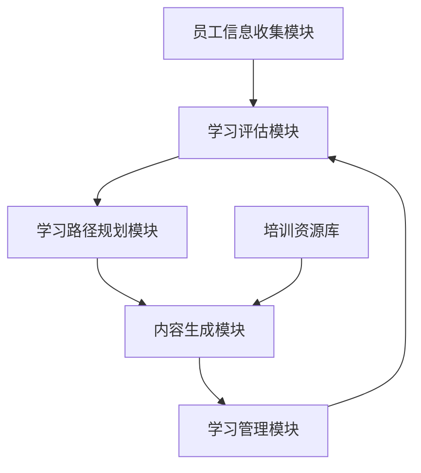

# 构建智能企业培训系统：自适应学习路径与内容生成

> 关键词：智能企业培训系统、自适应学习路径、内容生成、机器学习、个性化培训

> 摘要：本文聚焦于构建智能企业培训系统，着重探讨自适应学习路径与内容生成这两个核心方面。首先介绍智能企业培训系统的背景信息，包括目的、预期读者、文档结构等。接着阐述核心概念与联系，通过文本示意图和 Mermaid 流程图展示其原理和架构。详细讲解核心算法原理并给出 Python 源代码示例，同时运用数学模型和公式深入剖析。通过项目实战展示系统的具体实现，包括开发环境搭建、源代码实现及解读。分析系统的实际应用场景，推荐相关的工具和资源，最后总结未来发展趋势与挑战，解答常见问题并提供扩展阅读和参考资料，旨在为企业构建高效、个性化的培训系统提供全面的技术指导。

## 1. 背景介绍 
### 1.1 目的和范围
在当今竞争激烈的商业环境中，企业员工的能力提升至关重要。传统的企业培训系统往往采用一刀切的方式，无法满足员工的个性化需求，导致培训效果不佳。本智能企业培训系统的目的是构建一个能够根据员工的学习情况、技能水平和职业目标，自动生成自适应学习路径和个性化培训内容的系统。

本系统的范围涵盖了从员工信息收集、学习情况评估、学习路径规划到培训内容生成的全过程。系统将利用机器学习和数据分析技术，实现对员工学习过程的实时监控和动态调整，以提高培训的针对性和有效性。

### 1.2 预期读者
本文的预期读者包括企业培训管理人员、人力资源专家、软件开发人员以及对智能培训系统感兴趣的技术爱好者。企业培训管理人员和人力资源专家可以从中了解如何利用先进技术提升企业培训效果；软件开发人员可以获取系统开发的技术思路和实现方法；技术爱好者可以深入了解智能企业培训系统的原理和应用。

### 1.3 文档结构概述
本文将按照以下结构进行阐述：
1. **背景介绍**：介绍系统的目的、预期读者和文档结构。
2. **核心概念与联系**：阐述自适应学习路径和内容生成的核心概念，展示其原理和架构。
3. **核心算法原理 & 具体操作步骤**：详细讲解实现自适应学习路径和内容生成的核心算法，并给出 Python 源代码示例。
4. **数学模型和公式 & 详细讲解 & 举例说明**：运用数学模型和公式深入剖析系统的工作原理，并通过具体例子进行说明。
5. **项目实战：代码实际案例和详细解释说明**：通过项目实战展示系统的具体实现，包括开发环境搭建、源代码实现及解读。
6. **实际应用场景**：分析系统在不同企业场景中的应用。
7. **工具和资源推荐**：推荐相关的学习资源、开发工具和论文著作。
8. **总结：未来发展趋势与挑战**：总结系统的未来发展趋势和面临的挑战。
9. **附录：常见问题与解答**：解答读者在使用系统过程中可能遇到的常见问题。
10. **扩展阅读 & 参考资料**：提供相关的扩展阅读材料和参考资料。

### 1.4 术语表
#### 1.4.1 核心术语定义
- **智能企业培训系统**：利用人工智能和机器学习技术，实现个性化培训路径规划和内容生成的企业培训系统。
- **自适应学习路径**：根据员工的学习情况、技能水平和职业目标，自动生成的个性化学习路径。
- **内容生成**：根据员工的学习需求和学习路径，自动生成适合员工的培训内容。
- **机器学习**：让计算机通过数据学习模式和规律，从而实现预测和决策的技术。
- **数据分析**：对数据进行收集、清洗、分析和可视化，以提取有价值信息的过程。

#### 1.4.2 相关概念解释
- **个性化培训**：根据员工的个体差异，为其提供定制化的培训方案。
- **实时监控**：对员工的学习过程进行实时跟踪和评估。
- **动态调整**：根据员工的学习情况和反馈，实时调整学习路径和培训内容。

#### 1.4.3 缩略词列表
- **AI**：人工智能（Artificial Intelligence）
- **ML**：机器学习（Machine Learning）
- **NLP**：自然语言处理（Natural Language Processing）
- **API**：应用程序编程接口（Application Programming Interface）

## 2. 核心概念与联系 
### 核心概念原理
智能企业培训系统的核心在于自适应学习路径和内容生成。自适应学习路径是根据员工的初始技能水平、学习进度、学习风格和职业目标等因素，为其量身定制的学习计划。该计划会随着员工的学习进展和表现进行动态调整，以确保员工始终在最适合自己的学习轨道上前进。

内容生成则是根据自适应学习路径，从培训资源库中筛选和组合适合员工的培训内容。这些内容可以包括在线课程、视频教程、文档资料等多种形式。同时，系统还可以利用自然语言处理技术，自动生成个性化的学习材料，如练习题、案例分析等。

### 架构的文本示意图
智能企业培训系统主要由以下几个模块组成：
1. **员工信息收集模块**：收集员工的基本信息、技能水平、学习历史等数据。
2. **学习评估模块**：根据员工的学习情况，对其技能水平进行实时评估。
3. **学习路径规划模块**：根据员工的评估结果和职业目标，生成自适应学习路径。
4. **内容生成模块**：根据学习路径，从培训资源库中筛选和组合培训内容，并自动生成个性化学习材料。
5. **学习管理模块**：管理员工的学习过程，包括学习进度跟踪、学习反馈收集等。
6. **培训资源库**：存储各种培训资源，如课程、视频、文档等。

### Mermaid 流程图


该流程图展示了智能企业培训系统的工作流程。首先，员工信息收集模块收集员工的相关信息，然后学习评估模块对员工的技能水平进行评估。接着，学习路径规划模块根据评估结果生成自适应学习路径，内容生成模块根据学习路径生成培训内容。学习管理模块负责管理员工的学习过程，并将学习反馈返回给学习评估模块，以便对学习路径和内容进行动态调整。培训资源库为内容生成模块提供所需的培训资源。

## 3. 核心算法原理 & 具体操作步骤 
### 核心算法原理
实现自适应学习路径和内容生成的核心算法主要包括以下几种：
1. **聚类算法**：用于将员工根据技能水平、学习风格等因素进行聚类，以便为不同类别的员工制定不同的学习路径。常见的聚类算法有 K-Means 算法、DBSCAN 算法等。
2. **推荐算法**：根据员工的学习历史和兴趣偏好，为其推荐适合的培训内容。常见的推荐算法有基于内容的推荐算法、协同过滤推荐算法等。
3. **决策树算法**：用于根据员工的评估结果和学习目标，生成学习路径决策树，从而确定员工的学习路径。

### 具体操作步骤及 Python 源代码示例
#### 聚类算法（K-Means 算法）
K-Means 算法是一种常用的聚类算法，其基本思想是将数据点划分为 K 个簇，使得每个簇内的数据点相似度较高，而不同簇之间的数据点相似度较低。以下是使用 Python 实现 K-Means 算法的示例代码：
```python
import numpy as np
from sklearn.cluster import KMeans

# 生成示例数据
X = np.array([[1, 2], [1, 4], [1, 0],
              [4, 2], [4, 4], [4, 0]])

# 创建 K-Means 模型
kmeans = KMeans(n_clusters=2, random_state=0).fit(X)

# 获取聚类标签
labels = kmeans.labels_
print("聚类标签:", labels)

# 获取聚类中心
centroids = kmeans.cluster_centers_
print("聚类中心:", centroids)
```
#### 推荐算法（基于内容的推荐算法）
基于内容的推荐算法是根据物品的特征和用户的偏好，为用户推荐相似的物品。以下是一个简单的基于内容的推荐算法的 Python 示例：
```python
import pandas as pd
from sklearn.feature_extraction.text import TfidfVectorizer
from sklearn.metrics.pairwise import cosine_similarity

# 示例数据
data = {
    'course_id': [1, 2, 3],
    'course_title': ['Python 编程基础', '数据分析实战', '机器学习入门'],
    'description': ['介绍 Python 编程语言的基础知识', '讲解数据分析的方法和工具', '学习机器学习的基本算法']
}
df = pd.DataFrame(data)

# 提取课程描述的特征
vectorizer = TfidfVectorizer()
tfidf_matrix = vectorizer.fit_transform(df['description'])

# 计算课程之间的相似度
cosine_sim = cosine_similarity(tfidf_matrix, tfidf_matrix)

# 定义推荐函数
def recommend_courses(course_id, cosine_sim=cosine_sim):
    idx = df[df['course_id'] == course_id].index[0]
    sim_scores = list(enumerate(cosine_sim[idx]))
    sim_scores = sorted(sim_scores, key=lambda x: x[1], reverse=True)
    sim_scores = sim_scores[1:4]
    course_indices = [i[0] for i in sim_scores]
    return df['course_title'].iloc[course_indices]

# 推荐课程
recommended_courses = recommend_courses(1)
print("推荐课程:", recommended_courses)
```
#### 决策树算法
决策树算法是一种基于树结构进行决策的算法，可用于生成学习路径决策树。以下是使用 Python 实现决策树算法的示例代码：
```python
from sklearn.datasets import load_iris
from sklearn.tree import DecisionTreeClassifier
from sklearn.model_selection import train_test_split
from sklearn.metrics import accuracy_score

# 加载数据集
iris = load_iris()
X = iris.data
y = iris.target

# 划分训练集和测试集
X_train, X_test, y_train, y_test = train_test_split(X, y, test_size=0.3, random_state=42)

# 创建决策树模型
clf = DecisionTreeClassifier()
clf.fit(X_train, y_train)

# 预测
y_pred = clf.predict(X_test)

# 计算准确率
accuracy = accuracy_score(y_test, y_pred)
print("准确率:", accuracy)
```

## 4. 数学模型和公式 & 详细讲解 & 举例说明 
### 聚类算法（K-Means 算法）
#### 数学模型和公式
K-Means 算法的目标是最小化每个数据点到其所属簇中心的距离之和，其数学公式可以表示为：
$$
J = \sum_{i=1}^{n} \sum_{j=1}^{k} r_{ij} \left\| x_i - \mu_j \right\|^2
$$
其中，$n$ 是数据点的数量，$k$ 是簇的数量，$x_i$ 是第 $i$ 个数据点，$\mu_j$ 是第 $j$ 个簇的中心，$r_{ij}$ 是一个指示变量，如果数据点 $x_i$ 属于簇 $j$，则 $r_{ij} = 1$，否则 $r_{ij} = 0$。

#### 详细讲解
K-Means 算法的具体步骤如下：
1. 随机初始化 $k$ 个簇中心。
2. 对于每个数据点，计算其到各个簇中心的距离，并将其分配到距离最近的簇中。
3. 重新计算每个簇的中心。
4. 重复步骤 2 和 3，直到簇中心不再发生变化或达到最大迭代次数。

#### 举例说明
假设我们有以下 6 个数据点：$x_1 = [1, 2], x_2 = [1, 4], x_3 = [1, 0], x_4 = [4, 2], x_5 = [4, 4], x_6 = [4, 0]$，我们要将这些数据点划分为 2 个簇。
1. 随机初始化 2 个簇中心：$\mu_1 = [1, 2], \mu_2 = [4, 4]$。
2. 计算每个数据点到各个簇中心的距离，并将其分配到距离最近的簇中：
    - $x_1$ 到 $\mu_1$ 的距离为 0，到 $\mu_2$ 的距离为 $\sqrt{(1 - 4)^2 + (2 - 4)^2} = \sqrt{13}$，因此 $x_1$ 属于簇 1。
    - 以此类推，计算其他数据点的归属，得到簇 1 包含 $x_1, x_2, x_3$，簇 2 包含 $x_4, x_5, x_6$。
3. 重新计算每个簇的中心：
    - 簇 1 的中心 $\mu_1 = \frac{1}{3}([1, 2] + [1, 4] + [1, 0]) = [1, 2]$。
    - 簇 2 的中心 $\mu_2 = \frac{1}{3}([4, 2] + [4, 4] + [4, 0]) = [4, 2]$。
4. 重复步骤 2 和 3，直到簇中心不再发生变化。

### 推荐算法（基于内容的推荐算法）
#### 数学模型和公式
基于内容的推荐算法通常使用余弦相似度来计算物品之间的相似度，其数学公式为：
$$
\text{cosine_sim}(A, B) = \frac{A \cdot B}{\left\| A \right\| \left\| B \right\|}
$$
其中，$A$ 和 $B$ 是两个物品的特征向量，$\cdot$ 表示向量的点积，$\left\| A \right\|$ 和 $\left\| B \right\|$ 分别表示向量 $A$ 和 $B$ 的模。

#### 详细讲解
基于内容的推荐算法的具体步骤如下：
1. 提取物品的特征，通常使用 TF-IDF（词频 - 逆文档频率）方法将文本特征向量化。
2. 计算物品之间的相似度，通常使用余弦相似度。
3. 根据用户的历史行为，找出用户感兴趣的物品。
4. 推荐与用户感兴趣的物品相似度较高的物品。

#### 举例说明
假设我们有两个课程描述：“Python 编程基础：介绍 Python 编程语言的基础知识” 和 “数据分析实战：讲解数据分析的方法和工具”。
1. 提取特征：使用 TF-IDF 方法将这两个课程描述向量化，得到特征向量 $A$ 和 $B$。
2. 计算相似度：使用余弦相似度公式计算 $A$ 和 $B$ 的相似度。
3. 如果用户对 “Python 编程基础” 课程感兴趣，我们可以根据相似度推荐与该课程相似度较高的其他课程。

### 决策树算法
#### 数学模型和公式
决策树算法通常使用信息增益、信息增益率或基尼指数等指标来选择最优的划分特征。以信息增益为例，其数学公式为：
$$
\text{Gain}(D, a) = \text{Ent}(D) - \sum_{v=1}^{V} \frac{\left| D^v \right|}{\left| D \right|} \text{Ent}(D^v)
$$
其中，$D$ 是数据集，$a$ 是划分特征，$V$ 是特征 $a$ 的取值个数，$D^v$ 是 $D$ 中特征 $a$ 取值为 $v$ 的子集，$\text{Ent}(D)$ 是数据集 $D$ 的信息熵，其计算公式为：
$$
\text{Ent}(D) = - \sum_{k=1}^{K} p_k \log_2 p_k
$$
其中，$K$ 是类别数，$p_k$ 是第 $k$ 类样本在数据集 $D$ 中所占的比例。

#### 详细讲解
决策树算法的具体步骤如下：
1. 选择最优的划分特征。
2. 根据划分特征将数据集划分为多个子集。
3. 对每个子集重复步骤 1 和 2，直到子集满足停止条件（如子集样本数小于某个阈值或子集内样本属于同一类别）。
4. 生成决策树。

#### 举例说明
假设我们有一个数据集，包含 4 个样本，每个样本有 2 个特征（天气和温度）和 1 个类别标签（是否适合出行）：
| 天气 | 温度 | 是否适合出行 |
| ---- | ---- | ---- |
| 晴天 | 高温 | 是 |
| 阴天 | 低温 | 否 |
| 晴天 | 低温 | 是 |
| 阴天 | 高温 | 否 |

我们可以使用决策树算法根据天气和温度来预测是否适合出行。首先，计算每个特征的信息增益，选择信息增益最大的特征作为根节点进行划分。然后，对划分后的子集重复上述步骤，直到生成决策树。

## 5. 项目实战：代码实际案例和详细解释说明 
### 5.1  开发环境搭建
#### 操作系统
本项目可以在 Windows、Linux 或 macOS 操作系统上进行开发，建议使用 Linux 或 macOS 系统，因为它们对 Python 和相关开发工具的支持更好。

#### 编程语言和框架
- **Python**：作为主要的编程语言，Python 具有丰富的机器学习和数据分析库，如 NumPy、Pandas、Scikit-learn 等。
- **Flask**：用于构建 Web 应用程序，实现用户界面和与用户的交互。

#### 数据库
- **MySQL**：用于存储员工信息、培训资源信息和学习记录等数据。

#### 安装步骤
1. 安装 Python：可以从 Python 官方网站（https://www.python.org/downloads/）下载并安装 Python 3.7 或以上版本。
2. 安装 MySQL：可以从 MySQL 官方网站（https://dev.mysql.com/downloads/installer/）下载并安装 MySQL 数据库。
3. 创建虚拟环境：使用 `venv` 模块创建虚拟环境，避免不同项目之间的依赖冲突。
```bash
python -m venv myenv
source myenv/bin/activate  # 在 Windows 上使用 myenv\Scripts\activate
```
4. 安装依赖库：在虚拟环境中安装所需的 Python 库。
```bash
pip install numpy pandas scikit-learn flask mysql-connector-python
```

### 5.2  源代码详细实现和代码解读
#### 员工信息收集模块
```python
import mysql.connector

# 连接数据库
mydb = mysql.connector.connect(
    host="localhost",
    user="your_username",
    password="your_password",
    database="training_system"
)

# 创建游标
mycursor = mydb.cursor()

# 插入员工信息
def insert_employee_info(employee_id, name, skills, learning_history):
    sql = "INSERT INTO employees (employee_id, name, skills, learning_history) VALUES (%s, %s, %s, %s)"
    val = (employee_id, name, skills, learning_history)
    mycursor.execute(sql, val)
    mydb.commit()
    print(mycursor.rowcount, "record inserted.")

# 示例调用
insert_employee_info(1, "John Doe", "Python, Java", "Course 1, Course 2")
```
代码解读：该模块实现了员工信息的插入功能，将员工的基本信息（如员工 ID、姓名、技能和学习历史）插入到 MySQL 数据库的 `employees` 表中。

#### 学习评估模块
```python
import numpy as np
from sklearn.linear_model import LogisticRegression

# 示例数据
X_train = np.array([[1, 2], [2, 3], [3, 4], [4, 5]])
y_train = np.array([0, 0, 1, 1])

# 创建逻辑回归模型
model = LogisticRegression()
model.fit(X_train, y_train)

# 评估员工技能水平
def evaluate_skills(skills):
    prediction = model.predict([skills])
    return prediction[0]

# 示例调用
skills = [2, 3]
result = evaluate_skills(skills)
print("评估结果:", result)
```
代码解读：该模块使用逻辑回归模型对员工的技能水平进行评估。首先，使用示例数据训练逻辑回归模型，然后根据输入的员工技能数据进行预测。

#### 学习路径规划模块
```python
# 简单的学习路径规划函数
def plan_learning_path(evaluation_result):
    if evaluation_result == 0:
        return ["Course A", "Course B"]
    else:
        return ["Course C", "Course D"]

# 示例调用
result = 0
learning_path = plan_learning_path(result)
print("学习路径:", learning_path)
```
代码解读：该模块根据员工的评估结果生成学习路径。如果评估结果为 0，则推荐课程 A 和课程 B；否则，推荐课程 C 和课程 D。

#### 内容生成模块
```python
import random

# 培训资源库
training_resources = {
    "Course A": ["Video 1", "Document 1"],
    "Course B": ["Video 2", "Document 2"],
    "Course C": ["Video 3", "Document 3"],
    "Course D": ["Video 4", "Document 4"]
}

# 生成培训内容
def generate_training_content(learning_path):
    content = []
    for course in learning_path:
        resources = training_resources.get(course)
        if resources:
            random_resource = random.choice(resources)
            content.append(random_resource)
    return content

# 示例调用
learning_path = ["Course A", "Course B"]
training_content = generate_training_content(learning_path)
print("培训内容:", training_content)
```
代码解读：该模块根据学习路径从培训资源库中选择适合的培训内容。对于每个课程，随机选择一个资源作为培训内容。

#### 学习管理模块
```python
# 记录学习进度
def record_learning_progress(employee_id, course, progress):
    sql = "INSERT INTO learning_progress (employee_id, course, progress) VALUES (%s, %s, %s)"
    val = (employee_id, course, progress)
    mycursor.execute(sql, val)
    mydb.commit()
    print(mycursor.rowcount, "record inserted.")

# 示例调用
record_learning_progress(1, "Course A", 50)
```
代码解读：该模块实现了学习进度的记录功能，将员工的学习进度信息插入到 MySQL 数据库的 `learning_progress` 表中。

### 5.3  代码解读与分析
通过以上代码示例，我们实现了智能企业培训系统的主要功能模块。员工信息收集模块负责收集和存储员工的基本信息；学习评估模块使用机器学习模型对员工的技能水平进行评估；学习路径规划模块根据评估结果生成个性化的学习路径；内容生成模块根据学习路径从培训资源库中选择适合的培训内容；学习管理模块负责记录员工的学习进度。

这些模块之间相互协作，形成了一个完整的智能企业培训系统。在实际应用中，可以根据具体需求对这些模块进行扩展和优化，例如使用更复杂的机器学习模型、增加更多的培训资源和学习评估指标等。

## 6. 实际应用场景 
### 新员工入职培训
对于新入职的员工，智能企业培训系统可以根据其专业背景、技能水平和职业目标，为其制定个性化的入职培训计划。系统可以自动分配适合的培训课程，如公司文化、业务流程、专业技能等方面的课程，并根据员工的学习进度和表现进行动态调整。通过这种方式，新员工可以更快地适应公司环境，掌握所需的技能，提高工作效率。

### 员工技能提升培训
随着业务的发展和技术的更新，员工需要不断提升自己的技能水平。智能企业培训系统可以定期对员工的技能进行评估，发现员工的技能短板，并为其推荐相应的培训课程和学习资源。例如，如果员工在数据分析方面的技能较弱，系统可以推荐数据分析相关的课程和实践项目，帮助员工提升数据分析能力。

### 团队协作培训
在企业中，团队协作能力至关重要。智能企业培训系统可以根据团队成员的角色和职责，为团队设计专门的协作培训课程。系统可以模拟实际工作场景，让团队成员通过在线协作完成任务，提高团队协作效率和沟通能力。同时，系统还可以对团队成员的协作表现进行评估，为团队提供改进建议。

### 销售培训
对于销售团队，智能企业培训系统可以根据市场需求和客户特点，为销售人员提供个性化的销售培训。系统可以分析销售人员的销售数据和客户反馈，找出销售人员的优势和不足，为其推荐针对性的销售技巧和营销策略培训课程。此外，系统还可以提供实时的销售支持，如产品信息查询、客户案例分析等，帮助销售人员更好地完成销售任务。

## 7. 工具和资源推荐
### 7.1 学习资源推荐
#### 7.1.1 书籍推荐
- 《Python 机器学习》：介绍了 Python 在机器学习领域的应用，包括数据预处理、模型选择、评估和优化等方面的内容。
- 《人工智能：一种现代的方法》：全面介绍了人工智能的基本概念、算法和应用，是人工智能领域的经典教材。
- 《数据挖掘：概念与技术》：详细讲解了数据挖掘的基本概念、算法和应用，包括关联规则挖掘、分类、聚类等方面的内容。

#### 7.1.2 在线课程
- Coursera 上的 “机器学习” 课程：由斯坦福大学教授 Andrew Ng 授课，是机器学习领域的经典课程。
- edX 上的 “人工智能基础” 课程：介绍了人工智能的基本概念、算法和应用，适合初学者学习。
- Udemy 上的 “Python 数据科学和机器学习实战” 课程：结合实际案例，介绍了 Python 在数据科学和机器学习领域的应用。

#### 7.1.3 技术博客和网站
- Medium：上面有很多关于人工智能、机器学习和数据分析的技术文章和教程。
- Towards Data Science：专注于数据科学和机器学习领域的技术博客，提供了很多实用的教程和案例分析。
- Kaggle：是一个数据科学竞赛平台，上面有很多优秀的数据科学项目和开源代码，可以学习和参考。

### 7.2 开发工具框架推荐
#### 7.2.1 IDE和编辑器
- PyCharm：是一款专门为 Python 开发设计的集成开发环境，具有代码编辑、调试、版本控制等功能。
- Jupyter Notebook：是一个交互式的开发环境，适合进行数据探索、模型训练和可视化等工作。
- Visual Studio Code：是一款轻量级的代码编辑器，支持多种编程语言和插件，具有丰富的扩展功能。

#### 7.2.2 调试和性能分析工具
- PDB：是 Python 自带的调试工具，可以帮助开发者调试代码，查找问题。
- cProfile：是 Python 自带的性能分析工具，可以分析代码的运行时间和内存使用情况。
- TensorBoard：是 TensorFlow 提供的可视化工具，可以帮助开发者可视化模型训练过程和结果。

#### 7.2.3 相关框架和库
- NumPy：是 Python 中用于科学计算的基础库，提供了高效的多维数组对象和数学函数。
- Pandas：是 Python 中用于数据处理和分析的库，提供了数据结构和数据分析工具。
- Scikit-learn：是 Python 中用于机器学习的库，提供了各种机器学习算法和工具，如分类、回归、聚类等。
- TensorFlow 和 PyTorch：是深度学习领域的两个主流框架，提供了高效的深度学习模型训练和部署工具。

### 7.3 相关论文著作推荐
#### 7.3.1 经典论文
- “A Survey on Transfer Learning”：介绍了迁移学习的基本概念、方法和应用，是迁移学习领域的经典论文。
- “ImageNet Classification with Deep Convolutional Neural Networks”：介绍了卷积神经网络在图像分类任务中的应用，开启了深度学习在计算机视觉领域的热潮。
- “Long Short-Term Memory”：介绍了长短期记忆网络（LSTM）的基本原理和应用，是循环神经网络领域的经典论文。

#### 7.3.2 最新研究成果
- arXiv：是一个预印本论文平台，上面有很多关于人工智能、机器学习和数据分析的最新研究成果。
- NeurIPS、ICML、CVPR 等学术会议：是人工智能和机器学习领域的顶级学术会议，每年都会发表很多优秀的研究论文。

#### 7.3.3 应用案例分析
- 《智能时代》：介绍了人工智能在各个领域的应用案例和发展趋势，对企业应用人工智能具有一定的参考价值。
- 《大数据时代》：介绍了大数据的基本概念、技术和应用案例，对企业利用大数据进行决策和创新具有一定的指导意义。

## 8. 总结：未来发展趋势与挑战
### 未来发展趋势
#### 融合更多技术
智能企业培训系统将融合更多的技术，如虚拟现实（VR）、增强现实（AR）和区块链等。VR 和 AR 技术可以为员工提供更加沉浸式的学习体验，让员工在虚拟环境中进行实践操作和模拟训练；区块链技术可以保证培训数据的安全性和可信度，实现培训记录的不可篡改和可追溯。

#### 强化与业务的结合
未来的智能企业培训系统将更加注重与企业业务的结合，根据企业的业务需求和战略目标，为员工提供更加贴合实际工作的培训内容。例如，系统可以根据企业的销售数据和市场趋势，为销售人员提供针对性的销售技巧和营销策略培训。

#### 实现全球协作学习
随着全球化的发展，企业的员工分布在世界各地。智能企业培训系统将支持全球协作学习，让不同地区的员工可以通过在线平台进行实时交流和合作学习。系统可以提供多语言支持和跨时区学习功能，方便全球员工的学习和交流。

### 面临的挑战
#### 数据隐私和安全问题
智能企业培训系统需要收集和处理大量的员工数据，如个人信息、学习记录和技能水平等。这些数据涉及员工的隐私和企业的商业机密，因此数据隐私和安全问题是系统面临的重要挑战。企业需要采取有效的措施，如数据加密、访问控制和安全审计等，保障数据的安全和隐私。

#### 技术复杂性和成本问题
实现智能企业培训系统需要运用多种先进的技术，如机器学习、自然语言处理和大数据分析等。这些技术的应用需要专业的技术人员和大量的计算资源，技术复杂性和成本问题是企业面临的另一个挑战。企业需要在技术选型和资源投入方面进行合理的规划和决策。

#### 员工接受度问题
员工对智能企业培训系统的接受度也是一个重要问题。一些员工可能对新的培训方式和技术存在抵触情绪，不愿意使用智能培训系统。企业需要加强对员工的培训和宣传，提高员工对系统的认识和接受度，让员工积极参与到培训中来。

## 9. 附录：常见问题与解答
### 1. 智能企业培训系统需要多少员工数据才能正常工作？
智能企业培训系统需要收集一定量的员工数据，如基本信息、技能水平和学习历史等，才能为员工制定个性化的学习路径和生成适合的培训内容。具体需要多少数据取决于系统的算法和模型复杂度。一般来说，数据量越大，系统的准确性和个性化程度就越高。但企业在收集和使用员工数据时，需要遵守相关的法律法规，保障员工的隐私和权益。

### 2. 智能企业培训系统的维护和更新成本高吗？
智能企业培训系统的维护和更新成本取决于系统的规模和复杂度。一般来说，系统需要定期进行数据更新、模型优化和安全维护等工作，这些工作需要一定的人力和物力成本。但与传统的培训方式相比，智能企业培训系统可以提高培训效率和效果，降低培训成本，从长期来看，具有较高的性价比。

### 3. 智能企业培训系统可以与企业现有的 HR 系统集成吗？
可以。智能企业培训系统可以与企业现有的 HR 系统集成，实现员工信息的共享和同步。通过集成，系统可以直接从 HR 系统中获取员工的基本信息、职位信息和绩效信息等，为员工提供更加个性化的培训服务。同时，系统也可以将员工的学习记录和培训成果反馈给 HR 系统，为企业的人力资源管理提供支持。

### 4. 智能企业培训系统如何保证培训内容的质量？
智能企业培训系统可以通过以下方式保证培训内容的质量：
- **严格的内容审核机制**：在将培训内容纳入系统之前，对内容进行严格的审核，确保内容的准确性、实用性和合法性。
- **实时更新培训内容**：根据行业发展和技术更新，及时更新培训内容，保证内容的时效性。
- **用户反馈和评价机制**：收集员工对培训内容的反馈和评价，根据反馈意见对内容进行优化和改进。

### 5. 智能企业培训系统适合所有类型的企业吗？
智能企业培训系统适合大多数类型的企业，尤其是那些员工数量较多、业务复杂、对员工技能提升有较高要求的企业。对于小型企业来说，如果员工数量较少、业务相对简单，可能传统的培训方式就可以满足需求。但随着企业的发展和竞争的加剧，越来越多的企业将意识到智能培训系统的重要性，并逐渐采用这种方式来提升员工的能力和竞争力。

## 10. 扩展阅读 & 参考资料
### 扩展阅读
- 《智能学习系统的设计与实现》：深入介绍了智能学习系统的设计原理、技术实现和应用案例，对智能企业培训系统的开发具有一定的参考价值。
- 《企业数字化转型与培训创新》：探讨了企业数字化转型背景下培训创新的趋势和方法，为企业构建智能培训系统提供了新的思路。
- 《人工智能在教育领域的应用与发展》：介绍了人工智能在教育领域的应用现状和发展趋势，对智能企业培训系统的未来发展具有一定的启示作用。

### 参考资料
- 相关学术论文和研究报告，如《Journal of Educational Technology & Society》、《International Journal of Artificial Intelligence in Education》等期刊上的论文。
- 行业标准和规范，如 ISO 10015:2019《质量管理 培训指南》等。
- 企业案例和实践经验，如谷歌、微软等公司在员工培训方面的成功案例。

作者：AI天才研究院/AI Genius Institute & 禅与计算机程序设计艺术 /Zen And The Art of Computer Programming