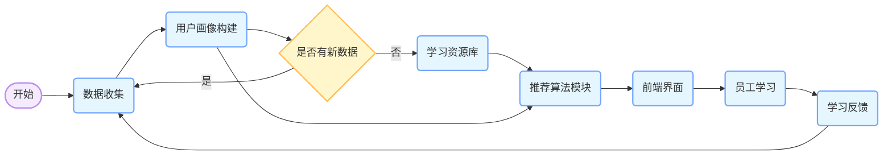

# 构建智能企业学习管理系统：个性化技能发展

> 关键词：智能企业学习管理系统、个性化技能发展、机器学习、数据分析、用户画像

> 摘要：本文聚焦于构建智能企业学习管理系统以实现员工的个性化技能发展。首先介绍了该系统构建的背景，包括目的、预期读者等信息。接着阐述了核心概念，如系统架构和工作流程，并给出相应的示意图和流程图。详细讲解了核心算法原理，使用 Python 代码进行说明。深入探讨了数学模型和公式，通过举例加深理解。在项目实战部分，给出了开发环境搭建、源代码实现及解读。分析了该系统的实际应用场景，推荐了学习资源、开发工具和相关论文著作。最后总结了系统的未来发展趋势与挑战，并提供常见问题解答和扩展阅读参考资料。

## 1. 背景介绍 
### 1.1 目的和范围
在当今竞争激烈的商业环境中，企业员工的技能发展对于企业的成功至关重要。传统的企业学习管理系统往往采用一刀切的方式提供培训内容，无法满足员工的个性化需求。本项目的目的是构建一个智能企业学习管理系统，该系统能够根据员工的个人技能水平、职业目标和学习习惯，为其提供个性化的学习路径和内容，从而提高员工的学习效率和技能水平，进而提升企业的整体竞争力。

本项目的范围涵盖了系统的需求分析、设计、开发和测试。具体包括收集员工的相关数据，建立用户画像模型，设计个性化学习算法，开发系统的前端界面和后端服务，以及对系统进行功能和性能测试。

### 1.2 预期读者
本文的预期读者主要包括企业的人力资源管理者、学习与发展专家、IT 技术人员以及对智能学习系统感兴趣的研究人员。人力资源管理者可以从中了解如何利用智能系统提升员工的学习效果和技能发展；学习与发展专家可以获取个性化学习设计的思路和方法；IT 技术人员可以借鉴系统的架构设计和算法实现；研究人员可以关注相关的理论和技术发展。

### 1.3 文档结构概述
本文将按照以下结构进行组织：
- 核心概念与联系：介绍智能企业学习管理系统和个性化技能发展的核心概念，以及它们之间的联系，同时给出系统架构和工作流程的示意图和流程图。
- 核心算法原理 & 具体操作步骤：详细讲解用于实现个性化学习的核心算法原理，并使用 Python 代码进行具体实现。
- 数学模型和公式 & 详细讲解 & 举例说明：介绍构建用户画像和推荐学习内容所涉及的数学模型和公式，并通过具体例子进行说明。
- 项目实战：代码实际案例和详细解释说明：包括开发环境搭建、源代码详细实现和代码解读，以及对代码的分析。
- 实际应用场景：分析智能企业学习管理系统在不同企业场景中的应用。
- 工具和资源推荐：推荐学习资源、开发工具框架和相关论文著作。
- 总结：未来发展趋势与挑战：总结系统的发展趋势和面临的挑战。
- 附录：常见问题与解答：解答读者可能遇到的常见问题。
- 扩展阅读 & 参考资料：提供相关的扩展阅读材料和参考资料。

### 1.4 术语表
#### 1.4.1 核心术语定义
- 智能企业学习管理系统（Intelligent Enterprise Learning Management System, IELMS）：一种利用人工智能和机器学习技术，能够根据员工的个性化需求提供学习内容和路径的企业学习管理系统。
- 个性化技能发展（Personalized Skill Development）：根据员工的个人技能水平、职业目标和学习习惯，为其量身定制学习计划，以促进其技能的提升。
- 用户画像（User Profile）：通过收集和分析用户的相关数据，构建的关于用户特征和行为的模型。
- 学习路径（Learning Path）：为员工设计的一系列有针对性的学习课程和活动，以帮助他们实现特定的技能发展目标。

#### 1.4.2 相关概念解释
- 机器学习（Machine Learning）：让计算机通过数据学习模式和规律，并根据这些模式和规律进行预测和决策的技术。在本系统中，机器学习用于分析员工数据，构建用户画像和推荐学习内容。
- 数据分析（Data Analysis）：对收集到的数据进行清洗、转换和分析，以提取有价值信息的过程。在本系统中，数据分析用于了解员工的学习需求和行为。
- 推荐系统（Recommendation System）：根据用户的历史行为和偏好，为用户推荐相关内容的系统。在本系统中，推荐系统用于为员工推荐个性化的学习内容。

#### 1.4.3 缩略词列表
- IELMS：Intelligent Enterprise Learning Management System
- ML：Machine Learning
- RS：Recommendation System

## 2. 核心概念与联系 

### 核心概念原理
智能企业学习管理系统的核心原理是通过收集员工的多维度数据，构建用户画像，然后利用推荐算法为员工提供个性化的学习路径和内容。用户画像的构建基于员工的基本信息（如职位、工作年限等）、技能水平评估结果、学习历史记录等数据。推荐算法则根据用户画像和学习资源的特征，计算员工与学习资源之间的匹配度，从而为员工推荐最合适的学习内容。

### 架构的文本示意图
智能企业学习管理系统主要由以下几个部分组成：
- 数据收集模块：负责收集员工的各种数据，包括基本信息、技能评估结果、学习记录等。
- 用户画像构建模块：根据收集到的数据，构建员工的用户画像。
- 学习资源库：存储各种学习资源，如课程视频、文档、在线测试等。
- 推荐算法模块：根据用户画像和学习资源库，为员工推荐个性化的学习内容。
- 前端界面模块：提供员工与系统交互的界面，员工可以查看推荐的学习内容、进行学习和反馈。
- 后端服务模块：负责处理前端界面的请求，与其他模块进行数据交互和业务逻辑处理。

### Mermaid 流程图


该流程图展示了智能企业学习管理系统的工作流程。首先进行数据收集，然后构建用户画像。系统会不断检查是否有新数据，如果有则重新进行数据收集和用户画像构建。接着，推荐算法模块根据用户画像和学习资源库为员工推荐学习内容，员工通过前端界面进行学习，并提供学习反馈，反馈数据又会进入数据收集环节，形成一个闭环。

## 3. 核心算法原理 & 具体操作步骤 

### 核心算法原理
本系统采用基于内容的推荐算法来实现个性化学习内容的推荐。该算法的核心思想是根据员工的用户画像和学习资源的特征，计算它们之间的相似度，从而为员工推荐最相似的学习资源。具体步骤如下：
1. 特征提取：从员工的用户画像和学习资源中提取特征。用户画像的特征可以包括技能水平、职业目标、学习兴趣等；学习资源的特征可以包括课程主题、难度级别、知识点等。
2. 相似度计算：使用余弦相似度公式计算员工用户画像和学习资源特征之间的相似度。
3. 排序推荐：根据相似度得分对学习资源进行排序，为员工推荐相似度得分较高的学习资源。

### Python 源代码实现
```python
import numpy as np

# 定义用户画像和学习资源的特征向量
user_profile = np.array([0.8, 0.6, 0.4])  # 假设用户画像有三个特征
learning_resources = [
    np.array([0.7, 0.5, 0.3]),
    np.array([0.2, 0.3, 0.9]),
    np.array([0.6, 0.7, 0.1])
]

# 定义余弦相似度计算函数
def cosine_similarity(vector1, vector2):
    dot_product = np.dot(vector1, vector2)
    norm_vector1 = np.linalg.norm(vector1)
    norm_vector2 = np.linalg.norm(vector2)
    if norm_vector1 == 0 or norm_vector2 == 0:
        return 0
    return dot_product / (norm_vector1 * norm_vector2)

# 计算用户画像与每个学习资源的相似度
similarities = []
for resource in learning_resources:
    similarity = cosine_similarity(user_profile, resource)
    similarities.append(similarity)

# 对相似度得分进行排序，并获取排序后的索引
sorted_indices = np.argsort(similarities)[::-1]

# 推荐前两个学习资源
top_k = 2
recommended_resources = [learning_resources[i] for i in sorted_indices[:top_k]]

print("推荐的学习资源特征向量：", recommended_resources)
```

### 具体操作步骤
1. 数据预处理：对收集到的员工数据和学习资源数据进行清洗和转换，提取特征向量。
2. 特征提取：根据业务需求，从预处理后的数据中提取有代表性的特征，如技能水平、课程主题等。
3. 相似度计算：使用上述的余弦相似度计算函数，计算员工用户画像和学习资源特征之间的相似度。
4. 排序推荐：根据相似度得分对学习资源进行排序，选择相似度得分较高的学习资源进行推荐。
5. 结果展示：将推荐的学习资源展示给员工，员工可以根据推荐进行学习。

## 4. 数学模型和公式 & 详细讲解 & 举例说明 

### 数学模型和公式
#### 余弦相似度公式
余弦相似度是一种常用的计算向量相似度的方法，其公式为：
$$
\cos(\theta) = \frac{\mathbf{A} \cdot \mathbf{B}}{\|\mathbf{A}\| \|\mathbf{B}\|}
$$
其中，$\mathbf{A}$ 和 $\mathbf{B}$ 是两个向量，$\mathbf{A} \cdot \mathbf{B}$ 是它们的点积，$\|\mathbf{A}\|$ 和 $\|\mathbf{B}\|$ 分别是它们的模。余弦相似度的取值范围是 $[-1, 1]$，值越接近 1 表示两个向量越相似。

#### 具体讲解
在智能企业学习管理系统中，我们将员工的用户画像和学习资源的特征表示为向量。通过计算这两个向量的余弦相似度，我们可以得到员工与学习资源之间的相似度得分。例如，如果员工的用户画像向量表示员工对某个技能领域的兴趣和技能水平，学习资源的特征向量表示该学习资源所涵盖的技能领域和难度级别，那么通过计算余弦相似度，我们可以判断该学习资源是否适合该员工。

#### 举例说明
假设员工的用户画像向量 $\mathbf{A} = [0.8, 0.6, 0.4]$，表示员工在三个技能领域的兴趣和技能水平。学习资源的特征向量 $\mathbf{B} = [0.7, 0.5, 0.3]$，表示该学习资源在这三个技能领域的覆盖程度。

首先计算点积：
$$
\mathbf{A} \cdot \mathbf{B} = 0.8 \times 0.7 + 0.6 \times 0.5 + 0.4 \times 0.3 = 0.56 + 0.3 + 0.12 = 0.98
$$

然后计算向量的模：
$$
\|\mathbf{A}\| = \sqrt{0.8^2 + 0.6^2 + 0.4^2} = \sqrt{0.64 + 0.36 + 0.16} = \sqrt{1.16} \approx 1.077
$$
$$
\|\mathbf{B}\| = \sqrt{0.7^2 + 0.5^2 + 0.3^2} = \sqrt{0.49 + 0.25 + 0.09} = \sqrt{0.83} \approx 0.911
$$

最后计算余弦相似度：
$$
\cos(\theta) = \frac{0.98}{1.077 \times 0.911} \approx \frac{0.98}{0.981} \approx 0.999
$$

由于余弦相似度接近 1，说明该学习资源与员工的用户画像非常相似，适合推荐给该员工。

## 5. 项目实战：代码实际案例和详细解释说明 

### 5.1  开发环境搭建
#### 后端开发环境
- 编程语言：Python 3.8 及以上
- 框架：Flask（用于构建 Web 服务）
- 数据库：MySQL（用于存储员工数据、学习资源数据和用户画像数据）

#### 前端开发环境
- 编程语言：HTML、CSS、JavaScript
- 框架：Vue.js（用于构建前端界面）

#### 开发工具
- 集成开发环境（IDE）：PyCharm（用于 Python 开发）、Visual Studio Code（用于前端开发）
- 数据库管理工具：Navicat（用于管理 MySQL 数据库）

### 5.2  源代码详细实现和代码解读
#### 后端代码实现（Flask 示例）
```python
from flask import Flask, jsonify, request
import mysql.connector
import numpy as np

app = Flask(__name__)

# 连接 MySQL 数据库
mydb = mysql.connector.connect(
    host="localhost",
    user="your_username",
    password="your_password",
    database="ielms"
)

# 定义余弦相似度计算函数
def cosine_similarity(vector1, vector2):
    dot_product = np.dot(vector1, vector2)
    norm_vector1 = np.linalg.norm(vector1)
    norm_vector2 = np.linalg.norm(vector2)
    if norm_vector1 == 0 or norm_vector2 == 0:
        return 0
    return dot_product / (norm_vector1 * norm_vector2)

# 获取用户画像
def get_user_profile(user_id):
    mycursor = mydb.cursor()
    sql = "SELECT skill_level_1, skill_level_2, skill_level_3 FROM user_profiles WHERE user_id = %s"
    val = (user_id,)
    mycursor.execute(sql, val)
    result = mycursor.fetchone()
    if result:
        return np.array(result)
    return None

# 获取学习资源特征
def get_learning_resources():
    mycursor = mydb.cursor()
    sql = "SELECT feature_1, feature_2, feature_3 FROM learning_resources"
    mycursor.execute(sql)
    results = mycursor.fetchall()
    resources = []
    for result in results:
        resources.append(np.array(result))
    return resources

# 推荐学习资源
@app.route('/recommend', methods=['GET'])
def recommend():
    user_id = request.args.get('user_id')
    user_profile = get_user_profile(user_id)
    if user_profile is None:
        return jsonify({"message": "用户画像未找到"}), 404
    learning_resources = get_learning_resources()
    similarities = []
    for resource in learning_resources:
        similarity = cosine_similarity(user_profile, resource)
        similarities.append(similarity)
    sorted_indices = np.argsort(similarities)[::-1]
    top_k = 3
    recommended_indices = sorted_indices[:top_k]
    recommended_resources = []
    mycursor = mydb.cursor()
    for index in recommended_indices:
        sql = "SELECT resource_id, title FROM learning_resources WHERE id = %s"
        val = (index + 1,)
        mycursor.execute(sql, val)
        result = mycursor.fetchone()
        if result:
            recommended_resources.append({
                "resource_id": result[0],
                "title": result[1]
            })
    return jsonify({"recommended_resources": recommended_resources})

if __name__ == '__main__':
    app.run(debug=True)
```

#### 代码解读
- 导入必要的库：包括 Flask、mysql.connector 和 numpy。
- 连接 MySQL 数据库：使用 mysql.connector 连接到 MySQL 数据库。
- 定义余弦相似度计算函数：用于计算用户画像和学习资源特征之间的相似度。
- 定义获取用户画像和学习资源特征的函数：从数据库中获取相应的数据。
- 定义推荐学习资源的路由：根据用户 ID 获取用户画像，计算用户画像与学习资源的相似度，排序后推荐前三个学习资源。

#### 前端代码实现（Vue.js 示例）
```html
<!DOCTYPE html>
<html lang="en">

<head>
    <meta charset="UTF-8">
    <meta name="viewport" content="width=device-width, initial-scale=1.0">
    <title>智能企业学习管理系统</title>
    <script src="https://cdn.jsdelivr.net/npm/vue@2.6.14/dist/vue.js"></script>
</head>

<body>
    <div id="app">
        <h1>推荐的学习资源</h1>
        <ul>
            <li v-for="resource in recommendedResources" :key="resource.resource_id">{{ resource.title }}</li>
        </ul>
        <button @click="getRecommendations">获取推荐</button>
    </div>

    <script>
        new Vue({
            el: '#app',
            data: {
                recommendedResources: []
            },
            methods: {
                getRecommendations: function () {
                    const userId = 1; // 假设用户 ID 为 1
                    fetch(`http://localhost:5000/recommend?user_id=${userId}`)
                      .then(response => response.json())
                      .then(data => {
                            this.recommendedResources = data.recommended_resources;
                        })
                      .catch(error => console.error('Error:', error));
                }
            }
        });
    </script>
</body>

</html>
```

#### 代码解读
- 创建 Vue 实例：在 HTML 文件中引入 Vue.js 库，创建一个 Vue 实例。
- 定义数据和方法：在 Vue 实例中定义 `recommendedResources` 数组用于存储推荐的学习资源，定义 `getRecommendations` 方法用于发送请求获取推荐资源。
- 渲染推荐资源：使用 `v-for` 指令在页面上渲染推荐的学习资源列表。

### 5.3  代码解读与分析
#### 后端代码分析
- 模块化设计：将不同的功能封装成独立的函数，如获取用户画像、获取学习资源特征和计算相似度等，提高了代码的可维护性和可扩展性。
- 数据库交互：使用 mysql.connector 与 MySQL 数据库进行交互，实现了数据的存储和读取。
- 路由设计：使用 Flask 的路由机制，定义了 `/recommend` 路由，用于处理推荐请求。

#### 前端代码分析
- 数据绑定：使用 Vue.js 的数据绑定机制，将推荐的学习资源动态显示在页面上。
- 异步请求：使用 `fetch` API 发送异步请求，获取后端的推荐结果，并更新页面数据。

## 6. 实际应用场景 
### 新员工入职培训
对于新入职的员工，智能企业学习管理系统可以根据其应聘职位和简历信息，快速构建用户画像，为其推荐适合的入职培训课程，如公司文化、规章制度、业务流程等。通过个性化的学习路径，新员工可以更快地适应工作环境，掌握必要的技能。

### 员工技能提升
随着业务的发展，企业需要员工不断提升自己的技能。系统可以根据员工的当前技能水平和职业目标，为其推荐相关的专业课程和学习资源，如编程语言学习、项目管理培训等。员工可以根据自己的时间和需求，自主选择学习内容，提高学习效率。

### 团队协作培训
在项目开发过程中，团队成员之间的协作能力至关重要。系统可以根据团队成员的技能互补性和角色定位，为团队设计个性化的协作培训课程，如沟通技巧、团队建设等。通过团队协作培训，提高团队的整体战斗力。

### 领导力发展
对于企业的管理层，系统可以为其提供领导力发展的学习资源，如战略规划、决策分析、人员管理等。根据管理层的领导风格和管理经验，为其定制个性化的学习路径，帮助其提升领导能力。

## 7. 工具和资源推荐
### 7.1 学习资源推荐
#### 7.1.1 书籍推荐
- 《Python 数据分析实战》：介绍了使用 Python 进行数据分析的方法和技巧，对于处理员工数据和学习资源数据非常有帮助。
- 《机器学习实战》：通过实际案例讲解了机器学习的算法和应用，有助于理解和实现个性化推荐算法。
- 《Vue.js 实战》：详细介绍了 Vue.js 的使用方法和开发技巧，适合前端开发人员学习。

#### 7.1.2 在线课程
- Coursera 上的“机器学习”课程：由斯坦福大学教授 Andrew Ng 授课，是学习机器学习的经典课程。
- edX 上的“数据分析与可视化”课程：提供了数据分析和可视化的基础知识和实践经验。
- 网易云课堂上的“Vue.js 前端开发实战”课程：通过实际项目讲解了 Vue.js 的应用。

#### 7.1.3 技术博客和网站
- 开源中国：提供了丰富的技术文章和开源项目，涵盖了 Python、机器学习、Web 开发等多个领域。
- 思否：是一个技术问答社区，开发者可以在这里交流技术问题和分享经验。
- 掘金：专注于前端开发和技术分享，有很多关于 Vue.js 和 Flask 的优质文章。

### 7.2 开发工具框架推荐
#### 7.2.1 IDE和编辑器
- PyCharm：是一款专业的 Python 集成开发环境，提供了代码编辑、调试、版本控制等功能。
- Visual Studio Code：是一款轻量级的代码编辑器，支持多种编程语言和插件扩展，适合前端和后端开发。
- WebStorm：是一款专门用于前端开发的 IDE，对 Vue.js 有很好的支持。

#### 7.2.2 调试和性能分析工具
- Flask-DebugToolbar：是 Flask 的调试工具，可以帮助开发者快速定位和解决问题。
- Vue Devtools：是 Vue.js 的调试工具，提供了组件树、状态监控等功能，方便开发者调试前端代码。
- MySQL Workbench：是 MySQL 的官方管理工具，支持数据库设计、查询分析和性能优化等功能。

#### 7.2.3 相关框架和库
- Flask：是一个轻量级的 Python Web 框架，易于学习和使用，适合快速开发 Web 服务。
- Vue.js：是一个渐进式的 JavaScript 框架，用于构建用户界面，具有响应式数据绑定和组件化开发的特点。
- Scikit-learn：是一个常用的 Python 机器学习库，提供了各种机器学习算法和工具，如分类、回归、聚类等。

### 7.3 相关论文著作推荐
#### 7.3.1 经典论文
- “Item-Based Collaborative Filtering Recommendation Algorithms”：介绍了基于物品的协同过滤推荐算法，是推荐系统领域的经典论文。
- “User Profiling for Personalized Information Access”：探讨了用户画像的构建方法和应用，对于个性化推荐系统的设计有重要参考价值。

#### 7.3.2 最新研究成果
- 关注 ACM SIGKDD、IEEE ICDM 等顶级数据挖掘会议的最新研究成果，了解个性化推荐算法和用户画像技术的最新发展。

#### 7.3.3 应用案例分析
- 阅读相关企业的案例分析报告，了解智能企业学习管理系统在实际应用中的经验和教训。

## 8. 总结：未来发展趋势与挑战
### 未来发展趋势
- 融合更多的人工智能技术：如深度学习、自然语言处理等，进一步提高个性化推荐的准确性和智能化程度。例如，使用深度学习模型对员工的学习反馈进行情感分析，了解员工的学习体验和需求。
- 与企业业务系统深度集成：将智能企业学习管理系统与企业的人力资源管理系统、项目管理系统等进行深度集成，实现数据的共享和业务流程的自动化。例如，根据员工的项目任务自动推荐相关的学习资源。
- 支持多模态学习：除了传统的文本和视频学习资源，未来的系统将支持更多的学习方式，如虚拟现实、增强现实等，提供更加沉浸式的学习体验。

### 挑战
- 数据隐私和安全：在收集和使用员工数据的过程中，需要确保数据的隐私和安全，遵守相关的法律法规。例如，对员工的敏感信息进行加密处理，防止数据泄露。
- 算法的可解释性：随着人工智能算法的复杂度不断增加，算法的可解释性变得越来越重要。在个性化推荐过程中，需要能够向员工解释为什么推荐这些学习资源，提高员工的信任度。
- 员工的接受度：员工可能对新的学习管理系统存在抵触情绪，需要加强培训和宣传，提高员工的接受度和使用积极性。

## 9. 附录：常见问题与解答
### 问题 1：如何确保用户画像的准确性？
解答：为了确保用户画像的准确性，需要收集多维度的数据，包括员工的基本信息、技能评估结果、学习历史记录等。同时，要定期更新用户画像，根据员工的学习进展和反馈进行调整。此外，可以采用数据清洗和预处理技术，去除噪声数据，提高数据质量。

### 问题 2：推荐的学习资源是否适合所有员工？
解答：虽然系统采用了个性化推荐算法，但推荐的学习资源可能并不适合所有员工。因为员工的学习需求和能力是不断变化的，而且学习资源的质量和适用性也存在差异。因此，系统会提供反馈机制，让员工可以对推荐的学习资源进行评价和反馈，系统会根据员工的反馈不断优化推荐算法。

### 问题 3：系统的性能如何保障？
解答：为了保障系统的性能，可以采用以下措施：
- 优化数据库设计：合理设计数据库表结构，使用索引提高数据查询效率。
- 缓存机制：使用缓存技术，如 Redis，缓存常用的数据和计算结果，减少数据库的访问压力。
- 分布式架构：采用分布式架构，将系统的各个模块部署在不同的服务器上，提高系统的并发处理能力。

## 10. 扩展阅读 & 参考资料
### 扩展阅读
- 《人工智能：现代方法》：全面介绍了人工智能的理论和方法，适合深入学习人工智能技术。
- 《推荐系统实践》：详细讲解了推荐系统的设计和实现，包括协同过滤、基于内容的推荐等算法。

### 参考资料
- 相关的行业报告和研究论文，如 Gartner 的《企业学习管理系统市场趋势》。
- 开源项目的文档和代码，如 Flask 和 Vue.js 的官方文档。

作者：AI天才研究院/AI Genius Institute & 禅与计算机程序设计艺术 /Zen And The Art of Computer Programming