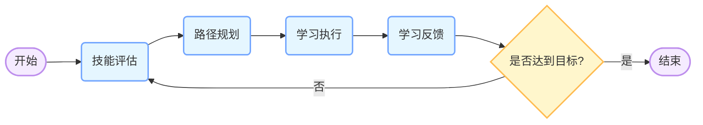

# 构建智能企业学习管理系统：个性化技能发展路径规划

> 关键词：智能企业学习管理系统、个性化技能发展路径、机器学习、数据驱动、人才培养

> 摘要：本文聚焦于构建智能企业学习管理系统以实现个性化技能发展路径规划。详细介绍了该系统的背景、核心概念、算法原理、数学模型，通过项目实战展示其代码实现与解读，分析了实际应用场景，并推荐了相关工具和资源。最后总结了系统未来发展趋势与挑战，为企业利用科技手段提升员工技能、实现人才培养目标提供了全面且深入的技术指导。

## 1. 背景介绍 
### 1.1 目的和范围
在当今竞争激烈的商业环境中，企业的成功越来越依赖于员工的技能和能力。传统的企业学习管理系统往往采用一刀切的培训方式，无法满足员工的个性化需求。本文章的目的在于阐述如何构建一个智能企业学习管理系统，该系统能够根据员工的个人技能水平、职业目标和学习偏好，为其规划个性化的技能发展路径。本系统的范围涵盖了从员工技能评估、学习资源匹配到学习进度跟踪和反馈的整个学习管理流程。

### 1.2 预期读者
本文的预期读者包括企业的人力资源管理者、学习与发展专家、技术开发人员以及对企业学习管理系统和个性化教育感兴趣的研究人员。人力资源管理者可以从中了解如何利用技术手段提升员工培训的效果和效率；学习与发展专家可以获取关于个性化学习路径规划的思路和方法；技术开发人员可以参考系统的架构和算法实现；研究人员可以关注相关领域的最新发展动态。

### 1.3 文档结构概述
本文将按照以下结构进行组织：首先介绍核心概念与联系，包括智能企业学习管理系统和个性化技能发展路径的定义和相互关系；接着阐述核心算法原理和具体操作步骤，使用Python代码进行详细说明；然后介绍数学模型和公式，并通过举例进行讲解；之后通过项目实战展示系统的代码实现和详细解释；分析实际应用场景；推荐相关的工具和资源；总结系统的未来发展趋势与挑战；提供常见问题与解答；最后列出扩展阅读和参考资料。

### 1.4 术语表
#### 1.4.1 核心术语定义
- **智能企业学习管理系统（Intelligent Enterprise Learning Management System，IELMS）**：一种利用人工智能和机器学习技术，对企业员工的学习过程进行智能化管理的系统，能够根据员工的个人情况提供个性化的学习方案。
- **个性化技能发展路径（Personalized Skill Development Path，PSDP）**：根据员工的当前技能水平、职业目标和学习偏好，为其量身定制的一系列学习活动和技能提升计划。
- **技能评估（Skill Assessment）**：对员工的现有技能水平进行量化评估的过程，通常采用测试、问卷调查等方式。
- **学习资源（Learning Resources）**：用于员工学习的各种材料，包括在线课程、文档、视频等。
- **学习进度跟踪（Learning Progress Tracking）**：对员工的学习过程进行实时监控和记录，以便了解其学习进展和效果。

#### 1.4.2 相关概念解释
- **机器学习（Machine Learning）**：一门多领域交叉学科，涉及概率论、统计学、逼近论、凸分析、算法复杂度理论等多门学科。它专门研究计算机怎样模拟或实现人类的学习行为，以获取新的知识或技能，重新组织已有的知识结构使之不断改善自身的性能。在本系统中，机器学习用于分析员工的学习数据，预测其学习需求和学习效果。
- **数据驱动（Data-driven）**：指的是在决策和行动过程中，以数据为基础，通过对数据的分析和挖掘来获取有价值的信息，从而指导决策和行动。在本系统中，数据驱动用于根据员工的学习数据和行为模式，为其提供个性化的学习建议。

#### 1.4.3 缩略词列表
- IELMS：Intelligent Enterprise Learning Management System
- PSDP：Personalized Skill Development Path

## 2. 核心概念与联系 

### 智能企业学习管理系统的原理
智能企业学习管理系统的核心原理是利用人工智能和机器学习技术，对员工的学习数据进行分析和挖掘，从而实现个性化的学习管理。系统首先通过技能评估模块了解员工的现有技能水平，然后根据员工的职业目标和学习偏好，从学习资源库中筛选出适合的学习资源，并为员工制定个性化的学习计划。在员工学习过程中，系统实时跟踪学习进度，根据学习效果动态调整学习计划，以确保员工能够高效地提升自己的技能。

### 个性化技能发展路径的架构
个性化技能发展路径的架构主要包括三个部分：技能评估、路径规划和学习执行与反馈。技能评估是基础，通过多种方式对员工的技能进行全面评估；路径规划根据评估结果和员工的职业目标，为其生成个性化的技能发展路径；学习执行与反馈则是员工按照规划的路径进行学习，并将学习过程中的数据反馈给系统，以便系统进行调整和优化。

以下是其Mermaid流程图：


### 两者的联系
智能企业学习管理系统是实现个性化技能发展路径规划的平台，而个性化技能发展路径是智能企业学习管理系统的核心应用。系统通过收集和分析员工的学习数据，为个性化技能发展路径的规划提供依据；同时，个性化技能发展路径的实施效果又可以反馈给系统，促进系统的不断优化和完善。

## 3. 核心算法原理 & 具体操作步骤 

### 技能评估算法
技能评估是个性化技能发展路径规划的基础，常用的算法有基于机器学习的分类算法，如决策树、支持向量机等。以下是一个使用Python实现的简单决策树技能评估示例：

```python
import pandas as pd
from sklearn.tree import DecisionTreeClassifier
from sklearn.model_selection import train_test_split
from sklearn.metrics import accuracy_score

# 假设这是技能评估的数据集，包含特征和标签
data = {
    'feature1': [1, 2, 3, 4, 5],
    'feature2': [2, 4, 6, 8, 10],
    'label': [0, 0, 1, 1, 1]
}
df = pd.DataFrame(data)

# 分离特征和标签
X = df.drop('label', axis=1)
y = df['label']

# 划分训练集和测试集
X_train, X_test, y_train, y_test = train_test_split(X, y, test_size=0.2, random_state=42)

# 创建决策树分类器
clf = DecisionTreeClassifier()

# 训练模型
clf.fit(X_train, y_train)

# 预测
y_pred = clf.predict(X_test)

# 评估模型
accuracy = accuracy_score(y_test, y_pred)
print(f"技能评估模型的准确率: {accuracy}")
```

### 路径规划算法
路径规划算法的目标是根据员工的技能评估结果和职业目标，为其选择最优的学习路径。一种常见的方法是使用图算法，如Dijkstra算法。以下是一个简化的基于图的路径规划Python示例：

```python
import heapq

# 定义图
graph = {
    'A': {'B': 1, 'C': 4},
    'B': {'C': 2, 'D': 5},
    'C': {'D': 1},
    'D': {}
}

def dijkstra(graph, start, end):
    distances = {node: float('inf') for node in graph}
    distances[start] = 0
    priority_queue = [(0, start)]
    previous_nodes = {node: None for node in graph}

    while priority_queue:
        current_distance, current_node = heapq.heappop(priority_queue)

        if current_node == end:
            path = []
            while current_node is not None:
                path.append(current_node)
                current_node = previous_nodes[current_node]
            path.reverse()
            return path, distances[end]

        if current_distance > distances[current_node]:
            continue

        for neighbor, weight in graph[current_node].items():
            distance = current_distance + weight

            if distance < distances[neighbor]:
                distances[neighbor] = distance
                previous_nodes[neighbor] = current_node
                heapq.heappush(priority_queue, (distance, neighbor))

    return None, None

# 示例使用
start_node = 'A'
end_node = 'D'
path, distance = dijkstra(graph, start_node, end_node)
if path:
    print(f"最短路径: {' -> '.join(path)}, 距离: {distance}")
else:
    print("未找到路径")
```

### 具体操作步骤
1. **数据收集**：收集员工的基本信息、技能评估数据、职业目标等。
2. **技能评估**：使用上述技能评估算法对员工的技能进行评估。
3. **路径规划**：根据技能评估结果和职业目标，使用路径规划算法为员工生成个性化的技能发展路径。
4. **学习资源匹配**：根据规划的路径，从学习资源库中筛选出适合的学习资源。
5. **学习跟踪与反馈**：在员工学习过程中，实时跟踪学习进度，根据学习效果调整学习计划。

## 4. 数学模型和公式 & 详细讲解 & 举例说明 

### 技能评估的数学模型
技能评估可以看作是一个分类问题，假设我们有 $n$ 个员工样本，每个样本有 $m$ 个特征 $x_{i1}, x_{i2}, \cdots, x_{im}$，对应的技能类别标签为 $y_i$，其中 $i = 1, 2, \cdots, n$。我们的目标是找到一个分类函数 $f(x)$，使得对于新的员工样本 $x$，能够准确预测其技能类别。

常见的分类算法如决策树，其核心思想是通过对特征空间进行划分，构建一棵决策树。在决策树的每个内部节点，根据某个特征的取值进行分支，直到到达叶子节点，叶子节点对应一个技能类别。

### 路径规划的数学模型
路径规划可以用图论的方法来描述。假设我们有一个图 $G = (V, E)$，其中 $V$ 是节点集合，代表技能点或学习阶段；$E$ 是边集合，代表技能之间的关联或学习的先后顺序。每条边 $(u, v) \in E$ 都有一个权重 $w(u, v)$，代表从技能 $u$ 到技能 $v$ 的学习成本。

我们的目标是找到从起始技能点 $s$ 到目标技能点 $t$ 的最短路径，即最小化路径上所有边的权重之和。可以用以下公式表示：

$$
\min \sum_{(u, v) \in P} w(u, v)
$$

其中 $P$ 是从 $s$ 到 $t$ 的路径。

### 举例说明
假设我们有一个简单的技能图，包含三个技能点：初级编程、中级编程和高级编程，分别用节点 $A$、$B$、$C$ 表示。边的权重表示学习成本，如下所示：

- 从初级编程到中级编程的学习成本为 2。
- 从初级编程到高级编程的学习成本为 5。
- 从中级编程到高级编程的学习成本为 1。

用图表示为：

$$
\begin{matrix}
& A & B & C \\
A & 0 & 2 & 5 \\
B & \infty & 0 & 1 \\
C & \infty & \infty & 0
\end{matrix}
$$

如果员工的起始技能是初级编程（节点 $A$），目标技能是高级编程（节点 $C$），我们可以使用 Dijkstra 算法找到最短路径。根据算法计算，最短路径为 $A \rightarrow B \rightarrow C$，总学习成本为 $2 + 1 = 3$。

## 5. 项目实战：代码实际案例和详细解释说明 

### 5.1  开发环境搭建
#### 系统环境
建议使用 Linux 或 macOS 操作系统，Python 版本为 3.7 及以上。

#### 安装依赖库
使用以下命令安装所需的 Python 库：
```bash
pip install pandas scikit-learn
```

### 5.2  源代码详细实现和代码解读
以下是一个简单的智能企业学习管理系统的代码实现：

```python
import pandas as pd
from sklearn.tree import DecisionTreeClassifier
from collections import defaultdict
import heapq

# 技能评估模块
def skill_assessment(data):
    X = data.drop('label', axis=1)
    y = data['label']
    clf = DecisionTreeClassifier()
    clf.fit(X, y)
    return clf

# 路径规划模块
def path_planning(graph, start, end):
    distances = {node: float('inf') for node in graph}
    distances[start] = 0
    priority_queue = [(0, start)]
    previous_nodes = {node: None for node in graph}

    while priority_queue:
        current_distance, current_node = heapq.heappop(priority_queue)

        if current_node == end:
            path = []
            while current_node is not None:
                path.append(current_node)
                current_node = previous_nodes[current_node]
            path.reverse()
            return path, distances[end]

        if current_distance > distances[current_node]:
            continue

        for neighbor, weight in graph[current_node].items():
            distance = current_distance + weight

            if distance < distances[neighbor]:
                distances[neighbor] = distance
                previous_nodes[neighbor] = current_node
                heapq.heappush(priority_queue, (distance, neighbor))

    return None, None

# 主函数
def main():
    # 模拟技能评估数据
    data = {
        'feature1': [1, 2, 3, 4, 5],
        'feature2': [2, 4, 6, 8, 10],
        'label': [0, 0, 1, 1, 1]
    }
    df = pd.DataFrame(data)

    # 技能评估
    model = skill_assessment(df)

    # 模拟技能图
    graph = {
        'A': {'B': 1, 'C': 4},
        'B': {'C': 2, 'D': 5},
        'C': {'D': 1},
        'D': {}
    }

    # 路径规划
    start_node = 'A'
    end_node = 'D'
    path, distance = path_planning(graph, start_node, end_node)

    print("技能评估模型已训练")
    if path:
        print(f"最短路径: {' -> '.join(path)}, 距离: {distance}")
    else:
        print("未找到路径")

if __name__ == "__main__":
    main()
```

### 5.3  代码解读与分析
- **技能评估模块**：`skill_assessment` 函数接收一个包含特征和标签的 DataFrame，使用决策树分类器进行训练，并返回训练好的模型。
- **路径规划模块**：`path_planning` 函数实现了 Dijkstra 算法，用于在图中找到从起始节点到目标节点的最短路径。
- **主函数**：`main` 函数模拟了技能评估数据和技能图，调用技能评估模块和路径规划模块，并输出结果。

通过这个简单的示例，我们可以看到如何将技能评估和路径规划结合起来，实现一个基本的智能企业学习管理系统。

## 6. 实际应用场景 
### 新员工入职培训
对于新入职的员工，智能企业学习管理系统可以根据其专业背景和职业目标，为其制定个性化的入职培训计划。例如，对于一名新入职的软件开发工程师，系统可以评估其编程技能水平，然后为其规划从基础编程语言学习到项目实践的个性化发展路径，推荐适合的在线课程和学习资料。

### 员工技能提升
随着企业业务的发展和技术的更新换代，员工需要不断提升自己的技能。系统可以定期对员工的技能进行评估，发现技能短板，并为其提供针对性的学习建议。比如，一名市场营销人员发现市场数据分析技能不足，系统可以为其规划学习统计学、数据分析工具等相关技能的路径，并提供相应的学习资源。

### 职业发展规划
员工在企业中有着不同的职业发展目标，系统可以根据员工的职业目标，为其规划长期的技能发展路径。例如，一名员工希望从基层技术岗位晋升到技术管理岗位，系统可以为其规划从技术能力提升到管理技能培养的学习路径，包括项目管理、团队协作等方面的学习内容。

## 7. 工具和资源推荐
### 7.1 学习资源推荐
#### 7.1.1 书籍推荐
- 《机器学习》（周志华）：全面介绍了机器学习的基本概念、算法和应用，是机器学习领域的经典教材。
- 《Python 数据分析实战》（Sebastian Raschka）：详细介绍了使用 Python 进行数据分析的方法和技巧，适合初学者入门。
- 《图论及其应用》（邦迪）：系统阐述了图论的基本理论和方法，对于理解路径规划算法有很大帮助。

#### 7.1.2 在线课程
- Coursera 上的“机器学习”课程：由斯坦福大学教授 Andrew Ng 授课，是全球最受欢迎的机器学习课程之一。
- edX 上的“Python 数据科学导论”课程：提供了丰富的实践案例，帮助学习者掌握 Python 在数据科学中的应用。
- Udemy 上的“人工智能与机器学习实战”课程：结合实际项目，介绍了人工智能和机器学习的应用场景和实现方法。

#### 7.1.3 技术博客和网站
- 博客园：国内知名的技术博客平台，有很多关于机器学习、数据分析等领域的技术文章。
- Medium：国外的技术博客平台，有很多优秀的技术文章和研究成果分享。
- Kaggle：全球最大的数据科学社区，提供了丰富的数据集和竞赛项目，适合学习者进行实践和交流。

### 7.2 开发工具框架推荐
#### 7.2.1 IDE和编辑器
- PyCharm：一款专业的 Python 集成开发环境，提供了丰富的代码编辑、调试和测试功能。
- Jupyter Notebook：一种交互式的开发环境，适合进行数据分析和机器学习实验。
- Visual Studio Code：一款轻量级的代码编辑器，支持多种编程语言和插件扩展。

#### 7.2.2 调试和性能分析工具
- PDB：Python 自带的调试工具，用于调试 Python 代码。
- cProfile：Python 标准库中的性能分析工具，用于分析代码的运行时间和性能瓶颈。
- TensorBoard：TensorFlow 提供的可视化工具，用于可视化机器学习模型的训练过程和性能指标。

#### 7.2.3 相关框架和库
- Scikit-learn：一个简单易用的机器学习库，提供了丰富的机器学习算法和工具。
- Pandas：一个强大的数据处理和分析库，用于数据清洗、转换和分析。
- NetworkX：一个用于创建、操作和研究复杂网络的 Python 库，适合实现图算法。

### 7.3 相关论文著作推荐
#### 7.3.1 经典论文
- “A Decision-Theoretic Generalization of On-Line Learning and an Application to Boosting”（Yoav Freund, Robert E. Schapire）：介绍了 AdaBoost 算法，是机器学习领域的经典论文之一。
- “Dijkstra's Algorithm”（Edsger W. Dijkstra）：提出了 Dijkstra 算法，是图论中的经典算法。
- “The Elements of Statistical Learning: Data Mining, Inference, and Prediction”（Trevor Hastie, Robert Tibshirani, Jerome Friedman）：是统计学习领域的经典著作，系统介绍了统计学习的理论和方法。

#### 7.3.2 最新研究成果
- 关注顶级学术会议如 NIPS（Neural Information Processing Systems）、ICML（International Conference on Machine Learning）上的最新研究成果，了解机器学习和人工智能领域的前沿技术。
- 查阅相关学术期刊如《Journal of Machine Learning Research》、《Artificial Intelligence》上的研究论文，获取最新的理论和方法。

#### 7.3.3 应用案例分析
- 研究一些知名企业在智能学习管理系统方面的应用案例，如谷歌、微软等公司如何利用技术提升员工的技能和绩效。
- 分析行业报告和案例研究，了解智能企业学习管理系统在不同行业的应用情况和效果。

## 8. 总结：未来发展趋势与挑战
### 未来发展趋势
- **智能化程度不断提高**：随着人工智能技术的不断发展，智能企业学习管理系统将具备更强的智能决策能力，能够更准确地预测员工的学习需求和学习效果，提供更加个性化的学习方案。
- **与虚拟现实和增强现实技术结合**：虚拟现实和增强现实技术可以为员工提供更加沉浸式的学习体验，未来智能企业学习管理系统可能会与这些技术相结合，开发出更加生动、有趣的学习内容。
- **跨企业和跨行业的学习平台**：未来可能会出现跨企业和跨行业的学习平台，员工可以在平台上与不同企业和行业的人员进行交流和学习，拓宽自己的视野和技能。

### 挑战
- **数据隐私和安全问题**：智能企业学习管理系统需要收集和分析大量的员工数据，如何保障数据的隐私和安全是一个重要的挑战。企业需要采取有效的数据加密、访问控制等措施，防止数据泄露和滥用。
- **技术集成和兼容性问题**：系统需要集成多种技术，如机器学习、大数据分析、云计算等，如何确保这些技术的兼容性和协同工作是一个挑战。企业需要选择合适的技术架构和开发工具，确保系统的稳定性和可靠性。
- **员工接受度问题**：员工可能对新的学习管理系统存在抵触情绪，如何提高员工的接受度和参与度是一个挑战。企业需要加强对员工的培训和宣传，让员工了解系统的优势和价值，提高员工的使用积极性。

## 9. 附录：常见问题与解答
### 1. 如何确保技能评估的准确性？
技能评估的准确性可以通过多种方式来提高。首先，选择合适的评估方法和工具，如使用多种评估指标和多种测试方式。其次，不断更新和优化评估模型，根据新的数据和反馈进行调整。此外，还可以结合员工的实际工作表现进行综合评估。

### 2. 路径规划是否可以动态调整？
是的，路径规划可以根据员工的学习进度和学习效果进行动态调整。在员工学习过程中，系统实时跟踪学习数据，当发现员工的学习进度与预期不符或学习效果不佳时，系统可以重新评估员工的技能水平，调整学习路径和学习资源。

### 3. 系统如何保证学习资源的质量？
系统可以通过多种方式保证学习资源的质量。一方面，建立严格的学习资源审核机制，对上传的学习资源进行审核和筛选，确保资源的准确性和实用性。另一方面，收集员工对学习资源的反馈，根据反馈对学习资源进行优化和更新。

## 10. 扩展阅读 & 参考资料
### 扩展阅读
- 《人工智能：现代方法》（Stuart Russell, Peter Norvig）：全面介绍了人工智能的基本概念、算法和应用，是人工智能领域的经典教材。
- 《数据挖掘：概念与技术》（Jiawei Han, Micheline Kamber, Jian Pei）：详细介绍了数据挖掘的基本概念、算法和应用，适合对数据挖掘感兴趣的读者。
- 《智能学习系统设计》（Donald H. Jonassen）：介绍了智能学习系统的设计原则和方法，对于开发智能企业学习管理系统有一定的参考价值。

### 参考资料
- 相关的学术论文和研究报告，如在 IEEE Xplore、ACM Digital Library 等数据库中搜索关于智能企业学习管理系统和个性化学习的论文。
- 企业学习管理系统的相关标准和规范，如 SCORM（Sharable Content Object Reference Model）标准，用于规范学习资源的开发和管理。

作者：AI天才研究院/AI Genius Institute & 禅与计算机程序设计艺术 /Zen And The Art of Computer Programming