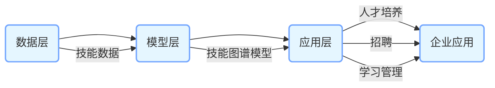

# 构建智能企业学习管理系统：技能图谱与个性化发展规划的融合

> 关键词：智能企业学习管理系统、技能图谱、个性化发展规划、知识管理、人才培养

> 摘要：本文聚焦于构建智能企业学习管理系统，探讨技能图谱与个性化发展规划的融合。通过深入分析技能图谱的构建原理、个性化发展规划的制定方法，以及两者融合的具体实现方式，旨在为企业提供一种高效、精准的学习管理解决方案，促进员工技能提升和企业人才培养。文章详细阐述了相关核心概念、算法原理、数学模型，并结合实际项目案例进行说明，同时介绍了实际应用场景、工具和资源推荐，最后对未来发展趋势与挑战进行了总结。

## 1. 背景介绍 
### 1.1 目的和范围
在当今快速发展的商业环境中，企业面临着不断提升员工技能和竞争力的挑战。智能企业学习管理系统作为一种重要的工具，可以帮助企业更有效地管理员工学习，提高学习效率和效果。本文的目的是探讨如何将技能图谱与个性化发展规划相融合，构建一个更加智能、高效的企业学习管理系统。

文章的范围涵盖了技能图谱的构建、个性化发展规划的制定、两者的融合实现，以及相关的算法原理、数学模型和实际应用案例。同时，还将介绍相关的工具和资源，为企业实施智能学习管理系统提供参考。

### 1.2 预期读者
本文的预期读者包括企业人力资源管理人员、学习与发展专家、技术研发人员以及对智能企业学习管理系统感兴趣的相关人士。对于人力资源管理人员和学习与发展专家，本文可以提供一种新的思路和方法，帮助他们更好地规划和管理员工学习；对于技术研发人员，本文可以为他们提供技术实现的参考和指导。

### 1.3 文档结构概述
本文将按照以下结构进行组织：
1. **背景介绍**：介绍文章的目的、范围、预期读者和文档结构概述。
2. **核心概念与联系**：详细解释技能图谱、个性化发展规划等核心概念，并阐述它们之间的联系。
3. **核心算法原理 & 具体操作步骤**：介绍构建技能图谱和制定个性化发展规划的核心算法原理，并给出具体的操作步骤。
4. **数学模型和公式 & 详细讲解 & 举例说明**：建立相关的数学模型和公式，对其进行详细讲解，并通过具体例子进行说明。
5. **项目实战：代码实际案例和详细解释说明**：结合实际项目案例，给出代码实现和详细的解释说明。
6. **实际应用场景**：介绍技能图谱与个性化发展规划融合在企业中的实际应用场景。
7. **工具和资源推荐**：推荐相关的学习资源、开发工具框架和论文著作。
8. **总结：未来发展趋势与挑战**：总结文章的主要内容，分析未来发展趋势和面临的挑战。
9. **附录：常见问题与解答**：列出常见问题并给出解答。
10. **扩展阅读 & 参考资料**：提供扩展阅读的建议和参考资料。

### 1.4 术语表
#### 1.4.1 核心术语定义
- **智能企业学习管理系统**：利用人工智能技术，实现对企业员工学习过程的智能化管理，包括学习资源推荐、学习进度跟踪、学习效果评估等功能。
- **技能图谱**：一种将企业所需的各种技能及其相互关系进行可视化表示的知识图谱，用于描述员工技能水平和企业技能需求。
- **个性化发展规划**：根据员工的个人特点、职业目标和技能水平，为其制定的个性化学习和发展计划。

#### 1.4.2 相关概念解释
- **知识图谱**：一种语义网络，用于表示实体之间的关系和知识。技能图谱是知识图谱在企业技能管理领域的应用。
- **人工智能**：研究如何使计算机模拟人类智能的学科，包括机器学习、自然语言处理、计算机视觉等技术。在智能企业学习管理系统中，人工智能技术可以用于实现学习资源推荐、技能评估等功能。

#### 1.4.3 缩略词列表
- **LMS**：Learning Management System，学习管理系统
- **AI**：Artificial Intelligence，人工智能
- **ML**：Machine Learning，机器学习

## 2. 核心概念与联系 
### 2.1 技能图谱
技能图谱是一种将企业所需的各种技能及其相互关系进行可视化表示的知识图谱。它以技能为节点，以技能之间的关联关系为边，构建一个复杂的网络结构。技能图谱可以帮助企业清晰地了解自身的技能需求，以及员工的技能水平分布，为企业的人才培养和招聘提供有力支持。

#### 2.1.1 技能图谱的构建原理
技能图谱的构建主要包括以下几个步骤：
1. **技能提取**：从企业的岗位说明书、项目文档、培训资料等数据源中提取与技能相关的信息。
2. **技能分类**：将提取的技能进行分类，形成技能体系。例如，可以将技能分为专业技能、通用技能、管理技能等类别。
3. **技能关联**：分析技能之间的关联关系，例如前置技能、后置技能、相关技能等。通过建立技能之间的关联关系，可以更好地描述技能的学习路径和发展方向。
4. **图谱构建**：将技能和技能关联关系以图形化的方式表示出来，形成技能图谱。

#### 2.1.2 技能图谱的架构
技能图谱的架构可以分为数据层、模型层和应用层三个层次，如图 1 所示。


**图 1：技能图谱架构**

- **数据层**：主要负责收集和存储与技能相关的数据，包括技能名称、技能描述、技能分类、技能关联关系等。
- **模型层**：基于数据层的数据，构建技能图谱模型。模型层可以采用图数据库、知识图谱框架等技术实现。
- **应用层**：将技能图谱模型应用于企业的人才培养、招聘、学习管理等业务场景中。

### 2.2 个性化发展规划
个性化发展规划是根据员工的个人特点、职业目标和技能水平，为其制定的个性化学习和发展计划。个性化发展规划可以帮助员工明确自己的职业发展方向，提高学习的针对性和有效性，同时也可以满足企业对人才的需求。

#### 2.2.1 个性化发展规划的制定方法
个性化发展规划的制定主要包括以下几个步骤：
1. **员工信息收集**：收集员工的个人信息、职业目标、技能水平等信息。可以通过问卷调查、面试、技能评估等方式进行收集。
2. **职业目标设定**：根据员工的个人兴趣、能力和企业的发展需求，帮助员工设定合理的职业目标。
3. **技能差距分析**：对比员工当前的技能水平和职业目标所需的技能水平，找出技能差距。
4. **学习计划制定**：根据技能差距，为员工制定个性化的学习计划，包括学习内容、学习方式、学习时间等。
5. **计划实施与跟踪**：帮助员工实施学习计划，并定期跟踪学习进度和效果，根据实际情况进行调整。

#### 2.2.2 个性化发展规划的架构
个性化发展规划的架构可以分为员工信息管理、职业目标设定、技能差距分析、学习计划制定和计划实施与跟踪五个模块，如图 2 所示。


**图 2：个性化发展规划架构**

### 2.3 技能图谱与个性化发展规划的联系
技能图谱与个性化发展规划之间存在着密切的联系。技能图谱为个性化发展规划提供了基础数据和知识支持，而个性化发展规划则是技能图谱在员工发展领域的具体应用。具体来说，技能图谱与个性化发展规划的联系主要体现在以下几个方面：
1. **技能评估**：技能图谱可以为员工的技能评估提供标准和参考。通过将员工的技能水平与技能图谱中的技能节点进行匹配，可以准确地评估员工的技能水平。
2. **职业目标设定**：技能图谱可以帮助员工了解不同职业岗位所需的技能要求，从而为员工设定合理的职业目标提供参考。
3. **技能差距分析**：技能图谱可以清晰地展示职业目标所需的技能体系，通过对比员工当前的技能水平和职业目标所需的技能水平，可以准确地找出技能差距。
4. **学习计划制定**：根据技能差距和技能图谱中的技能关联关系，可以为员工制定个性化的学习计划，确保学习的针对性和有效性。

## 3. 核心算法原理 & 具体操作步骤 
### 3.1 技能图谱构建算法原理及步骤
#### 3.1.1 技能提取算法
技能提取可以采用自然语言处理技术，例如命名实体识别（NER）算法。命名实体识别是指从文本中识别出特定类型的实体，如人名、地名、组织名、技能名等。以下是一个使用 Python 和 SpaCy 库实现的简单命名实体识别示例代码：

```python
import spacy

# 加载英文语言模型
nlp = spacy.load("en_core_web_sm")

# 待处理的文本
text = "John has skills in Python programming, data analysis, and machine learning."

# 对文本进行处理
doc = nlp(text)

# 提取技能实体
skills = []
for ent in doc.ents:
    if ent.label_ == "SKILL":  # 假设自定义了 SKILL 标签
        skills.append(ent.text)

print("提取的技能：", skills)
```

#### 3.1.2 技能分类算法
技能分类可以采用聚类算法，例如 K-Means 算法。K-Means 算法是一种无监督学习算法，用于将数据点划分为 K 个不同的簇。以下是一个使用 Python 和 Scikit-learn 库实现的简单 K-Means 聚类示例代码：

```python
from sklearn.cluster import KMeans
import numpy as np

# 假设技能特征向量
skills_features = np.array([[1, 2], [2, 3], [4, 5], [5, 6]])

# 初始化 K-Means 模型，设置簇的数量为 2
kmeans = KMeans(n_clusters=2, random_state=0).fit(skills_features)

# 获取每个技能的簇标签
labels = kmeans.labels_

print("技能分类标签：", labels)
```

#### 3.1.3 技能关联算法
技能关联可以采用关联规则挖掘算法，例如 Apriori 算法。Apriori 算法是一种经典的关联规则挖掘算法，用于发现数据集中的频繁项集和关联规则。以下是一个使用 Python 和 mlxtend 库实现的简单 Apriori 算法示例代码：

```python
from mlxtend.preprocessing import TransactionEncoder
from mlxtend.frequent_patterns import apriori, association_rules
import pandas as pd

# 假设技能交易数据
transactions = [['Python', 'Data Analysis'], ['Python', 'Machine Learning'], ['Data Analysis', 'Machine Learning']]

# 数据编码
te = TransactionEncoder()
te_ary = te.fit(transactions).transform(transactions)
df = pd.DataFrame(te_ary, columns=te.columns_)

# 挖掘频繁项集
frequent_itemsets = apriori(df, min_support=0.5, use_colnames=True)

# 生成关联规则
rules = association_rules(frequent_itemsets, metric="confidence", min_threshold=0.7)

print("关联规则：", rules)
```

### 3.2 个性化发展规划制定算法原理及步骤
#### 3.2.1 员工技能评估算法
员工技能评估可以采用多指标综合评估算法，例如层次分析法（AHP）。层次分析法是一种将定性和定量分析相结合的决策方法，用于确定各指标的权重和综合得分。以下是一个使用 Python 和 PyAHP 库实现的简单层次分析法示例代码：

```python
from pyahp import AhpModel

# 构建层次结构
criteria = {
    '技能知识': {'理论知识': 0.6, '实践经验': 0.4},
    '技能应用能力': {'问题解决能力': 0.5, '创新能力': 0.5}
}

# 定义判断矩阵
comparisons = {
    '技能知识': [
        [1, 3],
        [1/3, 1]
    ],
    '技能应用能力': [
        [1, 1],
        [1, 1]
    ]
}

# 创建 AHP 模型
ahp = AhpModel(criteria, comparisons)

# 计算权重
weights = ahp.get_weights()

print("技能评估权重：", weights)
```

#### 3.2.2 技能差距分析算法
技能差距分析可以通过计算员工当前技能水平与职业目标所需技能水平之间的差值来实现。以下是一个简单的技能差距分析示例代码：

```python
# 员工当前技能水平
current_skills = [3, 4, 2]

# 职业目标所需技能水平
target_skills = [5, 5, 3]

# 计算技能差距
skill_gaps = [target - current for target, current in zip(target_skills, current_skills)]

print("技能差距：", skill_gaps)
```

#### 3.2.3 学习计划制定算法
学习计划制定可以采用贪心算法，根据技能差距和技能关联关系，优先选择能够快速弥补技能差距的学习资源。以下是一个简单的学习计划制定示例代码：

```python
# 技能差距
skill_gaps = [2, 1, 1]

# 学习资源与技能的关联关系
learning_resources = {
    'Resource1': [1, 0, 0],
    'Resource2': [0, 1, 0],
    'Resource3': [0, 0, 1]
}

# 制定学习计划
learning_plan = []
while any(skill_gaps):
    best_resource = None
    best_improvement = 0
    for resource, skills in learning_resources.items():
        improvement = sum([min(gap, skill) for gap, skill in zip(skill_gaps, skills)])
        if improvement > best_improvement:
            best_improvement = improvement
            best_resource = resource
    if best_resource:
        learning_plan.append(best_resource)
        for i in range(len(skill_gaps)):
            skill_gaps[i] = max(0, skill_gaps[i] - learning_resources[best_resource][i])

print("学习计划：", learning_plan)
```

## 4. 数学模型和公式 & 详细讲解 & 举例说明 
### 4.1 技能图谱构建的数学模型
#### 4.1.1 技能提取的数学模型
技能提取可以看作是一个文本分类问题，将文本中的每个词分类为技能词或非技能词。假设文本 $T = \{w_1, w_2, \cdots, w_n\}$ 由 $n$ 个词组成，每个词 $w_i$ 有一个特征向量 $\mathbf{x}_i$，技能词的标签为 $y_i = 1$，非技能词的标签为 $y_i = 0$。可以使用逻辑回归模型进行分类，逻辑回归模型的公式如下：

$$P(y_i = 1|\mathbf{x}_i) = \frac{1}{1 + e^{-\mathbf{w}^T\mathbf{x}_i}}$$

其中，$\mathbf{w}$ 是模型的参数向量。通过最大化似然函数来估计参数 $\mathbf{w}$：

$$L(\mathbf{w}) = \prod_{i=1}^{n} P(y_i|\mathbf{x}_i)^{y_i}(1 - P(y_i|\mathbf{x}_i))^{1 - y_i}$$

#### 4.1.2 技能分类的数学模型
技能分类可以使用 K-Means 算法，K-Means 算法的目标是最小化每个数据点到其所属簇中心的距离之和。假设数据集 $X = \{\mathbf{x}_1, \mathbf{x}_2, \cdots, \mathbf{x}_m\}$ 由 $m$ 个技能特征向量组成，将其划分为 $K$ 个簇 $C = \{C_1, C_2, \cdots, C_K\}$，每个簇的中心为 $\mathbf{\mu}_k$。K-Means 算法的目标函数如下：

$$J = \sum_{k=1}^{K} \sum_{\mathbf{x}_i \in C_k} ||\mathbf{x}_i - \mathbf{\mu}_k||^2$$

通过迭代更新簇中心和数据点的簇分配，直到目标函数收敛。

#### 4.1.3 技能关联的数学模型
技能关联可以使用 Apriori 算法，Apriori 算法的核心是挖掘频繁项集和关联规则。频繁项集是指在数据集中出现频率大于等于最小支持度阈值的项集。支持度（Support）的计算公式如下：

$$\text{Support}(X) = \frac{\text{Count}(X)}{N}$$

其中，$\text{Count}(X)$ 是项集 $X$ 在数据集中出现的次数，$N$ 是数据集的总交易数。关联规则 $X \rightarrow Y$ 的置信度（Confidence）计算公式如下：

$$\text{Confidence}(X \rightarrow Y) = \frac{\text{Support}(X \cup Y)}{\text{Support}(X)}$$

### 4.2 个性化发展规划制定的数学模型
#### 4.2.1 员工技能评估的数学模型
员工技能评估可以使用层次分析法（AHP），层次分析法的核心是构建判断矩阵和计算权重。假设判断矩阵 $A = (a_{ij})_{n \times n}$，其中 $a_{ij}$ 表示第 $i$ 个指标相对于第 $j$ 个指标的重要性程度。判断矩阵需要满足 $a_{ij} > 0$，$a_{ji} = \frac{1}{a_{ij}}$，$a_{ii} = 1$。通过求解判断矩阵的最大特征值 $\lambda_{max}$ 和对应的特征向量 $\mathbf{w}$，并进行归一化处理，得到各指标的权重。

一致性指标（Consistency Index，CI）的计算公式如下：

$$CI = \frac{\lambda_{max} - n}{n - 1}$$

随机一致性比率（Consistency Ratio，CR）的计算公式如下：

$$CR = \frac{CI}{RI}$$

其中，$RI$ 是随机一致性指标，根据矩阵的阶数 $n$ 查表得到。当 $CR < 0.1$ 时，认为判断矩阵具有满意的一致性。

#### 4.2.2 技能差距分析的数学模型
技能差距分析可以通过计算员工当前技能水平向量 $\mathbf{s}_c$ 和职业目标所需技能水平向量 $\mathbf{s}_t$ 之间的欧几里得距离来实现，欧几里得距离的计算公式如下：

$$d(\mathbf{s}_c, \mathbf{s}_t) = \sqrt{\sum_{i=1}^{m} (s_{c_i} - s_{t_i})^2}$$

其中，$m$ 是技能的数量，$s_{c_i}$ 和 $s_{t_i}$ 分别是员工当前技能水平和职业目标所需技能水平的第 $i$ 个技能维度的值。

#### 4.2.3 学习计划制定的数学模型
学习计划制定可以使用贪心算法，贪心算法的目标是在每一步选择能够最大程度减少技能差距的学习资源。假设学习资源集合为 $R = \{r_1, r_2, \cdots, r_p\}$，每个学习资源 $r_j$ 对应一个技能提升向量 $\mathbf{u}_j$，技能差距向量为 $\mathbf{g}$。在每一步选择学习资源 $r_j$ 时，计算其对技能差距的改善程度 $\Delta\mathbf{g}_j$：

$$\Delta\mathbf{g}_j = \sum_{i=1}^{m} \min(g_i, u_{j_i})$$

选择 $\Delta\mathbf{g}_j$ 最大的学习资源 $r_j$ 加入学习计划，并更新技能差距向量 $\mathbf{g}$。

### 4.3 举例说明
#### 4.3.1 技能图谱构建举例
假设企业有以下岗位说明书：
- 岗位 1：需要具备 Python 编程、数据处理、机器学习技能。
- 岗位 2：需要具备 Java 编程、数据库管理、系统架构设计技能。

通过技能提取算法，可以从岗位说明书中提取出技能：Python 编程、数据处理、机器学习、Java 编程、数据库管理、系统架构设计。然后使用技能分类算法，将这些技能分为编程语言技能（Python 编程、Java 编程）、数据处理技能（数据处理、数据库管理）和人工智能技能（机器学习、系统架构设计）。最后使用技能关联算法，发现 Python 编程和机器学习之间存在较强的关联关系，数据处理和数据库管理之间存在较强的关联关系。

#### 4.3.2 个性化发展规划制定举例
假设员工小李的当前技能水平为：Python 编程（3 分）、数据处理（2 分）、机器学习（1 分），职业目标是成为一名数据科学家，所需技能水平为：Python 编程（5 分）、数据处理（4 分）、机器学习（3 分）。通过技能差距分析算法，计算出小李的技能差距为：Python 编程（2 分）、数据处理（2 分）、机器学习（2 分）。然后根据学习资源与技能的关联关系，制定学习计划，优先选择能够快速弥补技能差距的学习资源，如 Python 编程在线课程、数据处理实战项目、机器学习教材等。

## 5. 项目实战：代码实际案例和详细解释说明 
### 5.1  开发环境搭建
#### 5.1.1 安装 Python
首先需要安装 Python 环境，建议使用 Python 3.7 及以上版本。可以从 Python 官方网站（https://www.python.org/downloads/） 下载并安装 Python。

#### 5.1.2 安装必要的库
在项目中需要使用一些 Python 库，如 SpaCy、Scikit-learn、mlxtend、PyAHP 等。可以使用以下命令进行安装：

```bash
pip install spacy
pip install scikit-learn
pip install mlxtend
pip install pyahp
```

#### 5.1.3 下载 SpaCy 语言模型
SpaCy 需要下载相应的语言模型，例如英文语言模型：

```bash
python -m spacy download en_core_web_sm
```

### 5.2  源代码详细实现和代码解读
#### 5.2.1 技能图谱构建代码实现
```python
import spacy
from sklearn.cluster import KMeans
from mlxtend.preprocessing import TransactionEncoder
from mlxtend.frequent_patterns import apriori, association_rules
import pandas as pd

# 技能提取
def extract_skills(text):
    nlp = spacy.load("en_core_web_sm")
    doc = nlp(text)
    skills = []
    for ent in doc.ents:
        if ent.label_ == "SKILL":  # 假设自定义了 SKILL 标签
            skills.append(ent.text)
    return skills

# 技能分类
def classify_skills(skills_features, n_clusters=2):
    kmeans = KMeans(n_clusters=n_clusters, random_state=0).fit(skills_features)
    labels = kmeans.labels_
    return labels

# 技能关联
def find_skill_associations(transactions):
    te = TransactionEncoder()
    te_ary = te.fit(transactions).transform(transactions)
    df = pd.DataFrame(te_ary, columns=te.columns_)
    frequent_itemsets = apriori(df, min_support=0.5, use_colnames=True)
    rules = association_rules(frequent_itemsets, metric="confidence", min_threshold=0.7)
    return rules

# 示例数据
text = "John has skills in Python programming, data analysis, and machine learning."
skills = extract_skills(text)
print("提取的技能：", skills)

skills_features = [[1, 2], [2, 3], [4, 5], [5, 6]]
labels = classify_skills(skills_features)
print("技能分类标签：", labels)

transactions = [['Python', 'Data Analysis'], ['Python', 'Machine Learning'], ['Data Analysis', 'Machine Learning']]
rules = find_skill_associations(transactions)
print("关联规则：", rules)
```

**代码解读**：
- `extract_skills` 函数使用 SpaCy 库进行技能提取，通过命名实体识别技术识别文本中的技能实体。
- `classify_skills` 函数使用 K-Means 算法进行技能分类，将技能特征向量划分为不同的簇。
- `find_skill_associations` 函数使用 Apriori 算法进行技能关联挖掘，发现技能之间的关联规则。

#### 5.2.2 个性化发展规划制定代码实现
```python
from pyahp import AhpModel
import numpy as np

# 员工技能评估
def evaluate_skills():
    criteria = {
        '技能知识': {'理论知识': 0.6, '实践经验': 0.4},
        '技能应用能力': {'问题解决能力': 0.5, '创新能力': 0.5}
    }
    comparisons = {
        '技能知识': [
            [1, 3],
            [1/3, 1]
        ],
        '技能应用能力': [
            [1, 1],
            [1, 1]
        ]
    }
    ahp = AhpModel(criteria, comparisons)
    weights = ahp.get_weights()
    return weights

# 技能差距分析
def analyze_skill_gaps(current_skills, target_skills):
    skill_gaps = [target - current for target, current in zip(target_skills, current_skills)]
    return skill_gaps

# 学习计划制定
def make_learning_plan(skill_gaps, learning_resources):
    learning_plan = []
    while any(skill_gaps):
        best_resource = None
        best_improvement = 0
        for resource, skills in learning_resources.items():
            improvement = sum([min(gap, skill) for gap, skill in zip(skill_gaps, skills)])
            if improvement > best_improvement:
                best_improvement = improvement
                best_resource = resource
        if best_resource:
            learning_plan.append(best_resource)
            for i in range(len(skill_gaps)):
                skill_gaps[i] = max(0, skill_gaps[i] - learning_resources[best_resource][i])
    return learning_plan

# 示例数据
weights = evaluate_skills()
print("技能评估权重：", weights)

current_skills = [3, 4, 2]
target_skills = [5, 5, 3]
skill_gaps = analyze_skill_gaps(current_skills, target_skills)
print("技能差距：", skill_gaps)

learning_resources = {
    'Resource1': [1, 0, 0],
    'Resource2': [0, 1, 0],
    'Resource3': [0, 0, 1]
}
learning_plan = make_learning_plan(skill_gaps, learning_resources)
print("学习计划：", learning_plan)
```

**代码解读**：
- `evaluate_skills` 函数使用层次分析法（AHP）进行员工技能评估，计算各技能指标的权重。
- `analyze_skill_gaps` 函数通过计算员工当前技能水平和职业目标所需技能水平之间的差值，进行技能差距分析。
- `make_learning_plan` 函数使用贪心算法，根据技能差距和学习资源与技能的关联关系，制定学习计划。

### 5.3  代码解读与分析
#### 5.3.1 技能图谱构建代码分析
技能图谱构建代码主要包括技能提取、技能分类和技能关联三个部分。技能提取部分使用 SpaCy 库进行命名实体识别，将文本中的技能实体提取出来。技能分类部分使用 K-Means 算法将技能特征向量划分为不同的簇，便于对技能进行分类管理。技能关联部分使用 Apriori 算法挖掘技能之间的关联规则，帮助企业了解技能之间的内在联系。

#### 5.3.2 个性化发展规划制定代码分析
个性化发展规划制定代码主要包括员工技能评估、技能差距分析和学习计划制定三个部分。员工技能评估部分使用层次分析法（AHP）计算各技能指标的权重，综合评估员工的技能水平。技能差距分析部分通过计算员工当前技能水平和职业目标所需技能水平之间的差值，找出技能差距。学习计划制定部分使用贪心算法，根据技能差距和学习资源与技能的关联关系，优先选择能够快速弥补技能差距的学习资源，制定个性化的学习计划。

## 6. 实际应用场景 
### 6.1 人才培养
技能图谱与个性化发展规划的融合可以帮助企业实现精准的人才培养。通过技能图谱，企业可以清晰地了解每个岗位所需的技能体系，根据员工的当前技能水平和职业目标，为其制定个性化的学习计划。员工可以按照学习计划有针对性地进行学习，提高学习效率和效果，快速提升自己的技能水平。同时，企业可以根据员工的学习进度和效果，及时调整学习计划，确保人才培养的质量。

### 6.2 招聘
在招聘过程中，技能图谱可以作为招聘的参考标准。企业可以根据岗位所需的技能要求，在技能图谱中筛选出符合条件的技能组合，然后在招聘信息中明确列出这些技能要求。招聘人员可以根据技能图谱对求职者的简历进行筛选和评估，快速找到符合岗位要求的人才。此外，技能图谱还可以帮助企业发现潜在的人才，为企业的人才储备提供支持。

### 6.3 学习管理
技能图谱与个性化发展规划的融合可以优化企业的学习管理流程。企业可以将技能图谱和个性化学习计划集成到学习管理系统（LMS）中，实现学习资源的智能推荐和学习进度的跟踪管理。员工可以在 LMS 中查看自己的学习计划和学习资源推荐，按照计划进行学习。同时，学习管理系统可以记录员工的学习行为和学习效果，为企业提供数据分析和决策支持。

### 6.4 职业发展规划
技能图谱可以为员工的职业发展规划提供指导。员工可以通过技能图谱了解不同职业岗位所需的技能要求，结合自己的兴趣和能力，设定合理的职业目标。然后，根据技能差距分析和个性化学习计划，有针对性地提升自己的技能水平，实现职业发展的目标。企业可以通过技能图谱和个性化发展规划，为员工提供职业发展的支持和帮助，提高员工的满意度和忠诚度。

## 7. 工具和资源推荐
### 7.1 学习资源推荐
#### 7.1.1 书籍推荐
- 《Python 数据分析实战》：介绍了使用 Python 进行数据分析的方法和技巧，对于掌握数据处理和分析技能有很大帮助。
- 《机器学习实战》：通过实际案例介绍了机器学习的基本算法和应用，适合初学者入门。
- 《知识图谱：方法、实践与应用》：系统介绍了知识图谱的理论和技术，对于理解技能图谱的构建原理有很大帮助。

#### 7.1.2 在线课程
- Coursera 上的“机器学习”课程：由斯坦福大学教授 Andrew Ng 授课，是机器学习领域的经典课程。
- edX 上的“数据科学微硕士项目”：提供了全面的数据科学知识和技能培训。
- Udemy 上的“Python 编程从入门到精通”课程：适合零基础学习 Python 编程。

#### 7.1.3 技术博客和网站
- Medium：上面有很多关于人工智能、机器学习、数据分析等领域的技术文章和经验分享。
- 机器之心：专注于人工智能领域的技术报道和分析，提供了很多前沿的技术资讯。
- 开源中国：国内知名的开源技术社区，有很多关于软件开发、数据处理等方面的技术文章和代码示例。

### 7.2 开发工具框架推荐
#### 7.2.1 IDE和编辑器
- PyCharm：一款专业的 Python 集成开发环境，提供了丰富的代码编辑、调试、测试等功能。
- Jupyter Notebook：一个交互式的开发环境，适合进行数据分析和机器学习实验。
- Visual Studio Code：一款轻量级的代码编辑器，支持多种编程语言，有丰富的插件扩展。

#### 7.2.2 调试和性能分析工具
- Py-Spy：一个用于分析 Python 程序性能的工具，可以帮助开发者找出程序中的性能瓶颈。
- PDB：Python 自带的调试器，可以帮助开发者调试 Python 代码。
- Profiler：Python 标准库中的性能分析工具，可以对 Python 程序进行性能分析。

#### 7.2.3 相关框架和库
- SpaCy：一个用于自然语言处理的 Python 库，提供了高效的命名实体识别、词性标注等功能。
- Scikit-learn：一个用于机器学习的 Python 库，提供了丰富的机器学习算法和工具。
- Neo4j：一个图数据库，适合用于存储和管理技能图谱数据。

### 7.3 相关论文著作推荐
#### 7.3.1 经典论文
- 《A Mathematical Theory of Communication》：信息论的经典论文，为数据处理和分析提供了理论基础。
- 《The Elements of Statistical Learning》：机器学习领域的经典教材，系统介绍了机器学习的基本理论和算法。
- 《Knowledge Graph Embedding: A Survey of Approaches and Applications》：对知识图谱嵌入技术进行了全面的综述，对于理解技能图谱的表示和应用有很大帮助。

#### 7.3.2 最新研究成果
- 关注顶级学术会议，如 ACL（计算语言学协会年会）、ICML（国际机器学习会议）、KDD（知识发现与数据挖掘会议）等，这些会议上会发表很多关于人工智能、机器学习、知识图谱等领域的最新研究成果。
- 查阅知名学术期刊，如 Journal of Artificial Intelligence Research（JAIR）、Artificial Intelligence（AI）等，这些期刊上会刊登很多高质量的研究论文。

#### 7.3.3 应用案例分析
- 可以参考一些企业的实际应用案例，如 Google、Microsoft 等公司在人才培养、学习管理等方面的实践经验。这些案例可以帮助我们更好地理解技能图谱与个性化发展规划的融合在实际应用中的效果和挑战。

## 8. 总结：未来发展趋势与挑战
### 8.1 未来发展趋势
#### 8.1.1 智能化程度不断提高
随着人工智能技术的不断发展，智能企业学习管理系统的智能化程度将不断提高。例如，系统可以通过深度学习算法自动识别员工的学习风格和偏好，为其提供更加个性化的学习资源推荐；可以通过自然语言处理技术实现智能问答和对话式学习，提高学习的交互性和效率。

#### 8.1.2 与企业业务深度融合
技能图谱与个性化发展规划将与企业的业务更加紧密地融合。企业可以根据业务需求实时调整技能图谱和个性化学习计划，确保员工的技能提升与企业的业务发展同步。同时，系统可以与企业的其他业务系统，如人力资源管理系统、项目管理系统等进行集成，实现数据的共享和协同工作。

#### 8.1.3 跨组织和跨行业应用
未来，技能图谱与个性化发展规划的应用将不再局限于单个企业，而是会拓展到跨组织和跨行业的层面。例如，不同企业之间可以共享技能图谱和学习资源，实现人才的流动和合作；行业协会可以建立行业通用的技能图谱，为行业内的企业提供人才培养和招聘的参考标准。

### 8.2 面临的挑战
#### 8.2.1 数据质量和安全问题
技能图谱和个性化发展规划的构建需要大量的高质量数据支持。然而，企业内部的数据往往存在数据质量不高、数据不一致等问题，需要进行数据清洗和整合。同时，员工的个人信息和学习数据涉及到隐私和安全问题，需要采取有效的数据安全措施，确保数据的保密性、完整性和可用性。

#### 8.2.2 技术复杂度和成本问题
构建智能企业学习管理系统需要掌握多种技术，如人工智能、自然语言处理、知识图谱等，技术复杂度较高。同时，系统的开发、维护和升级需要投入大量的人力、物力和财力，成本较高。因此，企业需要在技术选型和成本控制方面进行权衡和决策。

#### 8.2.3 员工接受度和参与度问题
员工是智能企业学习管理系统的最终使用者，他们的接受度和参与度直接影响系统的实施效果。一些员工可能对新的学习方式和管理模式存在抵触情绪，不愿意参与到系统的使用中来。因此，企业需要加强对员工的培训和宣传，提高员工的认知和接受度，鼓励员工积极参与到学习和发展中来。

## 9. 附录：常见问题与解答
### 9.1 技能图谱构建过程中如何确定技能之间的关联关系？
技能之间的关联关系可以通过多种方式确定，例如：
- **基于业务逻辑**：根据企业的业务流程和岗位要求，分析技能之间的前置、后置和相关关系。
- **基于数据挖掘**：使用关联规则挖掘算法，如 Apriori 算法，从大量的历史数据中挖掘技能之间的关联规则。
- **专家经验**：邀请企业内部的专家和经验丰富的员工，根据他们的经验和知识确定技能之间的关联关系。

### 9.2 个性化发展规划如何考虑员工的兴趣和意愿？
在制定个性化发展规划时，可以通过以下方式考虑员工的兴趣和意愿：
- **问卷调查**：设计专门的问卷调查，了解员工的兴趣爱好、职业目标和发展意愿。
- **面谈沟通**：与员工进行面对面的沟通，深入了解他们的想法和需求。
- **兴趣测试**：使用专业的兴趣测试工具，帮助员工了解自己的兴趣倾向。

### 9.3 智能企业学习管理系统如何与企业现有的学习管理系统集成？
智能企业学习管理系统与企业现有的学习管理系统集成可以通过以下步骤实现：
- **数据接口开发**：开发数据接口，实现两个系统之间的数据传输和共享。
- **功能对接**：将智能企业学习管理系统的功能与现有学习管理系统的功能进行对接，实现业务流程的无缝衔接。
- **用户体验优化**：确保集成后的系统具有良好的用户体验，方便员工使用。

### 9.4 如何评估智能企业学习管理系统的实施效果？
可以从以下几个方面评估智能企业学习管理系统的实施效果：
- **学习效果评估**：通过考试、作业、项目实践等方式评估员工的学习效果，看是否达到了预期的学习目标。
- **员工满意度评估**：通过问卷调查、面谈等方式了解员工对系统的满意度，包括学习资源的质量、学习体验等方面。
- **业务绩效评估**：分析系统实施前后企业的业务绩效指标，如员工绩效、业务增长等，看是否有明显的提升。

## 10. 扩展阅读 & 参考资料
### 10.1 扩展阅读
- 《人工智能时代的学习革命》：探讨了人工智能技术对学习方式和教育模式的影响，为智能企业学习管理系统的发展提供了新的思路。
- 《人才管理的未来》：介绍了未来人才管理的趋势和挑战，对于理解技能图谱与个性化发展规划在人才管理中的应用有很大帮助。
- 《数字化转型：企业如何实现创新增长》：讲述了企业数字化转型的方法和实践，智能企业学习管理系统是企业数字化转型的重要组成部分。

### 10.2 参考资料
- [SpaCy 官方文档](https://spacy.io/usage)
- [Scikit-learn 官方文档](https://scikit-learn.org/stable/documentation.html)
- [mlxtend 官方文档](http://rasbt.github.io/mlxtend/)
- [PyAHP 官方文档](https://pyahp.readthedocs.io/en/latest/)
- [Neo4j 官方文档](https://neo4j.com/docs/)

作者：AI天才研究院/AI Genius Institute & 禅与计算机程序设计艺术 /Zen And The Art of Computer Programming