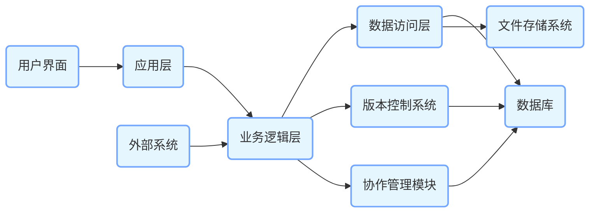

# 构建智能企业文档管理系统：版本控制与协作优化

> 关键词：智能企业文档管理系统、版本控制、协作优化、文档管理、企业信息化

> 摘要：本文聚焦于构建智能企业文档管理系统，深入探讨版本控制与协作优化这两个核心要点。首先介绍了企业文档管理的背景知识，包括目的、预期读者等。接着详细阐述了核心概念，给出了相应的原理和架构示意图。在核心算法原理方面，使用Python代码进行了深入讲解，并给出了数学模型和公式。通过项目实战，展示了代码的实际案例和详细解释。同时，分析了该系统的实际应用场景，推荐了相关的工具和资源。最后总结了未来发展趋势与挑战，解答了常见问题，并提供了扩展阅读和参考资料，旨在帮助企业构建高效、智能的文档管理系统，提升文档管理效率和协作水平。

## 1. 背景介绍 
### 1.1 目的和范围
在当今数字化时代，企业每天都会产生大量的文档，如合同、报告、设计图纸等。这些文档不仅是企业知识资产的重要组成部分，也是企业日常运营和决策的重要依据。然而，传统的文档管理方式存在诸多问题，如文档存储分散、版本控制混乱、协作效率低下等，这些问题严重影响了企业的工作效率和竞争力。因此，构建一个智能的企业文档管理系统，实现版本控制和协作优化，具有重要的现实意义。

本文的范围主要涵盖智能企业文档管理系统的核心概念、算法原理、数学模型、项目实战、应用场景、工具资源等方面，旨在为企业提供一个全面、系统的构建智能文档管理系统的指导方案。

### 1.2 预期读者
本文的预期读者包括企业的IT管理人员、文档管理人员、软件开发人员、项目经理以及对企业文档管理系统感兴趣的技术爱好者。通过阅读本文，读者可以了解智能企业文档管理系统的基本原理和实现方法，掌握版本控制和协作优化的关键技术，从而为企业构建高效、智能的文档管理系统提供帮助。

### 1.3 文档结构概述
本文共分为十个部分，具体结构如下：
1. **背景介绍**：介绍构建智能企业文档管理系统的目的和范围、预期读者、文档结构概述以及相关术语。
2. **核心概念与联系**：阐述智能企业文档管理系统的核心概念，包括版本控制、协作优化等，并给出相应的原理和架构示意图。
3. **核心算法原理 & 具体操作步骤**：使用Python代码详细讲解核心算法原理，如版本控制算法、协作冲突解决算法等，并给出具体的操作步骤。
4. **数学模型和公式 & 详细讲解 & 举例说明**：给出智能企业文档管理系统的数学模型和公式，如版本控制的版本号计算模型、协作冲突的概率模型等，并进行详细讲解和举例说明。
5. **项目实战：代码实际案例和详细解释说明**：通过一个实际的项目案例，展示智能企业文档管理系统的代码实现和详细解释，包括开发环境搭建、源代码实现和代码解读。
6. **实际应用场景**：分析智能企业文档管理系统在不同行业和场景下的实际应用，如制造业、服务业、科研机构等。
7. **工具和资源推荐**：推荐相关的学习资源、开发工具框架和论文著作，帮助读者进一步深入学习和研究智能企业文档管理系统。
8. **总结：未来发展趋势与挑战**：总结智能企业文档管理系统的未来发展趋势和面临的挑战，为企业和技术人员提供参考。
9. **附录：常见问题与解答**：解答读者在构建智能企业文档管理系统过程中常见的问题，如版本控制的冲突解决、协作效率的提升等。
10. **扩展阅读 & 参考资料**：提供相关的扩展阅读资料和参考书籍，方便读者进一步深入学习和研究。

### 1.4 术语表
#### 1.4.1 核心术语定义
- **智能企业文档管理系统**：一种利用人工智能技术，实现企业文档的自动化管理、版本控制和协作优化的系统。
- **版本控制**：对文档的不同版本进行管理和记录，以便在需要时可以回溯到历史版本。
- **协作优化**：通过优化协作流程和工具，提高团队成员之间的协作效率和质量。
- **文档元数据**：描述文档特征和属性的信息，如文档名称、作者、创建时间、修改时间等。
- **文档索引**：为文档建立的一种数据结构，用于快速查找和定位文档。

#### 1.4.2 相关概念解释
- **版本号**：用于标识文档不同版本的唯一编号，通常采用数字或字母的组合。
- **分支**：在版本控制中，分支是指从主版本中分离出来的一个独立的开发路径，用于开发新功能或修复问题。
- **合并**：将不同分支上的修改合并到主版本或其他分支上的操作。
- **冲突**：在合并过程中，当不同分支上的修改发生冲突时，需要手动解决冲突。
- **协作工作流**：团队成员之间协作完成文档编辑、审核、发布等任务的流程。

#### 1.4.3 缩略词列表
- **VCS**：Version Control System，版本控制系统
- **CMS**：Content Management System，内容管理系统
- **AI**：Artificial Intelligence，人工智能
- **API**：Application Programming Interface，应用程序编程接口

## 2. 核心概念与联系 
### 核心概念原理
智能企业文档管理系统的核心概念主要包括版本控制和协作优化。

#### 版本控制原理
版本控制是指对文档的不同版本进行管理和记录的过程。其基本原理是通过记录文档的每次修改，为每个版本分配一个唯一的版本号，并保存版本之间的差异信息。这样，在需要时可以回溯到历史版本，查看文档的修改历史，比较不同版本之间的差异，甚至可以恢复到某个历史版本。

版本控制的主要作用包括：
- **历史记录**：记录文档的所有修改历史，方便查看和审计。
- **版本回溯**：可以回溯到任意历史版本，满足不同的需求。
- **分支管理**：支持创建多个分支，用于并行开发和测试。
- **合并操作**：可以将不同分支上的修改合并到主版本或其他分支上。

#### 协作优化原理
协作优化是指通过优化协作流程和工具，提高团队成员之间的协作效率和质量的过程。其基本原理是通过引入自动化的协作流程、实时通信工具、权限管理等机制，减少协作过程中的沟通成本和冲突，提高团队成员之间的协作效率和质量。

协作优化的主要作用包括：
- **流程自动化**：通过自动化的协作流程，减少人工干预，提高协作效率。
- **实时通信**：提供实时通信工具，方便团队成员之间的沟通和协作。
- **权限管理**：通过权限管理机制，确保只有授权人员可以访问和修改文档。
- **冲突解决**：提供冲突解决机制，帮助团队成员解决协作过程中出现的冲突。

### 架构示意图
下面是智能企业文档管理系统的架构示意图：



### 架构说明
- **用户界面**：提供用户与系统交互的界面，包括文档上传、下载、编辑、版本管理、协作等功能。
- **应用层**：负责处理用户的请求，调用业务逻辑层的服务，返回处理结果给用户界面。
- **业务逻辑层**：实现系统的核心业务逻辑，包括版本控制、协作管理、文档元数据管理、文档索引等功能。
- **数据访问层**：负责与数据库和文件存储系统进行交互，实现数据的增删改查操作。
- **数据库**：存储文档的元数据、版本信息、协作记录等数据。
- **文件存储系统**：存储文档的实际内容。
- **版本控制系统**：实现文档的版本控制功能，包括版本号管理、版本回溯、分支管理、合并操作等。
- **协作管理模块**：实现文档的协作管理功能，包括协作流程管理、实时通信、权限管理、冲突解决等。
- **外部系统**：与其他系统进行集成，如企业的ERP系统、OA系统等。

## 3. 核心算法原理 & 具体操作步骤 
### 版本控制算法原理
#### 版本号生成算法
版本号生成算法用于为文档的每个版本分配一个唯一的版本号。常见的版本号生成算法有递增版本号算法和哈希版本号算法。

##### 递增版本号算法
递增版本号算法是最简单的版本号生成算法，它为文档的每个版本分配一个递增的整数版本号。例如，文档的第一个版本的版本号为1，第二个版本的版本号为2，以此类推。

以下是使用Python实现的递增版本号算法：

```python
class IncrementalVersionGenerator:
    def __init__(self):
        self.current_version = 1

    def get_next_version(self):
        version = self.current_version
        self.current_version += 1
        return version

# 使用示例
generator = IncrementalVersionGenerator()
print(generator.get_next_version())  # 输出: 1
print(generator.get_next_version())  # 输出: 2
```

##### 哈希版本号算法
哈希版本号算法是一种基于文档内容生成版本号的算法。它通过对文档的内容进行哈希计算，生成一个唯一的哈希值作为版本号。这样，只要文档的内容发生变化，版本号就会随之改变。

以下是使用Python实现的哈希版本号算法：

```python
import hashlib

def get_hash_version(content):
    hash_object = hashlib.sha256(content.encode())
    return hash_object.hexdigest()

# 使用示例
content = "This is a sample document."
version = get_hash_version(content)
print(version)  # 输出: 文档内容的哈希值
```

#### 版本差异计算算法
版本差异计算算法用于计算两个版本之间的差异。常见的版本差异计算算法有基于行的差异计算算法和基于字符的差异计算算法。

##### 基于行的差异计算算法
基于行的差异计算算法是一种简单的版本差异计算算法，它将文档按行分割，然后比较两行之间的差异。常见的基于行的差异计算算法有diff算法。

以下是使用Python实现的基于行的差异计算算法：

```python
import difflib

def get_line_diff(old_content, new_content):
    old_lines = old_content.splitlines()
    new_lines = new_content.splitlines()
    diff = difflib.unified_diff(old_lines, new_lines)
    return '\n'.join(diff)

# 使用示例
old_content = "Line 1\nLine 2\nLine 3"
new_content = "Line 1\nLine 2 modified\nLine 3"
diff = get_line_diff(old_content, new_content)
print(diff)
```

##### 基于字符的差异计算算法
基于字符的差异计算算法是一种更精确的版本差异计算算法，它将文档按字符分割，然后比较两个字符序列之间的差异。常见的基于字符的差异计算算法有Levenshtein距离算法。

以下是使用Python实现的基于字符的差异计算算法：

```python
def levenshtein_distance(s1, s2):
    if len(s1) < len(s2):
        return levenshtein_distance(s2, s1)

    if len(s2) == 0:
        return len(s1)

    previous_row = range(len(s2) + 1)
    for i, c1 in enumerate(s1):
        current_row = [i + 1]
        for j, c2 in enumerate(s2):
            insertions = previous_row[j + 1] + 1
            deletions = current_row[j] + 1
            substitutions = previous_row[j] + (c1!= c2)
            current_row.append(min(insertions, deletions, substitutions))
        previous_row = current_row

    return previous_row[-1]

# 使用示例
s1 = "kitten"
s2 = "sitting"
distance = levenshtein_distance(s1, s2)
print(distance)  # 输出: 3
```

### 协作冲突解决算法
协作冲突解决算法用于解决团队成员在协作过程中出现的冲突。常见的协作冲突解决算法有手动解决算法、自动合并算法和基于规则的解决算法。

#### 手动解决算法
手动解决算法是最简单的协作冲突解决算法，它将冲突信息提示给用户，由用户手动解决冲突。

以下是使用Python实现的手动解决算法：

```python
def manual_conflict_resolution(conflict_info):
    print("Conflict detected:", conflict_info)
    print("Please manually resolve the conflict.")
    # 等待用户手动解决冲突
    input("Press Enter after resolving the conflict...")
    return True

# 使用示例
conflict_info = "Two users modified the same line in the document."
manual_conflict_resolution(conflict_info)
```

#### 自动合并算法
自动合并算法是一种自动化的协作冲突解决算法，它根据一定的规则自动合并冲突的修改。常见的自动合并算法有基于行的自动合并算法和基于语义的自动合并算法。

以下是使用Python实现的基于行的自动合并算法：

```python
import difflib

def auto_merge_lines(old_lines, new_lines1, new_lines2):
    merged_lines = []
    seqm = difflib.SequenceMatcher(None, new_lines1, new_lines2)
    for tag, i1, i2, j1, j2 in seqm.get_opcodes():
        if tag == 'equal':
            merged_lines.extend(new_lines1[i1:i2])
        elif tag == 'insert':
            merged_lines.extend(new_lines2[j1:j2])
        elif tag == 'delete':
            pass
        elif tag == 'replace':
            # 冲突发生，需要手动解决
            print("Conflict detected: lines are different.")
            return None
    return merged_lines

# 使用示例
old_lines = ["Line 1", "Line 2", "Line 3"]
new_lines1 = ["Line 1", "Line 2 modified", "Line 3"]
new_lines2 = ["Line 1", "Line 2 another modification", "Line 3"]
merged_lines = auto_merge_lines(old_lines, new_lines1, new_lines2)
if merged_lines:
    print('\n'.join(merged_lines))
```

#### 基于规则的解决算法
基于规则的解决算法是一种根据预设规则解决冲突的算法。例如，可以设置规则：当两个用户修改了同一行时，保留最后修改的内容。

以下是使用Python实现的基于规则的解决算法：

```python
def rule_based_conflict_resolution(conflict_info, rules):
    for rule in rules:
        if rule.match(conflict_info):
            return rule.apply(conflict_info)
    return None

# 定义规则类
class Rule:
    def __init__(self, condition, action):
        self.condition = condition
        self.action = action

    def match(self, conflict_info):
        return self.condition(conflict_info)

    def apply(self, conflict_info):
        return self.action(conflict_info)

# 使用示例
def condition(conflict_info):
    return "modified the same line" in conflict_info

def action(conflict_info):
    print("Applying rule: keep the last modification.")
    return True

rule = Rule(condition, action)
conflict_info = "Two users modified the same line in the document."
result = rule_based_conflict_resolution(conflict_info, [rule])
if result:
    print("Conflict resolved.")
```

### 具体操作步骤
#### 版本控制操作步骤
1. **初始化版本库**：创建一个新的版本库，用于存储文档的版本信息。
2. **添加文档**：将文档添加到版本库中，并为其分配一个初始版本号。
3. **修改文档**：对文档进行修改。
4. **提交修改**：将修改后的文档提交到版本库中，生成一个新的版本号。
5. **版本回溯**：根据需要，回溯到历史版本。
6. **分支管理**：创建、切换和合并分支。

#### 协作操作步骤
1. **创建协作项目**：创建一个新的协作项目，邀请团队成员加入。
2. **分配权限**：为团队成员分配不同的权限，如查看、编辑、审核等。
3. **发起协作任务**：发起一个协作任务，指定任务的负责人和参与人员。
4. **协作编辑**：团队成员对文档进行协作编辑。
5. **解决冲突**：在协作过程中，如果出现冲突，使用冲突解决算法解决冲突。
6. **审核和发布**：完成协作编辑后，进行审核和发布。

## 4. 数学模型和公式 & 详细讲解 & 举例说明 
### 版本控制的数学模型
#### 版本号计算模型
##### 递增版本号模型
递增版本号模型可以用以下公式表示：

$$V_n = V_{n-1} + 1$$

其中，$V_n$ 表示第 $n$ 个版本的版本号，$V_{n-1}$ 表示第 $n-1$ 个版本的版本号。

例如，文档的第一个版本的版本号为 $V_1 = 1$，则第二个版本的版本号为 $V_2 = V_1 + 1 = 2$，以此类推。

##### 哈希版本号模型
哈希版本号模型可以用以下公式表示：

$$V = H(C)$$

其中，$V$ 表示版本号，$H$ 表示哈希函数，$C$ 表示文档的内容。

例如，假设文档的内容为 $C = "This is a sample document."$，使用SHA-256哈希函数计算版本号：

```python
import hashlib

content = "This is a sample document."
hash_object = hashlib.sha256(content.encode())
version = hash_object.hexdigest()
print(version)
```

#### 版本差异计算模型
##### 基于行的差异计算模型
基于行的差异计算模型可以用以下公式表示：

$$D = \sum_{i=1}^{m} \delta_i$$

其中，$D$ 表示两个版本之间的差异，$m$ 表示文档的行数，$\delta_i$ 表示第 $i$ 行的差异值。如果第 $i$ 行在两个版本中相同，则 $\delta_i = 0$；如果不同，则 $\delta_i = 1$。

例如，假设有两个版本的文档：

版本1：
```
Line 1
Line 2
Line 3
```

版本2：
```
Line 1
Line 2 modified
Line 3
```

则两个版本之间的差异为：

$$D = \delta_1 + \delta_2 + \delta_3 = 0 + 1 + 0 = 1$$

##### 基于字符的差异计算模型
基于字符的差异计算模型可以用Levenshtein距离来表示。Levenshtein距离是指两个字符串之间，由一个字符串转换成另一个字符串所需的最少编辑操作次数（插入、删除、替换）。

假设两个字符串为 $s_1$ 和 $s_2$，它们的Levenshtein距离可以用以下公式递归计算：

$$
L(s_1, s_2) = 
\begin{cases}
|s_1| & \text{if } |s_2| = 0 \\
|s_2| & \text{if } |s_1| = 0 \\
L(s_1[1:], s_2[1:]) & \text{if } s_1[0] = s_2[0] \\
1 + \min(
L(s_1[1:], s_2),
L(s_1, s_2[1:]),
L(s_1[1:], s_2[1:])
) & \text{otherwise}
\end{cases}
$$

其中，$|s|$ 表示字符串 $s$ 的长度，$s[i:]$ 表示字符串 $s$ 从第 $i$ 个字符开始的子串。

例如，计算字符串 "kitten" 和 "sitting" 的Levenshtein距离：

```python
def levenshtein_distance(s1, s2):
    if len(s1) < len(s2):
        return levenshtein_distance(s2, s1)

    if len(s2) == 0:
        return len(s1)

    previous_row = range(len(s2) + 1)
    for i, c1 in enumerate(s1):
        current_row = [i + 1]
        for j, c2 in enumerate(s2):
            insertions = previous_row[j + 1] + 1
            deletions = current_row[j] + 1
            substitutions = previous_row[j] + (c1!= c2)
            current_row.append(min(insertions, deletions, substitutions))
        previous_row = current_row

    return previous_row[-1]

s1 = "kitten"
s2 = "sitting"
distance = levenshtein_distance(s1, s2)
print(distance)  # 输出: 3
```

### 协作冲突的数学模型
#### 冲突概率模型
冲突概率模型可以用以下公式表示：

$$P(C) = \frac{N_c}{N_t}$$

其中，$P(C)$ 表示冲突发生的概率，$N_c$ 表示冲突发生的次数，$N_t$ 表示协作操作的总次数。

例如，假设在100次协作操作中，发生了10次冲突，则冲突发生的概率为：

$$P(C) = \frac{10}{100} = 0.1$$

#### 冲突解决成功率模型
冲突解决成功率模型可以用以下公式表示：

$$S = \frac{N_s}{N_c}$$

其中，$S$ 表示冲突解决的成功率，$N_s$ 表示成功解决的冲突次数，$N_c$ 表示冲突发生的次数。

例如，假设在10次冲突中，成功解决了8次，则冲突解决的成功率为：

$$S = \frac{8}{10} = 0.8$$

## 5. 项目实战：代码实际案例和详细解释说明 
### 5.1  开发环境搭建
#### 环境准备
- **操作系统**：推荐使用Linux或Windows操作系统。
- **Python版本**：推荐使用Python 3.7及以上版本。
- **数据库**：推荐使用MySQL或SQLite数据库。
- **文件存储系统**：可以使用本地文件系统或云存储服务。

#### 安装依赖库
使用以下命令安装项目所需的依赖库：

```sh
pip install flask sqlalchemy
```

### 5.2  源代码详细实现和代码解读
以下是一个简单的智能企业文档管理系统的代码实现：

```python
from flask import Flask, request, jsonify
from flask_sqlalchemy import SQLAlchemy
import hashlib

app = Flask(__name__)
app.config['SQLALCHEMY_DATABASE_URI'] = 'sqlite:///document.db'
db = SQLAlchemy(app)

# 定义文档模型
class Document(db.Model):
    id = db.Column(db.Integer, primary_key=True)
    name = db.Column(db.String(100), nullable=False)
    content = db.Column(db.Text, nullable=False)
    version = db.Column(db.String(64), nullable=False)

    def __init__(self, name, content):
        self.name = name
        self.content = content
        self.version = self._generate_version()

    def _generate_version(self):
        hash_object = hashlib.sha256(self.content.encode())
        return hash_object.hexdigest()

    def update_content(self, new_content):
        self.content = new_content
        self.version = self._generate_version()

# 创建数据库表
with app.app_context():
    db.create_all()

# 上传文档
@app.route('/upload', methods=['POST'])
def upload_document():
    data = request.get_json()
    name = data.get('name')
    content = data.get('content')
    if not name or not content:
        return jsonify({'error': 'Name and content are required.'}), 400
    document = Document(name, content)
    db.session.add(document)
    db.session.commit()
    return jsonify({'id': document.id, 'version': document.version}), 201

# 获取文档
@app.route('/document/<int:id>', methods=['GET'])
def get_document(id):
    document = Document.query.get(id)
    if not document:
        return jsonify({'error': 'Document not found.'}), 404
    return jsonify({'name': document.name, 'content': document.content, 'version': document.version})

# 更新文档
@app.route('/document/<int:id>', methods=['PUT'])
def update_document(id):
    document = Document.query.get(id)
    if not document:
        return jsonify({'error': 'Document not found.'}), 404
    data = request.get_json()
    new_content = data.get('content')
    if not new_content:
        return jsonify({'error': 'Content is required.'}), 400
    document.update_content(new_content)
    db.session.commit()
    return jsonify({'version': document.version})

if __name__ == '__main__':
    app.run(debug=True)
```

### 代码解读
#### 数据库模型定义
- `Document` 类是一个SQLAlchemy模型，用于表示文档。它包含三个属性：`id`、`name` 和 `content`，分别表示文档的唯一标识符、名称和内容。`version` 属性用于存储文档的版本号，通过 `_generate_version` 方法生成。

#### 上传文档
- `/upload` 路由处理文档上传请求。它接收一个JSON对象，包含文档的名称和内容。如果名称和内容不为空，则创建一个新的 `Document` 对象，并将其保存到数据库中。最后返回文档的ID和版本号。

#### 获取文档
- `/document/<int:id>` 路由处理文档获取请求。它接收一个文档ID作为参数，从数据库中查找对应的文档。如果找到，则返回文档的名称、内容和版本号；否则返回错误信息。

#### 更新文档
- `/document/<int:id>` 路由处理文档更新请求。它接收一个文档ID作为参数，从数据库中查找对应的文档。如果找到，则接收一个JSON对象，包含新的文档内容。更新文档的内容和版本号，并将其保存到数据库中。最后返回更新后的版本号。

### 5.3  代码解读与分析
#### 优点
- **简单易懂**：代码结构清晰，逻辑简单，易于理解和维护。
- **版本控制**：通过哈希版本号实现了文档的版本控制，确保每次修改都有唯一的版本号。
- **数据库支持**：使用SQLAlchemy作为数据库ORM，方便进行数据库操作。

#### 缺点
- **功能有限**：目前只实现了基本的文档上传、获取和更新功能，缺乏版本回溯、分支管理、协作管理等高级功能。
- **安全性问题**：没有对用户输入进行严格的验证和过滤，可能存在SQL注入等安全风险。
- **性能问题**：在处理大量文档时，数据库查询和文件存储可能会成为性能瓶颈。

## 6. 实际应用场景 
### 制造业
在制造业中，智能企业文档管理系统可以用于管理产品设计图纸、工艺文件、质量控制文档等。通过版本控制和协作优化，可以确保不同部门之间的信息共享和协作，提高产品设计和生产效率。例如，设计部门可以将设计图纸上传到文档管理系统中，制造部门可以实时查看和下载最新版本的图纸，同时可以对图纸进行批注和修改建议，实现协同设计和生产。

### 服务业
在服务业中，智能企业文档管理系统可以用于管理客户合同、服务报告、培训资料等。通过版本控制和协作优化，可以提高客户服务质量和效率。例如，客服部门可以将客户合同上传到文档管理系统中，销售部门可以实时查看和更新合同信息，同时可以对合同进行审核和审批，实现合同的全生命周期管理。

### 科研机构
在科研机构中，智能企业文档管理系统可以用于管理科研论文、实验报告、研究数据等。通过版本控制和协作优化，可以促进科研团队之间的合作和交流，提高科研成果的质量和效率。例如，科研团队可以将科研论文上传到文档管理系统中，团队成员可以实时查看和评论论文内容，同时可以对论文进行修改和完善，实现科研论文的协同写作和发表。

### 金融行业
在金融行业中，智能企业文档管理系统可以用于管理金融合同、风险评估报告、合规文件等。通过版本控制和协作优化，可以确保金融业务的合规性和风险控制。例如，银行可以将贷款合同上传到文档管理系统中，信贷审批部门可以实时查看和审批合同信息，同时可以对合同进行风险评估和合规检查，实现金融合同的精细化管理。

## 7. 工具和资源推荐
### 7.1 学习资源推荐
#### 7.1.1 书籍推荐
- 《版本控制之道：使用Git和SVN》：介绍了版本控制系统的基本概念和使用方法，包括Git和SVN的详细操作。
- 《企业内容管理：战略、技术与实践》：全面介绍了企业内容管理的相关知识，包括文档管理、版本控制、协作优化等方面。
- 《Python编程从入门到实践》：适合初学者学习Python编程，掌握Python的基本语法和常用库的使用。

#### 7.1.2 在线课程
- Coursera上的“版本控制与协作”课程：介绍了版本控制系统的基本原理和使用方法，以及团队协作的最佳实践。
- edX上的“企业内容管理基础”课程：全面介绍了企业内容管理的相关知识，包括文档管理、版本控制、协作优化等方面。
- 慕课网上的“Python实战教程”：通过实际项目案例，介绍了Python的应用和开发技巧。

#### 7.1.3 技术博客和网站
- GitHub官方博客：提供了关于版本控制和开源项目的最新动态和技术文章。
- InfoQ：关注企业级技术和软件开发的前沿动态，提供了大量关于文档管理和协作优化的文章。
- 开源中国：国内知名的开源技术社区，提供了丰富的技术文章和开源项目资源。

### 7.2 开发工具框架推荐
#### 7.2.1 IDE和编辑器
- PyCharm：专业的Python集成开发环境，提供了丰富的代码编辑、调试和版本控制功能。
- Visual Studio Code：轻量级的代码编辑器，支持多种编程语言和插件扩展，适合快速开发和调试。
- Sublime Text：简洁高效的代码编辑器，具有快速打开和编辑大文件的能力。

#### 7.2.2 调试和性能分析工具
- Py-Spy：用于Python代码的性能分析工具，可以实时查看Python程序的CPU使用率和函数调用情况。
- PDB：Python内置的调试器，可以帮助开发者定位和解决代码中的问题。
- Chrome DevTools：强大的浏览器调试工具，可以用于调试Web应用程序的前端代码。

#### 7.2.3 相关框架和库
- Flask：轻量级的Python Web框架，适合快速开发小型Web应用程序。
- Django：功能强大的Python Web框架，提供了丰富的插件和工具，适合开发大型Web应用程序。
- SQLAlchemy：Python的数据库ORM库，支持多种数据库，方便进行数据库操作。

### 7.3 相关论文著作推荐
#### 7.3.1 经典论文
- “Version Control Systems: A Survey”：对版本控制系统进行了全面的综述，介绍了版本控制系统的发展历程、基本原理和主要类型。
- “Collaborative Document Editing Systems: A Survey”：对协作式文档编辑系统进行了全面的综述，介绍了协作式文档编辑系统的发展历程、基本原理和主要类型。
- “Enterprise Content Management: A Strategic Approach”：提出了企业内容管理的战略框架，强调了内容管理在企业中的重要性。

#### 7.3.2 最新研究成果
- “Artificial Intelligence in Document Management: A Review”：介绍了人工智能技术在文档管理中的应用现状和发展趋势。
- “Blockchain-based Document Management Systems: A Survey”：对基于区块链的文档管理系统进行了全面的综述，介绍了区块链技术在文档管理中的应用优势和挑战。
- “Cloud-based Document Management Systems: A Comparative Analysis”：对基于云计算的文档管理系统进行了比较分析，介绍了不同云计算平台的特点和优势。

#### 7.3.3 应用案例分析
- “Case Study: Implementing a Document Management System in a Manufacturing Company”：介绍了某制造企业实施文档管理系统的案例，包括系统选型、实施过程和应用效果。
- “Case Study: Improving Collaboration Efficiency with a Document Management System in a Service Company”：介绍了某服务企业通过实施文档管理系统提高协作效率的案例，包括系统功能设计、用户培训和应用效果评估。
- “Case Study: Enhancing Research Productivity with a Document Management System in a Research Institution”：介绍了某科研机构通过实施文档管理系统提高科研生产力的案例，包括系统架构设计、数据安全管理和应用效果分析。

## 8. 总结：未来发展趋势与挑战
### 未来发展趋势
#### 智能化
随着人工智能技术的不断发展，智能企业文档管理系统将越来越智能化。例如，利用自然语言处理技术实现文档的自动分类、摘要和检索，利用机器学习技术实现文档的智能推荐和预测分析。

#### 云化
云存储和云计算技术的普及，使得企业可以将文档管理系统部署在云端，实现文档的随时随地访问和共享。同时，云服务提供商还可以提供强大的计算和存储资源，提高文档管理系统的性能和可靠性。

#### 移动化
随着移动设备的普及，企业员工越来越多地使用移动设备进行工作。因此，智能企业文档管理系统将越来越注重移动化应用，提供移动客户端，方便员工在移动设备上进行文档的查看、编辑和协作。

#### 集成化
智能企业文档管理系统将与企业的其他信息系统进行深度集成，如ERP系统、OA系统、CRM系统等，实现企业信息的共享和协同工作。例如，将文档管理系统与ERP系统集成，实现采购合同、销售合同等文档的自动化管理。

### 挑战
#### 数据安全
企业文档包含了大量的敏感信息，如商业机密、客户信息等。因此，数据安全是智能企业文档管理系统面临的最大挑战之一。需要采取有效的数据加密、访问控制、备份恢复等措施，确保文档数据的安全性和完整性。

#### 兼容性
智能企业文档管理系统需要与企业的现有信息系统和办公软件进行兼容，如Microsoft Office、Adobe Acrobat等。同时，还需要支持多种文件格式，如DOCX、PDF、XLSX等。因此，兼容性也是智能企业文档管理系统面临的一个挑战。

#### 用户培训
智能企业文档管理系统的功能越来越复杂，需要对用户进行专业的培训，才能让用户熟练掌握系统的使用方法。因此，用户培训也是智能企业文档管理系统面临的一个挑战。

#### 成本控制
构建和维护智能企业文档管理系统需要投入大量的人力、物力和财力。因此，如何在保证系统功能和性能的前提下，控制成本也是智能企业文档管理系统面临的一个挑战。

## 9. 附录：常见问题与解答
### 版本控制相关问题
#### 问：如何解决版本控制中的冲突？
答：版本控制中的冲突可以通过手动解决、自动合并或基于规则的解决方法来解决。手动解决需要用户手动比较和合并冲突的修改；自动合并可以根据一定的规则自动合并冲突的修改；基于规则的解决方法可以根据预设的规则解决冲突。

#### 问：如何进行版本回溯？
答：版本回溯可以通过版本控制系统提供的版本回溯功能来实现。一般来说，版本控制系统会记录文档的所有修改历史，用户可以根据版本号或时间点选择需要回溯的版本。

#### 问：如何管理分支？
答：分支管理可以通过版本控制系统提供的分支管理功能来实现。一般来说，版本控制系统允许用户创建、切换和合并分支。用户可以根据需要创建不同的分支，用于开发新功能、修复问题等。

### 协作优化相关问题
#### 问：如何提高团队成员之间的协作效率？
答：可以通过引入自动化的协作流程、实时通信工具、权限管理等机制来提高团队成员之间的协作效率。例如，使用项目管理工具来分配任务、跟踪进度；使用实时通信工具来方便团队成员之间的沟通和协作；使用权限管理机制来确保只有授权人员可以访问和修改文档。

#### 问：如何解决协作过程中的冲突？
答：协作过程中的冲突可以通过手动解决、自动合并或基于规则的解决方法来解决。手动解决需要团队成员之间进行沟通和协商，达成一致意见；自动合并可以根据一定的规则自动合并冲突的修改；基于规则的解决方法可以根据预设的规则解决冲突。

#### 问：如何确保协作过程中的数据安全？
答：可以通过采取有效的数据加密、访问控制、备份恢复等措施来确保协作过程中的数据安全。例如，对敏感数据进行加密存储；设置不同的用户权限，限制用户对数据的访问和修改；定期备份数据，以防止数据丢失。

## 10. 扩展阅读 & 参考资料
### 扩展阅读
- 《数字化转型：企业的必由之路》：介绍了企业数字化转型的相关知识和实践经验，包括文档管理系统的数字化转型。
- 《大数据时代的企业管理》：介绍了大数据技术在企业管理中的应用，包括文档管理系统的数据分析和挖掘。
- 《人工智能与未来社会》：探讨了人工智能技术对未来社会的影响，包括智能企业文档管理系统的发展趋势。

### 参考资料
- [Git官方文档](https://git-scm.com/doc)
- [Flask官方文档](https://flask.palletsprojects.com/)
- [SQLAlchemy官方文档](https://docs.sqlalchemy.org/)

作者：AI天才研究院/AI Genius Institute & 禅与计算机程序设计艺术 /Zen And The Art of Computer Programming