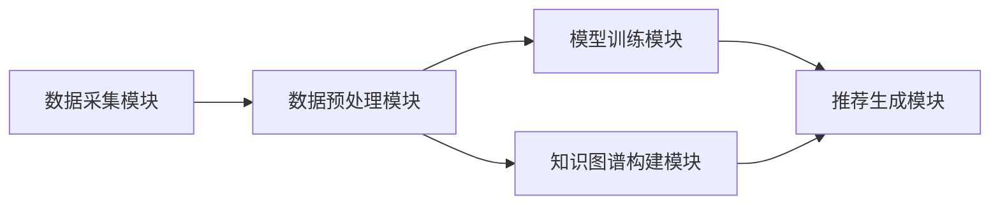

# 构建智能企业知识推荐系统：个性化学习路径与资源推荐

> 关键词：智能企业知识推荐系统、个性化学习路径、资源推荐、机器学习、知识图谱

> 摘要：本文聚焦于构建智能企业知识推荐系统，旨在为企业员工提供个性化的学习路径和资源推荐。通过深入探讨系统的核心概念、算法原理、数学模型，结合实际项目案例，详细阐述了系统的开发过程和实现细节。同时，分析了系统在企业中的实际应用场景，推荐了相关的学习资源、开发工具和研究论文。最后，对智能企业知识推荐系统的未来发展趋势与挑战进行了总结，并提供了常见问题解答和扩展阅读参考资料。

## 1. 背景介绍 
### 1.1 目的和范围
在当今快速发展的商业环境中，企业面临着知识更新换代迅速、员工技能提升需求紧迫的挑战。智能企业知识推荐系统的构建旨在帮助企业员工高效地获取与自身职业发展相关的知识和资源，提高学习效率和工作能力。本文章的范围涵盖了从系统的核心概念、算法原理到实际项目开发和应用的全过程，旨在为企业构建和优化知识推荐系统提供全面的技术指导。

### 1.2 预期读者
本文的预期读者包括企业的技术管理人员、软件开发人员、数据分析师以及对智能企业知识推荐系统感兴趣的研究人员。对于希望提升企业知识管理和员工培训效率的企业决策者，本文也能提供有价值的参考。

### 1.3 文档结构概述
本文将按照以下结构进行阐述：首先介绍核心概念与联系，包括系统的原理和架构；接着详细讲解核心算法原理和具体操作步骤，使用Python源代码进行说明；然后给出数学模型和公式，并举例说明；通过实际项目案例展示系统的开发过程和代码实现；分析系统在企业中的实际应用场景；推荐相关的学习资源、开发工具和研究论文；最后总结系统的未来发展趋势与挑战，提供常见问题解答和扩展阅读参考资料。

### 1.4 术语表
#### 1.4.1 核心术语定义
- **智能企业知识推荐系统**：基于企业内部知识资源，运用机器学习、知识图谱等技术，为企业员工提供个性化知识和学习资源推荐的系统。
- **个性化学习路径**：根据员工的个人信息、技能水平、职业目标等因素，为其量身定制的一系列学习任务和顺序。
- **资源推荐**：根据员工的兴趣和需求，从企业知识资源库中筛选并推荐相关的学习资料、培训课程等。
- **机器学习**：让计算机通过数据和经验自动学习模式和规律，以实现预测和决策的技术。
- **知识图谱**：一种以图的形式表示知识和实体之间关系的语义网络，用于组织和管理企业知识。

#### 1.4.2 相关概念解释
- **协同过滤**：一种基于用户行为数据的推荐算法，通过寻找与目标用户行为相似的其他用户，来推荐他们感兴趣的资源。
- **内容推荐**：根据资源的内容特征和用户的兴趣偏好，推荐相关的资源。
- **深度学习**：一类基于神经网络的机器学习方法，能够自动从大量数据中学习复杂的模式和特征。

#### 1.4.3 缩略词列表
- **AI**：Artificial Intelligence，人工智能
- **ML**：Machine Learning，机器学习
- **KG**：Knowledge Graph，知识图谱
- **CF**：Collaborative Filtering，协同过滤
- **DL**：Deep Learning，深度学习

## 2. 核心概念与联系 

### 核心概念原理
智能企业知识推荐系统的核心原理是通过收集和分析员工的个人信息、学习行为、职业目标等数据，结合企业知识资源库的信息，运用机器学习和知识图谱等技术，为员工提供个性化的学习路径和资源推荐。

系统主要包括以下几个部分：
- **数据采集模块**：收集员工的个人信息、学习记录、职业目标等数据，以及企业知识资源库的信息。
- **数据预处理模块**：对采集到的数据进行清洗、转换和特征提取，以便后续的分析和处理。
- **模型训练模块**：运用机器学习算法，如协同过滤、深度学习等，对预处理后的数据进行训练，建立推荐模型。
- **推荐生成模块**：根据员工的实时需求和推荐模型，生成个性化的学习路径和资源推荐。
- **知识图谱构建模块**：将企业知识资源库中的知识和实体以图的形式表示，构建知识图谱，用于辅助推荐和知识管理。

### 架构的文本示意图
```plaintext
+---------------------+
|     数据采集模块    |
+---------------------+
         |
         v
+---------------------+
|   数据预处理模块    |
+---------------------+
         |
         v
+---------------------+
|   模型训练模块      |
+---------------------+
         |
         v
+---------------------+
|   推荐生成模块      |
+---------------------+
         |
         v
+---------------------+
|  知识图谱构建模块   |
+---------------------+
```

### Mermaid 流程图


## 3. 核心算法原理 & 具体操作步骤 

### 协同过滤算法原理
协同过滤是一种基于用户行为数据的推荐算法，主要分为基于用户的协同过滤（User-based CF）和基于物品的协同过滤（Item-based CF）。

#### 基于用户的协同过滤
基于用户的协同过滤算法的核心思想是寻找与目标用户行为相似的其他用户，然后将这些相似用户感兴趣的资源推荐给目标用户。具体步骤如下：
1. 计算用户之间的相似度：常用的相似度计算方法有余弦相似度、皮尔逊相关系数等。
2. 找出与目标用户最相似的K个用户。
3. 根据这K个相似用户的行为，为目标用户推荐资源。

以下是基于用户的协同过滤算法的Python代码实现：
```python
import numpy as np

def cosine_similarity(user1, user2):
    """
    计算两个用户之间的余弦相似度
    """
    dot_product = np.dot(user1, user2)
    norm_user1 = np.linalg.norm(user1)
    norm_user2 = np.linalg.norm(user2)
    if norm_user1 == 0 or norm_user2 == 0:
        return 0
    return dot_product / (norm_user1 * norm_user2)

def user_based_cf(user_ratings, target_user, k):
    """
    基于用户的协同过滤算法
    """
    num_users = user_ratings.shape[0]
    similarities = []
    for i in range(num_users):
        if i!= target_user:
            similarity = cosine_similarity(user_ratings[target_user], user_ratings[i])
            similarities.append((i, similarity))
    similarities.sort(key=lambda x: x[1], reverse=True)
    top_k_users = [user for user, _ in similarities[:k]]
    return top_k_users
```

#### 基于物品的协同过滤
基于物品的协同过滤算法的核心思想是计算物品之间的相似度，然后根据目标用户对某些物品的评分，推荐与之相似的物品。具体步骤如下：
1. 计算物品之间的相似度。
2. 找出目标用户评分较高的物品。
3. 根据这些物品的相似物品，为目标用户推荐资源。

以下是基于物品的协同过滤算法的Python代码实现：
```python
def item_based_cf(user_ratings, target_user, k):
    """
    基于物品的协同过滤算法
    """
    num_items = user_ratings.shape[1]
    item_similarities = np.zeros((num_items, num_items))
    for i in range(num_items):
        for j in range(num_items):
            if i!= j:
                item_similarities[i][j] = cosine_similarity(user_ratings[:, i], user_ratings[:, j])
    target_user_ratings = user_ratings[target_user]
    rated_items = np.nonzero(target_user_ratings)[0]
    recommended_items = []
    for item in rated_items:
        top_k_similar_items = np.argsort(item_similarities[item])[-k:][::-1]
        for similar_item in top_k_similar_items:
            if target_user_ratings[similar_item] == 0:
                recommended_items.append(similar_item)
    return recommended_items
```

### 深度学习算法原理
深度学习算法在智能企业知识推荐系统中也有广泛的应用，例如使用神经网络进行特征提取和预测。以下是一个简单的基于神经网络的推荐模型的Python代码实现：
```python
import tensorflow as tf
from tensorflow.keras.models import Sequential
from tensorflow.keras.layers import Dense

# 构建神经网络模型
model = Sequential([
    Dense(64, activation='relu', input_shape=(input_dim,)),
    Dense(32, activation='relu'),
    Dense(output_dim, activation='softmax')
])

# 编译模型
model.compile(optimizer='adam', loss='categorical_crossentropy', metrics=['accuracy'])

# 训练模型
model.fit(X_train, y_train, epochs=10, batch_size=32)

# 预测
predictions = model.predict(X_test)
```

## 4. 数学模型和公式 & 详细讲解 & 举例说明 

### 余弦相似度公式
余弦相似度是一种常用的相似度计算方法，用于衡量两个向量之间的夹角余弦值。其公式如下：
$$
\cos(\vec{A}, \vec{B}) = \frac{\vec{A} \cdot \vec{B}}{\|\vec{A}\| \|\vec{B}\|}
$$
其中，$\vec{A}$ 和 $\vec{B}$ 是两个向量，$\vec{A} \cdot \vec{B}$ 是它们的点积，$\|\vec{A}\|$ 和 $\|\vec{B}\|$ 分别是它们的模。

举例说明：假设有两个用户的评分向量 $\vec{A} = [1, 2, 3]$ 和 $\vec{B} = [2, 4, 6]$，则它们的余弦相似度为：
$$
\cos(\vec{A}, \vec{B}) = \frac{1\times2 + 2\times4 + 3\times6}{\sqrt{1^2 + 2^2 + 3^2} \sqrt{2^2 + 4^2 + 6^2}} = \frac{2 + 8 + 18}{\sqrt{14} \sqrt{56}} = \frac{28}{\sqrt{14} \sqrt{56}} = 1
$$

### 皮尔逊相关系数公式
皮尔逊相关系数用于衡量两个变量之间的线性相关性，其公式如下：
$$
r_{XY} = \frac{\sum_{i=1}^{n} (x_i - \bar{x})(y_i - \bar{y})}{\sqrt{\sum_{i=1}^{n} (x_i - \bar{x})^2} \sqrt{\sum_{i=1}^{n} (y_i - \bar{y})^2}}
$$
其中，$x_i$ 和 $y_i$ 分别是两个变量的第 $i$ 个观测值，$\bar{x}$ 和 $\bar{y}$ 分别是它们的均值。

举例说明：假设有两个用户的评分向量 $\vec{X} = [1, 2, 3]$ 和 $\vec{Y} = [2, 4, 6]$，则它们的皮尔逊相关系数为：
1. 计算均值：$\bar{x} = \frac{1 + 2 + 3}{3} = 2$，$\bar{y} = \frac{2 + 4 + 6}{3} = 4$。
2. 计算分子：$\sum_{i=1}^{3} (x_i - \bar{x})(y_i - \bar{y}) = (1 - 2)(2 - 4) + (2 - 2)(4 - 4) + (3 - 2)(6 - 4) = 2 + 0 + 2 = 4$。
3. 计算分母：$\sqrt{\sum_{i=1}^{3} (x_i - \bar{x})^2} \sqrt{\sum_{i=1}^{3} (y_i - \bar{y})^2} = \sqrt{(1 - 2)^2 + (2 - 2)^2 + (3 - 2)^2} \sqrt{(2 - 4)^2 + (4 - 4)^2 + (6 - 4)^2} = \sqrt{2} \sqrt{8} = 4$。
4. 计算皮尔逊相关系数：$r_{XY} = \frac{4}{4} = 1$。

### 神经网络损失函数公式
在神经网络中，常用的损失函数有交叉熵损失函数。对于多分类问题，交叉熵损失函数的公式如下：
$$
L = -\frac{1}{N} \sum_{i=1}^{N} \sum_{j=1}^{C} y_{ij} \log(p_{ij})
$$
其中，$N$ 是样本数量，$C$ 是类别数量，$y_{ij}$ 是第 $i$ 个样本的真实标签的第 $j$ 个分量，$p_{ij}$ 是第 $i$ 个样本的预测概率的第 $j$ 个分量。

举例说明：假设有一个二分类问题，有两个样本，真实标签为 $y_1 = [1, 0]$ 和 $y_2 = [0, 1]$，预测概率为 $p_1 = [0.8, 0.2]$ 和 $p_2 = [0.3, 0.7]$，则交叉熵损失为：
$$
L = -\frac{1}{2} \left( (1\times\log(0.8) + 0\times\log(0.2)) + (0\times\log(0.3) + 1\times\log(0.7)) \right) \approx 0.25
$$

## 5. 项目实战：代码实际案例和详细解释说明 

### 5.1  开发环境搭建
#### 安装Python
首先，需要安装Python环境。可以从Python官方网站（https://www.python.org/downloads/）下载适合自己操作系统的Python版本，并按照安装向导进行安装。

#### 安装必要的库
在命令行中使用以下命令安装必要的库：
```sh
pip install numpy pandas tensorflow scikit-learn
```

### 5.2  源代码详细实现和代码解读
以下是一个简单的智能企业知识推荐系统的Python代码实现：
```python
import numpy as np
import pandas as pd
from sklearn.model_selection import train_test_split
from tensorflow.keras.models import Sequential
from tensorflow.keras.layers import Dense

# 生成示例数据
data = {
    'user_id': [1, 1, 2, 2, 3, 3],
    'item_id': [1, 2, 1, 3, 2, 3],
    'rating': [5, 3, 4, 2, 3, 4]
}
df = pd.DataFrame(data)

# 构建用户-物品矩阵
user_item_matrix = df.pivot(index='user_id', columns='item_id', values='rating').fillna(0)

# 划分训练集和测试集
X = user_item_matrix.values
y = np.random.randint(0, 2, size=(X.shape[0],))
X_train, X_test, y_train, y_test = train_test_split(X, y, test_size=0.2, random_state=42)

# 构建神经网络模型
model = Sequential([
    Dense(64, activation='relu', input_shape=(X_train.shape[1],)),
    Dense(32, activation='relu'),
    Dense(1, activation='sigmoid')
])

# 编译模型
model.compile(optimizer='adam', loss='binary_crossentropy', metrics=['accuracy'])

# 训练模型
model.fit(X_train, y_train, epochs=10, batch_size=32)

# 预测
predictions = model.predict(X_test)
```

### 代码解读与分析
1. **数据生成**：使用`pandas`库生成一个示例数据集，包含用户ID、物品ID和评分信息。
2. **用户-物品矩阵构建**：使用`pivot`方法将数据集转换为用户-物品矩阵，并使用`fillna`方法将缺失值填充为0。
3. **数据集划分**：使用`train_test_split`方法将数据集划分为训练集和测试集。
4. **神经网络模型构建**：使用`Sequential`模型构建一个简单的神经网络，包含两个隐藏层和一个输出层。
5. **模型编译**：使用`compile`方法编译模型，指定优化器、损失函数和评估指标。
6. **模型训练**：使用`fit`方法训练模型，指定训练轮数和批量大小。
7. **模型预测**：使用`predict`方法对测试集进行预测。

## 6. 实际应用场景 
### 员工培训与发展
智能企业知识推荐系统可以根据员工的岗位需求、技能水平和职业目标，为其推荐个性化的培训课程和学习资源，帮助员工提升技能和知识水平，促进职业发展。

### 知识管理与共享
系统可以对企业内部的知识资源进行分类、整理和推荐，方便员工快速找到所需的知识和信息，促进知识的共享和传承。

### 项目协作与创新
在项目协作中，系统可以根据项目成员的专业技能和兴趣，推荐相关的知识和资源，促进项目成员之间的沟通和协作，激发创新思维。

### 客户服务与支持
系统可以根据客户的问题和需求，为客服人员推荐相关的知识和解决方案，提高客户服务的效率和质量。

## 7. 工具和资源推荐
### 7.1 学习资源推荐
#### 7.1.1 书籍推荐
- 《Python机器学习》：介绍了Python在机器学习领域的应用，包括各种机器学习算法的原理和实现。
- 《深度学习》：由深度学习领域的三位顶级专家撰写，全面介绍了深度学习的理论和实践。
- 《知识图谱：方法、实践与应用》：详细介绍了知识图谱的构建方法和应用场景。

#### 7.1.2 在线课程
- Coursera上的“机器学习”课程：由斯坦福大学教授Andrew Ng授课，是机器学习领域的经典课程。
- edX上的“深度学习微硕士项目”：提供了深度学习的系统学习路径和实践项目。
- 阿里云天池平台上的“知识图谱实战营”：通过实际案例介绍知识图谱的构建和应用。

#### 7.1.3 技术博客和网站
- 机器之心：提供人工智能领域的最新技术和研究成果。
- 深度学习前沿：专注于深度学习领域的技术分享和解读。
- 开源中国：提供开源技术的资讯和代码分享。

### 7.2 开发工具框架推荐
#### 7.2.1 IDE和编辑器
- PyCharm：一款专业的Python集成开发环境，提供丰富的代码编辑、调试和分析功能。
- Jupyter Notebook：一种交互式的开发环境，适合进行数据探索和模型实验。
- Visual Studio Code：一款轻量级的代码编辑器，支持多种编程语言和插件扩展。

#### 7.2.2 调试和性能分析工具
- TensorBoard：TensorFlow提供的可视化工具，用于监控模型训练过程和分析模型性能。
- Py-Spy：一款轻量级的Python性能分析工具，可以帮助找出代码中的性能瓶颈。
- cProfile：Python标准库中的性能分析模块，用于分析代码的执行时间和调用关系。

#### 7.2.3 相关框架和库
- TensorFlow：一个开源的深度学习框架，提供了丰富的神经网络模型和工具。
- PyTorch：另一个流行的深度学习框架，具有简洁易用的API和高效的计算性能。
- Scikit-learn：一个用于机器学习的Python库，提供了各种机器学习算法和工具。

### 7.3 相关论文著作推荐
#### 7.3.1 经典论文
- “Item-based Collaborative Filtering Recommendation Algorithms”：介绍了基于物品的协同过滤算法的原理和实现。
- “Deep Learning”：深度学习领域的经典综述论文，全面介绍了深度学习的发展历程和技术原理。
- “Knowledge Graph Embedding: A Survey of Approaches and Applications”：对知识图谱嵌入技术进行了全面的综述和分析。

#### 7.3.2 最新研究成果
- 关注顶级学术会议如NeurIPS、ICML、KDD等上的最新研究成果，了解智能企业知识推荐系统领域的前沿技术和发展趋势。
- 查阅顶级学术期刊如Journal of Artificial Intelligence Research、ACM Transactions on Intelligent Systems and Technology等上的相关论文。

#### 7.3.3 应用案例分析
- 分析一些知名企业在智能企业知识推荐系统方面的应用案例，如谷歌、亚马逊等，学习它们的实践经验和技术解决方案。

## 8. 总结：未来发展趋势与挑战
### 未来发展趋势
- **多模态融合**：将文本、图像、视频等多模态数据融合到知识推荐系统中，提供更加丰富和全面的知识推荐。
- **强化学习应用**：运用强化学习算法，根据用户的实时反馈动态调整推荐策略，提高推荐的准确性和个性化程度。
- **与区块链结合**：利用区块链技术保证知识资源的安全性和可信性，实现知识的共享和交易。
- **边缘计算支持**：在边缘设备上部署知识推荐系统，减少数据传输延迟，提高系统的响应速度和效率。

### 挑战
- **数据质量和隐私保护**：确保收集到的数据质量高、准确可靠，同时保护用户的隐私和数据安全。
- **算法可解释性**：提高推荐算法的可解释性，让用户理解推荐结果的生成原因，增强用户对系统的信任。
- **知识图谱构建和更新**：构建和维护大规模的知识图谱需要大量的人力和物力，同时要保证知识图谱的实时更新和准确性。
- **系统性能优化**：随着企业知识资源和用户数量的增加，系统的性能和可扩展性面临挑战，需要不断优化系统架构和算法。

## 9. 附录：常见问题与解答
### 如何提高推荐系统的准确性？
可以从以下几个方面入手：
- 收集更多、更准确的数据，包括用户行为数据、资源内容数据等。
- 选择合适的推荐算法，并进行参数调优。
- 结合多种推荐算法，如协同过滤和内容推荐相结合。
- 不断更新和优化推荐模型，根据用户的反馈进行调整。

### 知识图谱在推荐系统中有什么作用？
知识图谱可以帮助推荐系统更好地理解知识和实体之间的关系，提供更加精准和个性化的推荐。具体作用包括：
- 丰富资源的语义信息，提高推荐的准确性。
- 发现用户的潜在兴趣，推荐相关的知识和资源。
- 辅助推理和决策，提供更加智能的推荐服务。

### 如何处理推荐系统中的冷启动问题？
冷启动问题是指在新用户或新资源加入系统时，由于缺乏足够的历史数据，推荐系统难以提供准确的推荐。可以采用以下方法解决：
- 对于新用户，可以通过收集用户的基本信息和初始偏好，进行基于内容的推荐。
- 对于新资源，可以利用资源的内容特征和关联信息，进行推荐。
- 采用混合推荐策略，结合多种推荐算法，提高冷启动时的推荐效果。

## 10. 扩展阅读 & 参考资料
- 《推荐系统实践》，项亮著
- 《人工智能：现代方法》，Stuart Russell、Peter Norvig著
- 相关学术论文和研究报告，如ACM SIGKDD、IEEE ICML等会议的论文
- 各大科技公司的技术博客，如谷歌AI博客、微软研究院博客等

作者：AI天才研究院/AI Genius Institute & 禅与计算机程序设计艺术 /Zen And The Art of Computer Programming