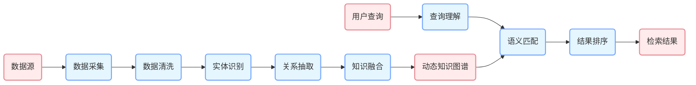

# 构建智能企业知识管理平台：动态知识图谱与语义检索系统

> 关键词：智能企业知识管理平台、动态知识图谱、语义检索系统、知识表示、信息检索

> 摘要：本文聚焦于构建智能企业知识管理平台，详细阐述了动态知识图谱与语义检索系统的相关原理、技术实现及应用。首先介绍了构建该平台的背景和目的，明确了预期读者和文档结构。接着深入讲解了核心概念，包括动态知识图谱和语义检索的原理及架构，并给出了相应的示意图和流程图。在核心算法原理部分，通过Python代码详细说明了关键算法的实现。同时，介绍了相关的数学模型和公式，并举例说明其应用。项目实战部分提供了开发环境搭建的步骤、源代码实现及解读。随后探讨了该平台的实际应用场景，推荐了学习资源、开发工具框架以及相关论文著作。最后总结了未来发展趋势与挑战，还给出了常见问题解答和扩展阅读参考资料，旨在为企业构建高效的知识管理平台提供全面的技术指导。

## 1. 背景介绍 
### 1.1 目的和范围
在当今数字化时代，企业积累了海量的知识和信息。然而，如何有效地管理这些知识，使其能够被快速、准确地检索和利用，成为了企业面临的重要挑战。构建智能企业知识管理平台的目的在于整合企业内外部的知识资源，通过动态知识图谱和语义检索系统，实现知识的高效组织、存储和检索，为企业决策、创新和业务发展提供有力支持。

本文章的范围涵盖了从动态知识图谱和语义检索系统的核心概念、算法原理到实际项目开发和应用的全过程，旨在为企业和技术人员提供一个全面的技术指南，帮助他们构建适合自身需求的智能企业知识管理平台。

### 1.2 预期读者
本文的预期读者包括企业的知识管理负责人、技术主管、软件开发人员、数据科学家以及对知识图谱和语义检索技术感兴趣的研究人员。这些读者可能希望了解如何利用先进的技术手段提升企业的知识管理水平，或者对相关技术的原理和实现细节有深入的研究需求。

### 1.3 文档结构概述
本文将按照以下结构进行组织：
- 核心概念与联系：介绍动态知识图谱和语义检索系统的核心概念、原理和架构，并给出相应的示意图和流程图。
- 核心算法原理 & 具体操作步骤：详细讲解核心算法的原理，并使用Python代码进行实现。
- 数学模型和公式 & 详细讲解 & 举例说明：介绍相关的数学模型和公式，并通过具体例子进行说明。
- 项目实战：代码实际案例和详细解释说明：提供项目开发的具体步骤，包括开发环境搭建、源代码实现和代码解读。
- 实际应用场景：探讨智能企业知识管理平台在不同领域的实际应用场景。
- 工具和资源推荐：推荐学习资源、开发工具框架和相关论文著作。
- 总结：未来发展趋势与挑战：总结智能企业知识管理平台的未来发展趋势和面临的挑战。
- 附录：常见问题与解答：解答读者在学习和实践过程中可能遇到的常见问题。
- 扩展阅读 & 参考资料：提供扩展阅读的建议和相关参考资料。

### 1.4 术语表
#### 1.4.1 核心术语定义
- **知识图谱**：一种以图的形式表示知识的方法，由节点和边组成，节点表示实体，边表示实体之间的关系。
- **动态知识图谱**：在传统知识图谱的基础上，能够实时更新和演化，反映知识的动态变化。
- **语义检索**：基于语义理解的信息检索技术，能够理解用户查询的语义含义，提供更准确的检索结果。
- **智能企业知识管理平台**：集成了动态知识图谱和语义检索系统，用于企业知识的管理、组织和检索的平台。

#### 1.4.2 相关概念解释
- **实体**：知识图谱中的基本元素，代表现实世界中的事物，如人、组织、产品等。
- **关系**：表示实体之间的联系，如“工作于”、“属于”、“生产”等。
- **语义理解**：计算机对自然语言文本的语义含义进行分析和理解的过程。
- **本体**：对特定领域概念和关系的形式化描述，用于知识的表示和推理。

#### 1.4.3 缩略词列表
- **KG**：Knowledge Graph，知识图谱
- **DKG**：Dynamic Knowledge Graph，动态知识图谱
- **IR**：Information Retrieval，信息检索
- **NLP**：Natural Language Processing，自然语言处理

## 2. 核心概念与联系 

### 2.1 动态知识图谱原理
动态知识图谱是一种能够实时反映知识变化的知识表示方法。它的核心思想是将知识以图的形式进行组织，节点表示实体，边表示实体之间的关系。与传统知识图谱不同的是，动态知识图谱能够随着时间的推移和新信息的加入，实时更新和演化。

动态知识图谱的构建过程通常包括数据采集、数据清洗、实体识别、关系抽取和知识融合等步骤。在数据采集阶段，需要从各种数据源中收集相关的知识信息，如企业内部的文档、数据库、网页等。数据清洗的目的是去除噪声和冗余数据，提高数据质量。实体识别和关系抽取则是从文本中识别出实体和它们之间的关系，并将其转换为图的形式。最后，通过知识融合将不同数据源中的知识进行整合，形成一个统一的知识图谱。

### 2.2 语义检索系统原理
语义检索系统是基于语义理解的信息检索技术。它的核心思想是理解用户查询的语义含义，而不仅仅是匹配关键词。语义检索系统通常包括查询理解、语义匹配和结果排序等模块。

在查询理解阶段，系统会对用户输入的查询语句进行语义分析，提取出查询的关键信息和语义意图。语义匹配模块则会将查询的语义与知识图谱中的知识进行匹配，找出相关的实体和关系。最后，结果排序模块会根据匹配的程度和其他因素对检索结果进行排序，为用户提供最相关的信息。

### 2.3 核心概念架构示意图

该示意图展示了动态知识图谱和语义检索系统的核心架构。数据源经过一系列处理步骤构建成动态知识图谱，用户查询经过查询理解、语义匹配和结果排序等模块，结合动态知识图谱生成检索结果。

### 2.4 核心概念联系
动态知识图谱和语义检索系统是相互依存、相互促进的关系。动态知识图谱为语义检索系统提供了丰富的知识资源，使得语义检索系统能够更好地理解用户查询的语义含义，提供更准确的检索结果。而语义检索系统则为动态知识图谱的应用提供了一个重要的接口，用户可以通过语义检索系统方便地访问和利用动态知识图谱中的知识。

## 3. 核心算法原理 & 具体操作步骤 

### 3.1 实体识别算法原理
实体识别是动态知识图谱构建的重要步骤之一，其目的是从文本中识别出实体。常用的实体识别算法有基于规则的方法、基于机器学习的方法和基于深度学习的方法。

#### 基于规则的方法
基于规则的方法是通过手工编写规则来识别实体。这些规则通常基于语言学知识和领域知识，例如词法规则、句法规则和语义规则等。下面是一个简单的基于规则的实体识别Python代码示例：
```python
import re

def rule_based_entity_recognition(text):
    # 定义人名规则
    person_pattern = r'[赵钱孙李周吴郑王][\u4e00-\u9fa5]{1,2}'
    # 定义组织机构名规则
    org_pattern = r'[\u4e00-\u9fa5]+(公司|集团|学校|医院)'
    
    persons = re.findall(person_pattern, text)
    orgs = re.findall(org_pattern, text)
    
    entities = {'person': persons, 'organization': orgs}
    return entities

text = "张三在华为公司工作"
entities = rule_based_entity_recognition(text)
print(entities)
```
在这个示例中，我们定义了人名和组织机构名的规则，并使用正则表达式从文本中识别出相应的实体。

#### 基于机器学习的方法
基于机器学习的方法通常使用有监督学习算法，如支持向量机（SVM）、条件随机场（CRF）等。这些算法需要大量的标注数据进行训练。下面是一个使用CRF进行实体识别的Python代码示例：
```python
import sklearn_crfsuite
from sklearn_crfsuite import metrics

# 定义特征提取函数
def word2features(sent, i):
    word = sent[i][0]
    features = {
        'bias': 1.0,
        'word.lower()': word.lower(),
        'word.isupper()': word.isupper(),
        'word.istitle()': word.istitle(),
        'word.isdigit()': word.isdigit()
    }
    if i > 0:
        word1 = sent[i-1][0]
        features.update({
            '-1:word.lower()': word1.lower(),
            '-1:word.istitle()': word1.istitle(),
            '-1:word.isupper()': word1.isupper()
        })
    else:
        features['BOS'] = True
    
    if i < len(sent)-1:
        word1 = sent[i+1][0]
        features.update({
            '+1:word.lower()': word1.lower(),
            '+1:word.istitle()': word1.istitle(),
            '+1:word.isupper()': word1.isupper()
        })
    else:
        features['EOS'] = True
    
    return features

def sent2features(sent):
    return [word2features(sent, i) for i in range(len(sent))]

def sent2labels(sent):
    return [label for token, label in sent]

# 示例训练数据
train_sents = [
    [('张三', 'PER'), ('在', 'O'), ('华为', 'ORG'), ('公司', 'ORG'), ('工作', 'O')]
]

X_train = [sent2features(s) for s in train_sents]
y_train = [sent2labels(s) for s in train_sents]

# 训练CRF模型
crf = sklearn_crfsuite.CRF(
    algorithm='lbfgs',
    c1=0.1,
    c2=0.1,
    max_iterations=100,
    all_possible_transitions=True
)
crf.fit(X_train, y_train)

# 示例测试数据
test_sents = [
    [('李四', 'PER'), ('在', 'O'), ('百度', 'ORG'), ('公司', 'ORG'), ('上班', 'O')]
]

X_test = [sent2features(s) for s in test_sents]
y_test = [sent2labels(s) for s in test_sents]

# 预测
y_pred = crf.predict(X_test)

# 评估
labels = list(crf.classes_)
labels.remove('O')
print(metrics.flat_f1_score(y_test, y_pred, average='weighted', labels=labels))
```
在这个示例中，我们定义了特征提取函数，将训练数据转换为特征向量，然后使用CRF模型进行训练和预测。

#### 基于深度学习的方法
基于深度学习的方法通常使用神经网络，如循环神经网络（RNN）、长短期记忆网络（LSTM）和卷积神经网络（CNN）等。下面是一个使用BiLSTM-CRF进行实体识别的Python代码示例：
```python
import torch
import torch.nn as nn
import torch.optim as optim
from torch.utils.data import Dataset, DataLoader

# 定义数据集类
class NERDataset(Dataset):
    def __init__(self, data):
        self.data = data
    
    def __len__(self):
        return len(self.data)
    
    def __getitem__(self, idx):
        tokens, labels = self.data[idx]
        return tokens, labels

# 定义BiLSTM-CRF模型
class BiLSTM_CRF(nn.Module):
    def __init__(self, vocab_size, tag_to_ix, embedding_dim, hidden_dim):
        super(BiLSTM_CRF, self).__init__()
        self.embedding_dim = embedding_dim
        self.hidden_dim = hidden_dim
        self.vocab_size = vocab_size
        self.tag_to_ix = tag_to_ix
        self.tagset_size = len(tag_to_ix)
        
        self.word_embeds = nn.Embedding(vocab_size, embedding_dim)
        self.lstm = nn.LSTM(embedding_dim, hidden_dim // 2,
                            num_layers=1, bidirectional=True)
        
        self.hidden2tag = nn.Linear(hidden_dim, self.tagset_size)
        
        self.transitions = nn.Parameter(
            torch.randn(self.tagset_size, self.tagset_size))
        
        self.start_tag = tag_to_ix["<START>"]
        self.stop_tag = tag_to_ix["<STOP>"]
    
    def _forward_alg(self, feats):
        init_alphas = torch.full((1, self.tagset_size), -10000.)
        init_alphas[0][self.start_tag] = 0.
        
        forward_var = init_alphas
        
        for feat in feats:
            alphas_t = []
            for next_tag in range(self.tagset_size):
                emit_score = feat[next_tag].view(
                    1, -1).expand(1, self.tagset_size)
                trans_score = self.transitions[next_tag].view(1, -1)
                next_tag_var = forward_var + trans_score + emit_score
                alphas_t.append(log_sum_exp(next_tag_var).view(1))
            forward_var = torch.cat(alphas_t).view(1, -1)
        terminal_var = forward_var + self.transitions[self.stop_tag]
        alpha = log_sum_exp(terminal_var)
        return alpha
    
    def _get_lstm_features(self, sentence):
        embeds = self.word_embeds(sentence).view(len(sentence), 1, -1)
        lstm_out, _ = self.lstm(embeds)
        lstm_out = lstm_out.view(len(sentence), self.hidden_dim)
        lstm_feats = self.hidden2tag(lstm_out)
        return lstm_feats
    
    def _score_sentence(self, feats, tags):
        score = torch.zeros(1)
        tags = torch.cat([torch.tensor([self.start_tag], dtype=torch.long), tags])
        for i, feat in enumerate(feats):
            score = score + \
                self.transitions[tags[i + 1], tags[i]] + feat[tags[i + 1]]
        score = score + self.transitions[self.stop_tag, tags[-1]]
        return score
    
    def _viterbi_decode(self, feats):
        backpointers = []
        
        init_vvars = torch.full((1, self.tagset_size), -10000.)
        init_vvars[0][self.start_tag] = 0
        
        forward_var = init_vvars
        for feat in feats:
            bptrs_t = []
            viterbivars_t = []
            
            for next_tag in range(self.tagset_size):
                next_tag_var = forward_var + self.transitions[next_tag]
                best_tag_id = argmax(next_tag_var)
                bptrs_t.append(best_tag_id)
                viterbivars_t.append(next_tag_var[0][best_tag_id].view(1))
            forward_var = (torch.cat(viterbivars_t) + feat).view(1, -1)
            backpointers.append(bptrs_t)
        
        terminal_var = forward_var + self.transitions[self.stop_tag]
        best_tag_id = argmax(terminal_var)
        path_score = terminal_var[0][best_tag_id]
        
        best_path = [best_tag_id]
        for bptrs_t in reversed(backpointers):
            best_tag_id = bptrs_t[best_tag_id]
            best_path.append(best_tag_id)
        start = best_path.pop()
        assert start == self.start_tag
        best_path.reverse()
        return path_score, best_path
    
    def neg_log_likelihood(self, sentence, tags):
        feats = self._get_lstm_features(sentence)
        forward_score = self._forward_alg(feats)
        gold_score = self._score_sentence(feats, tags)
        return forward_score - gold_score
    
    def forward(self, sentence):
        lstm_feats = self._get_lstm_features(sentence)
        score, tag_seq = self._viterbi_decode(lstm_feats)
        return score, tag_seq

# 辅助函数
def argmax(vec):
    _, idx = torch.max(vec, 1)
    return idx.item()

def log_sum_exp(vec):
    max_score = vec[0, argmax(vec)]
    return max_score + \
        torch.log(torch.sum(torch.exp(vec - max_score)))

# 示例数据
training_data = [
    ("张三 在 华为 公司 工作".split(), "PER O ORG ORG O".split())
]

word_to_ix = {}
for sent, tags in training_data:
    for word in sent:
        if word not in word_to_ix:
            word_to_ix[word] = len(word_to_ix)

tag_to_ix = {"B-PER": 0, "I-PER": 1, "B-ORG": 2, "I-ORG": 3, "O": 4, "<START>": 5, "<STOP>": 6}

model = BiLSTM_CRF(len(word_to_ix), tag_to_ix, 5, 4)
optimizer = optim.SGD(model.parameters(), lr=0.01, weight_decay=1e-4)

# 训练模型
for epoch in range(300):
    for sentence, tags in training_data:
        model.zero_grad()
        
        sentence_in = prepare_sequence(sentence, word_to_ix)
        targets = torch.tensor([tag_to_ix[t] for t in tags], dtype=torch.long)
        
        loss = model.neg_log_likelihood(sentence_in, targets)
        
        loss.backward()
        optimizer.step()

# 测试模型
with torch.no_grad():
    precheck_sent = prepare_sequence(training_data[0][0], word_to_ix)
    print(model(precheck_sent))

def prepare_sequence(seq, to_ix):
    idxs = [to_ix[w] for w in seq]
    return torch.tensor(idxs, dtype=torch.long)
```
在这个示例中，我们定义了BiLSTM-CRF模型，使用PyTorch进行训练和测试。

### 3.2 关系抽取算法原理
关系抽取是从文本中识别出实体之间的关系。常用的关系抽取算法有基于规则的方法、基于机器学习的方法和基于深度学习的方法。

#### 基于规则的方法
基于规则的方法是通过手工编写规则来抽取关系。这些规则通常基于语言学知识和领域知识，例如词法规则、句法规则和语义规则等。下面是一个简单的基于规则的关系抽取Python代码示例：
```python
import re

def rule_based_relation_extraction(text):
    # 定义关系抽取规则
    pattern = r'(\w+) 在 (\w+) 工作'
    match = re.search(pattern, text)
    if match:
        person = match.group(1)
        organization = match.group(2)
        relation = '工作于'
        return (person, relation, organization)
    else:
        return None

text = "张三在华为公司工作"
relation = rule_based_relation_extraction(text)
print(relation)
```
在这个示例中，我们定义了一个关系抽取规则，从文本中抽取“工作于”关系。

#### 基于机器学习的方法
基于机器学习的方法通常使用有监督学习算法，如支持向量机（SVM）、决策树等。这些算法需要大量的标注数据进行训练。下面是一个使用SVM进行关系抽取的Python代码示例：
```python
from sklearn.feature_extraction.text import TfidfVectorizer
from sklearn.svm import SVC
from sklearn.metrics import classification_report

# 示例训练数据
train_texts = [
    "张三在华为公司工作",
    "李四在百度公司上班"
]
train_labels = ['工作于', '工作于']

# 特征提取
vectorizer = TfidfVectorizer()
X_train = vectorizer.fit_transform(train_texts)

# 训练SVM模型
model = SVC()
model.fit(X_train, train_labels)

# 示例测试数据
test_texts = [
    "王五在阿里巴巴公司工作"
]
X_test = vectorizer.transform(test_texts)

# 预测
y_pred = model.predict(X_test)
print(y_pred)
```
在这个示例中，我们使用TF-IDF进行特征提取，然后使用SVM模型进行训练和预测。

#### 基于深度学习的方法
基于深度学习的方法通常使用神经网络，如卷积神经网络（CNN）、循环神经网络（RNN）等。下面是一个使用CNN进行关系抽取的Python代码示例：
```python
import torch
import torch.nn as nn
import torch.optim as optim
from torch.utils.data import Dataset, DataLoader
from sklearn.preprocessing import LabelEncoder

# 定义数据集类
class RelationDataset(Dataset):
    def __init__(self, texts, labels):
        self.texts = texts
        self.labels = labels
    
    def __len__(self):
        return len(self.texts)
    
    def __getitem__(self, idx):
        text = self.texts[idx]
        label = self.labels[idx]
        return text, label

# 定义CNN模型
class CNN(nn.Module):
    def __init__(self, vocab_size, embedding_dim, num_filters, filter_sizes, output_dim, dropout):
        super().__init__()
        
        self.embedding = nn.Embedding(vocab_size, embedding_dim)
        self.convs = nn.ModuleList([
            nn.Conv2d(in_channels = 1, 
                      out_channels = num_filters, 
                      kernel_size = (fs, embedding_dim)) 
            for fs in filter_sizes
        ])
        self.fc = nn.Linear(len(filter_sizes) * num_filters, output_dim)
        self.dropout = nn.Dropout(dropout)
        
    def forward(self, text):
        embedded = self.embedding(text)
        embedded = embedded.unsqueeze(1)
        conved = [nn.functional.relu(conv(embedded)).squeeze(3) for conv in self.convs]
        pooled = [nn.functional.max_pool1d(conv, conv.shape[2]).squeeze(2) for conv in conved]
        cat = self.dropout(torch.cat(pooled, dim = 1))
        return self.fc(cat)

# 示例数据
train_texts = [
    "张三在华为公司工作",
    "李四在百度公司上班"
]
train_labels = ['工作于', '工作于']

# 标签编码
label_encoder = LabelEncoder()
train_labels = label_encoder.fit_transform(train_labels)

# 构建词汇表
vocab = set()
for text in train_texts:
    for word in text.split():
        vocab.add(word)
vocab_size = len(vocab)
word_to_ix = {word: i for i, word in enumerate(vocab)}

# 数据转换
train_data = []
for text, label in zip(train_texts, train_labels):
    text_indices = [word_to_ix[word] for word in text.split()]
    train_data.append((torch.tensor(text_indices), torch.tensor(label)))

# 定义超参数
embedding_dim = 100
num_filters = 100
filter_sizes = [3, 4, 5]
output_dim = len(label_encoder.classes_)
dropout = 0.5

# 初始化模型
model = CNN(vocab_size, embedding_dim, num_filters, filter_sizes, output_dim, dropout)

# 定义损失函数和优化器
criterion = nn.CrossEntropyLoss()
optimizer = optim.Adam(model.parameters())

# 训练模型
for epoch in range(10):
    for text, label in train_data:
        optimizer.zero_grad()
        output = model(text.unsqueeze(0))
        loss = criterion(output, label.unsqueeze(0))
        loss.backward()
        optimizer.step()

# 示例测试数据
test_texts = [
    "王五在阿里巴巴公司工作"
]
test_data = []
for text in test_texts:
    text_indices = [word_to_ix.get(word, 0) for word in text.split()]
    test_data.append(torch.tensor(text_indices))

# 预测
with torch.no_grad():
    predictions = []
    for text in test_data:
        output = model(text.unsqueeze(0))
        _, predicted = torch.max(output, 1)
        predictions.append(label_encoder.inverse_transform(predicted)[0])
    print(predictions)
```
在这个示例中，我们定义了CNN模型，使用PyTorch进行训练和预测。

### 3.3 语义匹配算法原理
语义匹配是语义检索系统的核心步骤之一，其目的是将用户查询的语义与知识图谱中的知识进行匹配。常用的语义匹配算法有基于词向量的方法、基于深度学习的方法等。

#### 基于词向量的方法
基于词向量的方法是将文本转换为向量表示，然后计算向量之间的相似度。常用的词向量模型有Word2Vec、GloVe等。下面是一个使用Word2Vec进行语义匹配的Python代码示例：
```python
from gensim.models import Word2Vec
import numpy as np

# 示例训练数据
sentences = [
    ["张三", "在", "华为", "公司", "工作"],
    ["李四", "在", "百度", "公司", "上班"]
]

# 训练Word2Vec模型
model = Word2Vec(sentences, min_count=1)

# 定义查询和知识图谱中的知识
query = ["张三", "工作"]
knowledge = ["张三", "在", "华为", "公司", "工作"]

# 计算查询和知识的向量表示
query_vector = np.mean([model.wv[word] for word in query if word in model.wv], axis=0)
knowledge_vector = np.mean([model.wv[word] for word in knowledge if word in model.wv], axis=0)

# 计算向量相似度
similarity = np.dot(query_vector, knowledge_vector) / (np.linalg.norm(query_vector) * np.linalg.norm(knowledge_vector))
print(similarity)
```
在这个示例中，我们使用Word2Vec模型将文本转换为向量表示，然后计算向量之间的余弦相似度。

#### 基于深度学习的方法
基于深度学习的方法通常使用神经网络，如Siamese网络、BERT等。下面是一个使用BERT进行语义匹配的Python代码示例：
```python
from transformers import BertTokenizer, BertModel
import torch
from sklearn.metrics.pairwise import cosine_similarity

# 加载BERT模型和分词器
tokenizer = BertTokenizer.from_pretrained('bert-base-chinese')
model = BertModel.from_pretrained('bert-base-chinese')

# 定义查询和知识图谱中的知识
query = "张三工作"
knowledge = "张三在华为公司工作"

# 分词
query_tokens = tokenizer.encode(query, return_tensors='pt')
knowledge_tokens = tokenizer.encode(knowledge, return_tensors='pt')

# 获取向量表示
with torch.no_grad():
    query_outputs = model(query_tokens)
    knowledge_outputs = model(knowledge_tokens)
    query_vector = query_outputs[1].numpy()
    knowledge_vector = knowledge_outputs[1].numpy()

# 计算向量相似度
similarity = cosine_similarity(query_vector, knowledge_vector)[0][0]
print(similarity)
```
在这个示例中，我们使用BERT模型将文本转换为向量表示，然后计算向量之间的余弦相似度。

## 4. 数学模型和公式 & 详细讲解 & 举例说明 

### 4.1 词向量相似度计算
#### 数学公式
词向量相似度通常使用余弦相似度来计算，其公式为：
$$
\cos(\vec{A}, \vec{B}) = \frac{\vec{A} \cdot \vec{B}}{\|\vec{A}\| \|\vec{B}\|}
$$
其中，$\vec{A}$ 和 $\vec{B}$ 分别表示两个词向量，$\vec{A} \cdot \vec{B}$ 表示向量的点积，$\|\vec{A}\|$ 和 $\|\vec{B}\|$ 分别表示向量的模。

#### 详细讲解
余弦相似度的取值范围在 $[-1, 1]$ 之间，值越接近 1 表示两个向量越相似，值越接近 -1 表示两个向量越不相似。在语义匹配中，我们可以通过计算查询向量和知识向量的余弦相似度来判断它们的语义相似程度。

#### 举例说明
假设我们有两个词向量 $\vec{A} = [1, 2, 3]$ 和 $\vec{B} = [2, 4, 6]$，则它们的余弦相似度计算如下：
$$
\vec{A} \cdot \vec{B} = 1\times2 + 2\times4 + 3\times6 = 2 + 8 + 18 = 28
$$
$$
\|\vec{A}\| = \sqrt{1^2 + 2^2 + 3^2} = \sqrt{1 + 4 + 9} = \sqrt{14}
$$
$$
\|\vec{B}\| = \sqrt{2^2 + 4^2 + 6^2} = \sqrt{4 + 16 + 36} = \sqrt{56} = 2\sqrt{14}
$$
$$
\cos(\vec{A}, \vec{B}) = \frac{28}{\sqrt{14} \times 2\sqrt{14}} = \frac{28}{28} = 1
$$
这表明 $\vec{A}$ 和 $\vec{B}$ 是完全相似的。

### 4.2 动态知识图谱更新
#### 数学模型
动态知识图谱的更新可以看作是一个增量学习的过程。假设我们有一个初始的知识图谱 $G_0$，随着时间的推移，不断有新的知识 $E = \{e_1, e_2, \cdots, e_n\}$ 加入，我们需要将这些新的知识融入到现有的知识图谱中，得到更新后的知识图谱 $G_t$。

#### 详细讲解
在更新过程中，我们需要考虑新的实体和关系的加入，以及现有实体和关系的修改和删除。对于新的实体和关系，我们可以直接将其添加到知识图谱中；对于现有实体和关系的修改和删除，我们需要根据具体情况进行处理。

#### 举例说明
假设我们有一个初始的知识图谱 $G_0$，其中包含实体 “张三” 和 “华为公司”，以及关系 “工作于”。现在有新的知识 “张三 升职为 华为公司 部门经理” 加入，我们可以将新的关系 “升职为” 和 “部门经理” 这个新实体添加到知识图谱中，得到更新后的知识图谱 $G_1$。

### 4.3 语义检索排序
#### 数学公式
语义检索的排序通常使用排序函数来实现，常见的排序函数有 BM25 算法。BM25 算法的公式为：
$$
score(D, Q) = \sum_{i=1}^{n} IDF(q_i) \cdot \frac{f(q_i, D) \cdot (k_1 + 1)}{f(q_i, D) + k_1 \cdot (1 - b + b \cdot \frac{|D|}{avgdl})}
$$
其中，$score(D, Q)$ 表示文档 $D$ 与查询 $Q$ 的相关性得分，$IDF(q_i)$ 表示查询词 $q_i$ 的逆文档频率，$f(q_i, D)$ 表示查询词 $q_i$ 在文档 $D$ 中出现的频率，$k_1$ 和 $b$ 是调节参数，$|D|$ 表示文档 $D$ 的长度，$avgdl$ 表示所有文档的平均长度。

#### 详细讲解
BM25 算法综合考虑了查询词的逆文档频率、查询词在文档中出现的频率以及文档的长度等因素。逆文档频率越高的查询词对相关性得分的贡献越大，查询词在文档中出现的频率越高，相关性得分也越高。文档长度的调节参数 $b$ 可以控制文档长度对相关性得分的影响。

#### 举例说明
假设我们有一个查询 $Q = \{q_1, q_2\}$，文档 $D$，$IDF(q_1) = 2$，$IDF(q_2) = 3$，$f(q_1, D) = 2$，$f(q_2, D) = 3$，$|D| = 100$，$avgdl = 80$，$k_1 = 1.2$，$b = 0.75$。则文档 $D$ 与查询 $Q$ 的相关性得分计算如下：
首先计算 $1 - b + b \cdot \frac{|D|}{avgdl} = 1 - 0.75 + 0.75 \cdot \frac{100}{80} = 1 - 0.75 + 0.9375 = 1.1875$
对于 $q_1$：
$$
\frac{f(q_1, D) \cdot (k_1 + 1)}{f(q_1, D) + k_1 \cdot (1 - b + b \cdot \frac{|D|}{avgdl})} = \frac{2 \cdot (1.2 + 1)}{2 + 1.2 \cdot 1.1875} = \frac{4.4}{2 + 1.425} = \frac{4.4}{3.425} \approx 1.28
$$
对于 $q_2$：
$$
\frac{f(q_2, D) \cdot (k_1 + 1)}{f(q_2, D) + k_1 \cdot (1 - b + b \cdot \frac{|D|}{avgdl})} = \frac{3 \cdot (1.2 + 1)}{3 + 1.2 \cdot 1.1875} = \frac{6.6}{3 + 1.425} = \frac{6.6}{4.425} \approx 1.49
$$
则 $score(D, Q) = IDF(q_1) \cdot 1.28 + IDF(q_2) \cdot 1.49 = 2 \cdot 1.28 + 3 \cdot 1.49 = 2.56 + 4.47 = 7.03$

## 5. 项目实战：代码实际案例和详细解释说明 

### 5.1  开发环境搭建
#### 操作系统
建议使用 Linux 或 macOS 操作系统，因为它们对 Python 和相关开发工具的支持更好。如果使用 Windows 操作系统，也可以通过安装 Anaconda 等工具来搭建开发环境。

#### Python 环境
安装 Python 3.6 及以上版本。可以从 Python 官方网站（https://www.python.org/downloads/）下载安装包进行安装，也可以使用 Anaconda 进行安装。

#### 依赖库安装
使用 pip 或 conda 安装以下依赖库：
- `numpy`：用于数值计算。
- `pandas`：用于数据处理。
- `scikit-learn`：用于机器学习算法。
- `torch`：用于深度学习框架。
- `transformers`：用于自然语言处理模型。
- `gensim`：用于词向量模型。
- `networkx`：用于图的处理和分析。

例如，使用 pip 安装：
```sh
pip install numpy pandas scikit-learn torch transformers gensim networkx
```

### 5.2  源代码详细实现和代码解读
#### 数据采集和清洗
```python
import requests
from bs4 import BeautifulSoup
import re

# 数据采集
def collect_data(url):
    response = requests.get(url)
    if response.status_code == 200:
        return response.text
    else:
        return None

# 数据清洗
def clean_data(text):
    # 去除 HTML 标签
    soup = BeautifulSoup(text, 'html.parser')
    text = soup.get_text()
    # 去除特殊字符
    text = re.sub(r'[^\w\s]', '', text)
    # 去除多余空格
    text = re.sub(r'\s+', ' ', text).strip()
    return text

# 示例
url = 'https://example.com'
html_text = collect_data(url)
if html_text:
    clean_text = clean_data(html_text)
    print(clean_text)
```
代码解读：
- `collect_data` 函数使用 `requests` 库发送 HTTP 请求，获取网页的 HTML 内容。
- `clean_data` 函数使用 `BeautifulSoup` 库去除 HTML 标签，使用正则表达式去除特殊字符和多余空格。

#### 实体识别和关系抽取
```python
import spacy

# 加载中文模型
nlp = spacy.load('zh_core_web_sm')

# 实体识别和关系抽取
def entity_relation_extraction(text):
    doc = nlp(text)
    entities = []
    relations = []
    for ent in doc.ents:
        entities.append((ent.text, ent.label_))
    for token in doc:
        if token.dep_ == 'nsubj' and token.head.dep_ == 'ROOT':
            subject = token.text
            verb = token.head.text
            for child in token.head.children:
                if child.dep_ == 'dobj':
                    object_ = child.text
                    relations.append((subject, verb, object_))
    return entities, relations

# 示例
text = "张三在华为公司工作"
entities, relations = entity_relation_extraction(text)
print("Entities:", entities)
print("Relations:", relations)
```
代码解读：
- 使用 `spacy` 库加载中文模型，对文本进行实体识别和句法分析。
- 遍历文档中的实体，将实体及其标签添加到 `entities` 列表中。
- 通过句法分析，找出主谓宾关系，将其添加到 `relations` 列表中。

#### 知识图谱构建
```python
import networkx as nx

# 构建知识图谱
def build_knowledge_graph(relations):
    G = nx.Graph()
    for subject, verb, object_ in relations:
        G.add_node(subject)
        G.add_node(object_)
        G.add_edge(subject, object_, label=verb)
    return G

# 示例
relations = [('张三', '工作于', '华为公司')]
G = build_knowledge_graph(relations)
print("Nodes:", G.nodes())
print("Edges:", G.edges(data=True))
```
代码解读：
- 使用 `networkx` 库构建知识图谱，将实体作为节点，关系作为边添加到图中。

#### 语义检索
```python
from transformers import BertTokenizer, BertModel
import torch
from sklearn.metrics.pairwise import cosine_similarity

# 加载 BERT 模型和分词器
tokenizer = BertTokenizer.from_pretrained('bert-base-chinese')
model = BertModel.from_pretrained('bert-base-chinese')

# 语义检索
def semantic_search(query, knowledge_graph):
    query_tokens = tokenizer.encode(query, return_tensors='pt')
    with torch.no_grad():
        query_outputs = model(query_tokens)
        query_vector = query_outputs[1].numpy()
    
    results = []
    for subject, object_, data in knowledge_graph.edges(data=True):
        knowledge_text = f"{subject} {data['label']} {object_}"
        knowledge_tokens = tokenizer.encode(knowledge_text, return_tensors='pt')
        with torch.no_grad():
            knowledge_outputs = model(knowledge_tokens)
            knowledge_vector = knowledge_outputs[1].numpy()
        
        similarity = cosine_similarity(query_vector, knowledge_vector)[0][0]
        results.append((knowledge_text, similarity))
    
    results.sort(key=lambda x: x[1], reverse=True)
    return results

# 示例
query = "张三的工作单位"
results = semantic_search(query, G)
print("Search Results:", results)
```
代码解读：
- 使用 `transformers` 库加载 BERT 模型和分词器，将查询和知识文本转换为向量表示。
- 计算查询向量和知识向量的余弦相似度，根据相似度对检索结果进行排序。

### 5.3  代码解读与分析
#### 数据采集和清洗
数据采集和清洗是构建知识图谱的第一步，确保数据的质量和准确性。通过网络爬虫获取网页内容，并使用正则表达式和 HTML 解析库去除噪声和冗余信息。

#### 实体识别和关系抽取
实体识别和关系抽取是构建知识图谱的核心步骤。使用自然语言处理技术，从文本中识别出实体和它们之间的关系。`spacy` 库提供了方便的工具和模型，能够快速实现实体识别和句法分析。

#### 知识图谱构建
知识图谱构建将实体和关系以图的形式进行组织，方便后续的查询和分析。`networkx` 库提供了丰富的图操作和算法，能够高效地构建和管理知识图谱。

#### 语义检索
语义检索基于深度学习模型，将查询和知识文本转换为向量表示，通过计算向量相似度来实现语义匹配。`transformers` 库提供了预训练的 BERT 模型，能够有效地处理自然语言文本。

## 6. 实际应用场景 
### 6.1 企业决策支持
智能企业知识管理平台可以整合企业内外部的各种知识资源，为企业决策提供全面、准确的信息支持。通过语义检索系统，企业决策者可以快速获取与决策相关的知识和信息，如市场趋势、竞争对手分析、行业动态等。动态知识图谱可以实时更新这些信息，确保决策的及时性和准确性。

例如，企业在制定新产品研发策略时，可以通过语义检索系统查询相关的技术资料、市场需求、竞争对手产品等信息，结合动态知识图谱中的实时数据，制定出更科学、合理的研发策略。

### 6.2 客户服务与支持
在客户服务领域，智能企业知识管理平台可以帮助客服人员快速准确地回答客户的问题。通过语义检索系统，客服人员可以输入客户的问题，系统会自动匹配知识库中的相关知识，提供准确的答案。动态知识图谱可以不断更新知识库，确保客服人员能够获取到最新的产品信息和解决方案。

例如，客户咨询某款产品的使用方法，客服人员可以通过语义检索系统快速找到相关的操作手册和常见问题解答，为客户提供及时、有效的服务。

### 6.3 员工培训与发展
智能企业知识管理平台可以为企业员工提供丰富的培训资源和学习资料。通过语义检索系统，员工可以根据自己的需求和兴趣，快速找到相关的培训课程、学习文档和案例分析等。动态知识图谱可以根据员工的学习进度和反馈，为员工推荐个性化的学习内容，提高培训效果和员工的学习积极性。

例如，新员工入职时，可以通过语义检索系统快速