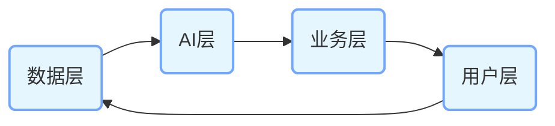

# 构建智能企业资源规划(ERP)系统：AI深度集成与优化

> 关键词：智能ERP系统、AI集成、企业资源规划、系统优化、数据驱动决策

> 摘要：本文聚焦于构建智能企业资源规划（ERP）系统并实现AI的深度集成与优化。详细阐述了智能ERP系统的核心概念、相关算法原理、数学模型，通过实际项目案例展示系统的开发与实现过程。探讨了智能ERP系统在不同场景下的应用，推荐了学习、开发所需的工具和资源，分析了其未来发展趋势与面临的挑战，并对常见问题进行解答。旨在为企业构建和优化智能ERP系统提供全面且深入的技术指导。

## 1. 背景介绍 
### 1.1 目的和范围
随着企业数字化转型的加速，传统的企业资源规划（ERP）系统已难以满足日益复杂的业务需求。本文章的目的在于探讨如何将人工智能（AI）技术深度集成到ERP系统中，以构建更智能、高效、灵活的企业资源管理解决方案。范围涵盖智能ERP系统的核心概念、算法原理、数学模型、项目实战、应用场景等多个方面，为企业和开发者提供全面的技术指导。

### 1.2 预期读者
本文预期读者包括企业管理人员、ERP系统开发者、人工智能研究人员以及对智能企业管理系统感兴趣的技术爱好者。企业管理人员可以通过本文了解智能ERP系统的优势和应用前景，为企业的数字化转型提供决策依据；开发者可以获取系统构建和优化的技术细节和实践经验；研究人员可以在相关领域开展进一步的学术研究。

### 1.3 文档结构概述
本文将按照以下结构展开：首先介绍核心概念与联系，明确智能ERP系统和AI集成的基本原理和架构；接着阐述核心算法原理及具体操作步骤，并给出Python源代码示例；然后讲解数学模型和公式，通过具体例子加深理解；之后进行项目实战，包括开发环境搭建、源代码实现和代码解读；再探讨实际应用场景；推荐学习、开发所需的工具和资源；最后总结未来发展趋势与挑战，解答常见问题，并提供扩展阅读和参考资料。

### 1.4 术语表
#### 1.4.1 核心术语定义
- **企业资源规划（ERP）系统**：是一种集成化的管理信息系统，它将企业的财务、采购、生产、销售、库存等各个业务环节整合在一起，实现企业资源的有效管理和优化配置。
- **人工智能（AI）**：是一门研究如何使计算机系统能够模拟人类智能的学科，包括机器学习、深度学习、自然语言处理、计算机视觉等多个领域。
- **智能ERP系统**：是将人工智能技术深度集成到传统ERP系统中，使系统具备智能决策、智能预测、智能分析等功能，能够自动处理复杂的业务问题，提高企业的运营效率和竞争力。

#### 1.4.2 相关概念解释
- **机器学习**：是人工智能的一个重要分支，它通过让计算机从数据中学习模式和规律，从而实现对未知数据的预测和分类。在智能ERP系统中，机器学习可以用于需求预测、风险评估、供应链优化等方面。
- **深度学习**：是一种基于人工神经网络的机器学习技术，它能够自动从大量数据中提取特征和模式，具有很强的学习能力和泛化能力。在智能ERP系统中，深度学习可以用于图像识别、语音识别、自然语言处理等方面。
- **数据挖掘**：是指从大量数据中发现有价值的信息和知识的过程。在智能ERP系统中，数据挖掘可以用于市场趋势分析、客户行为分析、产品质量分析等方面。

#### 1.4.3 缩略词列表
- **ERP**：Enterprise Resource Planning（企业资源规划）
- **AI**：Artificial Intelligence（人工智能）
- **ML**：Machine Learning（机器学习）
- **DL**：Deep Learning（深度学习）

## 2. 核心概念与联系 

### 核心概念原理
智能ERP系统的核心在于将人工智能技术与传统ERP系统的功能相结合，以实现更高效、智能的企业资源管理。传统ERP系统主要侧重于业务流程的自动化和数据的集中管理，而智能ERP系统则在此基础上引入了人工智能的智能决策、智能预测、智能分析等功能。

例如，在需求预测方面，传统ERP系统可能只能基于历史数据进行简单的统计分析，而智能ERP系统可以利用机器学习算法，结合市场趋势、季节因素、客户行为等多方面的数据，进行更准确的需求预测。在供应链管理方面，智能ERP系统可以通过深度学习算法对供应链中的风险进行实时监测和预警，提前采取措施避免供应链中断。

### 架构的文本示意图
智能ERP系统的架构可以分为以下几个层次：

1. **数据层**：负责收集、存储和管理企业的各种业务数据，包括财务数据、采购数据、生产数据、销售数据等。数据可以来自企业内部的各个业务系统，也可以来自外部的数据源，如市场数据、供应商数据等。
2. **AI层**：是智能ERP系统的核心层，负责实现人工智能的各种功能，如机器学习、深度学习、自然语言处理等。AI层可以对数据层的数据进行分析和处理，提取有价值的信息和知识，并为业务层提供智能决策支持。
3. **业务层**：负责实现企业的各种业务流程，如采购管理、生产管理、销售管理、财务管理等。业务层可以根据AI层提供的智能决策支持，自动调整业务流程，提高企业的运营效率和竞争力。
4. **用户层**：是企业用户与智能ERP系统进行交互的界面，包括Web界面、移动应用等。用户层可以提供直观、便捷的操作界面，方便企业用户使用智能ERP系统的各种功能。

### Mermaid流程图


该流程图展示了智能ERP系统的架构层次和数据流向。数据层为AI层提供数据支持，AI层对数据进行分析和处理后为业务层提供智能决策支持，业务层根据决策支持调整业务流程，最终用户通过用户层与系统进行交互。同时，用户的操作和反馈也会影响数据层的数据收集和更新。

## 3. 核心算法原理 & 具体操作步骤 

### 核心算法原理
在智能ERP系统中，常用的核心算法包括机器学习算法和深度学习算法，以下分别介绍几种常见算法的原理。

#### 线性回归算法
线性回归是一种用于预测连续数值的机器学习算法，其基本原理是通过寻找一条最佳的直线来拟合数据点，使得数据点到直线的距离之和最小。线性回归的数学模型可以表示为：

$$y = \theta_0 + \theta_1x_1 + \theta_2x_2 + \cdots + \theta_nx_n$$

其中，$y$ 是预测值，$x_1, x_2, \cdots, x_n$ 是输入特征，$\theta_0, \theta_1, \cdots, \theta_n$ 是模型的参数。

#### 逻辑回归算法
逻辑回归是一种用于分类的机器学习算法，其基本原理是通过对输入特征进行线性组合，然后通过逻辑函数将其转换为概率值，最后根据概率值进行分类。逻辑回归的数学模型可以表示为：

$$P(y = 1|x) = \frac{1}{1 + e^{-(\theta_0 + \theta_1x_1 + \theta_2x_2 + \cdots + \theta_nx_n)}}$$

其中，$P(y = 1|x)$ 是样本属于正类的概率，$x_1, x_2, \cdots, x_n$ 是输入特征，$\theta_0, \theta_1, \cdots, \theta_n$ 是模型的参数。

#### 神经网络算法
神经网络是一种模仿人类神经系统的深度学习算法，由多个神经元组成的网络结构。每个神经元接收输入信号，经过加权求和和激活函数处理后输出结果。神经网络可以自动从数据中学习复杂的特征和模式，具有很强的学习能力和泛化能力。

### 具体操作步骤及Python源代码
以下以线性回归算法为例，介绍在智能ERP系统中使用该算法进行需求预测的具体操作步骤和Python源代码。

#### 步骤1：数据准备
首先需要收集和整理历史销售数据，包括销售日期、销售数量、产品价格等信息。然后将数据分为训练集和测试集，用于模型的训练和评估。

```python
import pandas as pd
from sklearn.model_selection import train_test_split

# 读取数据
data = pd.read_csv('sales_data.csv')

# 提取特征和标签
X = data[['product_price', 'marketing_expense']]
y = data['sales_quantity']

# 划分训练集和测试集
X_train, X_test, y_train, y_test = train_test_split(X, y, test_size=0.2, random_state=42)
```

#### 步骤2：模型训练
使用训练集数据对线性回归模型进行训练，得到模型的参数。

```python
from sklearn.linear_model import LinearRegression

# 创建线性回归模型
model = LinearRegression()

# 训练模型
model.fit(X_train, y_train)
```

#### 步骤3：模型评估
使用测试集数据对训练好的模型进行评估，计算模型的预测准确率。

```python
from sklearn.metrics import mean_squared_error, r2_score

# 预测测试集数据
y_pred = model.predict(X_test)

# 计算均方误差和决定系数
mse = mean_squared_error(y_test, y_pred)
r2 = r2_score(y_test, y_pred)

print(f"均方误差: {mse}")
print(f"决定系数: {r2}")
```

#### 步骤4：模型应用
使用训练好的模型对未来的销售数量进行预测。

```python
# 假设新的产品价格和营销费用
new_data = [[200, 5000]]

# 预测销售数量
predicted_sales = model.predict(new_data)

print(f"预测销售数量: {predicted_sales[0]}")
```

通过以上步骤，我们可以使用线性回归算法在智能ERP系统中进行需求预测。其他机器学习算法和深度学习算法的使用步骤类似，只是具体的模型和参数不同。

## 4. 数学模型和公式 & 详细讲解 & 举例说明 

### 线性回归模型
线性回归模型是智能ERP系统中常用的数学模型之一，用于预测连续数值。其基本公式为：

$$y = \theta_0 + \theta_1x_1 + \theta_2x_2 + \cdots + \theta_nx_n$$

其中，$y$ 是预测值，$x_1, x_2, \cdots, x_n$ 是输入特征，$\theta_0, \theta_1, \cdots, \theta_n$ 是模型的参数。

#### 详细讲解
线性回归模型的目标是找到一组最优的参数 $\theta_0, \theta_1, \cdots, \theta_n$，使得预测值 $y$ 与真实值之间的误差最小。通常使用最小二乘法来求解最优参数，即最小化误差平方和：

$$J(\theta) = \frac{1}{2m}\sum_{i=1}^{m}(h_{\theta}(x^{(i)}) - y^{(i)})^2$$

其中，$m$ 是样本数量，$h_{\theta}(x^{(i)})$ 是第 $i$ 个样本的预测值，$y^{(i)}$ 是第 $i$ 个样本的真实值。

通过对 $J(\theta)$ 求偏导数并令其为零，可以得到最优参数的解析解：

$$\theta = (X^TX)^{-1}X^Ty$$

其中，$X$ 是输入特征矩阵，$y$ 是真实值向量。

#### 举例说明
假设我们要预测某产品的销售数量，输入特征包括产品价格 $x_1$ 和营销费用 $x_2$。我们收集了 100 个样本数据，使用线性回归模型进行预测。根据上述公式，我们可以计算出最优参数 $\theta_0, \theta_1, \theta_2$，从而得到预测模型：

$$y = \theta_0 + \theta_1x_1 + \theta_2x_2$$

例如，当产品价格为 200 元，营销费用为 5000 元时，我们可以将 $x_1 = 200$，$x_2 = 5000$ 代入预测模型，得到预测的销售数量。

### 逻辑回归模型
逻辑回归模型是用于分类的数学模型，其基本公式为：

$$P(y = 1|x) = \frac{1}{1 + e^{-(\theta_0 + \theta_1x_1 + \theta_2x_2 + \cdots + \theta_nx_n)}}$$

其中，$P(y = 1|x)$ 是样本属于正类的概率，$x_1, x_2, \cdots, x_n$ 是输入特征，$\theta_0, \theta_1, \cdots, \theta_n$ 是模型的参数。

#### 详细讲解
逻辑回归模型的目标是找到一组最优的参数 $\theta_0, \theta_1, \cdots, \theta_n$，使得模型对样本的分类准确率最高。通常使用对数损失函数来衡量模型的损失：

$$J(\theta) = -\frac{1}{m}\sum_{i=1}^{m}[y^{(i)}\log(h_{\theta}(x^{(i)})) + (1 - y^{(i)})\log(1 - h_{\theta}(x^{(i)}))]$$

其中，$m$ 是样本数量，$h_{\theta}(x^{(i)})$ 是第 $i$ 个样本属于正类的概率，$y^{(i)}$ 是第 $i$ 个样本的真实标签。

由于对数损失函数是凸函数，可以使用梯度下降法等优化算法来求解最优参数。

#### 举例说明
假设我们要对客户是否会购买某产品进行分类，输入特征包括客户的年龄 $x_1$、收入 $x_2$ 和购买历史 $x_3$。我们收集了 200 个样本数据，使用逻辑回归模型进行分类。根据上述公式，我们可以计算出最优参数 $\theta_0, \theta_1, \theta_2, \theta_3$，从而得到分类模型。

例如，当客户的年龄为 30 岁，收入为 8000 元，有购买历史时，我们可以将 $x_1 = 30$，$x_2 = 8000$，$x_3 = 1$ 代入分类模型，得到客户购买产品的概率。如果概率大于 0.5，则预测客户会购买产品；否则，预测客户不会购买产品。

## 5. 项目实战：代码实际案例和详细解释说明 

### 5.1  开发环境搭建
在进行智能ERP系统的开发之前，需要搭建相应的开发环境。以下是具体的搭建步骤：

#### 操作系统
建议使用 Linux 或 macOS 操作系统，因为它们对开发工具和库的支持更好。如果使用 Windows 操作系统，也可以通过安装 WSL（Windows Subsystem for Linux）来模拟 Linux 环境。

#### 编程语言
选择 Python 作为开发语言，因为 Python 具有丰富的科学计算和机器学习库，非常适合用于智能ERP系统的开发。

#### 开发工具
推荐使用 PyCharm 作为集成开发环境（IDE），它提供了丰富的代码编辑、调试和项目管理功能。

#### 数据库
选择 MySQL 作为数据库管理系统，用于存储企业的业务数据。可以使用 MySQL Workbench 来管理和操作数据库。

#### 机器学习库
安装以下常用的机器学习库：
- **NumPy**：用于进行数值计算和数组操作。
- **Pandas**：用于数据处理和分析。
- **Scikit-learn**：提供了丰富的机器学习算法和工具。
- **TensorFlow** 或 **PyTorch**：用于深度学习模型的开发和训练。

可以使用以下命令来安装这些库：

```bash
pip install numpy pandas scikit-learn tensorflow
```

### 5.2  源代码详细实现和代码解读
以下是一个简单的智能ERP系统的源代码示例，用于实现需求预测功能。

```python
import pandas as pd
from sklearn.model_selection import train_test_split
from sklearn.linear_model import LinearRegression
from sklearn.metrics import mean_squared_error, r2_score

# 步骤1：数据准备
def prepare_data():
    # 读取数据
    data = pd.read_csv('sales_data.csv')
    
    # 提取特征和标签
    X = data[['product_price', 'marketing_expense']]
    y = data['sales_quantity']
    
    # 划分训练集和测试集
    X_train, X_test, y_train, y_test = train_test_split(X, y, test_size=0.2, random_state=42)
    
    return X_train, X_test, y_train, y_test

# 步骤2：模型训练
def train_model(X_train, y_train):
    # 创建线性回归模型
    model = LinearRegression()
    
    # 训练模型
    model.fit(X_train, y_train)
    
    return model

# 步骤3：模型评估
def evaluate_model(model, X_test, y_test):
    # 预测测试集数据
    y_pred = model.predict(X_test)
    
    # 计算均方误差和决定系数
    mse = mean_squared_error(y_test, y_pred)
    r2 = r2_score(y_test, y_pred)
    
    print(f"均方误差: {mse}")
    print(f"决定系数: {r2}")

# 步骤4：模型应用
def apply_model(model):
    # 假设新的产品价格和营销费用
    new_data = [[200, 5000]]
    
    # 预测销售数量
    predicted_sales = model.predict(new_data)
    
    print(f"预测销售数量: {predicted_sales[0]}")

# 主函数
if __name__ == "__main__":
    # 数据准备
    X_train, X_test, y_train, y_test = prepare_data()
    
    # 模型训练
    model = train_model(X_train, y_train)
    
    # 模型评估
    evaluate_model(model, X_test, y_test)
    
    # 模型应用
    apply_model(model)
```

### 5.3  代码解读与分析
#### 数据准备
`prepare_data` 函数用于读取销售数据，并将其划分为训练集和测试集。使用 `pandas` 库读取 CSV 文件，使用 `sklearn` 库的 `train_test_split` 函数进行数据划分。

#### 模型训练
`train_model` 函数用于创建线性回归模型，并使用训练集数据进行训练。使用 `sklearn` 库的 `LinearRegression` 类创建模型，调用 `fit` 方法进行训练。

#### 模型评估
`evaluate_model` 函数用于评估训练好的模型。使用测试集数据进行预测，计算均方误差和决定系数，以评估模型的性能。

#### 模型应用
`apply_model` 函数用于使用训练好的模型进行预测。假设新的产品价格和营销费用，调用模型的 `predict` 方法进行预测。

通过以上代码，我们可以实现一个简单的智能ERP系统的需求预测功能。在实际应用中，可以根据具体需求对代码进行扩展和优化。

## 6. 实际应用场景 
智能ERP系统在企业的各个业务领域都有广泛的应用，以下是一些常见的应用场景：

### 需求预测
通过分析历史销售数据、市场趋势、季节因素等信息，使用机器学习算法进行需求预测。企业可以根据预测结果合理安排生产计划、采购原材料、制定销售策略，避免库存积压和缺货现象的发生。

### 供应链优化
利用人工智能技术对供应链中的各个环节进行实时监测和分析，包括供应商选择、采购管理、物流配送等。通过优化供应链流程，降低采购成本、提高物流效率、减少供应链风险。

### 质量控制
在生产过程中，使用计算机视觉和机器学习技术对产品质量进行实时检测和分析。及时发现产品质量问题，采取措施进行改进，提高产品质量和生产效率。

### 客户关系管理
通过分析客户的历史购买记录、行为数据、反馈信息等，使用人工智能技术进行客户细分、个性化推荐、客户流失预测等。企业可以根据客户的需求和偏好提供个性化的服务，提高客户满意度和忠诚度。

### 财务管理
利用人工智能技术对企业的财务数据进行分析和预测，包括财务报表分析、预算管理、风险评估等。帮助企业管理者做出更准确的财务决策，降低财务风险。

### 人力资源管理
在人力资源管理方面，智能ERP系统可以用于招聘筛选、员工绩效评估、培训需求分析等。通过分析员工的简历、工作表现、技能水平等信息，提高招聘效率、优化员工绩效、提升员工能力。

## 7. 工具和资源推荐
### 7.1 学习资源推荐
#### 7.1.1 书籍推荐
- 《Python机器学习》：这本书详细介绍了Python在机器学习领域的应用，包括各种机器学习算法的原理和实现。
- 《深度学习》：由深度学习领域的三位顶尖专家撰写，是深度学习领域的经典教材。
- 《企业资源规划：概念、方法与应用》：全面介绍了企业资源规划系统的概念、原理、方法和应用案例。

#### 7.1.2 在线课程
- Coursera上的“机器学习”课程：由斯坦福大学的Andrew Ng教授授课，是机器学习领域的经典课程。
- edX上的“深度学习”课程：由深度学习领域的知名学者授课，涵盖了深度学习的各个方面。
- 网易云课堂上的“企业资源规划系统开发与应用”课程：介绍了企业资源规划系统的开发流程和应用案例。

#### 7.1.3 技术博客和网站
- Medium：上面有很多关于人工智能和企业资源规划的技术文章和案例分享。
- 开源中国：提供了丰富的开源项目和技术文章，对智能ERP系统的开发有很大的帮助。
- 知乎：有很多关于人工智能和企业管理的讨论和分享，可以从中获取不同的观点和经验。

### 7.2 开发工具框架推荐
#### 7.2.1 IDE和编辑器
- PyCharm：是一款专门为Python开发设计的集成开发环境，具有丰富的代码编辑、调试和项目管理功能。
- Visual Studio Code：是一款轻量级的代码编辑器，支持多种编程语言，具有丰富的插件生态系统。

#### 7.2.2 调试和性能分析工具
- Py-Spy：用于分析Python程序的性能瓶颈，找出程序中耗时较长的部分。
- TensorBoard：是TensorFlow提供的可视化工具，用于监控和分析深度学习模型的训练过程。

#### 7.2.3 相关框架和库
- Scikit-learn：提供了丰富的机器学习算法和工具，方便开发者进行机器学习模型的开发和训练。
- TensorFlow：是一个开源的深度学习框架，广泛应用于图像识别、自然语言处理等领域。
- PyTorch：是另一个流行的深度学习框架，具有动态图和易于使用的特点。

### 7.3 相关论文著作推荐
#### 7.3.1 经典论文
- “Gradient-based learning applied to document recognition”：由Yann LeCun等人撰写，介绍了卷积神经网络在手写数字识别中的应用，是深度学习领域的经典论文。
- “Long Short-Term Memory”：由Sepp Hochreiter和Jürgen Schmidhuber撰写，提出了长短期记忆网络（LSTM），解决了传统循环神经网络的梯度消失问题。

#### 7.3.2 最新研究成果
- arXiv.org：是一个预印本平台，上面有很多关于人工智能和企业资源规划的最新研究成果。
- IEEE Xplore：是电气和电子工程师协会（IEEE）的数字图书馆，提供了大量的学术论文和研究报告。

#### 7.3.3 应用案例分析
- Gartner的研究报告：Gartner是一家知名的信息技术研究和咨询公司，其发布的研究报告涵盖了智能ERP系统的应用案例和市场趋势。
- 各大企业的官方网站：许多企业会在其官方网站上分享智能ERP系统的应用案例和实践经验。

## 8. 总结：未来发展趋势与挑战
### 未来发展趋势
- **更深入的AI集成**：未来智能ERP系统将进一步集成人工智能技术，如强化学习、知识图谱等，实现更智能的决策和预测。
- **与物联网的融合**：智能ERP系统将与物联网技术相结合，实现对企业生产设备、物流车辆等的实时监控和管理，提高企业的运营效率。
- **云原生架构**：采用云原生架构的智能ERP系统将成为主流，具有更高的灵活性、可扩展性和安全性。
- **行业定制化**：针对不同行业的特点和需求，开发定制化的智能ERP系统，提高系统的适用性和竞争力。

### 挑战
- **数据质量和安全**：智能ERP系统需要大量的高质量数据来支持人工智能算法的训练和应用，但数据质量和安全问题是一个挑战。企业需要加强数据管理和安全防护，确保数据的准确性、完整性和保密性。
- **人才短缺**：智能ERP系统的开发和应用需要具备人工智能和企业管理知识的复合型人才，但目前这类人才相对短缺。企业需要加强人才培养和引进，提高团队的技术水平和创新能力。
- **系统集成和兼容性**：智能ERP系统需要与企业现有的各种业务系统进行集成，确保数据的流通和共享。但不同系统之间的集成和兼容性问题是一个挑战，需要企业和开发者共同解决。
- **法律法规和伦理问题**：人工智能技术的应用涉及到法律法规和伦理问题，如数据隐私保护、算法偏见等。企业需要遵守相关的法律法规，确保人工智能技术的合法、合规和公正应用。

## 9. 附录：常见问题与解答
### 问题1：智能ERP系统与传统ERP系统有什么区别？
智能ERP系统在传统ERP系统的基础上引入了人工智能技术，具备智能决策、智能预测、智能分析等功能，能够自动处理复杂的业务问题，提高企业的运营效率和竞争力。而传统ERP系统主要侧重于业务流程的自动化和数据的集中管理。

### 问题2：如何选择适合企业的智能ERP系统？
选择适合企业的智能ERP系统需要考虑以下几个方面：
- **企业规模和业务需求**：不同规模和业务需求的企业对智能ERP系统的功能和性能要求不同。
- **系统的可扩展性和灵活性**：企业的业务会不断发展和变化，智能ERP系统需要具备良好的可扩展性和灵活性，以适应企业的发展需求。
- **系统的安全性和稳定性**：智能ERP系统涉及到企业的核心业务数据，需要具备高度的安全性和稳定性，确保数据的安全和业务的正常运行。
- **供应商的技术实力和服务水平**：选择有实力的供应商可以保证系统的质量和后续的技术支持。

### 问题3：智能ERP系统的实施难度大吗？
智能ERP系统的实施难度相对较大，需要企业具备一定的技术基础和管理能力。实施过程中需要进行业务流程梳理、数据清洗和整理、系统配置和开发、用户培训等工作。同时，还需要解决系统集成和兼容性问题，确保智能ERP系统与企业现有的各种业务系统能够无缝对接。

### 问题4：智能ERP系统的成本高吗？
智能ERP系统的成本包括软件采购成本、实施成本、维护成本等。与传统ERP系统相比，智能ERP系统的成本可能会相对较高，因为它需要引入人工智能技术和相关的硬件设备。但从长期来看，智能ERP系统可以提高企业的运营效率和竞争力，为企业带来更大的收益。

## 10. 扩展阅读 & 参考资料
- 《人工智能：现代方法》
- 《企业数字化转型：理论与实践》
- 各大科技媒体和技术论坛上关于智能ERP系统和人工智能的文章和讨论

作者：AI天才研究院/AI Genius Institute & 禅与计算机程序设计艺术 /Zen And The Art of Computer Programming