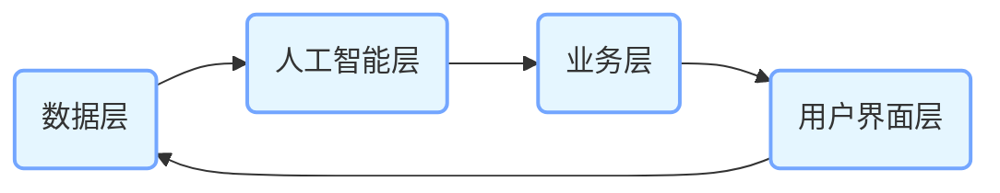

# 构建智能企业资源规划(ERP)系统：AI深度集成与实时优化

> 关键词：智能ERP系统、AI深度集成、实时优化、企业资源规划、人工智能应用

> 摘要：本文聚焦于构建智能企业资源规划（ERP）系统，探讨如何将AI进行深度集成并实现实时优化。详细介绍了智能ERP系统的背景知识，包括目的、预期读者、文档结构和相关术语。深入剖析了核心概念与联系，阐述了核心算法原理及操作步骤，借助Python代码进行详细说明。同时给出了数学模型和公式，并结合实际例子进行讲解。通过项目实战展示了代码案例及详细解释，分析了实际应用场景。推荐了相关的学习资源、开发工具框架和论文著作。最后总结了未来发展趋势与挑战，还包含常见问题解答和扩展阅读参考资料，旨在为企业构建智能ERP系统提供全面而深入的技术指导。

## 1. 背景介绍 
### 1.1 目的和范围
企业资源规划（ERP）系统在现代企业管理中扮演着至关重要的角色，它整合了企业的各种资源，包括财务、人力资源、供应链等，以实现高效的运营和管理。然而，传统的ERP系统在应对复杂多变的商业环境时，存在一定的局限性，如缺乏智能决策支持、无法实时适应市场变化等。

本文的目的在于探讨如何构建智能ERP系统，通过深度集成人工智能（AI）技术，实现系统的实时优化。具体范围涵盖了智能ERP系统的核心概念、算法原理、数学模型、项目实战、实际应用场景以及相关的工具和资源推荐等方面。

### 1.2 预期读者
本文的预期读者主要包括企业的信息技术部门人员，如CTO、软件架构师、程序员等，他们负责企业ERP系统的规划、开发和维护。同时，企业的管理人员也可以从本文中了解智能ERP系统的优势和应用价值，为企业的信息化战略决策提供参考。此外，对人工智能和企业资源规划领域感兴趣的研究人员和学生也可以通过本文深入了解相关技术和应用。

### 1.3 文档结构概述
本文将按照以下结构进行组织：
- 核心概念与联系：介绍智能ERP系统的核心概念，包括AI集成和实时优化的原理，并通过文本示意图和Mermaid流程图展示其架构。
- 核心算法原理 & 具体操作步骤：详细阐述实现智能ERP系统的核心算法原理，并给出具体的Python代码示例和操作步骤。
- 数学模型和公式 & 详细讲解 & 举例说明：建立智能ERP系统的数学模型，给出相关公式，并结合实际例子进行详细讲解。
- 项目实战：通过一个实际的项目案例，展示智能ERP系统的开发过程，包括开发环境搭建、源代码实现和代码解读。
- 实际应用场景：分析智能ERP系统在不同行业的实际应用场景和优势。
- 工具和资源推荐：推荐相关的学习资源、开发工具框架和论文著作。
- 总结：总结智能ERP系统的未来发展趋势与挑战。
- 附录：解答常见问题。
- 扩展阅读 & 参考资料：提供相关的扩展阅读材料和参考资料。

### 1.4 术语表
#### 1.4.1 核心术语定义
- **企业资源规划（ERP）系统**：是一种集成化的管理信息系统，它将企业的财务、人力资源、供应链、生产制造等各个业务环节进行整合，实现企业资源的有效配置和管理。
- **人工智能（AI）**：是一门研究如何使计算机能够模拟人类智能的学科，包括机器学习、深度学习、自然语言处理等技术。
- **智能ERP系统**：是在传统ERP系统的基础上，深度集成人工智能技术，实现系统的智能决策、实时优化和自适应调整的企业资源规划系统。
- **实时优化**：是指系统能够根据实时数据和业务变化，自动调整策略和决策，以实现最优的业务绩效。

#### 1.4.2 相关概念解释
- **机器学习**：是人工智能的一个重要分支，它通过让计算机从数据中学习模式和规律，从而实现对未知数据的预测和决策。
- **深度学习**：是一种基于人工神经网络的机器学习技术，它能够自动从大量数据中提取高级特征，具有很强的模式识别和预测能力。
- **自然语言处理**：是人工智能的另一个重要分支，它研究如何使计算机能够理解和处理人类语言，包括文本分类、情感分析、机器翻译等任务。

#### 1.4.3 缩略词列表
- **ERP**：Enterprise Resource Planning（企业资源规划）
- **AI**：Artificial Intelligence（人工智能）
- **ML**：Machine Learning（机器学习）
- **DL**：Deep Learning（深度学习）
- **NLP**：Natural Language Processing（自然语言处理）

## 2. 核心概念与联系 

### 核心概念原理
智能ERP系统的核心在于将人工智能技术深度集成到传统ERP系统中，实现系统的智能化和实时优化。具体来说，主要包括以下几个方面：

#### 数据驱动的决策
通过机器学习和深度学习算法，对企业的历史数据和实时数据进行分析和挖掘，发现数据中的模式和规律，为企业的决策提供支持。例如，通过分析销售数据预测未来的销售趋势，帮助企业制定合理的生产计划和库存策略。

#### 智能流程自动化
利用自然语言处理和机器人流程自动化（RPA）技术，实现企业业务流程的自动化处理。例如，自动处理采购订单、发票审核等重复性工作，提高工作效率和准确性。

#### 实时优化
根据实时数据和业务变化，动态调整系统的策略和决策，实现企业资源的最优配置。例如，在供应链管理中，根据实时的库存水平和订单需求，自动调整采购计划和物流配送方案。

### 架构的文本示意图
智能ERP系统的架构可以分为以下几个层次：

#### 数据层
负责收集、存储和管理企业的各种数据，包括财务数据、人力资源数据、供应链数据等。数据可以来自企业内部的各种信息系统，也可以来自外部的数据源，如市场数据、行业数据等。

#### 人工智能层
集成了各种人工智能技术，如机器学习、深度学习、自然语言处理等。该层负责对数据层的数据进行分析和挖掘，提取有价值的信息和知识，为业务层提供智能决策支持。

#### 业务层
包括企业的各个业务模块，如财务、人力资源、供应链、生产制造等。业务层根据人工智能层提供的决策支持，执行具体的业务流程，并将业务数据反馈给数据层。

#### 用户界面层
为企业用户提供友好的交互界面，方便用户使用智能ERP系统。用户可以通过界面查询数据、执行业务流程、查看决策建议等。

### Mermaid流程图


## 3. 核心算法原理 & 具体操作步骤 

### 核心算法原理
智能ERP系统中常用的核心算法包括机器学习算法和深度学习算法，下面分别介绍两种算法的原理。

#### 机器学习算法 - 线性回归
线性回归是一种常用的机器学习算法，用于预测连续值的输出。其基本原理是通过找到一条直线或超平面，使得数据点到该直线或超平面的距离之和最小。

线性回归的数学模型可以表示为：

$$y = \theta_0 + \theta_1x_1 + \theta_2x_2 + \cdots + \theta_nx_n$$

其中，$y$ 是预测值，$x_1, x_2, \cdots, x_n$ 是输入特征，$\theta_0, \theta_1, \theta_2, \cdots, \theta_n$ 是模型的参数。

为了找到最优的参数 $\theta$，通常使用最小二乘法来最小化预测值与真实值之间的误差平方和。

#### 深度学习算法 - 多层感知机（MLP）
多层感知机是一种前馈神经网络，由输入层、隐藏层和输出层组成。每个神经元接收前一层神经元的输出，并通过激活函数进行非线性变换，最终输出预测结果。

多层感知机的训练过程通常使用反向传播算法，通过不断调整神经元之间的权重，使得模型的预测结果与真实值之间的误差最小。

### 具体操作步骤及Python代码示例

#### 线性回归示例
```python
import numpy as np
from sklearn.linear_model import LinearRegression

# 生成示例数据
X = np.array([[1], [2], [3], [4], [5]])
y = np.array([2, 4, 6, 8, 10])

# 创建线性回归模型
model = LinearRegression()

# 训练模型
model.fit(X, y)

# 进行预测
new_X = np.array([[6]])
prediction = model.predict(new_X)

print("预测结果:", prediction)
```

#### 多层感知机示例
```python
import numpy as np
from sklearn.neural_network import MLPRegressor

# 生成示例数据
X = np.array([[1], [2], [3], [4], [5]])
y = np.array([2, 4, 6, 8, 10])

# 创建多层感知机模型
model = MLPRegressor(hidden_layer_sizes=(10,), max_iter=1000)

# 训练模型
model.fit(X, y)

# 进行预测
new_X = np.array([[6]])
prediction = model.predict(new_X)

print("预测结果:", prediction)
```

## 4. 数学模型和公式 & 详细讲解 & 举例说明 

### 线性回归数学模型和公式
线性回归的数学模型为：

$$y = \theta_0 + \theta_1x_1 + \theta_2x_2 + \cdots + \theta_nx_n$$

其中，$y$ 是预测值，$x_1, x_2, \cdots, x_n$ 是输入特征，$\theta_0, \theta_1, \theta_2, \cdots, \theta_n$ 是模型的参数。

误差平方和的公式为：

$$J(\theta) = \frac{1}{2m} \sum_{i=1}^{m} (h_{\theta}(x^{(i)}) - y^{(i)})^2$$

其中，$m$ 是样本数量，$h_{\theta}(x^{(i)})$ 是第 $i$ 个样本的预测值，$y^{(i)}$ 是第 $i$ 个样本的真实值。

为了最小化误差平方和，需要求解以下优化问题：

$$\min_{\theta} J(\theta)$$

通常使用梯度下降算法来求解该优化问题，梯度下降算法的更新公式为：

$$\theta_j := \theta_j - \alpha \frac{\partial}{\partial \theta_j} J(\theta)$$

其中，$\alpha$ 是学习率，控制每次更新的步长。

### 详细讲解
线性回归的目标是找到一组参数 $\theta$，使得预测值与真实值之间的误差平方和最小。误差平方和是一个凸函数，因此可以使用梯度下降算法来找到全局最优解。

梯度下降算法的基本思想是沿着误差函数的负梯度方向不断更新参数，直到达到收敛条件。学习率 $\alpha$ 决定了每次更新的步长，如果学习率过大，可能会导致算法无法收敛；如果学习率过小，算法的收敛速度会很慢。

### 举例说明
假设我们有一组房屋面积和价格的数据，我们想要使用线性回归来预测房屋价格。数据如下：

| 房屋面积（平方米） | 房屋价格（万元） |
| --- | --- |
| 50 | 100 |
| 70 | 140 |
| 90 | 180 |
| 110 | 220 |
| 130 | 260 |

我们可以使用线性回归模型来预测不同面积房屋的价格。首先，我们需要将数据进行预处理，将房屋面积作为输入特征 $x$，房屋价格作为输出 $y$。然后，使用上述的线性回归代码进行训练和预测。

```python
import numpy as np
from sklearn.linear_model import LinearRegression

# 数据
X = np.array([[50], [70], [90], [110], [130]])
y = np.array([100, 140, 180, 220, 260])

# 创建线性回归模型
model = LinearRegression()

# 训练模型
model.fit(X, y)

# 预测面积为 150 平方米的房屋价格
new_X = np.array([[150]])
prediction = model.predict(new_X)

print("预测价格:", prediction)
```

运行上述代码，我们可以得到面积为 150 平方米的房屋的预测价格。

## 5. 项目实战：代码实际案例和详细解释说明 

### 5.1  开发环境搭建
#### 安装Python
首先，需要安装Python环境。可以从Python官方网站（https://www.python.org/downloads/）下载适合自己操作系统的Python版本，并按照安装向导进行安装。

#### 安装必要的库
智能ERP系统的开发需要使用一些Python库，如NumPy、Pandas、Scikit-learn等。可以使用以下命令来安装这些库：

```bash
pip install numpy pandas scikit-learn
```

#### 选择开发工具
可以选择使用PyCharm、Jupyter Notebook等开发工具来进行代码的编写和调试。

### 5.2  源代码详细实现和代码解读
#### 数据准备
假设我们要构建一个简单的智能ERP系统，用于预测产品的销售量。首先，我们需要准备相关的数据。以下是一个示例数据文件 `sales_data.csv`：

```
日期,产品名称,销售量
2023-01-01,产品A,100
2023-01-02,产品A,120
2023-01-03,产品A,130
2023-01-04,产品A,150
2023-01-05,产品A,160
```

以下是读取数据并进行预处理的代码：

```python
import pandas as pd

# 读取数据
data = pd.read_csv('sales_data.csv')

# 提取特征和标签
X = data[['日期']]
y = data['销售量']

# 将日期转换为数值特征
X['日期'] = pd.to_datetime(X['日期']).astype(int) / 10**9

print("特征数据:", X)
print("标签数据:", y)
```

#### 模型训练和预测
接下来，我们使用线性回归模型进行训练和预测：

```python
from sklearn.linear_model import LinearRegression

# 创建线性回归模型
model = LinearRegression()

# 训练模型
model.fit(X, y)

# 预测未来一天的销售量
new_X = pd.DataFrame({'日期': [pd.to_datetime('2023-01-06').timestamp()]})
prediction = model.predict(new_X)

print("预测销售量:", prediction)
```

### 5.3  代码解读与分析
#### 数据准备部分
- 使用 `pandas` 库的 `read_csv` 函数读取 `sales_data.csv` 文件中的数据。
- 提取特征 `日期` 和标签 `销售量`。
- 将日期转换为数值特征，以便模型能够处理。

#### 模型训练和预测部分
- 使用 `sklearn` 库的 `LinearRegression` 类创建线性回归模型。
- 使用 `fit` 方法对模型进行训练。
- 构建新的特征数据 `new_X`，并使用 `predict` 方法进行预测。

通过以上代码，我们实现了一个简单的智能ERP系统，用于预测产品的销售量。

## 6. 实际应用场景 
### 供应链管理
在供应链管理中，智能ERP系统可以实时监测库存水平、订单需求和物流状态，通过AI算法预测未来的需求，自动调整采购计划和物流配送方案，实现供应链的实时优化。例如，根据实时的销售数据预测未来的库存需求，提前安排采购，避免库存积压或缺货现象的发生。

### 财务管理
智能ERP系统可以对企业的财务数据进行实时分析和监控，通过机器学习算法识别财务风险和异常交易，为企业的财务决策提供支持。例如，预测现金流状况，帮助企业合理安排资金，避免资金链断裂。

### 人力资源管理
在人力资源管理方面，智能ERP系统可以通过自然语言处理技术自动筛选简历，提高招聘效率。同时，通过分析员工的绩效数据和工作行为，为员工提供个性化的培训和发展建议，提高员工的工作满意度和绩效。

### 生产制造
智能ERP系统可以实时监控生产过程中的各种数据，如设备状态、生产进度、质量检测结果等。通过AI算法优化生产计划和调度，提高生产效率和产品质量。例如，根据设备的实时状态预测设备故障，提前安排维护，减少停机时间。

## 7. 工具和资源推荐
### 7.1 学习资源推荐
#### 7.1.1 书籍推荐
- 《Python机器学习》：本书详细介绍了Python在机器学习领域的应用，包括各种机器学习算法的原理和实现。
- 《深度学习》：由深度学习领域的三位先驱Ian Goodfellow、Yoshua Bengio和Aaron Courville撰写，是深度学习领域的经典教材。
- 《企业资源规划（第4版）》：全面介绍了企业资源规划系统的概念、原理和应用，是学习ERP系统的权威书籍。

#### 7.1.2 在线课程
- Coursera上的“机器学习”课程：由斯坦福大学的Andrew Ng教授授课，是机器学习领域的经典在线课程。
- edX上的“深度学习”课程：提供了深度学习的基础理论和实践项目，适合初学者和有一定基础的学习者。
- Udemy上的“Python数据科学和机器学习实战”课程：通过实际案例介绍Python在数据科学和机器学习领域的应用。

#### 7.1.3 技术博客和网站
- Medium：是一个汇聚了众多技术专家和开发者的博客平台，上面有很多关于人工智能和ERP系统的优秀文章。
- Towards Data Science：专注于数据科学和机器学习领域的技术博客，提供了很多实用的教程和案例。
- ERP Focus：是一个专门介绍企业资源规划系统的网站，提供了ERP系统的最新资讯、产品评测和应用案例。

### 7.2 开发工具框架推荐
#### 7.2.1 IDE和编辑器
- PyCharm：是一款专门为Python开发设计的集成开发环境，提供了丰富的代码编辑、调试和版本控制功能。
- Jupyter Notebook：是一个交互式的开发环境，适合进行数据探索、模型训练和可视化展示。
- Visual Studio Code：是一款轻量级的代码编辑器，支持多种编程语言，并且有丰富的插件扩展。

#### 7.2.2 调试和性能分析工具
- Py-Spy：是一个Python性能分析工具，可以实时监测Python程序的CPU使用情况和函数调用栈。
- cProfile：是Python标准库中的性能分析模块，可以分析Python程序的运行时间和函数调用次数。
- TensorBoard：是TensorFlow的可视化工具，可以用于可视化深度学习模型的训练过程和性能指标。

#### 7.2.3 相关框架和库
- NumPy：是Python中用于科学计算的基础库，提供了高效的数组操作和数学函数。
- Pandas：是Python中用于数据处理和分析的库，提供了灵活的数据结构和数据操作方法。
- Scikit-learn：是Python中用于机器学习的库，提供了各种机器学习算法的实现和工具。
- TensorFlow和PyTorch：是深度学习领域的两大主流框架，提供了高效的深度学习模型训练和部署功能。

### 7.3 相关论文著作推荐
#### 7.3.1 经典论文
- “Gradient-Based Learning Applied to Document Recognition”：由Yann LeCun等人发表，介绍了卷积神经网络（CNN）在手写字符识别中的应用，是深度学习领域的经典论文。
- “Long Short-Term Memory”：由Sepp Hochreiter和Jürgen Schmidhuber发表，提出了长短期记忆网络（LSTM），解决了循环神经网络（RNN）的梯度消失问题。
- “Mastering the game of Go with deep neural networks and tree search”：由DeepMind团队发表，介绍了AlphaGo使用深度学习和蒙特卡罗树搜索技术击败人类围棋冠军的方法。

#### 7.3.2 最新研究成果
- 关注arXiv.org上的最新论文，该网站汇集了计算机科学、人工智能等领域的最新研究成果。
- 参加国际人工智能会议，如NeurIPS、ICML、CVPR等，了解人工智能领域的最新研究动态。

#### 7.3.3 应用案例分析
- 《AI in ERP: Transforming Business Processes》：介绍了人工智能在ERP系统中的应用案例和实践经验。
- 《Real-Time Optimization in Enterprise Resource Planning Systems》：探讨了实时优化技术在ERP系统中的应用和挑战。

## 8. 总结：未来发展趋势与挑战
### 未来发展趋势
#### 更深入的AI集成
未来，智能ERP系统将进一步深入集成人工智能技术，如强化学习、知识图谱等，实现更加智能化的决策和优化。例如，通过强化学习算法自动调整企业的生产计划和库存策略，以适应不断变化的市场需求。

#### 与物联网的融合
随着物联网技术的发展，智能ERP系统将与物联网设备进行深度融合，实现对企业生产过程和供应链的实时监控和管理。例如，通过物联网传感器实时获取设备的运行状态和环境数据，为企业的设备维护和生产调度提供支持。

#### 云原生架构
云原生架构将成为智能ERP系统的主流架构，企业可以通过云计算平台实现ERP系统的快速部署和弹性扩展，降低企业的信息化成本。同时，云原生架构还可以提供更好的安全性和可靠性。

#### 行业定制化
不同行业的企业对ERP系统的需求存在差异，未来的智能ERP系统将更加注重行业定制化，为不同行业的企业提供个性化的解决方案。例如，为制造业企业提供生产制造管理模块，为零售业企业提供供应链管理和销售管理模块。

### 挑战
#### 数据安全和隐私问题
智能ERP系统集成了大量的企业数据，包括财务数据、客户信息、生产数据等，数据安全和隐私问题成为了企业关注的焦点。企业需要采取有效的数据安全措施，如数据加密、访问控制、备份恢复等，保护企业数据的安全和隐私。

#### 技术人才短缺
智能ERP系统的开发和维护需要具备人工智能、机器学习、大数据等多领域知识的技术人才，目前这类人才相对短缺。企业需要加强对技术人才的培养和引进，提高企业的技术创新能力。

#### 系统集成和兼容性问题
企业在实施智能ERP系统时，需要将其与现有的信息系统进行集成，如财务系统、人力资源系统、供应链系统等。不同系统之间的集成和兼容性问题可能会导致数据不一致、业务流程不畅等问题，需要企业进行有效的系统集成和测试。

#### 业务流程变革
智能ERP系统的实施需要企业对现有的业务流程进行优化和变革，这可能会遇到员工的抵触和阻力。企业需要加强对员工的培训和沟通，提高员工对业务流程变革的认识和接受度。

## 9. 附录：常见问题与解答
### 1. 智能ERP系统与传统ERP系统有什么区别？
智能ERP系统在传统ERP系统的基础上，深度集成了人工智能技术，实现了系统的智能决策、实时优化和自适应调整。与传统ERP系统相比，智能ERP系统能够更好地应对复杂多变的商业环境，提高企业的运营效率和竞争力。

### 2. 实施智能ERP系统需要注意哪些问题？
实施智能ERP系统需要注意以下几个问题：
- 明确企业的需求和目标，选择适合企业的智能ERP系统。
- 加强对员工的培训和沟通，提高员工对系统的接受度和使用能力。
- 做好数据准备工作，确保数据的准确性和完整性。
- 进行有效的系统集成和测试，确保系统与现有信息系统的兼容性。
- 建立完善的系统运维和管理机制，保障系统的稳定运行。

### 3. 智能ERP系统的成本高吗？
智能ERP系统的成本包括软件采购成本、实施成本、维护成本等。与传统ERP系统相比，智能ERP系统的成本可能会相对较高，因为它需要集成更多的人工智能技术和功能。但是，从长远来看，智能ERP系统能够提高企业的运营效率和竞争力，为企业带来更大的收益。

### 4. 智能ERP系统的安全性如何保障？
智能ERP系统的安全性可以通过以下几个方面来保障：
- 数据加密：对企业的敏感数据进行加密处理，防止数据泄露。
- 访问控制：设置不同的用户角色和权限，限制用户对系统和数据的访问。
- 备份恢复：定期对系统数据进行备份，以防止数据丢失。
- 安全审计：对系统的操作和访问进行审计，及时发现和处理安全事件。
- 网络安全：采取防火墙、入侵检测等网络安全措施，保护系统免受网络攻击。

## 10. 扩展阅读 & 参考资料
### 扩展阅读
- 《人工智能时代的企业数字化转型》：探讨了人工智能技术在企业数字化转型中的应用和挑战。
- 《大数据与企业决策》：介绍了大数据技术在企业决策中的应用和价值。
- 《工业4.0与智能制造》：阐述了工业4.0时代智能制造的发展趋势和技术应用。

### 参考资料
- [Python官方文档](https://docs.python.org/3/)
- [Scikit-learn官方文档](https://scikit-learn.org/stable/)
- [TensorFlow官方文档](https://www.tensorflow.org/api_docs)
- [PyTorch官方文档](https://pytorch.org/docs/stable/)

作者：AI天才研究院/AI Genius Institute & 禅与计算机程序设计艺术 /Zen And The Art of Computer Programming