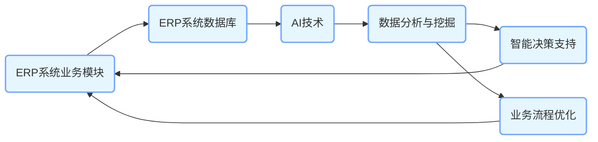

# 构建智能企业资源规划(ERP)系统：AI的深度集成

> 关键词：智能ERP系统、AI集成、企业资源规划、人工智能、数字化转型、业务流程优化、数据分析

> 摘要：本文围绕构建智能企业资源规划（ERP）系统中AI的深度集成展开。首先介绍了智能ERP系统及AI集成的背景，包括目的、预期读者、文档结构和相关术语。接着阐述了核心概念与联系，通过文本示意图和Mermaid流程图展示其原理和架构。详细讲解了核心算法原理及具体操作步骤，用Python代码进行阐述，还介绍了相关数学模型和公式并举例说明。通过项目实战，包括开发环境搭建、源代码实现与解读，展示了AI集成在ERP系统中的实际应用。探讨了智能ERP系统在不同场景的实际应用，推荐了学习资源、开发工具框架和相关论文著作。最后总结了未来发展趋势与挑战，提供常见问题解答和扩展阅读参考资料，旨在为企业构建智能ERP系统提供全面且深入的技术指导。

## 1. 背景介绍 
### 1.1 目的和范围
企业资源规划（ERP）系统作为企业管理的核心工具，涵盖了企业的财务、采购、生产、销售等多个关键业务流程。传统的ERP系统在处理日益复杂的业务数据和多变的市场环境时，逐渐暴露出效率低下、决策支持不足等问题。本文章的目的在于探讨如何将人工智能（AI）技术深度集成到ERP系统中，以提升ERP系统的智能化水平，实现企业业务流程的自动化、优化和决策的智能化。

本文的范围主要包括智能ERP系统中AI集成的核心概念、算法原理、数学模型、项目实战、实际应用场景以及相关的工具和资源推荐等方面，旨在为企业和技术人员提供全面的技术指导和实践参考。

### 1.2 预期读者
本文预期读者主要包括企业的高层管理人员、IT部门负责人、ERP系统的开发人员和维护人员、人工智能技术的研究人员和从业者等。对于企业管理人员，本文可以帮助他们了解AI集成对企业ERP系统升级和业务发展的重要性；对于技术人员，本文提供了详细的技术实现方案和实践案例，有助于他们在实际项目中应用和推广相关技术。

### 1.3 文档结构概述
本文将按照以下结构进行阐述：
1. **背景介绍**：介绍构建智能ERP系统中AI集成的目的、预期读者、文档结构和相关术语。
2. **核心概念与联系**：阐述智能ERP系统和AI集成的核心概念，通过文本示意图和Mermaid流程图展示其原理和架构。
3. **核心算法原理 & 具体操作步骤**：详细讲解AI集成中涉及的核心算法原理，并使用Python源代码进行具体操作步骤的阐述。
4. **数学模型和公式 & 详细讲解 & 举例说明**：介绍相关的数学模型和公式，并通过具体例子进行详细讲解。
5. **项目实战：代码实际案例和详细解释说明**：通过实际项目案例，介绍开发环境搭建、源代码实现和代码解读。
6. **实际应用场景**：探讨智能ERP系统在不同业务场景中的实际应用。
7. **工具和资源推荐**：推荐学习资源、开发工具框架和相关论文著作。
8. **总结：未来发展趋势与挑战**：总结智能ERP系统中AI集成的未来发展趋势和面临的挑战。
9. **附录：常见问题与解答**：提供常见问题的解答。
10. **扩展阅读 & 参考资料**：提供扩展阅读和参考资料。

### 1.4 术语表
#### 1.4.1 核心术语定义
- **企业资源规划（ERP）系统**：是一种集成化的管理信息系统，通过信息技术手段整合企业的财务、采购、生产、销售等业务流程，实现企业资源的优化配置和管理。
- **人工智能（AI）**：是研究、开发用于模拟、延伸和扩展人的智能的理论、方法、技术及应用系统的一门新的技术科学，包括机器学习、深度学习、自然语言处理等多个领域。
- **智能ERP系统**：是在传统ERP系统的基础上，集成了人工智能技术，实现业务流程自动化、智能决策支持等功能的新一代ERP系统。

#### 1.4.2 相关概念解释
- **机器学习**：是一门多领域交叉学科，涉及概率论、统计学、逼近论、凸分析、算法复杂度理论等多门学科。它专门研究计算机怎样模拟或实现人类的学习行为，以获取新的知识或技能，重新组织已有的知识结构使之不断改善自身的性能。
- **深度学习**：是机器学习的一个分支领域，它是一种基于对数据进行表征学习的方法。深度学习通过构建具有很多层的神经网络模型，自动从大量数据中学习特征和模式，从而实现对数据的分类、预测等任务。
- **自然语言处理**：是计算机科学与语言学的交叉领域，主要研究如何让计算机理解和处理人类语言。自然语言处理技术包括文本分类、情感分析、机器翻译、问答系统等。

#### 1.4.3 缩略词列表
- **ERP**：Enterprise Resource Planning（企业资源规划）
- **AI**：Artificial Intelligence（人工智能）
- **ML**：Machine Learning（机器学习）
- **DL**：Deep Learning（深度学习）
- **NLP**：Natural Language Processing（自然语言处理）

## 2. 核心概念与联系 

### 智能ERP系统的核心概念
智能ERP系统是传统ERP系统的智能化升级，它将人工智能技术融入到ERP系统的各个业务模块中，实现业务流程的自动化、智能化和决策的科学化。智能ERP系统的核心目标是提高企业的运营效率、降低成本、提升企业的竞争力。

### AI集成的核心概念
AI集成是指将人工智能技术与ERP系统进行深度融合，通过机器学习、深度学习、自然语言处理等技术，实现对ERP系统中大量业务数据的分析、挖掘和利用，从而为企业提供智能决策支持、业务流程优化等功能。

### 核心概念的联系
智能ERP系统和AI集成是相互依存、相互促进的关系。智能ERP系统为AI技术提供了丰富的业务数据和应用场景，而AI技术则为智能ERP系统提供了智能化的分析和决策能力，使得智能ERP系统能够更好地适应企业的业务需求和市场变化。

### 文本示意图
智能ERP系统的AI集成可以用以下文本示意图表示：

智能ERP系统由多个业务模块组成，包括财务、采购、生产、销售等。每个业务模块都产生大量的业务数据，这些数据被存储在ERP系统的数据库中。AI技术通过数据接口从ERP系统的数据库中获取数据，并对数据进行分析、挖掘和处理。处理后的结果可以反馈给ERP系统的各个业务模块，实现业务流程的自动化和优化，同时也可以为企业的管理层提供智能决策支持。

### Mermaid流程图


## 3. 核心算法原理 & 具体操作步骤 

### 核心算法原理
在智能ERP系统的AI集成中，常用的核心算法包括机器学习算法、深度学习算法和自然语言处理算法等。以下分别介绍这些算法的原理：

#### 机器学习算法
机器学习算法是AI集成中最常用的算法之一，它可以分为监督学习、无监督学习和强化学习等不同类型。在智能ERP系统中，监督学习算法常用于预测和分类任务，例如预测销售数据、分类客户等；无监督学习算法常用于聚类和异常检测任务，例如客户细分、异常交易检测等；强化学习算法常用于优化决策任务，例如供应链优化、生产调度等。

以线性回归算法为例，线性回归是一种监督学习算法，用于建立自变量和因变量之间的线性关系。其基本原理是通过最小化预测值与真实值之间的误差平方和，来确定线性回归模型的参数。

#### 深度学习算法
深度学习算法是一种基于神经网络的机器学习算法，它可以自动从大量数据中学习特征和模式。在智能ERP系统中，深度学习算法常用于图像识别、语音识别、自然语言处理等任务。例如，通过深度学习算法可以实现对发票图像的自动识别和分类，提高财务处理的效率。

以卷积神经网络（CNN）为例，CNN是一种专门用于处理具有网格结构数据的深度学习模型，例如图像数据。CNN通过卷积层、池化层和全连接层等组件，自动提取图像的特征，并进行分类或预测。

#### 自然语言处理算法
自然语言处理算法是一种用于处理人类语言的AI技术，它可以实现文本分类、情感分析、机器翻译、问答系统等功能。在智能ERP系统中，自然语言处理算法常用于客户服务、智能助手等场景。例如，通过自然语言处理算法可以实现对客户咨询的自动回答，提高客户服务的效率。

以词嵌入算法为例，词嵌入是一种将文本中的单词转换为向量表示的技术，它可以将单词的语义信息表示为向量空间中的位置。通过词嵌入算法，可以将文本数据转换为适合机器学习和深度学习算法处理的向量数据。

### 具体操作步骤
以下是使用Python实现线性回归算法的具体操作步骤：

```python
# 步骤1：导入必要的库
import numpy as np
from sklearn.linear_model import LinearRegression
from sklearn.model_selection import train_test_split
from sklearn.metrics import mean_squared_error

# 步骤2：准备数据
# 假设我们有一组自变量X和因变量y
X = np.array([[1], [2], [3], [4], [5]])
y = np.array([2, 4, 6, 8, 10])

# 步骤3：划分训练集和测试集
X_train, X_test, y_train, y_test = train_test_split(X, y, test_size=0.2, random_state=42)

# 步骤4：创建线性回归模型
model = LinearRegression()

# 步骤5：训练模型
model.fit(X_train, y_train)

# 步骤6：进行预测
y_pred = model.predict(X_test)

# 步骤7：评估模型
mse = mean_squared_error(y_test, y_pred)
print(f"均方误差: {mse}")
```

## 4. 数学模型和公式 & 详细讲解 & 举例说明 

### 线性回归的数学模型和公式
线性回归的数学模型可以表示为：

$$y = \theta_0 + \theta_1x_1 + \theta_2x_2 + \cdots + \theta_nx_n + \epsilon$$

其中，$y$ 是因变量，$x_1, x_2, \cdots, x_n$ 是自变量，$\theta_0, \theta_1, \cdots, \theta_n$ 是模型的参数，$\epsilon$ 是误差项。

线性回归的目标是通过最小化误差平方和来确定模型的参数。误差平方和可以表示为：

$$J(\theta) = \frac{1}{2m}\sum_{i=1}^{m}(h_{\theta}(x^{(i)}) - y^{(i)})^2$$

其中，$m$ 是样本数量，$h_{\theta}(x^{(i)})$ 是模型的预测值，$y^{(i)}$ 是真实值。

为了最小化误差平方和，可以使用梯度下降算法来更新模型的参数。梯度下降算法的更新公式为：

$$\theta_j := \theta_j - \alpha\frac{\partial J(\theta)}{\partial \theta_j}$$

其中，$\alpha$ 是学习率，$\frac{\partial J(\theta)}{\partial \theta_j}$ 是误差平方和关于参数 $\theta_j$ 的偏导数。

### 详细讲解
线性回归的基本思想是通过找到一条直线或超平面，使得所有样本点到该直线或超平面的距离之和最小。误差平方和是一种常用的衡量模型预测误差的指标，通过最小化误差平方和，可以使得模型的预测值尽可能接近真实值。

梯度下降算法是一种迭代优化算法，它通过不断更新模型的参数，使得误差平方和逐渐减小。学习率 $\alpha$ 控制了每次更新的步长，过大的学习率可能导致算法无法收敛，而过小的学习率则会导致算法收敛速度过慢。

### 举例说明
假设我们有一组数据，自变量 $x$ 表示房屋的面积，因变量 $y$ 表示房屋的价格。我们可以使用线性回归模型来预测房屋的价格。

```python
import numpy as np
from sklearn.linear_model import LinearRegression

# 准备数据
X = np.array([[100], [200], [300], [400], [500]])
y = np.array([200000, 400000, 600000, 800000, 1000000])

# 创建线性回归模型
model = LinearRegression()

# 训练模型
model.fit(X, y)

# 预测房屋价格
new_X = np.array([[600]])
predicted_price = model.predict(new_X)
print(f"预测的房屋价格: {predicted_price[0]}")
```

在这个例子中，我们使用线性回归模型来预测房屋的价格。通过训练模型，我们得到了一个线性回归方程，然后使用该方程来预测新的房屋价格。

## 5. 项目实战：代码实际案例和详细解释说明 

### 5.1  开发环境搭建
在进行智能ERP系统的AI集成项目实战之前，需要搭建相应的开发环境。以下是开发环境搭建的步骤：

#### 安装Python
Python是一种广泛使用的编程语言，在AI和数据分析领域有着丰富的库和工具。可以从Python官方网站（https://www.python.org/downloads/）下载并安装Python。

#### 安装相关库
在智能ERP系统的AI集成中，常用的库包括NumPy、Pandas、Scikit-learn、TensorFlow、PyTorch等。可以使用以下命令来安装这些库：

```bash
pip install numpy pandas scikit-learn tensorflow torch
```

#### 安装数据库
ERP系统通常需要使用数据库来存储业务数据。常用的数据库包括MySQL、PostgreSQL、Oracle等。可以根据实际需求选择合适的数据库，并进行安装和配置。

### 5.2  源代码详细实现和代码解读
以下是一个简单的智能ERP系统的AI集成项目的源代码实现和代码解读：

```python
import numpy as np
import pandas as pd
from sklearn.linear_model import LinearRegression
from sklearn.model_selection import train_test_split
from sklearn.metrics import mean_squared_error

# 步骤1：加载数据
# 假设我们有一个包含销售数据的CSV文件
data = pd.read_csv('sales_data.csv')

# 步骤2：数据预处理
# 提取自变量和因变量
X = data[['product_price', 'advertising_expense']]
y = data['sales_volume']

# 划分训练集和测试集
X_train, X_test, y_train, y_test = train_test_split(X, y, test_size=0.2, random_state=42)

# 步骤3：创建线性回归模型
model = LinearRegression()

# 步骤4：训练模型
model.fit(X_train, y_train)

# 步骤5：进行预测
y_pred = model.predict(X_test)

# 步骤6：评估模型
mse = mean_squared_error(y_test, y_pred)
print(f"均方误差: {mse}")

# 步骤7：预测新的销售数据
new_data = pd.DataFrame({'product_price': [100], 'advertising_expense': [200]})
predicted_sales = model.predict(new_data)
print(f"预测的销售数据: {predicted_sales[0]}")
```

### 代码解读与分析
- **步骤1：加载数据**：使用Pandas库的`read_csv`函数从CSV文件中加载销售数据。
- **步骤2：数据预处理**：提取自变量和因变量，并使用`train_test_split`函数将数据划分为训练集和测试集。
- **步骤3：创建线性回归模型**：使用Scikit-learn库的`LinearRegression`类创建线性回归模型。
- **步骤4：训练模型**：使用`fit`方法对模型进行训练。
- **步骤5：进行预测**：使用`predict`方法对测试集进行预测。
- **步骤6：评估模型**：使用`mean_squared_error`函数计算模型的均方误差，评估模型的性能。
- **步骤7：预测新的销售数据**：创建一个新的数据样本，使用训练好的模型进行预测。

## 6. 实际应用场景 
智能ERP系统的AI集成在企业的各个业务领域都有着广泛的应用场景，以下是一些常见的应用场景：

### 财务领域
- **财务预测**：通过AI技术对历史财务数据进行分析和挖掘，预测企业的收入、成本、利润等财务指标，为企业的财务决策提供支持。
- **风险评估**：利用机器学习算法对企业的财务风险进行评估，识别潜在的风险因素，帮助企业采取相应的风险控制措施。
- **智能审计**：通过自然语言处理技术对财务报表和会计凭证进行自动审核，提高审计效率和准确性。

### 采购领域
- **供应商选择**：使用AI算法对供应商的历史数据进行分析和评估，选择最合适的供应商，降低采购成本和风险。
- **采购预测**：根据企业的历史采购数据和市场需求，预测未来的采购需求，优化采购计划。
- **采购价格谈判**：通过AI技术对市场价格数据进行分析和预测，为采购人员提供价格谈判的参考依据。

### 生产领域
- **生产计划优化**：利用AI算法对生产数据进行分析和优化，制定最优的生产计划，提高生产效率