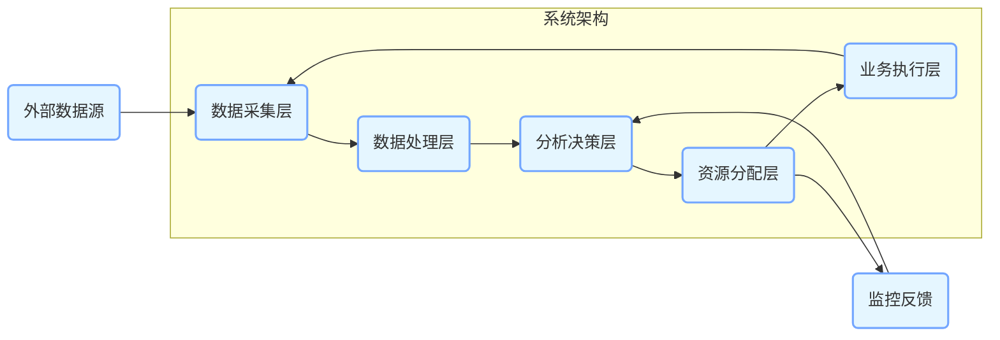

# 构建智能企业资源调度系统：实时优化与预测性分配

> 关键词：智能企业资源调度系统、实时优化、预测性分配、资源管理、算法应用

> 摘要：本文围绕构建智能企业资源调度系统展开，详细阐述了实时优化与预测性分配的核心概念、算法原理、数学模型等内容。通过深入剖析系统的架构和运行机制，结合实际案例展示了系统的开发与应用。同时，提供了丰富的学习资源、开发工具以及相关论文著作推荐。最后对智能企业资源调度系统的未来发展趋势与挑战进行了总结，并解答了常见问题，为企业构建和应用此类系统提供了全面且深入的参考。

## 1. 背景介绍 
### 1.1 目的和范围
在当今竞争激烈的商业环境中，企业面临着如何高效利用资源以提高生产效率、降低成本的挑战。智能企业资源调度系统旨在通过实时优化和预测性分配，实现企业资源的合理配置，提高企业的运营效率和竞争力。本文的范围涵盖了智能企业资源调度系统的核心概念、算法原理、数学模型、实际应用案例等方面，旨在为企业和技术人员提供全面的指导。

### 1.2 预期读者
本文预期读者包括企业管理人员、技术开发人员、研究人员等。对于企业管理人员，本文可以帮助他们了解智能企业资源调度系统的原理和优势，为企业的资源管理决策提供参考；对于技术开发人员，本文提供了系统开发的详细技术指导和代码示例；对于研究人员，本文可以作为进一步研究的基础。

### 1.3 文档结构概述
本文首先介绍了智能企业资源调度系统的背景信息，包括目的、预期读者和文档结构。接着阐述了核心概念与联系，包括系统的架构和流程。然后详细讲解了核心算法原理和具体操作步骤，并给出了数学模型和公式。通过实际案例展示了系统的开发与应用，包括开发环境搭建、源代码实现和代码解读。之后介绍了系统的实际应用场景和相关的工具、资源。最后对系统的未来发展趋势与挑战进行了总结，并解答了常见问题，提供了扩展阅读和参考资料。

### 1.4 术语表
#### 1.4.1 核心术语定义
- **智能企业资源调度系统**：利用先进的信息技术和算法，对企业的人力、物力、财力等资源进行实时监控、优化和预测性分配的系统。
- **实时优化**：在系统运行过程中，根据实时数据不断调整资源分配方案，以达到最优的资源利用效果。
- **预测性分配**：通过对历史数据和未来趋势的分析，提前预测资源需求，并进行合理的资源分配。
- **资源管理**：对企业的各种资源进行规划、组织、协调和控制，以实现资源的有效利用。

#### 1.4.2 相关概念解释
- **资源调度**：根据企业的生产计划和资源需求，合理安排资源的使用顺序和数量。
- **优化算法**：用于寻找最优资源分配方案的算法，如遗传算法、模拟退火算法等。
- **数据挖掘**：从大量数据中提取有价值信息的技术，用于预测资源需求和优化资源分配。

#### 1.4.3 缩略词列表
- **ERP**：Enterprise Resource Planning，企业资源计划
- **AI**：Artificial Intelligence，人工智能
- **ML**：Machine Learning，机器学习

## 2. 核心概念与联系 
### 核心概念原理
智能企业资源调度系统的核心原理是通过实时数据采集、分析和处理，结合优化算法和预测模型，实现资源的实时优化和预测性分配。系统首先从企业的各个业务系统中采集实时数据，包括生产进度、设备状态、人员考勤等。然后对这些数据进行分析和挖掘，提取有价值的信息，如资源需求趋势、设备故障预测等。接着，利用优化算法根据实时数据和预测结果，生成最优的资源分配方案。最后，将分配方案下发到各个业务系统，实现资源的合理配置。

### 架构示意图


### 流程解释
1. **数据采集层**：从企业的各个业务系统、传感器等数据源中采集实时数据。
2. **数据处理层**：对采集到的数据进行清洗、转换和存储，为后续的分析和处理做准备。
3. **分析决策层**：利用数据分析和挖掘技术，对处理后的数据进行分析，提取有价值的信息。同时，使用优化算法和预测模型，生成最优的资源分配方案。
4. **资源分配层**：将分析决策层生成的资源分配方案下发到各个业务系统，实现资源的合理配置。
5. **业务执行层**：各个业务系统根据资源分配方案执行相应的业务操作。
6. **监控反馈**：对业务执行情况进行实时监控，将监控数据反馈给分析决策层，以便及时调整资源分配方案。

## 3. 核心算法原理 & 具体操作步骤 
### 核心算法原理
在智能企业资源调度系统中，常用的优化算法有遗传算法、模拟退火算法、粒子群算法等。这里以遗传算法为例，详细介绍其原理。

遗传算法是一种模拟生物进化过程的优化算法，通过模拟自然选择和遗传机制，在解空间中搜索最优解。其基本思想是将问题的解表示为染色体，每个染色体由多个基因组成。通过选择、交叉和变异等遗传操作，不断生成新的染色体，直到找到最优解。

### Python源代码实现
```python
import random

# 定义问题的参数
population_size = 100
chromosome_length = 20
generations = 200
mutation_rate = 0.01

# 初始化种群
def initialize_population():
    population = []
    for _ in range(population_size):
        chromosome = [random.randint(0, 1) for _ in range(chromosome_length)]
        population.append(chromosome)
    return population

# 定义适应度函数
def fitness_function(chromosome):
    return sum(chromosome)

# 选择操作
def selection(population):
    fitness_scores = [fitness_function(chromosome) for chromosome in population]
    total_fitness = sum(fitness_scores)
    probabilities = [score / total_fitness for score in fitness_scores]
    selected_indexes = random.choices(range(population_size), weights=probabilities, k=2)
    return [population[i] for i in selected_indexes]

# 交叉操作
def crossover(parent1, parent2):
    crossover_point = random.randint(1, chromosome_length - 1)
    child1 = parent1[:crossover_point] + parent2[crossover_point:]
    child2 = parent2[:crossover_point] + parent1[crossover_point:]
    return child1, child2

# 变异操作
def mutation(chromosome):
    for i in range(chromosome_length):
        if random.random() < mutation_rate:
            chromosome[i] = 1 - chromosome[i]
    return chromosome

# 遗传算法主函数
def genetic_algorithm():
    population = initialize_population()
    for _ in range(generations):
        new_population = []
        for _ in range(population_size // 2):
            parents = selection(population)
            child1, child2 = crossover(parents[0], parents[1])
            child1 = mutation(child1)
            child2 = mutation(child2)
            new_population.extend([child1, child2])
        population = new_population
    best_chromosome = max(population, key=fitness_function)
    return best_chromosome

# 运行遗传算法
best_solution = genetic_algorithm()
print("最优解:", best_solution)
print("最优解的适应度:", fitness_function(best_solution))
```

### 具体操作步骤
1. **初始化种群**：随机生成一定数量的染色体，组成初始种群。
2. **计算适应度**：根据适应度函数计算每个染色体的适应度值。
3. **选择操作**：根据适应度值选择一定数量的染色体作为父代。
4. **交叉操作**：对父代染色体进行交叉操作，生成子代染色体。
5. **变异操作**：对子代染色体进行变异操作，增加种群的多样性。
6. **更新种群**：用子代染色体替换父代染色体，形成新的种群。
7. **终止条件判断**：如果达到预设的迭代次数或满足其他终止条件，则停止迭代，输出最优解；否则，返回步骤2继续迭代。

## 4. 数学模型和公式 & 详细讲解 & 举例说明 
### 数学模型
在智能企业资源调度系统中，资源分配问题可以抽象为一个优化问题。假设企业有 $n$ 种资源，$m$ 个任务，每种资源的总量为 $R_i$ ($i = 1, 2, \cdots, n$)，每个任务对每种资源的需求量为 $r_{ij}$ ($i = 1, 2, \cdots, n$; $j = 1, 2, \cdots, m$)，任务 $j$ 的优先级为 $p_j$，任务 $j$ 的完成时间为 $t_j$。我们的目标是在满足资源约束的前提下，最大化所有任务的优先级之和。

### 数学公式
#### 目标函数
$$\max \sum_{j=1}^{m} p_j x_j$$

#### 约束条件
$$\sum_{j=1}^{m} r_{ij} x_j \leq R_i, \quad i = 1, 2, \cdots, n$$
$$x_j \in \{0, 1\}, \quad j = 1, 2, \cdots, m$$

其中，$x_j$ 是一个二进制变量，表示任务 $j$ 是否被分配资源，$x_j = 1$ 表示分配，$x_j = 0$ 表示不分配。

### 详细讲解
目标函数表示要最大化所有任务的优先级之和，即优先分配优先级高的任务。约束条件表示每种资源的使用量不能超过其总量，同时 $x_j$ 是二进制变量，保证每个任务要么被分配资源，要么不被分配。

### 举例说明
假设企业有两种资源，分别为人力和设备，总量分别为 $R_1 = 10$ 和 $R_2 = 8$。有三个任务，每个任务对资源的需求量和优先级如下表所示：

| 任务 | 人力需求 $r_{1j}$ | 设备需求 $r_{2j}$ | 优先级 $p_j$ |
| ---- | ---------------- | ---------------- | ------------ |
| 任务1 | 3 | 2 | 5 |
| 任务2 | 4 | 3 | 7 |
| 任务3 | 2 | 4 | 6 |

根据上述数学模型和公式，我们可以列出目标函数和约束条件：

#### 目标函数
$$\max 5x_1 + 7x_2 + 6x_3$$

#### 约束条件
$$3x_1 + 4x_2 + 2x_3 \leq 10$$
$$2x_1 + 3x_2 + 4x_3 \leq 8$$
$$x_1, x_2, x_3 \in \{0, 1\}$$

通过求解上述优化问题，我们可以得到最优的资源分配方案。

## 5. 项目实战：代码实际案例和详细解释说明 
### 5.1  开发环境搭建
#### 硬件环境
- 服务器：建议使用多核处理器、大容量内存和高速硬盘的服务器，以满足系统的性能需求。
- 客户端：普通的台式机或笔记本电脑即可。

#### 软件环境
- 操作系统：服务器端建议使用 Linux 操作系统，如 Ubuntu、CentOS 等；客户端可以使用 Windows、Mac OS 等操作系统。
- 编程语言：Python，建议使用 Python 3.7 及以上版本。
- 数据库：MySQL、PostgreSQL 等关系型数据库，用于存储系统的业务数据。
- Web 框架：Flask、Django 等，用于开发系统的 Web 界面。

### 5.2  源代码详细实现和代码解读
以下是一个简单的智能企业资源调度系统的 Python 代码示例，使用 Flask 框架开发 Web 界面，MySQL 数据库存储数据。

```python
from flask import Flask, request, jsonify
import mysql.connector

app = Flask(__name__)

# 数据库连接配置
db_config = {
    'user': 'your_username',
    'password': 'your_password',
    'host': 'your_host',
    'database': 'your_database'
}

# 连接数据库
def connect_to_database():
    return mysql.connector.connect(**db_config)

# 添加任务
@app.route('/add_task', methods=['POST'])
def add_task():
    data = request.get_json()
    task_name = data.get('task_name')
    resource_demand = data.get('resource_demand')
    priority = data.get('priority')

    conn = connect_to_database()
    cursor = conn.cursor()
    query = "INSERT INTO tasks (task_name, resource_demand, priority) VALUES (%s, %s, %s)"
    values = (task_name, resource_demand, priority)
    cursor.execute(query, values)
    conn.commit()
    cursor.close()
    conn.close()

    return jsonify({'message': '任务添加成功'})

# 获取所有任务
@app.route('/get_tasks', methods=['GET'])
def get_tasks():
    conn = connect_to_database()
    cursor = conn.cursor()
    query = "SELECT * FROM tasks"
    cursor.execute(query)
    tasks = cursor.fetchall()
    cursor.close()
    conn.close()

    task_list = []
    for task in tasks:
        task_dict = {
            'id': task[0],
            'task_name': task[1],
            'resource_demand': task[2],
            'priority': task[3]
        }
        task_list.append(task_dict)

    return jsonify(task_list)

if __name__ == '__main__':
    app.run(debug=True)
```

### 代码解读与分析
1. **数据库连接**：通过 `connect_to_database` 函数建立与 MySQL 数据库的连接。
2. **添加任务**：通过 `/add_task` 接口接收客户端发送的任务信息，将任务信息插入到数据库中。
3. **获取所有任务**：通过 `/get_tasks` 接口从数据库中查询所有任务信息，并返回给客户端。

## 6. 实际应用场景 
### 制造业
在制造业中，智能企业资源调度系统可以用于生产计划安排、设备调度和人员分配。通过实时监控生产进度和设备状态，系统可以根据订单需求和资源状况，动态调整生产计划，优化设备和人员的使用效率，提高生产效率和产品质量。

### 物流配送业
在物流配送业中，系统可以用于车辆调度、货物分配和路线规划。通过实时获取车辆位置、货物重量和目的地等信息，系统可以根据交通状况和配送需求，合理安排车辆的行驶路线和货物的装载顺序，降低物流成本，提高配送效率。

### 服务业
在服务业中，系统可以用于员工排班、客户分配和资源利用。例如，在酒店行业，系统可以根据客房预订情况和员工技能水平，合理安排员工的工作班次和服务任务，提高客户满意度和服务质量。

## 7. 工具和资源推荐
### 7.1 学习资源推荐
#### 7.1.1 书籍推荐
- 《Python 数据分析实战》：介绍了 Python 在数据分析领域的应用，包括数据采集、清洗、分析和可视化等方面的知识。
- 《机器学习实战》：通过实际案例介绍了机器学习的基本算法和应用，适合初学者入门。
- 《企业资源计划（ERP）原理与应用》：系统介绍了企业资源计划的基本原理、功能模块和实施方法。

#### 7.1.2 在线课程
- Coursera 上的 “Data Science Specialization”：由多所知名大学联合开设的数据分析课程，涵盖了数据科学的各个方面。
- edX 上的 “Machine Learning”：由斯坦福大学教授 Andrew Ng 主讲的机器学习课程，是机器学习领域的经典课程。
- 网易云课堂上的 “企业资源计划（ERP）实战教程”：介绍了企业资源计划系统的实施和应用。

#### 7.1.3 技术博客和网站
- 博客园：国内知名的技术博客平台，有很多关于数据分析、机器学习和企业资源管理的技术文章。
- 开源中国：提供了丰富的开源项目和技术文章，涵盖了软件开发的各个领域。
- Kaggle：全球知名的数据科学竞赛平台，有很多优秀的数据科学项目和解决方案。

### 7.2 开发工具框架推荐
#### 7.2.1 IDE和编辑器
- PyCharm：专业的 Python 集成开发环境，提供了代码编辑、调试、版本控制等功能。
- Visual Studio Code：轻量级的代码编辑器，支持多种编程语言，有丰富的插件扩展。

#### 7.2.2 调试和性能分析工具
- Py-Spy：用于分析 Python 程序的性能瓶颈，找出程序中耗时较长的代码段。
- Flask-DebugToolbar：Flask 框架的调试工具，提供了详细的调试信息和性能分析报告。

#### 7.2.3 相关框架和库
- Pandas：用于数据处理和分析的 Python 库，提供了高效的数据结构和数据分析工具。
- Scikit-learn：用于机器学习的 Python 库，提供了丰富的机器学习算法和工具。
- Flask：轻量级的 Web 框架，适合快速开发 Web 应用。

### 7.3 相关论文著作推荐
#### 7.3.1 经典论文
- “Genetic Algorithms in Search, Optimization, and Machine Learning”：遗传算法领域的经典论文，介绍了遗传算法的基本原理和应用。
- “Simulated Annealing Optimization”：模拟退火算法的经典论文，阐述了模拟退火算法的原理和应用。

#### 7.3.2 最新研究成果
- 在 IEEE Transactions on Industrial Informatics、ACM Transactions on Intelligent Systems and Technology 等期刊上可以找到关于智能企业资源调度系统的最新研究成果。

#### 7.3.3 应用案例分析
- 一些企业的官方网站或行业报告中会发布智能企业资源调度系统的应用案例分析，这些案例可以为我们提供实际应用的参考。

## 8. 总结：未来发展趋势与挑战
### 未来发展趋势
- **智能化程度不断提高**：随着人工智能和机器学习技术的不断发展，智能企业资源调度系统将具备更强的自主学习和决策能力，能够自动适应企业的业务变化和环境变化。
- **与物联网深度融合**：物联网技术的发展将使得企业能够实时获取更多的设备状态和生产数据，智能企业资源调度系统可以结合这些数据进行更精准的资源调度和优化。
- **云化和移动化**：越来越多的企业将采用云计算和移动应用技术，智能企业资源调度系统也将向云化和移动化方向发展，方便企业管理人员随时随地进行资源调度和管理。

### 挑战
- **数据安全和隐私问题**：智能企业资源调度系统需要处理大量的企业敏感数据，如生产计划、客户信息等，数据安全和隐私保护是一个重要的挑战。
- **算法复杂度和计算资源需求**：随着企业业务的不断复杂和数据量的不断增加，优化算法的复杂度和计算资源需求也会相应增加，如何在有限的计算资源下实现高效的资源调度是一个挑战。
- **人员培训和技术普及**：智能企业资源调度系统涉及到人工智能、机器学习等先进技术，企业需要对相关人员进行培训，提高他们的技术水平和应用能力。

## 9. 附录：常见问题与解答
### 问题1：智能企业资源调度系统需要哪些数据？
答：智能企业资源调度系统需要企业的各种业务数据，包括生产进度、设备状态、人员考勤、订单信息、资源库存等。这些数据可以从企业的各个业务系统中采集，也可以通过传感器等设备实时获取。

### 问题2：如何选择合适的优化算法？
答：选择合适的优化算法需要考虑问题的特点、数据规模和计算资源等因素。对于简单的问题，可以选择一些传统的优化算法，如线性规划、整数规划等；对于复杂的问题，可以选择一些启发式算法，如遗传算法、模拟退火算法等。

### 问题3：系统的实施难度大吗？
答：系统的实施难度取决于企业的业务复杂度、数据质量和技术水平等因素。一般来说，实施智能企业资源调度系统需要企业进行一定的业务流程改造和数据治理，同时需要具备一定的技术实力和人才储备。

## 10. 扩展阅读 & 参考资料
- 《人工智能基础教程》
- 《企业信息化建设与管理》
- IEEE Xplore、ACM Digital Library 等学术数据库中的相关论文
- 企业资源计划系统供应商的官方文档和案例分析

作者：AI天才研究院/AI Genius Institute & 禅与计算机程序设计艺术 /Zen And The Art of Computer Programming