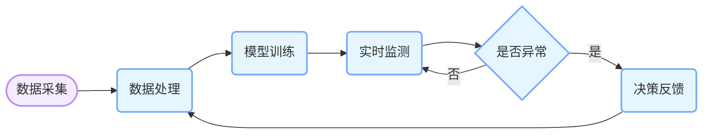

# 构建智能企业风控系统：实时交易监控与欺诈检测的AI增强

> 关键词：智能企业风控系统、实时交易监控、欺诈检测、AI增强、机器学习

> 摘要：本文聚焦于构建智能企业风控系统，着重探讨实时交易监控与欺诈检测的AI增强技术。详细介绍了该系统的背景知识，包括目的、预期读者等；深入剖析核心概念及联系，阐述核心算法原理与操作步骤，给出数学模型和公式；通过项目实战展示代码实现与解读；列举实际应用场景，推荐相关工具和资源；最后总结未来发展趋势与挑战，并对常见问题进行解答，为企业构建智能风控系统提供全面且深入的指导。

## 1. 背景介绍 
### 1.1 目的和范围
在当今数字化时代，企业面临着日益复杂和多样化的风险，尤其是在交易环节，欺诈行为不断涌现，给企业带来了巨大的经济损失。构建智能企业风控系统，实现实时交易监控与欺诈检测的AI增强，旨在利用先进的人工智能技术，及时、准确地识别交易中的异常行为和欺诈风险，帮助企业降低损失，保障业务的安全稳定运行。

本文章的范围涵盖了智能企业风控系统的各个方面，从核心概念的介绍、算法原理的讲解、数学模型的分析，到项目实战的代码实现，以及实际应用场景的探讨和相关工具资源的推荐等，为企业全面了解和构建智能风控系统提供了一站式的知识体系。

### 1.2 预期读者
本文预期读者包括企业的风控管理人员、技术研发人员、数据分析师、金融机构的从业人员等。对于风控管理人员，本文可以帮助他们了解如何利用AI技术提升企业的风控能力；技术研发人员可以从中获取构建智能风控系统的技术细节和实现方法；数据分析师可以学习如何运用数据分析和机器学习算法进行欺诈检测；金融机构从业人员则可以借鉴相关经验，优化自身的风控体系。

### 1.3 文档结构概述
本文将按照以下结构进行组织：
- 核心概念与联系：介绍智能企业风控系统、实时交易监控、欺诈检测和AI增强等核心概念，并阐述它们之间的联系。
- 核心算法原理 & 具体操作步骤：详细讲解用于实时交易监控和欺诈检测的核心算法原理，并给出具体的操作步骤，同时使用Python源代码进行详细阐述。
- 数学模型和公式 & 详细讲解 & 举例说明：分析相关的数学模型和公式，进行详细讲解，并通过具体的例子进行说明。
- 项目实战：代码实际案例和详细解释说明：通过一个实际的项目案例，展示智能企业风控系统的开发过程，包括开发环境搭建、源代码详细实现和代码解读。
- 实际应用场景：列举智能企业风控系统在不同行业的实际应用场景。
- 工具和资源推荐：推荐相关的学习资源、开发工具框架和论文著作。
- 总结：未来发展趋势与挑战：总结智能企业风控系统的未来发展趋势和面临的挑战。
- 附录：常见问题与解答：对读者可能关心的常见问题进行解答。
- 扩展阅读 & 参考资料：提供相关的扩展阅读资料和参考书目。

### 1.4 术语表
#### 1.4.1 核心术语定义
- 智能企业风控系统：利用人工智能技术，对企业运营过程中的各种风险进行实时监测、分析和预警的系统。
- 实时交易监控：对企业的交易活动进行实时跟踪和监测，及时发现异常交易行为的过程。
- 欺诈检测：通过对交易数据的分析和挖掘，识别出欺诈性交易的技术和方法。
- AI增强：利用人工智能技术，如机器学习、深度学习等，对传统的风控方法进行改进和优化，提高风控系统的准确性和效率。

#### 1.4.2 相关概念解释
- 机器学习：是一门多领域交叉学科，涉及概率论、统计学、逼近论、凸分析、算法复杂度理论等多门学科。它专门研究计算机怎样模拟或实现人类的学习行为，以获取新的知识或技能，重新组织已有的知识结构使之不断改善自身的性能。
- 深度学习：是机器学习的一个分支领域，它是一种基于对数据进行表征学习的方法。深度学习通过构建具有很多层的神经网络模型，自动从大量数据中学习特征和模式。

#### 1.4.3 缩略词列表
- AI：Artificial Intelligence，人工智能
- ML：Machine Learning，机器学习
- DL：Deep Learning，深度学习
- RNN：Recurrent Neural Network，循环神经网络
- LSTM：Long Short-Term Memory，长短期记忆网络
- CNN：Convolutional Neural Network，卷积神经网络

## 2. 核心概念与联系 
### 核心概念原理
#### 智能企业风控系统
智能企业风控系统是一个综合性的系统，它集成了多种技术和方法，旨在对企业运营过程中的各种风险进行全面、实时的监测和管理。该系统通过收集和分析企业的各种数据，如交易数据、客户数据、市场数据等，利用人工智能和机器学习算法，识别出潜在的风险因素，并及时发出预警。

#### 实时交易监控
实时交易监控是智能企业风控系统的重要组成部分，它通过对企业的交易活动进行实时跟踪和监测，及时发现异常交易行为。实时交易监控系统通常会设置一系列的规则和阈值，当交易数据超出这些规则和阈值时，系统会自动发出警报。

#### 欺诈检测
欺诈检测是智能企业风控系统的核心功能之一，它通过对交易数据的分析和挖掘，识别出欺诈性交易。欺诈检测系统通常会使用机器学习和深度学习算法，对大量的历史交易数据进行训练，以学习欺诈交易的特征和模式，从而对新的交易进行准确的判断。

#### AI增强
AI增强是指利用人工智能技术，如机器学习、深度学习等，对传统的风控方法进行改进和优化，提高风控系统的准确性和效率。AI增强可以帮助企业更好地应对日益复杂和多样化的风险，提高企业的竞争力。

### 架构的文本示意图
智能企业风控系统主要由数据采集层、数据处理层、模型训练层、实时监测层和决策反馈层组成。

- 数据采集层：负责收集企业的各种数据，如交易数据、客户数据、市场数据等。
- 数据处理层：对采集到的数据进行清洗、预处理和特征提取，以便后续的分析和建模。
- 模型训练层：利用机器学习和深度学习算法，对处理后的数据进行训练，构建欺诈检测模型。
- 实时监测层：对企业的实时交易数据进行监测，利用训练好的模型对交易进行实时判断，及时发现异常交易行为。
- 决策反馈层：根据实时监测的结果，做出相应的决策，如拒绝交易、限制交易、发出预警等，并将决策结果反馈给相关部门。

### Mermaid流程图


## 3. 核心算法原理 & 具体操作步骤 
### 核心算法原理
在实时交易监控和欺诈检测中，常用的机器学习算法包括逻辑回归、决策树、随机森林、支持向量机等，深度学习算法包括循环神经网络（RNN）、长短期记忆网络（LSTM）、卷积神经网络（CNN）等。下面以逻辑回归和LSTM为例，介绍其原理。

#### 逻辑回归
逻辑回归是一种广泛应用于分类问题的机器学习算法，它通过对输入特征进行线性组合，然后使用逻辑函数将线性组合的结果映射到[0, 1]区间，从而得到样本属于某个类别的概率。逻辑函数的公式为：

$$
\sigma(z)=\frac{1}{1 + e^{-z}}
$$

其中，$z$ 是线性组合的结果，$\sigma(z)$ 是逻辑函数的输出。逻辑回归的目标是通过训练数据，找到一组最优的参数 $\theta$，使得模型对训练数据的预测概率最大。

#### 长短期记忆网络（LSTM）
LSTM是一种特殊的循环神经网络，它能够有效地解决传统RNN中的梯度消失和梯度爆炸问题，从而能够处理更长的序列数据。LSTM通过引入门控机制，控制信息的流动和遗忘，使得模型能够更好地捕捉序列数据中的长期依赖关系。

LSTM单元主要由输入门 $i_t$、遗忘门 $f_t$、输出门 $o_t$ 和细胞状态 $C_t$ 组成。其计算公式如下：

$$
\begin{align*}
f_t&=\sigma(W_f[h_{t - 1}, x_t]+b_f)\\
i_t&=\sigma(W_i[h_{t - 1}, x_t]+b_i)\\
\tilde{C}_t&=\tanh(W_C[h_{t - 1}, x_t]+b_C)\\
C_t&=f_t\odot C_{t - 1}+i_t\odot\tilde{C}_t\\
o_t&=\sigma(W_o[h_{t - 1}, x_t]+b_o)\\
h_t&=o_t\odot\tanh(C_t)
\end{align*}
$$

其中，$x_t$ 是当前时刻的输入，$h_{t - 1}$ 是上一时刻的隐藏状态，$W_f$、$W_i$、$W_C$、$W_o$ 是权重矩阵，$b_f$、$b_i$、$b_C$、$b_o$ 是偏置向量，$\odot$ 表示元素级乘法。

### 具体操作步骤
#### 数据准备
- 收集企业的交易数据，包括交易金额、交易时间、交易地点、客户信息等。
- 对数据进行清洗，去除缺失值、异常值和重复值。
- 对数据进行预处理，如标准化、归一化等，以提高模型的训练效果。

#### 特征工程
- 从原始数据中提取有意义的特征，如交易频率、交易金额的波动、客户的信用评分等。
- 对特征进行筛选和降维，去除冗余特征，提高模型的训练效率。

#### 模型训练
- 划分训练集和测试集，将数据按照一定的比例划分为训练集和测试集。
- 选择合适的算法，如逻辑回归、LSTM等，对训练集进行训练。
- 调整模型的参数，如学习率、迭代次数等，以提高模型的性能。

#### 模型评估
- 使用测试集对训练好的模型进行评估，计算模型的准确率、召回率、F1值等指标。
- 根据评估结果，对模型进行优化和改进。

#### 实时监测
- 将训练好的模型部署到实时监测系统中，对企业的实时交易数据进行监测。
- 当发现异常交易时，及时发出预警，并采取相应的措施。

### Python源代码实现
以下是一个使用逻辑回归进行欺诈检测的Python示例代码：

```python
import pandas as pd
from sklearn.model_selection import train_test_split
from sklearn.linear_model import LogisticRegression
from sklearn.metrics import accuracy_score, recall_score, f1_score

# 读取数据
data = pd.read_csv('transaction_data.csv')

# 划分特征和标签
X = data.drop('is_fraud', axis=1)
y = data['is_fraud']

# 划分训练集和测试集
X_train, X_test, y_train, y_test = train_test_split(X, y, test_size=0.2, random_state=42)

# 创建逻辑回归模型
model = LogisticRegression()

# 训练模型
model.fit(X_train, y_train)

# 预测
y_pred = model.predict(X_test)

# 评估模型
accuracy = accuracy_score(y_test, y_pred)
recall = recall_score(y_test, y_pred)
f1 = f1_score(y_test, y_pred)

print(f'Accuracy: {accuracy}')
print(f'Recall: {recall}')
print(f'F1 Score: {f1}')
```

以下是一个使用LSTM进行欺诈检测的Python示例代码：

```python
import numpy as np
import pandas as pd
from sklearn.model_selection import train_test_split
from sklearn.preprocessing import StandardScaler
from tensorflow.keras.models import Sequential
from tensorflow.keras.layers import LSTM, Dense
from sklearn.metrics import accuracy_score, recall_score, f1_score

# 读取数据
data = pd.read_csv('transaction_data.csv')

# 划分特征和标签
X = data.drop('is_fraud', axis=1).values
y = data['is_fraud'].values

# 数据标准化
scaler = StandardScaler()
X = scaler.fit_transform(X)

# 调整数据形状以适应LSTM输入
X = np.reshape(X, (X.shape[0], 1, X.shape[1]))

# 划分训练集和测试集
X_train, X_test, y_train, y_test = train_test_split(X, y, test_size=0.2, random_state=42)

# 创建LSTM模型
model = Sequential()
model.add(LSTM(50, input_shape=(1, X_train.shape[2])))
model.add(Dense(1, activation='sigmoid'))

# 编译模型
model.compile(loss='binary_crossentropy', optimizer='adam', metrics=['accuracy'])

# 训练模型
model.fit(X_train, y_train, epochs=10, batch_size=32)

# 预测
y_pred = model.predict(X_test)
y_pred = (y_pred > 0.5).astype(int)

# 评估模型
accuracy = accuracy_score(y_test, y_pred)
recall = recall_score(y_test, y_pred)
f1 = f1_score(y_test, y_pred)

print(f'Accuracy: {accuracy}')
print(f'Recall: {recall}')
print(f'F1 Score: {f1}')
```

## 4. 数学模型和公式 & 详细讲解 & 举例说明 
### 逻辑回归的数学模型和公式
逻辑回归的数学模型可以表示为：

$$
P(y = 1|x)=\frac{1}{1 + e^{-(\theta_0+\theta_1x_1+\theta_2x_2+\cdots+\theta_nx_n)}}
$$

其中，$P(y = 1|x)$ 表示样本 $x$ 属于正类的概率，$\theta_0,\theta_1,\cdots,\theta_n$ 是模型的参数，$x_1,x_2,\cdots,x_n$ 是样本的特征。

逻辑回归的目标是通过最大化似然函数来估计模型的参数。似然函数可以表示为：

$$
L(\theta)=\prod_{i = 1}^{m}[P(y^{(i)} = 1|x^{(i)})]^{y^{(i)}}[1 - P(y^{(i)} = 1|x^{(i)})]^{1 - y^{(i)}}
$$

其中，$m$ 是样本的数量，$y^{(i)}$ 是第 $i$ 个样本的标签，$x^{(i)}$ 是第 $i$ 个样本的特征。

为了方便计算，通常会对似然函数取对数，得到对数似然函数：

$$
\ell(\theta)=\sum_{i = 1}^{m}[y^{(i)}\log(P(y^{(i)} = 1|x^{(i)}))+(1 - y^{(i)})\log(1 - P(y^{(i)} = 1|x^{(i)}))]
$$

逻辑回归通过梯度下降法等优化算法来最大化对数似然函数，从而得到最优的参数 $\theta$。

### 举例说明
假设我们有一个简单的二分类问题，样本的特征只有一个 $x$，标签为 $y$。我们可以使用逻辑回归来建立模型：

$$
P(y = 1|x)=\frac{1}{1 + e^{-(\theta_0+\theta_1x)}}
$$

假设我们有以下训练数据：

| $x$ | $y$ |
| --- | --- |
| 1 | 1 |
| 2 | 1 |
| 3 | 0 |
| 4 | 0 |

我们可以使用上述的对数似然函数来估计模型的参数 $\theta_0$ 和 $\theta_1$。通过不断迭代更新参数，使得对数似然函数的值最大。最终得到的模型可以用于对新的样本进行分类预测。

### LSTM的数学模型和公式
LSTM的数学模型在前面已经介绍过，这里再次列出主要的公式：

$$
\begin{align*}
f_t&=\sigma(W_f[h_{t - 1}, x_t]+b_f)\\
i_t&=\sigma(W_i[h_{t - 1}, x_t]+b_i)\\
\tilde{C}_t&=\tanh(W_C[h_{t - 1}, x_t]+b_C)\\
C_t&=f_t\odot C_{t - 1}+i_t\odot\tilde{C}_t\\
o_t&=\sigma(W_o[h_{t - 1}, x_t]+b_o)\\
h_t&=o_t\odot\tanh(C_t)
\end{align*}
$$

其中，$f_t$ 是遗忘门，用于控制上一时刻的细胞状态 $C_{t - 1}$ 有多少信息需要被遗忘；$i_t$ 是输入门，用于控制当前时刻的输入 $x_t$ 有多少信息需要被添加到细胞状态 $C_t$ 中；$\tilde{C}_t$ 是候选细胞状态，用于更新细胞状态；$C_t$ 是当前时刻的细胞状态；$o_t$ 是输出门，用于控制当前时刻的细胞状态 $C_t$ 有多少信息需要被输出到隐藏状态 $h_t$ 中；$h_t$ 是当前时刻的隐藏状态。

### 举例说明
假设我们有一个时间序列数据，每个时刻的输入 $x_t$ 是一个二维向量，LSTM单元的隐藏状态 $h_t$ 和细胞状态 $C_t$ 也是二维向量。我们可以根据上述公式逐步计算每个时刻的遗忘门、输入门、候选细胞状态、细胞状态、输出门和隐藏状态。

例如，在时刻 $t = 1$，已知上一时刻的隐藏状态 $h_0$ 和细胞状态 $C_0$，以及当前时刻的输入 $x_1$，我们可以计算：

$$
\begin{align*}
f_1&=\sigma(W_f[h_0, x_1]+b_f)\\
i_1&=\sigma(W_i[h_0, x_1]+b_i)\\
\tilde{C}_1&=\tanh(W_C[h_0, x_1]+b_C)\\
C_1&=f_1\odot C_0+i_1\odot\tilde{C}_1\\
o_1&=\sigma(W_o[h_0, x_1]+b_o)\\
h_1&=o_1\odot\tanh(C_1)
\end{align*}
$$

通过不断迭代，我们可以计算出整个时间序列的隐藏状态和细胞状态，从而实现对序列数据的处理和分析。

## 5. 项目实战：代码实际案例和详细解释说明 
### 5.1  开发环境搭建
#### 安装Python
首先，需要安装Python环境。可以从Python官方网站（https://www.python.org/downloads/）下载适合自己操作系统的Python安装包，并按照安装向导进行安装。建议安装Python 3.7及以上版本。

#### 安装必要的库
在构建智能企业风控系统时，需要使用一些Python库，如pandas、numpy、scikit-learn、tensorflow等。可以使用pip命令来安装这些库：

```bash
pip install pandas numpy scikit-learn tensorflow
```

### 5.2  源代码详细实现和代码解读
#### 数据准备
```python
import pandas as pd

# 读取数据
data = pd.read_csv('transaction_data.csv')

# 查看数据基本信息
print(data.info())

# 查看数据集行数和列数
rows, columns = data.shape

if rows < 1000:
    # 小样本数据（行数少于1000）查看全量数据信息
    print('数据全部内容信息：')
    print(data.to_csv(sep='\t', na_rep='nan'))
else:
    # 大样本数据查看数据前几行信息
    print('数据前几行内容信息：')
    print(data.head().to_csv(sep='\t', na_rep='nan'))
```
代码解读：
- 首先使用`pandas`库的`read_csv`函数读取交易数据文件`transaction_data.csv`。
- 然后使用`info`方法查看数据的基本信息，包括数据的行数、列数、每列的数据类型等。
- 接着根据数据的行数判断是小样本数据还是大样本数据，分别输出全量数据信息或前几行数据信息。

#### 特征工程
```python
from sklearn.preprocessing import StandardScaler

# 划分特征和标签
X = data.drop('is_fraud', axis=1)
y = data['is_fraud']

# 数据标准化
scaler = StandardScaler()
X = scaler.fit_transform(X)
```
代码解读：
- 使用`drop`方法将数据集中的`is_fraud`列作为标签`y`，其余列作为特征`X`。
- 使用`StandardScaler`对特征数据进行标准化处理，使得特征数据具有零均值和单位方差，有助于提高模型的训练效果。

#### 模型训练和评估
```python
from sklearn.model_selection import train_test_split
from sklearn.linear_model import LogisticRegression
from sklearn.metrics import accuracy_score, recall_score, f1_score

# 划分训练集和测试集
X_train, X_test, y_train, y_test = train_test_split(X, y, test_size=0.2, random_state=42)

# 创建逻辑回归模型
model = LogisticRegression()

# 训练模型
model.fit(X_train, y_train)

# 预测
y_pred = model.predict(X_test)

# 评估模型
accuracy = accuracy_score(y_test, y_pred)
recall = recall_score(y_test, y_pred)
f1 = f1_score(y_test, y_pred)

print(f'Accuracy: {accuracy}')
print(f'Recall: {recall}')
print(f'F1 Score: {f1}')
```
代码解读：
- 使用`train_test_split`函数将特征数据`X`和标签数据`y`按照80:20的比例划分为训练集和测试集。
- 创建一个逻辑回归模型`LogisticRegression`。
- 使用训练集数据对模型进行训练。
- 使用训练好的模型对测试集数据进行预测。
- 使用`accuracy_score`、`recall_score`和`f1_score`函数分别计算模型的准确率、召回率和F1值，并输出结果。

### 5.3  代码解读与分析
#### 数据准备阶段
数据准备是构建智能企业风控系统的基础，需要确保数据的质量和完整性。在读取数据时，要注意数据文件的格式和编码，避免出现读取错误。查看数据的基本信息和内容可以帮助我们了解数据的特点和分布，为后续的特征工程和模型训练做好准备。

#### 特征工程阶段
特征工程是提高模型性能的关键步骤。通过对特征数据进行标准化处理，可以消除特征之间的量纲差异，使得模型能够更好地学习特征之间的关系。此外，还可以进行特征选择和特征提取等操作，去除冗余特征，提取有意义的特征，进一步提高模型的训练效率和性能。

#### 模型训练和评估阶段
在模型训练阶段，需要选择合适的算法和参数，对模型进行训练。逻辑回归是一种简单而有效的分类算法，适用于二分类问题。在训练过程中，模型会不断调整参数，使得模型对训练数据的预测效果最优。

在模型评估阶段，使用准确率、召回率和F1值等指标来评估模型的性能。准确率表示模型预测正确的样本占总样本的比例；召回率表示模型正确预测出的正样本占实际正样本的比例；F1值是准确率和召回率的调和平均数，综合考虑了模型的准确性和召回率。通过评估指标，我们可以了解模型的性能优劣，并对模型进行优化和改进。

## 6. 实际应用场景 
### 金融行业
在金融行业，智能企业风控系统可以用于实时监测银行、证券、保险等金融机构的交易活动，及时发现欺诈行为，如信用卡欺诈、贷款欺诈、洗钱等。通过对交易数据的实时分析和监测，系统可以识别出异常的交易模式和行为，如高额交易、频繁转账、异地交易等，并及时发出预警，帮助金融机构采取相应的措施，降低损失。

### 电商行业
在电商行业，智能企业风控系统可以用于防范虚假交易、恶意刷单、优惠券滥用等欺诈行为。通过对用户的交易行为、浏览记录、评价信息等数据进行分析，系统可以识别出可疑的用户和交易，如短时间内大量下单、使用多个账号进行交易、异常的评价行为等，并对这些交易进行拦截和审核，保障电商平台的正常运营。

### 社交网络行业
在社交网络行业，智能企业风控系统可以用于防范虚假账号、垃圾信息、网络诈骗等风险。通过对用户的注册信息、行为数据、社交关系等进行分析，系统可以识别出可疑的账号和行为，如使用虚假身份信息注册、频繁发布垃圾信息、诱导用户进行诈骗等，并对这些账号进行封禁和限制，维护社交网络的安全和秩序。

### 共享经济行业
在共享经济行业，智能企业风控系统可以用于防范用户违约、恶意损坏、虚假租赁等风险。通过对用户的信用记录、使用行为、支付信息等进行分析，系统可以识别出可疑的用户和行为，如多次违约、恶意损坏共享物品、使用虚假身份进行租赁等，并对这些用户进行限制和处罚，保障共享经济平台的健康发展。

## 7. 工具和资源推荐
### 7.1 学习资源推荐
#### 7.1.1 书籍推荐
- 《机器学习》（周志华）：该书全面介绍了机器学习的基本概念、算法和应用，是机器学习领域的经典教材。
- 《深度学习》（Ian Goodfellow、Yoshua Bengio和Aaron Courville）：该书由深度学习领域的三位顶尖专家撰写，系统地介绍了深度学习的理论和实践，是深度学习领域的权威著作。
- 《Python数据分析实战》（Sebastian Raschka）：该书结合实际案例，介绍了使用Python进行数据分析的方法和技巧，适合初学者入门。

#### 7.1.2 在线课程
- Coursera上的“机器学习”课程（Andrew Ng）：由斯坦福大学教授Andrew Ng主讲，是机器学习领域最受欢迎的在线课程之一。
- edX上的“深度学习微硕士项目”：由多家知名高校和企业联合推出，提供了系统的深度学习课程和实践项目。
- 阿里云天池平台上的“AI训练营”：提供了丰富的人工智能课程和实践项目，适合初学者和有一定基础的开发者。

#### 7.1.3 技术博客和网站
- Medium：是一个知名的技术博客平台，上面有很多关于人工智能、机器学习、深度学习等领域的优秀文章。
- Towards Data Science：是一个专注于数据科学和机器学习的技术博客，提供了很多实用的教程和案例。
- Kaggle：是一个数据科学竞赛平台，上面有很多公开的数据集和优秀的解决方案，可以学习到很多实际应用的经验。

### 7.2 开发工具框架推荐
#### 7.2.1 IDE和编辑器
- PyCharm：是一款专业的Python集成开发环境，提供了丰富的功能和插件，适合Python开发者使用。
- Jupyter Notebook：是一个交互式的笔记本环境，可以方便地进行数据探索、模型训练和可视化展示，适合数据科学家和机器学习工程师使用。
- Visual Studio Code：是一款轻量级的代码编辑器，支持多种编程语言和插件，具有良好的扩展性和性能。

#### 7.2.2 调试和性能分析工具
- TensorBoard：是TensorFlow提供的一个可视化工具，可以用于可视化模型的训练过程、性能指标、网络结构等，帮助开发者调试和优化模型。
- PyTorch Profiler：是PyTorch提供的一个性能分析工具，可以用于分析模型的运行时间、内存使用情况等，帮助开发者找出性能瓶颈并进行优化。
- cProfile：是Python标准库中的一个性能分析工具，可以用于分析Python代码的运行时间和函数调用情况，帮助开发者找出代码中的性能问题。

#### 7.2.3 相关框架和库
- TensorFlow：是一个开源的机器学习框架，由Google开发，提供了丰富的工具和库，支持多种深度学习模型的开发和训练。
- PyTorch：是一个开源的深度学习框架，由Facebook开发，具有动态图的特点，易于使用和调试，受到了很多研究者和开发者的喜爱。
- Scikit-learn：是一个开源的机器学习库，提供了丰富的机器学习算法和工具，适合初学者和有一定基础的开发者使用。

### 7.3 相关论文著作推荐
#### 7.3.1 经典论文
- “Neural Networks and Deep Learning”（Michael Nielsen）：该论文系统地介绍了神经网络和深度学习的基本概念、算法和应用，是深度学习领域的经典论文之一。
- “Gradient-Based Learning Applied to Document Recognition”（Yann LeCun、Léon Bottou、Yoshua Bengio和Patrick Haffner）：该论文介绍了卷积神经网络（CNN）的基本原理和应用，是CNN领域的经典论文之一。
- “Long Short-Term Memory”（Sepp Hochreiter和Jürgen Schmidhuber）：该论文介绍了长短期记忆网络（LSTM）的基本原理和应用，是LSTM领域的经典论文之一。

#### 7.3.2 最新研究成果
- 可以关注顶级学术会议和期刊上的最新研究成果，如NeurIPS（神经信息处理系统大会）、ICML（国际机器学习会议）、CVPR（计算机视觉与模式识别会议）、JMLR（机器学习研究杂志）等。

#### 7.3.3 应用案例分析
- 可以关注一些知名企业和研究机构发布的应用案例分析，如Google、Facebook、Microsoft等公司的技术博客，以及Kaggle上的优秀解决方案。

## 8. 总结：未来发展趋势与挑战
### 未来发展趋势
#### 多模态数据融合
未来的智能企业风控系统将不仅仅依赖于交易数据，还将融合更多的多模态数据，如文本数据、图像数据、音频数据等。通过对多模态数据的综合分析，可以更全面、准确地识别欺诈行为。

#### 联邦学习
联邦学习是一种新兴的机器学习技术，它允许在多个参与方之间进行模型训练，而无需共享原始数据。在智能企业风控系统中，联邦学习可以帮助企业在保护数据隐私的前提下，联合多个企业的力量进行模型训练，提高模型的性能和泛化能力。

#### 实时决策和自动化
未来的智能企业风控系统将具备更强的实时决策能力和自动化水平。系统可以根据实时监测的结果，自动做出决策，如拒绝交易、限制交易、发出预警等，减少人工干预，提高风控效率。

#### 可解释性人工智能
随着人工智能技术的广泛应用，可解释性人工智能越来越受到关注。未来的智能企业风控系统将更加注重模型的可解释性，使得企业能够理解模型的决策过程和依据，提高模型的可信度和可靠性。

### 面临的挑战
#### 数据质量和隐私保护
智能企业风控系统需要大量的高质量数据进行训练和分析，但数据质量往往受到数据缺失、噪声、异常值等因素的影响。此外，数据隐私保护也是一个重要的问题，企业需要在保证数据可用性的前提下，保护用户的隐私信息。

#### 模型复杂性和计算资源
随着人工智能技术的不断发展，模型的复杂性也越来越高。复杂的模型需要更多的计算资源和时间进行训练和推理，这对企业的计算能力和成本控制提出了挑战。

#### 欺诈手段的不断演变
欺诈分子的手段不断演变，新的欺诈模式和方法不断涌现。智能企业风控系统需要不断更新和优化模型，以适应欺诈手段的变化，提高欺诈检测的准确性和效率。

#### 法律法规和监管要求
智能企业风控系统的应用需要遵守相关的法律法规和监管要求，如数据保护法、反洗钱法等。企业需要确保系统的设计和实施符合法律法规的要求，避免法律风险。

## 9. 附录：常见问题与解答
### 如何选择合适的算法进行欺诈检测？
选择合适的算法需要考虑多个因素，如数据的特点、问题的复杂度、模型的可解释性等。对于简单的二分类问题，可以选择逻辑回归、决策树等算法；对于复杂的序列数据，可以选择循环神经网络（RNN）、长短期记忆网络（LSTM）等算法；对于图像数据，可以选择卷积神经网络（CNN）等算法。此外，还可以通过实验和比较不同算法的性能，选择最优的算法。

### 如何处理不平衡数据？
在欺诈检测中，数据往往是不平衡的，即正样本（欺诈交易）的数量远远少于负样本（正常交易）的数量。处理不平衡数据的方法有很多种，如过采样、欠采样、加权损失函数等。过采样是指通过复制正样本或生成新的正样本来增加正样本的数量；欠采样是指通过删除负样本的方式来减少负样本的数量；加权损失函数是指在模型训练过程中，对正样本和负样本赋予不同的权重，使得模型更加关注正样本。

### 如何评估模型的性能？
评估模型的性能需要使用合适的评估指标，如准确率、召回率、F1值、ROC曲线、AUC值等。准确率表示模型预测正确的样本占总样本的比例；召回率表示模型正确预测出的正样本占实际正样本的比例；F1值是准确率和召回率的调和平均数，综合考虑了模型的准确性和召回率；ROC曲线是一种用于评估二分类模型性能的曲线，AUC值是ROC曲线下的面积，取值范围在0到1之间，AUC值越大，模型的性能越好。

### 如何部署模型到生产环境？
部署模型到生产环境需要考虑多个因素，如模型的性能、稳定性、可扩展性等。可以使用容器化技术（如Docker）将模型打包成容器，然后使用容器编排工具（如Kubernetes）进行部署和管理。此外，还需要建立监控和日志系统，实时监测模型的运行状态和性能，及时发现和解决问题。

## 10. 扩展阅读 & 参考资料
### 扩展阅读
- 《人工智能：现代方法》（Stuart Russell和Peter Norvig）：该书全面介绍了人工智能的基本概念、算法和应用，是人工智能领域的经典教材。
- 《数据挖掘：概念与技术》（Jiawei Han、Jian Pei和Jianwen Yin）：该书介绍了数据挖掘的基本概念、算法和应用，是数据挖掘领域的经典教材。
- 《Python机器学习实战》（Sebastian Raschka和Vahid Mirjalili）：该书结合实际案例，介绍了使用Python进行机器学习的方法和技巧，适合有一定基础的开发者阅读。

### 参考资料
- 《机器学习》（周志华）
- 《深度学习》（Ian Goodfellow、Yoshua Bengio和Aaron Courville）
- 《Python数据分析实战》（Sebastian Raschka）
- Coursera上的“机器学习”课程（Andrew Ng）
- edX上的“深度学习微硕士项目”
- 阿里云天池平台上的“AI训练营”
- Medium、Towards Data Science、Kaggle等技术博客和网站
- TensorFlow、PyTorch、Scikit-learn等相关框架和库的官方文档

作者：AI天才研究院/AI Genius Institute & 禅与计算机程序设计艺术 /Zen And The Art of Computer Programming