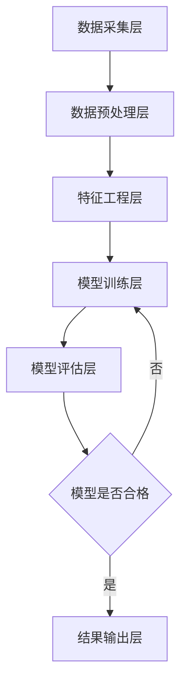

# 构建智能化的个人信用分数影响因子分析器

> 关键词：个人信用分数、影响因子分析器、智能化、数据分析、机器学习

> 摘要：本文旨在深入探讨如何构建一个智能化的个人信用分数影响因子分析器。首先介绍了该分析器构建的背景，包括目的、预期读者、文档结构和相关术语。接着阐述了核心概念与联系，展示了其原理和架构。详细讲解了核心算法原理，通过Python代码进行了说明，同时给出了数学模型和公式并举例。在项目实战部分，介绍了开发环境搭建、源代码实现与解读。分析了该分析器的实际应用场景，推荐了学习资源、开发工具框架和相关论文著作。最后总结了未来发展趋势与挑战，提供了常见问题解答和扩展阅读参考资料。

## 1. 背景介绍 
### 1.1 目的和范围
在当今金融和商业领域，个人信用分数是评估个人信用风险的重要指标。然而，影响个人信用分数的因素众多且复杂，包括个人的还款记录、债务水平、信用历史长度等。构建智能化的个人信用分数影响因子分析器的目的在于准确识别和量化这些影响因子，帮助金融机构、信贷公司等更好地评估个人信用风险，同时也为个人提供了解自身信用状况的工具。本分析器的范围涵盖了常见的个人信用数据来源，如银行交易记录、信用卡使用情况、贷款信息等，并能够对这些数据进行综合分析。

### 1.2 预期读者
本文的预期读者包括金融行业从业者，如信贷分析师、风险评估专家等，他们可以利用该分析器提升信用评估的准确性和效率；数据科学家和机器学习工程师，对构建此类分析器的技术细节感兴趣；以及普通个人，希望了解自身信用分数的影响因素，以便采取措施改善信用状况。

### 1.3 文档结构概述
本文将按照以下结构进行阐述：首先介绍核心概念与联系，包括分析器的原理和架构；接着讲解核心算法原理和具体操作步骤，通过Python代码详细说明；然后给出数学模型和公式，并举例说明；在项目实战部分，介绍开发环境搭建、源代码实现和代码解读；分析实际应用场景；推荐相关的工具和资源；最后总结未来发展趋势与挑战，提供常见问题解答和扩展阅读参考资料。

### 1.4 术语表
#### 1.4.1 核心术语定义
- **个人信用分数**：是一个综合评估个人信用风险的数值，通常由信用评级机构根据个人的信用历史和行为计算得出。
- **影响因子**：指对个人信用分数产生影响的各种因素，如还款记录、债务收入比等。
- **智能化分析器**：利用机器学习和数据分析技术，自动识别和量化影响个人信用分数的因素，并提供分析结果的系统。

#### 1.4.2 相关概念解释
- **特征工程**：在数据分析和机器学习中，特征工程是指从原始数据中提取和转换特征的过程，以便模型能够更好地理解和利用数据。
- **模型评估**：用于评估机器学习模型性能的过程，常用的评估指标包括准确率、召回率、F1值等。

#### 1.4.3 缩略词列表
- **ML**：Machine Learning，机器学习
- **LR**：Logistic Regression，逻辑回归
- **RF**：Random Forest，随机森林

## 2. 核心概念与联系 
### 核心概念原理
智能化的个人信用分数影响因子分析器的核心原理是通过收集和整理个人的信用相关数据，利用机器学习算法对这些数据进行训练和分析，从而找出影响个人信用分数的关键因素。具体来说，分析器首先对原始数据进行清洗和预处理，去除噪声和缺失值；然后进行特征工程，提取和转换有价值的特征；接着选择合适的机器学习模型进行训练，如逻辑回归、随机森林等；最后对模型进行评估和优化，确保其准确性和可靠性。

### 架构的文本示意图
个人信用分数影响因子分析器的架构主要包括以下几个部分：
1. **数据采集层**：负责收集个人的信用相关数据，如银行交易记录、信用卡账单、贷款信息等。
2. **数据预处理层**：对采集到的数据进行清洗、转换和归一化处理，以提高数据质量。
3. **特征工程层**：从预处理后的数据中提取和选择有价值的特征，如还款记录、债务收入比等。
4. **模型训练层**：选择合适的机器学习模型，如逻辑回归、随机森林等，对特征数据进行训练。
5. **模型评估层**：使用测试数据对训练好的模型进行评估，计算评估指标，如准确率、召回率等。
6. **结果输出层**：将模型的分析结果以可视化的方式呈现给用户，如柱状图、折线图等。

### Mermaid 流程图


## 3. 核心算法原理 & 具体操作步骤 
### 核心算法原理
在构建个人信用分数影响因子分析器时，常用的机器学习算法包括逻辑回归和随机森林。

#### 逻辑回归
逻辑回归是一种广泛应用于分类问题的线性模型。它通过对输入特征进行线性组合，然后使用逻辑函数将其转换为概率值。逻辑函数的表达式为：
$$\sigma(z)=\frac{1}{1 + e^{-z}}$$
其中，$z$ 是输入特征的线性组合，即 $z = \theta_0 + \theta_1x_1 + \theta_2x_2 + \cdots + \theta_nx_n$，$\theta$ 是模型的参数，$x$ 是输入特征。

逻辑回归的目标是找到一组最优的参数 $\theta$，使得模型对训练数据的预测概率与实际标签之间的损失最小。常用的损失函数是对数损失函数，表达式为：
$$J(\theta)=-\frac{1}{m}\sum_{i = 1}^{m}[y^{(i)}\log(\sigma(z^{(i)}))+(1 - y^{(i)})\log(1 - \sigma(z^{(i)}))]$$
其中，$m$ 是训练样本的数量，$y^{(i)}$ 是第 $i$ 个样本的实际标签。

#### 随机森林
随机森林是一种集成学习算法，它由多个决策树组成。每个决策树都是基于随机选择的特征子集和样本子集进行训练的。在预测时，随机森林会综合所有决策树的预测结果，通过投票或平均的方式得出最终的预测结果。

随机森林的优点是能够处理高维数据，具有较好的泛化能力和抗过拟合能力。

### 具体操作步骤及 Python 代码实现
以下是使用 Python 实现个人信用分数影响因子分析器的具体步骤和代码示例：

```python
import pandas as pd
from sklearn.model_selection import train_test_split
from sklearn.linear_model import LogisticRegression
from sklearn.ensemble import RandomForestClassifier
from sklearn.metrics import accuracy_score

# 步骤 1：数据加载
data = pd.read_csv('credit_data.csv')

# 步骤 2：数据预处理
# 处理缺失值
data = data.dropna()

# 分离特征和标签
X = data.drop('credit_score', axis=1)
y = data['credit_score']

# 步骤 3：特征工程
# 这里可以进行特征选择、特征转换等操作
# 例如，对数值特征进行归一化处理
from sklearn.preprocessing import StandardScaler
scaler = StandardScaler()
X_scaled = scaler.fit_transform(X)

# 步骤 4：数据集划分
X_train, X_test, y_train, y_test = train_test_split(X_scaled, y, test_size=0.2, random_state=42)

# 步骤 5：模型训练
# 逻辑回归模型
lr_model = LogisticRegression()
lr_model.fit(X_train, y_train)

# 随机森林模型
rf_model = RandomForestClassifier()
rf_model.fit(X_train, y_train)

# 步骤 6：模型评估
lr_pred = lr_model.predict(X_test)
lr_accuracy = accuracy_score(y_test, lr_pred)
print(f"逻辑回归模型准确率: {lr_accuracy}")

rf_pred = rf_model.predict(X_test)
rf_accuracy = accuracy_score(y_test, rf_pred)
print(f"随机森林模型准确率: {rf_accuracy}")

# 步骤 7：特征重要性分析
# 随机森林模型可以直接输出特征重要性
feature_importances = rf_model.feature_importances_
feature_names = X.columns
for i in range(len(feature_names)):
    print(f"{feature_names[i]}: {feature_importances[i]}")
```

## 4. 数学模型和公式 & 详细讲解 & 举例说明 
### 逻辑回归数学模型和公式
逻辑回归的数学模型可以表示为：
$$P(y = 1|x)=\sigma(\theta^Tx)=\frac{1}{1 + e^{-\theta^Tx}}$$
其中，$P(y = 1|x)$ 表示在输入特征 $x$ 的条件下，标签为 1 的概率，$\theta$ 是模型的参数。

### 详细讲解
逻辑回归通过最大化似然函数来估计参数 $\theta$。似然函数的表达式为：
$$L(\theta)=\prod_{i = 1}^{m}[P(y^{(i)} = 1|x^{(i)})]^{y^{(i)}}[1 - P(y^{(i)} = 1|x^{(i)})]^{1 - y^{(i)}}$$
为了方便计算，通常对似然函数取对数，得到对数似然函数：
$$\ell(\theta)=\sum_{i = 1}^{m}[y^{(i)}\log(P(y^{(i)} = 1|x^{(i)}))+(1 - y^{(i)})\log(1 - P(y^{(i)} = 1|x^{(i)}))]$$
最大化对数似然函数等价于最小化对数损失函数 $J(\theta)$。

### 举例说明
假设我们有一个简单的二分类问题，输入特征 $x$ 只有一个维度，标签 $y$ 为 0 或 1。数据集如下：
| $x$ | $y$ |
| --- | --- |
| 1 | 1 |
| 2 | 1 |
| 3 | 0 |
| 4 | 0 |

我们可以使用逻辑回归模型来拟合这个数据集。首先，初始化参数 $\theta = [\theta_0, \theta_1]$，然后使用梯度下降法来最小化对数损失函数，不断更新参数 $\theta$，直到收敛。

### 随机森林数学模型和公式
随机森林没有明确的数学公式，它是由多个决策树组成的集成模型。每个决策树的构建过程基于信息增益或基尼不纯度等指标来选择最优的划分特征和划分点。

### 详细讲解
在构建决策树时，首先选择一个特征作为根节点，然后根据该特征的取值将数据集划分为多个子集。对于每个子集，重复上述过程，直到满足停止条件，如子集的样本数量小于某个阈值或子集的基尼不纯度小于某个阈值。

随机森林在构建决策树时，会随机选择一部分特征和样本，以增加模型的多样性和泛化能力。

### 举例说明
假设我们有一个包含多个特征和标签的数据集，我们可以使用随机森林模型来进行分类。首先，随机选择一部分特征和样本，构建一棵决策树；然后重复这个过程，构建多棵决策树；最后，将所有决策树的预测结果进行综合，得出最终的预测结果。

## 5. 项目实战：代码实际案例和详细解释说明 
### 5.1  开发环境搭建
#### 操作系统
本项目可以在 Windows、Linux 或 macOS 等操作系统上进行开发。

#### Python 环境
建议使用 Python 3.7 及以上版本。可以使用 Anaconda 来管理 Python 环境，Anaconda 包含了许多常用的科学计算和数据分析库。

#### 安装必要的库
在命令行中运行以下命令来安装必要的库：
```sh
pip install pandas numpy scikit-learn matplotlib
```

### 5.2  源代码详细实现和代码解读
以下是完整的源代码：

```python
import pandas as pd
from sklearn.model_selection import train_test_split
from sklearn.linear_model import LogisticRegression
from sklearn.ensemble import RandomForestClassifier
from sklearn.metrics import accuracy_score
import matplotlib.pyplot as plt

# 步骤 1：数据加载
data = pd.read_csv('credit_data.csv')

# 步骤 2：数据预处理
# 处理缺失值
data = data.dropna()

# 分离特征和标签
X = data.drop('credit_score', axis=1)
y = data['credit_score']

# 步骤 3：特征工程
# 这里可以进行特征选择、特征转换等操作
# 例如，对数值特征进行归一化处理
from sklearn.preprocessing import StandardScaler
scaler = StandardScaler()
X_scaled = scaler.fit_transform(X)

# 步骤 4：数据集划分
X_train, X_test, y_train, y_test = train_test_split(X_scaled, y, test_size=0.2, random_state=42)

# 步骤 5：模型训练
# 逻辑回归模型
lr_model = LogisticRegression()
lr_model.fit(X_train, y_train)

# 随机森林模型
rf_model = RandomForestClassifier()
rf_model.fit(X_train, y_train)

# 步骤 6：模型评估
lr_pred = lr_model.predict(X_test)
lr_accuracy = accuracy_score(y_test, lr_pred)
print(f"逻辑回归模型准确率: {lr_accuracy}")

rf_pred = rf_model.predict(X_test)
rf_accuracy = accuracy_score(y_test, rf_pred)
print(f"随机森林模型准确率: {rf_accuracy}")

# 步骤 7：特征重要性分析
# 随机森林模型可以直接输出特征重要性
feature_importances = rf_model.feature_importances_
feature_names = X.columns

# 绘制特征重要性柱状图
plt.figure(figsize=(10, 6))
plt.bar(feature_names, feature_importances)
plt.xlabel('特征')
plt.ylabel('重要性')
plt.title('随机森林模型特征重要性')
plt.xticks(rotation=45)
plt.show()
```

### 代码解读与分析
- **数据加载**：使用 `pandas` 库的 `read_csv` 函数读取信用数据文件。
- **数据预处理**：使用 `dropna` 函数处理缺失值，然后分离特征和标签。
- **特征工程**：使用 `StandardScaler` 对数值特征进行归一化处理，以提高模型的性能。
- **数据集划分**：使用 `train_test_split` 函数将数据集划分为训练集和测试集，测试集占比为 20%。
- **模型训练**：分别使用逻辑回归和随机森林模型对训练集进行训练。
- **模型评估**：使用 `accuracy_score` 函数计算模型的准确率。
- **特征重要性分析**：随机森林模型可以直接输出特征重要性，使用 `matplotlib` 库绘制特征重要性柱状图，直观展示各个特征对信用分数的影响程度。

## 6. 实际应用场景 
### 金融机构信贷审批
金融机构在进行信贷审批时，可以使用个人信用分数影响因子分析器来评估申请人的信用风险。通过分析申请人的信用数据，找出影响信用分数的关键因素，如还款记录、债务收入比等，从而更准确地判断申请人是否具备还款能力，降低信贷风险。

### 个人信用管理
个人可以使用该分析器了解自己的信用状况，找出影响信用分数的因素。例如，如果发现逾期还款记录对信用分数影响较大，个人可以采取措施按时还款，改善信用状况。

### 信用评级机构
信用评级机构可以利用该分析器对个人的信用数据进行分析，更科学地评估个人的信用等级，提高信用评级的准确性和公正性。

### 风险投资决策
风险投资机构在进行投资决策时，可以参考个人的信用分数和影响因子分析结果，评估投资对象的信用风险，从而做出更明智的投资决策。

## 7. 工具和资源推荐
### 7.1 学习资源推荐
#### 7.1.1 书籍推荐
- 《Python 机器学习》：详细介绍了使用 Python 进行机器学习的基础知识和实践方法。
- 《统计学习方法》：系统阐述了机器学习的基本理论和算法，是机器学习领域的经典教材。
- 《信用评分模型技术与应用》：专门介绍了信用评分模型的原理、构建和应用，对个人信用分数分析有很大的帮助。

#### 7.1.2 在线课程
- Coursera 上的“机器学习”课程：由斯坦福大学教授 Andrew Ng 授课，是机器学习领域的经典课程。
- edX 上的“数据科学与机器学习微硕士”课程：提供了全面的数据科学和机器学习知识体系。
- 中国大学 MOOC 上的“信用风险管理”课程：介绍了信用风险管理的基本概念和方法，对个人信用分数分析有一定的指导作用。

#### 7.1.3 技术博客和网站
- Kaggle：是一个数据科学和机器学习竞赛平台，上面有很多关于信用评分和数据分析的案例和讨论。
- Medium：有很多数据科学家和机器学习工程师分享的技术文章，包括个人信用分数分析的相关内容。
- 机器学习算法全栈工程师：提供了丰富的机器学习教程和代码示例，对学习和实践有很大的帮助。

### 7.2 开发工具框架推荐
#### 7.2.1 IDE和编辑器
- PyCharm：是一款专业的 Python 集成开发环境，提供了丰富的代码编辑、调试和项目管理功能。
- Jupyter Notebook：是一个交互式的开发环境，适合进行数据分析和模型实验。
- Visual Studio Code：是一款轻量级的代码编辑器，支持多种编程语言和插件，对 Python 开发也有很好的支持。

#### 7.2.2 调试和性能分析工具
- Py-Spy：是一个 Python 性能分析工具，可以实时监测 Python 程序的性能瓶颈。
- cProfile：是 Python 内置的性能分析模块，可以分析函数的调用时间和次数。
- PDB：是 Python 内置的调试器，可以帮助开发者定位和解决代码中的问题。

#### 7.2.3 相关框架和库
- Pandas：是一个强大的数据处理和分析库，提供了高效的数据结构和数据操作方法。
- NumPy：是 Python 科学计算的基础库，提供了高效的多维数组和数学函数。
- Scikit-learn：是一个常用的机器学习库，提供了丰富的机器学习算法和工具。
- TensorFlow 和 PyTorch：是深度学习领域的两个主流框架，可用于构建更复杂的信用分数分析模型。

### 7.3 相关论文著作推荐
#### 7.3.1 经典论文
- 《Credit Scoring Using Neural Networks》：介绍了使用神经网络进行信用评分的方法和效果。
- 《A Comparative Analysis of Credit Scoring Models》：对不同的信用评分模型进行了比较和分析。
- 《Data Mining Techniques for Credit Risk Assessment》：探讨了数据挖掘技术在信用风险评估中的应用。

#### 7.3.2 最新研究成果
可以通过学术搜索引擎，如 Google Scholar、IEEE Xplore 等，搜索关于个人信用分数影响因子分析的最新研究成果。

#### 7.3.3 应用案例分析
一些金融机构和研究机构会发布关于信用评分模型应用的案例分析报告，可以通过相关机构的官方网站或学术数据库获取。

## 8. 总结：未来发展趋势与挑战
### 未来发展趋势
- **多源数据融合**：未来的个人信用分数影响因子分析器将融合更多来源的数据，如社交媒体数据、电商消费数据等，以更全面地评估个人信用状况。
- **深度学习应用**：深度学习技术将在个人信用分数分析中得到更广泛的应用，如使用卷积神经网络（CNN）和循环神经网络（RNN）来处理复杂的序列数据和文本数据。
- **可解释性模型**：随着人工智能技术的发展，对模型可解释性的要求越来越高。未来的分析器将更加注重模型的可解释性，以便用户更好地理解模型的决策过程。
- **实时监测与预警**：个人信用分数影响因子分析器将实现实时监测个人信用状况的变化，并及时发出预警，帮助用户和金融机构及时采取措施。

### 挑战
- **数据隐私和安全**：个人信用数据涉及到用户的隐私和敏感信息，如何保证数据的隐私和安全是一个重要的挑战。
- **数据质量和一致性**：不同数据源的数据质量和一致性可能存在差异，如何处理这些问题，提高数据的质量和可用性是需要解决的难题。
- **模型复杂度和计算资源**：深度学习模型通常具有较高的复杂度，需要大量的计算资源和时间进行训练和推理。如何在有限的计算资源下提高模型的性能是一个挑战。
- **法律法规和监管要求**：个人信用分数分析涉及到金融和个人隐私等领域，需要遵守相关的法律法规和监管要求，如何确保分析器的合法性和合规性是一个重要的问题。

## 9. 附录：常见问题与解答
### 问题 1：如何选择合适的机器学习模型？
答：选择合适的机器学习模型需要考虑多个因素，如数据的特点、问题的类型、模型的复杂度和可解释性等。对于个人信用分数影响因子分析问题，逻辑回归和随机森林是常用的模型。逻辑回归具有较好的可解释性，适用于线性关系较强的问题；随机森林具有较好的泛化能力和抗过拟合能力，适用于处理高维数据和非线性关系。

### 问题 2：如何处理数据中的缺失值？
答：处理数据中的缺失值有多种方法，常见的方法包括删除包含缺失值的样本、使用均值或中位数填充缺失值、使用机器学习模型预测缺失值等。具体选择哪种方法需要根据数据的特点和问题的要求来决定。

### 问题 3：如何评估模型的性能？
答：评估模型的性能可以使用多种指标，如准确率、召回率、F1 值、ROC 曲线等。对于个人信用分数分析问题，准确率是一个常用的评估指标，但在某些情况下，如数据不平衡时，召回率和 F1 值可能更能反映模型的性能。

### 问题 4：如何提高模型的准确性？
答：提高模型的准确性可以从多个方面入手，如进行更深入的特征工程、选择更合适的机器学习模型、调整模型的参数、增加训练数据等。此外，还可以使用集成学习的方法，将多个模型的预测结果进行综合，提高模型的准确性。

## 10. 扩展阅读 & 参考资料
### 扩展阅读
- 《人工智能时代的信用风险管理》
- 《大数据与信用评分》

### 参考资料
- 《Python 数据科学手册》
- 《机器学习实战》
- Kaggle 上的相关竞赛和讨论
- 各大金融机构和研究机构发布的信用评分报告

作者：AI天才研究院/AI Genius Institute & 禅与计算机程序设计艺术 /Zen And The Art of Computer Programming