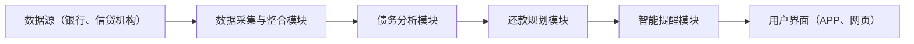

# 构建智能化的个人债务管理助手

> 关键词：个人债务管理、智能化助手、债务分析、还款规划、人工智能

> 摘要：本文围绕构建智能化的个人债务管理助手展开。详细介绍了该助手的背景知识，包括目的、预期读者等。深入剖析了核心概念，如债务数据的采集与处理、债务分析模型等，并给出了相应的架构示意图和流程图。阐述了核心算法原理，用 Python 代码进行了详细说明。同时讲解了相关数学模型和公式，并举例说明其应用。通过项目实战，展示了开发环境搭建、源代码实现及解读。探讨了该助手的实际应用场景，推荐了学习资源、开发工具框架以及相关论文著作。最后总结了未来发展趋势与挑战，还提供了常见问题解答和扩展阅读参考资料，旨在帮助读者全面了解和构建智能化的个人债务管理助手。

## 1. 背景介绍 
### 1.1 目的和范围
随着现代社会经济的发展，个人债务的形式日益多样化，如信用卡欠款、房贷、车贷、消费贷款等。个人面临着管理多笔债务、合理规划还款计划以避免逾期产生高额利息和不良信用记录的挑战。构建智能化的个人债务管理助手的目的在于帮助个人更高效、准确地管理债务。其范围涵盖了债务信息的收集、整理、分析，还款计划的制定、提醒，以及对债务风险的评估和预警等功能。

### 1.2 预期读者
本文的预期读者包括对个人财务管理感兴趣的普通大众，希望通过智能化工具更好地管理自己的债务；软件开发人员，尤其是对人工智能、数据分析在金融领域应用感兴趣的开发者，他们可以参考本文构建类似的债务管理系统；金融行业从业者，如信贷分析师、理财顾问等，借助智能化助手为客户提供更专业的债务管理建议。

### 1.3 文档结构概述
本文将首先介绍与个人债务管理助手相关的核心概念和它们之间的联系，通过文本示意图和 Mermaid 流程图进行清晰展示。接着详细阐述核心算法原理，并给出具体的 Python 代码实现步骤。然后介绍相关的数学模型和公式，并结合实例进行讲解。之后通过项目实战，从开发环境搭建、源代码实现到代码解读进行全面介绍。再探讨该助手在实际生活中的应用场景。最后推荐相关的学习资源、开发工具框架和论文著作，总结未来发展趋势与挑战，提供常见问题解答和扩展阅读参考资料。

### 1.4 术语表
#### 1.4.1 核心术语定义
- **个人债务管理**：指个人对自身所欠债务进行全面的规划、监控和控制的过程，包括记录债务信息、制定还款计划、按时还款等。
- **智能化助手**：利用人工智能技术，如机器学习、自然语言处理等，为用户提供自动化、智能化服务的软件程序。
- **债务分析**：对个人的债务信息进行深入研究，包括债务类型、金额、利率、还款期限等，以评估债务状况和风险。
- **还款规划**：根据个人的财务状况和债务信息，制定合理的还款计划，确保按时还清债务，同时尽量减少利息支出。

#### 1.4.2 相关概念解释
- **信用评分**：金融机构根据个人的信用历史、还款记录等信息，对个人信用状况进行评估的数值。良好的信用评分有助于获得更低的贷款利率和更高的贷款额度。
- **债务重组**：当个人面临还款困难时，与债权人协商调整债务条款，如延长还款期限、降低利率等，以减轻还款压力。
- **逾期费用**：当个人未能按时还款时，债权人按照合同约定收取的额外费用，通常较高。

#### 1.4.3 缩略词列表
- **AI**：Artificial Intelligence，人工智能
- **ML**：Machine Learning，机器学习
- **NLP**：Natural Language Processing，自然语言处理
- **API**：Application Programming Interface，应用程序编程接口

## 2. 核心概念与联系 
### 核心概念原理
智能化的个人债务管理助手主要基于以下几个核心概念：

#### 债务数据采集与整合
助手需要从多个渠道采集个人的债务信息，如银行账单、信用卡对账单、贷款合同等。这些数据可能以不同的格式存在，需要进行整合和清洗，以确保数据的准确性和一致性。

#### 债务分析模型
利用数据分析和机器学习技术，构建债务分析模型。该模型可以对债务信息进行深入分析，评估债务风险，如计算债务负担率、预测逾期可能性等。

#### 还款规划算法
根据个人的财务状况和债务信息，设计还款规划算法。算法的目标是制定出最优的还款计划，在保证按时还款的前提下，尽量减少利息支出。

#### 智能提醒服务
通过自然语言处理技术，实现智能提醒服务。助手可以根据还款计划，提前向用户发送提醒信息，提醒用户按时还款。

### 架构示意图
```plaintext
+---------------------+
| 数据源（银行、信贷机构） |
+---------------------+
          |
          v
+---------------------+
| 数据采集与整合模块  |
+---------------------+
          |
          v
+---------------------+
| 债务分析模块        |
+---------------------+
          |
          v
+---------------------+
| 还款规划模块        |
+---------------------+
          |
          v
+---------------------+
| 智能提醒模块        |
+---------------------+
          |
          v
+---------------------+
| 用户界面（APP、网页） |
+---------------------+
```

### Mermaid 流程图


## 3. 核心算法原理 & 具体操作步骤 
### 债务分析算法原理
债务分析的核心是评估个人的债务风险，其中一个重要指标是债务负担率。债务负担率是指个人每月的债务还款额占月收入的比例。计算公式为：

$$债务负担率 = \frac{每月债务还款额}{月收入} \times 100\%$$

当债务负担率超过一定比例（如 50%）时，说明个人的债务压力较大，逾期风险较高。

以下是用 Python 实现债务负担率计算的代码：
```python
def debt_burden_ratio(monthly_debt_payment, monthly_income):
    """
    计算债务负担率
    :param monthly_debt_payment: 每月债务还款额
    :param monthly_income: 月收入
    :return: 债务负担率
    """
    if monthly_income == 0:
        return 0
    return (monthly_debt_payment / monthly_income) * 100

# 示例
monthly_debt_payment = 5000
monthly_income = 10000
ratio = debt_burden_ratio(monthly_debt_payment, monthly_income)
print(f"债务负担率: {ratio}%")
```

### 还款规划算法原理
还款规划的目标是在满足还款期限的前提下，尽量减少利息支出。一种常见的还款规划方法是优先偿还利率较高的债务。

以下是用 Python 实现的简单还款规划算法：
```python
def repayment_plan(debt_list, monthly_available_funds):
    """
    制定还款计划
    :param debt_list: 债务列表，每个元素为 (债务金额, 利率)
    :param monthly_available_funds: 每月可用于还款的资金
    :return: 还款计划列表
    """
    # 按利率从高到低排序
    debt_list.sort(key=lambda x: x[1], reverse=True)
    plan = []
    remaining_funds = monthly_available_funds
    for debt_amount, interest_rate in debt_list:
        if remaining_funds >= debt_amount:
            plan.append((debt_amount, interest_rate))
            remaining_funds -= debt_amount
        else:
            plan.append((remaining_funds, interest_rate))
            remaining_funds = 0
            break
    return plan

# 示例
debt_list = [(10000, 0.05), (20000, 0.03), (5000, 0.08)]
monthly_available_funds = 8000
plan = repayment_plan(debt_list, monthly_available_funds)
print("还款计划:", plan)
```

### 具体操作步骤
1. **数据采集**：使用 API 或爬虫技术从银行、信贷机构等数据源获取个人的债务信息。
2. **数据清洗和整合**：对采集到的数据进行清洗，去除重复、错误的数据，并将不同格式的数据整合到统一的数据结构中。
3. **债务分析**：根据采集到的数据，计算债务负担率等指标，评估债务风险。
4. **还款规划**：根据债务分析结果和个人的财务状况，制定还款计划。
5. **智能提醒**：根据还款计划，设置提醒规则，在还款日期前向用户发送提醒信息。

## 4. 数学模型和公式 & 详细讲解 & 举例说明 
### 债务利息计算模型
债务利息的计算通常采用复利公式。复利是指在每一个计息期后，将所生利息加入本金再计利息。复利公式为：

$$A = P(1 + \frac{r}{n})^{nt}$$

其中：
- $A$ 是最终的本利和
- $P$ 是本金
- $r$ 是年利率
- $n$ 是每年的计息次数
- $t$ 是存款年限

例如，某人借款 $P = 10000$ 元，年利率 $r = 0.05$，每年计息 $n = 12$ 次，借款期限 $t = 1$ 年。则一年后需要偿还的本利和为：

$$A = 10000(1 + \frac{0.05}{12})^{12\times1} \approx 10511.62$$

以下是用 Python 实现复利计算的代码：
```python
def compound_interest(P, r, n, t):
    """
    计算复利
    :param P: 本金
    :param r: 年利率
    :param n: 每年的计息次数
    :param t: 存款年限
    :return: 最终的本利和
    """
    return P * (1 + r / n) ** (n * t)

# 示例
P = 10000
r = 0.05
n = 12
t = 1
A = compound_interest(P, r, n, t)
print(f"最终本利和: {A}")
```

### 债务偿还时间计算模型
假设每月固定还款额为 $M$，本金为 $P$，月利率为 $i$，则偿还债务所需的月数 $n$ 可以通过以下公式计算：

$$n = -\frac{\ln(1 - \frac{iP}{M})}{\ln(1 + i)}$$

例如，某人借款 $P = 20000$ 元，月利率 $i = 0.005$，每月固定还款额 $M = 1000$ 元。则偿还债务所需的月数为：

$$n = -\frac{\ln(1 - \frac{0.005\times20000}{1000})}{\ln(1 + 0.005)} \approx 22$$

以下是用 Python 实现债务偿还时间计算的代码：
```python
import math

def repayment_months(P, i, M):
    """
    计算债务偿还所需的月数
    :param P: 本金
    :param i: 月利率
    :param M: 每月固定还款额
    :return: 偿还所需的月数
    """
    if i == 0:
        return P / M
    return -math.log(1 - (i * P / M)) / math.log(1 + i)

# 示例
P = 20000
i = 0.005
M = 1000
n = repayment_months(P, i, M)
print(f"偿还所需的月数: {n}")
```

## 5. 项目实战：代码实际案例和详细解释说明 
### 5.1  开发环境搭建
#### 操作系统
推荐使用 Linux 或 macOS 系统，因为它们对 Python 开发环境的支持较好。如果使用 Windows 系统，也可以通过安装 Anaconda 来搭建开发环境。

#### Python 环境
安装 Python 3.7 及以上版本。可以从 Python 官方网站（https://www.python.org/downloads/）下载安装包进行安装。

#### 依赖库安装
使用 pip 安装以下依赖库：
```bash
pip install pandas numpy scikit-learn requests beautifulsoup4
```
- `pandas`：用于数据处理和分析。
- `numpy`：用于数值计算。
- `scikit-learn`：用于机器学习算法。
- `requests`：用于发送 HTTP 请求，获取数据。
- `beautifulsoup4`：用于解析 HTML 和 XML 数据。

### 5.2  源代码详细实现和代码解读
```python
import pandas as pd
import numpy as np
from sklearn.linear_model import LogisticRegression
import requests
from bs4 import BeautifulSoup

# 数据采集函数
def collect_debt_data():
    # 模拟从银行网站获取债务信息
    url = "https://example.com/debt_info"
    response = requests.get(url)
    soup = BeautifulSoup(response.text, 'html.parser')
    # 解析 HTML 数据，提取债务信息
    debt_amount = float(soup.find('span', id='debt_amount').text)
    interest_rate = float(soup.find('span', id='interest_rate').text)
    return debt_amount, interest_rate

# 数据处理函数
def process_debt_data(debt_amount, interest_rate):
    data = pd.DataFrame({
        'debt_amount': [debt_amount],
        'interest_rate': [interest_rate]
    })
    return data

# 债务分析函数
def debt_analysis(data):
    # 计算债务负担率（假设月收入为 10000）
    monthly_income = 10000
    monthly_debt_payment = data['debt_amount'] * data['interest_rate'] / 12
    debt_burden_ratio = (monthly_debt_payment / monthly_income) * 100
    data['debt_burden_ratio'] = debt_burden_ratio
    return data

# 还款规划函数
def repayment_planning(data, monthly_available_funds):
    debt_amount = data['debt_amount'].values[0]
    interest_rate = data['interest_rate'].values[0]
    if monthly_available_funds >= debt_amount:
        plan = [(debt_amount, interest_rate)]
    else:
        plan = [(monthly_available_funds, interest_rate)]
    return plan

# 主函数
def main():
    # 数据采集
    debt_amount, interest_rate = collect_debt_data()
    # 数据处理
    data = process_debt_data(debt_amount, interest_rate)
    # 债务分析
    data = debt_analysis(data)
    # 还款规划
    monthly_available_funds = 5000
    plan = repayment_planning(data, monthly_available_funds)
    print("债务分析结果:", data)
    print("还款计划:", plan)

if __name__ == "__main__":
    main()
```

### 5.3  代码解读与分析
- **数据采集函数 `collect_debt_data`**：使用 `requests` 库发送 HTTP 请求，从银行网站获取债务信息。使用 `BeautifulSoup` 库解析 HTML 数据，提取债务金额和利率。
- **数据处理函数 `process_debt_data`**：将采集到的债务信息转换为 `pandas` 的 `DataFrame` 格式，方便后续处理和分析。
- **债务分析函数 `debt_analysis`**：计算债务负担率，并将其添加到 `DataFrame` 中。
- **还款规划函数 `repayment_planning`**：根据每月可用于还款的资金和债务信息，制定还款计划。
- **主函数 `main`**：依次调用数据采集、数据处理、债务分析和还款规划函数，并输出结果。

## 6. 实际应用场景 
### 个人财务管理
个人可以使用智能化的债务管理助手来全面管理自己的债务。通过输入债务信息，助手可以帮助用户计算债务负担率、制定还款计划、提醒还款日期，从而避免逾期产生的不良影响。同时，助手还可以根据用户的财务状况和债务情况，提供个性化的理财建议，帮助用户合理规划资金。

### 金融机构客户服务
金融机构可以将智能化的债务管理助手集成到自己的客户服务系统中，为客户提供更便捷、专业的债务管理服务。例如，银行可以通过助手帮助客户分析信用卡欠款情况，制定合理的还款计划，提高客户的满意度和忠诚度。

### 信贷风险评估
在信贷审批过程中，金融机构可以使用债务管理助手对申请人的债务状况进行评估。通过分析申请人的债务负担率、还款记录等信息，预测申请人的逾期风险，从而做出更准确的信贷决策。

## 7. 工具和资源推荐
### 7.1 学习资源推荐
#### 7.1.1 书籍推荐
- 《Python 数据分析实战》：介绍了使用 Python 进行数据分析的方法和技巧，包括数据采集、清洗、分析和可视化等方面。
- 《机器学习实战》：通过实际案例介绍了机器学习的基本算法和应用，帮助读者快速掌握机器学习的实践技能。
- 《Python 网络爬虫从入门到实践》：详细讲解了使用 Python 编写网络爬虫的方法，包括 HTTP 请求、HTML 解析、数据存储等内容。

#### 7.1.2 在线课程
- Coursera 上的“Python for Data Science”：由知名高校教授授课，系统地介绍了 Python 在数据分析领域的应用。
- edX 上的“Machine Learning Fundamentals”：讲解了机器学习的基本概念、算法和模型评估方法。
- 网易云课堂上的“Python 网络爬虫实战”：通过实际项目，让学员掌握网络爬虫的开发技巧。

#### 7.1.3 技术博客和网站
- Medium：上面有很多关于数据分析、机器学习和人工智能的优质文章，作者来自世界各地的技术专家。
- 开源中国：提供了丰富的技术文章和开源项目资源，涵盖了 Python 开发的各个方面。
- 博客园：国内知名的技术博客平台，有很多 Python 开发者分享自己的经验和心得。

### 7.2 开发工具框架推荐
#### 7.2.1 IDE和编辑器
- PyCharm：功能强大的 Python 集成开发环境，提供了代码编辑、调试、版本控制等功能，适合专业开发者使用。
- Jupyter Notebook：交互式的开发环境，支持 Python、R 等多种编程语言，方便进行数据探索和分析。
- Visual Studio Code：轻量级的代码编辑器，支持丰富的插件扩展，可用于 Python 开发和数据分析。

#### 7.2.2 调试和性能分析工具
- pdb：Python 内置的调试工具，可以帮助开发者定位代码中的问题。
- cProfile：Python 标准库中的性能分析工具，用于分析代码的运行时间和资源消耗情况。
- Py-Spy：一个跨平台的 Python 性能分析工具，可以实时监测 Python 程序的性能。

#### 7.2.3 相关框架和库
- Flask：轻量级的 Web 开发框架，用于快速搭建 Web 应用程序。
- Django：功能强大的 Web 开发框架，提供了丰富的功能和工具，适合开发大型 Web 项目。
- TensorFlow：开源的机器学习框架，广泛应用于深度学习领域。

### 7.3 相关论文著作推荐
#### 7.3.1 经典论文
- “A Survey on Machine Learning for Credit Risk Analysis”：对机器学习在信用风险分析中的应用进行了全面的综述。
- “Data Mining Techniques in Credit Risk Evaluation”：介绍了数据挖掘技术在信用风险评估中的应用方法和案例。

#### 7.3.2 最新研究成果
- 可以关注 IEEE Transactions on Neural Networks and Learning Systems、Journal of Financial Economics 等学术期刊，获取关于人工智能在金融领域应用的最新研究成果。

#### 7.3.3 应用案例分析
- 《金融科技前沿：案例与启示》：通过实际案例分析了金融科技在各个领域的应用，包括个人债务管理。

## 8. 总结：未来发展趋势与挑战
### 未来发展趋势
- **智能化程度不断提高**：随着人工智能技术的不断发展，个人债务管理助手将具备更强大的智能分析和决策能力。例如，能够自动识别用户的财务状况和债务需求，提供更加个性化、精准的还款计划和理财建议。
- **与金融机构深度融合**：助手将与银行、信贷机构等金融机构实现更紧密的合作，实现数据的实时共享和交互。用户可以通过助手直接进行还款操作，金融机构也可以根据助手提供的信息更好地管理客户的信用风险。
- **多平台应用**：除了传统的手机 APP 和网页应用，个人债务管理助手将拓展到更多的平台，如智能手表、智能家居设备等。用户可以通过各种设备随时随地管理自己的债务。

### 挑战
- **数据安全和隐私保护**：个人债务信息属于敏感信息，如何确保数据的安全和隐私是一个重要的挑战。需要采用先进的加密技术和安全措施，防止数据泄露和滥用。
- **算法准确性和可靠性**：债务分析和还款规划算法的准确性直接影响到用户的利益。需要不断优化算法，提高其准确性和可靠性，同时进行充分的测试和验证。
- **用户接受度**：部分用户可能对智能化的债务管理助手存在疑虑，担心其使用复杂或不可靠。需要加强用户教育和宣传，提高用户对助手的信任度和接受度。

## 9. 附录：常见问题与解答
### 问题 1：如何确保数据采集的准确性和安全性？
答：在数据采集过程中，应使用安全可靠的 API 或加密技术，确保数据传输过程中的安全性。同时，对采集到的数据进行严格的清洗和验证，去除错误和重复的数据，保证数据的准确性。

### 问题 2：如果我的债务信息发生变化，如何更新到助手？
答：可以通过手动输入或设置自动更新功能来更新债务信息。如果使用的是与金融机构合作的助手，部分信息可能会自动同步更新。

### 问题 3：还款计划是否可以根据我的实际情况进行调整？
答：是的，还款计划可以根据用户的实际财务状况和债务情况进行调整。助手可以提供灵活的还款计划调整功能，以满足用户的不同需求。

### 问题 4：使用智能化的债务管理助手是否需要付费？
答：有些债务管理助手是免费的，而有些可能会提供付费的高级功能。在选择使用时，可以根据自己的需求和预算进行选择。

## 10. 扩展阅读 & 参考资料
### 扩展阅读
- 《人工智能时代的金融科技》：深入探讨了人工智能在金融领域的应用和发展趋势。
- 《大数据与金融风险管理》：介绍了大数据技术在金融风险管理中的应用方法和实践案例。

### 参考资料
- Python 官方文档：https://docs.python.org/
- pandas 官方文档：https://pandas.pydata.org/docs/
- scikit-learn 官方文档：https://scikit-learn.org/stable/documentation.html

作者：AI天才研究院/AI Genius Institute & 禅与计算机程序设计艺术 /Zen And The Art of Computer Programming