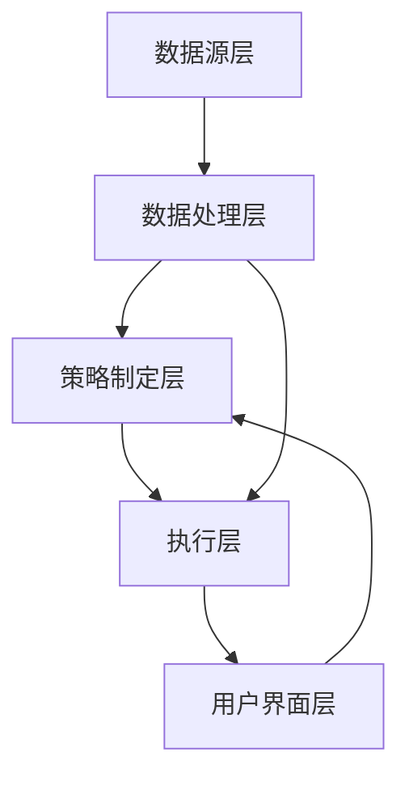

# 构建智能化的个人投资组合再平衡系统

> 关键词：智能化、个人投资组合、再平衡系统、投资策略、风险控制

> 摘要：本文旨在深入探讨如何构建智能化的个人投资组合再平衡系统。首先介绍了该系统构建的背景、目的、适用读者等内容。接着详细阐述了核心概念，包括投资组合、再平衡等的原理及架构，并给出了相应的文本示意图和 Mermaid 流程图。在核心算法原理部分，使用 Python 代码进行详细讲解。同时，介绍了相关的数学模型和公式，并举例说明。通过项目实战，给出了开发环境搭建、源代码实现及代码解读。分析了该系统的实际应用场景，推荐了学习、开发工具和相关论文著作。最后总结了未来发展趋势与挑战，提供了常见问题解答和扩展阅读参考资料，帮助读者全面了解和构建智能化的个人投资组合再平衡系统。

## 1. 背景介绍 
### 1.1 目的和范围
在当今复杂多变的金融市场中，个人投资者面临着众多的投资选择和风险。构建智能化的个人投资组合再平衡系统的主要目的是帮助投资者更科学、高效地管理投资组合，实现资产的稳健增长。该系统的范围涵盖了多种常见的投资资产，如股票、债券、基金等，通过对投资组合的实时监测和动态调整，确保投资组合的风险和收益达到预期的平衡状态。

### 1.2 预期读者
本文的预期读者主要包括个人投资者、金融从业者、对量化投资和智能化系统开发感兴趣的程序员以及相关领域的研究人员。对于个人投资者，希望能通过本文了解如何利用智能化系统优化自己的投资组合；金融从业者可以将该系统作为辅助工具，为客户提供更专业的投资建议；程序员可以从中获取系统开发的思路和技术实现方法；研究人员则可以在现有基础上进行更深入的学术研究。

### 1.3 文档结构概述
本文将按照以下结构进行阐述：首先介绍背景信息，包括目的、预期读者和文档结构概述等；接着讲解核心概念，明确相关术语和概念的定义及联系；然后详细阐述核心算法原理和具体操作步骤，使用 Python 代码进行示例；再介绍相关的数学模型和公式，并举例说明其应用；通过项目实战展示系统的开发过程，包括环境搭建、代码实现和解读；分析系统的实际应用场景；推荐学习、开发工具和相关论文著作；最后总结未来发展趋势与挑战，提供常见问题解答和扩展阅读参考资料。

### 1.4 术语表
#### 1.4.1 核心术语定义
- **投资组合**：是指由投资者持有的多种不同资产所组成的集合，这些资产可以包括股票、债券、基金、现金等。投资组合的目的是通过分散投资来降低风险，同时追求一定的收益。
- **再平衡**：是指定期或根据特定条件对投资组合中各资产的比例进行调整，使其恢复到初始设定的目标比例。例如，当股票市场表现较好，股票在投资组合中的比例超过了目标比例时，需要卖出部分股票，买入其他资产，以保持投资组合的平衡。
- **智能化**：在本系统中，智能化是指利用先进的信息技术和算法，实现对投资组合的自动监测、分析和调整。通过大数据分析、机器学习等技术，系统可以根据市场变化和投资者的风险偏好，自动做出最优的投资决策。

#### 1.4.2 相关概念解释
- **风险分散**：是投资组合理论的核心概念之一，通过将资金分散投资于不同的资产类别、行业和地区，可以降低单一资产波动对整个投资组合的影响，从而降低投资风险。
- **资产配置**：是指根据投资者的风险承受能力、投资目标和市场情况，将资金合理分配到不同的资产类别中。合理的资产配置是实现投资组合长期稳定收益的关键。
- **动态调整**：是指根据市场变化和投资组合的实际情况，及时调整各资产的比例。与静态的资产配置不同，动态调整可以更好地适应市场的不确定性，提高投资组合的适应性和收益能力。

#### 1.4.3 缩略词列表
- **ETF**：交易型开放式指数基金（Exchange Traded Fund），是一种在交易所上市交易的、基金份额可变的开放式基金。
- **ROI**：投资回报率（Return on Investment），是指通过投资而应返回的价值，即企业从一项投资活动中得到的经济回报。
- **VAR**：风险价值（Value at Risk），是一种统计方法，用于衡量在一定的置信水平和持有期内，投资组合可能遭受的最大损失。

## 2. 核心概念与联系 
### 核心概念原理
投资组合再平衡系统的核心在于通过对投资组合中各资产的比例进行动态调整，以维持投资组合的风险和收益平衡。其原理基于现代投资组合理论，该理论认为通过分散投资可以降低非系统性风险，而资产配置则是实现风险分散的关键。

具体来说，投资者首先根据自己的风险承受能力、投资目标和市场情况，确定投资组合中各资产的目标比例。例如，一个风险偏好适中的投资者可能将 60%的资金分配到股票，30%分配到债券，10%分配到现金。随着市场的波动，各资产的价值会发生变化，导致实际比例偏离目标比例。此时，系统需要根据预设的规则进行再平衡操作，将各资产的比例调整回目标比例。

### 架构的文本示意图
```plaintext
投资组合再平衡系统架构

数据源层：
- 金融数据提供商（如雅虎财经、万得等）
- 交易接口（如券商 API）

数据处理层：
- 数据采集模块：从数据源获取资产价格、交易数据等信息
- 数据清洗模块：对采集到的数据进行清洗和预处理，去除异常值和缺失值
- 数据分析模块：计算资产的收益率、风险指标等

策略制定层：
- 再平衡规则设定：根据投资者的风险偏好和投资目标，设定再平衡的触发条件和调整方法
- 投资策略优化：利用机器学习等技术，对投资策略进行优化和调整

执行层：
- 交易执行模块：根据再平衡策略，自动生成交易指令并通过交易接口执行交易
- 监控模块：实时监控投资组合的状态，确保再平衡操作的及时和准确

用户界面层：
- 可视化界面：为用户提供投资组合的实时信息、再平衡报告等
- 用户交互功能：允许用户设置投资目标、风险偏好等参数
```

### Mermaid 流程图


该流程图展示了投资组合再平衡系统的整体架构，各层之间相互关联，形成一个闭环的系统。数据源层为系统提供数据支持，数据处理层对数据进行处理和分析，策略制定层根据分析结果制定再平衡策略，执行层负责执行交易操作，用户界面层为用户提供交互和可视化服务。同时，用户的反馈可以通过用户界面层传递到策略制定层，实现系统的优化和调整。

## 3. 核心算法原理 & 具体操作步骤 
### 核心算法原理
投资组合再平衡系统的核心算法主要包括资产收益率计算、风险指标计算和再平衡策略制定。以下是使用 Python 代码详细阐述这些算法的原理和实现。

#### 资产收益率计算
资产收益率是衡量资产投资回报的重要指标，常见的收益率计算方法有简单收益率和对数收益率。简单收益率的计算公式为：

$$R_{t}=\frac{P_{t}-P_{t-1}}{P_{t-1}}$$

其中，$R_{t}$ 表示第 $t$ 期的简单收益率，$P_{t}$ 表示第 $t$ 期的资产价格，$P_{t-1}$ 表示第 $t-1$ 期的资产价格。

对数收益率的计算公式为：

$$r_{t}=\ln(\frac{P_{t}}{P_{t-1}})$$

以下是使用 Python 代码计算简单收益率和对数收益率的示例：

```python
import numpy as np
import pandas as pd

# 生成示例数据
prices = pd.Series([100, 105, 110, 108, 112])

# 计算简单收益率
simple_returns = (prices - prices.shift(1)) / prices.shift(1)
print("简单收益率：")
print(simple_returns)

# 计算对数收益率
log_returns = np.log(prices / prices.shift(1))
print("\n对数收益率：")
print(log_returns)
```

#### 风险指标计算
风险指标用于衡量投资组合的风险水平，常见的风险指标有标准差、夏普比率等。标准差是衡量资产收益率波动程度的指标，计算公式为：

$$\sigma=\sqrt{\frac{1}{n-1}\sum_{i=1}^{n}(R_{i}-\bar{R})^{2}}$$

其中，$\sigma$ 表示标准差，$R_{i}$ 表示第 $i$ 期的收益率，$\bar{R}$ 表示平均收益率，$n$ 表示样本数量。

夏普比率是衡量投资组合风险调整后收益的指标，计算公式为：

$$Sharpe Ratio=\frac{\bar{R}_{p}-R_{f}}{\sigma_{p}}$$

其中，$\bar{R}_{p}$ 表示投资组合的平均收益率，$R_{f}$ 表示无风险收益率，$\sigma_{p}$ 表示投资组合的标准差。

以下是使用 Python 代码计算标准差和夏普比率的示例：

```python
# 计算标准差
std_dev = simple_returns.std()
print("\n标准差：", std_dev)

# 假设无风险收益率为 0.02
risk_free_rate = 0.02
# 计算平均收益率
mean_return = simple_returns.mean()
# 计算夏普比率
sharpe_ratio = (mean_return - risk_free_rate) / std_dev
print("\n夏普比率：", sharpe_ratio)
```

#### 再平衡策略制定
再平衡策略的核心是确定再平衡的触发条件和调整方法。常见的触发条件有定期再平衡和阈值再平衡。定期再平衡是指按照固定的时间间隔（如每月、每季度）进行再平衡操作；阈值再平衡是指当投资组合中某一资产的比例偏离目标比例超过一定阈值时，进行再平衡操作。

以下是使用 Python 代码实现阈值再平衡策略的示例：

```python
# 假设投资组合的目标比例
target_weights = {'stock': 0.6, 'bond': 0.3, 'cash': 0.1}
# 假设当前投资组合的价值
current_values = {'stock': 6500, 'bond': 2500, 'cash': 1000}
total_value = sum(current_values.values())
# 计算当前各资产的比例
current_weights = {asset: value / total_value for asset, value in current_values.items()}

# 设定阈值
threshold = 0.05

# 检查是否需要再平衡
rebalance_needed = False
for asset in target_weights:
    if abs(current_weights[asset] - target_weights[asset]) > threshold:
        rebalance_needed = True
        break

if rebalance_needed:
    print("需要进行再平衡操作")
    # 计算再平衡后的目标价值
    target_values = {asset: target_weights[asset] * total_value for asset in target_weights}
    # 计算需要买入或卖出的金额
    trade_amounts = {asset: target_values[asset] - current_values[asset] for asset in target_weights}
    print("再平衡后的目标价值：", target_values)
    print("需要买入或卖出的金额：", trade_amounts)
else:
    print("不需要进行再平衡操作")
```

### 具体操作步骤
1. **数据采集**：从金融数据提供商获取投资组合中各资产的历史价格数据和交易数据。
2. **数据处理**：对采集到的数据进行清洗和预处理，去除异常值和缺失值，并计算资产的收益率和风险指标。
3. **策略制定**：根据投资者的风险偏好和投资目标，设定再平衡的触发条件和调整方法。
4. **再平衡判断**：实时监控投资组合的状态，判断是否需要进行再平衡操作。
5. **交易执行**：如果需要进行再平衡操作，根据再平衡策略生成交易指令，并通过交易接口执行交易。
6. **监控和调整**：实时监控投资组合的状态，根据市场变化和投资者的反馈，对投资策略进行调整和优化。

## 4. 数学模型和公式 & 详细讲解 & 举例说明 
### 投资组合收益率计算
投资组合的收益率是各资产收益率的加权平均值，计算公式为：

$$R_{p}=\sum_{i=1}^{n}w_{i}R_{i}$$

其中，$R_{p}$ 表示投资组合的收益率，$w_{i}$ 表示第 $i$ 种资产在投资组合中的权重，$R_{i}$ 表示第 $i$ 种资产的收益率，$n$ 表示投资组合中资产的数量。

例如，假设一个投资组合包含三种资产：股票、债券和现金，它们的权重分别为 0.6、0.3 和 0.1，收益率分别为 0.1、0.05 和 0.02，则该投资组合的收益率为：

$$R_{p}=0.6\times0.1 + 0.3\times0.05 + 0.1\times0.02 = 0.077$$

### 投资组合风险计算
投资组合的风险可以用方差或标准差来衡量。方差的计算公式为：

$$\sigma_{p}^{2}=\sum_{i=1}^{n}\sum_{j=1}^{n}w_{i}w_{j}\sigma_{i}\sigma_{j}\rho_{ij}$$

其中，$\sigma_{p}^{2}$ 表示投资组合的方差，$w_{i}$ 和 $w_{j}$ 分别表示第 $i$ 种和第 $j$ 种资产在投资组合中的权重，$\sigma_{i}$ 和 $\sigma_{j}$ 分别表示第 $i$ 种和第 $j$ 种资产的标准差，$\rho_{ij}$ 表示第 $i$ 种和第 $j$ 种资产的相关系数。

标准差是方差的平方根，计算公式为：

$$\sigma_{p}=\sqrt{\sigma_{p}^{2}}$$

例如，假设一个投资组合包含两种资产：股票和债券，它们的权重分别为 0.6 和 0.4，标准差分别为 0.2 和 0.1，相关系数为 0.3，则该投资组合的方差为：

$$\sigma_{p}^{2}=0.6^{2}\times0.2^{2} + 0.4^{2}\times0.1^{2} + 2\times0.6\times0.4\times0.2\times0.1\times0.3 = 0.01728$$

标准差为：

$$\sigma_{p}=\sqrt{0.01728}\approx0.1314$$

### 资本资产定价模型（CAPM）
资本资产定价模型是一种用于描述资产预期收益率与风险之间关系的模型，其公式为：

$$E(R_{i})=R_{f}+\beta_{i}(E(R_{m})-R_{f})$$

其中，$E(R_{i})$ 表示第 $i$ 种资产的预期收益率，$R_{f}$ 表示无风险收益率，$\beta_{i}$ 表示第 $i$ 种资产的贝塔系数，$E(R_{m})$ 表示市场组合的预期收益率。

贝塔系数是衡量资产系统性风险的指标，计算公式为：

$$\beta_{i}=\frac{\text{Cov}(R_{i},R_{m})}{\text{Var}(R_{m})}$$

其中，$\text{Cov}(R_{i},R_{m})$ 表示第 $i$ 种资产收益率与市场组合收益率的协方差，$\text{Var}(R_{m})$ 表示市场组合收益率的方差。

例如，假设无风险收益率为 0.02，市场组合的预期收益率为 0.1，某股票的贝塔系数为 1.2，则该股票的预期收益率为：

$$E(R_{i})=0.02 + 1.2\times(0.1 - 0.02)=0.116$$

### 有效前沿理论
有效前沿理论是现代投资组合理论的核心内容之一，它描述了在给定风险水平下，能够获得最大预期收益率的投资组合集合。有效前沿上的投资组合被称为有效投资组合。

在二维坐标系中，横坐标表示投资组合的风险（标准差），纵坐标表示投资组合的预期收益率。有效前沿是一条向上倾斜的曲线，它的左下方是无效投资组合，右上方是无法实现的投资组合。

投资者可以根据自己的风险偏好，在有效前沿上选择合适的投资组合。例如，风险偏好较低的投资者可以选择有效前沿上风险较低的投资组合；风险偏好较高的投资者可以选择有效前沿上风险较高、预期收益率也较高的投资组合。

## 5. 项目实战：代码实际案例和详细解释说明 
### 5.1  开发环境搭建
#### 操作系统
本项目可以在 Windows、Linux 或 macOS 操作系统上进行开发，建议使用较新版本的操作系统以确保兼容性和性能。

#### 编程语言和环境
- **Python**：建议使用 Python 3.7 及以上版本，Python 是一种功能强大、易于学习的编程语言，拥有丰富的数据分析和金融计算库。
- **Anaconda**：Anaconda 是一个用于科学计算的 Python 发行版，它包含了许多常用的科学计算库和工具，如 NumPy、Pandas、Matplotlib 等。可以从 Anaconda 官方网站（https://www.anaconda.com/products/individual）下载并安装。

#### 第三方库
- **pandas**：用于数据处理和分析，提供了高效的数据结构和数据操作方法。
- **numpy**：用于数值计算，提供了强大的多维数组对象和数学函数。
- **matplotlib**：用于数据可视化，能够绘制各种类型的图表。
- **yfinance**：用于从雅虎财经获取金融数据。
- **pyfolio**：用于投资组合分析和可视化。

可以使用以下命令安装这些库：

```sh
pip install pandas numpy matplotlib yfinance pyfolio
```

### 5.2  源代码详细实现和代码解读
以下是一个完整的投资组合再平衡系统的 Python 代码示例：

```python
import yfinance as yf
import pandas as pd
import numpy as np
import matplotlib.pyplot as plt

# 定义投资组合的资产列表和目标比例
assets = ['AAPL', 'MSFT', 'JPM', 'V', 'PG']
target_weights = [0.2, 0.2, 0.2, 0.2, 0.2]

# 定义再平衡的时间间隔（以月为单位）
rebalance_interval = 3

# 定义数据获取的时间范围
start_date = '2020-01-01'
end_date = '2023-01-01'

# 获取资产的历史价格数据
data = yf.download(assets, start=start_date, end=end_date)['AdjClose']

# 计算资产的收益率
returns = data.pct_change().dropna()

# 初始化投资组合的价值和持仓数量
initial_investment = 100000
portfolio_value = initial_investment
holdings = {asset: (portfolio_value * weight) / data[asset].iloc[0] for asset, weight in zip(assets, target_weights)}

# 记录投资组合的价值变化
portfolio_values = []

# 模拟投资组合的再平衡过程
for i in range(0, len(returns), rebalance_interval):
    # 计算当前投资组合的价值
    current_value = sum([holdings[asset] * data[asset].iloc[i] for asset in assets])
    portfolio_values.append(current_value)

    # 检查是否需要进行再平衡
    current_weights = {asset: (holdings[asset] * data[asset].iloc[i]) / current_value for asset in assets}
    rebalance_needed = False
    for asset in assets:
        if abs(current_weights[asset] - target_weights[assets.index(asset)]) > 0.05:
            rebalance_needed = True
            break

    if rebalance_needed:
        # 计算再平衡后的目标价值
        target_values = {asset: target_weights[assets.index(asset)] * current_value for asset in assets}
        # 计算需要买入或卖出的金额
        trade_amounts = {asset: target_values[asset] - (holdings[asset] * data[asset].iloc[i]) for asset in assets}
        # 调整持仓数量
        for asset in assets:
            holdings[asset] += trade_amounts[asset] / data[asset].iloc[i]

# 绘制投资组合的价值变化曲线
plt.plot(pd.date_range(start=start_date, end=end_date, freq=f'{rebalance_interval}M')[:len(portfolio_values)], portfolio_values)
plt.xlabel('Date')
plt.ylabel('Portfolio Value')
plt.title('Portfolio Value over Time with Rebalancing')
plt.show()
```

### 5.3  代码解读与分析
1. **数据获取**：使用 `yfinance` 库从雅虎财经获取指定资产的历史价格数据，并计算资产的收益率。
2. **初始化投资组合**：设定初始投资金额和目标比例，计算初始持仓数量。
3. **模拟再平衡过程**：按照指定的时间间隔进行再平衡操作，检查当前投资组合的权重是否偏离目标比例超过阈值。如果需要再平衡，则计算再平衡后的目标价值和需要买入或卖出的金额，并调整持仓数量。
4. **记录和可视化**：记录投资组合的价值变化，并使用 `matplotlib` 库绘制投资组合的价值变化曲线。

通过这个代码示例，我们可以直观地看到投资组合再平衡系统的工作原理和效果。再平衡操作可以帮助投资者保持投资组合的风险和收益平衡，避免因市场波动导致投资组合的权重偏离目标比例过大。

## 6. 实际应用场景 
### 个人投资者
对于个人投资者来说，智能化的投资组合再平衡系统可以帮助他们更科学、高效地管理自己的投资组合。个人投资者通常缺乏专业的金融知识和时间来实时监控市场和调整投资组合。使用该系统，投资者可以根据自己的风险承受能力和投资目标，设定投资组合的目标比例和再平衡规则，系统会自动监测市场变化，当投资组合的权重偏离目标比例时，自动进行再平衡操作。这样可以避免投资者因情绪波动而做出错误的投资决策，实现资产的稳健增长。

例如，一位年轻的上班族，每月有一定的闲置资金用于投资。他可以将一部分资金投资于股票型基金，一部分投资于债券型基金，以实现风险分散。通过使用投资组合再平衡系统，他可以设定每季度进行一次再平衡，当股票型基金的比例超过目标比例时，系统会自动卖出部分股票型基金，买入债券型基金，使投资组合恢复到平衡状态。

### 金融机构
金融机构，如银行、证券公司和基金公司等，可以将智能化的投资组合再平衡系统作为一种增值服务提供给客户。通过该系统，金融机构可以为客户提供更个性化的投资建议和资产配置方案。同时，系统可以帮助金融机构提高客户服务效率，降低运营成本。

例如，银行可以为高净值客户提供定制化的投资组合再平衡服务。根据客户的资产规模、风险偏好和投资目标，银行的专业投资顾问可以为客户设计合适的投资组合，并使用系统进行实时监控和调整。这样可以提高客户的满意度和忠诚度，为银行带来更多的业务收入。

### 量化投资团队
量化投资团队通常使用复杂的数学模型和算法来进行投资决策。智能化的投资组合再平衡系统可以作为量化投资策略的一部分，帮助团队实现投资组合的自动化管理。通过对大量历史数据的分析和挖掘，量化投资团队可以优化再平衡策略，提高投资组合的收益和风险控制能力。

例如，一个量化投资团队可以使用机器学习算法来预测市场趋势和资产价格走势，根据预测结果动态调整投资组合的权重。同时，使用投资组合再平衡系统来确保投资组合的风险和收益始终处于可控范围内。

## 7. 工具和资源推荐
### 7.1 学习资源推荐
#### 7.1.1 书籍推荐
- 《聪明的投资者》（The Intelligent Investor）：作者是本杰明·格雷厄姆（Benjamin Graham），这本书被誉为投资界的圣经，介绍了价值投资的基本理念和方法，对于理解投资组合管理和风险控制具有重要的指导意义。
- 《漫步华尔街》（A Random Walk Down Wall Street）：作者是伯顿·马尔基尔（Burton G. Malkiel），本书从学术和实践的角度探讨了股票市场的有效性和投资策略，对投资组合的构建和再平衡有深入的分析。
- 《Python 金融数据分析实战》：本书介绍了如何使用 Python 进行金融数据的获取、处理、分析和可视化，对于开发投资组合再平衡系统具有重要的参考价值。

#### 7.1.2 在线课程
- Coursera 上的“投资学原理”（Principles of Investing）课程：由宾夕法尼亚大学沃顿商学院的教授授课，介绍了投资学的基本概念、理论和方法，包括资产配置、投资组合管理和风险管理等内容。
- edX 上的“Python 数据科学”（Python for Data Science）课程：该课程教授如何使用 Python 进行数据处理、分析和可视化，适合想要学习 Python 在金融领域应用的初学者。
- 哔哩哔哩上的一些金融投资和 Python 编程相关的视频教程，这些教程通常由一些专业人士或爱好者分享，内容丰富多样，可以帮助学习者快速入门。

#### 7.1.3 技术博客和网站
- 金融界（https://www.jrj.com.cn/）：提供了丰富的金融资讯、行情数据和投资分析工具，对于了解金融市场动态和投资机会有很大的帮助。
- 雪球（https://xueqiu.com/）：是一个投资者社区，用户可以在上面分享投资经验、交流投资策略，还可以关注一些知名的投资者和投资机构。
- 量化投资与机器学习（https://www.quantinfo.com/）：专注于量化投资和机器学习领域的技术分享和交流，提供了很多实用的代码示例和算法实现。

### 7.2 开发工具框架推荐
#### 7.2.1 IDE和编辑器
- PyCharm：是一款专业的 Python 集成开发环境，具有强大的代码编辑、调试和项目管理功能，适合开发大型的 Python 项目。
- Jupyter Notebook：是一个交互式的开发环境，支持 Python、R 等多种编程语言，非常适合进行数据探索和分析。用户可以在 Notebook 中编写代码、运行代码块、查看结果，并添加文本说明和图表，方便进行文档记录和分享。
- Visual Studio Code：是一款轻量级的代码编辑器，支持多种编程语言和插件扩展。它具有丰富的代码提示、调试和版本控制功能，同时可以通过安装 Python 相关的插件来提高开发效率。

#### 7.2.2 调试和性能分析工具
- PDB：是 Python 自带的调试器，可以帮助开发者在代码中设置断点、单步执行代码、查看变量值等，方便排查代码中的错误。
- cProfile：是 Python 标准库中的性能分析工具，可以帮助开发者找出代码中的性能瓶颈，优化代码的执行效率。
- Py-Spy：是一个用于分析 Python 程序性能的工具，它可以实时监测 Python 程序的 CPU 使用情况、函数调用时间等信息，并生成可视化的报告。

#### 7.2.3 相关框架和库
- Pandas：是一个用于数据处理和分析的 Python 库，提供了高效的数据结构和数据操作方法，如数据读取、清洗、转换、分组和聚合等。
- NumPy：是一个用于数值计算的 Python 库，提供了强大的多维数组对象和数学函数，是许多科学计算和数据分析库的基础。
- Matplotlib：是一个用于数据可视化的 Python 库，可以绘制各种类型的图表，如折线图、柱状图、散点图等，帮助开发者直观地展示数据。
- Scikit-learn：是一个用于机器学习的 Python 库，提供了丰富的机器学习算法和工具，如分类、回归、聚类、降维等，可以帮助开发者实现投资组合的优化和预测。

### 7.3 相关论文著作推荐
#### 7.3.1 经典论文
- Markowitz, H. M. (1952). Portfolio Selection. The Journal of Finance, 7(1), 77-91. 这篇论文提出了现代投资组合理论，奠定了投资组合管理的基础，介绍了如何通过分散投资来降低风险，以及如何在风险和收益之间进行权衡。
- Sharpe, W. F. (1964). Capital Asset Prices: A Theory of Market Equilibrium Under Conditions of Risk. The Journal of Finance, 19(3), 425-442. 该论文提出了资本资产定价模型（CAPM），用于描述资产预期收益率与风险之间的关系，为投资组合的定价和评估提供了重要的理论依据。

#### 7.3.2 最新研究成果
- 在学术数据库（如 IEEE Xplore、ACM Digital Library、ScienceDirect 等）上搜索关于“智能化投资组合管理”、“投资组合再平衡算法”等主题的最新研究论文。这些论文通常会介绍一些新的算法和技术，如深度学习、强化学习在投资组合管理中的应用。

#### 7.3.3 应用案例分析
- 一些金融机构和研究机构会发布关于投资组合管理的应用案例分析报告，这些报告可以帮助读者了解实际应用中投资组合再平衡系统的设计和实施过程，以及取得的效果和经验教训。可以通过金融机构的官方网站、行业研究报告平台等渠道获取这些案例分析。

## 8. 总结：未来发展趋势与挑战
### 未来发展趋势
#### 智能化程度不断提高
随着人工智能和机器学习技术的不断发展，投资组合再平衡系统的智能化程度将不断提高。系统将能够利用大数据分析和深度学习算法，更准确地预测市场趋势和资产价格走势，从而实现更精准的投资决策。例如，系统可以根据投资者的历史交易数据和风险偏好，为其提供个性化的投资建议和再平衡策略。

#### 与其他金融科技融合
投资组合再平衡系统将与其他金融科技领域，如区块链、智能合约等进行深度融合。区块链技术可以提供更安全、透明的交易记录和资产托管服务，智能合约可以实现投资组合再平衡操作的自动化执行，降低人为干预和操作风险。

#### 服务范围扩大
未来，投资组合再平衡系统的服务范围将不仅仅局限于个人投资者和金融机构，还将拓展到更多的领域，如企业年金、养老金等。这些机构通常拥有大量的资金，需要专业的投资组合管理服务来实现资产的保值增值。

### 挑战
#### 数据质量和安全问题
投资组合再平衡系统的正常运行依赖于大量的金融数据，数据的质量和安全直接影响系统的决策准确性和可靠性。因此，如何保证数据的准确性、完整性和及时性，以及如何防止数据泄露和恶意攻击，是系统开发和运营过程中面临的重要挑战。

#### 模型的有效性和适应性
投资组合再平衡系统通常基于各种数学模型和算法来进行投资决策，这些模型的有效性和适应性受到市场环境、经济形势等多种因素的影响。在市场出现剧烈波动或发生重大变化时，模型可能无法准确预测市场走势，导致投资决策失误。因此，如何不断优化和改进模型，提高模型的有效性和适应性，是系统开发者需要解决的问题。

#### 监管和合规要求
金融行业是一个受到严格监管的行业，投资组合再平衡系统的开发和运营需要遵守相关的法律法规和监管要求。例如，系统需要确保投资者的资金安全、信息保密，以及合规地进行交易操作。如何在满足监管要求的前提下，实现系统的创新和发展，是系统开发者和运营者面临的挑战之一。

## 9. 附录：常见问题与解答
### 问题 1：投资组合再平衡系统一定能提高投资收益吗？
解答：投资组合再平衡系统的主要目的是帮助投资者维持投资组合的风险和收益平衡，而不是保证一定能提高投资收益。在某些市场情况下，再平衡操作可能会错过一些资产的上涨行情，导致短期收益下降。但是，从长期来看，通过再平衡可以避免投资组合过度集中于某一种资产，降低投资风险，从而实现更稳健的投资回报。

### 问题 2：如何选择合适的再平衡时间间隔？
解答：再平衡时间间隔的选择需要根据投资者的风险偏好、投资目标和市场情况来确定。一般来说，较短的时间间隔（如每月或每季度）可以更及时地调整投资组合的权重，保持投资组合的平衡，但也会增加交易成本。较长的时间间隔（如每年）可以减少交易成本，但可能会导致投资组合的权重在较长时间内偏离目标比例。投资者可以根据自己的情况进行权衡和选择。

### 问题 3：投资组合再平衡系统需要考虑交易成本吗？
解答：需要考虑交易成本。交易成本包括佣金、印花税等，这些成本会影响投资组合的实际收益。在设计再平衡策略时，需要综合考虑交易成本和再平衡带来的收益，避免因频繁交易而导致交易成本过高。例如，可以设定一个阈值，只有当投资组合的权重偏离目标比例超过一定阈值时，才进行再平衡操作。

### 问题 4：系统能否适应不同的市场环境？
解答：系统的适应性取决于其模型和算法的设计。一个好的投资组合再平衡系统应该能够根据不同的市场环境进行调整和优化。例如，在市场波动较大时，可以适当增加再平衡的频率；在市场趋势明显时，可以根据趋势调整投资组合的权重。同时，系统还可以利用机器学习等技术，不断学习和适应市场的变化，提高系统的适应性和决策准确性。

## 10. 扩展阅读 & 参考资料
### 扩展阅读
- 《金融炼金术》（The Alchemy of Finance）：作者是乔治·索罗斯（George Soros），这本书介绍了索罗斯的投资哲学和方法，以及他对金融市场的独特见解。
- 《非理性繁荣》（Irrational Exuberance）：作者是罗伯特·席勒（Robert J. Shiller），本书探讨了金融市场中的非理性行为和泡沫现象，对于理解市场的波动和风险具有重要的启示作用。
- 《思考，快与慢》（Thinking, Fast and Slow）：作者是丹尼尔·卡尼曼（Daniel Kahneman），这本书介绍了人类思维的两种模式：快思考和慢思考，并分析了它们在决策过程中的影响，对于投资者了解自己的决策行为和避免心理误区具有重要的参考价值。

### 参考资料
- Yahoo Finance：https://finance.yahoo.com/ 提供了丰富的金融数据和资讯。
- Pandas 官方文档：https://pandas.pydata.org/docs/ 详细介绍了 Pandas 库的使用方法和功能。
- NumPy 官方文档：https://numpy.org/doc/ 提供了 NumPy 库的详细文档和教程。
- Matplotlib 官方文档：https://matplotlib.org/stable/contents.html 介绍了 Matplotlib 库的使用方法和示例。

作者：AI天才研究院/AI Genius Institute & 禅与计算机程序设计艺术 /Zen And The Art of Computer Programming