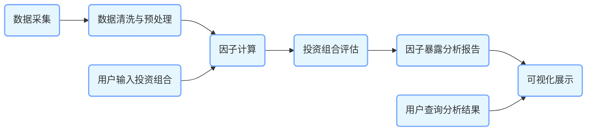

# 构建智能化的个人投资组合因子暴露分析系统

> 关键词：智能化、个人投资组合、因子暴露分析、系统构建、量化投资

> 摘要：本文聚焦于构建智能化的个人投资组合因子暴露分析系统。首先介绍了构建该系统的背景、目的、适用读者及文档结构等基础信息。接着阐述了核心概念及其联系，包括投资组合、因子暴露等概念的原理与架构。详细讲解了核心算法原理，并用 Python 代码实现具体操作步骤。通过数学模型和公式对因子暴露分析进行了理论支撑和举例说明。结合实际项目，展示了开发环境搭建、源代码实现及代码解读。探讨了系统在实际中的应用场景，推荐了学习、开发相关的工具和资源，最后总结了系统未来的发展趋势与挑战，并对常见问题进行了解答，提供了扩展阅读和参考资料，旨在为投资者和开发者提供全面的指导。

## 1. 背景介绍 
### 1.1 目的和范围
在当今复杂多变的金融市场中，个人投资者面临着诸多挑战，如何合理构建投资组合并评估其风险与收益是关键问题。因子暴露分析可以帮助投资者了解投资组合对各种风险因子的敏感程度，从而更好地进行资产配置和风险管理。本系统的目的就是构建一个智能化的平台，为个人投资者提供便捷、准确的投资组合因子暴露分析服务。

系统的范围涵盖了常见的金融资产，如股票、基金、债券等，能够分析多种风险因子，包括市场因子、规模因子、价值因子等。同时，系统具备一定的智能化特性，如自动数据采集、因子计算和可视化展示等功能。

### 1.2 预期读者
- **个人投资者**：希望通过系统了解自己投资组合的风险特征，优化投资策略，实现资产的保值增值。
- **金融从业者**：如投资顾问、分析师等，可以利用系统为客户提供更专业的投资建议，提高服务质量。
- **技术开发者**：对量化投资和数据分析感兴趣，希望学习如何构建类似的智能化系统，提升自己的技术能力。

### 1.3 文档结构概述
本文将按照以下结构进行阐述：首先介绍核心概念与联系，帮助读者理解投资组合因子暴露分析的基本原理；接着详细讲解核心算法原理和具体操作步骤，并用 Python 代码进行实现；然后给出相关的数学模型和公式，并举例说明；通过项目实战展示系统的开发过程，包括环境搭建、源代码实现和代码解读；探讨系统的实际应用场景；推荐学习和开发所需的工具和资源；最后总结系统的未来发展趋势与挑战，解答常见问题，并提供扩展阅读和参考资料。

### 1.4 术语表
#### 1.4.1 核心术语定义
- **投资组合（Portfolio）**：由多种金融资产组成的集合，投资者通过合理配置不同资产来实现特定的投资目标。
- **因子暴露（Factor Exposure）**：投资组合对某个风险因子的敏感程度，反映了该因子对投资组合收益的影响大小。
- **风险因子（Risk Factor）**：能够影响金融资产价格波动的因素，如市场利率、宏观经济指标等。
- **因子模型（Factor Model）**：用于描述资产收益与风险因子之间关系的数学模型，常见的有单因子模型和多因子模型。

#### 1.4.2 相关概念解释
- **因子分析（Factor Analysis）**：一种统计方法，用于从大量变量中提取出少数几个公共因子，以简化数据结构和解释变量之间的关系。在投资领域，因子分析可用于识别影响资产收益的关键因素。
- **因子溢价（Factor Premium）**：某些风险因子在长期内能够为投资者带来额外的收益，这种额外收益称为因子溢价。例如，价值因子溢价表示价值型股票相对于成长型股票在长期内可能获得的超额收益。
- **因子载荷（Factor Loading）**：在因子模型中，因子载荷表示资产收益对各个风险因子的敏感程度，是衡量因子暴露的重要指标。

#### 1.4.3 缩略词列表
- **CAPM**：Capital Asset Pricing Model，资本资产定价模型，是一种单因子模型，用于描述资产预期收益与市场风险之间的关系。
- **Fama - French 三因子模型**：由 Eugene F. Fama 和 Kenneth R. French 提出的多因子模型，考虑了市场因子、规模因子和价值因子对资产收益的影响。
- **IC**：Information Coefficient，信息系数，用于衡量因子预测能力的指标，反映了因子值与资产未来收益之间的相关性。

## 2. 核心概念与联系 

### 核心概念原理
#### 投资组合
投资组合是投资者将不同的金融资产按照一定的比例组合在一起形成的资产集合。其目的是通过分散投资降低单一资产带来的风险，同时实现预期的收益目标。例如，一个投资者可以将资金分配到股票、债券和基金等不同资产类别中，以平衡风险和收益。

#### 因子暴露
因子暴露衡量了投资组合对某个风险因子的敏感程度。假设存在一个风险因子 $F$，投资组合的因子暴露可以表示为投资组合收益对因子 $F$ 的变化率。如果因子暴露为正，说明投资组合的收益与因子 $F$ 呈正相关；如果因子暴露为负，则呈负相关。例如，一个投资组合对市场因子的暴露为 1.2，意味着市场上涨 1% 时，该投资组合预期上涨 1.2%。

#### 因子模型
因子模型是描述资产收益与风险因子之间关系的数学模型。以单因子模型为例，资产 $i$ 的收益 $R_i$ 可以表示为：
$R_i = \alpha_i + \beta_i F + \epsilon_i$
其中，$\alpha_i$ 是资产 $i$ 的超额收益，$\beta_i$ 是资产 $i$ 对因子 $F$ 的因子载荷，即因子暴露，$F$ 是风险因子的收益率，$\epsilon_i$ 是随机误差项。

多因子模型则考虑了多个风险因子对资产收益的影响，例如 Fama - French 三因子模型：
$R_i = \alpha_i + \beta_{i,M} R_M + \beta_{i,SMB} SMB + \beta_{i,HML} HML + \epsilon_i$
其中，$R_M$ 是市场因子的收益率，$SMB$ 是规模因子的收益率，$HML$ 是价值因子的收益率，$\beta_{i,M}$、$\beta_{i,SMB}$ 和 $\beta_{i,HML}$ 分别是资产 $i$ 对市场因子、规模因子和价值因子的因子暴露。

### 架构的文本示意图
```plaintext
智能化个人投资组合因子暴露分析系统
|-- 数据采集模块
|   |-- 金融数据接口
|   |-- 数据清洗与预处理
|-- 因子计算模块
|   |-- 风险因子定义
|   |-- 因子暴露计算
|-- 分析与可视化模块
|   |-- 投资组合评估
|   |-- 因子暴露分析报告
|   |-- 可视化展示
|-- 用户交互模块
|   |-- 投资组合输入
|   |-- 分析结果查询
```

### Mermaid 流程图


## 3. 核心算法原理 & 具体操作步骤 

### 核心算法原理
本系统的核心算法是基于因子模型计算投资组合的因子暴露。以 Fama - French 三因子模型为例，计算步骤如下：
1. **数据准备**：收集资产的历史收益率数据、市场收益率数据、规模因子数据和价值因子数据。
2. **回归分析**：对于每个资产，使用历史数据进行线性回归，估计其对市场因子、规模因子和价值因子的因子暴露。
3. **投资组合因子暴露计算**：根据投资组合中各资产的权重，加权平均各资产的因子暴露，得到投资组合的因子暴露。

### 具体操作步骤及 Python 代码实现

```python
import pandas as pd
import numpy as np
import statsmodels.api as sm

# 步骤 1: 数据准备
# 假设已经有资产收益率数据、市场收益率数据、规模因子数据和价值因子数据
# 数据格式为 Pandas DataFrame，索引为日期，列名为资产名称或因子名称
asset_returns = pd.read_csv('asset_returns.csv', index_col=0)
market_return = pd.read_csv('market_return.csv', index_col=0)
smb = pd.read_csv('smb.csv', index_col=0)
hml = pd.read_csv('hml.csv', index_col=0)

# 合并数据
factors = pd.concat([market_return, smb, hml], axis=1)
factors.columns = ['Mkt-RF', 'SMB', 'HML']

# 步骤 2: 回归分析
def calculate_factor_exposure(asset_return, factors):
    X = sm.add_constant(factors)
    model = sm.OLS(asset_return, X).fit()
    return model.params[1:]

# 计算每个资产的因子暴露
factor_exposures = {}
for asset in asset_returns.columns:
    factor_exposures[asset] = calculate_factor_exposure(asset_returns[asset], factors)

# 步骤 3: 投资组合因子暴露计算
# 假设投资组合的权重
portfolio_weights = {
    'Asset1': 0.3,
    'Asset2': 0.4,
    'Asset3': 0.3
}

portfolio_factor_exposure = np.zeros(3)
for asset, weight in portfolio_weights.items():
    portfolio_factor_exposure += weight * factor_exposures[asset]

print("投资组合的因子暴露：")
print("市场因子暴露：", portfolio_factor_exposure[0])
print("规模因子暴露：", portfolio_factor_exposure[1])
print("价值因子暴露：", portfolio_factor_exposure[2])
```

### 代码解释
1. **数据准备**：使用 `pandas` 库读取资产收益率数据、市场收益率数据、规模因子数据和价值因子数据，并将它们合并为一个 DataFrame。
2. **回归分析**：定义 `calculate_factor_exposure` 函数，使用 `statsmodels` 库进行线性回归，估计每个资产的因子暴露。
3. **投资组合因子暴露计算**：根据投资组合的权重，加权平均各资产的因子暴露，得到投资组合的因子暴露。

## 4. 数学模型和公式 & 详细讲解 & 举例说明 

### 单因子模型
单因子模型假设资产的收益只受一个风险因子的影响，其数学公式为：
$$R_i = \alpha_i + \beta_i F + \epsilon_i$$
其中，$R_i$ 是资产 $i$ 的收益率，$\alpha_i$ 是资产 $i$ 的超额收益，$\beta_i$ 是资产 $i$ 对因子 $F$ 的因子暴露，$F$ 是风险因子的收益率，$\epsilon_i$ 是随机误差项，满足 $E(\epsilon_i) = 0$ 和 $Cov(\epsilon_i, F) = 0$。

#### 详细讲解
- $\alpha_i$ 表示资产 $i$ 在扣除因子影响后的超额收益，是衡量资产经理选股能力的重要指标。如果 $\alpha_i > 0$，说明资产经理的选股能力较强，能够获得超过因子预期的收益。
- $\beta_i$ 衡量了资产 $i$ 对因子 $F$ 的敏感程度。当 $\beta_i > 0$ 时，资产 $i$ 的收益与因子 $F$ 呈正相关；当 $\beta_i < 0$ 时，呈负相关。$\beta_i$ 的绝对值越大，说明资产 $i$ 对因子 $F$ 的变化越敏感。
- $\epsilon_i$ 是随机误差项，反映了资产 $i$ 收益中不能被因子 $F$ 解释的部分，通常是由资产的特定风险引起的。

#### 举例说明
假设市场因子的收益率 $F$ 为 5%，资产 $A$ 的 $\alpha_A = 1\%$，$\beta_A = 1.2$，则资产 $A$ 的预期收益率为：
$$R_A = \alpha_A + \beta_A F = 1\% + 1.2 \times 5\% = 7\%$$

### 多因子模型（Fama - French 三因子模型）
Fama - French 三因子模型考虑了市场因子、规模因子和价值因子对资产收益的影响，其数学公式为：
$$R_i = \alpha_i + \beta_{i,M} R_M + \beta_{i,SMB} SMB + \beta_{i,HML} HML + \epsilon_i$$
其中，$R_i$ 是资产 $i$ 的收益率，$\alpha_i$ 是资产 $i$ 的超额收益，$\beta_{i,M}$ 是资产 $i$ 对市场因子 $R_M$ 的因子暴露，$\beta_{i,SMB}$ 是资产 $i$ 对规模因子 $SMB$ 的因子暴露，$\beta_{i,HML}$ 是资产 $i$ 对价值因子 $HML$ 的因子暴露，$\epsilon_i$ 是随机误差项。

#### 详细讲解
- 市场因子 $R_M$ 反映了整个市场的波动情况，通常用市场指数的收益率来表示。
- 规模因子 $SMB$（Small Minus Big）衡量了小市值股票相对于大市值股票的超额收益。当 $SMB > 0$ 时，说明小市值股票表现优于大市值股票；反之，则大市值股票表现更好。
- 价值因子 $HML$（High Minus Low）衡量了高账面市值比股票相对于低账面市值比股票的超额收益。高账面市值比的股票通常被认为是价值型股票，低账面市值比的股票通常被认为是成长型股票。

#### 举例说明
假设资产 $B$ 的 $\alpha_B = 0.5\%$，$\beta_{B,M} = 1.1$，$\beta_{B,SMB} = 0.8$，$\beta_{B,HML} = 0.6$，市场因子收益率 $R_M = 4\%$，规模因子收益率 $SMB = 2\%$，价值因子收益率 $HML = 3\%$，则资产 $B$ 的预期收益率为：
$$R_B = \alpha_B + \beta_{B,M} R_M + \beta_{B,SMB} SMB + \beta_{B,HML} HML$$
$$= 0.5\% + 1.1 \times 4\% + 0.8 \times 2\% + 0.6 \times 3\%$$
$$= 0.5\% + 4.4\% + 1.6\% + 1.8\% = 8.3\%$$

## 5. 项目实战：代码实际案例和详细解释说明 

### 5.1  开发环境搭建
#### 操作系统
本项目可以在 Windows、Linux 或 macOS 操作系统上进行开发，建议使用最新版本的操作系统以确保兼容性和稳定性。

#### Python 环境
安装 Python 3.7 及以上版本，可以从 Python 官方网站（https://www.python.org/downloads/）下载并安装。同时，建议使用虚拟环境来管理项目依赖，避免不同项目之间的冲突。可以使用 `venv` 或 `conda` 来创建虚拟环境，以下是使用 `venv` 的示例：
```bash
# 创建虚拟环境
python -m venv myenv

# 激活虚拟环境
# Windows
myenv\Scripts\activate
# Linux/macOS
source myenv/bin/activate
```

#### 依赖库安装
在虚拟环境中安装项目所需的依赖库，主要包括 `pandas`、`numpy`、`statsmodels`、`matplotlib` 等，可以使用 `pip` 进行安装：
```bash
pip install pandas numpy statsmodels matplotlib
```

### 5.2  源代码详细实现和代码解读

```python
import pandas as pd
import numpy as np
import statsmodels.api as sm
import matplotlib.pyplot as plt

# 数据读取函数
def read_data(file_path):
    data = pd.read_csv(file_path, index_col=0)
    data.index = pd.to_datetime(data.index)
    return data

# 计算因子暴露函数
def calculate_factor_exposure(asset_return, factors):
    X = sm.add_constant(factors)
    model = sm.OLS(asset_return, X).fit()
    return model.params[1:]

# 计算投资组合因子暴露函数
def calculate_portfolio_factor_exposure(portfolio_weights, factor_exposures):
    portfolio_factor_exposure = np.zeros(3)
    for asset, weight in portfolio_weights.items():
        portfolio_factor_exposure += weight * factor_exposures[asset]
    return portfolio_factor_exposure

# 主函数
def main():
    # 读取数据
    asset_returns = read_data('asset_returns.csv')
    market_return = read_data('market_return.csv')
    smb = read_data('smb.csv')
    hml = read_data('hml.csv')

    # 合并因子数据
    factors = pd.concat([market_return, smb, hml], axis=1)
    factors.columns = ['Mkt-RF', 'SMB', 'HML']

    # 计算每个资产的因子暴露
    factor_exposures = {}
    for asset in asset_returns.columns:
        factor_exposures[asset] = calculate_factor_exposure(asset_returns[asset], factors)

    # 假设投资组合的权重
    portfolio_weights = {
        'Asset1': 0.3,
        'Asset2': 0.4,
        'Asset3': 0.3
    }

    # 计算投资组合的因子暴露
    portfolio_factor_exposure = calculate_portfolio_factor_exposure(portfolio_weights, factor_exposures)

    # 输出结果
    print("投资组合的因子暴露：")
    print("市场因子暴露：", portfolio_factor_exposure[0])
    print("规模因子暴露：", portfolio_factor_exposure[1])
    print("价值因子暴露：", portfolio_factor_exposure[2])

    # 可视化因子暴露
    factors_names = ['Mkt-RF', 'SMB', 'HML']
    plt.bar(factors_names, portfolio_factor_exposure)
    plt.xlabel('Factors')
    plt.ylabel('Exposure')
    plt.title('Portfolio Factor Exposure')
    plt.show()

if __name__ == "__main__":
    main()
```

### 5.3  代码解读与分析
#### 数据读取函数 `read_data`
该函数用于读取 CSV 文件，并将日期索引转换为 `pandas` 的 `DatetimeIndex` 类型，方便后续的时间序列分析。

#### 计算因子暴露函数 `calculate_factor_exposure`
该函数使用 `statsmodels` 库的 `OLS` 函数进行线性回归，估计资产对市场因子、规模因子和价值因子的因子暴露。

#### 计算投资组合因子暴露函数 `calculate_portfolio_factor_exposure`
该函数根据投资组合的权重，加权平均各资产的因子暴露，得到投资组合的因子暴露。

#### 主函数 `main`
- 读取资产收益率数据、市场收益率数据、规模因子数据和价值因子数据。
- 合并因子数据，方便后续计算。
- 计算每个资产的因子暴露。
- 定义投资组合的权重，计算投资组合的因子暴露。
- 输出投资组合的因子暴露结果，并使用 `matplotlib` 库进行可视化展示。

## 6. 实际应用场景 
### 投资组合优化
通过分析投资组合的因子暴露，投资者可以了解投资组合对不同风险因子的敏感程度，从而调整资产配置，优化投资组合。例如，如果投资组合对市场因子的暴露过高，投资者可以适当增加债券等防御性资产的比例，降低市场风险。

### 风险管理
因子暴露分析可以帮助投资者识别投资组合面临的主要风险因素，提前采取措施进行风险防范。例如，如果投资组合对价值因子的暴露为负，而市场预期价值型股票将表现良好，投资者可以考虑增加价值型股票的投资，以降低因子风险。

### 业绩评估
投资者可以使用因子暴露分析来评估投资组合经理的业绩。通过比较投资组合的实际收益与基于因子暴露的预期收益，投资者可以判断投资组合经理的选股能力和市场时机把握能力。如果投资组合的实际收益高于预期收益，说明投资组合经理的业绩较好；反之，则需要进一步分析原因。

### 资产定价
因子暴露分析可以为资产定价提供参考。根据因子模型，资产的预期收益与因子暴露密切相关。投资者可以通过分析资产的因子暴露，评估资产的合理价格，从而做出投资决策。

## 7. 工具和资源推荐
### 7.1 学习资源推荐
#### 7.1.1 书籍推荐
- 《投资学》（*Investments*），作者：Zvi Bodie、Alex Kane 和 Alan J. Marcus。这本书是投资领域的经典教材，涵盖了投资组合理论、资产定价模型、风险管理等方面的内容，适合初学者和有一定基础的投资者阅读。
- 《因子投资：方法与实践》（*Factor Investing: Methods and Applications*），作者：Ronald N. Kahn 和 Andrew W. Lo。本书详细介绍了因子投资的理论和实践，包括因子的定义、因子模型的构建、因子投资策略的设计等，是因子投资领域的权威著作。
- 《Python 金融数据分析实战》（*Python for Finance: Analyze Big Financial Data*），作者：Yves Hilpisch。这本书结合了 Python 编程和金融数据分析的实际案例，介绍了如何使用 Python 进行金融数据处理、投资组合分析、风险管理等，适合有一定 Python 基础的读者。

#### 7.1.2 在线课程
- Coursera 上的“投资学原理”（*Principles of Investments*）课程，由耶鲁大学教授 Roger Ibbotson 讲授，涵盖了投资组合理论、资产定价、风险管理等内容，课程内容丰富，讲解深入浅出。
- edX 上的“量化投资基础”（*Foundations of Quantitative Investing*）课程，由麻省理工学院教授 Andrew Lo 讲授，介绍了量化投资的基本概念、因子模型、投资策略等，适合对量化投资感兴趣的初学者。
- 网易云课堂上的“Python 量化交易实战教程”，由量化交易领域的专家授课，通过实际案例介绍了如何使用 Python 进行量化交易策略的开发和回测，适合有一定 Python 基础的开发者。

#### 7.1.3 技术博客和网站
- 优矿（https://uqer.datayes.com/）：提供了丰富的金融数据和量化交易工具，同时还有很多量化投资的技术文章和案例分享，是量化投资者和开发者的重要学习平台。
- 聚宽（https://www.joinquant.com/）：专注于量化交易领域，提供了强大的回测平台和策略开发工具，社区中有很多量化投资爱好者分享自己的经验和成果。
- 雪球（https://xueqiu.com/）：是一个投资者社区，除了提供股票、基金等金融产品的资讯和讨论外，还有很多投资者分享自己的投资策略和经验，对于了解市场动态和投资理念有很大帮助。

### 7.2 开发工具框架推荐
#### 7.2.1 IDE和编辑器
- PyCharm：是一款专业的 Python 集成开发环境，具有代码编辑、调试、版本控制等功能，支持多种 Python 库和框架，适合大型项目的开发。
- Jupyter Notebook：是一个交互式的开发环境，支持代码、文本、图表等多种形式的展示，非常适合数据探索和分析，尤其适合初学者和数据科学家。
- Visual Studio Code：是一款轻量级的代码编辑器，具有丰富的插件生态系统，支持 Python 开发，同时还可以与 Git 等版本控制系统集成，提高开发效率。

#### 7.2.2 调试和性能分析工具
- `pdb`：是 Python 内置的调试器，可以帮助开发者定位代码中的错误和问题。通过设置断点、单步执行等功能，开发者可以逐步调试代码，找出问题所在。
- `cProfile`：是 Python 标准库中的性能分析工具，可以统计代码中各个函数的执行时间和调用次数，帮助开发者找出性能瓶颈，优化代码性能。
- `Py-Spy`：是一个第三方的性能分析工具，可以实时监控 Python 程序的性能，生成火焰图等可视化结果，直观地展示代码的性能瓶颈。

#### 7.2.3 相关框架和库
- `pandas`：是 Python 中用于数据处理和分析的核心库，提供了高效的数据结构和数据操作方法，如数据读取、清洗、合并、分组等，在金融数据分析中应用广泛。
- `numpy`：是 Python 中用于科学计算的基础库，提供了高效的多维数组对象和数学函数，如矩阵运算、随机数生成等，是很多科学计算和数据分析库的基础。
- `statsmodels`：是 Python 中用于统计建模和数据分析的库，提供了多种统计模型和方法，如线性回归、时间序列分析等，适合用于因子模型的构建和分析。

### 7.3 相关论文著作推荐
#### 7.3.1 经典论文
- Fama, Eugene F., and Kenneth R. French. "The Cross - Section of Expected Stock Returns." *Journal of Finance* 47, no. 2 (1992): 427 - 465. 这篇论文提出了 Fama - French 三因子模型，是因子投资领域的经典之作，对后续的研究和实践产生了深远影响。
- Sharpe, William F. "Capital Asset Prices: A Theory of Market Equilibrium under Conditions of Risk." *Journal of Finance* 19, no. 3 (1964): 425 - 442. 这篇论文提出了资本资产定价模型（CAPM），是现代金融理论的重要基石之一，为资产定价和投资组合理论提供了重要的理论基础。

#### 7.3.2 最新研究成果
- Barillas, Francisco, and Robert F. Stambaugh. "Comparing Asset Pricing Models." *The Journal of Finance* 70, no. 1 (2015): 1 - 32. 这篇论文比较了不同的资产定价模型，提出了一种新的模型选择方法，对因子投资领域的研究有重要的参考价值。
- Harvey, Campbell R., Yan Liu, and Heqing Zhu. "… and the Cross - Section of Expected Returns." *The Review of Financial Studies* 29, no. 1 (2016): 5 - 68. 这篇论文对因子投资中的因子数量和因子质量进行了深入研究，指出了因子投资中存在的一些问题和挑战。

#### 7.3.3 应用案例分析
- Ang, Andrew. *Asset Management: A Systematic Approach to Factor Investing*. Oxford University Press, 2014. 这本书结合了理论和实践，介绍了因子投资在资产配置和风险管理中的应用案例，对投资者和从业者有很大的参考价值。
- Ilmanen, Antti. *Expected Returns: An Investor's Guide to Harvesting Market Rewards*. Wiley, 2011. 本书通过大量的案例分析，介绍了不同资产类别的预期收益和风险特征，以及如何通过因子投资来实现资产的增值，是一本实用的投资指南。

## 8. 总结：未来发展趋势与挑战
### 未来发展趋势
#### 智能化与自动化
随着人工智能和机器学习技术的不断发展，投资组合因子暴露分析系统将越来越智能化和自动化。系统可以自动采集和处理数据，实时更新因子暴露信息，为投资者提供更及时、准确的投资建议。同时，系统还可以通过机器学习算法优化投资策略，提高投资组合的收益和风险控制能力。

#### 多因子融合与创新
未来的因子暴露分析系统将不仅仅局限于传统的市场因子、规模因子和价值因子，还将融合更多的因子，如动量因子、质量因子、流动性因子等。此外，随着金融市场的不断创新和发展，新的因子也将不断涌现，如环境、社会和治理（ESG）因子等，为投资者提供更多的投资机会和风险管理手段。

#### 个性化服务
不同的投资者有不同的投资目标、风险偏好和投资期限，未来的投资组合因子暴露分析系统将更加注重个性化服务。系统可以根据投资者的个人信息和投资需求，为其量身定制投资组合和因子暴露分析方案，提供更加个性化的投资建议和服务。

### 挑战
#### 数据质量和可靠性
因子暴露分析依赖于大量的金融数据，数据的质量和可靠性直接影响到分析结果的准确性。然而，金融数据往往存在噪声、缺失值和异常值等问题，如何有效地清洗和处理数据，提高数据的质量和可靠性，是系统面临的一个重要挑战。

#### 因子有效性和稳定性
随着市场环境的变化和投资者行为的改变，因子的有效性和稳定性也会发生变化。一些因子在过去表现良好，但在未来可能不再有效。因此，如何及时识别和调整因子，保证因子的有效性和稳定性，是系统需要解决的另一个挑战。

#### 模型复杂度和解释性
为了提高因子暴露分析的准确性和有效性，系统可能会采用越来越复杂的模型和算法。然而，复杂的模型往往缺乏解释性，投资者难以理解模型的运行机制和分析结果。如何在保证模型准确性的前提下，提高模型的解释性，让投资者能够更好地理解和应用分析结果，是系统面临的又一个挑战。

## 9. 附录：常见问题与解答
### 问题 1：如何选择合适的风险因子？
答：选择合适的风险因子需要考虑多个因素，包括因子的经济含义、历史表现、与投资组合的相关性等。一般来说，可以选择市场因子、规模因子、价值因子、动量因子等常见的风险因子，也可以根据自己的投资策略和研究成果选择一些特定的因子。在选择因子时，建议进行充分的回测和验证，确保因子的有效性和稳定性。

### 问题 2：因子暴露分析的结果是否具有预测性？
答：因子暴露分析的结果可以提供一些关于投资组合风险和收益的信息，但并不能保证具有完全的预测性。金融市场是复杂多变的，受到多种因素的影响，因子暴露分析只是一种基于历史数据的统计分析方法，不能完全预测未来市场的走势。因此，在使用因子暴露分析结果时，需要结合其他信息和分析方法，进行综合判断。

### 问题 3：如何评估因子暴露分析系统的性能？
答：可以从多个方面评估因子暴露分析系统的性能，包括分析结果的准确性、系统的稳定性、响应时间等。可以通过与其他权威数据和分析结果进行对比，验证分析结果的准确性；通过模拟不同的市场场景，测试系统的稳定性和响应时间。此外，还可以收集用户的反馈意见，了解用户对系统的满意度和使用体验。

### 问题 4：系统是否可以处理大规模的金融数据？
答：这取决于系统的架构和性能设计。如果系统采用了分布式计算、缓存技术等优化措施，可以有效地处理大规模的金融数据。在开发系统时，建议根据实际需求和数据规模，选择合适的技术和架构，确保系统的可扩展性和性能。

## 10. 扩展阅读 & 参考资料
### 扩展阅读
- 《聪明的投资者》（*The Intelligent Investor*），作者：本杰明·格雷厄姆（Benjamin Graham）。这本书是价值投资领域的经典之作，介绍了价值投资的理念和方法，对投资者的投资决策有很大的启发。
- 《黑天鹅：如何应对不可预知的未来》（*The Black Swan: The Impact of the Highly Improbable*），作者：纳西姆·尼古拉斯·塔勒布（Nassim Nicholas Taleb）。本书探讨了金融市场中的不确定性和黑天鹅事件，提醒投资者要关注极端事件的影响，做好风险管理。

### 参考资料
- Fama, Eugene F., and Kenneth R. French. "Common Risk Factors in the Returns on Stocks and Bonds." *Journal of Financial Economics* 33, no. 1 (1993): 3 - 56.
- Sharpe, William F. "Portfolio Theory and Capital Markets." McGraw - Hill, 1970.
- Markowitz, Harry M. "Portfolio Selection." *The Journal of Finance* 7, no. 1 (1952): 77 - 91.

作者：AI天才研究院/AI Genius Institute & 禅与计算机程序设计艺术 /Zen And The Art of Computer Programming