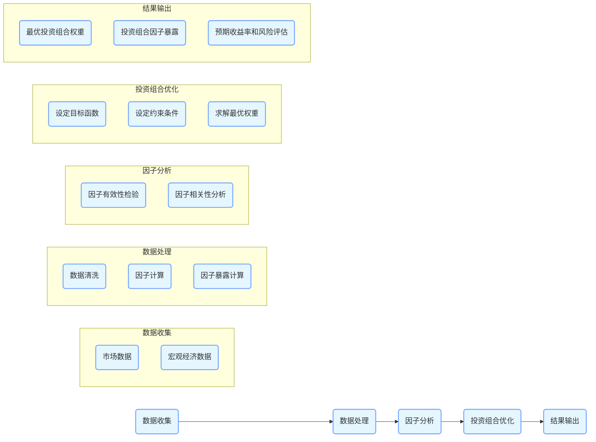

# 构建智能化的个人投资风格因子暴露优化系统

> 关键词：个人投资、风格因子暴露、优化系统、智能化、因子模型

> 摘要：本文聚焦于构建智能化的个人投资风格因子暴露优化系统。首先介绍了该系统构建的背景，包括目的、预期读者、文档结构等内容。接着详细阐述了核心概念，如风格因子、因子暴露等，并给出相应的原理和架构示意图。在算法原理方面，使用 Python 代码进行详细讲解。同时，介绍了相关的数学模型和公式，并通过具体例子进行说明。通过项目实战，展示了开发环境搭建、源代码实现及代码解读过程。探讨了该系统在实际投资中的应用场景，推荐了学习资源、开发工具框架和相关论文著作。最后总结了系统未来的发展趋势与挑战，并对常见问题进行解答，提供了扩展阅读和参考资料。

## 1. 背景介绍 
### 1.1 目的和范围
在当今复杂多变的金融市场中，个人投资者面临着诸多挑战。一方面，市场信息海量且繁杂，投资者难以准确筛选和分析；另一方面，不同的投资风格在不同的市场环境下表现各异，个人投资者往往缺乏科学的方法来确定适合自己的投资风格并进行优化。构建智能化的个人投资风格因子暴露优化系统的目的在于为个人投资者提供一个科学、智能的工具，帮助他们更好地理解自己的投资风格，精准地衡量风格因子暴露程度，并通过优化算法实现投资组合的优化，从而提高投资收益，降低投资风险。

本系统的范围涵盖了从数据收集、因子计算、因子暴露分析到投资组合优化的全流程。它支持多种常见的投资风格因子，如价值因子、成长因子、动量因子等，并可以根据个人投资者的风险偏好、投资目标等个性化需求进行定制化的优化。

### 1.2 预期读者
本系统及相关技术内容主要面向以下几类读者：
- **个人投资者**：希望通过科学的方法优化自己的投资组合，提高投资收益的普通投资者。他们可能缺乏专业的金融知识和复杂的数据分析能力，但渴望借助智能化系统来辅助自己做出更明智的投资决策。
- **金融从业者**：包括投资顾问、基金经理等，他们可以将该系统作为一个参考工具，为客户提供更专业的投资建议，或者用于自己的投资研究和组合管理工作。
- **技术开发者**：对金融科技领域感兴趣，希望将人工智能、机器学习等技术应用于金融投资领域的程序员、软件工程师等。他们可以从本系统的设计和实现中获取灵感，开发出更先进的金融投资系统。

### 1.3 文档结构概述
本文将按照以下结构详细介绍智能化的个人投资风格因子暴露优化系统：
- **核心概念与联系**：介绍风格因子、因子暴露等核心概念，以及它们之间的关系，并通过示意图和流程图进行直观展示。
- **核心算法原理 & 具体操作步骤**：讲解用于因子暴露分析和投资组合优化的核心算法，使用 Python 代码进行详细实现和解释。
- **数学模型和公式 & 详细讲解 & 举例说明**：介绍系统中涉及的数学模型和公式，如因子模型、优化目标函数等，并通过具体例子进行说明。
- **项目实战：代码实际案例和详细解释说明**：展示如何搭建开发环境，实现系统的源代码，并对代码进行详细解读和分析。
- **实际应用场景**：探讨该系统在实际投资中的应用场景，如资产配置、选股等。
- **工具和资源推荐**：推荐学习相关知识和开发系统所需的工具、资源和论文著作。
- **总结：未来发展趋势与挑战**：总结系统的发展现状，分析未来的发展趋势和可能面临的挑战。
- **附录：常见问题与解答**：对读者可能关心的常见问题进行解答。
- **扩展阅读 & 参考资料**：提供相关的扩展阅读内容和参考资料，方便读者进一步深入学习。

### 1.4 术语表
#### 1.4.1 核心术语定义
- **风格因子**：是指能够解释资产收益率差异的一组特征变量。常见的风格因子包括价值因子（如市盈率、市净率等）、成长因子（如净利润增长率、营业收入增长率等）、动量因子（如过去一段时间的股票收益率）等。
- **因子暴露**：是指资产或投资组合对某个风格因子的敏感程度。可以理解为资产或投资组合的收益率与风格因子之间的线性关系系数。
- **投资组合优化**：是指在一定的约束条件下，通过调整投资组合中各资产的权重，使得投资组合的某个目标函数达到最优的过程。常见的目标函数包括最大化预期收益率、最小化风险等。

#### 1.4.2 相关概念解释
- **因子模型**：是一种用于描述资产收益率与风格因子之间关系的数学模型。常见的因子模型有单因子模型和多因子模型。单因子模型假设资产收益率只受一个风格因子的影响，而多因子模型则考虑多个风格因子的综合影响。
- **风险度量**：是指对投资组合风险的量化评估。常见的风险度量指标包括标准差、方差、夏普比率等。标准差和方差衡量的是投资组合收益率的波动程度，夏普比率则衡量的是投资组合在承担单位风险时所能获得的超额收益率。

#### 1.4.3 缩略词列表
- **CAPM**：Capital Asset Pricing Model，资本资产定价模型，是一种单因子模型，用于描述资产预期收益率与市场风险之间的关系。
- **Fama - French三因子模型**：由 Eugene F. Fama 和 Kenneth R. French 提出的多因子模型，考虑了市场因子、规模因子和价值因子对资产收益率的影响。
- **Sharpe Ratio**：夏普比率，用于衡量投资组合的风险调整后收益。

## 2. 核心概念与联系 

### 核心概念原理
#### 风格因子
风格因子是金融市场中用于解释资产收益率差异的关键因素。不同的风格因子反映了资产的不同特征。例如，价值因子关注资产的估值水平，通常用市盈率（PE）、市净率（PB）等指标来衡量。低市盈率或市净率的股票往往被认为是价值型股票，它们可能被市场低估，具有较高的投资价值。成长因子则侧重于资产的成长潜力，如净利润增长率、营业收入增长率等。具有较高成长因子值的股票通常代表着公司具有较强的盈利能力和发展前景。动量因子反映了资产价格的短期趋势，过去一段时间内收益率较高的股票可能在未来继续保持上涨趋势。

#### 因子暴露
因子暴露衡量了资产或投资组合对某个风格因子的敏感程度。假设我们有一个投资组合，其中包含多只股票，每只股票对不同风格因子都有一定的暴露程度。投资组合的因子暴露可以通过加权平均的方法计算得到，权重为各股票在投资组合中的比例。因子暴露的大小表示投资组合的收益率对该风格因子的变化有多敏感。例如，如果一个投资组合对价值因子的暴露为正且较大，那么当价值因子上升时，该投资组合的收益率可能会随之上升。

#### 投资组合优化
投资组合优化的目标是在给定的约束条件下，找到一组最优的资产权重，使得投资组合的某个目标函数达到最优。常见的目标函数包括最大化预期收益率、最小化风险等。在考虑风格因子暴露的情况下，投资组合优化不仅要考虑资产的预期收益率和风险，还要考虑投资组合对不同风格因子的暴露程度。例如，投资者可能希望在控制风险的前提下，使投资组合对某些风格因子有特定的暴露，以实现特定的投资目标。

### 架构的文本示意图
```plaintext
数据收集层
|
|-- 市场数据（股票价格、财务报表等）
|-- 宏观经济数据
|
数据处理层
|
|-- 数据清洗（去除缺失值、异常值等）
|-- 因子计算（计算风格因子值）
|-- 因子暴露计算
|
因子分析层
|
|-- 因子有效性检验
|-- 因子相关性分析
|
投资组合优化层
|
|-- 设定目标函数（如最大化预期收益率、最小化风险等）
|-- 设定约束条件（如权重限制、因子暴露限制等）
|-- 求解最优权重
|
结果输出层
|
|-- 最优投资组合权重
|-- 投资组合的因子暴露情况
|-- 投资组合的预期收益率和风险评估
```

### Mermaid 流程图


## 3. 核心算法原理 & 具体操作步骤 

### 核心算法原理
#### 因子暴露计算
假设我们有 $n$ 只股票，$m$ 个风格因子。对于第 $i$ 只股票，其在第 $j$ 个风格因子上的暴露值为 $x_{ij}$。投资组合中第 $i$ 只股票的权重为 $w_i$，且 $\sum_{i = 1}^{n} w_i = 1$。则投资组合在第 $j$ 个风格因子上的暴露值 $X_j$ 可以通过以下公式计算：

$$X_j=\sum_{i = 1}^{n} w_i x_{ij}$$

#### 投资组合优化
常见的投资组合优化目标是在给定的风险水平下最大化预期收益率，或者在给定的预期收益率水平下最小化风险。这里我们以最小化投资组合的风险为例，使用均值 - 方差模型。投资组合的方差 $\sigma_p^2$ 可以表示为：

$$\sigma_p^2=\sum_{i = 1}^{n}\sum_{k = 1}^{n} w_i w_k \sigma_{ik}$$

其中，$\sigma_{ik}$ 是第 $i$ 只股票和第 $k$ 只股票收益率的协方差。

在考虑因子暴露约束的情况下，投资组合优化问题可以表示为一个带约束的优化问题：

$$\min_{w} \sigma_p^2=\sum_{i = 1}^{n}\sum_{k = 1}^{n} w_i w_k \sigma_{ik}$$

约束条件：

$$\sum_{i = 1}^{n} w_i = 1$$

$$X_j^{min}\leq\sum_{i = 1}^{n} w_i x_{ij}\leq X_j^{max}, j = 1,2,\cdots,m$$

$$w_i\geq0, i = 1,2,\cdots,n$$

其中，$X_j^{min}$ 和 $X_j^{max}$ 分别是投资组合在第 $j$ 个风格因子上的暴露下限和上限。

### 具体操作步骤

#### 步骤 1：数据收集
收集市场数据，包括股票价格、财务报表等，以及宏观经济数据。可以使用金融数据接口，如 Yahoo Finance、Tushare 等。

#### 步骤 2：数据处理
- 数据清洗：去除缺失值、异常值等。
- 因子计算：根据收集到的数据计算各股票的风格因子值。
- 因子暴露计算：计算各股票在不同风格因子上的暴露值。

#### 步骤 3：因子分析
- 因子有效性检验：检验各风格因子对股票收益率的解释能力。可以使用回归分析等方法。
- 因子相关性分析：分析不同风格因子之间的相关性，避免因子之间的多重共线性。

#### 步骤 4：投资组合优化
- 设定目标函数：选择合适的目标函数，如最小化风险。
- 设定约束条件：包括权重约束、因子暴露约束等。
- 求解最优权重：使用优化算法，如二次规划算法，求解满足约束条件的最优投资组合权重。

#### 步骤 5：结果输出
输出最优投资组合权重、投资组合的因子暴露情况以及投资组合的预期收益率和风险评估。

### Python 源代码实现
```python
import numpy as np
import pandas as pd
from scipy.optimize import minimize

# 生成示例数据
np.random.seed(0)
n = 5  # 股票数量
m = 3  # 风格因子数量
returns = np.random.randn(100, n)  # 股票收益率数据
factor_exposures = np.random.randn(n, m)  # 股票的因子暴露数据

# 计算协方差矩阵
cov_matrix = np.cov(returns, rowvar=False)

# 定义目标函数：最小化投资组合的风险
def objective_function(weights):
    return np.dot(weights.T, np.dot(cov_matrix, weights))

# 定义约束条件
# 权重之和为 1
constraint1 = {'type': 'eq', 'fun': lambda weights: np.sum(weights) - 1}
# 权重非负
bounds = [(0, None) for _ in range(n)]

# 因子暴露约束
factor_exposure_lower = np.array([-0.5, -0.5, -0.5])
factor_exposure_upper = np.array([0.5, 0.5, 0.5])

def factor_exposure_constraint(weights, factor_exposures, j, bound_type='lower'):
    exposure = np.dot(weights, factor_exposures[:, j])
    if bound_type == 'lower':
        return exposure - factor_exposure_lower[j]
    else:
        return factor_exposure_upper[j] - exposure

constraints = [constraint1]
for j in range(m):
    constraints.append({'type': 'ineq', 'fun': lambda weights, j=j: factor_exposure_constraint(weights, factor_exposures, j, 'lower')})
    constraints.append({'type': 'ineq', 'fun': lambda weights, j=j: factor_exposure_constraint(weights, factor_exposures, j, 'upper')})

# 初始权重
initial_weights = np.ones(n) / n

# 求解最优权重
result = minimize(objective_function, initial_weights, method='SLSQP', bounds=bounds, constraints=constraints)

# 输出结果
optimal_weights = result.x
print("最优投资组合权重:", optimal_weights)
portfolio_factor_exposure = np.dot(optimal_weights, factor_exposures)
print("投资组合的因子暴露情况:", portfolio_factor_exposure)
portfolio_risk = objective_function(optimal_weights)
print("投资组合的风险:", portfolio_risk)
```

## 4. 数学模型和公式 & 详细讲解 & 举例说明 

### 因子模型
#### 单因子模型
单因子模型假设资产收益率只受一个风格因子的影响。最经典的单因子模型是资本资产定价模型（CAPM），其公式为：

$$R_i = R_f+\beta_i (R_m - R_f)+\epsilon_i$$

其中，$R_i$ 是资产 $i$ 的收益率，$R_f$ 是无风险收益率，$R_m$ 是市场组合的收益率，$\beta_i$ 是资产 $i$ 对市场因子的暴露（即贝塔系数），$\epsilon_i$ 是资产 $i$ 的特有收益率，且满足 $E(\epsilon_i)=0$。

例如，假设无风险收益率 $R_f = 0.02$，市场组合的收益率 $R_m = 0.1$，某股票的贝塔系数 $\beta = 1.2$。则该股票的预期收益率为：

$$R = 0.02+1.2\times(0.1 - 0.02)=0.116$$

#### 多因子模型
多因子模型考虑多个风格因子对资产收益率的综合影响。Fama - French 三因子模型是一个经典的多因子模型，其公式为：

$$R_i - R_f=\alpha_i+\beta_{i,MKT} (R_m - R_f)+\beta_{i,SMB} SMB+\beta_{i,HML} HML+\epsilon_i$$

其中，$SMB$ 是规模因子，代表小市值股票组合与大市值股票组合的收益率之差；$HML$ 是价值因子，代表高市净率股票组合与低市净率股票组合的收益率之差；$\beta_{i,MKT}$、$\beta_{i,SMB}$ 和 $\beta_{i,HML}$ 分别是资产 $i$ 对市场因子、规模因子和价值因子的暴露。

### 投资组合优化模型
#### 均值 - 方差模型
均值 - 方差模型由 Harry Markowitz 提出，其目标是在给定的预期收益率水平下最小化投资组合的风险，或者在给定的风险水平下最大化投资组合的预期收益率。投资组合的预期收益率 $E(R_p)$ 和方差 $\sigma_p^2$ 分别为：

$$E(R_p)=\sum_{i = 1}^{n} w_i E(R_i)$$

$$\sigma_p^2=\sum_{i = 1}^{n}\sum_{k = 1}^{n} w_i w_k \sigma_{ik}$$

其中，$E(R_i)$ 是资产 $i$ 的预期收益率，$\sigma_{ik}$ 是资产 $i$ 和资产 $k$ 收益率的协方差。

假设我们有两只股票 A 和 B，预期收益率分别为 $E(R_A)=0.1$ 和 $E(R_B)=0.15$，收益率的标准差分别为 $\sigma_A = 0.2$ 和 $\sigma_B = 0.3$，两只股票收益率的相关系数为 $\rho_{AB}=0.5$。则协方差 $\sigma_{AB}=\rho_{AB}\sigma_A\sigma_B = 0.5\times0.2\times0.3 = 0.03$。

设股票 A 的权重为 $w_A$，股票 B 的权重为 $w_B = 1 - w_A$。投资组合的预期收益率为：

$$E(R_p)=w_A\times0.1+(1 - w_A)\times0.15 = 0.15 - 0.05w_A$$

投资组合的方差为：

$$\sigma_p^2=w_A^2\times0.2^2+(1 - w_A)^2\times0.3^2+2\times w_A\times(1 - w_A)\times0.03$$

假设我们希望投资组合的预期收益率为 $0.12$，则可以通过解方程 $0.15 - 0.05w_A = 0.12$ 得到 $w_A = 0.6$，$w_B = 0.4$。将 $w_A = 0.6$ 和 $w_B = 0.4$ 代入方差公式，可以计算出投资组合的方差。

### 风险度量指标
#### 标准差
标准差是衡量投资组合收益率波动程度的常用指标。投资组合的标准差 $\sigma_p$ 为：

$$\sigma_p=\sqrt{\sigma_p^2}=\sqrt{\sum_{i = 1}^{n}\sum_{k = 1}^{n} w_i w_k \sigma_{ik}}$$

#### 夏普比率
夏普比率衡量的是投资组合在承担单位风险时所能获得的超额收益率。其公式为：

$$Sharpe Ratio=\frac{E(R_p)-R_f}{\sigma_p}$$

例如，投资组合的预期收益率 $E(R_p)=0.12$，无风险收益率 $R_f = 0.02$，标准差 $\sigma_p = 0.1$，则夏普比率为：

$$Sharpe Ratio=\frac{0.12 - 0.02}{0.1}=1$$

## 5. 项目实战：代码实际案例和详细解释说明 

### 5.1  开发环境搭建
#### 安装 Python
首先，需要安装 Python 环境。建议使用 Python 3.7 及以上版本。可以从 Python 官方网站（https://www.python.org/downloads/）下载并安装适合自己操作系统的 Python 版本。

#### 安装必要的库
在命令行中使用以下命令安装必要的库：
```sh
pip install numpy pandas scipy matplotlib yfinance
```
- `numpy`：用于数值计算。
- `pandas`：用于数据处理和分析。
- `scipy`：用于优化算法。
- `matplotlib`：用于数据可视化。
- `yfinance`：用于获取股票市场数据。

### 5.2  源代码详细实现和代码解读
```python
import numpy as np
import pandas as pd
import yfinance as yf
from scipy.optimize import minimize
import matplotlib.pyplot as plt

# 步骤 1：数据收集
# 定义股票列表和时间范围
tickers = ['AAPL', 'MSFT', 'GOOG', 'AMZN', 'FB']
start_date = '2020-01-01'
end_date = '2021-01-01'

# 获取股票数据
data = yf.download(tickers, start=start_date, end=end_date)['AdjClose']

# 计算收益率
returns = data.pct_change().dropna()

# 步骤 2：数据处理
# 计算协方差矩阵
cov_matrix = returns.cov()

# 假设我们使用简单的因子暴露数据
# 这里为了简化，随机生成因子暴露数据
n = len(tickers)
m = 2  # 假设两个风格因子
factor_exposures = np.random.randn(n, m)

# 步骤 3：投资组合优化
# 定义目标函数：最小化投资组合的风险
def objective_function(weights):
    return np.dot(weights.T, np.dot(cov_matrix, weights))

# 定义约束条件
# 权重之和为 1
constraint1 = {'type': 'eq', 'fun': lambda weights: np.sum(weights) - 1}
# 权重非负
bounds = [(0, None) for _ in range(n)]

# 因子暴露约束
factor_exposure_lower = np.array([-0.5, -0.5])
factor_exposure_upper = np.array([0.5, 0.5])

def factor_exposure_constraint(weights, factor_exposures, j, bound_type='lower'):
    exposure = np.dot(weights, factor_exposures[:, j])
    if bound_type == 'lower':
        return exposure - factor_exposure_lower[j]
    else:
        return factor_exposure_upper[j] - exposure

constraints = [constraint1]
for j in range(m):
    constraints.append({'type': 'ineq', 'fun': lambda weights, j=j: factor_exposure_constraint(weights, factor_exposures, j, 'lower')})
    constraints.append({'type': 'ineq', 'fun': lambda weights, j=j: factor_exposure_constraint(weights, factor_exposures, j, 'upper')})

# 初始权重
initial_weights = np.ones(n) / n

# 求解最优权重
result = minimize(objective_function, initial_weights, method='SLSQP', bounds=bounds, constraints=constraints)

# 步骤 4：结果输出
optimal_weights = result.x
print("最优投资组合权重:", optimal_weights)
portfolio_factor_exposure = np.dot(optimal_weights, factor_exposures)
print("投资组合的因子暴露情况:", portfolio_factor_exposure)
portfolio_risk = objective_function(optimal_weights)
print("投资组合的风险:", portfolio_risk)

# 步骤 5：数据可视化
plt.bar(tickers, optimal_weights)
plt.xlabel('股票')
plt.ylabel('权重')
plt.title('最优投资组合权重')
plt.show()
```

### 5.3  代码解读与分析
#### 数据收集部分
使用 `yfinance` 库从雅虎财经获取指定股票在指定时间范围内的调整后收盘价数据，并计算股票的收益率。

#### 数据处理部分
计算股票收益率的协方差矩阵，用于后续的投资组合风险计算。同时，为了简化，随机生成了股票的因子暴露数据。

#### 投资组合优化部分
- 定义目标函数：使用 `objective_function` 函数定义投资组合的风险（即方差）作为目标函数，目标是最小化该风险。
- 定义约束条件：包括权重之和为 1 的等式约束和权重非负的边界约束，以及因子暴露的不等式约束。
- 求解最优权重：使用 `scipy.optimize.minimize` 函数，选择 `SLSQP` 方法求解满足约束条件的最优投资组合权重。

#### 结果输出部分
输出最优投资组合权重、投资组合的因子暴露情况和投资组合的风险。

#### 数据可视化部分
使用 `matplotlib` 库绘制柱状图，直观展示最优投资组合中各股票的权重。

## 6. 实际应用场景 
### 资产配置
投资者可以使用智能化的个人投资风格因子暴露优化系统进行资产配置。通过分析不同资产对各种风格因子的暴露程度，结合自己的风险偏好和投资目标，系统可以帮助投资者确定最优的资产配置比例。例如，一个风险偏好较低的投资者可能希望投资组合对价值因子有较高的暴露，同时控制对动量因子的暴露，以降低投资组合的波动性。系统可以根据这些要求，计算出满足条件的最优资产配置方案。

### 选股
在选股过程中，该系统可以帮助投资者筛选出符合自己投资风格的股票。投资者可以根据自己关注的风格因子，设定因子暴露的范围，系统会从众多股票中筛选出因子暴露在指定范围内的股票。例如，投资者偏好成长型股票，希望投资组合对成长因子有较高的暴露，系统可以筛选出成长因子暴露较高的股票，并结合其他因素（如估值、流动性等）进行进一步的分析和筛选。

### 风险管理
通过监控投资组合的因子暴露情况，投资者可以及时发现投资组合的风险特征变化。如果投资组合对某个风格因子的暴露超出了预期范围，可能意味着投资组合面临较大的风险。投资者可以根据系统的提示，及时调整投资组合的权重，以降低风险。例如，如果投资组合对市场因子的暴露突然增大，可能意味着投资组合在市场下跌时会遭受较大的损失，投资者可以适当降低股票的权重，增加债券等避险资产的比例。

### 绩效评估
系统可以帮助投资者评估投资组合的绩效。通过比较投资组合的实际因子暴露情况和预期因子暴露情况，以及投资组合的实际收益率和预期收益率，可以判断投资组合的绩效是否符合预期。如果投资组合的实际收益率低于预期收益率，且因子暴露情况与预期不符，投资者可以分析原因，调整投资策略。

## 7. 工具和资源推荐
### 7.1 学习资源推荐
#### 7.1.1 书籍推荐
- 《投资学》（原书第 10 版），滋维·博迪（Zvi Bodie）等著。这本书是投资学领域的经典教材，全面介绍了投资学的基本概念、理论和方法，包括资产定价模型、投资组合理论、风险管理等内容，对于理解个人投资风格因子暴露优化系统的理论基础非常有帮助。
- 《聪明的投资者》，本杰明·格雷厄姆（Benjamin Graham）著。这本书是价值投资的经典之作，介绍了价值投资的理念和方法，对于理解价值因子在投资中的应用具有重要意义。
- 《量化投资：策略与技术》，丁鹏著。本书详细介绍了量化投资的基本概念、策略和技术，包括因子模型、投资组合优化等内容，适合对量化投资感兴趣的读者深入学习。

#### 7.1.2 在线课程
- Coursera 上的“投资学原理”课程。该课程由知名大学的教授授课，系统地介绍了投资学的基本原理和方法，包括资产定价、投资组合理论等内容，通过视频讲解、案例分析和在线作业等形式，帮助学习者掌握投资学的核心知识。
- edX 上的“量化金融与风险管理”课程。该课程聚焦于量化金融领域，介绍了量化投资的策略和技术，以及风险管理的方法和工具，适合有一定金融和编程基础的学习者深入学习。

#### 7.1.3 技术博客和网站
- 优矿（uqer.io）：一个专业的量化投资平台，提供了丰富的金融数据、量化策略开发工具和技术文档，同时还有活跃的社区，用户可以在社区中交流量化投资的经验和心得。
- 聚宽（joinquant.com）：也是一个知名的量化投资平台，提供了强大的量化策略回测和实盘交易功能，以及丰富的学习资源和技术博客，适合量化投资初学者和开发者学习和实践。

### 7.2 开发工具框架推荐
#### 7.2.1 IDE和编辑器
- PyCharm：一款专业的 Python 集成开发环境，具有强大的代码编辑、调试、代码分析等功能，适合开发复杂的 Python 项目，包括智能化的个人投资风格因子暴露优化系统。
- Jupyter Notebook：一个交互式的开发环境，支持多种编程语言，尤其适合数据分析和机器学习项目的开发。在 Jupyter Notebook 中，用户可以将代码、文本、图表等内容整合在一起，方便进行数据探索和模型开发。

#### 7.2.2 调试和性能分析工具
- pdb：Python 自带的调试工具，可以帮助开发者在代码运行过程中进行调试，查看变量的值、执行流程等，定位和解决代码中的问题。
- cProfile：Python 标准库中的性能分析工具，可以帮助开发者分析代码的性能瓶颈，找出执行时间较长的代码段，进行优化。

#### 7.2.3 相关框架和库
- NumPy：一个用于数值计算的 Python 库，提供了高效的多维数组对象和各种数学函数，是进行金融数据处理和计算的基础库。
- Pandas：一个用于数据处理和分析的 Python 库，提供了灵活的数据结构（如 DataFrame 和 Series）和各种数据处理方法，方便进行金融数据的清洗、整理和分析。
- Scikit-learn：一个用于机器学习的 Python 库，提供了丰富的机器学习算法和工具，如回归分析、分类算法、聚类算法等，可以用于因子有效性检验、投资组合优化等任务。

### 7.3 相关论文著作推荐
#### 7.3.1 经典论文
- “The Capital Asset Pricing Model: Theory and Evidence”，由 Eugene F. Fama 和 Kenneth R. French 撰写。这篇论文对资本资产定价模型进行了深入的研究和分析，探讨了该模型的理论基础和实证证据，是资产定价领域的经典论文。
- “Common Risk Factors in the Returns on Stocks and Bonds”，同样由 Eugene F. Fama 和 Kenneth R. French 撰写。这篇论文提出了著名的 Fama - French 三因子模型，为多因子模型的发展奠定了基础。

#### 7.3.2 最新研究成果
- 可以关注《Journal of Finance》《Review of Financial Studies》等国际知名金融学术期刊，这些期刊会发表最新的金融研究成果，包括因子模型、投资组合优化等方面的研究。

#### 7.3.3 应用案例分析
- 《量化投资策略与技术案例分析》，通过实际案例介绍了量化投资的策略和技术，包括因子模型的应用、投资组合优化的实践等内容，对于理解智能化的个人投资风格因子暴露优化系统在实际中的应用具有重要的参考价值。

## 8. 总结：未来发展趋势与挑战
### 未来发展趋势
#### 智能化程度不断提高
随着人工智能和机器学习技术的不断发展，智能化的个人投资风格因子暴露优化系统将越来越智能化。系统可以自动学习投资者的投资偏好和行为模式，根据市场变化实时调整投资组合的权重和因子暴露，为投资者提供更加个性化、智能化的投资建议。

#### 多因子模型的不断完善
目前的多因子模型主要考虑了少数几个常见的风格因子，如价值因子、成长因子、动量因子等。未来，随着对金融市场的深入研究，可能会发现更多的有效风格因子，多因子模型将不断完善，能够更准确地解释资产收益率的差异。

#### 与其他金融科技技术的融合
智能化的个人投资风格因子暴露优化系统将与其他金融科技技术，如区块链、大数据、云计算等深度融合。例如，利用区块链技术可以提高金融数据的安全性和可信度，利用大数据技术可以获取更丰富的金融数据，利用云计算技术可以提高系统的计算能力和处理效率。

### 挑战
#### 数据质量和可靠性
金融数据的质量和可靠性是构建智能化的个人投资风格因子暴露优化系统的关键。数据中可能存在缺失值、异常值等问题，会影响因子计算和投资组合优化的结果。同时，金融数据的获取渠道也存在一定的局限性，可能会导致数据不完整或不准确。

#### 因子的有效性和稳定性
不同的风格因子在不同的市场环境下表现可能不同，有些因子的有效性和稳定性可能较差。如何选择有效的风格因子，并确保因子在不同市场环境下的稳定性，是系统面临的一个挑战。

#### 模型的复杂性和可解释性
随着多因子模型的不断完善和系统智能化程度的提高，模型的复杂性也会不断增加。复杂的模型可能会导致可解释性降低，投资者难以理解模型的决策过程和结果。如何在保证模型准确性的前提下，提高模型的可解释性，是需要解决的问题。

## 9. 附录：常见问题与解答
### 问题 1：如何选择合适的风格因子？
解答：选择合适的风格因子需要考虑多个因素。首先，可以参考金融学术研究的成果，选择一些被广泛认可的风格因子，如价值因子、成长因子、动量因子等。其次，需要结合自己的投资目标和风险偏好。例如，如果投资者偏好长期投资，可以关注价值因子和成长因子；如果投资者偏好短期交易，可以关注动量因子。此外，还需要对因子的有效性和稳定性进行检验，选择在不同市场环境下表现较为稳定的因子。

### 问题 2：因子暴露约束的设定有什么依据？
解答：因子暴露约束的设定需要根据投资者的投资目标和风险偏好来确定。例如，如果投资者希望投资组合具有较高的价值特征，可以设定对价值因子的暴露下限；如果投资者担心投资组合的波动过大，可以设定对某些高风险因子的暴露上限。同时，还可以参考历史数据和市场经验，合理设定因子暴露的范围。

### 问题 3：系统的计算结果是否一定准确？
解答：系统的计算结果受到多种因素的影响，包括数据质量、因子模型的准确性、优化算法的选择等。虽然系统使用了科学的方法和算法进行计算，但并不能保证计算结果一定准确。在实际应用中，投资者需要结合自己的判断和市场情况，对系统的计算结果进行评估和调整。

### 问题 4：如何评估系统的性能？
解答：可以从多个方面评估系统的性能。首先，可以比较投资组合的实际收益率和预期收益率，评估系统的收益预测能力。其次，可以比较投资组合的实际风险和预期风险，评估系统的风险控制能力。此外，还可以分析投资组合的因子暴露情况，判断系统是否能够实现投资者的因子暴露目标。

## 10. 扩展阅读 & 参考资料
### 扩展阅读
- 《行为金融学》：了解投资者的心理和行为对投资决策的影响，有助于更好地理解投资风格和因子暴露的变化。
- 《金融时间序列分析》：学习金融时间序列数据的分析方法，对于处理和分析金融市场数据非常有帮助。

### 参考资料
- 雅虎财经（https://finance.yahoo.com/）：提供丰富的金融市场数据。
- 万得资讯（https://www.wind.com.cn/）：国内专业的金融数据服务提供商。
- 中国证券监督管理委员会（https://www.csrc.gov.cn/）：获取国内金融市场的政策法规和监管信息。

作者：AI天才研究院/AI Genius Institute & 禅与计算机程序设计艺术 /Zen And The Art of Computer Programming