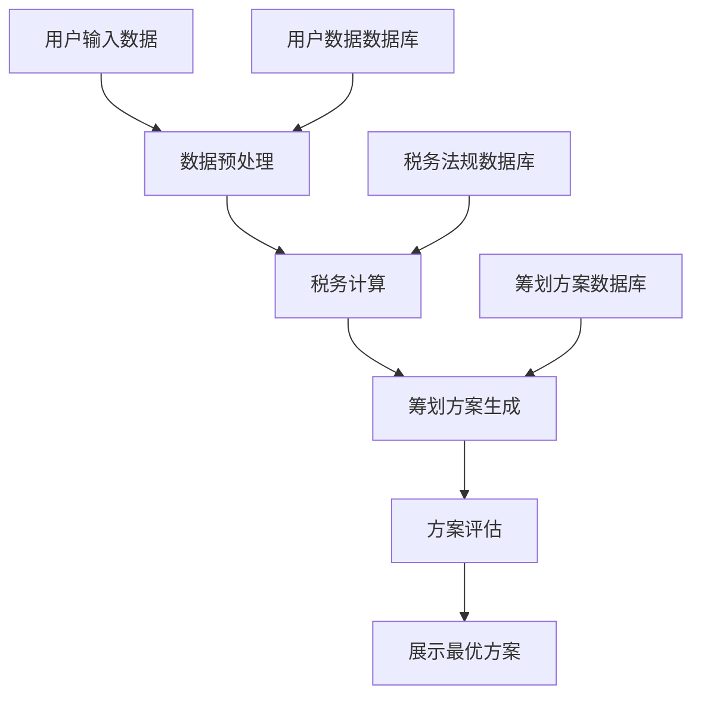

# 构建智能化的个人税务筹划优化助手

> 关键词：个人税务筹划、智能化助手、优化算法、机器学习、税务法规

> 摘要：本文旨在探讨如何构建一个智能化的个人税务筹划优化助手。首先介绍了个人税务筹划的背景和构建该助手的目的、适用读者等信息。接着阐述了相关核心概念及其联系，详细讲解了核心算法原理与具体操作步骤，包括使用 Python 代码示例。给出了数学模型和公式并举例说明。通过项目实战，展示了开发环境搭建、源代码实现及解读。分析了该助手的实际应用场景，推荐了学习资源、开发工具框架以及相关论文著作。最后总结了未来发展趋势与挑战，并提供了常见问题解答和扩展阅读参考资料。

## 1. 背景介绍 
### 1.1 目的和范围
个人税务筹划是指在合法合规的前提下，通过对个人收入、支出等财务活动的合理安排，以达到降低税负、实现个人财务利益最大化的目的。随着经济的发展和税收法规的日益复杂，个人在进行税务筹划时面临着诸多挑战，如法规理解困难、计算复杂等。构建智能化的个人税务筹划优化助手的目的在于利用先进的技术手段，为个人提供便捷、准确、高效的税务筹划方案。本项目的范围涵盖了常见的个人收入类型，如工资薪金、劳务报酬、稿酬、特许权使用费等，以及相关的扣除项目和税收优惠政策。

### 1.2 预期读者
本文的预期读者包括对个人税务筹划感兴趣的普通大众、财务从业人员、税务顾问以及希望学习智能化系统开发的程序员和技术爱好者。普通大众可以通过了解该助手的功能和原理，更好地进行个人税务筹划；财务从业人员和税务顾问可以借鉴该助手的设计思路，提升工作效率和服务质量；程序员和技术爱好者可以学习到相关的技术实现细节，用于自己的项目开发。

### 1.3 文档结构概述
本文将按照以下结构进行组织：首先介绍个人税务筹划的背景和构建助手的相关信息；然后阐述核心概念及其联系，包括税务筹划的基本原理和助手的架构；接着详细讲解核心算法原理与具体操作步骤，并给出 Python 代码示例；再介绍数学模型和公式，通过举例说明其应用；之后进行项目实战，包括开发环境搭建、源代码实现和解读；分析该助手的实际应用场景；推荐相关的学习资源、开发工具框架和论文著作；最后总结未来发展趋势与挑战，提供常见问题解答和扩展阅读参考资料。

### 1.4 术语表
#### 1.4.1 核心术语定义
- **个人税务筹划**：在法律允许的范围内，对个人的财务活动进行合理安排，以降低税负的行为。
- **智能化助手**：利用人工智能技术，能够自动分析和处理数据，为用户提供决策支持的系统。
- **税务法规**：国家制定的关于税收征收和管理的法律法规。
- **税收优惠政策**：政府为了鼓励某些行为或支持特定群体，给予的税收减免或优惠措施。
- **税负**：个人或企业实际缴纳的税款占其收入的比例。

#### 1.4.2 相关概念解释
- **累进税率**：随着应纳税所得额的增加，税率也随之提高的税率制度。例如，工资薪金所得适用的税率就是累进税率。
- **专项附加扣除**：包括子女教育、继续教育、大病医疗、住房贷款利息、住房租金、赡养老人等六项，是在计算应纳税所得额时可以扣除的项目。
- **综合所得**：包括工资薪金所得、劳务报酬所得、稿酬所得、特许权使用费所得四项，按纳税年度合并计算个人所得税。

#### 1.4.3 缩略词列表
- **AI**：Artificial Intelligence，人工智能
- **ML**：Machine Learning，机器学习
- **API**：Application Programming Interface，应用程序编程接口

## 2. 核心概念与联系 
### 核心概念原理
个人税务筹划的核心原理是基于税收法规，通过合理安排个人的收入和支出，利用税收优惠政策，降低应纳税所得额，从而减少税负。智能化的个人税务筹划优化助手则是利用人工智能和机器学习技术，对大量的税务数据进行分析和学习，为用户提供个性化的税务筹划方案。

助手的工作流程主要包括以下几个步骤：
1. **数据收集**：收集用户的个人信息、收入信息、扣除项目信息等。
2. **数据预处理**：对收集到的数据进行清洗、转换和归一化等处理，以便后续的分析和计算。
3. **税务计算**：根据用户提供的数据和当前的税收法规，计算用户的应纳税额。
4. **筹划方案生成**：利用优化算法，结合税收优惠政策，为用户生成多种税务筹划方案。
5. **方案评估**：对生成的筹划方案进行评估，选择最优方案推荐给用户。

### 架构的文本示意图
```plaintext
用户界面层
|
|-- 数据输入接口：用户输入个人信息、收入信息、扣除项目信息等
|-- 方案展示界面：展示生成的税务筹划方案
|
业务逻辑层
|
|-- 数据预处理模块：清洗、转换和归一化数据
|-- 税务计算模块：根据税收法规计算应纳税额
|-- 筹划方案生成模块：利用优化算法生成筹划方案
|-- 方案评估模块：评估筹划方案，选择最优方案
|
数据存储层
|
|-- 税务法规数据库：存储最新的税收法规和政策
|-- 用户数据数据库：存储用户的个人信息和历史数据
|-- 筹划方案数据库：存储生成的筹划方案
```

### Mermaid 流程图


## 3. 核心算法原理 & 具体操作步骤 
### 核心算法原理
本助手主要使用的核心算法包括贪心算法和遗传算法。贪心算法是一种在每一步选择中都采取当前状态下最优的选择，从而希望导致结果是全局最优的算法。在税务筹划中，贪心算法可以用于快速生成一个可行的筹划方案。遗传算法是一种模拟自然选择和遗传机制的优化算法，通过不断迭代，逐步找到最优解。在税务筹划中，遗传算法可以用于生成更优的筹划方案。

### 具体操作步骤
#### 步骤 1：数据收集
用户通过助手的用户界面输入个人信息、收入信息、扣除项目信息等。例如，用户输入月工资收入、劳务报酬收入、是否有专项附加扣除等信息。

#### 步骤 2：数据预处理
对用户输入的数据进行清洗、转换和归一化等处理。例如，将收入信息转换为年度收入，对扣除项目信息进行验证和修正。

#### 步骤 3：税务计算
根据用户提供的数据和当前的税收法规，计算用户的应纳税额。以下是一个简单的 Python 代码示例，用于计算工资薪金所得的应纳税额：
```python
def calculate_tax(salary, deductions):
    # 计算应纳税所得额
    taxable_income = salary - 5000 - deductions
    if taxable_income <= 0:
        return 0
    # 税率表
    tax_rates = [
        (36000, 0.03, 0),
        (144000, 0.1, 2520),
        (300000, 0.2, 16920),
        (420000, 0.25, 31920),
        (660000, 0.3, 52920),
        (960000, 0.35, 85920),
        (float('inf'), 0.45, 181920)
    ]
    tax = 0
    for limit, rate, deduction in tax_rates:
        if taxable_income <= limit:
            tax = taxable_income * rate - deduction
            break
    return tax

# 示例数据
salary = 10000
deductions = 2000
tax = calculate_tax(salary * 12, deductions * 12)
print(f"应纳税额: {tax} 元")
```

#### 步骤 4：筹划方案生成
使用贪心算法和遗传算法生成多种税务筹划方案。例如，通过调整收入的发放方式、合理利用专项附加扣除等方式来降低税负。

#### 步骤 5：方案评估
对生成的筹划方案进行评估，选择最优方案推荐给用户。评估指标可以包括税负降低率、方案的可行性等。

## 4. 数学模型和公式 & 详细讲解 & 举例说明 
### 数学模型
个人所得税的计算可以用以下数学模型表示：
设 $I$ 为个人的年度综合所得，$D$ 为年度扣除项目，包括基本减除费用（60000 元/年）和专项附加扣除等，$T$ 为应纳税额。则应纳税所得额 $Y$ 为：
$$Y = I - D$$
根据应纳税所得额 $Y$，查找适用的税率 $r$ 和速算扣除数 $d$，应纳税额 $T$ 的计算公式为：
$$T = Y \times r - d$$

### 详细讲解
- **年度综合所得 $I$**：包括工资薪金所得、劳务报酬所得、稿酬所得、特许权使用费所得四项的年度收入总和。劳务报酬所得、稿酬所得、特许权使用费所得以每次收入减除费用后的余额为收入额，其中稿酬所得的收入额减按百分之七十计算。
- **年度扣除项目 $D$**：基本减除费用为每年 60000 元，专项附加扣除根据个人实际情况确定，如子女教育、继续教育、大病医疗、住房贷款利息、住房租金、赡养老人等。
- **税率 $r$ 和速算扣除数 $d$**：根据应纳税所得额 $Y$ 的范围，查找适用的税率和速算扣除数。税率表是累进税率，随着应纳税所得额的增加，税率也随之提高。

### 举例说明
假设小李的年度工资薪金收入为 200000 元，劳务报酬收入为 30000 元，稿酬收入为 10000 元，有一个子女正在接受全日制学历教育，可享受每月 1000 元的专项附加扣除，无其他扣除项目。

1. 计算年度综合所得 $I$：
    - 工资薪金收入：200000 元
    - 劳务报酬收入：$30000\times(1 - 20\%) = 24000$ 元
    - 稿酬收入：$10000\times(1 - 20\%)\times70\% = 5600$ 元
    - 年度综合所得 $I = 200000 + 24000 + 5600 = 229600$ 元

2. 计算年度扣除项目 $D$：
    - 基本减除费用：60000 元
    - 专项附加扣除：$1000\times12 = 12000$ 元
    - 年度扣除项目 $D = 60000 + 12000 = 72000$ 元

3. 计算应纳税所得额 $Y$：
    $$Y = I - D = 229600 - 72000 = 157600$$ 元

4. 查找适用的税率和速算扣除数：
    根据税率表，157600 元对应的税率 $r = 20\%$，速算扣除数 $d = 16920$ 元。

5. 计算应纳税额 $T$：
    $$T = Y \times r - d = 157600\times20\% - 16920 = 14600$$ 元

## 5. 项目实战：代码实际案例和详细解释说明 
### 5.1  开发环境搭建
#### 操作系统
建议使用 Windows、Linux 或 macOS 操作系统。

#### 编程语言
使用 Python 3.x 版本，Python 具有丰富的库和工具，适合快速开发。

#### 开发工具
可以使用 PyCharm、VS Code 等集成开发环境（IDE）。

#### 安装依赖库
在命令行中使用以下命令安装所需的依赖库：
```sh
pip install pandas numpy scikit-learn
```

### 5.2  源代码详细实现和代码解读
以下是一个完整的智能化个人税务筹划优化助手的 Python 代码示例：
```python
import pandas as pd
import numpy as np
from sklearn.linear_model import LinearRegression

# 税率表
tax_rates = [
    (36000, 0.03, 0),
    (144000, 0.1, 2520),
    (300000, 0.2, 16920),
    (420000, 0.25, 31920),
    (660000, 0.3, 52920),
    (960000, 0.35, 85920),
    (float('inf'), 0.45, 181920)
]

def calculate_tax(salary, deductions):
    # 计算应纳税所得额
    taxable_income = salary - 60000 - deductions
    if taxable_income <= 0:
        return 0
    tax = 0
    for limit, rate, deduction in tax_rates:
        if taxable_income <= limit:
            tax = taxable_income * rate - deduction
            break
    return tax

def generate_plans(salary, deductions):
    # 简单的筹划方案生成，调整扣除项目
    plans = []
    for extra_deduction in range(0, 10000, 1000):
        new_deductions = deductions + extra_deduction
        tax = calculate_tax(salary, new_deductions)
        plan = {
            "extra_deduction": extra_deduction,
            "tax": tax
        }
        plans.append(plan)
    return plans

def evaluate_plans(plans):
    # 评估筹划方案，选择税负最低的方案
    best_plan = min(plans, key=lambda x: x["tax"])
    return best_plan

# 示例数据
salary = 200000
deductions = 20000

# 生成筹划方案
plans = generate_plans(salary, deductions)

# 评估筹划方案
best_plan = evaluate_plans(plans)

print(f"原应纳税额: {calculate_tax(salary, deductions)} 元")
print(f"最优筹划方案额外扣除: {best_plan['extra_deduction']} 元")
print(f"最优筹划方案应纳税额: {best_plan['tax']} 元")
```

### 5.3  代码解读与分析
- **calculate_tax 函数**：该函数用于计算应纳税额，根据输入的年度工资收入和扣除项目，按照税率表计算应纳税额。
- **generate_plans 函数**：该函数用于生成筹划方案，通过调整扣除项目的金额，生成多个筹划方案，并计算每个方案的应纳税额。
- **evaluate_plans 函数**：该函数用于评估筹划方案，选择税负最低的方案作为最优方案。
- **主程序**：设置示例数据，调用 `generate_plans` 函数生成筹划方案，调用 `evaluate_plans` 函数评估筹划方案，最后输出原应纳税额、最优筹划方案的额外扣除金额和最优筹划方案的应纳税额。

## 6. 实际应用场景 
### 普通上班族
普通上班族可以使用该助手来优化自己的税务筹划。例如，合理安排工资薪金的发放方式，利用专项附加扣除等政策，降低自己的税负。助手可以根据用户的收入情况和扣除项目，提供个性化的筹划方案，帮助用户节省税款。

### 自由职业者
自由职业者的收入来源较为多样化，包括劳务报酬、稿酬等。他们可以使用该助手来合理规划不同类型收入的分配，充分利用税收优惠政策，降低综合税负。同时，助手可以帮助自由职业者了解自己的纳税义务，避免税务风险。

### 高收入人群
高收入人群面临着较高的税负，他们可以使用该助手来进行更复杂的税务筹划。例如，通过合理的资产配置、慈善捐赠等方式，降低应纳税所得额。助手可以根据高收入人群的具体情况，提供专业的筹划建议，实现税务优化。

### 财务从业人员和税务顾问
财务从业人员和税务顾问可以使用该助手作为工具，为客户提供更准确、高效的税务筹划服务。助手可以快速生成多种筹划方案，并进行评估和比较，帮助财务从业人员和税务顾问更好地为客户制定个性化的税务筹划方案。

## 7. 工具和资源推荐
### 7.1 学习资源推荐
#### 7.1.1 书籍推荐
- 《个人所得税实务操作与纳税筹划》：详细介绍了个人所得税的法规政策和纳税筹划方法，适合初学者和有一定基础的读者。
- 《Python 数据分析实战》：介绍了 Python 在数据分析领域的应用，包括数据处理、可视化和机器学习等方面，对于开发智能化税务筹划助手有很大帮助。
- 《人工智能：现代方法》：经典的人工智能教材，涵盖了人工智能的各个领域，如搜索算法、机器学习、自然语言处理等，为理解和应用人工智能技术提供了理论基础。

#### 7.1.2 在线课程
- Coursera 上的 “机器学习” 课程：由斯坦福大学教授 Andrew Ng 授课，是学习机器学习的经典课程，对于理解和应用机器学习算法有很大帮助。
- edX 上的 “Python 数据科学导论” 课程：介绍了 Python 在数据科学领域的应用，包括数据处理、数据分析和机器学习等方面，适合初学者。
- 中国大学 MOOC 上的 “税法” 课程：由国内知名高校教授授课，详细介绍了我国的税收法规和政策，对于了解个人所得税法规有很大帮助。

#### 7.1.3 技术博客和网站
- Medium：一个技术博客平台，上面有很多关于人工智能、机器学习和数据分析的文章，可以从中获取最新的技术动态和实践经验。
- Stack Overflow：一个技术问答社区，上面有很多程序员分享的代码和解决方案，可以帮助解决开发过程中遇到的问题。
- 国家税务总局官网：提供最新的税收法规和政策解读，是了解个人所得税法规的权威渠道。

### 7.2 开发工具框架推荐
#### 7.2.1 IDE和编辑器
- PyCharm：专业的 Python 集成开发环境，具有代码自动补全、调试、版本控制等功能，适合开发大型 Python 项目。
- VS Code：轻量级的代码编辑器，支持多种编程语言，具有丰富的插件生态系统，可以通过安装插件来扩展功能。
- Jupyter Notebook：交互式的开发环境，适合进行数据分析和模型训练，支持 Python、R 等多种编程语言。

#### 7.2.2 调试和性能分析工具
- PDB：Python 自带的调试器，可以在代码中设置断点，逐行调试代码，帮助定位和解决问题。
- cProfile：Python 自带的性能分析工具，可以分析代码的运行时间和函数调用次数，帮助优化代码性能。
- Py-Spy：一个轻量级的 Python 性能分析工具，可以实时监测 Python 程序的运行状态，找出性能瓶颈。

#### 7.2.3 相关框架和库
- Pandas：用于数据处理和分析的 Python 库，提供了高效的数据结构和数据操作方法，如数据读取、清洗、转换和分析等。
- NumPy：用于科学计算的 Python 库，提供了高效的多维数组对象和数学函数，如数组运算、线性代数、随机数生成等。
- Scikit-learn：用于机器学习的 Python 库，提供了丰富的机器学习算法和工具，如分类、回归、聚类、降维等。

### 7.3 相关论文著作推荐
#### 7.3.1 经典论文
- “A Taxonomy of Tax Planning Strategies”：提出了税务筹划策略的分类方法，对于理解税务筹划的本质和方法有很大帮助。
- “Machine Learning in Taxation: A Survey”：综述了机器学习在税务领域的应用，包括税务风险评估、税务筹划等方面。
- “Genetic Algorithms in Optimization Problems”：介绍了遗传算法在优化问题中的应用，为使用遗传算法进行税务筹划提供了理论基础。

#### 7.3.2 最新研究成果
- 关注顶级学术期刊，如《Journal of Public Economics》、《National Tax Journal》等，这些期刊上发表了很多关于税务筹划和税收政策的最新研究成果。
- 参加学术会议，如国际税收协会年会、中国税务学会年会等，与国内外的专家学者交流最新的研究动态和成果。

#### 7.3.3 应用案例分析
- 参考各大会计师事务所和税务咨询公司发布的税务筹划案例分析报告，了解实际应用中税务筹划的方法和技巧。
- 关注企业的年报和财务报告，了解企业在税务筹划方面的实践和效果。

## 8. 总结：未来发展趋势与挑战
### 未来发展趋势
- **智能化程度不断提高**：随着人工智能和机器学习技术的不断发展，智能化的个人税务筹划优化助手将具备更强的学习能力和推理能力，能够为用户提供更加精准、个性化的税务筹划方案。
- **与金融科技深度融合**：税务筹划与金融规划密切相关，未来的助手将与金融科技深度融合，为用户提供一站式的财务服务，如投资理财建议、风险管理等。
- **多渠道服务**：助手将通过多种渠道为用户提供服务，如网页、手机应用、智能语音助手等，方便用户随时随地进行税务筹划。

### 挑战
- **税收法规的复杂性**：税收法规不断变化和更新，助手需要及时准确地获取和理解最新的法规政策，以确保提供的筹划方案合法合规。
- **数据安全和隐私保护**：助手需要收集和处理用户的个人财务信息，数据安全和隐私保护是至关重要的。需要采取有效的技术措施和管理措施，确保用户数据的安全和隐私。
- **用户信任度**：用户对于智能化助手的信任度是一个挑战，需要通过提供准确、可靠的服务，建立良好的口碑和品牌形象，提高用户的信任度。

## 9. 附录：常见问题与解答
### 问题 1：该助手提供的筹划方案是否合法合规？
解答：助手会根据当前的税收法规和政策生成筹划方案，确保方案的合法性和合规性。但税收法规可能会发生变化，用户在实施筹划方案前，建议咨询专业的税务顾问。

### 问题 2：助手能否处理复杂的收入情况？
解答：助手可以处理常见的收入类型，如工资薪金、劳务报酬、稿酬、特许权使用费等。对于复杂的收入情况，如投资收益、股权转让等，助手可能需要进一步的开发和优化。

### 问题 3：助手是否需要联网使用？
解答：如果需要获取最新的税收法规和政策，助手可能需要联网使用。但在本地也可以使用预先存储的法规数据进行基本的税务计算和筹划方案生成。

### 问题 4：助手是否收费？
解答：目前可以提供免费的基础版本，对于一些高级功能和个性化服务，可能会收取一定的费用。具体收费标准将根据产品的发展和市场情况确定。

## 10. 扩展阅读 & 参考资料
- 《中华人民共和国个人所得税法》
- 《个人所得税专项附加扣除暂行办法》
- 国家税务总局官方网站发布的税收法规和政策解读
- 相关的学术论文和研究报告

作者：AI天才研究院/AI Genius Institute & 禅与计算机程序设计艺术 /Zen And The Art of Computer Programming