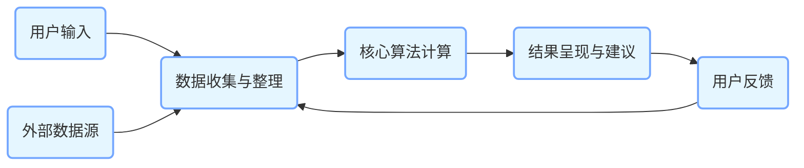

# 构建智能化的个人退休金缺口分析助手

> 关键词：智能化、个人退休金缺口分析、金融科技、数据分析、人工智能

> 摘要：本文旨在探讨如何构建一个智能化的个人退休金缺口分析助手。通过深入研究相关技术原理、算法实现以及实际应用场景，详细阐述了该助手从核心概念到项目实战的全流程。同时，分析了其在实际生活中的应用价值，推荐了学习、开发所需的工具和资源，并对未来发展趋势与挑战进行了展望。帮助读者全面了解如何打造一个高效、智能的个人退休金缺口分析解决方案。

## 1. 背景介绍 
### 1.1 目的和范围
随着人口老龄化的加剧，个人退休金规划变得愈发重要。然而，普通民众往往缺乏专业的金融知识和工具来准确评估自己的退休金缺口。本项目的目的是构建一个智能化的个人退休金缺口分析助手，帮助用户快速、准确地了解自己的退休金状况，并提供合理的规划建议。

本项目的范围涵盖了从数据收集、分析到结果呈现的整个流程，包括但不限于用户基本信息、收入情况、储蓄情况、投资计划等数据的处理，以及基于这些数据进行的退休金缺口计算和规划分析。

### 1.2 预期读者
本文的预期读者包括对金融科技、人工智能应用感兴趣的技术人员，如程序员、软件架构师等；从事金融规划、养老咨询等领域的专业人士；以及关注个人退休金规划的普通民众。

### 1.3 文档结构概述
本文将按照以下结构进行阐述：首先介绍核心概念与联系，包括个人退休金缺口的定义、相关因素以及智能化分析助手的架构；接着详细讲解核心算法原理和具体操作步骤，并用 Python 代码进行说明；然后给出数学模型和公式，并举例说明；之后通过项目实战展示代码的实际应用和详细解释；再探讨实际应用场景；推荐相关的工具和资源；最后总结未来发展趋势与挑战，并提供常见问题与解答以及扩展阅读和参考资料。

### 1.4 术语表
#### 1.4.1 核心术语定义
- **个人退休金缺口**：指个人在退休后预期的生活费用与预计可获得的退休金之间的差额。
- **智能化分析助手**：利用人工智能技术，对个人退休金相关数据进行收集、分析和处理，为用户提供退休金缺口计算和规划建议的工具。
- **养老金替代率**：指劳动者退休时的养老金领取水平与退休前工资收入水平之间的比率。

#### 1.4.2 相关概念解释
- **退休年龄**：指个人停止工作并开始领取退休金的年龄。不同国家和地区的法定退休年龄可能不同，同时个人也可以根据自身情况选择提前或延迟退休。
- **通货膨胀率**：是衡量物价水平随时间上涨的指标。在退休金规划中，需要考虑通货膨胀对未来生活费用的影响。
- **投资回报率**：指投资收益与投资成本之间的比率。合理的投资计划可以提高退休金的积累速度，但也伴随着一定的风险。

#### 1.4.3 缩略词列表
- **AI**：Artificial Intelligence，人工智能
- **API**：Application Programming Interface，应用程序编程接口
- **CSV**：Comma-Separated Values，逗号分隔值

## 2. 核心概念与联系 
### 核心概念原理
个人退休金缺口分析的核心原理是基于对个人未来收入、支出和资产的预测，计算出退休后所需的资金与预计可获得的退休金之间的差距。具体来说，需要考虑以下几个方面：

- **收入预测**：包括工资收入、投资收益、养老金等。工资收入可以根据当前的收入水平、职业发展规划和通货膨胀率进行预测；投资收益则需要考虑投资的种类、金额和预期回报率；养老金包括基本养老金、企业年金和个人商业养老保险等。
- **支出预测**：主要包括日常生活费用、医疗费用、旅游费用等。支出预测需要考虑通货膨胀率和生活水平的变化。
- **资产积累**：包括储蓄、投资等。资产积累的速度和规模会影响退休金的储备情况。

### 架构示意图


该架构图展示了智能化个人退休金缺口分析助手的主要流程。用户首先输入个人信息，同时系统从外部数据源收集相关数据，如通货膨胀率、投资回报率等。数据经过收集和整理后，进入核心算法计算模块，计算出退休金缺口并生成规划建议。结果呈现给用户后，用户可以提供反馈，反馈信息又会回到数据收集与整理模块，形成一个闭环的优化过程。

## 3. 核心算法原理 & 具体操作步骤 
### 核心算法原理
核心算法的主要目标是根据用户输入的信息和外部数据源，计算出个人的退休金缺口。具体步骤如下：

1. **收入预测**：
    - 对于工资收入，假设每年的增长率为 $g$，当前工资为 $S_0$，工作年限为 $n$，则第 $i$ 年的工资收入 $S_i$ 可以通过以下公式计算：
      $$S_i = S_0(1 + g)^i$$
    - 投资收益可以根据投资金额 $P$、预期回报率 $r$ 和投资年限 $n$ 计算。假设采用复利计算，第 $n$ 年的投资收益 $I_n$ 为：
      $$I_n = P(1 + r)^n - P$$
    - 养老金收入根据不同的养老金类型和计算规则进行预测。

2. **支出预测**：
    - 假设初始年支出为 $E_0$，通货膨胀率为 $f$，退休后生活年限为 $m$，则第 $j$ 年的支出 $E_j$ 为：
      $$E_j = E_0(1 + f)^j$$

3. **退休金缺口计算**：
    - 退休后总支出 $TE$ 为退休后每年支出的总和：
      $$TE=\sum_{j = 1}^{m}E_j$$
    - 退休后总收入 $TI$ 为工资收入、投资收益和养老金收入的总和。
    - 退休金缺口 $G$ 为：
      $$G = TE - TI$$

### 具体操作步骤
以下是使用 Python 实现上述核心算法的代码：

```python
def salary_prediction(S0, g, n):
    """
    工资收入预测
    :param S0: 当前工资
    :param g: 工资增长率
    :param n: 工作年限
    :return: 每年工资收入列表
    """
    salaries = []
    for i in range(n):
        salary = S0 * (1 + g) ** i
        salaries.append(salary)
    return salaries

def investment_income(P, r, n):
    """
    投资收益计算
    :param P: 投资金额
    :param r: 预期回报率
    :param n: 投资年限
    :return: 第 n 年的投资收益
    """
    income = P * (1 + r) ** n - P
    return income

def expense_prediction(E0, f, m):
    """
    支出预测
    :param E0: 初始年支出
    :param f: 通货膨胀率
    :param m: 退休后生活年限
    :return: 每年支出列表
    """
    expenses = []
    for j in range(m):
        expense = E0 * (1 + f) ** j
        expenses.append(expense)
    return expenses

def pension_gap_calculation(S0, g, n, P, r, E0, f, m, pension):
    """
    退休金缺口计算
    :param S0: 当前工资
    :param g: 工资增长率
    :param n: 工作年限
    :param P: 投资金额
    :param r: 预期回报率
    :param E0: 初始年支出
    :param f: 通货膨胀率
    :param m: 退休后生活年限
    :param pension: 养老金收入
    :return: 退休金缺口
    """
    # 工资收入预测
    salaries = salary_prediction(S0, g, n)
    total_salary = sum(salaries)
    # 投资收益计算
    inv_income = investment_income(P, r, n)
    # 支出预测
    expenses = expense_prediction(E0, f, m)
    total_expense = sum(expenses)
    # 总收入
    total_income = total_salary + inv_income + pension
    # 退休金缺口
    gap = total_expense - total_income
    return gap

# 示例参数
S0 = 50000  # 当前工资
g = 0.03  # 工资增长率
n = 30  # 工作年限
P = 100000  # 投资金额
r = 0.05  # 预期回报率
E0 = 30000  # 初始年支出
f = 0.02  # 通货膨胀率
m = 20  # 退休后生活年限
pension = 200000  # 养老金收入

gap = pension_gap_calculation(S0, g, n, P, r, E0, f, m, pension)
print(f"退休金缺口为: {gap} 元")
```

## 4. 数学模型和公式 & 详细讲解 & 举例说明 
### 数学模型和公式
#### 工资收入预测模型
如前文所述，第 $i$ 年的工资收入 $S_i$ 计算公式为：
$$S_i = S_0(1 + g)^i$$
其中，$S_0$ 为当前工资，$g$ 为工资增长率，$i$ 为工作年限。

#### 投资收益计算模型
采用复利计算，第 $n$ 年的投资收益 $I_n$ 公式为：
$$I_n = P(1 + r)^n - P$$
其中，$P$ 为投资金额，$r$ 为预期回报率，$n$ 为投资年限。

#### 支出预测模型
第 $j$ 年的支出 $E_j$ 计算公式为：
$$E_j = E_0(1 + f)^j$$
其中，$E_0$ 为初始年支出，$f$ 为通货膨胀率，$j$ 为退休后生活年限。

#### 退休金缺口计算模型
退休后总支出 $TE$ 为：
$$TE=\sum_{j = 1}^{m}E_j$$
退休后总收入 $TI$ 为工资收入、投资收益和养老金收入的总和。
退休金缺口 $G$ 为：
$$G = TE - TI$$

### 详细讲解
- **工资收入预测**：该模型假设工资每年以固定的增长率 $g$ 增长。在实际应用中，工资增长率可能会受到多种因素的影响，如职业发展、经济形势等。因此，在使用该模型时，可以根据不同的情况调整增长率。
- **投资收益计算**：复利计算是一种常见的投资收益计算方法，它考虑了投资收益的再投资。预期回报率 $r$ 是一个估计值，实际回报率可能会有所波动。在进行投资规划时，需要根据不同的投资产品和市场情况进行合理估计。
- **支出预测**：通货膨胀会导致物价上涨，从而增加生活成本。因此，在预测支出时，需要考虑通货膨胀率 $f$ 的影响。初始年支出 $E_0$ 可以根据当前的生活费用进行估算。
- **退休金缺口计算**：通过计算退休后总支出和总收入的差额，可以得到退休金缺口。如果缺口为正，说明退休金不足，需要采取相应的措施进行补充；如果缺口为负，则说明退休金有盈余。

### 举例说明
假设小张当前工资为 $50000$ 元，工资增长率为 $3\%$，工作年限为 $30$ 年，投资金额为 $100000$ 元，预期回报率为 $5\%$，初始年支出为 $30000$ 元，通货膨胀率为 $2\%$，退休后生活年限为 $20$ 年，养老金收入为 $200000$ 元。

- **工资收入预测**：
  根据公式 $S_i = S_0(1 + g)^i$，可以计算出每年的工资收入。例如，第 $10$ 年的工资收入为：
  $$S_{10} = 50000\times(1 + 0.03)^{10}\approx 67195.82$$
  工作 $30$ 年的总工资收入为：
  $$\sum_{i = 0}^{29}S_i=\sum_{i = 0}^{29}50000\times(1 + 0.03)^i\approx 2779327.87$$

- **投资收益计算**：
  根据公式 $I_n = P(1 + r)^n - P$，第 $30$ 年的投资收益为：
  $$I_{30} = 100000\times(1 + 0.05)^{30}-100000\approx 332194.24$$

- **支出预测**：
  根据公式 $E_j = E_0(1 + f)^j$，可以计算出每年的支出。例如，第 $10$ 年的支出为：
  $$E_{10} = 30000\times(1 + 0.02)^{10}\approx 36569.83$$
  退休后 $20$ 年的总支出为：
  $$\sum_{j = 1}^{20}E_j=\sum_{j = 1}^{20}30000\times(1 + 0.02)^j\approx 773849.61$$

- **退休金缺口计算**：
  退休后总收入为工资收入、投资收益和养老金收入的总和：
  $$TI = 2779327.87 + 332194.24 + 200000 = 3311522.11$$
  退休金缺口为：
  $$G = 773849.61 - 3311522.11=-2537672.5$$
  结果为负，说明小张的退休金有盈余。

## 5. 项目实战：代码实际案例和详细解释说明 
### 5.1  开发环境搭建
#### 安装 Python
首先，需要安装 Python 环境。可以从 Python 官方网站（https://www.python.org/downloads/）下载适合自己操作系统的 Python 版本，并按照安装向导进行安装。

#### 安装必要的库
在本项目中，主要使用 Python 的内置库，无需额外安装其他库。但如果需要进行数据可视化等操作，可以安装 `matplotlib` 等库。可以使用以下命令进行安装：
```sh
pip install matplotlib
```

### 5.2  源代码详细实现和代码解读
以下是一个完整的智能化个人退休金缺口分析助手的代码示例：

```python
import matplotlib.pyplot as plt

def salary_prediction(S0, g, n):
    """
    工资收入预测
    :param S0: 当前工资
    :param g: 工资增长率
    :param n: 工作年限
    :return: 每年工资收入列表
    """
    salaries = []
    for i in range(n):
        salary = S0 * (1 + g) ** i
        salaries.append(salary)
    return salaries

def investment_income(P, r, n):
    """
    投资收益计算
    :param P: 投资金额
    :param r: 预期回报率
    :param n: 投资年限
    :return: 第 n 年的投资收益
    """
    income = P * (1 + r) ** n - P
    return income

def expense_prediction(E0, f, m):
    """
    支出预测
    :param E0: 初始年支出
    :param f: 通货膨胀率
    :param m: 退休后生活年限
    :return: 每年支出列表
    """
    expenses = []
    for j in range(m):
        expense = E0 * (1 + f) ** j
        expenses.append(expense)
    return expenses

def pension_gap_calculation(S0, g, n, P, r, E0, f, m, pension):
    """
    退休金缺口计算
    :param S0: 当前工资
    :param g: 工资增长率
    :param n: 工作年限
    :param P: 投资金额
    :param r: 预期回报率
    :param E0: 初始年支出
    :param f: 通货膨胀率
    :param m: 退休后生活年限
    :param pension: 养老金收入
    :return: 退休金缺口
    """
    # 工资收入预测
    salaries = salary_prediction(S0, g, n)
    total_salary = sum(salaries)
    # 投资收益计算
    inv_income = investment_income(P, r, n)
    # 支出预测
    expenses = expense_prediction(E0, f, m)
    total_expense = sum(expenses)
    # 总收入
    total_income = total_salary + inv_income + pension
    # 退休金缺口
    gap = total_expense - total_income
    return gap

def plot_salary_expense(S0, g, n, E0, f, m):
    """
    绘制工资收入和支出预测曲线
    :param S0: 当前工资
    :param g: 工资增长率
    :param n: 工作年限
    :param E0: 初始年支出
    :param f: 通货膨胀率
    :param m: 退休后生活年限
    """
    salaries = salary_prediction(S0, g, n)
    expenses = expense_prediction(E0, f, m)
    years_salary = list(range(n))
    years_expense = [i + n for i in range(m)]
    plt.plot(years_salary, salaries, label='Salary')
    plt.plot(years_expense, expenses, label='Expense')
    plt.xlabel('Year')
    plt.ylabel('Amount')
    plt.title('Salary and Expense Prediction')
    plt.legend()
    plt.show()

# 示例参数
S0 = 50000  # 当前工资
g = 0.03  # 工资增长率
n = 30  # 工作年限
P = 100000  # 投资金额
r = 0.05  # 预期回报率
E0 = 30000  # 初始年支出
f = 0.02  # 通货膨胀率
m = 20  # 退休后生活年限
pension = 200000  # 养老金收入

# 计算退休金缺口
gap = pension_gap_calculation(S0, g, n, P, r, E0, f, m, pension)
print(f"退休金缺口为: {gap} 元")

# 绘制工资收入和支出预测曲线
plot_salary_expense(S0, g, n, E0, f, m)
```

### 5.3  代码解读与分析
#### 函数功能
- `salary_prediction`：根据当前工资、工资增长率和工作年限，预测每年的工资收入。
- `investment_income`：根据投资金额、预期回报率和投资年限，计算投资收益。
- `expense_prediction`：根据初始年支出、通货膨胀率和退休后生活年限，预测每年的支出。
- `pension_gap_calculation`：综合以上函数的结果，计算退休金缺口。
- `plot_salary_expense`：绘制工资收入和支出预测曲线，帮助用户直观地了解未来的收入和支出情况。

#### 代码执行流程
1. 定义示例参数，包括当前工资、工资增长率、工作年限等。
2. 调用 `pension_gap_calculation` 函数计算退休金缺口，并将结果打印输出。
3. 调用 `plot_salary_expense` 函数绘制工资收入和支出预测曲线。

通过这种方式，用户可以快速了解自己的退休金状况，并根据可视化结果进行规划调整。

## 6. 实际应用场景 
### 个人退休金规划
对于普通民众来说，智能化的个人退休金缺口分析助手可以帮助他们了解自己的退休金状况，制定合理的规划。例如，通过调整投资计划、增加储蓄等方式来弥补退休金缺口。

### 金融机构服务
金融机构可以将该助手集成到自己的服务平台中，为客户提供更加个性化的退休金规划服务。通过分析客户的财务状况和风险偏好，为客户推荐合适的投资产品和养老计划。

### 养老咨询服务
养老咨询机构可以利用该助手为客户提供专业的咨询服务。通过详细的数据分析和预测，为客户提供准确的退休金缺口信息和规划建议，帮助客户实现养老目标。

## 7. 工具和资源推荐
### 7.1 学习资源推荐
#### 7.1.1 书籍推荐
- 《金融数学》：介绍了金融领域中的数学模型和方法，对于理解退休金规划中的数学原理有很大帮助。
- 《Python 数据分析实战》：详细讲解了 Python 在数据分析领域的应用，包括数据处理、可视化等方面。
- 《人工智能：现代方法》：全面介绍了人工智能的基本概念、算法和应用，对于构建智能化的分析助手有重要的参考价值。

#### 7.1.2 在线课程
- Coursera 上的“Financial Engineering and Risk Management”：该课程涵盖了金融工程和风险管理的基础知识，对于理解退休金规划中的风险和收益有很大帮助。
- edX 上的“Python for Data Science”：通过实际案例介绍了 Python 在数据分析中的应用，适合初学者学习。
- Udemy 上的“Artificial Intelligence A-Z™: Learn How To Build An AI”：全面介绍了人工智能的各种技术和应用，包括机器学习、深度学习等。

#### 7.1.3 技术博客和网站
- Towards Data Science：提供了大量关于数据分析、人工智能等领域的技术文章和案例。
- Medium：有许多技术专家分享自己的经验和见解，对于学习和交流有很大帮助。
- Kaggle：是一个数据科学竞赛平台，上面有很多关于金融数据分析的项目和案例，可以学习和参考。

### 7.2 开发工具框架推荐
#### 7.2.1 IDE和编辑器
- PyCharm：是一款专门为 Python 开发设计的集成开发环境，具有强大的代码编辑、调试和项目管理功能。
- Jupyter Notebook：是一个交互式的开发环境，适合进行数据分析和可视化。可以方便地编写代码、展示结果和记录分析过程。
- Visual Studio Code：是一款轻量级的代码编辑器，支持多种编程语言，并且有丰富的插件可以扩展功能。

#### 7.2.2 调试和性能分析工具
- pdb：是 Python 的内置调试工具，可以帮助开发者逐行调试代码，查找问题。
- cProfile：是 Python 的性能分析工具，可以分析代码的运行时间和资源消耗情况，帮助开发者优化代码性能。
- Py-Spy：是一个轻量级的性能分析工具，可以实时监测 Python 程序的运行情况，找出性能瓶颈。

#### 7.2.3 相关框架和库
- Pandas：是一个强大的数据分析库，提供了高效的数据结构和数据处理功能，适合进行退休金数据的处理和分析。
- NumPy：是 Python 的科学计算库，提供了高效的数组操作和数学函数，对于实现核心算法有很大帮助。
- Matplotlib：是一个常用的数据可视化库，可以绘制各种类型的图表，帮助用户直观地了解分析结果。

### 7.3 相关论文著作推荐
#### 7.3.1 经典论文
- “A Theory of the Consumption Function” by Milton Friedman：提出了持久收入假说，对于理解个人消费和储蓄行为有重要的理论意义。
- “Portfolio Selection” by Harry Markowitz：奠定了现代投资组合理论的基础，对于退休金投资规划有重要的指导作用。

#### 7.3.2 最新研究成果
- 关注顶级金融学术期刊，如《Journal of Finance》、《Review of Financial Studies》等，这些期刊上经常发表关于退休金规划、金融风险管理等方面的最新研究成果。

#### 7.3.3 应用案例分析
- 可以参考一些金融机构或研究机构发布的关于退休金规划的案例分析报告，了解实际应用中的方法和经验。

## 8. 总结：未来发展趋势与挑战
### 未来发展趋势
- **智能化程度不断提高**：随着人工智能技术的不断发展，个人退休金缺口分析助手将具备更强的学习和推理能力，能够根据用户的行为和反馈不断优化分析结果和规划建议。
- **多维度数据融合**：除了传统的财务数据，未来的分析助手将融合更多维度的数据，如健康数据、社会环境数据等，提供更加全面和个性化的规划方案。
- **与金融科技生态融合**：分析助手将与金融科技生态中的其他服务进行深度融合，如投资平台、保险服务等，为用户提供一站式的退休金规划解决方案。

### 挑战
- **数据质量和安全问题**：准确的分析结果依赖于高质量的数据，但数据的收集、存储和使用过程中存在安全和隐私风险。如何保障数据的质量和安全是一个重要的挑战。
- **模型的准确性和可靠性**：退休金规划涉及到众多不确定因素，如经济形势、政策变化等。如何建立准确和可靠的模型，提高分析结果的可信度是一个亟待解决的问题。
- **用户教育和接受度**：普通民众对金融知识和智能化工具的了解和接受程度有限。如何提高用户的教育水平，增强用户对分析助手的信任和使用意愿是推广应用的关键。

## 9. 附录：常见问题与解答
### 问题 1：如何确定工资增长率和预期回报率？
工资增长率可以参考历史数据、行业平均水平和个人职业发展规划来确定。预期回报率则需要根据投资产品的类型、市场情况和风险偏好进行合理估计。可以咨询金融专家或参考相关的市场研究报告。

### 问题 2：如果退休金缺口为正，应该采取什么措施？
如果退休金缺口为正，可以考虑以下措施：增加储蓄、调整投资计划以提高投资回报率、延迟退休以增加工作年限和养老金收入、购买商业养老保险等。

### 问题 3：分析结果的准确性如何保证？
分析结果的准确性受到多种因素的影响，如数据的准确性、模型的合理性等。为了保证结果的准确性，需要尽可能收集准确和全面的数据，并使用经过验证的模型进行分析。同时，定期对分析结果进行评估和调整也是很重要的。

## 10. 扩展阅读 & 参考资料
- 《金融科技：从基础到创新》
- 《人工智能基础教程》
- 中国国家统计局官方网站（https://data.stats.gov.cn/），获取宏观经济数据。
- 中国银保监会官方网站（https://www.cbirc.gov.cn/），了解金融政策和监管信息。

作者：AI天才研究院/AI Genius Institute & 禅与计算机程序设计艺术 /Zen And The Art of Computer Programming