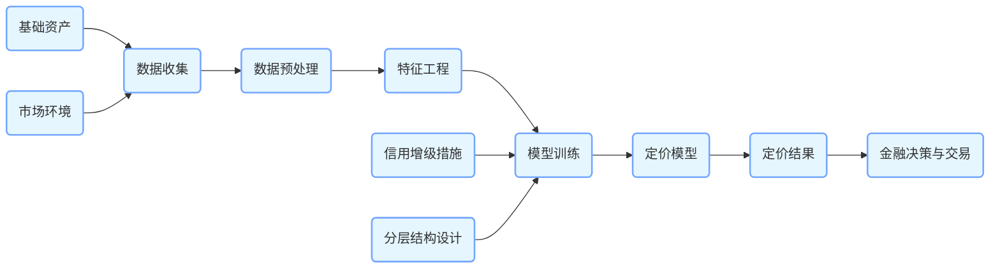

# 构建智能化的资产证券化定价模型

> 关键词：资产证券化、定价模型、智能化、机器学习、金融科技

> 摘要：本文围绕构建智能化的资产证券化定价模型展开深入探讨。资产证券化作为重要的金融创新工具，其定价的准确性对于金融市场的稳定和参与者的决策至关重要。传统定价模型存在一定局限性，而智能化定价模型借助先进的机器学习和数据分析技术，能够更好地处理复杂的市场信息和风险因素。文章详细介绍了资产证券化定价的核心概念与联系，阐述了相关核心算法原理及具体操作步骤，给出了数学模型和公式并举例说明，通过项目实战展示代码实现和解读，分析实际应用场景，推荐了相关工具和资源，最后总结未来发展趋势与挑战，旨在为构建更精准、高效的智能化资产证券化定价模型提供全面的理论和实践指导。

## 1. 背景介绍 
### 1.1 目的和范围
资产证券化是将缺乏流动性但具有可预期收入的资产，通过一定的结构安排，对资产中的风险与收益要素进行分离与重组，进而转换成为在金融市场上可以出售和流通的证券的过程。构建智能化的资产证券化定价模型的目的在于提高定价的准确性和效率，降低定价过程中的人为误差和不确定性，为金融机构、投资者等市场参与者提供更科学、合理的定价参考。

本文章的范围涵盖了资产证券化定价的基本理论、智能化定价模型的构建方法、相关算法原理、数学模型推导、项目实战以及实际应用场景等多个方面，旨在全面深入地探讨如何构建一个有效的智能化资产证券化定价模型。

### 1.2 预期读者
本文预期读者包括金融领域的从业者，如投资银行家、金融分析师、风险管理专家等，他们可以通过本文了解智能化定价模型在资产证券化业务中的应用，提升自身的业务能力和决策水平；计算机科学与人工智能领域的研究人员和开发者，能够从本文中获取金融领域的应用需求和问题，为相关技术的研究和开发提供方向；高校金融、计算机等相关专业的师生，可将本文作为学习和研究资产证券化定价及智能化技术的参考资料。

### 1.3 文档结构概述
本文首先介绍资产证券化定价的背景信息，包括目的、预期读者和文档结构概述等内容。接着阐述核心概念与联系，包括资产证券化的原理、定价模型的架构等，并通过文本示意图和 Mermaid 流程图进行直观展示。然后详细讲解核心算法原理及具体操作步骤，使用 Python 源代码进行说明。之后给出数学模型和公式，并结合实际例子进行详细讲解。通过项目实战部分展示代码实际案例，包括开发环境搭建、源代码实现和代码解读。分析实际应用场景，推荐相关的工具和资源，最后总结未来发展趋势与挑战，给出常见问题与解答以及扩展阅读和参考资料。

### 1.4 术语表
#### 1.4.1 核心术语定义
- **资产证券化（Asset Securitization）**：指将一组流动性较差但预计能产生稳定现金流的资产，通过一系列的结构设计和信用增级，转化为可以在金融市场上流通的证券的过程。
- **定价模型（Pricing Model）**：用于确定资产证券化产品价格的数学模型或算法，考虑了多种因素，如资产的现金流、风险、市场利率等。
- **智能化（Intelligence）**：在本文中，指利用机器学习、深度学习等人工智能技术，使定价模型能够自动学习和适应市场变化，提高定价的准确性和效率。
- **现金流（Cash Flow）**：指资产在未来一定时期内产生的现金收入和支出的金额。
- **信用增级（Credit Enhancement）**：通过各种手段提高资产证券化产品的信用质量，降低投资者面临的信用风险。

#### 1.4.2 相关概念解释
- **基础资产（Underlying Assets）**：是资产证券化的对象，如住房抵押贷款、汽车贷款、信用卡应收账款等。这些资产的质量和现金流特征直接影响资产证券化产品的定价。
- **特殊目的机构（Special Purpose Vehicle, SPV）**：是为实现资产证券化而专门设立的法律实体，其主要作用是隔离基础资产的风险，确保资产证券化产品的独立性和安全性。
- **分层结构（Tranching）**：将资产证券化产品按照风险和收益特征进行分层，不同层级的产品具有不同的优先级和收益率，以满足不同投资者的需求。

#### 1.4.3 缩略词列表
- **SPV**：Special Purpose Vehicle，特殊目的机构
- **ABS**：Asset - Backed Securities，资产支持证券
- **MBS**：Mortgage - Backed Securities，住房抵押贷款支持证券
- **CDO**：Collateralized Debt Obligation，担保债务凭证

## 2. 核心概念与联系 

### 资产证券化原理
资产证券化的基本原理是将一组具有相似风险和收益特征的基础资产组合在一起，通过特殊目的机构（SPV）进行隔离和重组，然后将其转化为证券向投资者发行。基础资产产生的现金流是资产证券化产品的收益来源，而信用增级措施则提高了产品的信用质量，降低了投资者的风险。

### 定价模型架构
智能化的资产证券化定价模型通常由数据层、模型层和应用层组成。数据层负责收集和整理与基础资产、市场环境等相关的数据；模型层利用机器学习、深度学习等算法对数据进行分析和建模，以确定资产证券化产品的价格；应用层则将定价结果应用于实际的金融决策和交易中。

### 文本示意图
资产证券化定价模型的核心概念联系可以用以下文本描述：基础资产的特征（如现金流、信用质量等）决定了资产证券化产品的基本价值，市场环境（如利率、市场流动性等）影响产品的价格波动。智能化定价模型通过对基础资产数据和市场数据的分析，结合信用增级措施和分层结构的考虑，最终确定产品的合理价格。

### Mermaid 流程图


## 3. 核心算法原理 & 具体操作步骤 

### 核心算法原理
在智能化的资产证券化定价模型中，常用的算法包括线性回归、决策树、随机森林和深度学习算法（如神经网络）等。下面以线性回归为例进行详细阐述。

线性回归是一种用于建立自变量和因变量之间线性关系的统计模型。在资产证券化定价中，我们可以将资产证券化产品的价格作为因变量，将基础资产的特征（如现金流、信用评级等）和市场环境因素（如利率、市场波动率等）作为自变量。线性回归模型的一般形式为：

$$y = \beta_0+\beta_1x_1+\beta_2x_2+\cdots+\beta_nx_n+\epsilon$$

其中，$y$ 是因变量（资产证券化产品的价格），$x_1,x_2,\cdots,x_n$ 是自变量，$\beta_0,\beta_1,\cdots,\beta_n$ 是回归系数，$\epsilon$ 是误差项。

### 具体操作步骤
#### 1. 数据收集
收集与资产证券化相关的数据，包括基础资产的信息（如贷款金额、期限、利率等）、市场环境数据（如基准利率、市场收益率等）以及资产证券化产品的历史价格数据。

#### 2. 数据预处理
对收集到的数据进行清洗、缺失值处理和异常值处理。例如，对于缺失的贷款期限数据，可以采用均值或中位数进行填充；对于异常的市场收益率数据，可以进行剔除或修正。

#### 3. 特征工程
从原始数据中提取有价值的特征，并进行特征选择和特征变换。例如，可以计算基础资产的平均现金流、信用评分等特征；对于一些非数值型特征，可以进行编码转换为数值型特征。

#### 4. 模型训练
将处理后的数据划分为训练集和测试集，使用训练集数据对线性回归模型进行训练，通过最小化误差平方和来估计回归系数。

#### 5. 模型评估
使用测试集数据对训练好的模型进行评估，常用的评估指标包括均方误差（MSE）、均方根误差（RMSE）和决定系数（$R^2$）等。

#### 6. 定价预测
使用训练好的模型对新的资产证券化产品进行定价预测。

### Python 源代码实现
```python
import numpy as np
import pandas as pd
from sklearn.model_selection import train_test_split
from sklearn.linear_model import LinearRegression
from sklearn.metrics import mean_squared_error, r2_score

# 1. 数据收集（假设已经有一个包含相关数据的 CSV 文件）
data = pd.read_csv('asset_securitization_data.csv')

# 2. 数据预处理
# 处理缺失值
data = data.dropna()

# 3. 特征工程
# 假设 'x1', 'x2', 'x3' 是自变量，'y' 是因变量
X = data[['x1', 'x2', 'x3']]
y = data['y']

# 4. 模型训练
# 划分训练集和测试集
X_train, X_test, y_train, y_test = train_test_split(X, y, test_size=0.2, random_state=42)

# 创建线性回归模型
model = LinearRegression()

# 训练模型
model.fit(X_train, y_train)

# 5. 模型评估
# 预测
y_pred = model.predict(X_test)

# 计算评估指标
mse = mean_squared_error(y_test, y_pred)
rmse = np.sqrt(mse)
r2 = r2_score(y_test, y_pred)

print(f"均方误差 (MSE): {mse}")
print(f"均方根误差 (RMSE): {rmse}")
print(f"决定系数 (R^2): {r2}")

# 6. 定价预测
# 假设新的数据
new_data = pd.DataFrame({'x1': [10], 'x2': [20], 'x3': [30]})
predicted_price = model.predict(new_data)
print(f"预测价格: {predicted_price[0]}")
```

## 4. 数学模型和公式 & 详细讲解 & 举例说明 

### 线性回归模型公式
如前面所述，线性回归模型的一般形式为：

$$y = \beta_0+\beta_1x_1+\beta_2x_2+\cdots+\beta_nx_n+\epsilon$$

其中，$\beta_0$ 是截距项，表示当所有自变量都为 0 时因变量的取值；$\beta_1,\beta_2,\cdots,\beta_n$ 是回归系数，表示自变量每变化一个单位时因变量的平均变化量；$\epsilon$ 是误差项，反映了模型无法解释的随机因素。

### 回归系数的估计
在实际应用中，我们需要根据样本数据来估计回归系数 $\beta_0,\beta_1,\cdots,\beta_n$。常用的方法是最小二乘法，即通过最小化误差平方和来估计回归系数。误差平方和的表达式为：

$$S(\beta_0,\beta_1,\cdots,\beta_n)=\sum_{i = 1}^{m}(y_i-\hat{y}_i)^2=\sum_{i = 1}^{m}(y_i-(\beta_0+\beta_1x_{i1}+\beta_2x_{i2}+\cdots+\beta_nx_{in}))^2$$

其中，$m$ 是样本数量，$y_i$ 是第 $i$ 个样本的实际值，$\hat{y}_i$ 是第 $i$ 个样本的预测值。

通过对 $S(\beta_0,\beta_1,\cdots,\beta_n)$ 求偏导数并令其等于 0，可以得到回归系数的估计值。对于简单线性回归（只有一个自变量），回归系数的估计公式为：

$$\hat{\beta}_1=\frac{\sum_{i = 1}^{m}(x_i-\bar{x})(y_i-\bar{y})}{\sum_{i = 1}^{m}(x_i-\bar{x})^2}$$

$$\hat{\beta}_0=\bar{y}-\hat{\beta}_1\bar{x}$$

其中，$\bar{x}$ 和 $\bar{y}$ 分别是自变量和因变量的样本均值。

### 举例说明
假设我们有以下关于资产证券化产品的数据：

| 基础资产现金流 ($x$) | 产品价格 ($y$) |
|---|---|
| 10 | 50 |
| 20 | 60 |
| 30 | 70 |
| 40 | 80 |
| 50 | 90 |

首先计算样本均值：

$$\bar{x}=\frac{10 + 20+30+40+50}{5}=30$$

$$\bar{y}=\frac{50 + 60+70+80+90}{5}=70$$

然后计算回归系数：

$$\sum_{i = 1}^{5}(x_i-\bar{x})(y_i-\bar{y})=(10 - 30)(50 - 70)+(20 - 30)(60 - 70)+(30 - 30)(70 - 70)+(40 - 30)(80 - 70)+(50 - 30)(90 - 70)$$

$$=(-20)\times(-20)+(-10)\times(-10)+0\times0+10\times10+20\times20$$

$$=400 + 100+0+100+400=1000$$

$$\sum_{i = 1}^{5}(x_i-\bar{x})^2=(10 - 30)^2+(20 - 30)^2+(30 - 30)^2+(40 - 30)^2+(50 - 30)^2$$

$$=(-20)^2+(-10)^2+0^2+10^2+20^2$$

$$=400 + 100+0+100+400=1000$$

$$\hat{\beta}_1=\frac{1000}{1000}=1$$

$$\hat{\beta}_0=70 - 1\times30=40$$

所以，线性回归模型为 $y = 40+x$。当基础资产现金流为 60 时，预测产品价格为 $y = 40+60 = 100$。

## 5. 项目实战：代码实际案例和详细解释说明 

### 5.1  开发环境搭建
#### 操作系统
可以选择 Windows、Linux 或 macOS 操作系统。本项目实战以 Windows 10 为例进行说明。

#### 编程语言和版本
使用 Python 3.8 及以上版本。可以从 Python 官方网站（https://www.python.org/downloads/） 下载并安装 Python。

#### 开发工具
推荐使用 Anaconda 作为 Python 开发环境的管理工具。Anaconda 包含了 Python 解释器以及许多常用的科学计算库，如 NumPy、Pandas、Scikit - learn 等。可以从 Anaconda 官方网站（https://www.anaconda.com/products/individual） 下载并安装 Anaconda。

#### 安装必要的库
打开 Anaconda Prompt，输入以下命令安装必要的库：

```sh
pip install numpy pandas scikit-learn matplotlib
```

### 5.2  源代码详细实现和代码解读
```python
import numpy as np
import pandas as pd
from sklearn.model_selection import train_test_split
from sklearn.ensemble import RandomForestRegressor
from sklearn.metrics import mean_squared_error, r2_score
import matplotlib.pyplot as plt

# 1. 数据收集（假设已经有一个包含相关数据的 CSV 文件）
data = pd.read_csv('asset_securitization_data.csv')

# 2. 数据预处理
# 处理缺失值
data = data.dropna()

# 3. 特征工程
# 假设 'feature1', 'feature2', 'feature3' 是自变量，'price' 是因变量
X = data[['feature1', 'feature2', 'feature3']]
y = data['price']

# 4. 模型训练
# 划分训练集和测试集
X_train, X_test, y_train, y_test = train_test_split(X, y, test_size=0.2, random_state=42)

# 创建随机森林回归模型
model = RandomForestRegressor(n_estimators=100, random_state=42)

# 训练模型
model.fit(X_train, y_train)

# 5. 模型评估
# 预测
y_pred = model.predict(X_test)

# 计算评估指标
mse = mean_squared_error(y_test, y_pred)
rmse = np.sqrt(mse)
r2 = r2_score(y_test, y_pred)

print(f"均方误差 (MSE): {mse}")
print(f"均方根误差 (RMSE): {rmse}")
print(f"决定系数 (R^2): {r2}")

# 6. 可视化结果
plt.scatter(y_test, y_pred)
